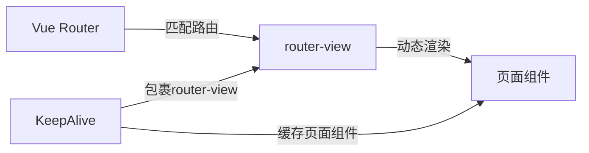

扫描[二维码](https://api2.cmdragon.cn/upload/cmder/20250304_012821924.jpg)关注或者微信搜一搜：`编程智域 前端至全栈交流与成长`

[发现1000+提升效率与开发的AI工具和实用程序](https://tools.cmdragon.cn/zh/apps?category=ai_chat)：https://tools.cmdragon.cn/

## 一、从动态组件到路由页面

前面几篇咱学的KeepAlive都是配合 `<component :is="xxx">` 动态组件来用的，但说实话，实际项目里很少有人用动态组件来做页面切换。大家更常用的是Vue Router——通过路由来切换页面。

那问题来了：**KeepAlive能配合Vue Router用吗？**

当然能！`<router-view>` 本质上也是一个动态组件，它根据当前路由动态渲染对应的页面组件。所以KeepAlive包router-view是完全没问题的。



## 二、最简单的路由缓存

最简单的用法，直接用KeepAlive包router-view：

```vue
<!-- App.vue -->
<template>
  <nav>
    <router-link to="/list">列表页</router-link>
    <router-link to="/detail">详情页</router-link>
  </nav>

  <router-view v-slot="{ Component }">
    <KeepAlive>
      <component :is="Component" />
    </KeepAlive>
  </router-view>
</template>
```

注意这里用了 `v-slot="{ Component }"` 来获取router-view渲染的组件，然后用 `<component :is="Component" />` 来渲染它。这是Vue Router官方推荐的写法，因为KeepAlive需要直接包裹一个组件元素。

这样写之后，**所有路由页面都会被缓存**。但问题跟之前一样——不是所有页面都需要缓存。

## 三、用路由meta控制缓存

更好的做法是在路由配置中用 `meta` 字段标记哪些页面需要缓存，然后动态生成include列表。

### 第一步：路由配置中标记

```javascript
// router/index.js
import { createRouter, createWebHistory } from "vue-router";

const routes = [
  {
    path: "/list",
    name: "ListPage",
    component: () => import("../views/ListPage.vue"),
    meta: { keepAlive: true }, // 需要缓存
  },
  {
    path: "/detail/:id",
    name: "DetailPage",
    component: () => import("../views/DetailPage.vue"),
    meta: { keepAlive: false }, // 不需要缓存
  },
  {
    path: "/settings",
    name: "SettingsPage",
    component: () => import("../views/SettingsPage.vue"),
    meta: { keepAlive: true }, // 需要缓存
  },
];

const router = createRouter({
  history: createWebHistory(),
  routes,
});

export default router;
```

### 第二步：动态生成include

```vue
<!-- App.vue -->
<script setup>
import { computed } from "vue";
import { useRouter } from "vue-router";

const router = useRouter();

// 从路由配置中收集所有需要缓存的路由name
const keepAliveInclude = computed(() => {
  return router
    .getRoutes()
    .filter((route) => route.meta.keepAlive)
    .map((route) => route.name);
});
</script>

<template>
  <nav>
    <router-link to="/list">列表页</router-link>
    <router-link to="/detail">详情页</router-link>
    <router-link to="/settings">设置页</router-link>
  </nav>

  <router-view v-slot="{ Component }">
    <KeepAlive :include="keepAliveInclude">
      <component :is="Component" />
    </KeepAlive>
  </router-view>
</template>
```

这样只有 `meta.keepAlive` 为 `true` 的页面才会被缓存，其他页面切换时正常销毁和重建。

### 第三步：确保组件name和路由name一致

这是最容易踩坑的地方——**include匹配的是组件的name，不是路由的name**。但我们在include里用的是路由的name，所以必须确保两者一致。

```vue
<!-- ListPage.vue -->
<script setup>
// 文件名是ListPage.vue，自动生成的name就是ListPage
// 和路由配置里的name: 'ListPage'一致，没问题
</script>
```

如果文件名和路由name不一致，需要手动声明：

```vue
<script setup>
defineOptions({ name: "ListPage" }); // 手动声明，确保和路由name一致
</script>
```

## 四、列表页到详情页再返回的经典场景

这是KeepAlive配合Vue Router最常见的场景：用户在列表页浏览，点击进入详情页，然后返回列表页，希望列表页的状态（滚动位置、筛选条件、已加载数据）还在。

### 路由配置

```javascript
const routes = [
  {
    path: "/list",
    name: "ListPage",
    component: () => import("../views/ListPage.vue"),
    meta: { keepAlive: true }, // 列表页需要缓存
  },
  {
    path: "/detail/:id",
    name: "DetailPage",
    component: () => import("../views/DetailPage.vue"),
    meta: { keepAlive: false }, // 详情页不需要缓存
  },
];
```

### 列表页组件

```vue
<!-- ListPage.vue -->
<script setup>
import { ref, onActivated, onDeactivated } from "vue";
import { useRouter } from "vue-router";

defineOptions({ name: "ListPage" });

const router = useRouter();
const list = ref([]);
const scrollTop = ref(0);
const searchQuery = ref("");
const lastFetchTime = ref(null);
const listRef = ref(null);

async function fetchData(force = false) {
  if (!force && lastFetchTime.value) {
    const elapsed = Date.now() - lastFetchTime.value;
    if (elapsed < 60000) return; // 1分钟内不刷新
  }

  const res = await fetch(`/api/list?q=${searchQuery.value}`);
  list.value = await res.json();
  lastFetchTime.value = Date.now();
}

function goToDetail(id) {
  router.push(`/detail/${id}`);
}

onActivated(() => {
  if (listRef.value && scrollTop.value) {
    listRef.value.scrollTop = scrollTop.value;
  }
  fetchData();
});

onDeactivated(() => {
  if (listRef.value) {
    scrollTop.value = listRef.value.scrollTop;
  }
});

// 初始加载
fetchData(true);
</script>

<template>
  <div>
    <input
      v-model="searchQuery"
      placeholder="搜索..."
      @keyup.enter="fetchData(true)"
    />
    <div ref="listRef" style="height: 600px; overflow-y: auto;">
      <div v-for="item in list" :key="item.id" @click="goToDetail(item.id)">
        {{ item.name }}
      </div>
    </div>
  </div>
</template>
```

### 详情页组件

```vue
<!-- DetailPage.vue -->
<script setup>
import { ref, onMounted } from "vue";
import { useRoute } from "vue-router";

defineOptions({ name: "DetailPage" });

const route = useRoute();
const detail = ref(null);

onMounted(async () => {
  const res = await fetch(`/api/detail/${route.params.id}`);
  detail.value = await res.json();
});
</script>

<template>
  <div v-if="detail">
    <h2>{{ detail.title }}</h2>
    <p>{{ detail.content }}</p>
  </div>
</template>
```

## 五、动态添加和移除缓存

有些场景更复杂——同一个页面，有时候需要缓存，有时候不需要。

比如：从列表页进入详情页时缓存列表页，但从详情页进入编辑页时不缓存详情页。或者用户手动刷新了列表页，需要清除缓存重新加载。

### 方案1：响应式include数组

```vue
<script setup>
import { ref, computed } from "vue";
import { useRouter } from "vue-router";

const router = useRouter();
const cachedViews = ref(new Set());

// 初始化：从路由meta中收集需要缓存的页面
router.getRoutes().forEach((route) => {
  if (route.meta.keepAlive) {
    cachedViews.value.add(route.name);
  }
});

const keepAliveInclude = computed(() => Array.from(cachedViews.value));

// 动态添加缓存
function addCache(viewName) {
  cachedViews.value.add(viewName);
}

// 动态移除缓存
function removeCache(viewName) {
  cachedViews.value.delete(viewName);
}
</script>
```

### 方案2：路由守卫中控制

在组件内用 `onBeforeRouteLeave` 判断离开方向：

```vue
<script setup>
import { onBeforeRouteLeave } from "vue-router";

onBeforeRouteLeave((to, from) => {
  // 如果是去详情页，缓存当前列表页
  if (to.name === "DetailPage") {
    // 列表页已经在include里了，不用额外操作
  }
  // 如果是去其他页面，可以考虑移除缓存
});
</script>
```

## 六、多级路由的缓存问题

如果你的路由是嵌套的（多级路由），要注意每一层的 `router-view` 都需要单独处理KeepAlive。

```javascript
const routes = [
  {
    path: "/",
    component: Layout,
    children: [
      {
        path: "list",
        name: "ListPage",
        component: () => import("../views/ListPage.vue"),
        meta: { keepAlive: true },
      },
    ],
  },
];
```

在Layout组件中：

```vue
<!-- Layout.vue -->
<template>
  <div>
    <sidebar />
    <main>
      <router-view v-slot="{ Component }">
        <KeepAlive :include="keepAliveInclude">
          <component :is="Component" />
        </KeepAlive>
      </router-view>
    </main>
  </div>
</template>
```

注意事项：

1. KeepAlive要放在最内层的router-view旁边
2. 嵌套路由中，父组件Layout不会被KeepAlive缓存（它一直都在），只有子页面组件会被缓存
3. 确保组件name在所有层级都是唯一的

## 课后Quiz

### 问题1：KeepAlive配合router-view时，include匹配的是路由的path还是组件的name？

**答案解析：** 匹配的是**组件的name**，不是路由的path。include/exclude始终根据组件的name选项来匹配。所以路由配置中的name要和组件的name保持一致，否则缓存不生效。

### 问题2：如何在路由配置中标记哪些页面需要缓存？

**答案解析：** 在路由配置的meta字段中添加自定义标记，比如 `meta: { keepAlive: true }`。然后在App.vue中通过 `router.getRoutes()` 收集所有 `meta.keepAlive` 为true的路由name，动态生成include列表。

## 常见报错解决方案

### 1. 路由缓存不生效

**错误现象：** 配了meta.keepAlive和include，但页面切换后状态还是丢了。

**可能原因：** 组件的name和路由的name不一致。include匹配的是组件name，如果组件自动生成的name（来自文件名）和路由配置的name对不上，就不会被缓存。

**解决方案：** 在组件中用 `defineOptions({ name: 'xxx' })` 手动声明name，确保和路由name一致。

### 2. 所有页面都被缓存了

**错误现象：** 没有设置include，所有路由页面都被缓存了。

**可能原因：** KeepAlive默认缓存所有子组件，没有设置include过滤。

**解决方案：** 添加 `:include` 属性，只缓存需要的页面。

### 3. 返回列表页数据没有刷新

**错误现象：** 从详情页返回列表页，看到的是旧数据。

**可能原因：** 缓存的列表页数据没有更新。KeepAlive只负责保持状态，不会自动刷新数据。

**解决方案：** 在列表页的 `onActivated` 钩子中判断是否需要刷新数据。可以用时间戳判断数据是否过期，或者用路由query参数标记是否需要刷新。

参考链接：

- https://cn.vuejs.org/guide/built-ins/keep-alive.html
- https://router.vuejs.org/zh/guide/advanced/navigation-guards.html

余下文章内容请点击跳转至 个人博客页面 或者 扫描[二维码](https://api2.cmdragon.cn/upload/cmder/20250304_012821924.jpg)关注或者微信搜一搜：`编程智域 前端至全栈交流与成长`，阅读完整的文章：[KeepAlive搭配Vue Router，页面缓存到底怎么玩](https://blog.cmdragon.cn/posts/k5e6f7a8b9c0d1e2f3a4b5c6d7e8f9a0/)

<details>
<summary>往期文章归档</summary>

- [Vue 3 静态与动态 Props 如何传递？TypeScript 类型约束有何必要？](https://blog.cmdragon.cn/posts/94ab48753b64780ca3ab7a7115ae8522/)
- [Vue 3中组件局部注册的优势与实现方式如何？](https://blog.cmdragon.cn/posts/dbf576e744870f6de26fd8a2e03e47da/)
- [如何在Vue3中优化生命周期钩子性能并规避常见陷阱？](https://blog.cmdragon.cn/posts/12d98b3b9ccd6c19a1b169d720ac5c80/)
- [Vue 3 Composition API生命周期钩子：如何实现从基础理解到高阶复用？](https://blog.cmdragon.cn/posts/8884e2b70287fcb263c57648eeb27419/)
- [Vue 3生命周期钩子实战指南：如何正确选择onMounted、onUpdated与onUnmounted的应用场景？](https://blog.cmdragon.cn/posts/883c6dbc50ae4183770a4462e0b8ae4d/)

</details>

<details>
<summary>免费好用的热门在线工具</summary>

- [多直播聚合器 - 应用商店 | By cmdragon](https://tools.cmdragon.cn/zh/apps/multi-live-aggregator)
- [Proto文件生成器 - 应用商店 | By cmdragon](https://tools.cmdragon.cn/zh/apps/proto-file-generator)
- [图片转粒子 - 应用商店 | By cmdragon](https://tools.cmdragon.cn/zh/apps/image-to-particles)
- [视频下载器 - 应用商店 | By cmdragon](https://tools.cmdragon.cn/zh/apps/video-downloader)
- [文件格式转换器 - 应用商店 | By cmdragon](https://tools.cmdragon.cn/zh/apps/file-converter)
- [M3U8在线播放器 - 应用商店 | By cmdragon](https://tools.cmdragon.cn/zh/apps/m3u8-player)
- [CMDragon 在线工具 - 高级AI工具箱与开发者套件 | 免费好用的在线工具](https://tools.cmdragon.cn/zh)
- [应用商店 - 发现1000+提升效率与开发的AI工具和实用程序 | 免费好用的在线工具](https://tools.cmdragon.cn/zh/apps?category=trending)

</details>
