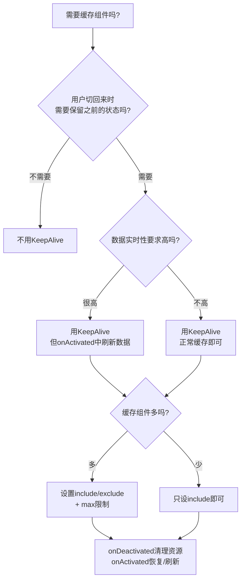

扫描[二维码](https://api2.cmdragon.cn/upload/cmder/20250304_012821924.jpg)关注或者微信搜一搜：`编程智域 前端至全栈交流与成长`

[发现1000+提升效率与开发的AI工具和实用程序](https://tools.cmdragon.cn/zh/apps?category=ai_chat)：https://tools.cmdragon.cn/

## 一、坑1：内存泄漏——缓存组件里的"定时炸弹"

KeepAlive缓存组件很爽，但很多人忽略了一个严重问题——**缓存组件里的定时器和事件监听器不会自动清理**。

组件虽然去冬眠了，但setInterval还在后台跑着呢，跟偷电一样。你每缓存一个带定时器的组件，就多了一个"定时炸弹"，内存占用蹭蹭往上涨。

### 错误写法

```vue
<script setup>
import { onMounted } from "vue";

let timer = null;

onMounted(() => {
  // 每5秒轮询一次数据
  timer = setInterval(() => {
    console.log("轮询中...");
    fetchData();
  }, 5000);
});

// 问题：组件被缓存时，timer不会停止！
// 切走后这个定时器还在跑，白占资源
</script>
```

### 正确写法

```vue
<script setup>
import { onMounted, onActivated, onDeactivated, onUnmounted } from "vue";

let timer = null;

function startPolling() {
  stopPolling(); // 先停掉之前的，防止重复
  timer = setInterval(() => {
    console.log("轮询中...");
    fetchData();
  }, 5000);
}

function stopPolling() {
  if (timer) {
    clearInterval(timer);
    timer = null;
  }
}

onMounted(() => {
  startPolling();
});

// 冬眠时暂停定时器
onDeactivated(() => {
  stopPolling();
});

// 唤醒时恢复定时器
onActivated(() => {
  startPolling();
});

// 真正销毁时也清理
onUnmounted(() => {
  stopPolling();
});
</script>
```

同样的道理，addEventListener也要在onDeactivated中removeEventListener，否则事件监听器会越积越多。

## 二、坑2：数据陈旧——缓存里的"僵尸数据"

缓存组件的数据不会自动更新。用户切走5分钟再切回来，看到的还是5分钟前的旧数据。如果是用户信息、订单状态、库存数量这种实时性要求高的数据，那可就出大问题了。

### 解决方案1：onActivated中智能刷新

```vue
<script setup>
import { ref, onActivated } from "vue";

const dataList = ref([]);
const lastFetchTime = ref(0);

onActivated(() => {
  const now = Date.now();
  const elapsed = now - lastFetchTime.value;

  // 超过2分钟就刷新
  if (elapsed > 2 * 60 * 1000) {
    fetchData();
  }
});

async function fetchData() {
  const res = await fetch("/api/list");
  dataList.value = await res.json();
  lastFetchTime.value = Date.now();
}
</script>
```

### 解决方案2：结合Pinia做数据版本控制

```vue
<script setup>
import { onActivated } from "vue";
import { useDataStore } from "@/stores/data";

const dataStore = useDataStore();

onActivated(() => {
  // 检查store中的数据版本是否更新了
  if (dataStore.listVersion > currentVersion) {
    dataList.value = dataStore.list;
    currentVersion = dataStore.listVersion;
  }
});
</script>
```

### 解决方案3：路由meta标记强制刷新

```javascript
// 从详情页返回时，在query中标记需要刷新
router.push({ path: "/list", query: { refresh: "1" } });
```

```vue
<script setup>
import { onActivated } from "vue";
import { useRoute } from "vue-router";

const route = useRoute();

onActivated(() => {
  if (route.query.refresh === "1") {
    fetchData();
  }
});
</script>
```

## 三、坑3：不该用KeepAlive的场景

不是所有东西都该放冰箱的，热菜放进去反而坏了。KeepAlive也一样，有些场景用了反而添乱。

| 适合缓存的场景               | 不适合缓存的场景               |
| ---------------------------- | ------------------------------ |
| 列表页（保留滚动位置和筛选） | 实时监控页（数据需要持续更新） |
| 表单填写页（防止误切丢失）   | 表单提交成功页（一次性展示）   |
| 设置页（切换回来不重载）     | 支付页（敏感信息不该缓存）     |
| 搜索页（保留搜索历史）       | 引导页/欢迎页（只展示一次）    |
| 多步骤表单（保留进度）       | 数据变化频繁的仪表盘           |

说白了，**只有用户需要"回来继续"的页面才值得缓存**。如果用户每次进入都期望看到最新数据，那就别缓存。

## 四、坑4：KeepAlive和Transition一起用

想让缓存组件切换时有点过渡动画？那KeepAlive和Transition就得一起上场了。但**嵌套顺序很重要**！

### 正确顺序：Transition在外，KeepAlive在内

```vue
<router-view v-slot="{ Component }">
  <Transition name="fade" mode="out-in">
    <KeepAlive>
      <component :is="Component" />
    </KeepAlive>
  </Transition>
</router-view>
```

### 错误顺序：KeepAlive在外，Transition在内

```vue
<!-- 这样过渡动画可能不生效！ -->
<router-view v-slot="{ Component }">
  <KeepAlive>
    <Transition name="fade" mode="out-in">
      <component :is="Component" />
    </Transition>
  </KeepAlive>
</router-view>
```

为啥呢？因为Transition需要监听子组件的挂载/卸载来触发动画。如果KeepAlive在外面，组件切走时不会被卸载（只是deactivated），Transition就感知不到变化，动画自然就不生效了。

把Transition放在外面，KeepAlive在里面，这样Transition能看到组件的"出现"和"消失"，动画就能正常播放了。

## 五、坑5：缓存组件的props更新问题

缓存组件有个容易忽略的问题：**组件被缓存后，props变化时组件会更新但不会重新创建**。

如果你的组件在onMounted中根据props初始化数据，那缓存后props变化时，onMounted不会再触发，初始化逻辑就不会重新执行。

### 问题代码

```vue
<script setup>
import { ref, onMounted } from "vue";

const props = defineProps(["userId"]);
const userData = ref(null);

onMounted(async () => {
  // 只有首次挂载时执行
  // 缓存后userId变了，这里不会再执行！
  const res = await fetch(`/api/user/${props.userId}`);
  userData.value = await res.json();
});
</script>
```

### 解决方案1：watch监听props

```vue
<script setup>
import { ref, watch } from "vue";

const props = defineProps(["userId"]);
const userData = ref(null);

async function loadUser(id) {
  const res = await fetch(`/api/user/${id}`);
  userData.value = await res.json();
}

// props变化时重新加载
watch(
  () => props.userId,
  (newId) => {
    loadUser(newId);
  },
  { immediate: true },
);
</script>
```

### 解决方案2：onActivated中处理

```vue
<script setup>
import { ref, onActivated } from "vue";

const props = defineProps(["userId"]);
const userData = ref(null);

onActivated(async () => {
  // 每次激活时根据当前props重新加载
  const res = await fetch(`/api/user/${props.userId}`);
  userData.value = await res.json();
});
</script>
```

### 解决方案3：用key强制重建

如果你就是想让某些情况下组件重新创建，可以用key：

```vue
<KeepAlive>
  <UserDetail :key="userId" :user-id="userId" />
</KeepAlive>
```

当key变化时，KeepAlive会销毁旧实例创建新实例。但这样缓存就失效了，所以只在确实需要的时候才用。

## 六、最佳实践总结



**核心原则：**

1. **只缓存需要的组件** — 用include/exclude精准控制
2. **设置合理的max限制** — 防止内存无限增长
3. **onDeactivated中清理资源** — 定时器、事件监听器必须暂停
4. **onActivated中刷新数据** — 根据时间戳或标记智能刷新
5. **组件name和路由name保持一致** — 否则缓存不生效
6. **Transition在外，KeepAlive在内** — 嵌套顺序别搞反

| 场景        | 建议                            |
| ----------- | ------------------------------- |
| 列表页      | 缓存，onActivated智能刷新       |
| 详情页      | 不缓存，每次重新加载            |
| 表单页      | 缓存，防止误切丢失              |
| 实时数据页  | 不缓存，或缓存+每次激活强制刷新 |
| 设置页      | 缓存，不需要频繁刷新            |
| 支付/敏感页 | 绝对不缓存                      |

## 课后Quiz

### 问题1：缓存组件中的setInterval在组件被deactivated后还会继续执行吗？

**答案解析：** 会的！setInterval是浏览器API，跟Vue的生命周期没有关系。组件被deactivated只是从DOM上移除了，但定时器还在后台跑着。所以必须在onDeactivated中手动clearInterval，否则会造成内存泄漏和性能问题。

### 问题2：KeepAlive和Transition嵌套时，谁应该在外层？

**答案解析：** Transition应该在外层，KeepAlive应该在内层。因为Transition需要监听子组件的挂载/卸载来触发过渡动画，如果KeepAlive在外面，组件切走时不会被卸载（只是deactivated），Transition就感知不到变化，动画不会生效。

## 常见报错解决方案

### 1. 缓存页面内存持续增长

**错误现象：** 随着使用时间增长，页面越来越卡，Chrome DevTools显示内存占用持续上升。

**可能原因：** 缓存组件中的定时器、事件监听器、大数组没有在onDeactivated中清理。

**解决方案：** 在每个缓存组件的onDeactivated中检查并清理：clearInterval/clearTimeout、removeEventListener、释放大数组引用。在onActivated中按需恢复。

### 2. 缓存页面数据不更新

**错误现象：** 从其他页面返回缓存页面，看到的是旧数据。

**可能原因：** 缓存组件的数据不会自动更新，onActivated中没有刷新逻辑。

**解决方案：** 在onActivated中添加数据刷新逻辑，可以用时间戳判断数据是否过期，或者用路由query参数标记需要强制刷新。

### 3. Transition动画不生效

**错误现象：** KeepAlive包裹的组件切换时没有过渡动画。

**可能原因：** KeepAlive和Transition嵌套顺序错误，KeepAlive在外层导致Transition感知不到组件变化。

**解决方案：** 调整嵌套顺序，Transition在外，KeepAlive在内。

参考链接：

- https://cn.vuejs.org/guide/built-ins/keep-alive.html
- https://cn.vuejs.org/guide/built-ins/transition.html

余下文章内容请点击跳转至 个人博客页面 或者 扫描[二维码](https://api2.cmdragon.cn/upload/cmder/20250304_012821924.jpg)关注或者微信搜一搜：`编程智域 前端至全栈交流与成长`，阅读完整的文章：[KeepAlive踩坑指南——内存泄漏、数据陈旧和不该用的场景](https://blog.cmdragon.cn/posts/k6f7a8b9c0d1e2f3a4b5c6d7e8f9a0b1/)

<details>
<summary>往期文章归档</summary>

- [Vue 3 静态与动态 Props 如何传递？TypeScript 类型约束有何必要？](https://blog.cmdragon.cn/posts/94ab48753b64780ca3ab7a7115ae8522/)
- [Vue 3中组件局部注册的优势与实现方式如何？](https://blog.cmdragon.cn/posts/dbf576e744870f6de26fd8a2e03e47da/)
- [如何在Vue3中优化生命周期钩子性能并规避常见陷阱？](https://blog.cmdragon.cn/posts/12d98b3b9ccd6c19a1b169d720ac5c80/)
- [Vue 3 Composition API生命周期钩子：如何实现从基础理解到高阶复用？](https://blog.cmdragon.cn/posts/8884e2b70287fcb263c57648eeb27419/)
- [Vue 3生命周期钩子实战指南：如何正确选择onMounted、onUpdated与onUnmounted的应用场景？](https://blog.cmdragon.cn/posts/883c6dbc50ae4183770a4462e0b8ae4d/)

</details>

<details>
<summary>免费好用的热门在线工具</summary>

- [多直播聚合器 - 应用商店 | By cmdragon](https://tools.cmdragon.cn/zh/apps/multi-live-aggregator)
- [Proto文件生成器 - 应用商店 | By cmdragon](https://tools.cmdragon.cn/zh/apps/proto-file-generator)
- [图片转粒子 - 应用商店 | By cmdragon](https://tools.cmdragon.cn/zh/apps/image-to-particles)
- [视频下载器 - 应用商店 | By cmdragon](https://tools.cmdragon.cn/zh/apps/video-downloader)
- [文件格式转换器 - 应用商店 | By cmdragon](https://tools.cmdragon.cn/zh/apps/file-converter)
- [M3U8在线播放器 - 应用商店 | By cmdragon](https://tools.cmdragon.cn/zh/apps/m3u8-player)
- [CMDragon 在线工具 - 高级AI工具箱与开发者套件 | 免费好用的在线工具](https://tools.cmdragon.cn/zh)
- [应用商店 - 发现1000+提升效率与开发的AI工具和实用程序 | 免费好用的在线工具](https://tools.cmdragon.cn/zh/apps?category=trending)

</details>
