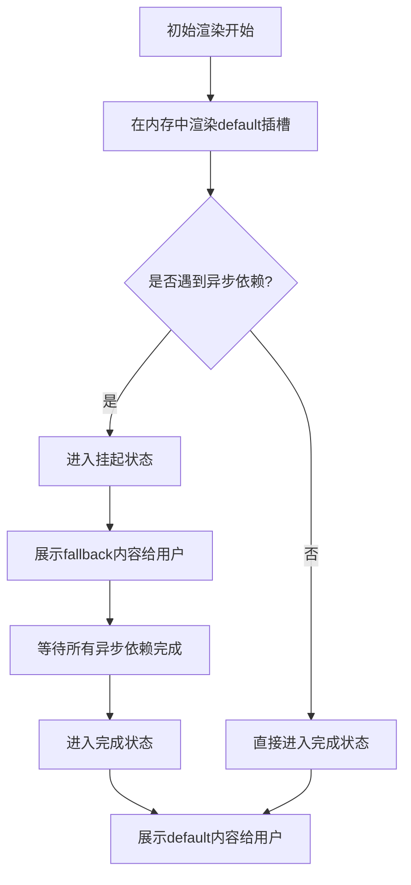
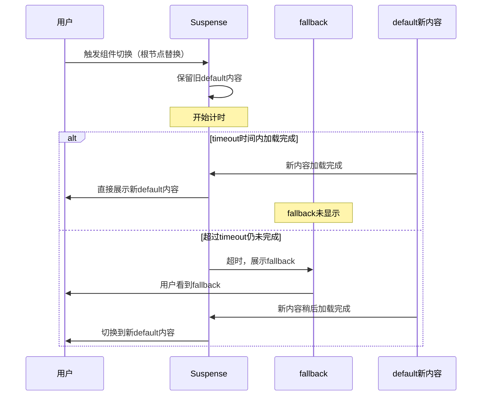
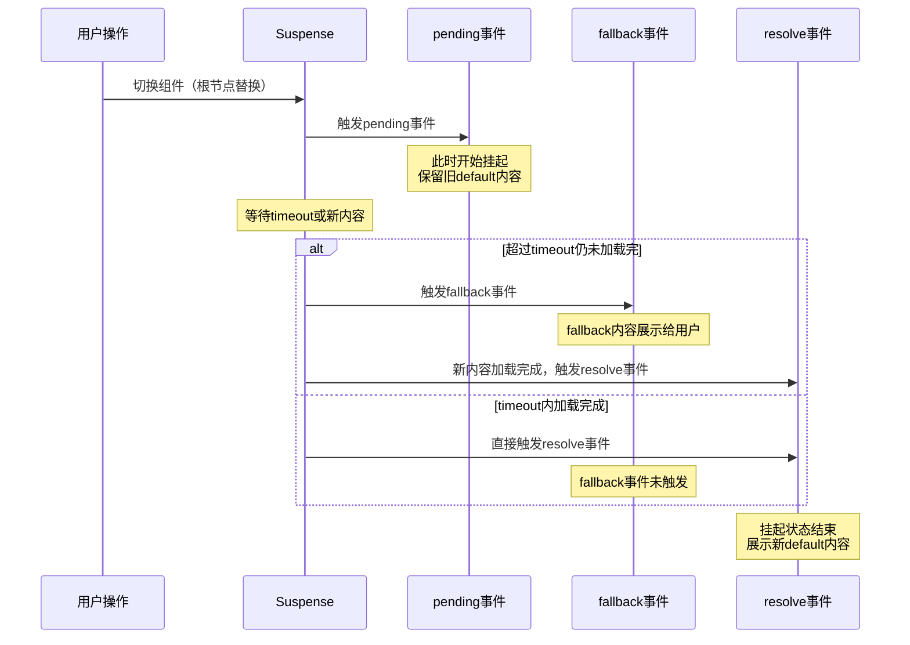

扫描[二维码](https://api2.cmdragon.cn/upload/cmder/20250304_012821924.jpg)关注或者微信搜一搜：`编程智域 前端至全栈交流与成长`

[发现1000+提升效率与开发的AI工具和实用程序](https://tools.cmdragon.cn/zh/apps?category=ai_chat)：https://tools.cmdragon.cn/zh/apps?category=ai_chat

## 一、两个插槽——default和fallback

聊Suspense之前，咱先把它最基础的东西捋清楚。Suspense这玩意儿说白了就是一个内置组件，专门用来处理异步组件的加载状态。它身上最核心的就是两个插槽：`#default` 和 `#fallback`。

这俩插槽的分工特别明确：

- `#default`：放你真正想展示的内容，也就是异步组件加载完成之后要显示的那部分
- `#fallback`：放加载过程中要展示的内容，比如一个Loading动画、骨架屏啥的

有个细节得记住——**两个插槽都只允许一个直接子节点**。你要是往里面塞俩根节点，Vue会直接给你报错。这点跟Transition组件是一个道理，毕竟它内部要追踪这个根节点来做状态切换。

打个比方好理解：`#default` 就像是电影院里的"正片"，`#fallback` 就像是放映前的"预告片"或者"广告"。正片还没准备好（异步组件还在加载），就先放预告片给观众看着；等正片准备好了，立马切过去放正片。观众（用户）全程不用盯着黑屏干等，体验就顺滑多了。

来看个最基础的用法：

```vue
<template>
  <!-- Suspense包裹异步组件，处理加载状态 -->
  <Suspense>
    <!-- 正片：异步加载的Dashboard组件 -->
    <Dashboard />

    <!-- 预告片：加载时显示的Loading提示 -->
    <template #fallback>
      <div class="loading">Loading...</div>
    </template>
  </Suspense>
</template>

<script setup>
import { defineAsyncComponent } from 'vue'

// 用defineAsyncComponent定义一个异步组件
// 模拟从远程加载Dashboard组件的过程
const Dashboard = defineAsyncComponent(() =>
  import('./Dashboard.vue')
)
</script>

<style scoped>
.loading {
  padding: 20px;
  text-align: center;
  color: #888;
}
</style>
```

这段代码的逻辑很直白：`Dashboard` 是个异步组件，加载需要时间。在它没加载好之前，Suspense会展示 `#fallback` 里的 `Loading...`；一旦加载完成，就自动切换到 `Dashboard` 组件的内容。整个过程不需要你手动写 `v-if` 判断加载状态，Suspense帮你全包了。

## 二、挂起和完成——Suspense的两种状态

光知道俩插槽还不够，得搞懂Suspense内部到底是怎么工作的。它其实就两个核心状态：**挂起（pending）** 和 **完成（resolved）**。

初始渲染的时候，Suspense会先在内存里悄悄渲染 `#default` 插槽的内容。注意，是"悄悄"的，这时候用户还看不到。渲染过程中要是碰到了异步依赖（比如异步组件、`async setup()`），Suspense就会进入"挂起"状态，这时候把 `#fallback` 的内容展示给用户看。

等所有的异步依赖都搞定了，Suspense就进入"完成"状态，把 `#default` 的内容正式展示出来。要是初次渲染的时候压根没遇到异步依赖，那就直接进入完成状态，连fallback都不展示。

下面这个流程图把状态切换画得明明白白：



来看个带 `async setup()` 的例子，这种写法在Composition API里特别常见：

```vue
<template>
  <Suspense>
    <!-- 异步组件，setup是async的 -->
    <UserProfile />

    <template #fallback>
      <div class="skeleton">正在加载用户信息...</div>
    </template>
  </Suspense>
</template>

<script setup>
import { ref } from 'vue'

// UserProfile组件用了async setup
// 模拟从接口拉取用户数据
const UserProfile = {
  async setup() {
    // 模拟接口请求，等待1秒
    const data = await new Promise((resolve) => {
      setTimeout(() => {
        resolve({ name: '张三', age: 25 })
      }, 1000)
    })

    return {
      user: data
    }
  },
  template: `
    <div>
      <p>姓名：{{ user.name }}</p>
      <p>年龄：{{ user.age }}</p>
    </div>
  `
}
</script>

<style scoped>
.skeleton {
  padding: 20px;
  background: #f5f5f5;
  color: #999;
}
</style>
```

这段代码执行的时候，Suspense先在内存里渲染 `UserProfile`，发现它的 `setup` 是 `async` 的，里面有 `await`，立马进入挂起状态，把"正在加载用户信息..."展示出来。等1秒后Promise resolve了，setup返回了数据，Suspense就切到完成状态，把用户信息展示出来。

## 三、回退的规则——啥时候会重新挂起

这一节讲的是个特别容易踩坑的点。很多人以为只要组件树里有新的异步依赖，Suspense就会回退到fallback，其实不是这么回事。

**进入完成状态之后，只有当 `#default` 插槽的根节点被替换时，Suspense才会重新回到挂起状态。** 组件树里更深层次新增的异步依赖，并不会让Suspense回退。

这话听着有点绕，举个栗子。假设你的 `#default` 里是个 `<Dashboard>` 组件，Dashboard内部又渲染了一个异步的 `<Chart>` 组件。当Chart还在加载的时候，Suspense并不会回退到fallback——因为Dashboard这个根节点没变，只是它内部的子组件在加载。

这个规则就像是看电视剧：你换了一集新剧（根节点被替换），才会重新加载片头；但要是这一集里多出来个新角色（子组件新增异步依赖），并不会让你重新看片头，剧情继续往下走。

来看个对比示例：

```vue
<template>
  <div>
    <button @click="switchComponent">切换组件</button>

    <Suspense>
      <!-- 用动态组件切换根节点 -->
      <component :is="currentComponent" />

      <template #fallback>
        <div class="loading">加载中，请稍候...</div>
      </template>
    </Suspense>
  </div>
</template>

<script setup>
import { shallowRef, defineAsyncComponent } from 'vue'

// 两个异步组件，模拟切换
const PageA = defineAsyncComponent(() => import('./PageA.vue'))
const PageB = defineAsyncComponent(() => import('./PageB.vue'))

// 当前展示的组件，用shallowRef避免深层响应式开销
const currentComponent = shallowRef(PageA)

// 切换组件：根节点被替换，触发Suspense回退
const switchComponent = () => {
  currentComponent.value = currentComponent.value === PageA ? PageB : PageA
}
</script>

<style scoped>
.loading {
  padding: 20px;
  background: #fffbe6;
  border: 1px solid #ffe58f;
}
</style>
```

点击按钮切换组件的时候，`#default` 的根节点从PageA变成了PageB，这时候Suspense才会重新挂起，展示fallback。要是PageA内部自己又加载了个异步子组件，Suspense是不会有反应的。

理解这条规则特别重要，不然你可能会纳闷"明明有异步组件在加载，为啥我的fallback不显示"，其实就是根节点没换。

## 四、timeout属性——控制回退的时机

前面说了，回退的时候会展示fallback。但实际上，**fallback内容并不会立即展示**。Suspense会先保留之前 `#default` 的内容，等新的内容加载完再切换。这样做的好处是避免界面闪烁——要是新内容很快就加载好了，用户根本看不到fallback，体验更连贯。

但有时候新内容加载特别慢，老内容一直挂着也不太合适。这时候 `timeout` 属性就派上用场了：**超过timeout毫秒还没加载完，就切换到fallback内容**。

几个关键点：

- `timeout=0`：替换默认内容时立即显示fallback，一点不等
- `timeout=2000`：等2秒，2秒内加载完就不显示fallback，超过2秒才显示
- 不设置timeout：默认行为，会一直保留旧内容直到新内容加载完

来看个完整的例子：

```vue
<template>
  <div>
    <button @click="reload">重新加载</button>

    <!-- timeout设置为1000ms，1秒内加载完不显示fallback -->
    <Suspense :timeout="1000">
      <component :is="currentComp" />

      <template #fallback>
        <div class="fallback">超过1秒了，显示fallback...</div>
      </template>
    </Suspense>
  </div>
</template>

<script setup>
import { shallowRef, defineAsyncComponent } from 'vue'

// 定义一个加载比较慢的异步组件（模拟2秒加载）
const SlowComponent = defineAsyncComponent(() =>
  new Promise((resolve) => {
    setTimeout(() => {
      resolve({
        template: '<div>慢组件加载完成</div>'
      })
    }, 2000)
  })
)

// 定义一个加载快的异步组件（模拟200ms加载）
const FastComponent = defineAsyncComponent(() =>
  new Promise((resolve) => {
    setTimeout(() => {
      resolve({
        template: '<div>快组件加载完成</div>'
      })
    }, 200)
  })
)

const currentComp = shallowRef(FastComponent)

// 切换组件，观察timeout的效果
const reload = () => {
  // 在快慢组件之间切换
  currentComp.value = currentComp.value === FastComponent ? SlowComponent : FastComponent
}
</script>

<style scoped>
.fallback {
  padding: 20px;
  background: #fff1f0;
  border: 1px solid #ffa39e;
  color: #cf1322;
}
</style>
```

这段代码里，从快组件切到慢组件时，慢组件要2秒才能加载完，而timeout设的是1秒。所以前1秒会保留快组件的内容，1秒到了还没加载完，就切到fallback显示"超过1秒了..."，再过1秒慢组件加载完，又切到慢组件内容。

下面这个时序图把timeout的整个过程画清楚了：



## 五、三个事件——pending、resolve、fallback

除了插槽和timeout，Suspense还提供了三个事件，让你能更精细地掌控加载过程。这三个事件分别是：

- **pending事件**：Suspense进入挂起状态时触发。说白了就是开始加载新内容了
- **resolve事件**：`#default` 插槽完成获取新内容时触发。也就是新内容加载好了
- **fallback事件**：`#fallback` 插槽内容显示时触发。也就是fallback真的展示给用户了

注意区分pending和fallback：pending是"开始挂起"就触发，fallback是"fallback内容真的显示了"才触发。这俩中间隔着timeout呢——timeout没超时之前，pending触发了但fallback不会触发。

实战中，这三个事件最常见的用法就是**在加载新组件时在最上层显示一个全局加载指示器**。比如顶部进度条、全局Loading遮罩啥的。这样用户切换页面时能立刻得到反馈，不用等fallback显示才知道在加载。

来看个完整的实战示例：

```vue
<template>
  <div>
    <!-- 顶部全局加载指示器，根据isPending显示 -->
    <div v-if="isPending" class="global-loading">
      <div class="progress-bar"></div>
    </div>

    <button @click="switchPage">切换页面</button>

    <Suspense
      @pending="onPending"
      @resolve="onResolve"
      @fallback="onFallback"
      :timeout="500"
    >
      <component :is="currentPage" />

      <template #fallback>
        <div class="local-fallback">局部fallback显示中...</div>
      </template>
    </Suspense>
  </div>
</template>

<script setup>
import { ref, shallowRef, defineAsyncComponent } from 'vue'

// 全局加载状态
const isPending = ref(false)

// 两个异步页面组件
const HomePage = defineAsyncComponent(() =>
  new Promise((resolve) => {
    setTimeout(() => resolve({ template: '<div>首页内容</div>' }), 800)
  })
)

const AboutPage = defineAsyncComponent(() =>
  new Promise((resolve) => {
    setTimeout(() => resolve({ template: '<div>关于页内容</div>' }), 1500)
  })
)

const currentPage = shallowRef(HomePage)

// pending事件：进入挂起状态时触发
// 这里把全局加载指示器打开
const onPending = () => {
  console.log('pending: 开始挂起')
  isPending.value = true
}

// resolve事件：default插槽完成获取新内容时触发
// 关闭全局加载指示器
const onResolve = () => {
  console.log('resolve: 新内容加载完成')
  isPending.value = false
}

// fallback事件：fallback内容显示时触发
// 这里可以记录日志或者做埋点
const onFallback = () => {
  console.log('fallback: 局部fallback已显示')
}

// 切换页面
const switchPage = () => {
  currentPage.value = currentPage.value === HomePage ? AboutPage : HomePage
}
</script>

<style scoped>
.global-loading {
  position: fixed;
  top: 0;
  left: 0;
  right: 0;
  height: 3px;
  background: #e6f7ff;
  z-index: 9999;
}

.progress-bar {
  height: 100%;
  background: #1890ff;
  animation: loading 1.5s ease-in-out infinite;
}

@keyframes loading {
  0% { width: 0; }
  50% { width: 70%; }
  100% { width: 100%; }
}

.local-fallback {
  padding: 20px;
  background: #f6ffed;
  border: 1px solid #b7eb8f;
  color: #389e0d;
}
</style>
```

这段代码的逻辑：点击切换页面时，根节点被替换，Suspense进入挂起状态，触发pending事件，顶部进度条显示。如果500ms内新页面没加载完，触发fallback事件，局部fallback显示。新页面加载完成后，触发resolve事件，顶部进度条消失。

三个事件的触发时序如下图：



搞清楚这三个事件的触发时机，你就能在合适的时机做合适的事——比如pending时开进度条、resolve时关进度条、fallback时上报埋点统计加载耗时。

## 课后 Quiz

**问题1：Suspense的两个插槽都只允许一个直接子节点，如果我非要放两个会怎样？**

答案解析：Vue会在控制台报错，提示你Suspense的插槽只能有一个直接子节点。这是因为Suspense内部需要追踪这个根节点来做状态切换和DOM替换，要是根节点不唯一，它就不知道该追踪谁了。解决办法是用一个外层 `<div>` 或者 `<template>` 把多个元素包起来，让Suspense只看到一个根节点。这个限制跟Transition组件是一样的，都是Vue内置组件的通用约定。

**问题2：timeout=0 和不设置timeout有啥区别？**

答案解析：区别挺大的。`timeout=0` 表示替换默认内容时**立即**显示fallback，一点等待时间都不给。这种适合你希望用户立刻看到加载反馈的场景。而不设置timeout（默认行为），Suspense会一直保留之前的 `#default` 内容，直到新内容加载完成才切换，全程不显示fallback。这种适合新内容加载很快、不希望界面闪烁的场景。简单说：timeout=0是"立马给反馈"，不设timeout是"尽量不打扰用户"。

**问题3：组件树内部新增了一个异步子组件，外层的Suspense会回退到fallback吗？**

答案解析：不会。这是Suspense回退规则的核心——只有 `#default` 插槽的**根节点**被替换时才会回退。组件树里更深层次新增的异步依赖，并不会触发Suspense回退。举个例子，你的default里是 `<Dashboard>`，Dashboard内部又加载了个异步的 `<Chart>`，Chart加载时Suspense不会回退。因为Dashboard这个根节点没变，只是它的子组件在加载。理解这点能帮你避免"明明有异步加载，为啥fallback不显示"的困惑。

## 常见报错解决方案

**报错1：`<Suspense> slots expect a single root node.`**

产生原因：你在 `#default` 或 `#fallback` 插槽里放了多个根节点。Suspense要求每个插槽只能有一个直接子节点，多了它就懵了。

解决办法：用一个外层元素把多个节点包起来。比如把 `<div>A</div><div>B</div>` 改成 `<div><div>A</div><div>B</div></div>`。或者用Fragment（`<template>`包裹）也行，但要注意某些场景下Fragment可能不被识别为单一根节点，最稳妥的还是用一个真实的DOM元素包裹。

预防建议：写Suspense的时候养成习惯，先写一个根元素再往里塞内容，别一上来就并列写多个。

**报错2：`Component is missing template or render function.`**

产生原因：异步组件加载完成后返回的内容不是有效的组件定义。可能是你 `defineAsyncComponent` 里返回的Promise resolve了一个空对象，或者resolve的组件没有template和render函数。

解决办法：检查异步组件的导入路径和返回值。确保 `import('./xxx.vue')` 路径正确，且组件文件里有 `<template>` 或者render函数。如果是动态返回组件对象，确保对象里有 `template` 或 `render` 字段。

预防建议：用动态导入 `() => import('./Comp.vue')` 而不是手动构造Promise返回组件对象，这样能避免很多低级错误。

**报错3：fallback一直显示，default内容死活不出来**

产生原因：通常是异步依赖一直没resolve，或者resolve的时候抛了异常没被捕获。比如 `async setup()` 里的接口请求失败了，Promise reject了，Suspense就卡在挂起状态出不来。

解决办法：在 `async setup()` 里给异步操作加try-catch，或者用 `onErrorCaptured` 钩子捕获错误。也可以配合 `<Suspense>` 外层包一个错误边界组件，捕获到错误后展示错误提示而不是一直loading。

```vue
<script setup>
import { onErrorCaptured } from 'vue'

// 捕获子组件抛出的异步错误
onErrorCaptured((err) => {
  console.error('组件加载失败：', err)
  // 返回false阻止错误继续向上传播
  return false
})
</script>
```

预防建议：所有异步操作都要有错误处理和超时机制，别让Promise无限期挂起。接口请求加timeout，加载失败给用户一个重试按钮，比一直转圈强多了。

## 参考链接

- https://vuejs.org/guide/built-ins/suspense.html

余下文章内容请点击跳转至 个人博客页面 或者 扫描[二维码](https://api2.cmdragon.cn/upload/cmder/20250304_012821924.jpg)关注或者微信搜一搜：`编程智域 前端至全栈交流与成长`，阅读完整的文章：[Suspense的fallback和三个事件，加载状态原来这么玩](https://blog.cmdragon.cn/posts/k7l8m9n0o1p2q3r4s5t6u7v8w9x0y1z2/)

<details>
<summary>往期文章归档</summary>

- [Vue 3 静态与动态 Props 如何传递？TypeScript 类型约束有何必要？](https://blog.cmdragon.cn/posts/94ab48753b64780ca3ab7a7115ae8522/)
- [Vue 3中组件局部注册的优势与实现方式如何？](https://blog.cmdragon.cn/posts/dbf576e744870f6de26fd8a2e03e47da/)
- [如何在Vue3中优化生命周期钩子性能并规避常见陷阱？](https://blog.cmdragon.cn/posts/12d98b3b9ccd6c19a1b169d720ac5c80/)
- [Vue 3 Composition API生命周期钩子：如何实现从基础理解到高阶复用？](https://blog.cmdragon.cn/posts/8884e2b70287fcb263c57648eeb27419/)
- [Vue 3生命周期钩子实战指南：如何正确选择onMounted、onUpdated与onUnmounted的应用场景？](https://blog.cmdragon.cn/posts/883c6dbc50ae4183770a4462e0b8ae4d/)
- [Vue 3中生命周期钩子与响应式系统如何实现协同工作？](https://blog.cmdragon.cn/posts/70dad360ffa9dce14d0d69611b8cb019/)
- [Vue 3组件生命周期钩子的执行顺序与使用场景是什么？](https://blog.cmdragon.cn/posts/db44294a78dc9f666f67b053f6c83567/)
- [Vue组件全局注册与局部注册如何抉择？](https://blog.cmdragon.cn/posts/43ead630ea17da65d99ad2eb8188e472/)
- [Vue3组件化开发中，Props与Emits如何实现数据流转与事件协作？](https://blog.cmdragon.cn/posts/8cff7d2df113da66ea7be560c4d1d22a/)
- [Vue 3模板引用如何与其他特性协同实现复杂交互？](https://blog.cmdragon.cn/posts/331bf75d114ab09116eadfcdca602b58/)
- [Vue 3 v-for中模板引用如何实现高效管理与动态控制？](https://blog.cmdragon.cn/posts/cb380897ddc3578b180ecf8843c774c1/)
- [Vue 3的defineExpose：如何突破script setup组件默认封装，实现精准的父子通讯？](https://blog.cmdragon.cn/posts/202ae0f4acde7128e0e31baf63732fb5/)
- [Vue 3模板引用的生命周期时机如何把握？常见陷阱该如何避免？](https://blog.cmdragon.cn/posts/7d2a0f6555ecbe92afd7d2491c427463/)
- [Vue 3模板引用如何实现父组件与子组件的高效交互？](https://blog.cmdragon.cn/posts/3fb7bdd84128b7efaaa1c979e1f28dee/)
- [Vue中为何需要模板引用？又如何高效实现DOM与组件实例的直接访问？](https://blog.cmdragon.cn/posts/23f3464ba16c7054b4783cded50c04c6/)

</details>

<details>
<summary>免费好用的热门在线工具</summary>

- [多直播聚合器 - 应用商店 | By cmdragon](https://tools.cmdragon.cn/zh/apps/multi-live-aggregator)
- [Proto文件生成器 - 应用商店 | By cmdragon](https://tools.cmdragon.cn/zh/apps/proto-file-generator)
- [图片转粒子 - 应用商店 | By cmdragon](https://tools.cmdragon.cn/zh/apps/image-to-particles)
- [视频下载器 - 应用商店 | By cmdragon](https://tools.cmdragon.cn/zh/apps/video-downloader)
- [文件格式转换器 - 应用商店 | By cmdragon](https://tools.cmdragon.cn/zh/apps/file-converter)
- [M3U8在线播放器 - 应用商店 | By cmdragon](https://tools.cmdragon.cn/zh/apps/m3u8-player)
- [快图设计 - 应用商店 | By cmdragon](https://tools.cmdragon.cn/zh/apps/quick-image-design)
- [高级文字转图片转换器 - 应用商店 | By cmdragon](https://tools.cmdragon.cn/zh/apps/text-to-image-advanced)
- [RAID 计算器 - 应用商店 | By cmdragon](https://tools.cmdragon.cn/zh/apps/raid-calculator)
- [在线PS - 应用商店 | By cmdragon](https://tools.cmdragon.cn/zh/apps/photoshop-online)
- [Mermaid 在线编辑器 - 应用商店 | By cmdragon](https://tools.cmdragon.cn/zh/apps/mermaid-live-editor)
- [数学求解计算器 - 应用商店 | By cmdragon](https://tools.cmdragon.cn/zh/apps/math-solver-calculator)
- [智能提词器 - 应用商店 | By cmdragon](https://tools.cmdragon.cn/zh/apps/smart-teleprompter)
- [魔法简历 - 应用商店 | By cmdragon](https://tools.cmdragon.cn/zh/apps/magic-resume)
- [Image Puzzle Tool - 图片拼图工具 | By cmdragon](https://tools.cmdragon.cn/zh/apps/image-puzzle-tool)
- [字幕下载工具 - 应用商店 | By cmdragon](https://tools.cmdragon.cn/zh/apps/subtitle-downloader)
- [歌词生成工具 - 应用商店 | By cmdragon](https://tools.cmdragon.cn/zh/apps/lyrics-generator)
- [网盘资源聚合搜索 - 应用商店 | By cmdragon](https://tools.cmdragon.cn/zh/apps/cloud-drive-search)
- [ASCII字符画生成器 - 应用商店 | By cmdragon](https://tools.cmdragon.cn/zh/apps/ascii-art-generator)
- [JSON Web Tokens 工具 - 应用商店 | By cmdragon](https://tools.cmdragon.cn/zh/apps/jwt-tool)
- [Bcrypt 密码工具 - 应用商店 | By cmdragon](https://tools.cmdragon.cn/zh/apps/bcrypt-tool)
- [GIF 合成器 - 应用商店 | By cmdragon](https://tools.cmdragon.cn/zh/apps/gif-composer)
- [GIF 分解器 - 应用商店 | By cmdragon](https://tools.cmdragon.cn/zh/apps/gif-decomposer)
- [文本隐写术 - 应用商店 | By cmdragon](https://tools.cmdragon.cn/zh/apps/text-steganography)
- [CMDragon 在线工具 - 高级AI工具箱与开发者套件 | 免费好用的在线工具](https://tools.cmdragon.cn/zh)
- [应用商店 - 发现1000+提升效率与开发的AI工具和实用程序 | 免费好用的在线工具](https://tools.cmdragon.cn/zh/apps?category=trending)
- [CMDragon 更新日志 - 最新更新、功能与改进 | 免费好用的在线工具](https://tools.cmdragon.cn/zh/changelog)
- [支持我们 - 成为赞助者 | 免费好用的在线工具](https://tools.cmdragon.cn/zh/sponsor)
- [AI文本生成图像 - 应用商店 | 免费好用的在线工具](https://tools.cmdragon.cn/zh/apps/text-to-image-ai)
- [临时邮箱 - 应用商店 | 免费好用的在线工具](https://tools.cmdragon.cn/zh/apps/temp-email)
- [二维码解析器 - 应用商店 | 免费好用的在线工具](https://tools.cmdragon.cn/zh/apps/qrcode-parser)
- [文本转思维导图 - 应用商店 | 免费好用的在线工具](https://tools.cmdragon.cn/zh/apps/text-to-mindmap)
- [正则表达式可视化工具 - 应用商店 | 免费好用的在线工具](https://tools.cmdragon.cn/zh/apps/regex-visualizer)
- [文件隐写工具 - 应用商店 | 免费好用的在线工具](https://tools.cmdragon.cn/zh/apps/steganography-tool)
- [IPTV 频道探索器 - 应用商店 | 免费好用的在线工具](https://tools.cmdragon.cn/zh/apps/iptv-explorer)
- [快传 - 应用商店 | By cmdragon](https://tools.cmdragon.cn/zh/apps/snapdrop)
- [随机抽奖工具 - 应用商店 | 免费好用的在线工具](https://tools.cmdragon.cn/zh/apps/lucky-draw)
- [动漫场景查找器 - 应用商店 | 免费好用的在线工具](https://tools.cmdragon.cn/zh/apps/anime-scene-finder)
- [时间工具箱 - 应用商店 | 免费好用的在线工具](https://tools.cmdragon.cn/zh/apps/time-toolkit)
- [网速测试 - 应用商店 | 免费好用的在线工具](https://tools.cmdragon.cn/zh/apps/speed-test)
- [AI 智能抠图工具 - 应用商店 | 免费好用的在线工具](https://tools.cmdragon.cn/zh/apps/background-remover)
- [背景替换工具 - 应用商店 | 免费好用的在线工具](https://tools.cmdragon.cn/zh/apps/background-replacer)
- [艺术二维码生成器 - 应用商店 | 免费好用的在线工具](https://tools.cmdragon.cn/zh/apps/artistic-qrcode)
- [Open Graph 元标签生成器 - 应用商店 | 免费好用的在线工具](https://tools.cmdragon.cn/zh/apps/open-graph-generator)
- [图像对比工具 - 应用商店 | 免费好用的在线工具](https://tools.cmdragon.cn/zh/apps/image-comparison)
- [图片压缩专业版 - 应用商店 | 免费好用的在线工具](https://tools.cmdragon.cn/zh/apps/image-compressor)
- [密码生成器 - 应用商店 | 免费好用的在线工具](https://tools.cmdragon.cn/zh/apps/password-generator)
- [SVG优化器 - 应用商店 | 免费好用的在线工具](https://tools.cmdragon.cn/zh/apps/svg-optimizer)
- [调色板生成器 - 应用商店 | 免费好用的在线工具](https://tools.cmdragon.cn/zh/apps/color-palette)
- [在线节拍器 - 应用商店 | 免费好用的在线工具](https://tools.cmdragon.cn/zh/apps/online-metronome)
- [IP归属地查询 - 应用商店 | By cmdragon](https://tools.cmdragon.cn/zh/apps/ip-geolocation)
- [CSS网格布局生成器 - 应用商店 | 免费好用的在线工具](https://tools.cmdragon.cn/zh/apps/css-grid-layout)
- [邮箱验证工具 - 应用商店 | 免费好用的在线工具](https://tools.cmdragon.cn/zh/apps/email-validator)
- [书法练习字帖 - 应用商店 | 免费好用的在线工具](https://tools.cmdragon.cn/zh/apps/calligraphy-practice)
- [金融计算器套件 - 应用商店 | 免费好用的在线工具](https://tools.cmdragon.cn/zh/apps/finance-calculator-suite)
- [中国亲戚关系计算器 - 应用商店 | 免费好用的在线工具](https://tools.cmdragon.cn/zh/apps/chinese-kinship-calculator)
- [Protocol Buffer 工具箱 - 应用商店 | 免费好用的在线工具](https://tools.cmdragon.cn/zh/apps/protobuf-toolkit)
- [IP归属地查询 - 应用商店 | 免费好用的在线工具](https://tools.cmdragon.cn/zh/apps/ip-geolocation)
- [图片无损放大 - 应用商店 | 免费好用的在线工具](https://tools.cmdragon.cn/zh/apps/image-upscaler)
- [文本比较工具 - 应用商店 | 免费好用的在线工具](https://tools.cmdragon.cn/zh/apps/text-compare)
- [IP批量查询工具 - 应用商店 | 免费好用的在线工具](https://tools.cmdragon.cn/zh/apps/ip-batch-lookup)
- [域名查询工具 - 应用商店 | 免费好用的在线工具](https://tools.cmdragon.cn/zh/apps/domain-finder)
- [DNS工具箱 - 应用商店 | 免费好用的在线工具](https://tools.cmdragon.cn/zh/apps/dns-toolkit)
- [网站图标生成器 - 应用商店 | 免费好用的在线工具](https://tools.cmdragon.cn/zh/apps/favicon-generator)
- [XML Sitemap](https://tools.cmdragon.cn/sitemap_index.xml)

</details>
