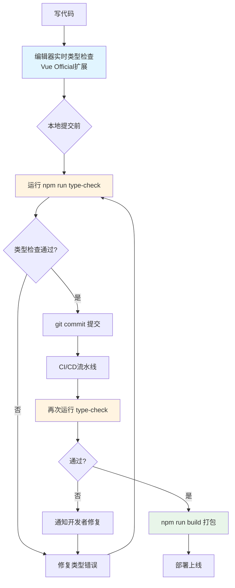
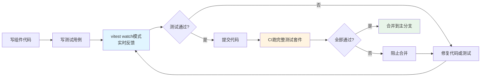
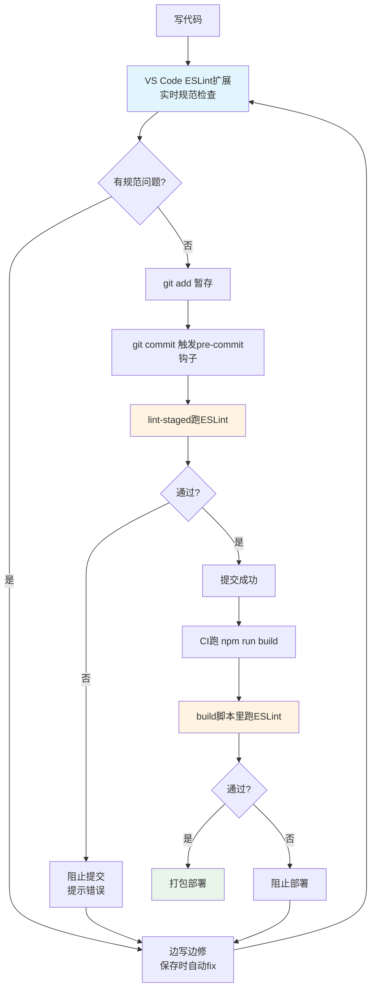

扫描[二维码](https://api2.cmdragon.cn/upload/cmder/20250304_012821924.jpg)关注或者微信搜一搜：`编程智域 前端至全栈交流与成长`

[发现1000+提升效率与开发的AI工具和实用程序](https://tools.cmdragon.cn/zh/apps?category=ai_chat)：https://tools.cmdragon.cn/zh/apps?category=ai_chat

## 一、TypeScript——给Vue代码加上类型保险

写Vue项目写到一半，是不是经常遇到这种尴尬事：传给子组件的props少个字段，浏览器里跑半天才报错；调用某个方法时参数顺序记反了，运行时直接白屏。这种"运行时才发现问题"的痛，谁踩谁知道。

TypeScript就是来救场的。它就像给代码买了一份"保险"，在你按下保存键之前，就把那些潜在的类型错误揪出来，省得你上线之后被用户骂街。

### 1.1 Vue Official扩展能干啥

Vue Official（以前叫Volar）是Vue官方推荐的VS Code扩展，它对`<script lang="ts">`块提供完整的类型检查能力。不光是script块，连模板里写的表达式、组件之间传的props，它都能给你做自动补全和类型验证。

举个栗子，你在模板里写了个不存在的变量，它会直接画红线提醒你；你给组件传了个类型不对的prop，它也会告诉你哪里不对劲。这种"边写边查"的体验，比等到运行时再调试舒服多了。

### 1.2 怎么在SFC里用TypeScript

在单文件组件里启用TypeScript特别简单，只要给`<script>`标签加上`lang="ts"`就行：

```vue
<script setup lang="ts">
// 引入ref，用来声明响应式数据
import { ref } from 'vue'

// 定义一个用户接口，约束用户对象的形状
interface User {
  id: number
  name: string
  email: string
  age?: number  // age是可选属性，加个问号表示可以没有
}

// 用ref声明一个用户列表，泛型参数指定为User数组
// 这样后续操作list时，TypeScript会帮你检查每个元素的类型
const userList = ref<User[]>([])

// 当前选中的用户，可能是null（没选的时候）
const currentUser = ref<User | null>(null)

// 添加用户的方法，参数类型明确指定为User
// 调用时如果传错类型，编辑器立刻报错
function addUser(user: User): void {
  userList.value.push(user)
}

// 根据id查找用户，返回值可能是User或undefined
function findUserById(id: number): User | undefined {
  return userList.value.find(item => item.id === id)
}

// 删除用户的方法
function removeUser(id: number): void {
  const index = userList.value.findIndex(item => item.id === id)
  if (index !== -1) {
    userList.value.splice(index, 1)
  }
}
</script>

<template>
  <div class="user-manager">
    <!-- 这里写user.name时，编辑器会自动补全User接口的字段 -->
    <div v-for="user in userList" :key="user.id" class="user-item">
      <span>{{ user.name }} - {{ user.email }}</span>
      <button @click="removeUser(user.id)">删除</button>
    </div>
  </div>
</template>
```

看，加了类型之后，每个变量的"长相"都清清楚楚。你在模板里敲`user.`的时候，编辑器会自动列出id、name、email这些字段，再也不用担心记错字段名了。

### 1.3 给组件props加类型约束

组件之间传props时，类型约束就更重要了。Vue 3提供了`defineProps`的泛型写法，配合TypeScript用起来特别顺手：

```vue
<script setup lang="ts">
// 用泛型的方式定义props，比运行时校验更严格
// 这种写法TypeScript能完整推导出每个prop的类型
const props = defineProps<{
  title: string           // 必传的标题
  count: number           // 必传的数量
  items: string[]         // 必传的字符串数组
  disabled?: boolean      // 可选的禁用状态
}>()

// 定义emits，约束可以触发的事件名和参数类型
const emit = defineEmits<{
  // 事件名: 参数类型
  (e: 'update', value: number): void
  (e: 'delete', id: string): void
  (e: 'close'): void
}>()

function handleClick() {
  // 触发update事件，参数必须是number，传错类型直接报错
  emit('update', props.count + 1)
}
</script>

<template>
  <div :class="{ disabled }">
    <h2>{{ title }}</h2>
    <p>数量：{{ count }}</p>
    <ul>
      <li v-for="(item, index) in items" :key="index">{{ item }}</li>
    </ul>
    <button @click="handleClick" :disabled="disabled">增加</button>
  </div>
</template>
```

这种写法的好处是，父组件用这个子组件时，传错类型会直接在编辑器里报红，根本不用等到运行。就像过安检一样，问题在源头就被拦住了。

## 二、vue-tsc——命令行也能做类型检查

编辑器里的类型检查方便是方便，但有个问题：它只在你本地编辑器里有效。要是团队里有人没装Vue Official扩展，或者CI/CD流水线里没人盯着编辑器，那类型错误就可能漏过去。

这时候vue-tsc就派上用场了。它能在命令行里执行和Vue Official扩展相同的类型检查，相当于把"质检员"搬到了命令行里，上线前把所有代码统一检查一遍。

### 2.1 vue-tsc是啥

vue-tsc是基于TypeScript官方编译器tsc封装的工具，专门用来处理Vue单文件组件。它能把`.vue`文件里的`<script>`和`<template>`都纳入类型检查范围，比直接用tsc靠谱多了。

除了做类型检查，vue-tsc通常还用来生成单文件组件的d.ts类型声明文件，方便别的项目引用你的组件库时能拿到完整的类型提示。

### 2.2 在package.json里配置type-check脚本

实际项目里，一般会在`package.json`的`scripts`里加一个`type-check`脚本，方便随时手动跑，也方便集成到CI流程里：

```json
{
  "name": "my-vue-app",
  "version": "1.0.0",
  "scripts": {
    "dev": "vite",
    "build": "vue-tsc --noEmit && vite build",
    "type-check": "vue-tsc --noEmit",
    "test": "vitest"
  },
  "devDependencies": {
    "vue-tsc": "^2.0.0",
    "typescript": "^5.4.0",
    "vite": "^5.2.0",
    "vue": "^3.4.0"
  }
}
```

几个关键点解释下：

- `--noEmit`参数表示只做类型检查，不输出编译后的文件。因为我们用的是Vite打包，不需要vue-tsc生成JS文件
- `build`脚本里把`vue-tsc --noEmit`放在`vite build`前面，这样打包前会先做类型检查，类型有问题直接中断构建，避免把带类型错误的代码发到线上
- `type-check`单独拎出来，方便CI流水线里单独跑这一步

### 2.3 tsconfig配置

vue-tsc要正常工作，`tsconfig.json`得配置好。Vue项目一般用`@vue/tsconfig`这个包提供的基础配置：

```json
{
  "extends": "@vue/tsconfig/tsconfig.dom.json",
  "compilerOptions": {
    "baseUrl": ".",
    "paths": {
      "@/*": ["./src/*"]
    },
    "types": ["vite/client"]
  },
  "include": [
    "src/**/*.ts",
    "src/**/*.d.ts",
    "src/**/*.vue"
  ],
  "references": [
    { "path": "./tsconfig.node.json" }
  ]
}
```

这里`include`字段一定要把`.vue`文件包含进去，不然vue-tsc会漏掉单文件组件的检查。

### 2.4 类型检查在开发流程里的位置

光说不练假把式，画个流程图看看类型检查在整个开发流程里处于啥位置：



看图就明白了，类型检查在开发流程里有三道关卡：编辑器实时检查、本地提交前手动跑、CI流水线自动跑。三道关卡层层把关，类型错误基本没机会溜到线上。

## 三、测试——Cypress和Vitest怎么选

类型检查能拦住类型错误，但业务逻辑对不对，类型检查管不了。比如"用户点击按钮后，列表应该按时间倒序排列"这种业务逻辑，得靠测试来验证。

Vue生态里测试方案主要有三个：Cypress、Vitest、Jest。仨兄弟各有各的拿手好戏，选哪个得看你要测啥。

### 3.1 三种测试方案对比

先上个对比表格，心里有个数：

| 特性 | Cypress | Vitest | Jest |
|------|---------|--------|------|
| 主要用途 | E2E测试、组件测试 | 单元测试、组件测试 | 单元测试 |
| 运行环境 | 真实浏览器 | Node（jsdom） | Node（jsdom） |
| 运行速度 | 较慢（要起浏览器） | 很快 | 快 |
| Vite集成 | 需额外配置 | 原生支持 | 需vite-jest |
| 学习成本 | 中等 | 低（像Jest） | 低 |
| 调试体验 | 很好（可视化） | 好 | 一般 |
| 适用场景 | 完整用户流程 | 函数/组件级测试 | 老项目迁移 |

简单总结下：

- **Cypress**：推荐用来做E2E测试，就是模拟真实用户从头到尾点一遍。它也能通过Cypress组件测试运行器给Vue SFC做单文件组件测试，但强项还是E2E
- **Vitest**：追求更快运行速度的测试运行器，由Vue/Vite团队成员开发，主要针对基于Vite的应用设计，给组件提供即时响应的测试反馈。配置简单，跟Vite共享配置文件
- **Jest**：可以通过vite-jest配合Vite使用，但只推荐已有Jest测试集想迁移到Vite时用。因为Vitest也能提供类似功能，而且跟Vite集成更方便，没必要新项目还上Jest

打个比方：Cypress像"整车测试"，把车造好之后开着上路试，看整体表现；Vitest像"零件测试"，把发动机、轮胎拆下来单独试，看每个零件靠不靠谱。两种测试配合着用，车子才靠谱。

### 3.2 Vitest基本用法

新项目首选Vitest，配置简单跑得快。先装依赖：

```bash
npm install -D vitest @vue/test-utils @testing-library/vue jsdom
```

然后在`vite.config.ts`里加测试配置（Vitest直接复用Vite配置，不用单独建配置文件）：

```typescript
import { defineConfig } from 'vite'
import vue from '@vitejs/plugin-vue'

export default defineConfig({
  plugins: [vue()],
  test: {
    // 测试环境，组件测试需要DOM所以用jsdom
    environment: 'jsdom',
    // 全局启用API，不用每个测试文件都import
    globals: true,
    // 测试完清理副作用
    cleanupThreads: true,
  },
})
```

写个组件测试的例子。假设有个计数器组件`Counter.vue`：

```vue
<script setup lang="ts">
import { ref } from 'vue'

const count = ref(0)

function increment() {
  count.value++
}

function decrement() {
  if (count.value > 0) {
    count.value--
  }
}

defineExpose({ count, increment, decrement })
</script>

<template>
  <div class="counter">
    <button class="dec" @click="decrement">-</button>
    <span class="value">{{ count }}</span>
    <button class="inc" @click="increment">+</button>
  </div>
</template>
```

对应的测试文件`Counter.spec.ts`：

```typescript
import { describe, it, expect } from 'vitest'
import { mount } from '@vue/test-utils'
import Counter from './Counter.vue'

// describe把相关测试用例分组
describe('Counter组件', () => {
  // it定义一个测试用例，描述组件应该有啥行为
  it('初始值应该是0', () => {
    const wrapper = mount(Counter)
    // 找到显示数值的元素，检查内容
    expect(wrapper.find('.value').text()).toBe('0')
  })

  it('点击加号按钮后数值应该加1', async () => {
    const wrapper = mount(Counter)
    // 触发点击事件，因为是异步的所以要await
    await wrapper.find('.inc').trigger('click')
    expect(wrapper.find('.value').text()).toBe('1')
  })

  it('数值为0时点减号不应该变成负数', async () => {
    const wrapper = mount(Counter)
    await wrapper.find('.dec').trigger('click')
    // 数值还是0，不会变成-1
    expect(wrapper.find('.value').text()).toBe('0')
  })

  it('连续点击多次应该正确累加', async () => {
    const wrapper = mount(Counter)
    // 连续点3次加号
    await wrapper.find('.inc').trigger('click')
    await wrapper.find('.inc').trigger('click')
    await wrapper.find('.inc').trigger('click')
    expect(wrapper.find('.value').text()).toBe('3')
  })
})
```

跑测试就一行命令：

```bash
npx vitest
```

Vitest默认是watch模式，文件改了自动重跑，反馈特别快。CI里跑用`npx vitest run`，跑完就退出。

### 3.3 测试在开发流程里的位置



## 四、ESLint——用eslint-plugin-vue管代码规范

类型检查管的是"对不对"，测试管的是"行不行"，还有个问题没解决：代码写得好不好看。团队里十个人十种写法，有的用分号有的不用，有的用单引号有的用双引号，代码review的时候能吵翻天。

ESLint就是来统一规范的。Vue团队维护着`eslint-plugin-vue`这个项目，它是ESLint插件，专门提供SFC相关的规则定义，能检查模板里的语法、script里的代码风格，连`v-for`有没有写`key`这种细节都能管。

### 4.1 安装和配置

先装依赖：

```bash
npm install -D eslint eslint-plugin-vue
```

ESLint 9用的是扁平配置（flat config），配置文件叫`eslint.config.js`。一个基础的Vue项目配置长这样：

```javascript
// eslint.config.js
import js from '@eslint/js'
import vue from 'eslint-plugin-vue'

export default [
  // JS的基础推荐规则
  js.configs.recommended,
  // Vue 3的推荐规则，包含模板检查
  ...vue.configs['flat/recommended'],
  {
    // 针对所有文件的全局设置
    languageOptions: {
      ecmaVersion: 'latest',
      sourceType: 'module',
      globals: {
        // 浏览器环境全局变量
        window: 'readonly',
        document: 'readonly',
        console: 'readonly',
      },
    },
    rules: {
      // 这里覆盖默认规则，按团队习惯调
      'vue/multi-word-component-names': 'off',  // 允许单词组件名
      'vue/max-attributes-per-line': 'off',     // 属性不强制换行
      'no-unused-vars': 'warn',                 // 未使用变量只警告
      'no-console': 'warn',                     // console只警告不报错
    },
  },
  {
    // 忽略的文件和目录
    ignores: [
      'dist/**',
      'node_modules/**',
      '*.config.js',
    ],
  },
]
```

### 4.2 基于Vite构建的推荐做法

光装ESLint还不够，得把它接到开发流程里。Vue官方基于Vite构建的项目，推荐这么搞：

**第一步：装ESLint和eslint-plugin-vue，按上面配置好。** 这步已经做完了。

**第二步：启用ESLint的IDE插件。** 比如VS Code装"ESLint"扩展，这样写代码时就能实时看到规范检查反馈，不用等启动开发服务器。这样有个好处：开发服务器启动时不用再跑一遍规范检查，省时间。

**第三步：把ESLint格式检查作为生产构建步骤。** 在`package.json`的`build`脚本里加上lint检查：

```json
{
  "scripts": {
    "dev": "vite",
    "build": "vue-tsc --noEmit && eslint . && vite build",
    "type-check": "vue-tsc --noEmit",
    "lint": "eslint . --fix",
    "test": "vitest run"
  }
}
```

这样打包时会先跑类型检查，再跑ESLint，都过了才打包。保证最终打包时获得完整规范检查反馈，带问题的代码别想混到线上。

**第四步（可选）：用lint-staged在git commit时自动检查。** 装上`lint-staged`和`husky`，提交代码时自动对改动的文件跑ESLint，问题代码根本提交不上去：

```bash
npm install -D lint-staged husky
npx husky init
```

在`package.json`里加lint-staged配置：

```json
{
  "lint-staged": {
    "*.{js,ts,vue}": [
      "eslint --fix"
    ]
  }
}
```

然后修改`.husky/pre-commit`文件：

```bash
#!/usr/bin/env sh
npx lint-staged
```

这样每次git commit之前，会自动对暂存区的文件跑ESLint并尝试自动修复，修不了的会阻止提交。

### 4.3 ESLint在开发流程里的应用



看图就懂了，ESLint在开发流程里也是三道关卡：编辑器实时检查、commit时自动检查、build时完整检查。跟类型检查一个套路，层层把关。

## 课后 Quiz

**问题1：vue-tsc和Vue Official扩展做类型检查，有啥区别和联系？**

答案解析：两者做的是相同的类型检查，底层都基于TypeScript编译器。区别在于运行环境：Vue Official扩展是在编辑器（VS Code）里实时运行，你边写代码它边检查，反馈即时但只在你本地有效；vue-tsc是命令行工具，可以在任何环境运行，适合集成到CI/CD流水线和构建脚本里，保证团队所有人提交的代码都经过统一检查。实际项目里两者配合用：编辑器里靠Vue Official扩展实时反馈，构建和CI里靠vue-tsc把关。联系是它们共享同一套TypeScript配置（tsconfig.json），检查规则一致。

**问题2：Cypress和Vitest分别适合测啥场景？新项目该咋选？**

答案解析：Cypress适合测E2E（端到端）场景，就是模拟真实用户从登录到下单的完整流程，它在真实浏览器里跑，能发现集成层面的问题，但速度慢。Vitest适合测函数和组件级别的单元，跑在Node环境里，速度快，反馈即时，跟Vite项目无缝集成。新项目推荐两者都用：Vitest测组件和工具函数，保证每个零件靠谱；Cypress测关键用户流程，保证整体流程通顺。如果资源有限只能选一个，优先Vitest，因为单元测试覆盖面广、性价比高。Jest只在你已经有Jest测试集想迁移到Vite时才考虑，新项目没必要上。

**问题3：ESLint的IDE插件反馈、lint-staged检查、build时检查，这三层各自的作用是啥？能不能省掉某层？**

答案解析：三层各有分工，不建议省。第一层IDE插件反馈：开发时实时提示规范问题，让开发者边写边修，成本最低，但依赖开发者自觉装插件，不能强制。第二层lint-staged检查：git commit时自动跑，强制阻止问题代码提交，是团队协作的底线，但只检查暂存区文件，不检查全量代码。第三层build时检查：打包前完整检查所有文件，是最后一道防线，防止有人绕过前两层。三层是从"软提醒"到"硬约束"的递进关系，省掉任何一层都会让规范执行出现漏洞。比如省掉lint-staged，开发者可能提交带问题的代码；省掉build检查，CI部署时就没法兜底。

## 常见报错解决方案

### 报错1：vue-tsc报错"Cannot find module './xxx.vue' or its corresponding type declarations"

**产生原因：** TypeScript默认不认识`.vue`文件，需要类型声明文件告诉它`.vue`文件导出的是Vue组件。这个声明文件一般叫`env.d.ts`或`shims-vue.d.ts`，缺失或者没被tsconfig包含就会报这个错。

**解决方案：** 在项目根目录（或src目录）创建`env.d.ts`文件，内容如下：

```typescript
/// <reference types="vite/client" />

declare module '*.vue' {
  import type { DefineComponent } from 'vue'
  const component: DefineComponent<{}, {}, any>
  export default component
}
```

然后确认`tsconfig.json`的`include`字段包含了这个文件：

```json
{
  "include": ["src/**/*.ts", "src/**/*.d.ts", "src/**/*.vue", "env.d.ts"]
}
```

**预防建议：** 用`npm create vue@latest`脚手架创建项目时，它会自动生成`env.d.ts`文件，别手贱删掉。如果是手动搭的项目，第一时间把这个文件加上。

### 报错2：Vitest跑测试时报错"Cannot find module 'vitest'"

**产生原因：** 多半是Vitest装成了生产依赖而不是开发依赖，或者装了之后没重启IDE导致类型提示没更新。也有可能是`vite.config.ts`里没配置`test`字段，IDE不认识test相关的导入。

**解决方案：** 先确认安装方式正确：

```bash
npm install -D vitest @vue/test-utils jsdom
```

注意`-D`参数表示装到`devDependencies`。然后在`vite.config.ts`里加上test配置，并确保类型引用正确：

```typescript
/// <reference types="vitest" />
import { defineConfig } from 'vite'
import vue from '@vitejs/plugin-vue'

export default defineConfig({
  plugins: [vue()],
  test: {
    environment: 'jsdom',
    globals: true,
  },
})
```

如果还报错，删掉`node_modules`重装一遍：`rm -rf node_modules package-lock.json && npm install`。

**预防建议：** 装依赖时看清楚是`-D`还是`-S`，测试相关的都是开发依赖。配置文件改完记得重启VS Code，让TypeScript Language Server重新加载配置。

### 报错3：ESLint报错"Error: Failed to load config eslint-plugin-vue"

**产生原因：** ESLint 9改成了扁平配置后，老的配置写法不兼容了。如果还在用`.eslintrc.js`加`extends: ['plugin:vue/recommended']`这种老写法，就会报这个错。另外`eslint-plugin-vue`版本太低不支持扁平配置也会报错。

**解决方案：** 升级`eslint-plugin-vue`到9.0以上版本，改用`eslint.config.js`扁平配置：

```bash
npm install -D eslint@^9 eslint-plugin-vue@^9
```

配置文件改成：

```javascript
// eslint.config.js
import js from '@eslint/js'
import vue from 'eslint-plugin-vue'

export default [
  js.configs.recommended,
  ...vue.configs['flat/recommended'],
  {
    rules: {
      // 你的自定义规则
    },
  },
]
```

注意删掉老的`.eslintrc.js`、`.eslintrc.json`等文件，避免冲突。

**预防建议：** 新项目直接用ESLint 9 + 扁平配置，别再用老写法。老项目迁移时先升级ESLint和eslint-plugin-vue到最新版，再改配置文件格式。配置文件改完跑一遍`npx eslint .`确认没报错再提交。

## 参考链接

- https://vuejs.org/guide/scaling-up/tooling.html

余下文章内容请点击跳转至 个人博客页面 或者 扫描[二维码](https://api2.cmdragon.cn/upload/cmder/20250304_012821924.jpg)关注或者微信搜一搜：`编程智域 前端至全栈交流与成长`，阅读完整的文章：[TypeScript类型检查、Vitest测试和ESLint规范，Vue项目质量三件套](https://blog.cmdragon.cn/posts/t6u7v8w9x0y1z2a3b4c5d6e7f8a9b0c1d2/)

<details>
<summary>往期文章归档</summary>

- [Vue 3 静态与动态 Props 如何传递？TypeScript 类型约束有何必要？](https://blog.cmdragon.cn/posts/94ab48753b64780ca3ab7a7115ae8522/)
- [Vue 3中组件局部注册的优势与实现方式如何？](https://blog.cmdragon.cn/posts/dbf576e744870f6de26fd8a2e03e47da/)
- [如何在Vue3中优化生命周期钩子性能并规避常见陷阱？](https://blog.cmdragon.cn/posts/12d98b3b9ccd6c19a1b169d720ac5c80/)
- [Vue 3 Composition API生命周期钩子：如何实现从基础理解到高阶复用？](https://blog.cmdragon.cn/posts/8884e2b70287fcb263c57648eeb27419/)
- [Vue 3生命周期钩子实战指南：如何正确选择onMounted、onUpdated与onUnmounted的应用场景？](https://blog.cmdragon.cn/posts/883c6dbc50ae4183770a4462e0b8ae4d/)
- [Vue 3中生命周期钩子与响应式系统如何实现协同工作？](https://blog.cmdragon.cn/posts/70dad360ffa9dce14d0d69611b8cb019/)
- [Vue 3组件生命周期钩子的执行顺序与使用场景是什么？](https://blog.cmdragon.cn/posts/db44294a78dc9f666f67b053f6c83567/)
- [Vue组件全局注册与局部注册如何抉择？](https://blog.cmdragon.cn/posts/43ead630ea17da65d99ad2eb8188e472/)
- [Vue3组件化开发中，Props与Emits如何实现数据流转与事件协作？](https://blog.cmdragon.cn/posts/8cff7d2df113da66ea7be560c4d1d22a/)
- [Vue 3模板引用如何与其他特性协同实现复杂交互？](https://blog.cmdragon.cn/posts/331bf75d114ab09116eadfcdca602b58/)
- [Vue 3 v-for中模板引用如何实现高效管理与动态控制？](https://blog.cmdragon.cn/posts/cb380897ddc3578b180ecf8843c774c1/)
- [Vue 3的defineExpose：如何突破script setup组件默认封装，实现精准的父子通讯？](https://blog.cmdragon.cn/posts/202ae0f4acde7128e0e31baf63732fb5/)
- [Vue 3模板引用的生命周期时机如何把握？常见陷阱该如何避免？](https://blog.cmdragon.cn/posts/7d2a0f6555ecbe92afd7d2491c427463/)
- [Vue 3模板引用如何实现父组件与子组件的高效交互？](https://blog.cmdragon.cn/posts/3fb7bdd84128b7efaaa1c979e1f28dee/)
- [Vue中为何需要模板引用？又如何高效实现DOM与组件实例的直接访问？](https://blog.cmdragon.cn/posts/23f3464ba16c7054b4783cded50c04c6/)

</details>

<details>
<summary>免费好用的热门在线工具</summary>

- [多直播聚合器 - 应用商店 | By cmdragon](https://tools.cmdragon.cn/zh/apps/multi-live-aggregator)
- [Proto文件生成器 - 应用商店 | By cmdragon](https://tools.cmdragon.cn/zh/apps/proto-file-generator)
- [图片转粒子 - 应用商店 | By cmdragon](https://tools.cmdragon.cn/zh/apps/image-to-particles)
- [视频下载器 - 应用商店 | By cmdragon](https://tools.cmdragon.cn/zh/apps/video-downloader)
- [文件格式转换器 - 应用商店 | By cmdragon](https://tools.cmdragon.cn/zh/apps/file-converter)
- [M3U8在线播放器 - 应用商店 | By cmdragon](https://tools.cmdragon.cn/zh/apps/m3u8-player)
- [快图设计 - 应用商店 | By cmdragon](https://tools.cmdragon.cn/zh/apps/quick-image-design)
- [高级文字转图片转换器 - 应用商店 | By cmdragon](https://tools.cmdragon.cn/zh/apps/text-to-image-advanced)
- [RAID 计算器 - 应用商店 | By cmdragon](https://tools.cmdragon.cn/zh/apps/raid-calculator)
- [在线PS - 应用商店 | By cmdragon](https://tools.cmdragon.cn/zh/apps/photoshop-online)
- [Mermaid 在线编辑器 - 应用商店 | By cmdragon](https://tools.cmdragon.cn/zh/apps/mermaid-live-editor)
- [数学求解计算器 - 应用商店 | By cmdragon](https://tools.cmdragon.cn/zh/apps/math-solver-calculator)
- [智能提词器 - 应用商店 | By cmdragon](https://tools.cmdragon.cn/zh/apps/smart-teleprompter)
- [魔法简历 - 应用商店 | By cmdragon](https://tools.cmdragon.cn/zh/apps/magic-resume)
- [Image Puzzle Tool - 图片拼图工具 | By cmdragon](https://tools.cmdragon.cn/zh/apps/image-puzzle-tool)
- [字幕下载工具 - 应用商店 | By cmdragon](https://tools.cmdragon.cn/zh/apps/subtitle-downloader)
- [歌词生成工具 - 应用商店 | By cmdragon](https://tools.cmdragon.cn/zh/apps/lyrics-generator)
- [网盘资源聚合搜索 - 应用商店 | By cmdragon](https://tools.cmdragon.cn/zh/apps/cloud-drive-search)
- [ASCII字符画生成器 - 应用商店 | By cmdragon](https://tools.cmdragon.cn/zh/apps/ascii-art-generator)
- [JSON Web Tokens 工具 - 应用商店 | By cmdragon](https://tools.cmdragon.cn/zh/apps/jwt-tool)
- [Bcrypt 密码工具 - 应用商店 | By cmdragon](https://tools.cmdragon.cn/zh/apps/bcrypt-tool)
- [GIF 合成器 - 应用商店 | By cmdragon](https://tools.cmdragon.cn/zh/apps/gif-composer)
- [GIF 分解器 - 应用商店 | By cmdragon](https://tools.cmdragon.cn/zh/apps/gif-decomposer)
- [文本隐写术 - 应用商店 | By cmdragon](https://tools.cmdragon.cn/zh/apps/text-steganography)
- [CMDragon 在线工具 - 高级AI工具箱与开发者套件 | 免费好用的在线工具](https://tools.cmdragon.cn/zh)
- [应用商店 - 发现1000+提升效率与开发的AI工具和实用程序 | 免费好用的在线工具](https://tools.cmdragon.cn/zh/apps?category=trending)
- [CMDragon 更新日志 - 最新更新、功能与改进 | 免费好用的在线工具](https://tools.cmdragon.cn/zh/changelog)
- [支持我们 - 成为赞助者 | 免费好用的在线工具](https://tools.cmdragon.cn/zh/sponsor)
- [AI文本生成图像 - 应用商店 | 免费好用的在线工具](https://tools.cmdragon.cn/zh/apps/text-to-image-ai)
- [临时邮箱 - 应用商店 | 免费好用的在线工具](https://tools.cmdragon.cn/zh/apps/temp-email)
- [二维码解析器 - 应用商店 | 免费好用的在线工具](https://tools.cmdragon.cn/zh/apps/qrcode-parser)
- [文本转思维导图 - 应用商店 | 免费好用的在线工具](https://tools.cmdragon.cn/zh/apps/text-to-mindmap)
- [正则表达式可视化工具 - 应用商店 | 免费好用的在线工具](https://tools.cmdragon.cn/zh/apps/regex-visualizer)
- [文件隐写工具 - 应用商店 | 免费好用的在线工具](https://tools.cmdragon.cn/zh/apps/steganography-tool)
- [IPTV 频道探索器 - 应用商店 | 免费好用的在线工具](https://tools.cmdragon.cn/zh/apps/iptv-explorer)
- [快传 - 应用商店 | By cmdragon](https://tools.cmdragon.cn/zh/apps/snapdrop)
- [随机抽奖工具 - 应用商店 | 免费好用的在线工具](https://tools.cmdragon.cn/zh/apps/lucky-draw)
- [动漫场景查找器 - 应用商店 | 免费好用的在线工具](https://tools.cmdragon.cn/zh/apps/anime-scene-finder)
- [时间工具箱 - 应用商店 | 免费好用的在线工具](https://tools.cmdragon.cn/zh/apps/time-toolkit)
- [网速测试 - 应用商店 | 免费好用的在线工具](https://tools.cmdragon.cn/zh/apps/speed-test)
- [AI 智能抠图工具 - 应用商店 | 免费好用的在线工具](https://tools.cmdragon.cn/zh/apps/background-remover)
- [背景替换工具 - 应用商店 | 免费好用的在线工具](https://tools.cmdragon.cn/zh/apps/background-replacer)
- [艺术二维码生成器 - 应用商店 | 免费好用的在线工具](https://tools.cmdragon.cn/zh/apps/artistic-qrcode)
- [Open Graph 元标签生成器 - 应用商店 | 免费好用的在线工具](https://tools.cmdragon.cn/zh/apps/open-graph-generator)
- [图像对比工具 - 应用商店 | 免费好用的在线工具](https://tools.cmdragon.cn/zh/apps/image-comparison)
- [图片压缩专业版 - 应用商店 | 免费好用的在线工具](https://tools.cmdragon.cn/zh/apps/image-compressor)
- [密码生成器 - 应用商店 | 免费好用的在线工具](https://tools.cmdragon.cn/zh/apps/password-generator)
- [SVG优化器 - 应用商店 | 免费好用的在线工具](https://tools.cmdragon.cn/zh/apps/svg-optimizer)
- [调色板生成器 - 应用商店 | 免费好用的在线工具](https://tools.cmdragon.cn/zh/apps/color-palette)
- [在线节拍器 - 应用商店 | 免费好用的在线工具](https://tools.cmdragon.cn/zh/apps/online-metronome)
- [IP归属地查询 - 应用商店 | By cmdragon](https://tools.cmdragon.cn/zh/apps/ip-geolocation)
- [CSS网格布局生成器 - 应用商店 | 免费好用的在线工具](https://tools.cmdragon.cn/zh/apps/css-grid-layout)
- [邮箱验证工具 - 应用商店 | 免费好用的在线工具](https://tools.cmdragon.cn/zh/apps/email-validator)
- [书法练习字帖 - 应用商店 | 免费好用的在线工具](https://tools.cmdragon.cn/zh/apps/calligraphy-practice)
- [金融计算器套件 - 应用商店 | 免费好用的在线工具](https://tools.cmdragon.cn/zh/apps/finance-calculator-suite)
- [中国亲戚关系计算器 - 应用商店 | 免费好用的在线工具](https://tools.cmdragon.cn/zh/apps/chinese-kinship-calculator)
- [Protocol Buffer 工具箱 - 应用商店 | 免费好用的在线工具](https://tools.cmdragon.cn/zh/apps/protobuf-toolkit)
- [IP归属地查询 - 应用商店 | 免费好用的在线工具](https://tools.cmdragon.cn/zh/apps/ip-geolocation)
- [图片无损放大 - 应用商店 | 免费好用的在线工具](https://tools.cmdragon.cn/zh/apps/image-upscaler)
- [文本比较工具 - 应用商店 | 免费好用的在线工具](https://tools.cmdragon.cn/zh/apps/text-compare)
- [IP批量查询工具 - 应用商店 | 免费好用的在线工具](https://tools.cmdragon.cn/zh/apps/ip-batch-lookup)
- [域名查询工具 - 应用商店 | 免费好用的在线工具](https://tools.cmdragon.cn/zh/apps/domain-finder)
- [DNS工具箱 - 应用商店 | 免费好用的在线工具](https://tools.cmdragon.cn/zh/apps/dns-toolkit)
- [网站图标生成器 - 应用商店 | 免费好用的在线工具](https://tools.cmdragon.cn/zh/apps/favicon-generator)
- [XML Sitemap](https://tools.cmdragon.cn/sitemap_index.xml)

</details>
