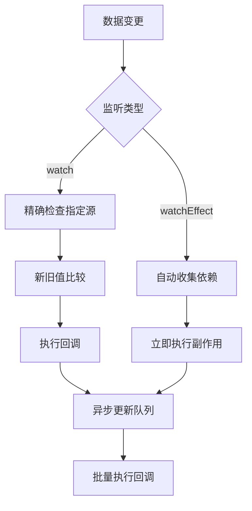

扫描[二维码](https://api2.cmdragon.cn/upload/cmder/20250304_012821924.jpg)关注或者微信搜一搜：`编程智域 前端至全栈交流与成长`

[发现1000+提升效率与开发的AI工具和实用程序](https://tools.cmdragon.cn/zh/apps?category=ai_chat)：https://tools.cmdragon.cn/

# Vue 3 常见问题与最佳实践：避免侦听器陷阱与高效调试

## 一、Vue 3 侦听器核心概念回顾

在 Vue 3 的响应式系统中，`watch` 和 `watchEffect` 是处理异步逻辑和复杂状态变更的核心工具。理解它们的差异和适用场景，是避免陷阱的第一步。

### 1.1 `watch`：精准监听与灵活控制

`watch` 允许你显式指定监听源，并在数据变化时执行回调。它适合需要精确控制触发时机、访问新旧值对比的场景。

```javascript
import {ref, watch} from 'vue'

const count = ref(0)
// 基础监听
watch(count, (newVal, oldVal) => {
    console.log(`计数从 ${oldVal} 变为 ${newVal}`)
})

// 监听多个源
const name = ref('Alice')
watch([count, name], ([newCount, newName]) => {
    console.log(`计数: ${newCount}, 名称: ${newName}`)
})
```

### 1.2 `watchEffect`：自动依赖收集的副作用

`watchEffect` 会自动收集函数内的响应式依赖，当任何依赖变更时重新执行。它适合依赖关系复杂或需要立即执行初始化逻辑的场景。

```javascript
import {watchEffect, ref} from 'vue'

const count = ref(0)
const multiplier = ref(2)

// 自动收集 count 和 multiplier 作为依赖
watchEffect(() => {
    console.log(`计算结果: ${count.value * multiplier.value}`)
})
```

### 1.3 核心差异对比

| 特性    | `watch`                 | `watchEffect` |
|-------|-------------------------|---------------|
| 依赖声明  | 显式指定监听源                 | 自动收集函数内依赖     |
| 初始执行  | 需要 `immediate: true` 触发 | 立即执行一次        |
| 新旧值获取 | 可访问 `newVal`/`oldVal`   | 仅能获取当前值       |
| 适用场景  | 精准响应特定数据变化              | 依赖复杂或动态变化的副作用 |



## 二、常见侦听器陷阱与避坑指南

### 2.1 深度监听的性能陷阱

**问题**：对大型嵌套对象使用 `deep: true` 会导致性能下降，因为 Vue 需要递归遍历所有属性。

**解决方案**：

- 精确监听特定属性而非整个对象
- 使用浅层监听结合手动检查关键属性
- Vue 3.4+ 已优化深度监听，仅追踪实际访问的属性

```javascript
// ❌ 低效：深度监听整个大型对象
const largeObj = reactive({data: {/* 数千个属性 */}})
watch(largeObj, () => {
}, {deep: true})

// ✅ 高效：仅监听关键属性
watch(() => largeObj.data.criticalProp, (newVal) => {
    // 处理逻辑
})
```

### 2.2 内存泄漏风险

**问题**：组件卸载后，未停止的监听器或未清理的异步操作会导致内存泄漏。

**解决方案**：

- 使用 `watch` 返回的停止函数
- 在 `watchEffect` 中使用 `onCleanup` 清理资源
- 在组件卸载钩子中停止监听

```javascript
// 停止监听示例
const stopWatch = watch(count, () => {
})
onUnmounted(stopWatch)

// 清理异步资源
watchEffect((onCleanup) => {
    const timer = setTimeout(() => { /* 操作 */
    }, 1000)
    onCleanup(() => clearTimeout(timer))
})
```

### 2.3 侦听器执行时机错误

**问题**：在 DOM 更新前执行依赖 DOM 的操作，导致元素未找到或操作无效。

**解决方案**：

- 使用 `flush: 'post'` 确保在 DOM 更新后执行
- 结合 `nextTick` 处理 DOM 操作

```javascript
// DOM 更新后执行
watch(chartData, (newData) => {
    nextTick(() => {
        initChart(document.getElementById('chart'), newData)
    })
}, {flush: 'post'})
```

### 2.4 高频操作导致的性能问题

**问题**：搜索框输入、滚动事件等高频操作会频繁触发监听器，导致性能下降。

**解决方案**：

- 使用防抖（debounce）或节流（throttle）控制触发频率
- 优先使用计算属性处理派生状态

```javascript
import {debounce} from 'lodash-es'

const searchQuery = ref('')
watch(
    searchQuery,
    debounce((query) => {
        fetchResults(query) // 仅在用户停止输入300ms后执行
    }, 300)
)
```

## 三、高效调试技巧

### 3.1 使用 Vue DevTools 调试侦听器

Vue DevTools 提供了专门的侦听器面板，可以：

- 查看所有活跃的侦听器
- 手动触发侦听器回调
- 检查侦听器的依赖关系
- 查看侦听器的执行历史

### 3.2 日志调试与条件监听

在开发环境中添加日志，帮助追踪侦听器的执行情况：

```javascript
watch(count, (newVal, oldVal) => {
    if (process.env.NODE_ENV === 'development') {
        console.log(`count 变化: ${oldVal} → ${newVal}`)
    }
    // 业务逻辑
})
```

### 3.3 条件监听优化

只在特定条件下激活侦听器，减少不必要的性能开销：

```javascript
const isEditing = ref(false)
const formData = reactive({name: '', email: ''})

// 仅在编辑模式下验证表单
watch(
    () => (isEditing.value ? formData : null),
    (newData) => {
        if (newData) validateForm(newData)
    },
    {deep: true}
)
```

## 四、课后 Quiz：巩固你的知识

### 问题 1：请区分 `watch` 和 `watchEffect` 的适用场景，并各举一个实际开发中的例子。

**答案解析**：

- `watch` 适合需要精确控制监听源、访问新旧值对比的场景，比如路由参数变化时重新获取数据：
  ```javascript
  watch(() => route.params.id, (newId) => {
    fetchUserData(newId)
  })
  ```
- `watchEffect` 适合依赖关系复杂或需要立即执行初始化逻辑的场景，比如 DOM 更新后自动滚动到指定元素：
  ```javascript
  watchEffect(() => {
    const element = document.getElementById('target')
    if (element) element.scrollIntoView()
  }, { flush: 'post' })
  ```

### 问题 2：如何避免侦听器导致的内存泄漏？

**答案解析**：

1. 使用 `watch` 返回的停止函数，在组件卸载时调用：
   ```javascript
   const stop = watch(/* ... */)
   onUnmounted(stop)
   ```
2. 在 `watchEffect` 中使用 `onCleanup` 清理异步资源：
   ```javascript
   watchEffect((onCleanup) => {
     const socket = new WebSocket('wss://example.com')
     onCleanup(() => socket.close())
   })
   ```
3. 避免在侦听器中引用未清理的定时器、事件监听器等。

## 五、常见报错解决方案

### 错误 1：侦听器未触发

**原因**：

- 监听的不是响应式数据
- 深度监听未开启 `deep: true`
- 监听源是一个非响应式的对象

**解决办法**：

- 确保监听的是 `ref` 或 `reactive` 包装的数据
- 对嵌套对象使用 `deep: true` 或精确监听特定属性
- 使用函数返回监听源，确保响应式追踪

### 错误 2：深度监听性能低下

**原因**：对大型嵌套对象使用 `deep: true`，导致递归遍历所有属性。

**解决办法**：

- 精确监听关键属性而非整个对象
- 使用 Vue 3.4+ 版本，已优化深度监听性能
- 考虑数据扁平化设计

### 错误 3：内存泄漏导致的应用卡顿

**原因**：组件卸载后，侦听器或异步资源未清理。

**解决办法**：

- 使用 `onUnmounted` 停止侦听器
- 在 `watchEffect` 中使用 `onCleanup` 清理资源
- 使用浏览器开发者工具的内存面板检测泄漏

## 六、参考链接

- Vue 官方文档：[侦听器](https://vuejs.org/guide/essentials/watchers.html)
- Vue 官方文档：[响应式系统](https://vuejs.org/guide/extras/reactivity-in-depth.html)

余下文章内容请点击跳转至 个人博客页面 或者 扫描[二维码](https://api2.cmdragon.cn/upload/cmder/20250304_012821924.jpg)
关注或者微信搜一搜：`编程智域 前端至全栈交流与成长`
，阅读完整的文章：[Vue 3 watch与watchEffect如何区分使用？常见陷阱与性能优化技巧有哪些？](https://blog.cmdragon.cn/posts/68a26cc0023e4994a6bc54fb767365c8/)


<details>
<summary>往期文章归档</summary>

- [Vue3侦听器实战：组件与Pinia状态监听如何高效应用？](https://blog.cmdragon.cn/posts/fd4695f668d64332dda9962c24214f32/)
- [Vue 3中何时用watch，何时用watchEffect？核心区别及性能优化策略是什么？](https://blog.cmdragon.cn/posts/cdbbb1837f8c093252e61f46dbf0a2e7/)
- [Vue 3中如何有效管理侦听器的暂停、恢复与副作用清理？](https://blog.cmdragon.cn/posts/09551ab614c463a6d6ca69818e8c2d52/)
- [Vue 3 watchEffect：如何实现响应式依赖的自动追踪与副作用管理？](https://blog.cmdragon.cn/posts/b7bca5d20f628ac09f7192ad935ef664/)
- [Vue 3 watch如何利用immediate、once、deep选项实现初始化、一次性与深度监听？](https://blog.cmdragon.cn/posts/2c6cdb100a20f10c7e7d4413617c7ea9/)
- [Vue 3中watch如何高效监听多数据源、计算结果与数组变化？](https://blog.cmdragon.cn/posts/757a1728bc1b9c0c8b317b0354d85568/)
- [Vue 3中watch监听ref和reactive的核心差异与注意事项是什么？](https://blog.cmdragon.cn/posts/8e70552f0f61e0dc8c7f567a2d272345/)
- [Vue3中Watch与watchEffect的核心差异及适用场景是什么？](https://blog.cmdragon.cn/posts/dde70ab90dc5062c435e0501f5a6e7cb/)
- [Vue 3自定义指令如何赋能表单自动聚焦与防抖输入的高效实现？](https://blog.cmdragon.cn/posts/1f5ed5047850ed52c0fd0386f76bd4ae/)
- [Vue3中如何优雅实现支持多绑定变量和修饰符的双向绑定组件？](https://blog.cmdragon.cn/posts/e3d4e128815ad731611b8ef29e37616b/)
- [Vue 3表单验证如何从基础规则到异步交互构建完整验证体系？](https://blog.cmdragon.cn/posts/7d1caedd822f70542aa0eed67e30963b/)
- [Vue3响应式系统如何支撑表单数据的集中管理、动态扩展与实时计算？](https://blog.cmdragon.cn/posts/3687a5437ab56cb082b5b813d5577a40/)
- [Vue3跨组件通信中，全局事件总线与provide/inject该如何正确选择？](https://blog.cmdragon.cn/posts/ad67c4eb6d76cf7707bdfe6a8146c34f/)
- [Vue3表单事件处理：v-model如何实现数据绑定、验证与提交？](https://blog.cmdragon.cn/posts/1c1e80d697cca0923f29ec70ebb8ccd1/)
- [Vue应用如何基于DOM事件传播机制与事件修饰符实现高效事件处理？](https://blog.cmdragon.cn/posts/b990828143d70aa87f9aa52e16692e48/)
- [Vue3中如何在调用事件处理函数时同时传递自定义参数和原生DOM事件？参数顺序有哪些注意事项？](https://blog.cmdragon.cn/posts/b44316e0866e9f2e6aef927dbcf5152b/)
- [从捕获到冒泡：Vue事件修饰符如何重塑事件执行顺序？](https://blog.cmdragon.cn/posts/021636c2a06f5e2d3d01977a12ddf559/)
- [Vue事件处理：内联还是方法事件处理器，该如何抉择？](https://blog.cmdragon.cn/posts/b3cddf7023ab537e623a61bc01dab6bb/)
- [Vue事件绑定中v-on与@语法如何取舍？参数传递与原生事件处理有哪些实战技巧？](https://blog.cmdragon.cn/posts/bd4d9607ce1bc34cc3bda0a1a46c40f6/)
- [Vue 3中列表排序时为何必须复制数组而非直接修改原始数据？](https://blog.cmdragon.cn/posts/a5f2bacb74476fd7f5e02bb3f1ba6b2b/)
- [Vue虚拟滚动如何将列表DOM数量从万级降至十位数？](https://blog.cmdragon.cn/posts/d3b06b57fb7f126787e6ed22dce1e341/)
- [Vue3中v-if与v-for直接混用为何会报错？计算属性如何解决优先级冲突？](https://blog.cmdragon.cn/posts/3100cc5a2e16f8dac36f722594e6af32/)
- [为何在Vue3递归组件中必须用v-if判断子项存在？](https://blog.cmdragon.cn/posts/455dc2d47c38d12c1cf350e490041e8b/)
- [Vue3列表渲染中，如何用数组方法与计算属性优化v-for的数据处理？](https://blog.cmdragon.cn/posts/3f842bbd7ba0f9c91151b983bf784c8b/)
- [Vue v-for的key：为什么它能解决列表渲染中的“玄学错误”？选错会有哪些后果？](https://blog.cmdragon.cn/posts/1eb3ffac668a743843b5ea1738301d40/)
- [Vue3中v-for与v-if为何不能直接共存于同一元素？](https://blog.cmdragon.cn/posts/138b13c5341f6a1fa9015400433a3611/)
- [Vue3中v-if与v-show的本质区别及动态组件状态保持的关键策略是什么？](https://blog.cmdragon.cn/posts/0242a94dc552b93a1bc335ac4fc33db5/)
- [Vue3中v-show如何通过CSS修改display属性控制条件显示？与v-if的应用场景该如何区分？](https://blog.cmdragon.cn/posts/97c66a18ae0e9b57c6a69b8b3a41ddf6/)
- [Vue3条件渲染中v-if系列指令如何合理使用与规避错误？](https://blog.cmdragon.cn/posts/8a1ddfac64b25062ac56403e4c1201d2/)
- [Vue3动态样式控制：ref、reactive、watch与computed的应用场景与区别是什么？](https://blog.cmdragon.cn/posts/218c3a59282c3b757447ee08a01937bb/)
- [Vue3中动态样式数组的后项覆盖规则如何与计算属性结合实现复杂状态样式管理？](https://blog.cmdragon.cn/posts/1bab953e41f66ac53de099fa9fe76483/)
- [Vue浅响应式如何解决深层响应式的性能问题？适用场景有哪些？ - cmdragon's Blog](https://blog.cmdragon.cn/posts/c85e1fe16a7ae45e965b4e2df4d9d2f4/)
- [Vue 3组合式API中ref与reactive的核心响应式差异及使用最佳实践是什么？ - cmdragon's Blog](https://blog.cmdragon.cn/posts/be04b02d2723994632de0d4ca22a3391/)
- [Vue 3组合式API中ref与reactive的核心响应式差异及使用最佳实践是什么？ - cmdragon's Blog](https://blog.cmdragon.cn/posts/be04b02d2723994632de0d4ca22a3391/)
- [Vue3响应式系统中，对象新增属性、数组改索引、原始值代理的问题如何解决？ - cmdragon's Blog](https://blog.cmdragon.cn/posts/a0af08dd60a37b9a890a9957f2cbfc9f/)
- [Vue 3中watch侦听器的正确使用姿势你掌握了吗？深度监听、与watchEffect的差异及常见报错解析 - cmdragon's Blog](https://blog.cmdragon.cn/posts/bc287e1e36287afd90750fd907eca85e/)
- [Vue响应式声明的API差异、底层原理与常见陷阱你都搞懂了吗 - cmdragon's Blog](https://blog.cmdragon.cn/posts/654b9447ef1ba7ec1126a1bc26a4726d/)
- [Vue响应式声明的API差异、底层原理与常见陷阱你都搞懂了吗 - cmdragon's Blog](https://blog.cmdragon.cn/posts/654b9447ef1ba7ec1126a1bc26a4726d/)
- [为什么Vue 3需要ref函数？它的响应式原理与正确用法是什么？ - cmdragon's Blog](https://blog.cmdragon.cn/posts/c405a8d9950af5b7c63b56c348ac36b6/)
- [Vue 3中reactive函数如何通过Proxy实现响应式？使用时要避开哪些误区？ - cmdragon's Blog](https://blog.cmdragon.cn/posts/a7e9abb9691a81e4404d9facabe0f7c3/)
- [Vue3响应式系统的底层原理与实践要点你真的懂吗？ - cmdragon's Blog](https://blog.cmdragon.cn/posts/bd995ea45161727597fb85b62566c43d/)
- [Vue 3模板如何通过编译三阶段实现从声明式语法到高效渲染的跨越 - cmdragon's Blog](https://blog.cmdragon.cn/posts/53e3f270a80675df662c6857a3332c0f/)
- [快速入门Vue模板引用：从收DOM“快递”到调子组件方法，你玩明白了吗？ - cmdragon's Blog](https://blog.cmdragon.cn/posts/ddbce4f2a23aa72c96b1c0473900321e/)
- [快速入门Vue模板里的JS表达式有啥不能碰？计算属性为啥比方法更能打？ - cmdragon's Blog](https://blog.cmdragon.cn/posts/23a2d5a334e15575277814c16e45df50/)
- [快速入门Vue的v-model表单绑定：语法糖、动态值、修饰符的小技巧你都掌握了吗？ - cmdragon's Blog](https://blog.cmdragon.cn/posts/6be38de6382e31d282659b689c5b17f0/)
- [快速入门Vue3事件处理的挑战题：v-on、修饰符、自定义事件你能通关吗？ - cmdragon's Blog](https://blog.cmdragon.cn/posts/60ce517684f4a418f453d66aa805606c/)
- [快速入门Vue3的v-指令：数据和DOM的“翻译官”到底有多少本事？ - cmdragon's Blog](https://blog.cmdragon.cn/posts/e4ae7d5e4a9205bb11b2baccb230c637/)
- [快速入门Vue3，插值、动态绑定和避坑技巧你都搞懂了吗？ - cmdragon's Blog](https://blog.cmdragon.cn/posts/999ce4fb32259ff4fbf4bf7bcb851654/)
- [想让PostgreSQL快到飞起？先找健康密码还是先换引擎？ - cmdragon's Blog](https://blog.cmdragon.cn/posts/a6997d81b49cd232b87e1cf603888ad1/)
- [想让PostgreSQL查询快到飞起？分区表、物化视图、并行查询这三招灵不灵？ - cmdragon's Blog](https://blog.cmdragon.cn/posts/1fee7afbb9abd4540b8aa9c141d6845d/)
- [子查询总拖慢查询？把它变成连接就能解决？ - cmdragon's Blog](https://blog.cmdragon.cn/posts/79c590fbd87ece535b11a71c9667884f/)
- [PostgreSQL全表扫描慢到崩溃？建索引+改查询+更统计信息三招能破？ - cmdragon's Blog](https://blog.cmdragon.cn/posts/748cdac2536008199abf8a8a2cd0ec85/)
- [复杂查询总拖后腿？PostgreSQL多列索引+覆盖索引的神仙技巧你get没？ - cmdragon's Blog](https://blog.cmdragon.cn/posts/32ca943703226d317d4276a8fb53b0dd/)
- [只给表子集建索引？用函数结果建索引？PostgreSQL这俩操作凭啥能省空间又加速？ - cmdragon's Blog](https://blog.cmdragon.cn/posts/ca93f1d53aa910e7ba5ffd8df611c12b/)
- [B-tree索引像字典查词一样工作？那哪些数据库查询它能加速，哪些不能？ - cmdragon's Blog](https://blog.cmdragon.cn/posts/f507856ebfddd592448813c510a53669/)
- [想抓PostgreSQL里的慢SQL？pg_stat_statements基础黑匣子和pg_stat_monitor时间窗，谁能帮你更准揪出性能小偷？ - cmdragon's Blog](https://blog.cmdragon.cn/posts/b2213bfcb5b88a862f2138404c03d596/)
- [PostgreSQL的“时光机”MVCC和锁机制是怎么搞定高并发的？ - cmdragon's Blog](https://blog.cmdragon.cn/posts/26614eb7da6c476dde41d367ad888d2f/)
- [PostgreSQL性能暴涨的关键？内存IO并发参数居然要这么设置？ - cmdragon's Blog](https://blog.cmdragon.cn/posts/69f99bc6972a860d559c74aad7280da4/)
- [大表查询慢到翻遍整个书架？PostgreSQL分区表教你怎么“分类”才高效](https://blog.cmdragon.cn/posts/7b7053f392147a8b3b1a16bebeb08d0a/)
- [PostgreSQL 查询慢？是不是忘了优化 GROUP BY、ORDER BY 和窗口函数？ - cmdragon's Blog](https://blog.cmdragon.cn/posts/c856e3cb073822349f3bf2d29995dcfc/)
- [PostgreSQL里的子查询和CTE居然在性能上“掐架”？到底该站哪边？ - cmdragon's Blog](https://blog.cmdragon.cn/posts/c096347d18e67b7431faacd2c4757093/)
- [PostgreSQL选Join策略有啥小九九？Nested Loop/Merge/Hash谁是它的菜？ - cmdragon's Blog](https://blog.cmdragon.cn/posts/2eca89463454fd4250d7b66243b9fe5a/)
- [PostgreSQL新手SQL总翻车？这7个性能陷阱你踩过没？ - cmdragon's Blog](https://blog.cmdragon.cn/posts/068ecb772a87d7df20a8c9fb4b233f8e/)
- [PostgreSQL索引选B-Tree还是GiST？“瑞士军刀”和“多面手”的差别你居然还不知道？ - cmdragon's Blog](https://blog.cmdragon.cn/posts/d498f63cd0a2d5a77e445c688a8b88db/)
- [想知道数据库怎么给查询“算成本选路线”？EXPLAIN能帮你看明白？ - cmdragon's Blog](https://blog.cmdragon.cn/posts/9101b75bdec6faea9b35d54f14e37f36/)
- [PostgreSQL处理SQL居然像做蛋糕？解析到执行的4步里藏着多少查询优化的小心机？ - cmdragon's Blog](https://blog.cmdragon.cn/posts/d527f8ebb6e3dae2c7dfe4c8d8979444/)
- [PostgreSQL备份不是复制文件？物理vs逻辑咋选？误删还能精准恢复到1分钟前？ - cmdragon's Blog](https://blog.cmdragon.cn/posts/6bfdae84f313cf7ad0bb7045c4392347/)
- [转账不翻车、并发不干扰，PostgreSQL的ACID特性到底有啥魔法？ - cmdragon's Blog](https://blog.cmdragon.cn/posts/de3672803de34dbad244d0a8d48b0eb5/)
- [银行转账不白扣钱、电商下单不超卖，PostgreSQL事务的诀窍是啥？ - cmdragon's Blog](https://blog.cmdragon.cn/posts/e463e8a2668abdf00a228c9b79324ded/)
- [PostgreSQL里的PL/pgSQL到底是啥？能让SQL从“说目标”变“讲步骤”？ - cmdragon's Blog](https://blog.cmdragon.cn/posts/5c967e595058c4a1fc4474a68e64031d/)
- [PostgreSQL视图不存数据？那它怎么简化查询还能递归生成序列和控制权限？ - cmdragon's Blog](https://blog.cmdragon.cn/posts/325047855e3e23b5ef82f7d2db134fbd/)
- [PostgreSQL索引这么玩，才能让你的查询真的“飞”起来？ - cmdragon's Blog](https://blog.cmdragon.cn/posts/d2dba50bb6e4df7b27e735245a06a2a2/)
- [PostgreSQL的表关系和约束，咋帮你搞定用户订单不混乱、学生选课不重复？ - cmdragon's Blog](https://blog.cmdragon.cn/posts/849ae5bab0f8c66e94c2f6ad1bb798e3/)
- [PostgreSQL查询的筛子、排序、聚合、分组？你会用它们搞定数据吗？ - cmdragon's Blog](https://blog.cmdragon.cn/posts/ef4800975ffa84f1ca51976a70a1585b/)
- [PostgreSQL数据类型怎么选才高效不踩坑？ - cmdragon's Blog](https://blog.cmdragon.cn/posts/bf54711525c507c5eacfa7b0151c39d2/)
- [想解锁PostgreSQL查询从基础到进阶的核心知识点？你都get了吗？ - cmdragon's Blog](https://blog.cmdragon.cn/posts/887809b3e0375f5956873cd442f516d8/)
- [PostgreSQL DELETE居然有这些操作？返回数据、连表删你试过没？ - cmdragon's Blog](https://blog.cmdragon.cn/posts/934be1203725e8be9d6f6e9104e5abcc/)
- [PostgreSQL UPDATE语句怎么玩？从改邮箱到批量更新的避坑技巧你都会吗？ - cmdragon's Blog](https://blog.cmdragon.cn/posts/0f0622e9b7402b599e618150d0596ffe/)
- [PostgreSQL插入数据还在逐条敲？批量、冲突处理、返回自增ID的技巧你会吗？ - cmdragon's Blog](https://blog.cmdragon.cn/posts/0e3bf7efc030b024ea67ee855a00f2de/)
- [PostgreSQL的“仓库-房间-货架”游戏，你能建出电商数据库和表吗？ - cmdragon's Blog](https://blog.cmdragon.cn/posts/b6cd3c86da6aac26ed829e472d34078e/)
- [PostgreSQL 17安装总翻车？Windows/macOS/Linux避坑指南帮你搞定？ - cmdragon's Blog](https://blog.cmdragon.cn/posts/ba1f545a3410144552fbdbfcf31b5265/)
- [能当关系型数据库还能玩对象特性，能拆复杂查询还能自动管库存，PostgreSQL凭什么这么香？ - cmdragon's Blog](https://blog.cmdragon.cn/posts/b5474d1480509c5072085abc80b3dd9f/)
- [给接口加新字段又不搞崩老客户端？FastAPI的多版本API靠哪三招实现？ - cmdragon's Blog](https://blog.cmdragon.cn/posts/cc098d8836e787baa8a4d92e4d56d5c5/)
- [流量突增要搞崩FastAPI？熔断测试是怎么防系统雪崩的？ - cmdragon's Blog](https://blog.cmdragon.cn/posts/46d05151c5bd31cf37a7bcf0b8f5b0b8/)
- [FastAPI秒杀库存总变负数？Redis分布式锁能帮你守住底线吗 - cmdragon's Blog](https://blog.cmdragon.cn/posts/65ce343cc5df9faf3a8e2eeaab42ae45/)
- [FastAPI的CI流水线怎么自动测端点，还能让Allure报告美到犯规？ - cmdragon's Blog](https://blog.cmdragon.cn/posts/eed6cd8985d9be0a4b092a7da38b3e0c/)
- [如何用GitHub Actions为FastAPI项目打造自动化测试流水线？ - cmdragon's Blog](https://blog.cmdragon.cn/posts/6157d87338ce894d18c013c3c4777abb/)

</details>


<details>
<summary>免费好用的热门在线工具</summary>

- [文件格式转换器 - 应用商店 | By cmdragon](https://tools.cmdragon.cn/zh/apps/file-converter)
- [M3U8在线播放器 - 应用商店 | By cmdragon](https://tools.cmdragon.cn/zh/apps/m3u8-player)
- [快图设计 - 应用商店 | By cmdragon](https://tools.cmdragon.cn/zh/apps/quick-image-design)
- [高级文字转图片转换器 - 应用商店 | By cmdragon](https://tools.cmdragon.cn/zh/apps/text-to-image-advanced)
- [RAID 计算器 - 应用商店 | By cmdragon](https://tools.cmdragon.cn/zh/apps/raid-calculator)
- [在线PS - 应用商店 | By cmdragon](https://tools.cmdragon.cn/zh/apps/photoshop-online)
- [Mermaid 在线编辑器 - 应用商店 | By cmdragon](https://tools.cmdragon.cn/zh/apps/mermaid-live-editor)
- [数学求解计算器 - 应用商店 | By cmdragon](https://tools.cmdragon.cn/zh/apps/math-solver-calculator)
- [智能提词器 - 应用商店 | By cmdragon](https://tools.cmdragon.cn/zh/apps/smart-teleprompter)
- [魔法简历 - 应用商店 | By cmdragon](https://tools.cmdragon.cn/zh/apps/magic-resume)
- [Image Puzzle Tool - 图片拼图工具 | By cmdragon](https://tools.cmdragon.cn/zh/apps/image-puzzle-tool)
- [字幕下载工具 - 应用商店 | By cmdragon](https://tools.cmdragon.cn/zh/apps/subtitle-downloader)
- [歌词生成工具 - 应用商店 | By cmdragon](https://tools.cmdragon.cn/zh/apps/lyrics-generator)
- [网盘资源聚合搜索 - 应用商店 | By cmdragon](https://tools.cmdragon.cn/zh/apps/cloud-drive-search)
- [ASCII字符画生成器 - 应用商店 | By cmdragon](https://tools.cmdragon.cn/zh/apps/ascii-art-generator)
- [JSON Web Tokens 工具 - 应用商店 | By cmdragon](https://tools.cmdragon.cn/zh/apps/jwt-tool)
- [Bcrypt 密码工具 - 应用商店 | By cmdragon](https://tools.cmdragon.cn/zh/apps/bcrypt-tool)
- [GIF 合成器 - 应用商店 | By cmdragon](https://tools.cmdragon.cn/zh/apps/gif-composer)
- [GIF 分解器 - 应用商店 | By cmdragon](https://tools.cmdragon.cn/zh/apps/gif-decomposer)
- [文本隐写术 - 应用商店 | By cmdragon](https://tools.cmdragon.cn/zh/apps/text-steganography)
- [CMDragon 在线工具 - 高级AI工具箱与开发者套件 | 免费好用的在线工具](https://tools.cmdragon.cn/zh)
- [应用商店 - 发现1000+提升效率与开发的AI工具和实用程序 | 免费好用的在线工具](https://tools.cmdragon.cn/zh/apps?category=trending)
- [CMDragon 更新日志 - 最新更新、功能与改进 | 免费好用的在线工具](https://tools.cmdragon.cn/zh/changelog)
- [支持我们 - 成为赞助者 | 免费好用的在线工具](https://tools.cmdragon.cn/zh/sponsor)
- [AI文本生成图像 - 应用商店 | 免费好用的在线工具](https://tools.cmdragon.cn/zh/apps/text-to-image-ai)
- [临时邮箱 - 应用商店 | 免费好用的在线工具](https://tools.cmdragon.cn/zh/apps/temp-email)
- [二维码解析器 - 应用商店 | 免费好用的在线工具](https://tools.cmdragon.cn/zh/apps/qrcode-parser)
- [文本转思维导图 - 应用商店 | 免费好用的在线工具](https://tools.cmdragon.cn/zh/apps/text-to-mindmap)
- [正则表达式可视化工具 - 应用商店 | 免费好用的在线工具](https://tools.cmdragon.cn/zh/apps/regex-visualizer)
- [文件隐写工具 - 应用商店 | 免费好用的在线工具](https://tools.cmdragon.cn/zh/apps/steganography-tool)
- [IPTV 频道探索器 - 应用商店 | 免费好用的在线工具](https://tools.cmdragon.cn/zh/apps/iptv-explorer)
- [快传 - 应用商店 | 免费好用的在线工具](https://tools.cmdragon.cn/zh/apps/snapdrop)
- [随机抽奖工具 - 应用商店 | 免费好用的在线工具](https://tools.cmdragon.cn/zh/apps/lucky-draw)
- [动漫场景查找器 - 应用商店 | 免费好用的在线工具](https://tools.cmdragon.cn/zh/apps/anime-scene-finder)
- [时间工具箱 - 应用商店 | 免费好用的在线工具](https://tools.cmdragon.cn/zh/apps/time-toolkit)
- [网速测试 - 应用商店 | 免费好用的在线工具](https://tools.cmdragon.cn/zh/apps/speed-test)
- [AI 智能抠图工具 - 应用商店 | 免费好用的在线工具](https://tools.cmdragon.cn/zh/apps/background-remover)
- [背景替换工具 - 应用商店 | 免费好用的在线工具](https://tools.cmdragon.cn/zh/apps/background-replacer)
- [艺术二维码生成器 - 应用商店 | 免费好用的在线工具](https://tools.cmdragon.cn/zh/apps/artistic-qrcode)
- [Open Graph 元标签生成器 - 应用商店 | 免费好用的在线工具](https://tools.cmdragon.cn/zh/apps/open-graph-generator)
- [图像对比工具 - 应用商店 | 免费好用的在线工具](https://tools.cmdragon.cn/zh/apps/image-comparison)
- [图片压缩专业版 - 应用商店 | 免费好用的在线工具](https://tools.cmdragon.cn/zh/apps/image-compressor)
- [密码生成器 - 应用商店 | 免费好用的在线工具](https://tools.cmdragon.cn/zh/apps/password-generator)
- [SVG优化器 - 应用商店 | 免费好用的在线工具](https://tools.cmdragon.cn/zh/apps/svg-optimizer)
- [调色板生成器 - 应用商店 | 免费好用的在线工具](https://tools.cmdragon.cn/zh/apps/color-palette)
- [在线节拍器 - 应用商店 | 免费好用的在线工具](https://tools.cmdragon.cn/zh/apps/online-metronome)
- [IP归属地查询 - 应用商店 | 免费好用的在线工具](https://tools.cmdragon.cn/zh/apps/ip-geolocation)
- [CSS网格布局生成器 - 应用商店 | 免费好用的在线工具](https://tools.cmdragon.cn/zh/apps/css-grid-layout)
- [邮箱验证工具 - 应用商店 | 免费好用的在线工具](https://tools.cmdragon.cn/zh/apps/email-validator)
- [书法练习字帖 - 应用商店 | 免费好用的在线工具](https://tools.cmdragon.cn/zh/apps/calligraphy-practice)
- [金融计算器套件 - 应用商店 | 免费好用的在线工具](https://tools.cmdragon.cn/zh/apps/finance-calculator-suite)
- [中国亲戚关系计算器 - 应用商店 | 免费好用的在线工具](https://tools.cmdragon.cn/zh/apps/chinese-kinship-calculator)
- [Protocol Buffer 工具箱 - 应用商店 | 免费好用的在线工具](https://tools.cmdragon.cn/zh/apps/protobuf-toolkit)
- [IP归属地查询 - 应用商店 | 免费好用的在线工具](https://tools.cmdragon.cn/zh/apps/ip-geolocation)
- [图片无损放大 - 应用商店 | 免费好用的在线工具](https://tools.cmdragon.cn/zh/apps/image-upscaler)
- [文本比较工具 - 应用商店 | 免费好用的在线工具](https://tools.cmdragon.cn/zh/apps/text-compare)
- [IP批量查询工具 - 应用商店 | 免费好用的在线工具](https://tools.cmdragon.cn/zh/apps/ip-batch-lookup)
- [域名查询工具 - 应用商店 | 免费好用的在线工具](https://tools.cmdragon.cn/zh/apps/domain-finder)
- [DNS工具箱 - 应用商店 | 免费好用的在线工具](https://tools.cmdragon.cn/zh/apps/dns-toolkit)
- [网站图标生成器 - 应用商店 | 免费好用的在线工具](https://tools.cmdragon.cn/zh/apps/favicon-generator)
- [XML Sitemap](https://tools.cmdragon.cn/sitemap_index.xml)

</details>