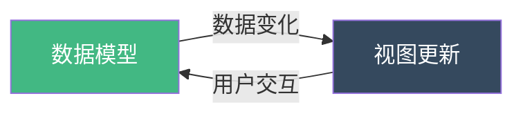

扫描 [二维码](https://api2.cmdragon.cn/upload/cmder/20250304_012821924.jpg) 关注或者微信搜一搜：`编程智域 前端至全栈交流与成长`

[发现 1000+ 提升效率与开发的 AI 工具和实用程序](https://tools.cmdragon.cn/zh/apps?category=ai_chat)：https://tools.cmdragon.cn/

## 1. v-model 双向绑定原理深度剖析

在 Vue 3 中，`v-model` 是实现双向数据绑定的核心指令。理解其底层原理对于掌握组件通信至关重要。

### 1.1 什么是双向绑定？

双向绑定是指数据模型（Model）和视图（View）之间的同步机制：



**核心特点：**

- 数据变化 → 视图自动更新
- 视图交互 → 数据自动同步
- 无需手动操作 DOM

### 1.2 v-model 的本质：语法糖

`v-model` 实际上是 `v-bind` 和 `v-on` 的组合语法糖。

```vue
<!-- ❌ 错误理解：认为 v-model 是神秘的黑盒 -->
<template>
  <input v-model="message" />
</template>

<script setup>
import { ref } from "vue";
const message = ref("");
// 不知道底层发生了什么
</script>
```

```vue
<!-- ✅ 正确理解：v-model 的等价展开 -->
<template>
  <!-- v-model 的完整展开形式 -->
  <input :value="message" @input="message = $event.target.value" />

  <!-- 或者使用 v-bind 和 @input -->
  <input v-bind:value="message" v-on:input="message = $event.target.value" />
</template>

<script setup>
import { ref } from "vue";
const message = ref("");
</script>
```

### 1.3 组件上的 v-model 展开

在组件上使用 `v-model` 时，展开规则有所不同：

```vue
<!-- 父组件使用 v-model -->
<template>
  <CustomInput v-model="searchText" />
</template>

<script setup>
import { ref } from "vue";
import CustomInput from "./CustomInput.vue";
const searchText = ref("");
</script>
```

```vue
<!-- CustomInput.vue - 子组件接收 -->
<template>
  <input
    :value="modelValue"
    @input="$emit('update:modelValue', $event.target.value)"
  />
</template>

<script setup>
// 接收 prop
defineProps(["modelValue"]);

// 声明 emit
defineEmits(["update:modelValue"]);
</script>
```

**展开等价于：**

```vue
<!-- 父组件的 v-model 展开 -->
<CustomInput
  :modelValue="searchText"
  @update:modelValue="searchText = $event"
/>
```

## 2. Vue 2 与 Vue 3 的 v-model 核心差异

### 2.1 Vue 2 的 v-model 机制

```vue
<!-- Vue 2 中的 v-model -->
<template>
  <custom-input v-model="searchText" />
</template>
```

```vue
<!-- Vue 2 子组件实现 -->
<script>
export default {
  model: {
    prop: "value",
    event: "input",
  },
  props: {
    value: String, // 固定使用 value prop
  },
  methods: {
    handleInput(event) {
      this.$emit("input", event.target.value); // 固定使用 input 事件
    },
  },
};
</script>
```

**Vue 2 的限制：**

- 只能使用 `value` prop
- 只能触发 `input` 事件
- 一个组件只能有一个 v-model

### 2.2 Vue 3 的 v-model 革新

```vue
<!-- Vue 3 中的 v-model -->
<template>
  <custom-input v-model="searchText" />
</template>
```

```vue
<!-- Vue 3 子组件实现 -->
<script setup>
const props = defineProps({
  modelValue: String, // 默认使用 modelValue
});

const emit = defineEmits(["update:modelValue"]); // 默认使用 update:modelValue
</script>
```

**Vue 3 的改进：**

- ✅ 默认 prop 改为 `modelValue`
- ✅ 默认事件改为 `update:modelValue`
- ✅ 支持多个 v-model 绑定
- ✅ 支持自定义参数名称

### 2.3 差异对比表

| 特性         | Vue 2             | Vue 3                   |
| ------------ | ----------------- | ----------------------- |
| 默认 prop    | `value`           | `modelValue`            |
| 默认事件     | `input`           | `update:modelValue`     |
| 多 v-model   | ❌ 不支持         | ✅ 支持                 |
| 自定义名称   | 需配置 model 选项 | ✅ 直接支持参数         |
| .sync 修饰符 | ✅ 存在           | ❌ 移除，合并到 v-model |

## 3. .sync 修饰符的演变

### 3.1 Vue 2 中的 .sync

```vue
<!-- Vue 2 使用 .sync -->
<template>
  <document-title :title.sync="docTitle" />
</template>

<script>
export default {
  data() {
    return {
      docTitle: "文档标题",
    };
  },
};
</script>
```

```vue
<!-- Vue 2 子组件处理 .sync -->
<script>
export default {
  props: ["title"],
  methods: {
    updateTitle(newTitle) {
      this.$emit("update:title", newTitle); // 特定格式
    },
  },
};
</script>
```

### 3.2 Vue 3 中的统一

Vue 3 移除了 `.sync`，统一使用 `v-model`：

```vue
<!-- Vue 3 统一使用 v-model -->
<template>
  <!-- 等价于 Vue 2 的 .sync -->
  <document-title v-model:title="docTitle" />

  <!-- 或者默认 v-model -->
  <document-title v-model="docTitle" />
</template>

<script setup>
import { ref } from "vue";
const docTitle = ref("文档标题");
</script>
```

## 4. 实战示例：理解语法糖

### 4.1 基础表单输入

```vue
<!-- FormInput.vue - 基础表单组件 -->
<template>
  <div class="form-input">
    <label>{{ label }}</label>
    <input
      :value="modelValue"
      @input="$emit('update:modelValue', $event.target.value)"
      :type="type"
      :placeholder="placeholder"
      class="input-field"
    />
  </div>
</template>

<script setup>
defineProps({
  modelValue: [String, Number],
  label: {
    type: String,
    default: "",
  },
  type: {
    type: String,
    default: "text",
  },
  placeholder: {
    type: String,
    default: "",
  },
});

defineEmits(["update:modelValue"]);
</script>

<style scoped>
.form-input {
  margin-bottom: 16px;
}

label {
  display: block;
  margin-bottom: 8px;
  font-weight: 500;
  color: #333;
}

.input-field {
  width: 100%;
  padding: 10px 12px;
  border: 2px solid #ddd;
  border-radius: 6px;
  font-size: 14px;
  transition: border-color 0.3s;
}

.input-field:focus {
  outline: none;
  border-color: #42b883;
}
</style>
```

```vue
<!-- 使用基础表单组件 -->
<template>
  <div class="app">
    <h2>用户信息</h2>

    <form @submit.prevent="handleSubmit">
      <FormInput v-model="username" label="用户名" placeholder="请输入用户名" />

      <FormInput
        v-model="email"
        label="邮箱"
        type="email"
        placeholder="请输入邮箱"
      />

      <button type="submit" class="submit-btn">提交</button>
    </form>

    <div class="preview">
      <h3>实时预览</h3>
      <pre>{{ formData }}</pre>
    </div>
  </div>
</template>

<script setup>
import { ref, computed } from "vue";
import FormInput from "./FormInput.vue";

const username = ref("");
const email = ref("");

const formData = computed(() => ({
  username: username.value,
  email: email.value,
}));

const handleSubmit = () => {
  console.log("提交数据:", formData.value);
};
</script>

<style scoped>
.app {
  max-width: 500px;
  margin: 40px auto;
  padding: 24px;
  background: #fff;
  border-radius: 12px;
  box-shadow: 0 4px 12px rgba(0, 0, 0, 0.1);
}

h2 {
  margin-bottom: 24px;
  color: #333;
}

.submit-btn {
  width: 100%;
  padding: 12px;
  background: #42b883;
  color: white;
  border: none;
  border-radius: 6px;
  font-size: 16px;
  cursor: pointer;
  transition: background 0.3s;
}

.submit-btn:hover {
  background: #369970;
}

.preview {
  margin-top: 32px;
  padding: 16px;
  background: #f5f5f5;
  border-radius: 6px;
}

.preview h3 {
  margin-top: 0;
  color: #666;
}

pre {
  background: #282c34;
  color: #abb2bf;
  padding: 16px;
  border-radius: 6px;
  overflow-x: auto;
}
</style>
```

### 4.2 自定义双向绑定组件

```vue
<!-- Counter.vue - 计数器组件 -->
<template>
  <div class="counter">
    <button @click="decrement" class="counter-btn" :disabled="count <= min">
      -
    </button>

    <span class="counter-value">{{ count }}</span>

    <button @click="increment" class="counter-btn" :disabled="count >= max">
      +
    </button>
  </div>
</template>

<script setup>
const props = defineProps({
  modelValue: {
    type: Number,
    default: 0,
  },
  min: {
    type: Number,
    default: 0,
  },
  max: {
    type: Number,
    default: 100,
  },
});

const emit = defineEmits(["update:modelValue"]);

const increment = () => {
  if (props.count < props.max) {
    emit("update:modelValue", props.count + 1);
  }
};

const decrement = () => {
  if (props.count > props.min) {
    emit("update:modelValue", props.count - 1);
  }
};
</script>

<style scoped>
.counter {
  display: flex;
  align-items: center;
  gap: 16px;
}

.counter-btn {
  width: 40px;
  height: 40px;
  border: none;
  border-radius: 50%;
  background: #42b883;
  color: white;
  font-size: 20px;
  cursor: pointer;
  transition: all 0.3s;
}

.counter-btn:hover:not(:disabled) {
  background: #369970;
  transform: scale(1.1);
}

.counter-btn:disabled {
  background: #ccc;
  cursor: not-allowed;
}

.counter-value {
  font-size: 24px;
  font-weight: bold;
  color: #333;
  min-width: 40px;
  text-align: center;
}
</style>
```

```vue
<!-- 使用计数器组件 -->
<template>
  <div class="app">
    <h2>计数器示例</h2>

    <Counter v-model="count" :min="0" :max="10" />

    <div class="info">
      <p>当前值：{{ count }}</p>
      <p>最小值：0</p>
      <p>最大值：10</p>
    </div>

    <button @click="resetCount" class="reset-btn">重置</button>
  </div>
</template>

<script setup>
import { ref } from "vue";
import Counter from "./Counter.vue";

const count = ref(5);

const resetCount = () => {
  count.value = 5;
};
</script>

<style scoped>
.app {
  max-width: 400px;
  margin: 40px auto;
  padding: 24px;
  background: #fff;
  border-radius: 12px;
  box-shadow: 0 4px 12px rgba(0, 0, 0, 0.1);
}

h2 {
  margin-bottom: 32px;
  text-align: center;
  color: #333;
}

.info {
  margin-top: 24px;
  padding: 16px;
  background: #f5f5f5;
  border-radius: 6px;
}

.info p {
  margin: 8px 0;
  color: #666;
}

.reset-btn {
  margin-top: 16px;
  width: 100%;
  padding: 12px;
  background: #3498db;
  color: white;
  border: none;
  border-radius: 6px;
  cursor: pointer;
  transition: background 0.3s;
}

.reset-btn:hover {
  background: #2980b9;
}
</style>
```

## 5. 常见误区与正确理解

### 5.1 误区一：v-model 是魔法

```vue
<!-- ❌ 错误：不知道 v-model 的展开形式 -->
<template>
  <CustomInput v-model="text" />
</template>

<!-- ✅ 正确：清楚知道等价形式 -->
<template>
  <CustomInput :modelValue="text" @update:modelValue="text = $event" />
</template>
```

### 5.2 误区二：直接修改 prop

```vue
<!-- ❌ 错误：直接修改 prop 值 -->
<script setup>
const props = defineProps(["modelValue"]);

const handleChange = (e) => {
  props.modelValue = e.target.value; // 错误！不能直接修改 prop
};
</script>

<!-- ✅ 正确：通过 emit 通知父组件更新 -->
<script setup>
defineProps(["modelValue"]);
const emit = defineEmits(["update:modelValue"]);

const handleChange = (e) => {
  emit("update:modelValue", e.target.value); // 正确
};
</script>
```

### 5.3 误区三：忽略单向数据流

```vue
<!-- ❌ 错误：子组件直接修改传入的值 -->
<script setup>
const props = defineProps(["modelValue"]);

// 错误：直接修改会导致警告
props.modelValue = "new value";
</script>

<!-- ✅ 正确：遵循单向数据流 -->
<script setup>
defineProps(["modelValue"]);
const emit = defineEmits(["update:modelValue"]);

// 通过 emit 请求父组件更新
const updateValue = () => {
  emit("update:modelValue", "new value");
};
</script>
```

## 6. 课后 Quiz

### 题目 1：v-model 的等价形式

**问题：** `<input v-model="message" />` 的完整展开形式是什么？

**答案：**

```vue
<input :value="message" @input="message = $event.target.value" />
```

或者：

```vue
<input v-bind:value="message" v-on:input="message = $event.target.value" />
```

### 题目 2：组件 v-model 的 prop 和事件

**问题：** Vue 3 组件上使用 `v-model` 默认使用什么 prop 和事件？

**答案：**

- 默认 prop：`modelValue`
- 默认事件：`update:modelValue`

### 题目 3：Vue 2 与 Vue 3 的差异

**问题：** Vue 3 的 v-model 相比 Vue 2 有哪些主要改进？

**答案：**

1. 默认 prop 从 `value` 改为 `modelValue`
2. 默认事件从 `input` 改为 `update:modelValue`
3. 支持多个 v-model 绑定
4. 支持自定义参数名称
5. 移除了 `.sync`，统一使用 v-model

## 7. 常见报错解决方案

### 报错 1：`Avoid mutating a prop directly`

**产生原因：**

- 在子组件中直接修改 prop 值

**解决办法：**

```vue
<!-- ❌ 错误 -->
<script setup>
const props = defineProps(["modelValue"]);
props.modelValue = "new value"; // 报错
</script>

<!-- ✅ 正确 -->
<script setup>
defineProps(["modelValue"]);
const emit = defineEmits(["update:modelValue"]);
emit("update:modelValue", "new value");
</script>
```

### 报错 2：v-model 不生效

**产生原因：**

- prop 名称或事件名称不匹配

**解决办法：**

```vue
<!-- ✅ 确保名称一致 -->
<script setup>
defineProps({
  modelValue: String, // 必须是 modelValue
});

defineEmits(["update:modelValue"]); // 必须是 update:modelValue
</script>
```

### 报错 3：响应式丢失

**产生原因：**

- 未使用响应式变量

**解决办法：**

```vue
<!-- ❌ 错误 -->
<script setup>
const message = ""; // 普通变量，无响应式
</script>

<!-- ✅ 正确 -->
<script setup>
import { ref } from "vue";
const message = ref(""); // 响应式变量
</script>
```

## 8. 最佳实践建议

1. **理解本质：** 始终记住 v-model 是语法糖
2. **遵循单向数据流：** 不要直接修改 prop
3. **使用语义化名称：** 多个 v-model 时使用清晰的名称
4. **类型验证：** 为 modelValue 添加类型定义
5. **文档化：** 在组件文档中说明 v-model 的使用方式

---

参考链接：https://vuejs.org/guide/components/v-model.html

余下文章内容请点击跳转至 个人博客页面 或者 扫描 [二维码](https://api2.cmdragon.cn/upload/cmder/20250304_012821924.jpg) 关注或者微信搜一搜：`编程智域 前端至全栈交流与成长`，阅读完整的文章：[Vue 3 组件 v-model 第一章：基础概念与语法糖本质完全解析](https://blog.cmdragon.cn/posts/vue3-component-v-model-chapter-1-fundamentals/)

<details>
<summary>往期文章归档</summary>

- [Vue 3 组件事件性能优化与最佳实践完整指南](https://blog.cmdragon.cn/posts/vue3-component-events-performance-optimization/)
- [Vue 3 动态事件、事件参数与异步事件处理完整指南](https://blog.cmdragon.cn/posts/vue3-dynamic-events-parameters-async-handling/)
- [Vue 3 跨层级组件事件通信：mitt 事件总线与依赖注入完整指南](https://blog.cmdragon.cn/posts/vue3-cross-level-component-event-communication/)
- [Vue 3 组件事件实战：表单、模态框等场景的综合应用指南](https://blog.cmdragon.cn/posts/vue3-component-events-practical-applications/)
- [Vue 3 静态与动态 Props 如何传递？TypeScript 类型约束有何必要？](https://blog.cmdragon.cn/posts/94ab48753b64780ca3ab7a7115ae8522/)
- [Vue 3 中组件局部注册的优势与实现方式如何？](https://blog.cmdragon.cn/posts/dbf576e744870f6de26fd8a2e03e47da/)
- [如何在 Vue3 中优化生命周期钩子性能并规避常见陷阱？](https://blog.cmdragon.cn/posts/12d98b3b9ccd6c19a1b169d720ac5c80/)
- [Vue 3 Composition API 生命周期钩子：如何实现从基础理解到高阶复用？](https://blog.cmdragon.cn/posts/8884e2b70287fcb263c57648eeb27419/)
- [Vue 3 生命周期钩子实战指南：如何正确选择 onMounted、onUpdated 与 onUnmounted 的应用场景？](https://blog.cmdragon.cn/posts/883c6dbc50ae4183770a4462e0b8ae4d/)
- [Vue 3 中生命周期钩子与响应式系统如何实现协同工作？](https://blog.cmdragon.cn/posts/70dad360ffa9dce14d0d69611b8cb019/)

</details>

<details>
<summary>免费好用的热门在线工具</summary>

- [多直播聚合器 - 应用商店 | By cmdragon](https://tools.cmdragon.cn/zh/apps/multi-live-aggregator)
- [Proto 文件生成器 - 应用商店 | By cmdragon](https://tools.cmdragon.cn/zh/apps/proto-file-generator)
- [图片转粒子 - 应用商店 | By cmdragon](https://tools.cmdragon.cn/zh/apps/image-to-particles)
- [视频下载器 - 应用商店 | By cmdragon](https://tools.cmdragon.cn/zh/apps/video-downloader)
- [文件格式转换器 - 应用商店 | By cmdragon](https://tools.cmdragon.cn/zh/apps/file-converter)
- [M3U8 在线播放器 - 应用商店 | By cmdragon](https://tools.cmdragon.cn/zh/apps/m3u8-player)
- [快图设计 - 应用商店 | By cmdragon](https://tools.cmdragon.cn/zh/apps/quick-image-design)
- [高级文字转图片转换器 - 应用商店 | By cmdragon](https://tools.cmdragon.cn/zh/apps/text-to-image-advanced)
- [RAID 计算器 - 应用商店 | By cmdragon](https://tools.cmdragon.cn/zh/apps/raid-calculator)
- [在线 PS - 应用商店 | By cmdragon](https://tools.cmdragon.cn/zh/apps/photoshop-online)
- [Mermaid 在线编辑器 - 应用商店 | By cmdragon](https://tools.cmdragon.cn/zh/apps/mermaid-live-editor)
- [数学求解计算器 - 应用商店 | By cmdragon](https://tools.cmdragon.cn/zh/apps/math-solver-calculator)
- [智能提词器 - 应用商店 | By cmdragon](https://tools.cmdragon.cn/zh/apps/smart-teleprompter)
- [魔法简历 - 应用商店 | By cmdragon](https://tools.cmdragon.cn/zh/apps/magic-resume)
- [CMDragon 在线工具 - 高级 AI 工具箱与开发者套件 | 免费好用的在线工具](https://tools.cmdragon.cn/zh)

</details>
