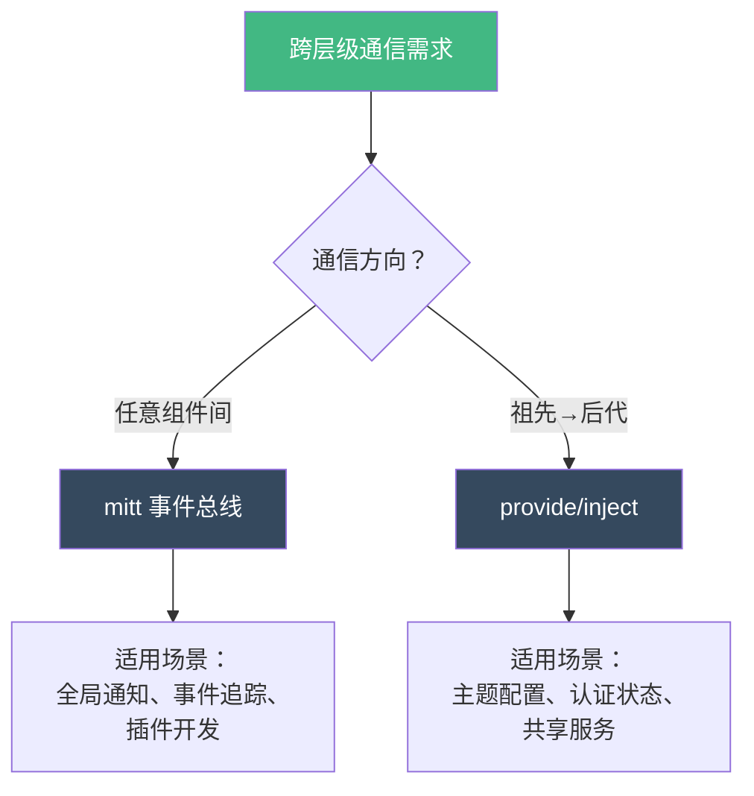
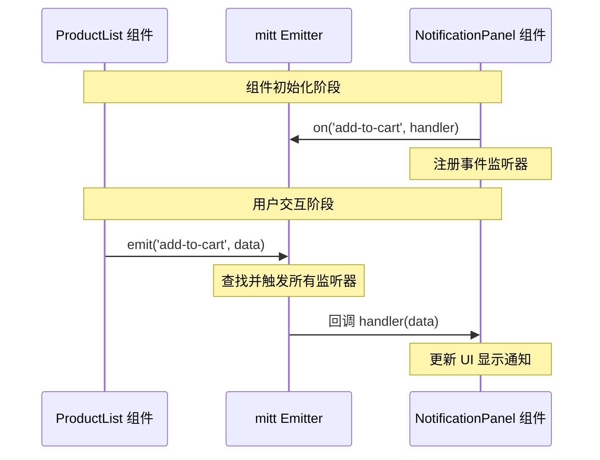
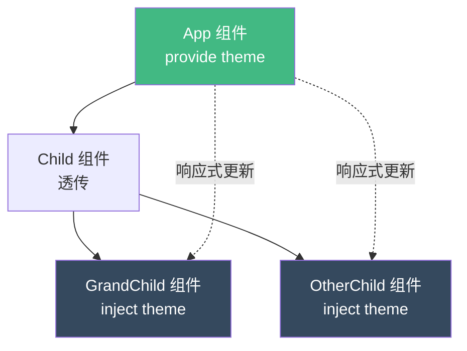
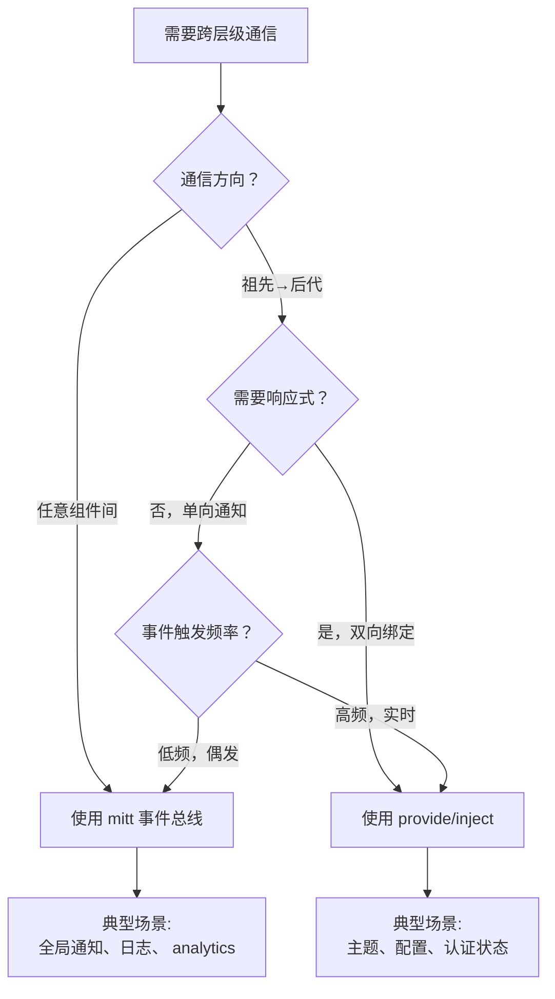

扫描 [二维码](https://api2.cmdragon.cn/upload/cmder/20250304_012821924.jpg) 关注或者微信搜一搜：`编程智域 前端至全栈交流与成长`

[发现 1000+ 提升效率与开发的 AI 工具和实用程序](https://tools.cmdragon.cn/zh/apps?category=ai_chat)：https://tools.cmdragon.cn/

## 1. 跨层级通信的挑战与解决方案

在 Vue 3 组件化开发中，当组件树层级较深时，组件间通信 becomes 一个棘手的问题。想象这样一个场景：最外层的 App 组件需要与最深层的 Notification 组件通信，如果采用传统的 props 和 events 方式，会发生什么？

### 1.1 Props Drilling 的痛点

```vue
<!-- App.vue -->
<template>
  <div>
    <Header :theme="theme" @theme-change="handleThemeChange" />
    <MainContent :theme="theme" @theme-change="handleThemeChange" />
    <Footer :theme="theme" @theme-change="handleThemeChange" />
  </div>
</template>

<script setup>
import { ref } from "vue";
const theme = ref("light");

const handleThemeChange = (newTheme) => {
  theme.value = newTheme;
};
</script>
```

```vue
<!-- Header.vue -->
<template>
  <div>
    <h1>Header</h1>
    <!-- Header 本身不需要 theme，但必须传递给 Sidebar -->
    <Sidebar :theme="theme" @theme-change="$emit('theme-change', $event)" />
  </div>
</template>

<script setup>
defineProps(["theme"]);
defineEmits(["theme-change"]);
</script>
```

这种"props drilling"（属性钻取）现象让中间组件被迫传递与自己无关的数据，代码维护性极差。此时，跨层级通信方案就显得尤为重要。

### 1.2 两种主流方案对比



## 2. mitt 事件总线：打破组件层级的利器

### 2.1 mitt 简介与安装

Vue 3 移除了 `$on`、`$off` 和 `$once` 等实例方法，官方推荐使用 mitt 这类轻量级发布 - 订阅库。mitt 仅 200 bytes 大小，无依赖，API 简洁，是 Vue 3 事件总线的最佳选择。

**安装步骤：**

```bash
npm install mitt
# 或
yarn add mitt
# 或
pnpm add mitt
```

**版本信息：**

- mitt 最新版本：3.0.1
- 运行环境：Node.js 14+、浏览器 ES6+

### 2.2 创建事件总线实例

在项目 src 目录下创建 `utils/eventBus.js` 文件：

```javascript
// src/utils/eventBus.js
import mitt from "mitt";

// 创建 mitt 实例
const emitter = mitt();

// 导出默认实例
export default emitter;

// 也可以导出类型定义（TypeScript 项目）
export { emitter };
```

**TypeScript 类型安全版本：**

```typescript
// src/utils/eventBus.ts
import mitt, { Emitter } from "mitt";

// 定义事件类型映射
export interface Events {
  "show-notification": { message: string; type: "success" | "error" };
  "user-login": { userId: string; username: string };
  "update-cart": { productId: string; quantity: number };
  // 添加更多事件类型
}

// 创建带类型约束的 emitter
export const emitter: Emitter<Events> = mitt<Events>();

export default emitter;
```

### 2.3 基础使用示例

让我们通过一个完整的示例来理解 mitt 的工作流程：

```vue
<!-- App.vue - 事件总线初始化 -->
<template>
  <div id="app">
    <h1>电商管理系统</h1>
    <NavBar />
    <ProductList />
    <NotificationPanel />
  </div>
</template>

<script setup>
import NavBar from "./components/NavBar.vue";
import ProductList from "./components/ProductList.vue";
import NotificationPanel from "./components/NotificationPanel.vue";
</script>
```

```vue
<!-- components/ProductList.vue - 事件发送方 -->
<template>
  <div class="product-list">
    <h2>商品列表</h2>
    <div v-for="product in products" :key="product.id" class="product-item">
      <h3>{{ product.name }}</h3>
      <p>价格：¥{{ product.price }}</p>
      <button @click="addToCart(product)">加入购物车</button>
    </div>
  </div>
</template>

<script setup>
import { ref } from "vue";
import emitter from "../utils/eventBus.js";

const products = ref([
  { id: 1, name: "Vue 3 实战教程", price: 99 },
  { id: 2, name: "JavaScript 高级编程", price: 79 },
  { id: 3, name: "CSS 权威指南", price: 69 },
]);

// 添加到购物车并发送事件
const addToCart = (product) => {
  // 发送事件，传递商品数据
  emitter.emit("add-to-cart", {
    productId: product.id,
    productName: product.name,
    price: product.price,
    timestamp: new Date().toISOString(),
  });

  console.log(`已发送事件：${product.name} 加入购物车`);
};
</script>
```

```vue
<!-- components/NotificationPanel.vue - 事件接收方 -->
<template>
  <div class="notification-panel">
    <h2>购物车通知</h2>
    <div v-if="notifications.length > 0" class="notifications">
      <div
        v-for="(note, index) in notifications"
        :key="index"
        class="notification-item"
      >
        <p>{{ note.productName }} - ¥{{ note.price }}</p>
        <small>{{ formatTime(note.timestamp) }}</small>
      </div>
    </div>
    <p v-else>暂无通知</p>
  </div>
</template>

<script setup>
import { ref, onMounted, onBeforeUnmount } from "vue";
import emitter from "../utils/eventBus.js";

const notifications = ref([]);

// 监听事件
const handleAddToCart = (data) => {
  console.log("收到购物车事件:", data);
  notifications.value.push(data);
};

// 组件挂载时注册监听器
onMounted(() => {
  emitter.on("add-to-cart", handleAddToCart);
  console.log("NotificationPanel 已监听 add-to-cart 事件");
});

// 组件卸载前移除监听器（防止内存泄漏）
onBeforeUnmount(() => {
  emitter.off("add-to-cart", handleAddToCart);
  console.log("NotificationPanel 已移除 add-to-cart 事件监听");
});

// 格式化时间
const formatTime = (timestamp) => {
  return new Date(timestamp).toLocaleTimeString("zh-CN");
};
</script>

<style scoped>
.notification-panel {
  position: fixed;
  top: 20px;
  right: 20px;
  width: 300px;
  background: white;
  border-radius: 8px;
  box-shadow: 0 4px 12px rgba(0, 0, 0, 0.15);
  padding: 16px;
  max-height: 400px;
  overflow-y: auto;
}

.notification-item {
  padding: 12px;
  border-bottom: 1px solid #eee;
  animation: slideIn 0.3s ease-out;
}

@keyframes slideIn {
  from {
    transform: translateX(100%);
    opacity: 0;
  }
  to {
    transform: translateX(0);
    opacity: 1;
  }
}
</style>
```

### 2.4 事件总线工作流程图



### 2.5 高级用法：全局事件总线

将 mitt 实例挂载到 Vue 应用全局，实现更便捷的访问：

```javascript
// main.js
import { createApp } from "vue";
import mitt from "mitt";
import App from "./App.vue";

const app = createApp(App);

// 创建 mitt 实例并挂载到全局
const emitter = mitt();
app.config.globalProperties.$bus = emitter;

// 同时通过 provide 提供（推荐方式）
app.provide("bus", emitter);

app.mount("#app");
```

```vue
<!-- 任意组件中使用 -->
<script setup>
import { inject, onMounted, onBeforeUnmount } from "vue";

// 方式 1：通过 inject 获取（推荐）
const bus = inject("bus");

// 方式 2：通过 getCurrentInstance 获取（不推荐）
// import { getCurrentInstance } from 'vue'
// const instance = getCurrentInstance()
// const bus = instance.appContext.config.globalProperties.$bus

onMounted(() => {
  bus.on("global-event", (data) => {
    console.log("收到全局事件:", data);
  });
});

onBeforeUnmount(() => {
  bus.off("global-event");
});
</script>
```

### 2.6 实际应用场景

#### 场景 1：全局通知系统

```vue
<!-- utils/notification.js -->
import emitter from './eventBus.js' export const notification = {
success(message) { emitter.emit('notification', { type: 'success', message, id:
Date.now() }) }, error(message) { emitter.emit('notification', { type: 'error',
message, id: Date.now() }) }, warning(message) { emitter.emit('notification', {
type: 'warning', message, id: Date.now() }) } }
```

```vue
<!-- components/GlobalNotification.vue -->
<template>
  <Teleport to="body">
    <TransitionGroup
      name="notification"
      tag="div"
      class="notification-container"
    >
      <div
        v-for="note in notifications"
        :key="note.id"
        :class="['notification', note.type]"
      >
        <span>{{ note.message }}</span>
        <button @click="remove(note.id)">×</button>
      </div>
    </TransitionGroup>
  </Teleport>
</template>

<script setup>
import { ref } from "vue";
import emitter from "../utils/eventBus.js";
import { notification } from "../utils/notification.js";

const notifications = ref([]);

// 全局监听通知事件
emitter.on("notification", (data) => {
  notifications.value.push(data);

  // 3 秒后自动移除
  setTimeout(() => {
    remove(data.id);
  }, 3000);
});

const remove = (id) => {
  notifications.value = notifications.value.filter((n) => n.id !== id);
};

// 暴露给全局使用
window.$notify = notification;
</script>

<style scoped>
.notification-container {
  position: fixed;
  top: 20px;
  right: 20px;
  z-index: 9999;
}

.notification {
  padding: 12px 24px;
  margin-bottom: 10px;
  border-radius: 4px;
  color: white;
  display: flex;
  align-items: center;
  gap: 12px;
  min-width: 250px;
}

.notification.success {
  background: #42b983;
}
.notification.error {
  background: #f44336;
}
.notification.warning {
  background: #ff9800;
}

.notification-list-enter-active,
.notification-list-leave-active {
  transition: all 0.3s ease;
}

.notification-list-enter-from {
  transform: translateX(100%);
  opacity: 0;
}

.notification-list-leave-to {
  transform: translateX(100%);
  opacity: 0;
}
</style>
```

#### 场景 2：跨组件状态同步

```vue
<!-- components/UserProfile.vue -->
<template>
  <div class="user-profile">
    
    <h3>{{ user.name }}</h3>
    <button @click="logout">退出登录</button>
  </div>
</template>

<script setup>
import { ref } from "vue";
import emitter from "../utils/eventBus.js";

const user = ref({
  name: "张三",
  avatar: "https://api2.cmdragon.cn/upload/cmder/images/avatar.png",
});

const logout = () => {
  // 发送登出事件，其他组件监听后同步状态
  emitter.emit("user-logout", {
    userId: "123",
    timestamp: Date.now(),
  });

  // 清空本地状态
  user.value = null;
};
</script>
```

```vue
<!-- components/NavBar.vue -->
<template>
  <nav>
    <span v-if="isLoggedIn">欢迎，{{ userName }}</span>
    <button v-else @click="showLogin = true">登录</button>
  </nav>
</template>

<script setup>
import { ref, onMounted, onBeforeUnmount } from "vue";
import emitter from "../utils/eventBus.js";

const isLoggedIn = ref(false);
const userName = ref("");

// 监听用户登录/登出事件
const handleUserLogin = (data) => {
  isLoggedIn.value = true;
  userName.value = data.username;
};

const handleUserLogout = () => {
  isLoggedIn.value = false;
  userName.value = "";
};

onMounted(() => {
  emitter.on("user-login", handleUserLogin);
  emitter.on("user-logout", handleUserLogout);
});

onBeforeUnmount(() => {
  emitter.off("user-login", handleUserLogin);
  emitter.off("user-logout", handleUserLogout);
});
</script>
```

## 3. provide/inject 依赖注入：优雅的祖孙组件通信

### 3.1 什么是 provide/inject

provide/inject 是 Vue 3 内置的依赖注入机制，允许祖先组件向所有后代组件提供数据，无需逐层传递。这种"依赖注入"模式有效解决了 props drilling 问题。

**核心概念：**

- **provide**：祖先组件"提供"数据
- **inject**：后代组件"注入"数据
- **依赖关系**：基于组件树层级，最近祖先优先

### 3.2 基础语法与示例

**Composition API 写法（推荐）：**

```vue
<!-- App.vue - 提供者 -->
<template>
  <div id="app">
    <h1>主题演示</h1>
    <p>当前主题：{{ theme }}</p>
    <button @click="toggleTheme">切换主题</button>
    <ChildComponent />
  </div>
</template>

<script setup>
import { provide, ref, readonly } from "vue";
import ChildComponent from "./ChildComponent.vue";

// 响应式主题数据
const theme = ref("light");

// 切换主题方法
const toggleTheme = () => {
  theme.value = theme.value === "light" ? "dark" : "light";
};

// 提供主题数据（响应式）
provide("theme", {
  currentTheme: theme,
  toggleTheme,
});

// 也可以提供只读数据
provide("readOnlyTheme", readonly(theme));
</script>
```

```vue
<!-- ChildComponent.vue - 中间组件（无需处理 provide） -->
<template>
  <div class="child">
    <h2>子组件</h2>
    <GrandChildComponent />
  </div>
</template>

<script setup>
import GrandChildComponent from "./GrandChildComponent.vue";
// 中间组件不需要 inject，也不需要传递
</script>
```

```vue
<!-- GrandChildComponent.vue - 注入者 -->
<template>
  <div class="grandchild" :class="themeData.currentTheme.value">
    <h3>孙组件</h3>
    <p>当前主题：{{ themeData.currentTheme.value }}</p>
    <button @click="themeData.toggleTheme">切换主题</button>
  </div>
</template>

<script setup>
import { inject } from "vue";

// 注入主题数据
const themeData = inject("theme");

// 检查是否注入成功
if (!themeData) {
  throw new Error("主题数据未提供");
}
</script>

<style scoped>
.light {
  background: white;
  color: black;
}

.dark {
  background: #333;
  color: white;
}
</style>
```

### 3.3 provide/inject 工作流程图



### 3.4 响应式数据传递

provide/inject 的强大之处在于支持响应式数据：

```vue
<!-- App.vue -->
<script setup>
import { provide, reactive, computed } from "vue";

// 创建响应式状态对象
const appState = reactive({
  user: {
    name: "张三",
    age: 25,
    email: "zhangsan@example.com",
  },
  preferences: {
    language: "zh-CN",
    timezone: "Asia/Shanghai",
  },
});

// 计算属性
const userInfo = computed(() => {
  return `${appState.user.name} (${appState.user.age}岁)`;
});

// 修改用户信息的方法
const updateUser = (newData) => {
  Object.assign(appState.user, newData);
};

// 提供响应式对象
provide("appState", appState);

// 提供计算属性
provide("userInfo", userInfo);

// 提供方法
provide("updateUser", updateUser);
</script>
```

```vue
<!-- DeepComponent.vue -->
<script setup>
import { inject, computed } from "vue";

// 注入响应式对象
const appState = inject("appState");

// 注入计算属性（保持响应式）
const userInfo = inject("userInfo");

// 注入方法
const updateUser = inject("updateUser");

// 可以直接修改响应式数据
const changeName = () => {
  appState.user.name = "李四"; // 所有注入此对象的组件都会更新
};

// 使用注入的方法
const updateProfile = () => {
  updateUser({
    name: "王五",
    age: 30,
  });
};
</script>
```

### 3.5 依赖注入最佳实践

#### 实践 1：使用 Symbol 避免命名冲突

```javascript
// keys.js - 集中管理注入键
export const THEME_KEY = Symbol("theme");
export const USER_KEY = Symbol("user");
export const AUTH_KEY = Symbol("auth");
```

```vue
<!-- App.vue -->
<script setup>
import { provide } from "vue";
import { THEME_KEY, USER_KEY } from "./keys.js";

provide(THEME_KEY, { theme: "light" });
provide(USER_KEY, { user: null });
</script>
```

```vue
<!-- Component.vue -->
<script setup>
import { inject } from "vue";
import { THEME_KEY } from "./keys.js";

const themeData = inject(THEME_KEY);
</script>
```

#### 实践 2：提供默认值

```javascript
import { inject } from "vue";

// 第二个参数是默认值
const config = inject("config", {
  apiUrl: "https://api.default.com",
  timeout: 5000,
});

// 使用工厂函数创建默认值（避免共享引用）
const userData = inject(
  "user",
  () => ({
    name: "匿名用户",
    role: "guest",
  }),
  true,
); // 第三个参数表示使用工厂函数
```

#### 实践 3：类型安全的 provide/inject（TypeScript）

```typescript
// types/injections.ts
import { InjectionKey, Ref } from "vue";

export interface ThemeConfig {
  currentTheme: Ref<"light" | "dark">;
  toggleTheme: () => void;
}

export interface UserInfo {
  id: string;
  name: string;
  email: string;
}

// 定义 InjectionKey
export const themeKey: InjectionKey<ThemeConfig> = Symbol("theme");
export const userKey: InjectionKey<UserInfo> = Symbol("user");
```

```vue
<!-- App.vue -->
<script setup lang="ts">
import { provide, ref } from "vue";
import { themeKey } from "./types/injections";

const currentTheme = ref<"light" | "dark">("light");

provide(themeKey, {
  currentTheme,
  toggleTheme: () => {
    currentTheme.value = currentTheme.value === "light" ? "dark" : "light";
  },
});
</script>
```

```vue
<!-- Component.vue -->
<script setup lang="ts">
import { inject } from "vue";
import { themeKey } from "./types/injections";

// TypeScript 会提供类型提示
const themeData = inject(themeKey);

if (!themeData) {
  throw new Error("主题数据未初始化");
}

// 自动类型提示
themeData.currentTheme.value; // 'light' | 'dark'
</script>
```

#### 实践 4：应用级 provide

```javascript
// main.js
import { createApp } from "vue";
import App from "./App.vue";
import { createPinia } from "pinia";

const app = createApp(App);
const pinia = createPinia();

// 应用级 provide（所有组件可访问）
app.provide("appVersion", "1.0.0");
app.provide("config", {
  apiBaseUrl: "https://api.example.com",
  appName: "电商管理系统",
});

app.use(pinia);
app.mount("#app");
```

```vue
<!-- 任意组件 -->
<script setup>
import { inject } from "vue";

const appVersion = inject("appVersion");
const config = inject("config");

console.log(`应用版本：${appVersion}`);
console.log(`API 地址：${config.apiBaseUrl}`);
</script>
```

### 3.6 实际应用场景

#### 场景 1：全局主题系统

```vue
<!-- composables/useTheme.js -->
import { ref, computed } from 'vue' export function useTheme() { const theme =
ref('light') const isDark = computed(() => theme.value === 'dark') const
toggleTheme = () => { theme.value = theme.value === 'light' ? 'dark' : 'light'
// 同步到 localStorage localStorage.setItem('theme', theme.value) // 更新 HTML
属性 document.documentElement.setAttribute('data-theme', theme.value) } const
initTheme = () => { const saved = localStorage.getItem('theme') || 'light'
theme.value = saved document.documentElement.setAttribute('data-theme', saved) }
return { theme, isDark, toggleTheme, initTheme } }
```

```vue
<!-- App.vue -->
<template>
  <div id="app" :class="theme">
    <NavBar />
    <MainContent />
    <Footer />
  </div>
</template>

<script setup>
import { provide } from "vue";
import { useTheme } from "./composables/useTheme";
import NavBar from "./components/NavBar.vue";
import MainContent from "./components/MainContent.vue";
import Footer from "./components/Footer.vue";

const { theme, initTheme } = useTheme();

// 初始化主题
initTheme();

// 提供主题相关数据
provide("theme", {
  currentTheme: theme,
  isDark: computed(() => theme.value === "dark"),
});

provide("themeActions", {
  toggleTheme,
});
</script>

<style>
.light {
  --bg-color: #ffffff;
  --text-color: #333333;
}

.dark {
  --bg-color: #1a1a1a;
  --text-color: #ffffff;
}

#app {
  background: var(--bg-color);
  color: var(--text-color);
  min-height: 100vh;
}
</style>
```

#### 场景 2：认证状态管理

```vue
<!-- composables/useAuth.js -->
import { ref, computed } from 'vue' export function useAuth() { const user =
ref(null) const token = ref(localStorage.getItem('token') || null) const
isAuthenticated = computed(() => !!token.value) const isAdmin = computed(() =>
user.value?.role === 'admin') const login = async (credentials) => { // 模拟 API
调用 const response = await fetch('/api/login', { method: 'POST', body:
JSON.stringify(credentials) }) const data = await response.json() token.value =
data.token user.value = data.user localStorage.setItem('token', data.token) }
const logout = () => { token.value = null user.value = null
localStorage.removeItem('token') } return { user, token, isAuthenticated,
isAdmin, login, logout } }
```

```vue
<!-- App.vue -->
<script setup>
import { provide } from "vue";
import { useAuth } from "./composables/useAuth";

const auth = useAuth();

// 提供认证状态
provide("auth", {
  user: auth.user,
  isAuthenticated: auth.isAuthenticated,
  isAdmin: auth.isAdmin,
});

// 提供认证方法
provide("authActions", {
  login: auth.login,
  logout: auth.logout,
});
</script>
```

```vue
<!-- components/LoginButton.vue -->
<template>
  <div>
    <button v-if="!isAuthenticated" @click="showLogin = true">登录</button>
    <div v-else>
      <span>欢迎，{{ user?.name }}</span>
      <button @click="handleLogout">退出</button>
    </div>
  </div>
</template>

<script setup>
import { inject, ref } from "vue";
import { useRouter } from "vue-router";

const auth = inject("auth");
const authActions = inject("authActions");
const router = useRouter();

const showLogin = ref(false);

const handleLogout = async () => {
  await authActions.logout();
  router.push("/login");
};
</script>
```

## 4. mitt vs provide/inject：如何选择

### 4.1 核心区别对比表

| 特性         | mitt 事件总线                  | provide/inject                   |
| ------------ | ------------------------------ | -------------------------------- |
| **通信方向** | 任意组件间（平级、跨级、反向） | 只能祖先→后代                    |
| **数据流向** | 事件驱动，单向通知             | 响应式数据，双向绑定             |
| **耦合度**   | 低耦合，事件名约定即可         | 中等，需要知道注入键             |
| **类型安全** | 需手动定义事件类型             | TypeScript 原生支持 InjectionKey |
| **调试难度** | 较难（事件分散）               | 较易（组件树可追踪）             |
| **适用场景** | 全局事件、通知、日志           | 主题、配置、认证状态             |

### 4.2 选择决策流程图



### 4.3 实战选择建议

**使用 mitt 的场景：**

1. 全局通知系统（成功/错误提示）
2. 跨组件操作同步（A 组件操作，B 组件响应）
3. 全局事件追踪（用户行为分析、日志记录）
4. 插件开发（解耦插件与业务逻辑）

**使用 provide/inject 的场景：**

1. 全局主题/语言配置
2. 用户认证状态
3. 应用级配置信息
4. 共享服务实例（API 客户端、WebSocket）

**组合使用示例：**

```vue
<!-- App.vue -->
<script setup>
import { provide, ref } from "vue";
import mitt from "mitt";
import { useTheme } from "./composables/useTheme";
import { useAuth } from "./composables/useAuth";

// provide/inject 管理状态
const theme = useTheme();
const auth = useAuth();

provide("theme", theme);
provide("auth", auth);

// mitt 管理事件
const emitter = mitt();
provide("eventBus", emitter);

// 主题切换时发送事件
const originalToggle = theme.toggleTheme;
theme.toggleTheme = () => {
  originalToggle();
  emitter.emit("theme-changed", { theme: theme.currentTheme.value });
};
</script>
```

```vue
<!-- AnalyticsComponent.vue -->
<script setup>
import { inject, onMounted } from "vue";

const eventBus = inject("eventBus");
const theme = inject("theme");

// 监听主题变化并上报分析数据
onMounted(() => {
  eventBus.on("theme-changed", (data) => {
    // 发送分析事件
    console.log("用户切换主题:", data);
    // analytics.track('Theme Changed', data)
  });
});
</script>
```

## 5. 性能优化与注意事项

### 5.1 mitt 性能优化

**优化 1：批量事件处理**

```javascript
// utils/eventBus.js
import mitt from "mitt";

const emitter = mitt();

// 防抖包装函数
function debounce(fn, delay) {
  let timer = null;
  return function (...args) {
    clearTimeout(timer);
    timer = setTimeout(() => fn.apply(this, args), delay);
  };
}

// 批量发送事件
let eventQueue = [];
let isFlushing = false;

export function emitBatch(eventType, data) {
  eventQueue.push({ type: eventType, data });

  if (!isFlushing) {
    isFlushing = true;
    requestAnimationFrame(() => {
      emitter.emit("batch-events", eventQueue);
      eventQueue = [];
      isFlushing = false;
    });
  }
}

export default emitter;
```

**优化 2：条件监听**

```vue
<script setup>
import { inject, watch, ref } from "vue";
import emitter from "../utils/eventBus.js";

const isActive = ref(true);
const bus = inject("eventBus");

// 只在 active 时监听
watch(
  isActive,
  (newVal) => {
    if (newVal) {
      bus.on("important-event", handler);
    } else {
      bus.off("important-event", handler);
    }
  },
  { immediate: true },
);
</script>
```

### 5.2 provide/inject 性能优化

**优化 1：使用 readonly 避免意外修改**

```vue
<script setup>
import { provide, ref, readonly } from "vue";

const config = ref({
  apiUrl: "https://api.example.com",
  timeout: 5000,
});

// 提供只读版本
provide("config", readonly(config));
</script>
```

**优化 2：拆分 provide 避免不必要的更新**

```vue
<script setup>
import { provide, ref, computed } from "vue";

// ❌ 不推荐：所有数据在一个对象
const state = ref({
  user: { name: "张三" },
  theme: "light",
  count: 0,
});

provide("state", state); // 任何属性变化都会触发所有 inject 组件更新

// ✅ 推荐：拆分 provide
const user = ref({ name: "张三" });
const theme = ref("light");
const count = ref(0);

provide("user", user);
provide("theme", theme);
provide("count", count); // 只有 count 变化时才更新对应组件
</script>
```

### 5.3 常见陷阱与规避

**陷阱 1：mitt 监听器未清理导致内存泄漏**

```vue
<script setup>
import { onBeforeUnmount } from "vue";
import emitter from "../utils/eventBus.js";

const handler = (data) => {
  console.log(data);
};

onMounted(() => {
  emitter.on("my-event", handler);
});

// ✅ 正确：组件卸载时移除监听
onBeforeUnmount(() => {
  emitter.off("my-event", handler);
});

// ❌ 错误：只移除事件名，未指定处理器
// onBeforeUnmount(() => {
//   emitter.off('my-event') // 可能影响其他监听器
// })
</script>
```

**陷阱 2：inject 响应式数据丢失**

```vue
<script setup>
import { inject, toRef } from "vue";

const themeData = inject("theme");

// ❌ 直接解构会丢失响应性
// const { currentTheme } = themeData

// ✅ 使用 toRef 保持响应性
const currentTheme = toRef(themeData, "currentTheme");

// 或者直接使用
console.log(themeData.currentTheme.value);
</script>
```

**陷阱 3：循环依赖**

```vue
<!-- ComponentA.vue -->
<script setup>
import { inject } from "vue";
const dataFromB = inject("dataFromB"); // 依赖 B 提供的数据
</script>

<!-- ComponentB.vue -->
<script setup>
import { inject } from "vue";
const dataFromA = inject("dataFromA"); // 依赖 A 提供的数据
// ❌ 形成循环依赖，导致初始化失败
</script>
```

解决方案：重新设计数据流，使用单一数据源。

## 6. 课后 Quiz

### 题目 1：mitt 事件总线基础

**问题：** 在 Vue 3 组件中使用 mitt 时，为什么必须在 `onBeforeUnmount` 中移除事件监听器？如果不这样做会导致什么问题？

**答案：**

1. **内存泄漏**：组件卸载后，如果监听器未移除，emitter 仍持有该组件的引用，导致垃圾回收器无法释放内存
2. **重复触发**：组件多次挂载/卸载时，同一事件会触发多个已卸载组件的监听器
3. **错误风险**：监听器访问已销毁的组件状态可能引发运行时错误

**正确做法：**

```javascript
onMounted(() => {
  emitter.on("my-event", handler);
});

onBeforeUnmount(() => {
  emitter.off("my-event", handler);
});
```

### 题目 2：provide/inject 响应式

**问题：** 以下代码中，孙组件能否响应式地更新主题？为什么？

```vue
<!-- 祖父组件 -->
<script setup>
import { provide, ref } from "vue";

const theme = ref("light");
provide("theme", theme.value); // 注意这里
</script>

<!-- 孙组件 -->
<script setup>
import { inject } from "vue";

const theme = inject("theme");
</script>
```

**答案：** 不能响应式更新。因为祖父组件提供的是 `theme.value`（原始字符串值），而非 ref 本身。inject 接收到的是静态值 `'light'`，与原始 ref 失去响应式连接。

**正确写法：**

```vue
<!-- 祖父组件 -->
<script setup>
import { provide, ref } from "vue";

const theme = ref("light");
provide("theme", theme); // 提供 ref 本身
</script>
```

### 题目 3：场景选择题

**问题：** 以下场景应该选择 mitt 还是 provide/inject？

1. 实现全局错误通知系统，任意组件触发错误时显示弹窗
2. 多语言配置，所有组件需要根据当前语言显示文本
3. 用户登录后，导航栏需要显示用户名
4. 购物车组件需要在任意页面添加商品时更新角标

**答案：**

1. **mitt** - 任意组件间通信，事件驱动，低频触发
2. **provide/inject** - 祖先→后代，响应式数据，需要双向绑定
3. **provide/inject** - 认证状态管理，响应式更新
4. **mitt** - 跨组件事件通知，平级通信

## 7. 常见报错解决方案

### 报错 1：`inject() can only be used inside setup() or functional components`

**产生原因：**

- 在 setup 函数外部调用 inject
- 在普通函数中使用 inject

**解决办法：**

```vue
<script setup>
import { inject } from "vue";

// ✅ 正确：在 setup 顶层调用
const theme = inject("theme");

// ❌ 错误：在函数内部调用
function getData() {
  const data = inject("data"); // 会报错
}
</script>
```

### 报错 2：`injection "xxx" not found`

**产生原因：**

- 祖先组件未调用 provide
- 注入键名称拼写错误
- 组件层级关系不正确（非后代关系）

**解决办法：**

```vue
<script setup>
import { inject } from "vue";

// 提供默认值避免警告
const theme = inject("theme", "light");

// 或者检查 provide 是否存在
const theme = inject("theme", null);
if (!theme) {
  console.warn("主题数据未提供");
}
</script>
```

### 报错 3：mitt 事件监听器被多次触发

**产生原因：**

- 组件重复挂载时多次注册同一监听器
- 未在卸载时移除监听器

**解决办法：**

```vue
<script setup>
import { ref, onMounted, onBeforeUnmount } from "vue";
import emitter from "../utils/eventBus.js";

const handler = (data) => {
  console.log(data);
};

const isListening = ref(false);

onMounted(() => {
  // 避免重复注册
  if (!isListening.value) {
    emitter.on("my-event", handler);
    isListening.value = true;
  }
});

onBeforeUnmount(() => {
  emitter.off("my-event", handler);
  isListening.value = false;
});
</script>
```

### 报错 4：provide 的响应式数据不更新

**产生原因：**

- 提供的是原始值而非响应式对象
- 直接替换整个对象而非修改属性

**解决办法：**

```vue
<script setup>
import { provide, ref, reactive } from "vue";

// ✅ 正确：提供响应式对象
const state = reactive({ count: 0 });
provide("state", state);

// 修改属性（保持响应性）
state.count++;

// ❌ 错误：直接替换对象
// state = { count: 1 } // 会丢失响应性

// ✅ 正确：使用 Object.assign
Object.assign(state, { count: 1 });
</script>
```

### 报错 5：TypeScript 类型推断失败

**产生原因：**

- 未使用 InjectionKey
- inject 未指定类型

**解决办法：**

```typescript
// types.ts
import { InjectionKey } from "vue";

export interface Theme {
  currentTheme: string;
  toggleTheme: () => void;
}

export const themeKey: InjectionKey<Theme> = Symbol("theme");
```

```vue
<script setup lang="ts">
import { inject } from "vue";
import { themeKey, type Theme } from "./types";

// 显式指定类型
const theme = inject<Theme>(themeKey);

// 或者使用默认值
const theme = inject<Theme>(themeKey, {
  currentTheme: "light",
  toggleTheme: () => {},
});
</script>
```

## 8. 预防建议与最佳实践

1. **mitt 使用建议：**
   - 集中管理事件名（创建 `events.js` 常量文件）
   - 使用 TypeScript 定义事件载荷类型
   - 始终在 `onBeforeUnmount` 清理监听器
   - 避免滥用事件总线（优先考虑 provide/inject）

2. **provide/inject 使用建议：**
   - 使用 Symbol 作为注入键
   - 提供响应式数据时保持引用一致
   - 拆分 provide 避免不必要的更新
   - 使用 readonly 保护敏感数据

3. **调试技巧：**
   - 使用 Vue Devtools 查看 provide/inject 关系
   - 在开发环境添加事件日志
   - 创建调试工具组件显示当前注入状态

4. **代码组织：**
   - 将 provide/inject 逻辑封装为 composables
   - 事件总线相关代码集中管理
   - 编写单元测试验证通信逻辑

---

参考链接：https://vuejs.org/guide/components/provide-inject.html

余下文章内容请点击跳转至 个人博客页面 或者 扫描 [二维码](https://api2.cmdragon.cn/upload/cmder/20250304_012821924.jpg) 关注或者微信搜一搜：`编程智域 前端至全栈交流与成长`，阅读完整的文章：[Vue 3 跨层级组件事件通信：mitt 事件总线与依赖注入完整指南](https://blog.cmdragon.cn/posts/vue3-cross-level-component-event-communication/)

<details>
<summary>往期文章归档</summary>

- [Vue 3 静态与动态 Props 如何传递？TypeScript 类型约束有何必要？](https://blog.cmdragon.cn/posts/94ab48753b64780ca3ab7a7115ae8522/)
- [Vue 3 中组件局部注册的优势与实现方式如何？](https://blog.cmdragon.cn/posts/dbf576e744870f6de26fd8a2e03e47da/)
- [如何在 Vue3 中优化生命周期钩子性能并规避常见陷阱？](https://blog.cmdragon.cn/posts/12d98b3b9ccd6c19a1b169d720ac5c80/)
- [Vue 3 Composition API 生命周期钩子：如何实现从基础理解到高阶复用？](https://blog.cmdragon.cn/posts/8884e2b70287fcb263c57648eeb27419/)
- [Vue 3 生命周期钩子实战指南：如何正确选择 onMounted、onUpdated 与 onUnmounted 的应用场景？](https://blog.cmdragon.cn/posts/883c6dbc50ae4183770a4462e0b8ae4d/)
- [Vue 3 中生命周期钩子与响应式系统如何实现协同工作？](https://blog.cmdragon.cn/posts/70dad360ffa9dce14d0d69611b8cb019/)
- [Vue 3 组件生命周期钩子的执行顺序与使用场景是什么？](https://blog.cmdragon.cn/posts/db44294a78dc9f666f67b053f6c83567/)
- [Vue 组件全局注册与局部注册如何抉择？](https://blog.cmdragon.cn/posts/43ead630ea17da65d99ad2eb8188e472/)
- [Vue3 组件化开发中，Props 与 Emits 如何实现数据流转与事件协作？](https://blog.cmdragon.cn/posts/8cff7d2df113da66ea7be560c4d1d22a/)
- [Vue 3 模板引用如何与其他特性协同实现复杂交互？](https://blog.cmdragon.cn/posts/331bf75d114ab09116eadfcdca602b58/)

</details>

<details>
<summary>免费好用的热门在线工具</summary>

- [多直播聚合器 - 应用商店 | By cmdragon](https://tools.cmdragon.cn/zh/apps/multi-live-aggregator)
- [Proto 文件生成器 - 应用商店 | By cmdragon](https://tools.cmdragon.cn/zh/apps/proto-file-generator)
- [图片转粒子 - 应用商店 | By cmdragon](https://tools.cmdragon.cn/zh/apps/image-to-particles)
- [视频下载器 - 应用商店 | By cmdragon](https://tools.cmdragon.cn/zh/apps/video-downloader)
- [文件格式转换器 - 应用商店 | By cmdragon](https://tools.cmdragon.cn/zh/apps/file-converter)
- [M3U8 在线播放器 - 应用商店 | By cmdragon](https://tools.cmdragon.cn/zh/apps/m3u8-player)
- [快图设计 - 应用商店 | By cmdragon](https://tools.cmdragon.cn/zh/apps/quick-image-design)
- [高级文字转图片转换器 - 应用商店 | By cmdragon](https://tools.cmdragon.cn/zh/apps/text-to-image-advanced)
- [RAID 计算器 - 应用商店 | By cmdragon](https://tools.cmdragon.cn/zh/apps/raid-calculator)
- [在线 PS - 应用商店 | By cmdragon](https://tools.cmdragon.cn/zh/apps/photoshop-online)
- [Mermaid 在线编辑器 - 应用商店 | By cmdragon](https://tools.cmdragon.cn/zh/apps/mermaid-live-editor)
- [数学求解计算器 - 应用商店 | By cmdragon](https://tools.cmdragon.cn/zh/apps/math-solver-calculator)
- [智能提词器 - 应用商店 | By cmdragon](https://tools.cmdragon.cn/zh/apps/smart-teleprompter)
- [魔法简历 - 应用商店 | By cmdragon](https://tools.cmdragon.cn/zh/apps/magic-resume)
- [Image Puzzle Tool - 图片拼图工具 | By cmdragon](https://tools.cmdragon.cn/zh/apps/image-puzzle-tool)
- [字幕下载工具 - 应用商店 | By cmdragon](https://tools.cmdragon.cn/zh/apps/subtitle-downloader)
- [歌词生成工具 - 应用商店 | By cmdragon](https://tools.cmdragon.cn/zh/apps/lyrics-generator)
- [网盘资源聚合搜索 - 应用商店 | By cmdragon](https://tools.cmdragon.cn/zh/apps/cloud-drive-search)
- [ASCII 字符画生成器 - 应用商店 | By cmdragon](https://tools.cmdragon.cn/zh/apps/ascii-art-generator)
- [JSON Web Tokens 工具 - 应用商店 | By cmdragon](https://tools.cmdragon.cn/zh/apps/jwt-tool)
- [Bcrypt 密码工具 - 应用商店 | By cmdragon](https://tools.cmdragon.cn/zh/apps/bcrypt-tool)
- [GIF 合成器 - 应用商店 | By cmdragon](https://tools.cmdragon.cn/zh/apps/gif-composer)
- [GIF 分解器 - 应用商店 | By cmdragon](https://tools.cmdragon.cn/zh/apps/gif-decomposer)
- [文本隐写术 - 应用商店 | By cmdragon](https://tools.cmdragon.cn/zh/apps/text-steganography)
- [CMDragon 在线工具 - 高级 AI 工具箱与开发者套件 | 免费好用的在线工具](https://tools.cmdragon.cn/zh)
- [应用商店 - 发现 1000+ 提升效率与开发的 AI 工具和实用程序 | 免费好用的在线工具](https://tools.cmdragon.cn/zh/apps?category=trending)
- [CMDragon 更新日志 - 最新更新、功能与改进 | 免费好用的在线工具](https://tools.cmdragon.cn/zh/changelog)
- [支持我们 - 成为赞助者 | 免费好用的在线工具](https://tools.cmdragon.cn/zh/sponsor)

</details>
