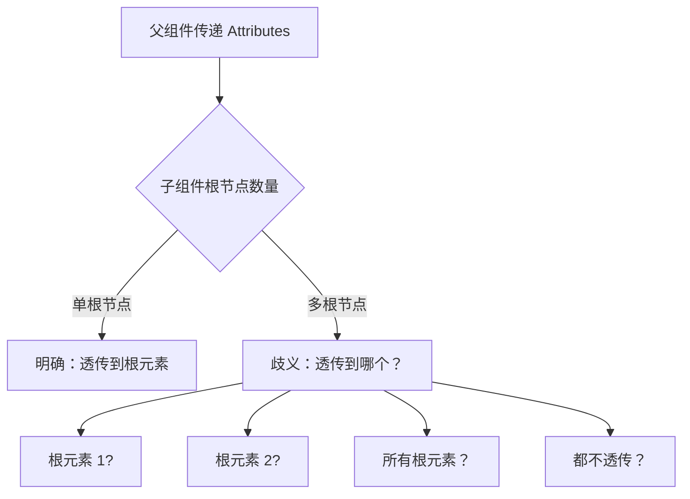

扫描 [二维码](https://api2.cmdragon.cn/upload/cmder/20250304_012821924.jpg) 关注或者微信搜一搜：`编程智域 前端至全栈交流与成长`

[发现 1000+ 提升效率与开发的 AI 工具和实用程序](https://tools.cmdragon.cn/zh/apps?category=ai_chat)：https://tools.cmdragon.cn/

## 一、为什么多根组件不能自动透传

### 1.1 Fragment 的引入

Vue 3 支持**Fragment**（多根节点组件），允许组件模板中有多个根元素。这是 Vue 3 相比 Vue 2 的一个重要改进。

```vue
<!-- Vue 2 不允许：必须有唯一的根元素 -->
<template>
  <div>根 1</div>
  <div>根 2</div>
</template>

<!-- Vue 3 允许：多个根元素 -->
```

### 1.2 自动透传的歧义问题

在单根组件中，attributes 可以明确地透传到唯一的根元素上。但在多根组件中，就产生了**歧义**：**attributes 应该透传到哪个根元素上？
**



因为有多种可能的选择，Vue 3 的设计决策是：**多根组件默认不自动透传 attributes**，需要开发者手动指定。

### 1.3 示例对比

**单根组件（自动透传）**：

```vue
<!-- SingleRoot.vue -->
<template>
  <div class="wrapper">
    <slot/>
  </div>
</template>

<!-- 父组件传递的 class 自动透传到 div.wrapper -->
<SingleRoot class="outer">内容</SingleRoot>
```

**多根组件（不自动透传）**：

```vue
<!-- MultiRoot.vue -->
<template>
  <header>头部</header>
  <main>内容</main>
  <footer>底部</footer>
</template>

<!-- 父组件传递的 class 不会透传到任何元素 -->
<MultiRoot class="outer"/>
```

## 二、使用 $attrs 手动绑定

### 2.1 $attrs 的基本用法

对于多根组件，我们需要使用 `$attrs` 对象来手动绑定 attributes 到指定的元素上。

```vue
<!-- MultiRootWithAttrs.vue -->
<template>
  <header class="header">头部</header>
  <main class="content" v-bind="$attrs">
    <slot/>
  </main>
  <footer class="footer">底部</footer>
</template>

<script setup>
  // $attrs 包含所有未声明的 attributes
</script>
```

使用：

```vue

<MultiRootWithAttrs class="main-content" id="home" data-section="intro">
  主内容区域
</MultiRootWithAttrs>
```

**渲染结果**：

```html

<header class="header">头部</header>
<main class="content main-content" id="home" data-section="intro">
    主内容区域
</main>
<footer class="footer">底部</footer>
```

### 2.2 选择性绑定

我们可以选择性地绑定特定的 attributes：

```vue

<template>
  <header v-bind:class="$attrs.class">头部</header>
  <main>内容</main>
</template>

<script setup>
  // 只绑定 class，其他 attrs 忽略
</script>
```

### 2.3 分散绑定

也可以将不同的 attributes 绑定到不同的元素上：

```vue
<!-- Layout.vue -->
<template>
  <header
      class="header"
      v-bind:class="headerClass"
      :style="headerStyle"
  >
    头部
  </header>

  <main
      class="content"
      v-bind:class="contentClass"
      :id="$attrs.id"
  >
    <slot/>
  </main>

  <footer class="footer">底部</footer>
</template>

<script setup>
  import {computed, useAttrs} from 'vue'

  const attrs = useAttrs()

  const headerClass = computed(() => attrs.headerClass)
  const contentClass = computed(() => attrs.contentClass)
  const headerStyle = computed(() => attrs.headerStyle)
</script>
```

## 三、透传目标的选择策略

### 3.1 策略一：绑定到主要交互区域

如果组件有一个主要的交互区域（如内容区、表单区），通常将 attributes 绑定到这个区域。

```vue
<!-- Card.vue -->
<template>
  <div class="card">
    <header class="card-header">
      <slot name="header"/>
    </header>

    <main class="card-body" v-bind="$attrs">
      <slot/>
    </main>

    <footer class="card-footer">
      <slot name="footer"/>
    </footer>
  </div>
</template>

<script setup>
  // attributes 绑定到卡片主体
</script>
```

使用：

```vue

<Card class="user-card" id="user-123" data-user-id="123">
  <template #header>用户信息</template>
  用户内容
  <template #footer>操作按钮</template>
</Card>
```

### 3.2 策略二：绑定到最外层容器

如果需要控制整个组件的样式，可以创建一个包装元素，将 attributes 绑定到包装器上。

```vue
<!-- Modal.vue -->
<template>
  <div class="modal-overlay">
    <div class="modal-container" v-bind="$attrs">
      <slot/>
      <button class="close-btn" @click="$emit('close')">×</button>
    </div>
  </div>
</template>

<script setup>
  defineEmits(['close'])
</script>
```

### 3.3 策略三：根据业务逻辑分发

根据组件的业务逻辑，将不同的 attributes 分发到不同的元素。

```vue
<!-- FormLayout.vue -->
<template>
  <form class="form" v-bind:action="$attrs.action" v-bind:method="$attrs.method">
    <div class="form-fields">
      <slot/>
    </div>
    <div class="form-actions" v-bind:class="$attrs.actionsClass">
      <slot name="actions"/>
    </div>
  </form>
</template>

<script setup>
  // form 相关属性绑定到 form 元素
  // 其他属性按需分发
</script>
```

## 四、inheritAttrs 的最佳实践

### 4.1 多根组件必须设置 inheritAttrs: false

虽然多根组件默认不会自动透传，但显式设置 `inheritAttrs: false` 是一个好习惯，可以明确表达意图。

```vue
<!-- MultiRoot.vue -->
<script setup>
  defineOptions({
    inheritAttrs: false
  })
</script>
```

### 4.2 单根组件的属性分发

即使是单根组件，如果需要将 attributes 绑定到非根元素，也需要设置 `inheritAttrs: false`。

```vue
<!-- CustomInput.vue -->
<template>
  <div class="input-wrapper">
    <label class="label">{{ label }}</label>
    <input class="input" v-bind="$attrs"/>
  </div>
</template>

<script setup>
  defineOptions({
    inheritAttrs: false
  })

  defineProps({
    label: String
  })
</script>
```

**如果不设置 inheritAttrs: false**：

```html
<!-- 错误：attributes 会同时绑定到根元素和 input -->
<div class="input-wrapper" placeholder="请输入">
    <label>用户名</label>
    <input class="input" placeholder="请输入"/>
</div>
```

**设置后**：

```html
<!-- 正确：attributes 只绑定到 input -->
<div class="input-wrapper">
    <label>用户名</label>
    <input class="input" placeholder="请输入"/>
</div>
```

## 五、实际应用场景

### 5.1 布局组件

```vue
<!-- GridLayout.vue -->
<template>
  <div class="grid-layout">
    <aside class="sidebar" v-bind:class="sidebarClass">
      <slot name="sidebar"/>
    </aside>

    <main class="main-content" v-bind="$attrs">
      <slot/>
    </main>
  </div>
</template>

<script setup>
  import {computed, useAttrs} from 'vue'

  defineOptions({
    inheritAttrs: false
  })

  const attrs = useAttrs()

  const sidebarClass = computed(() => attrs.sidebarClass)
</script>

<style scoped>
  .grid-layout {
    display: grid;
    grid-template-columns: 250px 1fr;
    gap: 20px;
    height: 100vh;
  }

  .sidebar {
    background: #f5f5f5;
    padding: 20px;
  }

  .main-content {
    padding: 20px;
    overflow-y: auto;
  }
</style>
```

使用：

```vue

<GridLayout
    class="dashboard-layout"
    :style="{ background: '#fff' }"
>
  <template #sidebar>
    <nav>导航菜单</nav>
  </template>
  <div>主内容区域</div>
</GridLayout>
```

### 5.2 表单组件组

```vue
<!-- FormGroup.vue -->
<template>
  <div class="form-group">
    <label
        v-if="label"
        class="label"
        :for="inputId"
    >
      {{ label }}
    </label>

    <div class="input-wrapper">
      <component
          :is="as"
          :id="inputId"
          class="input"
          v-bind="$attrs"
      >
        <slot/>
      </component>

      <span v-if="error" class="error">{{ error }}</span>
    </div>
  </div>
</template>

<script setup>
  import {computed} from 'vue'

  defineOptions({
    inheritAttrs: false
  })

  const props = defineProps({
    as: {
      type: String,
      default: 'input'
    },
    label: String,
    error: String,
    inputId: String
  })

  const inputId = computed(() => props.inputId || `input-${Math.random().toString(36).slice(2)}`)
</script>

<style scoped>
  .form-group {
    margin-bottom: 16px;
  }

  .label {
    display: block;
    margin-bottom: 4px;
    font-size: 14px;
    font-weight: 500;
    color: #333;
  }

  .input-wrapper {
    position: relative;
  }

  .input {
    width: 100%;
    padding: 8px 12px;
    border: 1px solid #ddd;
    border-radius: 4px;
    font-size: 14px;
  }

  .error {
    display: block;
    font-size: 12px;
    color: #dc3545;
    margin-top: 4px;
  }
</style>
```

使用：

```vue

<template>
  <FormGroup
      label="邮箱"
      as="input"
      type="email"
      v-model="email"
      placeholder="example@email.com"
      :error="emailError"
  />

  <FormGroup
      label="备注"
      as="textarea"
      v-model="note"
      rows="4"
      placeholder="请输入备注"
  />
</template>
```

### 5.3 卡片组件

```vue
<!-- Card.vue -->
<template>
  <article class="card" v-bind="$attrs">
    <header v-if="$slots.header" class="card-header">
      <slot name="header"/>
    </header>

    <div class="card-body">
      <slot/>
    </div>

    <footer v-if="$slots.footer" class="card-footer">
      <slot name="footer"/>
    </footer>
  </article>
</template>

<script setup>
  // 单根组件，attributes 自动透传到 article.card
</script>

<style scoped>
  .card {
    background: #fff;
    border-radius: 8px;
    box-shadow: 0 2px 8px rgba(0, 0, 0, 0.1);
    overflow: hidden;
  }

  .card-header {
    padding: 16px 20px;
    border-bottom: 1px solid #eee;
    background: #fafafa;
  }

  .card-body {
    padding: 20px;
  }

  .card-footer {
    padding: 16px 20px;
    border-top: 1px solid #eee;
    background: #fafafa;
  }
</style>
```

使用：

```vue

<Card class="user-card" id="user-123">
  <template #header>
    <h3>用户信息</h3>
  </template>

  <p>用户名：张三</p>
  <p>邮箱：zhangsan@example.com</p>

  <template #footer>
    <button>编辑</button>
    <button>删除</button>
  </template>
</Card>
```

### 5.4 对话框组件

```vue
<!-- Dialog.vue -->
<template>
  <Teleport to="body">
    <div v-if="modelValue" class="dialog-overlay" @click="handleOverlayClick">
      <div
          class="dialog"
          v-bind="$attrs"
          @click.stop
      >
        <header v-if="$slots.header" class="dialog-header">
          <slot name="header"/>
          <button class="close-btn" @click="handleClose">×</button>
        </header>

        <div class="dialog-body">
          <slot/>
        </div>

        <footer v-if="$slots.footer" class="dialog-footer">
          <slot name="footer"/>
        </footer>
      </div>
    </div>
  </Teleport>
</template>

<script setup>
  defineOptions({
    inheritAttrs: false
  })

  const props = defineProps({
    modelValue: Boolean
  })

  const emit = defineEmits(['update:modelValue', 'close'])

  const handleClose = () => {
    emit('update:modelValue', false)
    emit('close')
  }

  const handleOverlayClick = () => {
    handleClose()
  }
</script>

<style scoped>
  .dialog-overlay {
    position: fixed;
    inset: 0;
    background: rgba(0, 0, 0, 0.5);
    display: flex;
    align-items: center;
    justify-content: center;
    z-index: 1000;
  }

  .dialog {
    background: #fff;
    border-radius: 8px;
    max-width: 500px;
    width: 90%;
    max-height: 90vh;
    overflow: hidden;
    display: flex;
    flex-direction: column;
  }

  .dialog-header {
    display: flex;
    justify-content: space-between;
    align-items: center;
    padding: 16px 20px;
    border-bottom: 1px solid #eee;
  }

  .close-btn {
    background: none;
    border: none;
    font-size: 24px;
    cursor: pointer;
    color: #666;
  }

  .dialog-body {
    padding: 20px;
    overflow-y: auto;
    flex: 1;
  }

  .dialog-footer {
    padding: 16px 20px;
    border-top: 1px solid #eee;
    display: flex;
    justify-content: flex-end;
    gap: 12px;
  }
</style>
```

使用：

```vue

<template>
  <Dialog
      v-model="showDialog"
      class="confirm-dialog"
      :style="{ maxWidth: '400px' }"
      @close="handleClose"
  >
    <template #header>
      <h3>确认删除</h3>
    </template>

    <p>确定要删除这个项目吗？此操作不可恢复。</p>

    <template #footer>
      <button @click="showDialog = false">取消</button>
      <button @click="handleConfirm" class="btn-danger">删除</button>
    </template>
  </Dialog>
</template>

<script setup>
  import {ref} from 'vue'

  const showDialog = ref(false)

  const handleClose = () => {
    console.log('对话框关闭')
  }

  const handleConfirm = () => {
    console.log('确认删除')
    showDialog.value = false
  }
</script>
```

## 六、性能优化与注意事项

### 6.1 避免过度透传

不要将所有 attributes 都透传，只透传需要的属性。

```vue
<!-- 不推荐：透传所有 attrs -->
<div v-bind="$attrs">
  <slot/>
</div>

<!-- 推荐：选择性透传 -->
<div
    :id="$attrs.id"
    :class="$attrs.class"
    :data-foo="$attrs['data-foo']"
>
  <slot/>
</div>
```

### 6.2 使用计算属性缓存

```vue

<script setup>
  import {computed, useAttrs} from 'vue'

  const attrs = useAttrs()

  const boundAttrs = computed(() => ({
    id: attrs.id,
    class: attrs.class,
    style: attrs.style
  }))
</script>

<template>
  <div v-bind="boundAttrs">
    <slot/>
  </div>
</template>
```

### 6.3 注意响应式性能

`useAttrs()` 返回的对象是响应式的，但它本身不会被深度追踪。

```vue

<script setup>
  import {useAttrs} from 'vue'

  const attrs = useAttrs()

  // 直接访问 attrs 是响应式的
  console.log(attrs.class)

  // 但解构会失去响应式
  // const { class: className } = attrs // 不推荐
</script>
```

## 课后 Quiz

**问题 1**：为什么多根组件不能自动透传 attributes？

**答案**：因为存在歧义。多根组件有多个根元素，Vue 无法确定应该将 attributes
透传到哪个元素上。可能的选择包括：第一个根元素、最后一个根元素、所有根元素、或者都不透传。为了避免错误，Vue 3 选择不自动透传，让开发者手动指定。

---

**问题 2**：如何在多根组件中将 attributes 绑定到特定元素？

**答案**：

1. 使用 `useAttrs()` 获取 `$attrs` 对象
2. 在目标元素上使用 `v-bind="$attrs"` 或 `v-bind:specific-attr="$attrs.specificAttr"`
3. 建议设置 `inheritAttrs: false` 明确表达意图

---

**问题 3**：什么场景下需要将 attributes 分散绑定到多个元素？

**答案**：

- 表单组件：label 需要 `for` 属性，input 需要 `id`、`placeholder` 等
- 布局组件：侧边栏和主内容区需要不同的 class 和样式
- 复合组件：不同部分需要接收不同的配置属性

## 常见报错解决方案

### 报错 1：多根组件 attributes 不生效

**现象**：父组件传递的 attributes 在多根组件上没有效果。

**原因**：多根组件不会自动透传，需要手动绑定。

**解决方案**：

```vue
<!-- 错误 -->
<template>
  <div>根 1</div>
  <div>根 2</div>
</template>

<!-- 正确 -->
<template>
  <div>根 1</div>
  <div v-bind="$attrs">根 2</div>
</template>

<script setup>
  defineOptions({
    inheritAttrs: false
  })
</script>
```

### 报错 2：$attrs 在模板中无法访问

**现象**：在 `script setup` 组件的模板中使用 `$attrs` 报错。

**原因**：`script setup` 中 `$attrs` 在模板中可以直接使用，但在 script 中需要通过 `useAttrs()` 获取。

**解决方案**：

```vue

<script setup>
  import {useAttrs} from 'vue'

  const attrs = useAttrs()

  // 在 script 中使用
  console.log(attrs.class)

  // 在模板中可以直接使用 $attrs
</script>

<template>
  <div v-bind="$attrs">内容</div>
</template>
```

### 报错 3：attributes 被重复绑定

**现象**：attributes 同时出现在根元素和目标元素上。

**原因**：没有设置 `inheritAttrs: false`，导致自动透传和手动绑定同时生效。

**解决方案**：

```vue

<script setup>
  defineOptions({
    inheritAttrs: false  // 禁用自动透传
  })
</script>

<template>
  <div class="wrapper">
    <input v-bind="$attrs"/>  <!-- 只绑定到 input -->
  </div>
</template>
```

## 参考链接

- [Vue 3 Attributes 透传官方文档](https://vuejs.org/guide/components/attrs.html#fallthrough-details)
- [Vue 3 Fragment 多根组件](https://vuejs.org/guide/essentials/component-basics.html#fragments)
- [Vue 3 useAttrs API](https://vuejs.org/api/composition-api-dependency-injection.html#useattrs)

余下文章内容请点击跳转至 个人博客页面 或者 扫描 [二维码](https://api2.cmdragon.cn/upload/cmder/20250304_012821924.jpg)
关注或者微信搜一搜：`编程智域 前端至全栈交流与成长`
，阅读完整的文章：[Vue 3 透传 Attributes 第三章：多根组件的 Attributes 透传策略完全指南](https://blog.cmdragon.cn/posts/vue3-attributes-fallthrough-chapter3/)

<details>
<summary>往期文章归档</summary>

- [Vue 3 静态与动态 Props 如何传递？TypeScript 类型约束有何必要？](https://blog.cmdragon.cn/posts/94ab48753b64780ca3ab7a7115ae8522/)
- [Vue 3 中组件局部注册的优势与实现方式如何？](https://blog.cmdragon.cn/posts/dbf576e744870f6de26fd8a2e03e47da/)
- [如何在 Vue3 中优化生命周期钩子性能并规避常见陷阱？](https://blog.cmdragon.cn/posts/12d98b3b9ccd6c19a1b169d720ac5c80/)
- [Vue 3 Composition API 生命周期钩子：如何实现从基础理解到高阶复用？](https://blog.cmdragon.cn/posts/8884e2b70287fcb263c57648eeb27419/)
- [Vue 3 生命周期钩子实战指南：如何正确选择 onMounted、onUpdated 与 onUnmounted 的应用场景？](https://blog.cmdragon.cn/posts/883c6dbc50ae4183770a4462e0b8ae4d/)
- [Vue 3 中生命周期钩子与响应式系统如何实现协同工作？](https://blog.cmdragon.cn/posts/70dad360ffa9dce14d0d69611b8cb019/)
- [Vue 3 组件生命周期钩子的执行顺序与使用场景是什么？](https://blog.cmdragon.cn/posts/db44294a78dc9f666f67b053f6c83567/)
- [Vue 组件全局注册与局部注册如何抉择？](https://blog.cmdragon.cn/posts/43ead630ea17da65d99ad2eb8188e472/)
- [Vue3 组件化开发中，Props 与 Emits 如何实现数据流转与事件协作？](https://blog.cmdragon.cn/posts/8cff7d2df113da66ea7be560c4d1d22a/)
- [Vue 3 模板引用如何与其他特性协同实现复杂交互？](https://blog.cmdragon.cn/posts/331bf75d114ab09116eadfcdca602b58/)
- [Vue 3 v-for 中模板引用如何实现高效管理与动态控制？](https://blog.cmdragon.cn/posts/cb380897ddc3578b180ecf8843c774c1/)
- [Vue 3 的 defineExpose：如何突破 script setup 组件默认封装，实现精准的父子通讯？](https://blog.cmdragon.cn/posts/202ae0f4acde7128e0e31baf63732fb5/)
- [Vue 3 模板引用的生命周期时机如何把握？常见陷阱该如何避免？](https://blog.cmdragon.cn/posts/7d2a0f6555ecbe92afd7d2491c427463/)
- [Vue 3 模板引用如何实现父组件与子组件的高效交互？](https://blog.cmdragon.cn/posts/3fb7bdd84128b7efaaa1c979e1f28dee/)
- [Vue 中为何需要模板引用？又如何高效实现 DOM 与组件实例的直接访问？](https://blog.cmdragon.cn/posts/23f3464ba16c7054b4783cded50c04c6/)
- [Vue 3 watch 与 watchEffect 如何区分使用？常见陷阱与性能优化技巧有哪些？](https://blog.cmdragon.cn/posts/68a26cc0023e4994a6bc54fb767365c8/)
- [Vue3 侦听器实战：组件与 Pinia 状态监听如何高效应用？](https://blog.cmdragon.cn/posts/fd4695f668d64332dda9962c24214f32/)
- [Vue 3 中何时用 watch，何时用 watchEffect？核心区别及性能优化策略是什么？](https://blog.cmdragon.cn/posts/cdbbb1837f8c093252e61f46dbf0a2e7/)
- [Vue 3 中如何有效管理侦听器的暂停、恢复与副作用清理？](https://blog.cmdragon.cn/posts/09551ab614c463a6d6ca69818e8c2d52/)
- [Vue 3 watchEffect：如何实现响应式依赖的自动追踪与副作用管理？](https://blog.cmdragon.cn/posts/b7bca5d20f628ac09f7192ad935ef664/)
- [Vue 3 watch 如何利用 immediate、once、deep 选项实现初始化、一次性与深度监听？](https://blog.cmdragon.cn/posts/2c6cdb100a20f10c7e7d4413617c7ea9/)
- [Vue 3 中 watch 如何高效监听多数据源、计算结果与数组变化？](https://blog.cmdragon.cn/posts/757a1728bc1b9c0c8b317b0354d85568/)
- [Vue 3 中 watch 监听 ref 和 reactive 的核心差异与注意事项是什么？](https://blog.cmdragon.cn/posts/8e70552f0f61e0dc8c7f567a2d272345/)
- [Vue3 中 Watch 与 watchEffect 的核心差异及适用场景是什么？](https://blog.cmdragon.cn/posts/dde70ab90dc5062c435e0501f5a6e7cb/)
- [Vue 3 自定义指令如何赋能表单自动聚焦与防抖输入的高效实现？](https://blog.cmdragon.cn/posts/1f5ed5047850ed52c0fd0386f76bd4ae/)
- [Vue3 中如何优雅实现支持多绑定变量和修饰符的双向绑定组件？](https://blog.cmdragon.cn/posts/e3d4e128815ad731611b8ef29e37616b/)
- [Vue 3 表单验证如何从基础规则到异步交互构建完整验证体系？](https://blog.cmdragon.cn/posts/7d1caedd822f70542aa0eed67e30963b/)
- [Vue3 响应式系统如何支撑表单数据的集中管理、动态扩展与实时计算？](https://blog.cmdragon.cn/posts/3687a5437ab56cb082b5b813d5577a40/)
- [Vue3 跨组件通信中，全局事件总线与 provide/inject 该如何正确选择？](https://blog.cmdragon.cn/posts/ad67c4eb6d76cf7707bdfe6a8146c34f/)
- [Vue3 表单事件处理：v-model 如何实现数据绑定、验证与提交？](https://blog.cmdragon.cn/posts/1c1e80d697cca0923f29ec70ebb8ccd1/)
- [Vue 应用如何基于 DOM 事件传播机制与事件修饰符实现高效事件处理？](https://blog.cmdragon.cn/posts/b990828143d70aa87f9aa52e16692e48/)
- [Vue3 中如何在调用事件处理函数时同时传递自定义参数和原生 DOM 事件？参数顺序有哪些注意事项？](https://blog.cmdragon.cn/posts/b44316e0866e9f2e6aef927dbcf5152b/)
- [从捕获到冒泡：Vue 事件修饰符如何重塑事件执行顺序？](https://blog.cmdragon.cn/posts/021636c2a06f5e2d3d01977a12ddf559/)
- [Vue 事件处理：内联还是方法事件处理器，该如何抉择？](https://blog.cmdragon.cn/posts/b3cddf7023ab537e623a61bc01dab6bb/)
- [Vue 事件绑定中 v-on 与@语法如何取舍？参数传递与原生事件处理有哪些实战技巧？](https://blog.cmdragon.cn/posts/bd4d9607ce1bc34cc3bda0a1a46c40f6/)
- [Vue 3 中列表排序时为何必须复制数组而非直接修改原始数据？](https://blog.cmdragon.cn/posts/a5f2bacb74476fd7f5e02bb3f1ba6b2b/)
- [Vue 虚拟滚动如何将列表 DOM 数量从万级降至十位数？](https://blog.cmdragon.cn/posts/d3b06b57fb7f126787e6ed22dce1e341/)
- [Vue3 中 v-if 与 v-for 直接混用为何会报错？计算属性如何解决优先级冲突？](https://blog.cmdragon.cn/posts/3100cc5a2e16f8dac36f722594e6af32/)
- [为何在 Vue3 递归组件中必须用 v-if 判断子项存在？](https://blog.cmdragon.cn/posts/455dc2d47c38d12c1cf350e490041e8b/)
- [Vue3 列表渲染中，如何用数组方法与计算属性优化 v-for 的数据处理？](https://blog.cmdragon.cn/posts/3f842bbd7ba0f9c91151b983bf784c8b/)
- [Vue v-for 的 key：为什么它能解决列表渲染中的"玄学错误"？选错会有哪些后果？](https://blog.cmdragon.cn/posts/1eb3ffac668a743843b5ea1738301d40/)
- [Vue3 中 v-for 与 v-if 为何不能直接共存于同一元素？](https://blog.cmdragon.cn/posts/138b13c5341f6a1fa9015400433a3611/)
- [Vue3 中 v-if 与 v-show 的本质区别及动态组件状态保持的关键策略是什么？](https://blog.cmdragon.cn/posts/0242a94dc552b93a1bc335ac4fc33db5/)
- [Vue3 中 v-show 如何通过 CSS 修改 display 属性控制条件显示？与 v-if 的应用场景该如何区分？](https://blog.cmdragon.cn/posts/97c66a18ae0e9b57c6a69b8b3a41ddf6/)
- [Vue3 条件渲染中 v-if 系列指令如何合理使用与规避错误？](https://blog.cmdragon.cn/posts/8a1ddfac64b25062ac56403e4c1201d2/)
- [Vue3 动态样式控制：ref、reactive、watch 与 computed 的应用场景与区别是什么？](https://blog.cmdragon.cn/posts/218c3a59282c3b757447ee08a01937bb/)
- [Vue3 中动态样式数组的后项覆盖规则如何与计算属性结合实现复杂状态样式管理？](https://blog.cmdragon.cn/posts/1bab953e41f66ac53de099fa9fe76483/)
- [Vue 浅响应式如何解决深层响应式的性能问题？适用场景有哪些？ - cmdragon's Blog](https://blog.cmdragon.cn/posts/c85e1fe16a7ae45e965b4e2df4d9d2f4/)
- [Vue 3 组合式 API 中 ref 与 reactive 的核心响应式差异及使用最佳实践是什么？ - cmdragon's Blog](https://blog.cmdragon.cn/posts/be04b02d2723994632de0d4ca22a3391/)
- [Vue 3 组合式 API 中 ref 与 reactive 的核心响应式差异及使用最佳实践是什么？ - cmdragon's Blog](https://blog.cmdragon.cn/posts/be04b02d2723994632de0d4ca22a3391/)
- [Vue3 响应式系统中，对象新增属性、数组改索引、原始值代理的问题如何解决？ - cmdragon's Blog](https://blog.cmdragon.cn/posts/a0af08dd60a37b9a890a9957f2cbfc9f/)
- [Vue 3 中 watch 侦听器的正确使用姿势你掌握了吗？深度监听、与 watchEffect 的差异及常见报错解析 - cmdragon's Blog](https://blog.cmdragon.cn/posts/bc287e1e36287afd90750fd907eca85e/)
- [Vue 响应式声明的 API 差异、底层原理与常见陷阱你都搞懂了吗 - cmdragon's Blog](https://blog.cmdragon.cn/posts/654b9447ef1ba7ec1126a1bc26a4726d/)
- [Vue 响应式声明的 API 差异、底层原理与常见陷阱你都搞懂了吗 - cmdragon's Blog](https://blog.cmdragon.cn/posts/654b9447ef1ba7ec1126a1bc26a4726d/)
- [为什么 Vue 3 需要 ref 函数？它的响应式原理与正确用法是什么？ - cmdragon's Blog](https://blog.cmdragon.cn/posts/c405a8d9950af5b7c63b56c348ac36b6/)
- [Vue 3 中 reactive 函数如何通过 Proxy 实现响应式？使用时要避开哪些误区？ - cmdragon's Blog](https://blog.cmdragon.cn/posts/a7e9abb9691a81e4404d9facabe0f7c3/)
- [Vue3 响应式系统的底层原理与实践要点你真的懂吗？ - cmdragon's Blog](https://blog.cmdragon.cn/posts/bd995ea45161727597fb85b62566c43d/)
- [Vue 3 模板如何通过编译三阶段实现从声明式语法到高效渲染的跨越 - cmdragon's Blog](https://blog.cmdragon.cn/posts/53e3f270a80675df662c6857a3332c0f/)
- [快速入门 Vue 模板引用：从收 DOM"快递"到调子组件方法，你玩明白了吗？ - cmdragon's Blog](https://blog.cmdragon.cn/posts/ddbce4f2a23aa72c96b1c0473900321e/)
- [快速入门 Vue 模板里的 JS 表达式有啥不能碰？计算属性为啥比方法更能打？ - cmdragon's Blog](https://blog.cmdragon.cn/posts/23a2d5a334e15575277814c16e45df50/)
- [快速入门 Vue 的 v-model 表单绑定：语法糖、动态值、修饰符的小技巧你都掌握了吗？ - cmdragon's Blog](https://blog.cmdragon.cn/posts/6be38de6382e31d282659b689c5b17f0/)
- [快速入门 Vue3 事件处理的挑战题：v-on、修饰符、自定义事件你能通关吗？ - cmdragon's Blog](https://blog.cmdragon.cn/posts/60ce517684f4a418f453d66aa805606c/)
- [快速入门 Vue3 的 v-指令：数据和 DOM 的"翻译官"到底有多少本事？ - cmdragon's Blog](https://blog.cmdragon.cn/posts/e4ae7d5e4a9205bb11b2baccb230c637/)
- [快速入门 Vue3，插值、动态绑定和避坑技巧你都搞懂了吗？ - cmdragon's Blog](https://blog.cmdragon.cn/posts/999ce4fb32259ff4fbf4bf7bcb851654/)
- [想让 PostgreSQL 快到飞起？先找健康密码还是先换引擎？ - cmdragon's Blog](https://blog.cmdragon.cn/posts/a6997d81b49cd232b87e1cf603888ad1/)
- [想让 PostgreSQL 查询快到飞起？分区表、物化视图、并行查询这三招灵不灵？ - cmdragon's Blog](https://blog.cmdragon.cn/posts/1fee7afbb9abd4540b8aa9c141d6845d/)
- [子查询总拖慢查询？把它变成连接就能解决？ - cmdragon's Blog](https://blog.cmdragon.cn/posts/79c590fbd87ece535b11a71c9667884f/)
- [PostgreSQL 全表扫描慢到崩溃？建索引 + 改查询 + 更统计信息三招能破？ - cmdragon's Blog](https://blog.cmdragon.cn/posts/748cdac2536008199abf8a8a2cd0ec85/)
- [复杂查询总拖后腿？PostgreSQL 多列索引 + 覆盖索引的神仙技巧你 get 没？ - cmdragon's Blog](https://blog.cmdragon.cn/posts/32ca943703226d317d4276a8fb53b0dd/)
- [只给表子集建索引？用函数结果建索引？PostgreSQL 这俩操作凭啥能省空间又加速？ - cmdragon's Blog](https://blog.cmdragon.cn/posts/ca93f1d53aa910e7ba5ffd8df611c12b/)
- [B-tree 索引像字典查词一样工作？那哪些数据库查询它能加速，哪些不能？ - cmdragon's Blog](https://blog.cmdragon.cn/posts/f507856ebfddd592448813c510a53669/)
- [想抓 PostgreSQL 里的慢 SQL？pg_stat_statements 基础黑匣子和 pg_stat_monitor 时间窗，谁能帮你更准揪出性能小偷？ - cmdragon's Blog](https://blog.cmdragon.cn/posts/b2213bfcb5b88a862f2138404c03d596/)
- [PostgreSQL 的"时光机"MVCC 和锁机制是怎么搞定高并发的？ - cmdragon's Blog](https://blog.cmdragon.cn/posts/26614eb7da6c476dde41d367ad888d2f/)
- [PostgreSQL 性能暴涨的关键？内存 IO 并发参数居然要这么设置？ - cmdragon's Blog](https://blog.cmdragon.cn/posts/69f99bc6972a860d559c74aad7280da4/)
- [大表查询慢到翻遍整个书架？PostgreSQL 分区表教你怎么"分类"才高效](https://blog.cmdragon.cn/posts/7b7053f392147a8b3b1a16bebeb08d0a/)
- [PostgreSQL 查询慢？是不是忘了优化 GROUP BY、ORDER BY 和窗口函数？ - cmdragon's Blog](https://blog.cmdragon.cn/posts/c856e3cb073822349f3bf2d29995dcfc/)
- [PostgreSQL 里的子查询和 CTE 居然在性能上"掐架"？到底该站哪边？ - cmdragon's Blog](https://blog.cmdragon.cn/posts/c096347d18e67b7431faacd2c4757093/)
- [PostgreSQL 选 Join 策略有啥小九九？Nested Loop/Merge/Hash 谁是它的菜？ - cmdragon's Blog](https://blog.cmdragon.cn/posts/2eca89463454fd4250d7b66243b9fe5a/)
- [PostgreSQL 新手 SQL 总翻车？这 7 个性能陷阱你踩过没？ - cmdragon's Blog](https://blog.cmdragon.cn/posts/068ecb772a87d7df20a8c9fb4b233f8e/)
- [PostgreSQL 索引选 B-Tree 还是 GiST？"瑞士军刀"和"多面手"的差别你居然还不知道？ - cmdragon's Blog](https://blog.cmdragon.cn/posts/d498f63cd0a2d5a77e445c688a8b88db/)
- [想知道数据库怎么给查询"算成本选路线"？EXPLAIN 能帮你看明白？ - cmdragon's Blog](https://blog.cmdragon.cn/posts/9101b75bdec6faea9b35d54f14e37f36/)
- [PostgreSQL 处理 SQL 居然像做蛋糕？解析到执行的 4 步里藏着多少查询优化的小心机？ - cmdragon's Blog](https://blog.cmdragon.cn/posts/d527f8ebb6e3dae2c7dfe4c8d8979444/)
- [PostgreSQL 备份不是复制文件？物理 vs 逻辑咋选？误删还能精准恢复到 1 分钟前？ - cmdragon's Blog](https://blog.cmdragon.cn/posts/6bfdae84f313cf7ad0bb7045c4392347/)
- [转账不翻车、并发不干扰，PostgreSQL 的 ACID 特性到底有啥魔法？ - cmdragon's Blog](https://blog.cmdragon.cn/posts/de3672803de34dbad244d0a8d48b0eb5/)
- [银行转账不白扣钱、电商下单不超卖，PostgreSQL 事务的诀窍是啥？ - cmdragon's Blog](https://blog.cmdragon.cn/posts/e463e8a2668abdf00a228c9b79324ded/)
- [PostgreSQL 里的 PL/pgSQL 到底是啥？能让 SQL 从"说目标"变"讲步骤"？ - cmdragon's Blog](https://blog.cmdragon.cn/posts/5c967e595058c4a1fc4474a68e64031d/)
- [PostgreSQL 视图不存数据？那它怎么简化查询还能递归生成序列和控制权限？ - cmdragon's Blog](https://blog.cmdragon.cn/posts/325047855e3e23b5ef82f7d2db134fbd/)
- [PostgreSQL 索引这么玩，才能让你的查询真的"飞"起来？ - cmdragon's Blog](https://blog.cmdragon.cn/posts/d2dba50bb6e4df7b27e735245a06a2a2/)
- [PostgreSQL 的表关系和约束，咋帮你搞定用户订单不混乱、学生选课不重复？ - cmdragon's Blog](https://blog.cmdragon.cn/posts/849ae5bab0f8c66e94c2f6ad1bb798e3/)
- [PostgreSQL 查询的筛子、排序、聚合、分组？你会用它们搞定数据吗？ - cmdragon's Blog](https://blog.cmdragon.cn/posts/ef4800975ffa84f1ca51976a70a1585b/)
- [PostgreSQL 数据类型怎么选才高效不踩坑？ - cmdragon's Blog](https://blog.cmdragon.cn/posts/bf54711525c507c5eacfa7b0151c39d2/)
- [想解锁 PostgreSQL 查询从基础到进阶的核心知识点？你都 get 了吗？ - cmdragon's Blog](https://blog.cmdragon.cn/posts/887809b3e0375f5956873cd442f516d8/)
- [PostgreSQL DELETE 居然有这些操作？返回数据、连表删你试过没？ - cmdragon's Blog](https://blog.cmdragon.cn/posts/934be1203725e8be9d6f6e9104e5abcc/)
- [PostgreSQL UPDATE 语句怎么玩？从改邮箱到批量更新的避坑技巧你都会吗？ - cmdragon's Blog](https://blog.cmdragon.cn/posts/0f0622e9b7402b599e618150d0596ffe/)
- [PostgreSQL 插入数据还在逐条敲？批量、冲突处理、返回自增 ID 的技巧你会吗？ - cmdragon's Blog](https://blog.cmdragon.cn/posts/0e3bf7efc030b024ea67ee855a00f2de/)
- [PostgreSQL 的"仓库 - 房间 - 货架"游戏，你能建出电商数据库和表吗？ - cmdragon's Blog](https://blog.cmdragon.cn/posts/b6cd3c86da6aac26ed829e472d34078e/)
- [PostgreSQL 17 安装总翻车？Windows/macOS/Linux 避坑指南帮你搞定？ - cmdragon's Blog](https://blog.cmdragon.cn/posts/ba1f545a3410144552fbdbfcf31b5265/)
- [能当关系型数据库还能玩对象特性，能拆复杂查询还能自动管库存，PostgreSQL 凭什么这么香？ - cmdragon's Blog](https://blog.cmdragon.cn/posts/b5474d1480509c5072085abc80b3dd9f/)
- [给接口加新字段又不搞崩老客户端？FastAPI 的多版本 API 靠哪三招实现？ - cmdragon's Blog](https://blog.cmdragon.cn/posts/cc098d8836e787baa8a4d92e4d56d5c5/)
- [流量突增要搞崩 FastAPI？熔断测试是怎么防系统雪崩的？ - cmdragon's Blog](https://blog.cmdragon.cn/posts/46d05151c5bd31cf37a7bcf0b8f5b0b8/)
- [FastAPI 秒杀库存总变负数？Redis 分布式锁能帮你守住底线吗 - cmdragon's Blog](https://blog.cmdragon.cn/posts/65ce343cc5df9faf3a8e2eeaab42ae45/)
- [FastAPI 的 CI 流水线怎么自动测端点，还能让 Allure 报告美到犯规？ - cmdragon's Blog](https://blog.cmdragon.cn/posts/eed6cd8985d9be0a4b092a7da38b3e0c/)
- [如何用 GitHub Actions 为 FastAPI 项目打造自动化测试流水线？ - cmdragon's Blog](https://blog.cmdragon.cn/posts/6157d87338ce894d18c013c3c4777abb/)

</details>


<details>
<summary>免费好用的热门在线工具</summary>

- [多直播聚合器 - 应用商店 | By cmdragon](https://tools.cmdragon.cn/zh/apps/multi-live-aggregator)
- [Proto 文件生成器 - 应用商店 | By cmdragon](https://tools.cmdragon.cn/zh/apps/proto-file-generator)
- [图片转粒子 - 应用商店 | By cmdragon](https://tools.cmdragon.cn/zh/apps/image-to-particles)
- [视频下载器 - 应用商店 | By cmdragon](https://tools.cmdragon.cn/zh/apps/video-downloader)
- [文件格式转换器 - 应用商店 | By cmdragon](https://tools.cmdragon.cn/zh/apps/file-converter)
- [M3U8 在线播放器 - 应用商店 | By cmdragon](https://tools.cmdragon.cn/zh/apps/m3u8-player)
- [快图设计 - 应用商店 | By cmdragon](https://tools.cmdragon.cn/zh/apps/quick-image-design)
- [高级文字转图片转换器 - 应用商店 | By cmdragon](https://tools.cmdragon.cn/zh/apps/text-to-image-advanced)
- [RAID 计算器 - 应用商店 | By cmdragon](https://tools.cmdragon.cn/zh/apps/raid-calculator)
- [在线 PS - 应用商店 | By cmdragon](https://tools.cmdragon.cn/zh/apps/photoshop-online)
- [Mermaid 在线编辑器 - 应用商店 | By cmdragon](https://tools.cmdragon.cn/zh/apps/mermaid-live-editor)
- [数学求解计算器 - 应用商店 | By cmdragon](https://tools.cmdragon.cn/zh/apps/math-solver-calculator)
- [智能提词器 - 应用商店 | By cmdragon](https://tools.cmdragon.cn/zh/apps/smart-teleprompter)
- [魔法简历 - 应用商店 | By cmdragon](https://tools.cmdragon.cn/zh/apps/magic-resume)
- [Image Puzzle Tool - 图片拼图工具 | By cmdragon](https://tools.cmdragon.cn/zh/apps/image-puzzle-tool)
- [字幕下载工具 - 应用商店 | By cmdragon](https://tools.cmdragon.cn/zh/apps/subtitle-downloader)
- [歌词生成工具 - 应用商店 | By cmdragon](https://tools.cmdragon.cn/zh/apps/lyrics-generator)
- [网盘资源聚合搜索 - 应用商店 | By cmdragon](https://tools.cmdragon.cn/zh/apps/cloud-drive-search)
- [ASCII 字符画生成器 - 应用商店 | By cmdragon](https://tools.cmdragon.cn/zh/apps/ascii-art-generator)
- [JSON Web Tokens 工具 - 应用商店 | By cmdragon](https://tools.cmdragon.cn/zh/apps/jwt-tool)
- [Bcrypt 密码工具 - 应用商店 | By cmdragon](https://tools.cmdragon.cn/zh/apps/bcrypt-tool)
- [GIF 合成器 - 应用商店 | By cmdragon](https://tools.cmdragon.cn/zh/apps/gif-composer)
- [GIF 分解器 - 应用商店 | By cmdragon](https://tools.cmdragon.cn/zh/apps/gif-decomposer)
- [文本隐写术 - 应用商店 | By cmdragon](https://tools.cmdragon.cn/zh/apps/text-steganography)
- [CMDragon 在线工具 - 高级 AI 工具箱与开发者套件 | 免费好用的在线工具](https://tools.cmdragon.cn/zh)
- [应用商店 - 发现 1000+ 提升效率与开发的 AI 工具和实用程序 | 免费好用的在线工具](https://tools.cmdragon.cn/zh/apps?category=trending)
- [CMDragon 更新日志 - 最新更新、功能与改进 | 免费好用的在线工具](https://tools.cmdragon.cn/zh/changelog)
- [支持我们 - 成为赞助者 | 免费好用的在线工具](https://tools.cmdragon.cn/zh/sponsor)
- [AI 文本生成图像 - 应用商店 | 免费好用的在线工具](https://tools.cmdragon.cn/zh/apps/text-to-image-ai)
- [临时邮箱 - 应用商店 | 免费好用的在线工具](https://tools.cmdragon.cn/zh/apps/temp-email)
- [二维码解析器 - 应用商店 | 免费好用的在线工具](https://tools.cmdragon.cn/zh/apps/qrcode-parser)
- [文本转思维导图 - 应用商店 | 免费好用的在线工具](https://tools.cmdragon.cn/zh/apps/text-to-mindmap)
- [正则表达式可视化工具 - 应用商店 | 免费好用的在线工具](https://tools.cmdragon.cn/zh/apps/regex-visualizer)
- [文件隐写工具 - 应用商店 | 免费好用的在线工具](https://tools.cmdragon.cn/zh/apps/steganography-tool)
- [IPTV 频道探索器 - 应用商店 | 免费好用的在线工具](https://tools.cmdragon.cn/zh/apps/iptv-explorer)
- [快传 - 应用商店 | 免费好用的在线工具](https://tools.cmdragon.cn/zh/apps/snapdrop)
- [随机抽奖工具 - 应用商店 | 免费好用的在线工具](https://tools.cmdragon.cn/zh/apps/lucky-draw)
- [动漫场景查找器 - 应用商店 | 免费好用的在线工具](https://tools.cmdragon.cn/zh/apps/anime-scene-finder)
- [时间工具箱 - 应用商店 | 免费好用的在线工具](https://tools.cmdragon.cn/zh/apps/time-toolkit)
- [网速测试 - 应用商店 | 免费好用的在线工具](https://tools.cmdragon.cn/zh/apps/speed-test)
- [AI 智能抠图工具 - 应用商店 | 免费好用的在线工具](https://tools.cmdragon.cn/zh/apps/background-remover)
- [背景替换工具 - 应用商店 | 免费好用的在线工具](https://tools.cmdragon.cn/zh/apps/background-replacer)
- [艺术二维码生成器 - 应用商店 | 免费好用的在线工具](https://tools.cmdragon.cn/zh/apps/artistic-qrcode)
- [Open Graph 元标签生成器 - 应用商店 | 免费好用的在线工具](https://tools.cmdragon.cn/zh/apps/open-graph-generator)
- [图像对比工具 - 应用商店 | 免费好用的在线工具](https://tools.cmdragon.cn/zh/apps/image-comparison)
- [图片压缩专业版 - 应用商店 | 免费好用的在线工具](https://tools.cmdragon.cn/zh/apps/image-compressor)
- [密码生成器 - 应用商店 | 免费好用的在线工具](https://tools.cmdragon.cn/zh/apps/password-generator)
- [SVG 优化器 - 应用商店 | 免费好用的在线工具](https://tools.cmdragon.cn/zh/apps/svg-optimizer)
- [调色板生成器 - 应用商店 | 免费好用的在线工具](https://tools.cmdragon.cn/zh/apps/color-palette)
- [在线节拍器 - 应用商店 | 免费好用的在线工具](https://tools.cmdragon.cn/zh/apps/online-metronome)
- [IP 归属地查询 - 应用商店 | 免费好用的在线工具](https://tools.cmdragon.cn/zh/apps/ip-geolocation)
- [CSS 网格布局生成器 - 应用商店 | 免费好用的在线工具](https://tools.cmdragon.cn/zh/apps/css-grid-layout)
- [邮箱验证工具 - 应用商店 | 免费好用的在线工具](https://tools.cmdragon.cn/zh/apps/email-validator)
- [书法练习字帖 - 应用商店 | 免费好用的在线工具](https://tools.cmdragon.cn/zh/apps/calligraphy-practice)
- [金融计算器套件 - 应用商店 | 免费好用的在线工具](https://tools.cmdragon.cn/zh/apps/finance-calculator-suite)
- [中国亲戚关系计算器 - 应用商店 | 免费好用的在线工具](https://tools.cmdragon.cn/zh/apps/chinese-kinship-calculator)
- [Protocol Buffer 工具箱 - 应用商店 | 免费好用的在线工具](https://tools.cmdragon.cn/zh/apps/protobuf-toolkit)
- [IP 归属地查询 - 应用商店 | 免费好用的在线工具](https://tools.cmdragon.cn/zh/apps/ip-geolocation)
- [图片无损放大 - 应用商店 | 免费好用的在线工具](https://tools.cmdragon.cn/zh/apps/image-upscaler)
- [文本比较工具 - 应用商店 | 免费好用的在线工具](https://tools.cmdragon.cn/zh/apps/text-compare)
- [IP 批量查询工具 - 应用商店 | 免费好用的在线工具](https://tools.cmdragon.cn/zh/apps/ip-batch-lookup)
- [域名查询工具 - 应用商店 | 免费好用的在线工具](https://tools.cmdragon.cn/zh/apps/domain-finder)
- [DNS 工具箱 - 应用商店 | 免费好用的在线工具](https://tools.cmdragon.cn/zh/apps/dns-toolkit)
- [网站图标生成器 - 应用商店 | 免费好用的在线工具](https://tools.cmdragon.cn/zh/apps/favicon-generator)
- [XML Sitemap](https://tools.cmdragon.cn/sitemap_index.xml)

</details>
