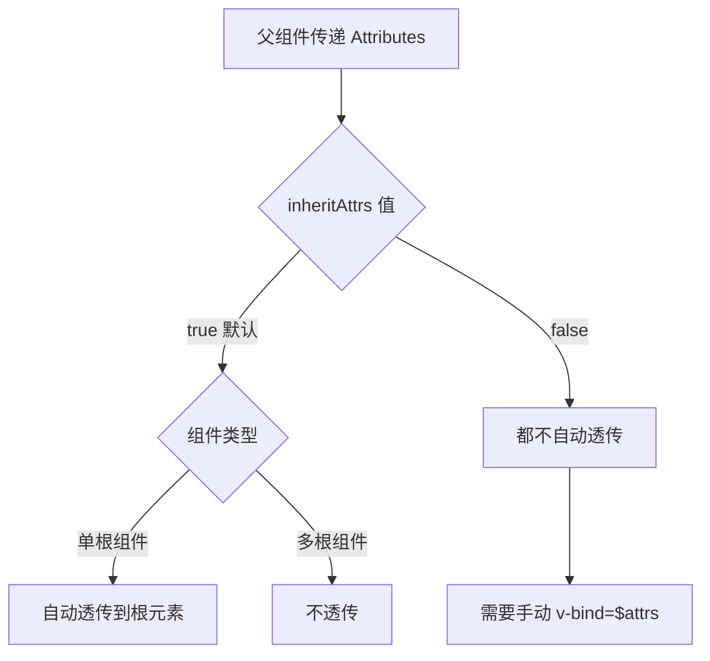

扫描 [二维码](https://api2.cmdragon.cn/upload/cmder/20250304_012821924.jpg) 关注或者微信搜一搜：`编程智域 前端至全栈交流与成长`

[发现 1000+ 提升效率与开发的 AI 工具和实用程序](https://tools.cmdragon.cn/zh/apps?category=ai_chat)：https://tools.cmdragon.cn/


## 一、inheritAttrs 的作用

### 1.1 默认行为

默认情况下，`inheritAttrs` 的值为 `true`，这意味着：
- 单根组件的未声明 attributes 会自动透传到根元素
- 多根组件的未声明 attributes 不会自动透传

### 1.2 禁用自动透传

设置 `inheritAttrs: false` 可以禁用自动透传行为：

```vue
<script setup>
defineOptions({
  inheritAttrs: false
})
</script>
```

这样，attributes 不会自动添加到根元素上，需要通过 `v-bind="$attrs"` 手动绑定。

### 1.3 工作流程对比



## 二、设置 inheritAttrs 的方法

### 2.1 script setup 中设置（Vue 3.3+）

```vue
<script setup>
defineOptions({
  inheritAttrs: false
})
</script>
```

### 2.2 Options API 中设置

```vue
<script>
export default {
  inheritAttrs: false,
  props: ['label']
}
</script>
```

### 2.3 混用 script setup 和 Options API

```vue
<script>
export default {
  inheritAttrs: false
}
</script>

<script setup>
import { useAttrs } from 'vue'

const attrs = useAttrs()
</script>
```

### 2.4 在 defineOptions 中结合其他配置

```vue
<script setup>
defineOptions({
  name: 'CustomInput',
  inheritAttrs: false,
  props: {
    label: String,
    modelValue: [String, Number]
  },
  emits: ['update:modelValue']
})
</script>
```

## 三、应用场景

### 3.1 属性分发到非根元素

当需要将 attributes 绑定到非根元素时，必须设置 `inheritAttrs: false`。

```vue
<!-- CustomInput.vue -->
<template>
  <div class="input-wrapper">
    <label class="label">{{ label }}</label>
    <input class="input" v-bind="$attrs" />
  </div>
</template>

<script setup>
defineOptions({
  inheritAttrs: false
})

defineProps({
  label: String
})
</script>

<style scoped>
.input-wrapper {
  display: flex;
  flex-direction: column;
  gap: 4px;
}

.label {
  font-size: 14px;
  font-weight: 500;
  color: #333;
}

.input {
  padding: 8px 12px;
  border: 1px solid #ddd;
  border-radius: 4px;
}
</style>
```

使用：

```vue
<CustomInput
  label="用户名"
  placeholder="请输入用户名"
  maxlength="20"
  required
/>
```

**渲染结果**：

```html
<div class="input-wrapper">
  <label class="label">用户名</label>
  <input
    class="input"
    placeholder="请输入用户名"
    maxlength="20"
    required
  />
</div>
```

注意：attributes 只绑定到 `<input>` 上，而不是根元素 `<div>`。

### 3.2 多根组件的精确控制

```vue
<!-- Layout.vue -->
<template>
  <header class="header" v-bind:style="$attrs.headerStyle">
    <slot name="header" />
  </header>
  
  <main class="content" v-bind="$attrs">
    <slot />
  </main>
  
  <footer class="footer" v-bind:class="$attrs.footerClass">
    <slot name="footer" />
  </footer>
</template>

<script setup>
defineOptions({
  inheritAttrs: false
})
</script>
```

### 3.3 条件透传

根据组件内部状态决定是否透传 attributes：

```vue
<!-- ConditionalInput.vue -->
<template>
  <div class="input-group">
    <input
      class="input"
      v-bind="boundAttrs"
      :disabled="isDisabled"
    />
    <button
      v-if="showClear"
      class="clear-btn"
      @click="handleClear"
    >
      清除
    </button>
  </div>
</template>

<script setup>
import { useAttrs, computed, ref } from 'vue'

defineOptions({
  inheritAttrs: false
})

const props = defineProps({
  showClear: Boolean,
  disabled: Boolean
})

const attrs = useAttrs()
const isDisabled = ref(props.disabled)

const boundAttrs = computed(() => {
  const { class: className, style, ...rest } = attrs
  
  return {
    class: ['input', className].filter(Boolean).join(' '),
    style,
    ...rest
  }
})

const handleClear = () => {
  // 清除逻辑
  isDisabled.value = false
}
</script>
```

### 3.4 属性代理和转换

```vue
<!-- ProxyInput.vue -->
<template>
  <div class="proxy-input">
    <input
      class="proxy-field"
      v-bind="proxiedAttrs"
    />
  </div>
</template>

<script setup>
import { useAttrs, computed } from 'vue'

defineOptions({
  inheritAttrs: false
})

const attrs = useAttrs()

const proxiedAttrs = computed(() => {
  const result = {}
  
  // 转换某些属性
  if (attrs.minlength) {
    result.minLength = attrs.minlength
  }
  
  // 重命名属性
  if (attrs['custom-validate']) {
    result['data-validate'] = attrs['custom-validate']
  }
  
  // 过滤某些属性
  Object.keys(attrs).forEach(key => {
    if (!key.startsWith('custom-') && !result[key]) {
      result[key] = attrs[key]
    }
  })
  
  return result
})
</script>
```

## 四、与其他特性协同工作

### 4.1 与 v-model 协同

```vue
<!-- ValidatedInput.vue -->
<template>
  <div class="validated-input">
    <input
      class="input"
      :class="{ 'is-invalid': hasError }"
      v-bind="$attrs"
      :value="modelValue"
      @input="handleInput"
    />
    <span v-if="hasError" class="error">{{ errorMessage }}</span>
  </div>
</template>

<script setup>
defineOptions({
  inheritAttrs: false
})

const props = defineProps({
  modelValue: [String, Number],
  validator: Function,
  errorMessage: String
})

const emit = defineEmits(['update:modelValue'])

const hasError = ref(false)

const handleInput = (event) => {
  const value = event.target.value
  emit('update:modelValue', value)
  
  if (props.validator) {
    hasError.value = !props.validator(value)
  }
}
</script>
```

使用：

```vue
<template>
  <ValidatedInput
    v-model="username"
    placeholder="请输入用户名"
    :validator="(val) => val.length >= 3"
    error-message="用户名至少 3 个字符"
  />
</template>
```

### 4.2 与 defineExpose 协同

```vue
<!-- RefInput.vue -->
<template>
  <div class="ref-input">
    <input
      ref="inputRef"
      class="input"
      v-bind="$attrs"
    />
  </div>
</template>

<script setup>
import { ref } from 'vue'

defineOptions({
  inheritAttrs: false
})

const inputRef = ref(null)

defineExpose({
  focus: () => inputRef.value?.focus(),
  blur: () => inputRef.value?.blur(),
  select: () => inputRef.value?.select()
})
</script>
```

使用：

```vue
<template>
  <RefInput ref="inputRef" placeholder="请输入" />
  <button @click="focusInput">聚焦</button>
</template>

<script setup>
import { ref } from 'vue'

const inputRef = ref(null)

const focusInput = () => {
  inputRef.value?.focus()
}
</script>
```

### 4.3 与 Teleport 协同

```vue
<!-- ModalInput.vue -->
<template>
  <Teleport to="body">
    <div v-if="visible" class="modal-overlay">
      <div class="modal">
        <input
          class="modal-input"
          v-bind="$attrs"
          autofocus
        />
        <button @click="close">关闭</button>
      </div>
    </div>
  </Teleport>
</template>

<script setup>
defineOptions({
  inheritAttrs: false
})

const props = defineProps({
  visible: Boolean
})

const emit = defineEmits(['update:visible'])

const close = () => {
  emit('update:visible', false)
}
</script>
```

## 五、实际案例

### 5.1 表单字段组件

```vue
<!-- FormField.vue -->
<template>
  <div class="form-field" :class="fieldClass">
    <label
      v-if="label"
      class="field-label"
      :for="fieldId"
    >
      {{ label }}
      <span v-if="required" class="required">*</span>
    </label>
    
    <div class="field-control-wrapper">
      <component
        :is="as"
        :id="fieldId"
        class="field-control"
        v-bind="$attrs"
      >
        <slot />
      </component>
      
      <span v-if="error" class="field-error">{{ error }}</span>
      <span v-if="hint" class="field-hint">{{ hint }}</span>
    </div>
  </div>
</template>

<script setup>
import { computed } from 'vue'

defineOptions({
  inheritAttrs: false
})

const props = defineProps({
  as: {
    type: String,
    default: 'input'
  },
  label: String,
  required: Boolean,
  error: String,
  hint: String,
  fieldId: String,
  size: {
    type: String,
    default: 'medium',
    validator: (value) => ['small', 'medium', 'large'].includes(value)
  }
})

const fieldClass = computed(() => ({
  [`field-${props.size}`]: true,
  'field-error': !!props.error
}))
</script>

<style scoped>
.form-field {
  margin-bottom: 16px;
}

.field-label {
  display: block;
  margin-bottom: 4px;
  font-size: 14px;
  font-weight: 500;
  color: #333;
}

.required {
  color: #dc3545;
  margin-left: 4px;
}

.field-control-wrapper {
  position: relative;
}

.field-control {
  width: 100%;
  padding: 8px 12px;
  border: 1px solid #ddd;
  border-radius: 4px;
  font-size: 14px;
  transition: border-color 0.3s;
}

.field-control:focus {
  outline: none;
  border-color: #007bff;
}

.field-error {
  display: block;
  font-size: 12px;
  color: #dc3545;
  margin-top: 4px;
}

.field-hint {
  display: block;
  font-size: 12px;
  color: #6c757d;
  margin-top: 4px;
}

.field-small .field-control {
  padding: 4px 8px;
  font-size: 12px;
}

.field-large .field-control {
  padding: 12px 16px;
  font-size: 16px;
}
</style>
```

使用：

```vue
<template>
  <FormField
    label="用户名"
    field-id="username"
    required
    as="input"
    type="text"
    placeholder="请输入用户名"
    maxlength="20"
    :error="usernameError"
    hint="用户名长度为 3-20 个字符"
  />
  
  <FormField
    label="个人简介"
    field-id="bio"
    as="textarea"
    rows="4"
    placeholder="介绍一下自己"
    size="large"
  />
  
  <FormField
    label="性别"
    field-id="gender"
    as="select"
  >
    <option value="">请选择</option>
    <option value="male">男</option>
    <option value="female">女</option>
  </FormField>
</template>
```

### 5.2 可复用的卡片组件

```vue
<!-- Card.vue -->
<template>
  <article class="card" v-bind="$attrs">
    <header v-if="$slots.header" class="card-header">
      <slot name="header" />
    </header>
    
    <div class="card-body">
      <slot />
    </div>
    
    <footer v-if="$slots.footer" class="card-footer">
      <slot name="footer" />
    </footer>
  </article>
</template>

<script setup>
// 单根组件，默认 inheritAttrs: true
// attributes 自动透传到 article.card
</script>

<style scoped>
.card {
  background: #fff;
  border-radius: 8px;
  box-shadow: 0 2px 8px rgba(0, 0, 0, 0.1);
  overflow: hidden;
  transition: box-shadow 0.3s;
}

.card:hover {
  box-shadow: 0 4px 16px rgba(0, 0, 0, 0.15);
}

.card-header {
  padding: 16px 20px;
  border-bottom: 1px solid #eee;
  background: #fafafa;
}

.card-body {
  padding: 20px;
}

.card-footer {
  padding: 16px 20px;
  border-top: 1px solid #eee;
  background: #fafafa;
}
</style>
```

### 5.3 高级搜索框组件

```vue
<!-- SearchBox.vue -->
<template>
  <div class="search-box" :class="sizeClass">
    <input
      ref="inputRef"
      class="search-input"
      v-bind="$attrs"
      :value="modelValue"
      @input="handleInput"
      @keyup.enter="handleSearch"
    />
    
    <button
      v-if="showClear && modelValue"
      class="clear-btn"
      @click="handleClear"
    >
      ×
    </button>
    
    <button
      class="search-btn"
      @click="handleSearch"
      :disabled="isSearching"
    >
      <span v-if="isSearching" class="loading">加载中...</span>
      <span v-else>搜索</span>
    </button>
  </div>
</template>

<script setup>
import { ref, computed } from 'vue'

defineOptions({
  inheritAttrs: false
})

const props = defineProps({
  modelValue: String,
  size: {
    type: String,
    default: 'medium'
  },
  showClear: {
    type: Boolean,
    default: true
  }
})

const emit = defineEmits(['update:modelValue', 'search'])

const inputRef = ref(null)
const isSearching = ref(false)

const sizeClass = computed(() => `search-${props.size}`)

const handleInput = (event) => {
  emit('update:modelValue', event.target.value)
}

const handleSearch = () => {
  if (!props.modelValue || isSearching.value) return
  
  isSearching.value = true
  emit('search', props.modelValue)
  
  // 模拟搜索完成
  setTimeout(() => {
    isSearching.value = false
  }, 1000)
}

const handleClear = () => {
  emit('update:modelValue', '')
  inputRef.value?.focus()
}

defineExpose({
  focus: () => inputRef.value?.focus(),
  search: handleSearch
})
</script>

<style scoped>
.search-box {
  display: flex;
  align-items: center;
  border: 1px solid #ddd;
  border-radius: 4px;
  overflow: hidden;
  transition: border-color 0.3s;
}

.search-box:focus-within {
  border-color: #007bff;
}

.search-input {
  flex: 1;
  border: none;
  padding: 8px 12px;
  font-size: 14px;
  outline: none;
}

.clear-btn,
.search-btn {
  border: none;
  background: #f0f0f0;
  padding: 8px 12px;
  cursor: pointer;
  transition: background 0.3s;
}

.clear-btn:hover,
.search-btn:hover {
  background: #e0e0e0;
}

.search-btn:disabled {
  opacity: 0.6;
  cursor: not-allowed;
}

.search-small {
  font-size: 12px;
}

.search-small .search-input {
  padding: 4px 8px;
}

.search-large {
  font-size: 16px;
}

.search-large .search-input {
  padding: 12px 16px;
}

.loading {
  display: inline-block;
  animation: spin 1s linear infinite;
}

@keyframes spin {
  from { transform: rotate(0deg); }
  to { transform: rotate(360deg); }
}
</style>
```

使用：

```vue
<template>
  <SearchBox
    v-model="searchQuery"
    size="large"
    placeholder="搜索内容..."
    @search="handleSearch"
  />
</template>

<script setup>
import { ref } from 'vue'

const searchQuery = ref('')

const handleSearch = (query) => {
  console.log('搜索:', query)
}
</script>
```

## 六、最佳实践与注意事项

### 6.1 明确表达意图

始终显式设置 `inheritAttrs`，让代码意图更清晰：

```vue
<script setup>
// 明确表达：这个组件需要手动处理 attributes
defineOptions({
  inheritAttrs: false
})
</script>
```

### 6.2 文档化 attributes 接口

在组件文档中说明哪些 attributes 会被透传：

```vue
<!--
  @description 自定义输入框组件
  @props {String} label - 标签文本
  @props {String} error - 错误信息
  @attrs {String} placeholder - 占位符（会透传到 input）
  @attrs {Number} maxlength - 最大长度（会透传到 input）
  @attrs {Boolean} required - 是否必填（会透传到 input）
-->
```

### 6.3 避免属性冲突

确保透传的 attributes 不会与组件内部属性冲突：

```vue
<template>
  <input
    class="input"
    v-bind="$attrs"
    :disabled="isDisabled"  <!-- 可能与 $attrs.disabled 冲突 -->
  />
</template>

<script setup>
defineOptions({
  inheritAttrs: false
})

// 推荐：先绑定 $attrs，再覆盖特定属性
</script>
```

### 6.4 性能考虑

```vue
<script setup>
import { useAttrs, computed } from 'vue'

defineOptions({
  inheritAttrs: false
})

const attrs = useAttrs()

// 推荐：使用计算属性缓存处理后的 attrs
const processedAttrs = computed(() => {
  const { class: className, style, ...rest } = attrs
  return {
    class: ['input', className].filter(Boolean).join(' '),
    style,
    ...rest
  }
})
</script>

<template>
  <input v-bind="processedAttrs" />
</template>
```

## 课后 Quiz

**问题 1**：什么情况下必须设置 `inheritAttrs: false`？

**答案**：
1. 需要将 attributes 绑定到非根元素时
2. 多根组件需要手动控制 attributes 分发时
3. 需要过滤或转换 attributes 时
4. 避免 attributes 自动透传导致样式或行为冲突时

---

**问题 2**：在 script setup 中如何设置 inheritAttrs？

**答案**：使用 `defineOptions`（Vue 3.3+）：
```vue
<script setup>
defineOptions({
  inheritAttrs: false
})
</script>
```

---

**问题 3**：设置 `inheritAttrs: false` 后，$attrs 还会包含 attributes 吗？

**答案**：会。`inheritAttrs: false` 只是禁用自动透传行为，不会改变 `$attrs` 的内容。仍然需要通过 `v-bind="$attrs"` 手动绑定。

## 常见报错解决方案

### 报错 1：defineOptions 未定义

**现象**：在 script setup 中使用 `defineOptions` 报错。

**原因**：Vue 版本低于 3.3。

**解决方案**：

Vue 3.3+：
```vue
<script setup>
defineOptions({
  inheritAttrs: false
})
</script>
```

Vue 3.2 及以下：
```vue
<script>
export default {
  inheritAttrs: false
}
</script>

<script setup>
// 其他逻辑
</script>
```

### 报错 2：attributes 重复绑定

**现象**：attributes 同时出现在根元素和目标元素上。

**原因**：没有设置 `inheritAttrs: false`。

**解决方案**：

```vue
<script setup>
defineOptions({
  inheritAttrs: false  // 禁用自动透传
})
</script>

<template>
  <div class="wrapper">
    <input v-bind="$attrs" />  <!-- 只绑定到 input -->
  </div>
</template>
```

### 报错 3：inheritAttrs 设置不生效

**现象**：设置了 `inheritAttrs: false` 但 attributes 仍然透传。

**原因**：可能在 Options API 和 script setup 中重复声明或配置冲突。

**解决方案**：

```vue
<!-- 正确方式 -->
<script>
export default {
  inheritAttrs: false
}
</script>

<script setup>
// 其他逻辑
</script>
```

## 参考链接

- [Vue 3 inheritAttrs 官方文档](https://vuejs.org/api/options-composition.html#inheritattrs)
- [Vue 3 Attributes 透传](https://vuejs.org/guide/components/attrs.html)
- [Vue 3 defineOptions](https://vuejs.org/api/sfc-script-setup.html#defineoptions)

余下文章内容请点击跳转至 个人博客页面 或者 扫描 [二维码](https://api2.cmdragon.cn/upload/cmder/20250304_012821924.jpg) 关注或者微信搜一搜：`编程智域 前端至全栈交流与成长`，阅读完整的文章：[Vue 3 透传 Attributes 第五章：inheritAttrs 配置项的作用与使用完全指南](https://blog.cmdragon.cn/posts/vue3-attributes-fallthrough-chapter5/)

<details>
<summary>往期文章归档</summary>

</details>


<details>
<summary>免费好用的热门在线工具</summary>

- [多直播聚合器 - 应用商店 | By cmdragon](https://tools.cmdragon.cn/zh/apps/multi-live-aggregator)
- [Proto 文件生成器 - 应用商店 | By cmdragon](https://tools.cmdragon.cn/zh/apps/proto-file-generator)
- [图片转粒子 - 应用商店 | By cmdragon](https://tools.cmdragon.cn/zh/apps/image-to-particles)
- [视频下载器 - 应用商店 | By cmdragon](https://tools.cmdragon.cn/zh/apps/video-downloader)
- [文件格式转换器 - 应用商店 | By cmdragon](https://tools.cmdragon.cn/zh/apps/file-converter)
- [M3U8 在线播放器 - 应用商店 | By cmdragon](https://tools.cmdragon.cn/zh/apps/m3u8-player)
- [快图设计 - 应用商店 | By cmdragon](https://tools.cmdragon.cn/zh/apps/quick-image-design)
- [高级文字转图片转换器 - 应用商店 | By cmdragon](https://tools.cmdragon.cn/zh/apps/text-to-image-advanced)
- [RAID 计算器 - 应用商店 | By cmdragon](https://tools.cmdragon.cn/zh/apps/raid-calculator)
- [在线 PS - 应用商店 | By cmdragon](https://tools.cmdragon.cn/zh/apps/photoshop-online)
- [Mermaid 在线编辑器 - 应用商店 | By cmdragon](https://tools.cmdragon.cn/zh/apps/mermaid-live-editor)
- [数学求解计算器 - 应用商店 | By cmdragon](https://tools.cmdragon.cn/zh/apps/math-solver-calculator)
- [智能提词器 - 应用商店 | By cmdragon](https://tools.cmdragon.cn/zh/apps/smart-teleprompter)
- [魔法简历 - 应用商店 | By cmdragon](https://tools.cmdragon.cn/zh/apps/magic-resume)
- [Image Puzzle Tool - 图片拼图工具 | By cmdragon](https://tools.cmdragon.cn/zh/apps/image-puzzle-tool)
- [字幕下载工具 - 应用商店 | By cmdragon](https://tools.cmdragon.cn/zh/apps/subtitle-downloader)
- [歌词生成工具 - 应用商店 | By cmdragon](https://tools.cmdragon.cn/zh/apps/lyrics-generator)
- [网盘资源聚合搜索 - 应用商店 | By cmdragon](https://tools.cmdragon.cn/zh/apps/cloud-drive-search)
- [ASCII 字符画生成器 - 应用商店 | By cmdragon](https://tools.cmdragon.cn/zh/apps/ascii-art-generator)
- [JSON Web Tokens 工具 - 应用商店 | By cmdragon](https://tools.cmdragon.cn/zh/apps/jwt-tool)
- [Bcrypt 密码工具 - 应用商店 | By cmdragon](https://tools.cmdragon.cn/zh/apps/bcrypt-tool)
- [GIF 合成器 - 应用商店 | By cmdragon](https://tools.cmdragon.cn/zh/apps/gif-composer)
- [GIF 分解器 - 应用商店 | By cmdragon](https://tools.cmdragon.cn/zh/apps/gif-decomposer)
- [文本隐写术 - 应用商店 | By cmdragon](https://tools.cmdragon.cn/zh/apps/text-steganography)
- [CMDragon 在线工具 - 高级 AI 工具箱与开发者套件 | 免费好用的在线工具](https://tools.cmdragon.cn/zh)
- [应用商店 - 发现 1000+ 提升效率与开发的 AI 工具和实用程序 | 免费好用的在线工具](https://tools.cmdragon.cn/zh/apps?category=trending)
- [CMDragon 更新日志 - 最新更新、功能与改进 | 免费好用的在线工具](https://tools.cmdragon.cn/zh/changelog)
- [支持我们 - 成为赞助者 | 免费好用的在线工具](https://tools.cmdragon.cn/zh/sponsor)
- [AI 文本生成图像 - 应用商店 | 免费好用的在线工具](https://tools.cmdragon.cn/zh/apps/text-to-image-ai)
- [临时邮箱 - 应用商店 | 免费好用的在线工具](https://tools.cmdragon.cn/zh/apps/temp-email)
- [二维码解析器 - 应用商店 | 免费好用的在线工具](https://tools.cmdragon.cn/zh/apps/qrcode-parser)
- [文本转思维导图 - 应用商店 | 免费好用的在线工具](https://tools.cmdragon.cn/zh/apps/text-to-mindmap)
- [正则表达式可视化工具 - 应用商店 | 免费好用的在线工具](https://tools.cmdragon.cn/zh/apps/regex-visualizer)
- [文件隐写工具 - 应用商店 | 免费好用的在线工具](https://tools.cmdragon.cn/zh/apps/steganography-tool)
- [IPTV 频道探索器 - 应用商店 | 免费好用的在线工具](https://tools.cmdragon.cn/zh/apps/iptv-explorer)
- [快传 - 应用商店 | 免费好用的在线工具](https://tools.cmdragon.cn/zh/apps/snapdrop)
- [随机抽奖工具 - 应用商店 | 免费好用的在线工具](https://tools.cmdragon.cn/zh/apps/lucky-draw)
- [动漫场景查找器 - 应用商店 | 免费好用的在线工具](https://tools.cmdragon.cn/zh/apps/anime-scene-finder)
- [时间工具箱 - 应用商店 | 免费好用的在线工具](https://tools.cmdragon.cn/zh/apps/time-toolkit)
- [网速测试 - 应用商店 | 免费好用的在线工具](https://tools.cmdragon.cn/zh/apps/speed-test)
- [AI 智能抠图工具 - 应用商店 | 免费好用的在线工具](https://tools.cmdragon.cn/zh/apps/background-remover)
- [背景替换工具 - 应用商店 | 免费好用的在线工具](https://tools.cmdragon.cn/zh/apps/background-replacer)
- [艺术二维码生成器 - 应用商店 | 免费好用的在线工具](https://tools.cmdragon.cn/zh/apps/artistic-qrcode)
- [Open Graph 元标签生成器 - 应用商店 | 免费好用的在线工具](https://tools.cmdragon.cn/zh/apps/open-graph-generator)
- [图像对比工具 - 应用商店 | 免费好用的在线工具](https://tools.cmdragon.cn/zh/apps/image-comparison)
- [图片压缩专业版 - 应用商店 | 免费好用的在线工具](https://tools.cmdragon.cn/zh/apps/image-compressor)
- [密码生成器 - 应用商店 | 免费好用的在线工具](https://tools.cmdragon.cn/zh/apps/password-generator)
- [SVG 优化器 - 应用商店 | 免费好用的在线工具](https://tools.cmdragon.cn/zh/apps/svg-optimizer)
- [调色板生成器 - 应用商店 | 免费好用的在线工具](https://tools.cmdragon.cn/zh/apps/color-palette)
- [在线节拍器 - 应用商店 | 免费好用的在线工具](https://tools.cmdragon.cn/zh/apps/online-metronome)
- [IP 归属地查询 - 应用商店 | 免费好用的在线工具](https://tools.cmdragon.cn/zh/apps/ip-geolocation)
- [CSS 网格布局生成器 - 应用商店 | 免费好用的在线工具](https://tools.cmdragon.cn/zh/apps/css-grid-layout)
- [邮箱验证工具 - 应用商店 | 免费好用的在线工具](https://tools.cmdragon.cn/zh/apps/email-validator)
- [书法练习字帖 - 应用商店 | 免费好用的在线工具](https://tools.cmdragon.cn/zh/apps/calligraphy-practice)
- [金融计算器套件 - 应用商店 | 免费好用的在线工具](https://tools.cmdragon.cn/zh/apps/finance-calculator-suite)
- [中国亲戚关系计算器 - 应用商店 | 免费好用的在线工具](https://tools.cmdragon.cn/zh/apps/chinese-kinship-calculator)
- [Protocol Buffer 工具箱 - 应用商店 | 免费好用的在线工具](https://tools.cmdragon.cn/zh/apps/protobuf-toolkit)
- [IP 归属地查询 - 应用商店 | 免费好用的在线工具](https://tools.cmdragon.cn/zh/apps/ip-geolocation)
- [图片无损放大 - 应用商店 | 免费好用的在线工具](https://tools.cmdragon.cn/zh/apps/image-upscaler)
- [文本比较工具 - 应用商店 | 免费好用的在线工具](https://tools.cmdragon.cn/zh/apps/text-compare)
- [IP 批量查询工具 - 应用商店 | 免费好用的在线工具](https://tools.cmdragon.cn/zh/apps/ip-batch-lookup)
- [域名查询工具 - 应用商店 | 免费好用的在线工具](https://tools.cmdragon.cn/zh/apps/domain-finder)
- [DNS 工具箱 - 应用商店 | 免费好用的在线工具](https://tools.cmdragon.cn/zh/apps/dns-toolkit)
- [网站图标生成器 - 应用商店 | 免费好用的在线工具](https://tools.cmdragon.cn/zh/apps/favicon-generator)
- [XML Sitemap](https://tools.cmdragon.cn/sitemap_index.xml)

</details>
