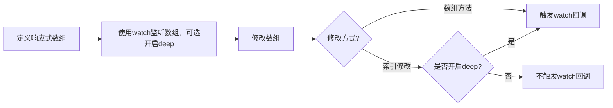

扫描[二维码](https://api2.cmdragon.cn/upload/cmder/20250304_012821924.jpg)关注或者微信搜一搜：`编程智域 前端至全栈交流与成长`

[发现1000+提升效率与开发的AI工具和实用程序](https://tools.cmdragon.cn/zh/apps?category=ai_chat)：https://tools.cmdragon.cn/

## 多数据源监听

在Vue 3中，`watch` 允许我们同时监听多个响应式数据源，当其中任意一个数据源发生变化时，都会触发回调函数。这在需要同步处理多个数据变化的场景中非常实用，比如表单多字段联动验证、多条件组合筛选等。

### 基本用法

我们可以将多个数据源（ref、reactive对象或getter函数）放入一个数组中，作为`watch`
的第一个参数。回调函数的第一个参数是所有数据源的新值组成的数组，第二个参数是旧值组成的数组。

```javascript
import {ref, watch} from 'vue'

// 定义多个响应式数据
const username = ref('')
const password = ref('')
const rememberMe = ref(false)

// 同时监听三个数据源
watch(
    [username, password, rememberMe],
    ([newUsername, newPassword, newRememberMe], [oldUsername, oldPassword, oldRememberMe]) => {
        console.log(`用户名从 ${oldUsername} 变为 ${newUsername}`)
        console.log(`密码从 ${oldPassword} 变为 ${newPassword}`)
        console.log(`记住我状态从 ${oldRememberMe} 变为 ${newRememberMe}`)

        // 实际场景中可以在这里进行表单验证
        if (newUsername && newPassword) {
            console.log('表单字段已填写完整')
        }
    }
)
```

### 执行流程


---

## Getter函数监听

当我们需要监听的目标不是直接的响应式数据，而是基于响应式数据计算出的值时，可以使用**getter函数**作为`watch`
的监听源。这种方式让我们能够灵活定义监听的计算逻辑。

### 基本用法

Getter函数需要返回我们想要监听的计算结果，当这个结果发生变化时，`watch`就会触发回调函数。

```javascript
import {reactive, watch} from 'vue'

// 定义响应式状态对象
const cart = reactive({
    items: [
        {id: 1, name: 'Vue 3 实战教程', price: 59, quantity: 1},
        {id: 2, name: 'Vuex 从入门到精通', price: 39, quantity: 2}
    ]
})

// 监听购物车的总金额
watch(
    // Getter函数：计算总金额
    () => cart.items.reduce((total, item) => total + item.price * item.quantity, 0),
    (newTotal, oldTotal) => {
        console.log(`购物车总金额从 ${oldTotal} 元变为 ${newTotal} 元`)

        // 实际场景中可以在这里更新结算按钮状态或显示优惠信息
        if (newTotal >= 100) {
            console.log('满足满减条件，可享受10元优惠')
        }
    }
)

// 修改购物车商品数量，触发watch
cart.items[0].quantity = 2
```

### 执行流程


---

## 数组监听

在Vue 3中监听数组需要注意一些细节，因为Vue的响应式系统对数组的处理和普通对象有所不同。默认情况下，`watch`会监听数组的引用变化和数组方法（如
`push`、`pop`、`splice`等）的调用，但不会监听数组元素的直接索引修改。

### 监听数组整体变化

当使用数组方法修改数组时，`watch`会自动触发：

```javascript
import {ref, watch} from 'vue'

const todoList = ref(['学习Vue 3', '编写项目实战'])

// 监听数组整体变化
watch(todoList, (newList, oldList) => {
    console.log('待办事项列表发生变化：', newList)
})

// 使用数组方法修改数组，触发watch
todoList.value.push('优化代码性能')
todoList.value.pop()
```

### 监听数组内部元素变化

如果需要监听数组元素的直接修改（如`arr[0] = '新值'`），需要开启`deep`选项：

```javascript
import {ref, watch} from 'vue'

const numbers = ref([1, 2, 3, 4])

// 开启deep选项，监听数组内部元素变化
watch(numbers, (newNumbers, oldNumbers) => {
    console.log('数组元素发生变化：', newNumbers)
}, {deep: true})

// 直接修改数组元素，触发watch
numbers.value[0] = 100
```

### 执行流程



---

## 课后Quiz

### 问题1

如何在Vue 3中同时监听多个响应式数据的变化？请写出代码示例。

**答案解析**：
可以将多个数据源放入数组中作为`watch`的第一个参数，回调函数会接收新值数组和旧值数组：

```javascript
import {ref, watch} from 'vue'

const name = ref('')
const age = ref(0)

watch(
    [name, age],
    ([newName, newAge], [oldName, oldAge]) => {
        console.log(`姓名从 ${oldName} 变为 ${newName}`)
        console.log(`年龄从 ${oldAge} 变为 ${newAge}`)
    }
)
```

### 问题2

当需要监听响应式对象中多个属性的计算结果时，应该使用什么方式？请写出代码示例。

**答案解析**：
使用getter函数作为`watch`的监听源，在getter函数中计算需要监听的结果：

```javascript
import {reactive, watch} from 'vue'

const product = reactive({
    stock: 100,
    sales: 30
})

// 监听剩余库存
watch(
    () => product.stock - product.sales,
    (newStock, oldStock) => {
        console.log(`剩余库存从 ${oldStock} 变为 ${newStock}`)
    }
)
```

### 问题3

为什么直接修改数组的索引元素时，`watch`默认不会触发？如何解决这个问题？

**答案解析**：
Vue的响应式系统默认不会监听数组的索引修改，因为这在性能上是低效的。解决方法有两种：

1. 开启`deep`选项，深度监听数组内部元素变化
2. 使用Vue提供的数组方法（如`push`、`splice`等）来修改数组

---

## 常见报错解决方案

### 报错1：`watch source must be a ref, reactive object, getter function, or array of these`

- **原因**：`watch`的监听源类型不正确，不是Vue支持的响应式数据源类型。
- **解决方法**：确保监听源是ref、reactive对象、getter函数或这些类型的数组。例如，如果你想监听普通变量，需要先将其转换为ref：

```javascript
// 错误用法：监听普通变量
let count = 0
watch(count, () => { /* ... */
})

// 正确用法：转换为ref
const count = ref(0)
watch(count, () => { /* ... */
})
```

### 报错2：数组元素修改后`watch`不触发

- **原因**：直接修改数组索引元素，Vue默认不监听这种变化。
- **解决方法**：开启`deep`选项，或者使用数组方法修改数组：

```javascript
// 方法1：开启deep选项
watch(numbers, () => { /* ... */
}, {deep: true})

// 方法2：使用数组方法
numbers.value.splice(0, 1, 100)
```

### 报错3：`Cannot read property 'value' of undefined`

- **原因**：在getter函数或回调函数中访问了未定义的响应式属性。
- **解决方法**：确保所有访问的属性都已正确定义，或者添加可选链操作符：

```javascript
// 错误用法：访问未定义的属性
watch(() => user.address.city, () => { /* ... */
})

// 正确用法：添加可选链
watch(() => user?.address?.city, () => { /* ... */
})
```

---

## 参考链接

参考链接：https://vuejs.org/guide/essentials/watchers.html

余下文章内容请点击跳转至 个人博客页面 或者 扫描[二维码](https://api2.cmdragon.cn/upload/cmder/20250304_012821924.jpg)
关注或者微信搜一搜：`编程智域 前端至全栈交流与成长`
，阅读完整的文章：[Vue 3中watch如何高效监听多数据源、计算结果与数组变化？](https://blog.cmdragon.cn/posts/757a1728bc1b9c0c8b317b0354d85568/)


<details>
<summary>往期文章归档</summary>

- [Vue 3中watch监听ref和reactive的核心差异与注意事项是什么？](https://blog.cmdragon.cn/posts/8e70552f0f61e0dc8c7f567a2d272345/)
- [Vue3中Watch与watchEffect的核心差异及适用场景是什么？](https://blog.cmdragon.cn/posts/dde70ab90dc5062c435e0501f5a6e7cb/)
- [Vue 3自定义指令如何赋能表单自动聚焦与防抖输入的高效实现？](https://blog.cmdragon.cn/posts/1f5ed5047850ed52c0fd0386f76bd4ae/)
- [Vue3中如何优雅实现支持多绑定变量和修饰符的双向绑定组件？](https://blog.cmdragon.cn/posts/e3d4e128815ad731611b8ef29e37616b/)
- [Vue 3表单验证如何从基础规则到异步交互构建完整验证体系？](https://blog.cmdragon.cn/posts/7d1caedd822f70542aa0eed67e30963b/)
- [Vue3响应式系统如何支撑表单数据的集中管理、动态扩展与实时计算？](https://blog.cmdragon.cn/posts/3687a5437ab56cb082b5b813d5577a40/)
- [Vue3跨组件通信中，全局事件总线与provide/inject该如何正确选择？](https://blog.cmdragon.cn/posts/ad67c4eb6d76cf7707bdfe6a8146c34f/)
- [Vue3表单事件处理：v-model如何实现数据绑定、验证与提交？](https://blog.cmdragon.cn/posts/1c1e80d697cca0923f29ec70ebb8ccd1/)
- [Vue应用如何基于DOM事件传播机制与事件修饰符实现高效事件处理？](https://blog.cmdragon.cn/posts/b990828143d70aa87f9aa52e16692e48/)
- [Vue3中如何在调用事件处理函数时同时传递自定义参数和原生DOM事件？参数顺序有哪些注意事项？](https://blog.cmdragon.cn/posts/b44316e0866e9f2e6aef927dbcf5152b/)
- [从捕获到冒泡：Vue事件修饰符如何重塑事件执行顺序？](https://blog.cmdragon.cn/posts/021636c2a06f5e2d3d01977a12ddf559/)
- [Vue事件处理：内联还是方法事件处理器，该如何抉择？](https://blog.cmdragon.cn/posts/b3cddf7023ab537e623a61bc01dab6bb/)
- [Vue事件绑定中v-on与@语法如何取舍？参数传递与原生事件处理有哪些实战技巧？](https://blog.cmdragon.cn/posts/bd4d9607ce1bc34cc3bda0a1a46c40f6/)
- [Vue 3中列表排序时为何必须复制数组而非直接修改原始数据？](https://blog.cmdragon.cn/posts/a5f2bacb74476fd7f5e02bb3f1ba6b2b/)
- [Vue虚拟滚动如何将列表DOM数量从万级降至十位数？](https://blog.cmdragon.cn/posts/d3b06b57fb7f126787e6ed22dce1e341/)
- [Vue3中v-if与v-for直接混用为何会报错？计算属性如何解决优先级冲突？](https://blog.cmdragon.cn/posts/3100cc5a2e16f8dac36f722594e6af32/)
- [为何在Vue3递归组件中必须用v-if判断子项存在？](https://blog.cmdragon.cn/posts/455dc2d47c38d12c1cf350e490041e8b/)
- [Vue3列表渲染中，如何用数组方法与计算属性优化v-for的数据处理？](https://blog.cmdragon.cn/posts/3f842bbd7ba0f9c91151b983bf784c8b/)
- [Vue v-for的key：为什么它能解决列表渲染中的“玄学错误”？选错会有哪些后果？](https://blog.cmdragon.cn/posts/1eb3ffac668a743843b5ea1738301d40/)
- [Vue3中v-for与v-if为何不能直接共存于同一元素？](https://blog.cmdragon.cn/posts/138b13c5341f6a1fa9015400433a3611/)
- [Vue3中v-if与v-show的本质区别及动态组件状态保持的关键策略是什么？](https://blog.cmdragon.cn/posts/0242a94dc552b93a1bc335ac4fc33db5/)
- [Vue3中v-show如何通过CSS修改display属性控制条件显示？与v-if的应用场景该如何区分？](https://blog.cmdragon.cn/posts/97c66a18ae0e9b57c6a69b8b3a41ddf6/)
- [Vue3条件渲染中v-if系列指令如何合理使用与规避错误？](https://blog.cmdragon.cn/posts/8a1ddfac64b25062ac56403e4c1201d2/)
- [Vue3动态样式控制：ref、reactive、watch与computed的应用场景与区别是什么？](https://blog.cmdragon.cn/posts/218c3a59282c3b757447ee08a01937bb/)
- [Vue3中动态样式数组的后项覆盖规则如何与计算属性结合实现复杂状态样式管理？](https://blog.cmdragon.cn/posts/1bab953e41f66ac53de099fa9fe76483/)
- [Vue浅响应式如何解决深层响应式的性能问题？适用场景有哪些？ - cmdragon's Blog](https://blog.cmdragon.cn/posts/c85e1fe16a7ae45e965b4e2df4d9d2f4/)
- [Vue 3组合式API中ref与reactive的核心响应式差异及使用最佳实践是什么？ - cmdragon's Blog](https://blog.cmdragon.cn/posts/be04b02d2723994632de0d4ca22a3391/)
- [Vue 3组合式API中ref与reactive的核心响应式差异及使用最佳实践是什么？ - cmdragon's Blog](https://blog.cmdragon.cn/posts/be04b02d2723994632de0d4ca22a3391/)
- [Vue3响应式系统中，对象新增属性、数组改索引、原始值代理的问题如何解决？ - cmdragon's Blog](https://blog.cmdragon.cn/posts/a0af08dd60a37b9a890a9957f2cbfc9f/)
- [Vue 3中watch侦听器的正确使用姿势你掌握了吗？深度监听、与watchEffect的差异及常见报错解析 - cmdragon's Blog](https://blog.cmdragon.cn/posts/bc287e1e36287afd90750fd907eca85e/)
- [Vue响应式声明的API差异、底层原理与常见陷阱你都搞懂了吗 - cmdragon's Blog](https://blog.cmdragon.cn/posts/654b9447ef1ba7ec1126a1bc26a4726d/)
- [Vue响应式声明的API差异、底层原理与常见陷阱你都搞懂了吗 - cmdragon's Blog](https://blog.cmdragon.cn/posts/654b9447ef1ba7ec1126a1bc26a4726d/)
- [为什么Vue 3需要ref函数？它的响应式原理与正确用法是什么？ - cmdragon's Blog](https://blog.cmdragon.cn/posts/c405a8d9950af5b7c63b56c348ac36b6/)
- [Vue 3中reactive函数如何通过Proxy实现响应式？使用时要避开哪些误区？ - cmdragon's Blog](https://blog.cmdragon.cn/posts/a7e9abb9691a81e4404d9facabe0f7c3/)
- [Vue3响应式系统的底层原理与实践要点你真的懂吗？ - cmdragon's Blog](https://blog.cmdragon.cn/posts/bd995ea45161727597fb85b62566c43d/)
- [Vue 3模板如何通过编译三阶段实现从声明式语法到高效渲染的跨越 - cmdragon's Blog](https://blog.cmdragon.cn/posts/53e3f270a80675df662c6857a3332c0f/)
- [快速入门Vue模板引用：从收DOM“快递”到调子组件方法，你玩明白了吗？ - cmdragon's Blog](https://blog.cmdragon.cn/posts/ddbce4f2a23aa72c96b1c0473900321e/)
- [快速入门Vue模板里的JS表达式有啥不能碰？计算属性为啥比方法更能打？ - cmdragon's Blog](https://blog.cmdragon.cn/posts/23a2d5a334e15575277814c16e45df50/)
- [快速入门Vue的v-model表单绑定：语法糖、动态值、修饰符的小技巧你都掌握了吗？ - cmdragon's Blog](https://blog.cmdragon.cn/posts/6be38de6382e31d282659b689c5b17f0/)
- [快速入门Vue3事件处理的挑战题：v-on、修饰符、自定义事件你能通关吗？ - cmdragon's Blog](https://blog.cmdragon.cn/posts/60ce517684f4a418f453d66aa805606c/)
- [快速入门Vue3的v-指令：数据和DOM的“翻译官”到底有多少本事？ - cmdragon's Blog](https://blog.cmdragon.cn/posts/e4ae7d5e4a9205bb11b2baccb230c637/)
- [快速入门Vue3，插值、动态绑定和避坑技巧你都搞懂了吗？ - cmdragon's Blog](https://blog.cmdragon.cn/posts/999ce4fb32259ff4fbf4bf7bcb851654/)
- [想让PostgreSQL快到飞起？先找健康密码还是先换引擎？ - cmdragon's Blog](https://blog.cmdragon.cn/posts/a6997d81b49cd232b87e1cf603888ad1/)
- [想让PostgreSQL查询快到飞起？分区表、物化视图、并行查询这三招灵不灵？ - cmdragon's Blog](https://blog.cmdragon.cn/posts/1fee7afbb9abd4540b8aa9c141d6845d/)
- [子查询总拖慢查询？把它变成连接就能解决？ - cmdragon's Blog](https://blog.cmdragon.cn/posts/79c590fbd87ece535b11a71c9667884f/)
- [PostgreSQL全表扫描慢到崩溃？建索引+改查询+更统计信息三招能破？ - cmdragon's Blog](https://blog.cmdragon.cn/posts/748cdac2536008199abf8a8a2cd0ec85/)
- [复杂查询总拖后腿？PostgreSQL多列索引+覆盖索引的神仙技巧你get没？ - cmdragon's Blog](https://blog.cmdragon.cn/posts/32ca943703226d317d4276a8fb53b0dd/)
- [只给表子集建索引？用函数结果建索引？PostgreSQL这俩操作凭啥能省空间又加速？ - cmdragon's Blog](https://blog.cmdragon.cn/posts/ca93f1d53aa910e7ba5ffd8df611c12b/)
- [B-tree索引像字典查词一样工作？那哪些数据库查询它能加速，哪些不能？ - cmdragon's Blog](https://blog.cmdragon.cn/posts/f507856ebfddd592448813c510a53669/)
- [想抓PostgreSQL里的慢SQL？pg_stat_statements基础黑匣子和pg_stat_monitor时间窗，谁能帮你更准揪出性能小偷？ - cmdragon's Blog](https://blog.cmdragon.cn/posts/b2213bfcb5b88a862f2138404c03d596/)
- [PostgreSQL的“时光机”MVCC和锁机制是怎么搞定高并发的？ - cmdragon's Blog](https://blog.cmdragon.cn/posts/26614eb7da6c476dde41d367ad888d2f/)
- [PostgreSQL性能暴涨的关键？内存IO并发参数居然要这么设置？ - cmdragon's Blog](https://blog.cmdragon.cn/posts/69f99bc6972a860d559c74aad7280da4/)
- [大表查询慢到翻遍整个书架？PostgreSQL分区表教你怎么“分类”才高效](https://blog.cmdragon.cn/posts/7b7053f392147a8b3b1a16bebeb08d0a/)
- [PostgreSQL 查询慢？是不是忘了优化 GROUP BY、ORDER BY 和窗口函数？ - cmdragon's Blog](https://blog.cmdragon.cn/posts/c856e3cb073822349f3bf2d29995dcfc/)
- [PostgreSQL里的子查询和CTE居然在性能上“掐架”？到底该站哪边？ - cmdragon's Blog](https://blog.cmdragon.cn/posts/c096347d18e67b7431faacd2c4757093/)
- [PostgreSQL选Join策略有啥小九九？Nested Loop/Merge/Hash谁是它的菜？ - cmdragon's Blog](https://blog.cmdragon.cn/posts/2eca89463454fd4250d7b66243b9fe5a/)
- [PostgreSQL新手SQL总翻车？这7个性能陷阱你踩过没？ - cmdragon's Blog](https://blog.cmdragon.cn/posts/068ecb772a87d7df20a8c9fb4b233f8e/)
- [PostgreSQL索引选B-Tree还是GiST？“瑞士军刀”和“多面手”的差别你居然还不知道？ - cmdragon's Blog](https://blog.cmdragon.cn/posts/d498f63cd0a2d5a77e445c688a8b88db/)
- [想知道数据库怎么给查询“算成本选路线”？EXPLAIN能帮你看明白？ - cmdragon's Blog](https://blog.cmdragon.cn/posts/9101b75bdec6faea9b35d54f14e37f36/)
- [PostgreSQL处理SQL居然像做蛋糕？解析到执行的4步里藏着多少查询优化的小心机？ - cmdragon's Blog](https://blog.cmdragon.cn/posts/d527f8ebb6e3dae2c7dfe4c8d8979444/)
- [PostgreSQL备份不是复制文件？物理vs逻辑咋选？误删还能精准恢复到1分钟前？ - cmdragon's Blog](https://blog.cmdragon.cn/posts/6bfdae84f313cf7ad0bb7045c4392347/)
- [转账不翻车、并发不干扰，PostgreSQL的ACID特性到底有啥魔法？ - cmdragon's Blog](https://blog.cmdragon.cn/posts/de3672803de34dbad244d0a8d48b0eb5/)
- [银行转账不白扣钱、电商下单不超卖，PostgreSQL事务的诀窍是啥？ - cmdragon's Blog](https://blog.cmdragon.cn/posts/e463e8a2668abdf00a228c9b79324ded/)
- [PostgreSQL里的PL/pgSQL到底是啥？能让SQL从“说目标”变“讲步骤”？ - cmdragon's Blog](https://blog.cmdragon.cn/posts/5c967e595058c4a1fc4474a68e64031d/)
- [PostgreSQL视图不存数据？那它怎么简化查询还能递归生成序列和控制权限？ - cmdragon's Blog](https://blog.cmdragon.cn/posts/325047855e3e23b5ef82f7d2db134fbd/)
- [PostgreSQL索引这么玩，才能让你的查询真的“飞”起来？ - cmdragon's Blog](https://blog.cmdragon.cn/posts/d2dba50bb6e4df7b27e735245a06a2a2/)
- [PostgreSQL的表关系和约束，咋帮你搞定用户订单不混乱、学生选课不重复？ - cmdragon's Blog](https://blog.cmdragon.cn/posts/849ae5bab0f8c66e94c2f6ad1bb798e3/)
- [PostgreSQL查询的筛子、排序、聚合、分组？你会用它们搞定数据吗？ - cmdragon's Blog](https://blog.cmdragon.cn/posts/ef4800975ffa84f1ca51976a70a1585b/)
- [PostgreSQL数据类型怎么选才高效不踩坑？ - cmdragon's Blog](https://blog.cmdragon.cn/posts/bf54711525c507c5eacfa7b0151c39d2/)
- [想解锁PostgreSQL查询从基础到进阶的核心知识点？你都get了吗？ - cmdragon's Blog](https://blog.cmdragon.cn/posts/887809b3e0375f5956873cd442f516d8/)
- [PostgreSQL DELETE居然有这些操作？返回数据、连表删你试过没？ - cmdragon's Blog](https://blog.cmdragon.cn/posts/934be1203725e8be9d6f6e9104e5abcc/)
- [PostgreSQL UPDATE语句怎么玩？从改邮箱到批量更新的避坑技巧你都会吗？ - cmdragon's Blog](https://blog.cmdragon.cn/posts/0f0622e9b7402b599e618150d0596ffe/)
- [PostgreSQL插入数据还在逐条敲？批量、冲突处理、返回自增ID的技巧你会吗？ - cmdragon's Blog](https://blog.cmdragon.cn/posts/0e3bf7efc030b024ea67ee855a00f2de/)
- [PostgreSQL的“仓库-房间-货架”游戏，你能建出电商数据库和表吗？ - cmdragon's Blog](https://blog.cmdragon.cn/posts/b6cd3c86da6aac26ed829e472d34078e/)
- [PostgreSQL 17安装总翻车？Windows/macOS/Linux避坑指南帮你搞定？ - cmdragon's Blog](https://blog.cmdragon.cn/posts/ba1f545a3410144552fbdbfcf31b5265/)
- [能当关系型数据库还能玩对象特性，能拆复杂查询还能自动管库存，PostgreSQL凭什么这么香？ - cmdragon's Blog](https://blog.cmdragon.cn/posts/b5474d1480509c5072085abc80b3dd9f/)
- [给接口加新字段又不搞崩老客户端？FastAPI的多版本API靠哪三招实现？ - cmdragon's Blog](https://blog.cmdragon.cn/posts/cc098d8836e787baa8a4d92e4d56d5c5/)
- [流量突增要搞崩FastAPI？熔断测试是怎么防系统雪崩的？ - cmdragon's Blog](https://blog.cmdragon.cn/posts/46d05151c5bd31cf37a7bcf0b8f5b0b8/)
- [FastAPI秒杀库存总变负数？Redis分布式锁能帮你守住底线吗 - cmdragon's Blog](https://blog.cmdragon.cn/posts/65ce343cc5df9faf3a8e2eeaab42ae45/)
- [FastAPI的CI流水线怎么自动测端点，还能让Allure报告美到犯规？ - cmdragon's Blog](https://blog.cmdragon.cn/posts/eed6cd8985d9be0a4b092a7da38b3e0c/)
- [如何用GitHub Actions为FastAPI项目打造自动化测试流水线？ - cmdragon's Blog](https://blog.cmdragon.cn/posts/6157d87338ce894d18c013c3c4777abb/)

</details>


<details>
<summary>免费好用的热门在线工具</summary>

- [文件格式转换器 - 应用商店 | By cmdragon](https://tools.cmdragon.cn/zh/apps/file-converter)
- [M3U8在线播放器 - 应用商店 | By cmdragon](https://tools.cmdragon.cn/zh/apps/m3u8-player)
- [快图设计 - 应用商店 | By cmdragon](https://tools.cmdragon.cn/zh/apps/quick-image-design)
- [高级文字转图片转换器 - 应用商店 | By cmdragon](https://tools.cmdragon.cn/zh/apps/text-to-image-advanced)
- [RAID 计算器 - 应用商店 | By cmdragon](https://tools.cmdragon.cn/zh/apps/raid-calculator)
- [在线PS - 应用商店 | By cmdragon](https://tools.cmdragon.cn/zh/apps/photoshop-online)
- [Mermaid 在线编辑器 - 应用商店 | By cmdragon](https://tools.cmdragon.cn/zh/apps/mermaid-live-editor)
- [数学求解计算器 - 应用商店 | By cmdragon](https://tools.cmdragon.cn/zh/apps/math-solver-calculator)
- [智能提词器 - 应用商店 | By cmdragon](https://tools.cmdragon.cn/zh/apps/smart-teleprompter)
- [魔法简历 - 应用商店 | By cmdragon](https://tools.cmdragon.cn/zh/apps/magic-resume)
- [Image Puzzle Tool - 图片拼图工具 | By cmdragon](https://tools.cmdragon.cn/zh/apps/image-puzzle-tool)
- [字幕下载工具 - 应用商店 | By cmdragon](https://tools.cmdragon.cn/zh/apps/subtitle-downloader)
- [歌词生成工具 - 应用商店 | By cmdragon](https://tools.cmdragon.cn/zh/apps/lyrics-generator)
- [网盘资源聚合搜索 - 应用商店 | By cmdragon](https://tools.cmdragon.cn/zh/apps/cloud-drive-search)
- [ASCII字符画生成器 - 应用商店 | By cmdragon](https://tools.cmdragon.cn/zh/apps/ascii-art-generator)
- [JSON Web Tokens 工具 - 应用商店 | By cmdragon](https://tools.cmdragon.cn/zh/apps/jwt-tool)
- [Bcrypt 密码工具 - 应用商店 | By cmdragon](https://tools.cmdragon.cn/zh/apps/bcrypt-tool)
- [GIF 合成器 - 应用商店 | By cmdragon](https://tools.cmdragon.cn/zh/apps/gif-composer)
- [GIF 分解器 - 应用商店 | By cmdragon](https://tools.cmdragon.cn/zh/apps/gif-decomposer)
- [文本隐写术 - 应用商店 | By cmdragon](https://tools.cmdragon.cn/zh/apps/text-steganography)
- [CMDragon 在线工具 - 高级AI工具箱与开发者套件 | 免费好用的在线工具](https://tools.cmdragon.cn/zh)
- [应用商店 - 发现1000+提升效率与开发的AI工具和实用程序 | 免费好用的在线工具](https://tools.cmdragon.cn/zh/apps?category=trending)
- [CMDragon 更新日志 - 最新更新、功能与改进 | 免费好用的在线工具](https://tools.cmdragon.cn/zh/changelog)
- [支持我们 - 成为赞助者 | 免费好用的在线工具](https://tools.cmdragon.cn/zh/sponsor)
- [AI文本生成图像 - 应用商店 | 免费好用的在线工具](https://tools.cmdragon.cn/zh/apps/text-to-image-ai)
- [临时邮箱 - 应用商店 | 免费好用的在线工具](https://tools.cmdragon.cn/zh/apps/temp-email)
- [二维码解析器 - 应用商店 | 免费好用的在线工具](https://tools.cmdragon.cn/zh/apps/qrcode-parser)
- [文本转思维导图 - 应用商店 | 免费好用的在线工具](https://tools.cmdragon.cn/zh/apps/text-to-mindmap)
- [正则表达式可视化工具 - 应用商店 | 免费好用的在线工具](https://tools.cmdragon.cn/zh/apps/regex-visualizer)
- [文件隐写工具 - 应用商店 | 免费好用的在线工具](https://tools.cmdragon.cn/zh/apps/steganography-tool)
- [IPTV 频道探索器 - 应用商店 | 免费好用的在线工具](https://tools.cmdragon.cn/zh/apps/iptv-explorer)
- [快传 - 应用商店 | 免费好用的在线工具](https://tools.cmdragon.cn/zh/apps/snapdrop)
- [随机抽奖工具 - 应用商店 | 免费好用的在线工具](https://tools.cmdragon.cn/zh/apps/lucky-draw)
- [动漫场景查找器 - 应用商店 | 免费好用的在线工具](https://tools.cmdragon.cn/zh/apps/anime-scene-finder)
- [时间工具箱 - 应用商店 | 免费好用的在线工具](https://tools.cmdragon.cn/zh/apps/time-toolkit)
- [网速测试 - 应用商店 | 免费好用的在线工具](https://tools.cmdragon.cn/zh/apps/speed-test)
- [AI 智能抠图工具 - 应用商店 | 免费好用的在线工具](https://tools.cmdragon.cn/zh/apps/background-remover)
- [背景替换工具 - 应用商店 | 免费好用的在线工具](https://tools.cmdragon.cn/zh/apps/background-replacer)
- [艺术二维码生成器 - 应用商店 | 免费好用的在线工具](https://tools.cmdragon.cn/zh/apps/artistic-qrcode)
- [Open Graph 元标签生成器 - 应用商店 | 免费好用的在线工具](https://tools.cmdragon.cn/zh/apps/open-graph-generator)
- [图像对比工具 - 应用商店 | 免费好用的在线工具](https://tools.cmdragon.cn/zh/apps/image-comparison)
- [图片压缩专业版 - 应用商店 | 免费好用的在线工具](https://tools.cmdragon.cn/zh/apps/image-compressor)
- [密码生成器 - 应用商店 | 免费好用的在线工具](https://tools.cmdragon.cn/zh/apps/password-generator)
- [SVG优化器 - 应用商店 | 免费好用的在线工具](https://tools.cmdragon.cn/zh/apps/svg-optimizer)
- [调色板生成器 - 应用商店 | 免费好用的在线工具](https://tools.cmdragon.cn/zh/apps/color-palette)
- [在线节拍器 - 应用商店 | 免费好用的在线工具](https://tools.cmdragon.cn/zh/apps/online-metronome)
- [IP归属地查询 - 应用商店 | 免费好用的在线工具](https://tools.cmdragon.cn/zh/apps/ip-geolocation)
- [CSS网格布局生成器 - 应用商店 | 免费好用的在线工具](https://tools.cmdragon.cn/zh/apps/css-grid-layout)
- [邮箱验证工具 - 应用商店 | 免费好用的在线工具](https://tools.cmdragon.cn/zh/apps/email-validator)
- [书法练习字帖 - 应用商店 | 免费好用的在线工具](https://tools.cmdragon.cn/zh/apps/calligraphy-practice)
- [金融计算器套件 - 应用商店 | 免费好用的在线工具](https://tools.cmdragon.cn/zh/apps/finance-calculator-suite)
- [中国亲戚关系计算器 - 应用商店 | 免费好用的在线工具](https://tools.cmdragon.cn/zh/apps/chinese-kinship-calculator)
- [Protocol Buffer 工具箱 - 应用商店 | 免费好用的在线工具](https://tools.cmdragon.cn/zh/apps/protobuf-toolkit)
- [IP归属地查询 - 应用商店 | 免费好用的在线工具](https://tools.cmdragon.cn/zh/apps/ip-geolocation)
- [图片无损放大 - 应用商店 | 免费好用的在线工具](https://tools.cmdragon.cn/zh/apps/image-upscaler)
- [文本比较工具 - 应用商店 | 免费好用的在线工具](https://tools.cmdragon.cn/zh/apps/text-compare)
- [IP批量查询工具 - 应用商店 | 免费好用的在线工具](https://tools.cmdragon.cn/zh/apps/ip-batch-lookup)
- [域名查询工具 - 应用商店 | 免费好用的在线工具](https://tools.cmdragon.cn/zh/apps/domain-finder)
- [DNS工具箱 - 应用商店 | 免费好用的在线工具](https://tools.cmdragon.cn/zh/apps/dns-toolkit)
- [网站图标生成器 - 应用商店 | 免费好用的在线工具](https://tools.cmdragon.cn/zh/apps/favicon-generator)
- [XML Sitemap](https://tools.cmdragon.cn/sitemap_index.xml)

</details>