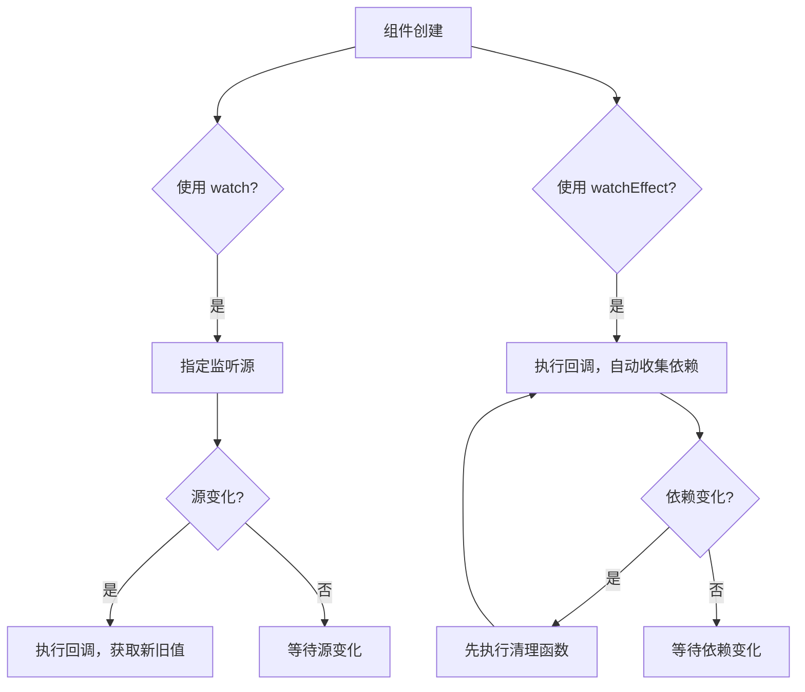

扫描[二维码](https://api2.cmdragon.cn/upload/cmder/20250304_012821924.jpg)关注或者微信搜一搜：`编程智域 前端至全栈交流与成长`

[发现1000+提升效率与开发的AI工具和实用程序](https://tools.cmdragon.cn/zh/apps?category=ai_chat)：https://tools.cmdragon.cn/


# Vue 3 侦听器深度解析：watch 与 watchEffect 对比选型及性能优化

## 一、watch 基本概念与用法

### 1.1 核心概念
watch 是 Vue 3 中用于监听特定数据源变化并执行副作用的 API。它默认是惰性的，只有当监听的源发生变化时才会触发回调函数。这使得 watch 非常适合处理那些需要在特定状态变化时执行的异步操作或复杂逻辑。

### 1.2 基本用法示例

#### Options API 方式
```javascript
export default {
  data() {
    return {
      question: '',
      answer: 'Questions usually contain a question mark. ;-)',
      loading: false
    }
  },
  watch: {
    // 当 question 变化时，执行此函数
    question(newQuestion, oldQuestion) {
      if (newQuestion.includes('?')) {
        this.getAnswer()
      }
    }
  },
  methods: {
    async getAnswer() {
      this.loading = true
      this.answer = 'Thinking...'
      try {
        const res = await fetch('https://yesno.wtf/api')
        this.answer = (await res.json()).answer
      } catch (error) {
        this.answer = 'Error! Could not reach the API. ' + error
      } finally {
        this.loading = false
      }
    }
  }
}
```

#### Composition API 方式
```vue
<script setup>
import { ref, watch } from 'vue'

const question = ref('')
const answer = ref('Questions usually contain a question mark. ;-)')
const loading = ref(false)

// 直接监听 ref
watch(question, async (newQuestion, oldQuestion) => {
  if (newQuestion.includes('?')) {
    loading.value = true
    answer.value = 'Thinking...'
    try {
      const res = await fetch('https://yesno.wtf/api')
      answer.value = (await res.json()).answer
    } catch (error) {
      answer.value = 'Error! Could not reach the API. ' + error
    } finally {
      loading.value = false
    }
  }
})
</script>

<template>
  <p>
    Ask a yes/no question:
    <input v-model="question" :disabled="loading" />
  </p>
  <p>{{ answer }}</p>
</template>
```

### 1.3 高级用法

#### 监听嵌套属性
```javascript
// Options API
export default {
  watch: {
    'some.nested.key'(newValue) {
      // 当嵌套属性变化时触发
    }
  }
}

// Composition API
const obj = reactive({ some: { nested: { key: 0 } } })
watch(
  () => obj.some.nested.key,
  (newValue) => {
    // 当嵌套属性变化时触发
  }
)
```

#### 深度监听
```javascript
// Options API
export default {
  watch: {
    someObject: {
      handler(newValue, oldValue) {
        // 监听对象的所有嵌套属性变化
      },
      deep: true
    }
  }
}

// Composition API
const obj = reactive({ count: 0 })
// 直接监听 reactive 对象会自动创建深度监听
watch(obj, (newValue, oldValue) => {
  // 当对象的任何嵌套属性变化时触发
})
```

#### 立即执行
```javascript
// Options API
export default {
  watch: {
    question: {
      handler(newQuestion) {
        // 组件创建时立即执行一次
      },
      immediate: true
    }
  }
}

// Composition API
watch(
  question,
  (newQuestion) => {
    // 组件创建时立即执行一次
  },
  { immediate: true }
)
```

## 二、watchEffect 基本概念与用法

### 2.1 核心概念
watchEffect 是 Vue 3 中另一个强大的侦听器 API，它会自动收集回调函数中的依赖，并在依赖发生变化时重新执行回调。与 watch 不同，watchEffect 会在组件创建时立即执行一次，然后在依赖变化时再次执行。

### 2.2 基本用法示例
```vue
<script setup>
import { ref, watchEffect } from 'vue'

const todoId = ref(1)
const data = ref(null)

// 自动收集 todoId.value 作为依赖
watchEffect(async () => {
  const response = await fetch(
    `https://jsonplaceholder.typicode.com/todos/${todoId.value}`
  )
  data.value = await response.json()
})
</script>
```

### 2.3 高级用法

#### 副作用清理
```javascript
watchEffect((onCleanup) => {
  const controller = new AbortController()
  
  fetch(`/api/${id.value}`, { signal: controller.signal })
    .then(response => response.json())
    .then(data => {
      // 处理数据
    })
  
  // 当依赖变化时，先执行清理函数
  onCleanup(() => {
    controller.abort()
  })
})
```

#### 调整执行时机
```javascript
// 默认：在组件更新前执行
watchEffect(() => {})

// 在组件更新后执行
watchEffect(() => {}, { flush: 'post' })
// 或使用别名
watchPostEffect(() => {})

// 同步执行，不进行批处理
watchEffect(() => {}, { flush: 'sync' })
// 或使用别名
watchSyncEffect(() => {})
```

## 三、watch 与 watchEffect 对比选型

### 3.1 核心区别对比

| 特性 | watch | watchEffect |
|------|-------|-------------|
| **依赖追踪** | 手动指定监听源 | 自动收集回调中的依赖 |
| **执行时机** | 惰性执行，仅在源变化时触发 | 立即执行，然后在依赖变化时触发 |
| **参数获取** | 可以获取新旧值 | 无法直接获取新旧值 |
| **使用场景** | 监听特定数据源，需要获取新旧值 | 监听多个依赖，不需要关心具体哪个依赖变化 |

### 3.2 工作流程对比



### 3.3 选型建议

1. **使用 watch 的场景**：
   - 需要监听特定的数据源变化
   - 需要获取变化前后的具体值
   - 需要执行惰性操作（仅在源变化时执行）
   - 需要深度监听或立即执行等高级配置

2. **使用 watchEffect 的场景**：
   - 需要监听多个依赖，且不关心具体哪个依赖变化
   - 需要在组件创建时立即执行一次
   - 需要自动管理依赖，减少代码维护成本
   - 处理异步操作时需要自动清理副作用

## 四、性能优化技巧

### 4.1 避免不必要的监听

- 只监听实际需要的数据源，避免监听整个大对象
- 使用 getter 函数监听嵌套属性，而不是使用 deep 选项
- 对于不需要深度监听的对象，避免使用 deep: true

### 4.2 合理使用清理函数

- 在处理异步操作时，务必使用清理函数取消未完成的请求
- 避免内存泄漏，及时清理定时器、事件监听器等资源

### 4.3 优化执行时机

- 根据实际需求选择合适的 flush 选项
- 对于不需要立即执行的操作，使用默认的 pre 时机
- 对于需要访问更新后 DOM 的操作，使用 post 时机

### 4.4 避免在侦听器中执行昂贵操作

- 将复杂计算逻辑提取到计算属性中
- 对于需要频繁执行的操作，考虑使用防抖或节流

## 五、课后 Quiz

### 问题 1：
在 Vue 3 中，watch 和 watchEffect 的主要区别是什么？请至少列举 3 点。

**答案解析：**
1. **依赖追踪方式**：watch 需要手动指定监听源，而 watchEffect 会自动收集回调中的依赖。
2. **执行时机**：watch 默认是惰性的，只有当监听源变化时才会触发；而 watchEffect 会在组件创建时立即执行一次，然后在依赖变化时再次执行。
3. **参数获取**：watch 的回调函数可以获取变化前后的新旧值，而 watchEffect 无法直接获取这些值。
4. **使用复杂度**：watch 需要手动维护监听源列表，而 watchEffect 自动管理依赖，代码更简洁。

### 问题 2：
如何在 watchEffect 中处理异步操作的副作用清理？请给出代码示例。

**答案解析：**
可以使用 watchEffect 回调函数的第一个参数 onCleanup 来注册清理函数：

```javascript
watchEffect((onCleanup) => {
  const controller = new AbortController()
  
  fetch(`/api/data`, { signal: controller.signal })
    .then(response => response.json())
    .then(data => {
      // 处理数据
    })
  
  // 当依赖变化时，先执行此清理函数
  onCleanup(() => {
    controller.abort() // 取消未完成的请求
  })
})
```

这个清理函数会在 watchEffect 重新执行前被调用，确保之前的异步操作被正确取消，避免不必要的资源消耗和潜在的错误。

## 六、常见报错解决方案

### 错误 1：watch 监听 reactive 对象属性时无反应

**错误表现：**
```javascript
const obj = reactive({ count: 0 })
// 此代码不会生效
watch(obj.count, (newValue) => {
  console.log('count changed:', newValue)
})
```

**原因分析：**
watch 无法直接监听 reactive 对象的属性，需要使用 getter 函数。

**解决办法：**
```javascript
watch(
  () => obj.count,
  (newValue) => {
    console.log('count changed:', newValue)
  }
)
```

### 错误 2：watchEffect 无法正确追踪异步操作中的依赖

**错误表现：**
```javascript
watchEffect(async () => {
  const data = await fetchData()
  // 此处的依赖不会被正确追踪
  console.log(user.value.name)
})
```

**原因分析：**
watchEffect 只在同步执行阶段收集依赖，异步操作中的依赖不会被追踪。

**解决办法：**
```javascript
watchEffect(() => {
  // 在同步阶段访问依赖
  const userId = user.value.id
  async function fetchData() {
    const data = await fetch(`/api/user/${userId}`)
    // 处理数据
  }
  fetchData()
})
```

### 错误 3：内存泄漏问题

**错误表现：**
在组件卸载后，watch 或 watchEffect 仍然在执行，导致内存泄漏。

**原因分析：**
异步创建的侦听器不会自动与组件绑定，需要手动停止。

**解决办法：**
```javascript
// 手动停止侦听器
const unwatch = watchEffect(() => {
  // 侦听逻辑
})

// 在组件卸载时停止
onUnmounted(() => {
  unwatch()
})
```

## 七、参考链接

- Vue 3 官方文档 - 侦听器：https://vuejs.org/guide/essentials/watchers.html
- Vue 3 官方文档 - Composition API：https://vuejs.org/guide/extras/composition-api-faq.html

余下文章内容请点击跳转至 个人博客页面 或者 扫描[二维码](https://api2.cmdragon.cn/upload/cmder/20250304_012821924.jpg)关注或者微信搜一搜：`编程智域 前端至全栈交流与成长`，阅读完整的文章：[Vue 3中何时用watch，何时用watchEffect？核心区别及性能优化策略是什么？](https://blog.cmdragon.cn/posts/cdbbb1837f8c093252e61f46dbf0a2e7/)


<details>
<summary>往期文章归档</summary>

- [Vue 3中如何有效管理侦听器的暂停、恢复与副作用清理？](https://blog.cmdragon.cn/posts/09551ab614c463a6d6ca69818e8c2d52/)
- [Vue 3 watchEffect：如何实现响应式依赖的自动追踪与副作用管理？](https://blog.cmdragon.cn/posts/b7bca5d20f628ac09f7192ad935ef664/)
- [Vue 3 watch如何利用immediate、once、deep选项实现初始化、一次性与深度监听？](https://blog.cmdragon.cn/posts/2c6cdb100a20f10c7e7d4413617c7ea9/)
- [Vue 3中watch如何高效监听多数据源、计算结果与数组变化？](https://blog.cmdragon.cn/posts/757a1728bc1b9c0c8b317b0354d85568/)
- [Vue 3中watch监听ref和reactive的核心差异与注意事项是什么？](https://blog.cmdragon.cn/posts/8e70552f0f61e0dc8c7f567a2d272345/)
- [Vue3中Watch与watchEffect的核心差异及适用场景是什么？](https://blog.cmdragon.cn/posts/dde70ab90dc5062c435e0501f5a6e7cb/)
- [Vue 3自定义指令如何赋能表单自动聚焦与防抖输入的高效实现？](https://blog.cmdragon.cn/posts/1f5ed5047850ed52c0fd0386f76bd4ae/)
- [Vue3中如何优雅实现支持多绑定变量和修饰符的双向绑定组件？](https://blog.cmdragon.cn/posts/e3d4e128815ad731611b8ef29e37616b/)
- [Vue 3表单验证如何从基础规则到异步交互构建完整验证体系？](https://blog.cmdragon.cn/posts/7d1caedd822f70542aa0eed67e30963b/)
- [Vue3响应式系统如何支撑表单数据的集中管理、动态扩展与实时计算？](https://blog.cmdragon.cn/posts/3687a5437ab56cb082b5b813d5577a40/)
- [Vue3跨组件通信中，全局事件总线与provide/inject该如何正确选择？](https://blog.cmdragon.cn/posts/ad67c4eb6d76cf7707bdfe6a8146c34f/)
- [Vue3表单事件处理：v-model如何实现数据绑定、验证与提交？](https://blog.cmdragon.cn/posts/1c1e80d697cca0923f29ec70ebb8ccd1/)
- [Vue应用如何基于DOM事件传播机制与事件修饰符实现高效事件处理？](https://blog.cmdragon.cn/posts/b990828143d70aa87f9aa52e16692e48/)
- [Vue3中如何在调用事件处理函数时同时传递自定义参数和原生DOM事件？参数顺序有哪些注意事项？](https://blog.cmdragon.cn/posts/b44316e0866e9f2e6aef927dbcf5152b/)
- [从捕获到冒泡：Vue事件修饰符如何重塑事件执行顺序？](https://blog.cmdragon.cn/posts/021636c2a06f5e2d3d01977a12ddf559/)
- [Vue事件处理：内联还是方法事件处理器，该如何抉择？](https://blog.cmdragon.cn/posts/b3cddf7023ab537e623a61bc01dab6bb/)
- [Vue事件绑定中v-on与@语法如何取舍？参数传递与原生事件处理有哪些实战技巧？](https://blog.cmdragon.cn/posts/bd4d9607ce1bc34cc3bda0a1a46c40f6/)
- [Vue 3中列表排序时为何必须复制数组而非直接修改原始数据？](https://blog.cmdragon.cn/posts/a5f2bacb74476fd7f5e02bb3f1ba6b2b/)
- [Vue虚拟滚动如何将列表DOM数量从万级降至十位数？](https://blog.cmdragon.cn/posts/d3b06b57fb7f126787e6ed22dce1e341/)
- [Vue3中v-if与v-for直接混用为何会报错？计算属性如何解决优先级冲突？](https://blog.cmdragon.cn/posts/3100cc5a2e16f8dac36f722594e6af32/)
- [为何在Vue3递归组件中必须用v-if判断子项存在？](https://blog.cmdragon.cn/posts/455dc2d47c38d12c1cf350e490041e8b/)
- [Vue3列表渲染中，如何用数组方法与计算属性优化v-for的数据处理？](https://blog.cmdragon.cn/posts/3f842bbd7ba0f9c91151b983bf784c8b/)
- [Vue v-for的key：为什么它能解决列表渲染中的“玄学错误”？选错会有哪些后果？](https://blog.cmdragon.cn/posts/1eb3ffac668a743843b5ea1738301d40/)
- [Vue3中v-for与v-if为何不能直接共存于同一元素？](https://blog.cmdragon.cn/posts/138b13c5341f6a1fa9015400433a3611/)
- [Vue3中v-if与v-show的本质区别及动态组件状态保持的关键策略是什么？](https://blog.cmdragon.cn/posts/0242a94dc552b93a1bc335ac4fc33db5/)
 - [Vue3中v-show如何通过CSS修改display属性控制条件显示？与v-if的应用场景该如何区分？](https://blog.cmdragon.cn/posts/97c66a18ae0e9b57c6a69b8b3a41ddf6/)
- [Vue3条件渲染中v-if系列指令如何合理使用与规避错误？](https://blog.cmdragon.cn/posts/8a1ddfac64b25062ac56403e4c1201d2/)
- [Vue3动态样式控制：ref、reactive、watch与computed的应用场景与区别是什么？](https://blog.cmdragon.cn/posts/218c3a59282c3b757447ee08a01937bb/)
- [Vue3中动态样式数组的后项覆盖规则如何与计算属性结合实现复杂状态样式管理？](https://blog.cmdragon.cn/posts/1bab953e41f66ac53de099fa9fe76483/)
- [Vue浅响应式如何解决深层响应式的性能问题？适用场景有哪些？ - cmdragon's Blog](https://blog.cmdragon.cn/posts/c85e1fe16a7ae45e965b4e2df4d9d2f4/)
- [Vue 3组合式API中ref与reactive的核心响应式差异及使用最佳实践是什么？ - cmdragon's Blog](https://blog.cmdragon.cn/posts/be04b02d2723994632de0d4ca22a3391/)
- [Vue 3组合式API中ref与reactive的核心响应式差异及使用最佳实践是什么？ - cmdragon's Blog](https://blog.cmdragon.cn/posts/be04b02d2723994632de0d4ca22a3391/)
- [Vue3响应式系统中，对象新增属性、数组改索引、原始值代理的问题如何解决？ - cmdragon's Blog](https://blog.cmdragon.cn/posts/a0af08dd60a37b9a890a9957f2cbfc9f/)
- [Vue 3中watch侦听器的正确使用姿势你掌握了吗？深度监听、与watchEffect的差异及常见报错解析 - cmdragon's Blog](https://blog.cmdragon.cn/posts/bc287e1e36287afd90750fd907eca85e/)
- [Vue响应式声明的API差异、底层原理与常见陷阱你都搞懂了吗 - cmdragon's Blog](https://blog.cmdragon.cn/posts/654b9447ef1ba7ec1126a1bc26a4726d/)
- [Vue响应式声明的API差异、底层原理与常见陷阱你都搞懂了吗 - cmdragon's Blog](https://blog.cmdragon.cn/posts/654b9447ef1ba7ec1126a1bc26a4726d/)
- [为什么Vue 3需要ref函数？它的响应式原理与正确用法是什么？ - cmdragon's Blog](https://blog.cmdragon.cn/posts/c405a8d9950af5b7c63b56c348ac36b6/)
- [Vue 3中reactive函数如何通过Proxy实现响应式？使用时要避开哪些误区？ - cmdragon's Blog](https://blog.cmdragon.cn/posts/a7e9abb9691a81e4404d9facabe0f7c3/)
- [Vue3响应式系统的底层原理与实践要点你真的懂吗？ - cmdragon's Blog](https://blog.cmdragon.cn/posts/bd995ea45161727597fb85b62566c43d/)
- [Vue 3模板如何通过编译三阶段实现从声明式语法到高效渲染的跨越 - cmdragon's Blog](https://blog.cmdragon.cn/posts/53e3f270a80675df662c6857a3332c0f/)
- [快速入门Vue模板引用：从收DOM“快递”到调子组件方法，你玩明白了吗？ - cmdragon's Blog](https://blog.cmdragon.cn/posts/ddbce4f2a23aa72c96b1c0473900321e/)
- [快速入门Vue模板里的JS表达式有啥不能碰？计算属性为啥比方法更能打？ - cmdragon's Blog](https://blog.cmdragon.cn/posts/23a2d5a334e15575277814c16e45df50/)
- [快速入门Vue的v-model表单绑定：语法糖、动态值、修饰符的小技巧你都掌握了吗？ - cmdragon's Blog](https://blog.cmdragon.cn/posts/6be38de6382e31d282659b689c5b17f0/)
- [快速入门Vue3事件处理的挑战题：v-on、修饰符、自定义事件你能通关吗？ - cmdragon's Blog](https://blog.cmdragon.cn/posts/60ce517684f4a418f453d66aa805606c/)
- [快速入门Vue3的v-指令：数据和DOM的“翻译官”到底有多少本事？ - cmdragon's Blog](https://blog.cmdragon.cn/posts/e4ae7d5e4a9205bb11b2baccb230c637/)
- [快速入门Vue3，插值、动态绑定和避坑技巧你都搞懂了吗？ - cmdragon's Blog](https://blog.cmdragon.cn/posts/999ce4fb32259ff4fbf4bf7bcb851654/)
- [想让PostgreSQL快到飞起？先找健康密码还是先换引擎？ - cmdragon's Blog](https://blog.cmdragon.cn/posts/a6997d81b49cd232b87e1cf603888ad1/)
- [想让PostgreSQL查询快到飞起？分区表、物化视图、并行查询这三招灵不灵？ - cmdragon's Blog](https://blog.cmdragon.cn/posts/1fee7afbb9abd4540b8aa9c141d6845d/)
- [子查询总拖慢查询？把它变成连接就能解决？ - cmdragon's Blog](https://blog.cmdragon.cn/posts/79c590fbd87ece535b11a71c9667884f/)
- [PostgreSQL全表扫描慢到崩溃？建索引+改查询+更统计信息三招能破？ - cmdragon's Blog](https://blog.cmdragon.cn/posts/748cdac2536008199abf8a8a2cd0ec85/)
- [复杂查询总拖后腿？PostgreSQL多列索引+覆盖索引的神仙技巧你get没？ - cmdragon's Blog](https://blog.cmdragon.cn/posts/32ca943703226d317d4276a8fb53b0dd/)
- [只给表子集建索引？用函数结果建索引？PostgreSQL这俩操作凭啥能省空间又加速？ - cmdragon's Blog](https://blog.cmdragon.cn/posts/ca93f1d53aa910e7ba5ffd8df611c12b/)
- [B-tree索引像字典查词一样工作？那哪些数据库查询它能加速，哪些不能？ - cmdragon's Blog](https://blog.cmdragon.cn/posts/f507856ebfddd592448813c510a53669/)
- [想抓PostgreSQL里的慢SQL？pg_stat_statements基础黑匣子和pg_stat_monitor时间窗，谁能帮你更准揪出性能小偷？ - cmdragon's Blog](https://blog.cmdragon.cn/posts/b2213bfcb5b88a862f2138404c03d596/)
- [PostgreSQL的“时光机”MVCC和锁机制是怎么搞定高并发的？ - cmdragon's Blog](https://blog.cmdragon.cn/posts/26614eb7da6c476dde41d367ad888d2f/)
- [PostgreSQL性能暴涨的关键？内存IO并发参数居然要这么设置？ - cmdragon's Blog](https://blog.cmdragon.cn/posts/69f99bc6972a860d559c74aad7280da4/)
- [大表查询慢到翻遍整个书架？PostgreSQL分区表教你怎么“分类”才高效](https://blog.cmdragon.cn/posts/7b7053f392147a8b3b1a16bebeb08d0a/)
- [PostgreSQL 查询慢？是不是忘了优化 GROUP BY、ORDER BY 和窗口函数？ - cmdragon's Blog](https://blog.cmdragon.cn/posts/c856e3cb073822349f3bf2d29995dcfc/)
- [PostgreSQL里的子查询和CTE居然在性能上“掐架”？到底该站哪边？ - cmdragon's Blog](https://blog.cmdragon.cn/posts/c096347d18e67b7431faacd2c4757093/)
- [PostgreSQL选Join策略有啥小九九？Nested Loop/Merge/Hash谁是它的菜？ - cmdragon's Blog](https://blog.cmdragon.cn/posts/2eca89463454fd4250d7b66243b9fe5a/)
- [PostgreSQL新手SQL总翻车？这7个性能陷阱你踩过没？ - cmdragon's Blog](https://blog.cmdragon.cn/posts/068ecb772a87d7df20a8c9fb4b233f8e/)
- [PostgreSQL索引选B-Tree还是GiST？“瑞士军刀”和“多面手”的差别你居然还不知道？ - cmdragon's Blog](https://blog.cmdragon.cn/posts/d498f63cd0a2d5a77e445c688a8b88db/)
- [想知道数据库怎么给查询“算成本选路线”？EXPLAIN能帮你看明白？ - cmdragon's Blog](https://blog.cmdragon.cn/posts/9101b75bdec6faea9b35d54f14e37f36/)
- [PostgreSQL处理SQL居然像做蛋糕？解析到执行的4步里藏着多少查询优化的小心机？ - cmdragon's Blog](https://blog.cmdragon.cn/posts/d527f8ebb6e3dae2c7dfe4c8d8979444/)
- [PostgreSQL备份不是复制文件？物理vs逻辑咋选？误删还能精准恢复到1分钟前？ - cmdragon's Blog](https://blog.cmdragon.cn/posts/6bfdae84f313cf7ad0bb7045c4392347/)
- [转账不翻车、并发不干扰，PostgreSQL的ACID特性到底有啥魔法？ - cmdragon's Blog](https://blog.cmdragon.cn/posts/de3672803de34dbad244d0a8d48b0eb5/)
- [银行转账不白扣钱、电商下单不超卖，PostgreSQL事务的诀窍是啥？ - cmdragon's Blog](https://blog.cmdragon.cn/posts/e463e8a2668abdf00a228c9b79324ded/)
- [PostgreSQL里的PL/pgSQL到底是啥？能让SQL从“说目标”变“讲步骤”？ - cmdragon's Blog](https://blog.cmdragon.cn/posts/5c967e595058c4a1fc4474a68e64031d/)
- [PostgreSQL视图不存数据？那它怎么简化查询还能递归生成序列和控制权限？ - cmdragon's Blog](https://blog.cmdragon.cn/posts/325047855e3e23b5ef82f7d2db134fbd/)
- [PostgreSQL索引这么玩，才能让你的查询真的“飞”起来？ - cmdragon's Blog](https://blog.cmdragon.cn/posts/d2dba50bb6e4df7b27e735245a06a2a2/)
- [PostgreSQL的表关系和约束，咋帮你搞定用户订单不混乱、学生选课不重复？ - cmdragon's Blog](https://blog.cmdragon.cn/posts/849ae5bab0f8c66e94c2f6ad1bb798e3/)
- [PostgreSQL查询的筛子、排序、聚合、分组？你会用它们搞定数据吗？ - cmdragon's Blog](https://blog.cmdragon.cn/posts/ef4800975ffa84f1ca51976a70a1585b/)
- [PostgreSQL数据类型怎么选才高效不踩坑？ - cmdragon's Blog](https://blog.cmdragon.cn/posts/bf54711525c507c5eacfa7b0151c39d2/)
- [想解锁PostgreSQL查询从基础到进阶的核心知识点？你都get了吗？ - cmdragon's Blog](https://blog.cmdragon.cn/posts/887809b3e0375f5956873cd442f516d8/)
- [PostgreSQL DELETE居然有这些操作？返回数据、连表删你试过没？ - cmdragon's Blog](https://blog.cmdragon.cn/posts/934be1203725e8be9d6f6e9104e5abcc/)
- [PostgreSQL UPDATE语句怎么玩？从改邮箱到批量更新的避坑技巧你都会吗？ - cmdragon's Blog](https://blog.cmdragon.cn/posts/0f0622e9b7402b599e618150d0596ffe/)
- [PostgreSQL插入数据还在逐条敲？批量、冲突处理、返回自增ID的技巧你会吗？ - cmdragon's Blog](https://blog.cmdragon.cn/posts/0e3bf7efc030b024ea67ee855a00f2de/)
- [PostgreSQL的“仓库-房间-货架”游戏，你能建出电商数据库和表吗？ - cmdragon's Blog](https://blog.cmdragon.cn/posts/b6cd3c86da6aac26ed829e472d34078e/)
- [PostgreSQL 17安装总翻车？Windows/macOS/Linux避坑指南帮你搞定？ - cmdragon's Blog](https://blog.cmdragon.cn/posts/ba1f545a3410144552fbdbfcf31b5265/)
- [能当关系型数据库还能玩对象特性，能拆复杂查询还能自动管库存，PostgreSQL凭什么这么香？ - cmdragon's Blog](https://blog.cmdragon.cn/posts/b5474d1480509c5072085abc80b3dd9f/)
- [给接口加新字段又不搞崩老客户端？FastAPI的多版本API靠哪三招实现？ - cmdragon's Blog](https://blog.cmdragon.cn/posts/cc098d8836e787baa8a4d92e4d56d5c5/)
- [流量突增要搞崩FastAPI？熔断测试是怎么防系统雪崩的？ - cmdragon's Blog](https://blog.cmdragon.cn/posts/46d05151c5bd31cf37a7bcf0b8f5b0b8/)
- [FastAPI秒杀库存总变负数？Redis分布式锁能帮你守住底线吗 - cmdragon's Blog](https://blog.cmdragon.cn/posts/65ce343cc5df9faf3a8e2eeaab42ae45/)
- [FastAPI的CI流水线怎么自动测端点，还能让Allure报告美到犯规？ - cmdragon's Blog](https://blog.cmdragon.cn/posts/eed6cd8985d9be0a4b092a7da38b3e0c/)
- [如何用GitHub Actions为FastAPI项目打造自动化测试流水线？ - cmdragon's Blog](https://blog.cmdragon.cn/posts/6157d87338ce894d18c013c3c4777abb/)

</details>


<details>
<summary>免费好用的热门在线工具</summary>
  
- [文件格式转换器 - 应用商店 | By cmdragon](https://tools.cmdragon.cn/zh/apps/file-converter)
- [M3U8在线播放器 - 应用商店 | By cmdragon](https://tools.cmdragon.cn/zh/apps/m3u8-player)
- [快图设计 - 应用商店 | By cmdragon](https://tools.cmdragon.cn/zh/apps/quick-image-design)
- [高级文字转图片转换器 - 应用商店 | By cmdragon](https://tools.cmdragon.cn/zh/apps/text-to-image-advanced)
- [RAID 计算器 - 应用商店 | By cmdragon](https://tools.cmdragon.cn/zh/apps/raid-calculator)
- [在线PS - 应用商店 | By cmdragon](https://tools.cmdragon.cn/zh/apps/photoshop-online)
- [Mermaid 在线编辑器 - 应用商店 | By cmdragon](https://tools.cmdragon.cn/zh/apps/mermaid-live-editor)
- [数学求解计算器 - 应用商店 | By cmdragon](https://tools.cmdragon.cn/zh/apps/math-solver-calculator)
- [智能提词器 - 应用商店 | By cmdragon](https://tools.cmdragon.cn/zh/apps/smart-teleprompter)
- [魔法简历 - 应用商店 | By cmdragon](https://tools.cmdragon.cn/zh/apps/magic-resume)
- [Image Puzzle Tool - 图片拼图工具 | By cmdragon](https://tools.cmdragon.cn/zh/apps/image-puzzle-tool)
- [字幕下载工具 - 应用商店 | By cmdragon](https://tools.cmdragon.cn/zh/apps/subtitle-downloader)
- [歌词生成工具 - 应用商店 | By cmdragon](https://tools.cmdragon.cn/zh/apps/lyrics-generator)
- [网盘资源聚合搜索 - 应用商店 | By cmdragon](https://tools.cmdragon.cn/zh/apps/cloud-drive-search)
- [ASCII字符画生成器 - 应用商店 | By cmdragon](https://tools.cmdragon.cn/zh/apps/ascii-art-generator)
- [JSON Web Tokens 工具 - 应用商店 | By cmdragon](https://tools.cmdragon.cn/zh/apps/jwt-tool)
- [Bcrypt 密码工具 - 应用商店 | By cmdragon](https://tools.cmdragon.cn/zh/apps/bcrypt-tool)
- [GIF 合成器 - 应用商店 | By cmdragon](https://tools.cmdragon.cn/zh/apps/gif-composer)
- [GIF 分解器 - 应用商店 | By cmdragon](https://tools.cmdragon.cn/zh/apps/gif-decomposer)
- [文本隐写术 - 应用商店 | By cmdragon](https://tools.cmdragon.cn/zh/apps/text-steganography)
- [CMDragon 在线工具 - 高级AI工具箱与开发者套件 | 免费好用的在线工具](https://tools.cmdragon.cn/zh)
- [应用商店 - 发现1000+提升效率与开发的AI工具和实用程序 | 免费好用的在线工具](https://tools.cmdragon.cn/zh/apps?category=trending)
- [CMDragon 更新日志 - 最新更新、功能与改进 | 免费好用的在线工具](https://tools.cmdragon.cn/zh/changelog)
- [支持我们 - 成为赞助者 | 免费好用的在线工具](https://tools.cmdragon.cn/zh/sponsor)
- [AI文本生成图像 - 应用商店 | 免费好用的在线工具](https://tools.cmdragon.cn/zh/apps/text-to-image-ai)
- [临时邮箱 - 应用商店 | 免费好用的在线工具](https://tools.cmdragon.cn/zh/apps/temp-email)
- [二维码解析器 - 应用商店 | 免费好用的在线工具](https://tools.cmdragon.cn/zh/apps/qrcode-parser)
- [文本转思维导图 - 应用商店 | 免费好用的在线工具](https://tools.cmdragon.cn/zh/apps/text-to-mindmap)
- [正则表达式可视化工具 - 应用商店 | 免费好用的在线工具](https://tools.cmdragon.cn/zh/apps/regex-visualizer)
- [文件隐写工具 - 应用商店 | 免费好用的在线工具](https://tools.cmdragon.cn/zh/apps/steganography-tool)
- [IPTV 频道探索器 - 应用商店 | 免费好用的在线工具](https://tools.cmdragon.cn/zh/apps/iptv-explorer)
- [快传 - 应用商店 | 免费好用的在线工具](https://tools.cmdragon.cn/zh/apps/snapdrop)
- [随机抽奖工具 - 应用商店 | 免费好用的在线工具](https://tools.cmdragon.cn/zh/apps/lucky-draw)
- [动漫场景查找器 - 应用商店 | 免费好用的在线工具](https://tools.cmdragon.cn/zh/apps/anime-scene-finder)
- [时间工具箱 - 应用商店 | 免费好用的在线工具](https://tools.cmdragon.cn/zh/apps/time-toolkit)
- [网速测试 - 应用商店 | 免费好用的在线工具](https://tools.cmdragon.cn/zh/apps/speed-test)
- [AI 智能抠图工具 - 应用商店 | 免费好用的在线工具](https://tools.cmdragon.cn/zh/apps/background-remover)
- [背景替换工具 - 应用商店 | 免费好用的在线工具](https://tools.cmdragon.cn/zh/apps/background-replacer)
- [艺术二维码生成器 - 应用商店 | 免费好用的在线工具](https://tools.cmdragon.cn/zh/apps/artistic-qrcode)
- [Open Graph 元标签生成器 - 应用商店 | 免费好用的在线工具](https://tools.cmdragon.cn/zh/apps/open-graph-generator)
- [图像对比工具 - 应用商店 | 免费好用的在线工具](https://tools.cmdragon.cn/zh/apps/image-comparison)
- [图片压缩专业版 - 应用商店 | 免费好用的在线工具](https://tools.cmdragon.cn/zh/apps/image-compressor)
- [密码生成器 - 应用商店 | 免费好用的在线工具](https://tools.cmdragon.cn/zh/apps/password-generator)
- [SVG优化器 - 应用商店 | 免费好用的在线工具](https://tools.cmdragon.cn/zh/apps/svg-optimizer)
- [调色板生成器 - 应用商店 | 免费好用的在线工具](https://tools.cmdragon.cn/zh/apps/color-palette)
- [在线节拍器 - 应用商店 | 免费好用的在线工具](https://tools.cmdragon.cn/zh/apps/online-metronome)
- [IP归属地查询 - 应用商店 | 免费好用的在线工具](https://tools.cmdragon.cn/zh/apps/ip-geolocation)
- [CSS网格布局生成器 - 应用商店 | 免费好用的在线工具](https://tools.cmdragon.cn/zh/apps/css-grid-layout)
- [邮箱验证工具 - 应用商店 | 免费好用的在线工具](https://tools.cmdragon.cn/zh/apps/email-validator)
- [书法练习字帖 - 应用商店 | 免费好用的在线工具](https://tools.cmdragon.cn/zh/apps/calligraphy-practice)
- [金融计算器套件 - 应用商店 | 免费好用的在线工具](https://tools.cmdragon.cn/zh/apps/finance-calculator-suite)
- [中国亲戚关系计算器 - 应用商店 | 免费好用的在线工具](https://tools.cmdragon.cn/zh/apps/chinese-kinship-calculator)
- [Protocol Buffer 工具箱 - 应用商店 | 免费好用的在线工具](https://tools.cmdragon.cn/zh/apps/protobuf-toolkit)
- [IP归属地查询 - 应用商店 | 免费好用的在线工具](https://tools.cmdragon.cn/zh/apps/ip-geolocation)
- [图片无损放大 - 应用商店 | 免费好用的在线工具](https://tools.cmdragon.cn/zh/apps/image-upscaler)
- [文本比较工具 - 应用商店 | 免费好用的在线工具](https://tools.cmdragon.cn/zh/apps/text-compare)
- [IP批量查询工具 - 应用商店 | 免费好用的在线工具](https://tools.cmdragon.cn/zh/apps/ip-batch-lookup)
- [域名查询工具 - 应用商店 | 免费好用的在线工具](https://tools.cmdragon.cn/zh/apps/domain-finder)
- [DNS工具箱 - 应用商店 | 免费好用的在线工具](https://tools.cmdragon.cn/zh/apps/dns-toolkit)
- [网站图标生成器 - 应用商店 | 免费好用的在线工具](https://tools.cmdragon.cn/zh/apps/favicon-generator)
- [XML Sitemap](https://tools.cmdragon.cn/sitemap_index.xml)

</details>