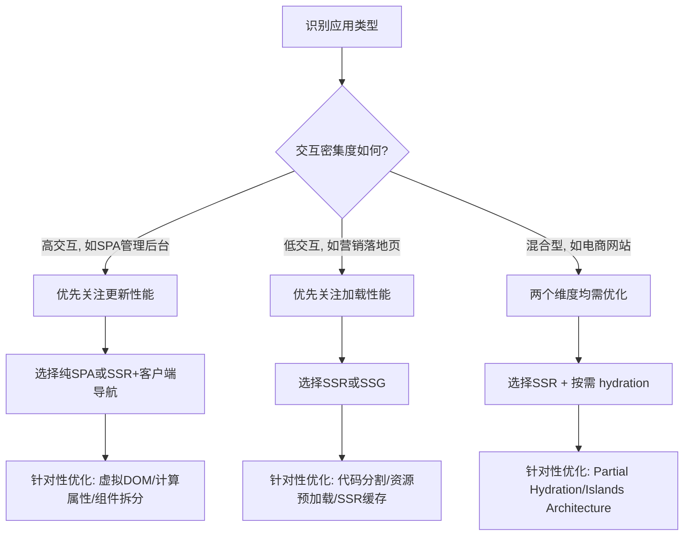
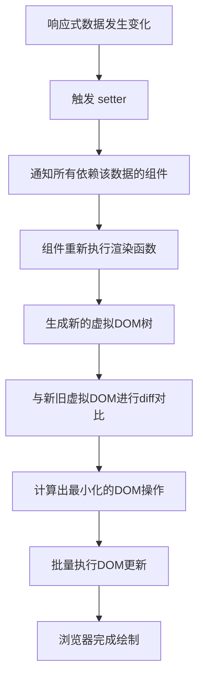
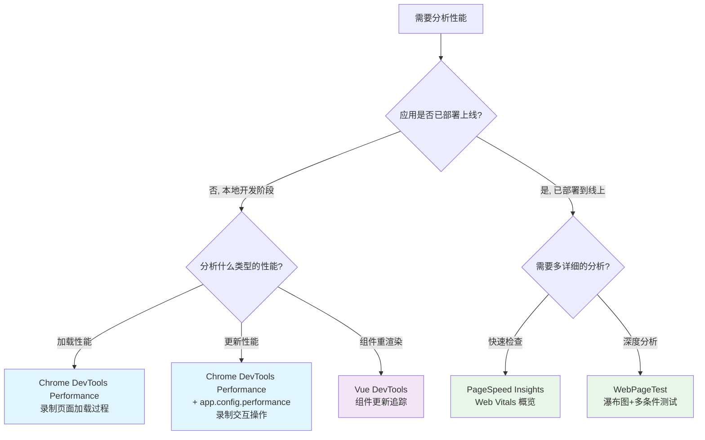

扫描[二维码](https://api2.cmdragon.cn/upload/cmder/20250304_012821924.jpg)关注或者微信搜一搜：`编程智域 前端至全栈交流与成长`

[发现1000+提升效率与开发的AI工具和实用程序](https://tools.cmdragon.cn/zh/apps?category=ai_chat)：https://tools.cmdragon.cn/

## 一、性能优化的双维度认知：页面加载性能与更新性能

Vue 3 本身在绝大多数场景下的性能表现已经相当出色——虚拟 DOM 的重写、编译期的静态提升、更高效的响应式系统……这些底层改进让开发者不用刻意优化也能收获不错的性能。但现实总是比理想复杂，当你的应用越来越大、交互越来越密集、用户对"快"的期待越来越高时，针对性地做一些微调就变得必不可少了。

Vue 官方文档把性能优化拆成了两个主要维度，这个分类非常关键，因为很多时候你在优化其中一个维度时，反而会拖累另一个维度——就像跷跷板一样，这边上去了那边就下来了。咱们先把这个双维度框架搞清楚，后面所有的优化技巧才能有的放矢。

### 页面加载性能

页面加载性能，说白了就是用户第一次打开你的应用时，从白屏到看到内容、再到页面变得可以交互，这整个过程的快慢程度。官方用了一个很准确的说法：**"应用展示内容与达到可交互状态的速度"**。

衡量这个维度的主要工具是 Google 提出的 **Web Vitals** 指标体系，其中最核心的两个是：

- **LCP（Largest Contentful Paint）**：最大内容绘制时间，衡量的是页面上最大的那块内容（通常是一张大图或一段大段文字）渲染出来的时间
- **INP（Interaction to Next Paint）**：交互至下一次绘制的时间，衡量的是用户第一次和页面交互后，页面给出视觉反馈的延迟

打个比方，页面加载性能就像**"店铺开门迎客的速度"**——顾客（用户）走到店门口，店门多快打开、店内陈设多快布置好、服务员多快能招呼上，这些就是加载性能关注的事。

### 更新性能

更新性能关注的是另一个阶段：应用已经加载完毕、用户开始和它交互之后，应用响应这些交互的速度。比如：

- 在搜索框里敲字，搜索结果多快出来
- 点击切换标签页，内容多快切换
- 在表单里修改选项，联动信息多快刷新
- SPA 中页面导航，新页面多快渲染

用同样的比喻来说，更新性能就像**"顾客点单后上菜的速度"**——顾客已经入座、菜单已经拿到手，关键是点了菜之后厨房多快能把菜端上来。

### 两个维度的权衡关系

这两个维度之间往往存在权衡。举个很典型的例子：

- **纯 SPA 架构**：所有页面逻辑打包在一个 JS bundle 里，用户首次访问需要下载整个 bundle——加载性能较差；但一旦加载完成，后续的页面切换都在客户端完成，不需要再请求服务器——更新性能很好。
- **SSR 架构**：服务器直接返回渲染好的 HTML，用户打开页面就能看到内容——加载性能较好；但每次页面切换可能需要向服务器发起新的请求，或者 hydration 过程带来额外开销——更新性能可能不如纯 SPA。

所以，优化的第一步不是急着去改代码，而是**先搞清楚你的应用属于什么类型，适合什么架构**。一个以内容展示为主的营销落地页和一个交互密集的数据分析平台，它们对这两个维度的侧重完全不同，优化策略自然也不一样。

下面这张流程图梳理了从"识别应用类型"到"选择优化策略"的完整思考路径：



## 二、页面加载性能的核心指标：LCP 与 INP

既然页面加载性能是我们要优化的第一个维度，那就得有一把尺子来量它。Google 在 2020 年推出了 **Web Vitals** 计划，为网页性能定义了一套统一的衡量标准。其中对页面加载性能最关键的两个指标就是 LCP 和 INP。

### LCP：最大内容绘制时间

LCP 衡量的是页面上**最大的可见内容元素**渲染到屏幕上的时间。什么算"最大内容"？通常是：

- `` 图片元素
- `<video>` 视频元素（取其海报图）
- 包含文字的块级元素（如 `<p>`、`<div>`、`<article>` 等）
- 通过 `url()` 函数加载的背景图片

为什么关注"最大"的那个？因为用户感知页面"主要内容已经出来了"，往往就是看到这块最大的内容渲染完成的时刻。那些边边角角的小元素先出来后出来，用户的体感差异不大，但主体内容迟迟不出来，用户就会觉得"这页面好慢"。

LCP 的理想值和评级标准：

| 评级 | LCP 时间 |
|------|----------|
| 好 | ≤ 2.5 秒 |
| 需要改进 | 2.5 秒 ~ 4.0 秒 |
| 差 | > 4.0 秒 |

### INP：交互至下一次绘制时间

INP 是 2024 年正式取代 FID（First Input Delay）成为 Core Web Vitals 的一员。它衡量的是用户与页面交互后，到页面给出视觉反馈的延迟时间。

和 FID 只衡量"第一次交互的延迟"不同，INP 会观察页面生命周期内**所有**用户交互的延迟，取其中最差的那个（严格来说是第 98 百分位），所以它能更全面地反映页面的交互响应性。

INP 的理想值和评级标准：

| 评级 | INP 时间 |
|------|----------|
| 好 | ≤ 200 毫秒 |
| 需要改进 | 200 毫秒 ~ 500 毫秒 |
| 差 | > 500 毫秒 |

### 辅助指标一览

除了 LCP 和 INP 这两个核心指标，还有几个辅助指标也值得关注：

| 指标 | 全称 | 衡量维度 | 理想值 | 说明 |
|------|------|----------|--------|------|
| **LCP** | Largest Contentful Paint | 加载 | ≤ 2.5s | 最大内容绘制时间，最核心的加载指标 |
| **INP** | Interaction to Next Paint | 交互响应 | ≤ 200ms | 交互至下一次绘制时间，最核心的交互指标 |
| **FCP** | First Contentful Paint | 加载 | ≤ 1.8s | 首次内容绘制，页面从白屏到出现任何内容的时刻 |
| **TTFB** | Time to First Byte | 网络 | ≤ 800ms | 首字节时间，浏览器发出请求到收到第一个字节的耗时 |
| **CLS** | Cumulative Layout Shift | 视觉稳定性 | ≤ 0.1 | 累积布局偏移，衡量页面元素意外移位的程度 |

这几个指标之间的关系可以用一个时间线来理解：


可以看到，TTFB → FCP → LCP 是一条加载链路上的三个节点，越靠前的指标越受网络和服务器影响，越靠后的指标越受前端资源体积和渲染逻辑影响。而 INP 则是在页面加载完成之后、用户开始交互阶段的核心指标。

## 三、更新性能的衡量方式

页面加载性能有 Web Vitals 这套标准化指标，那更新性能呢？它没有一个像 LCP 那样公认的单一数字，但我们可以通过理解 Vue 的更新机制和借助浏览器工具来准确衡量。

### Vue 组件更新的触发机制

Vue 3 的组件更新遵循这样一个流程：



把这个流程翻译成大白话就是：数据变了 → Vue 知道了 → 重新跑一遍渲染逻辑 → 拿新的虚拟 DOM 和旧的做对比 → 只改那些真的变了的地方 → 浏览器画出来。

这里面每一步都可能成为性能瓶颈：

- **响应式追踪开销**：一个组件依赖的响应式数据越多，追踪变化的通知成本就越高
- **渲染函数执行开销**：模板越复杂，生成的虚拟 DOM 节点越多，渲染函数执行越慢
- **Diff 计算开销**：组件树越大，新旧虚拟 DOM 的 diff 计算量越大
- **DOM 操作开销**：虽然 Vue 会最小化 DOM 操作，但某些操作（如改变大量列表项）本身就是昂贵的

### 如何衡量更新性能

最直接的方式就是用 **Chrome DevTools 的 Performance 面板**。操作步骤如下：

1. 打开 Chrome DevTools（F12），切换到 Performance 面板
2. 点击录制按钮（圆点图标）
3. 在页面上执行你想要测量的交互操作（比如输入搜索词、切换标签页等）
4. 点击停止录制
5. 在时间线中找到对应的交互区间，查看 Main 线程上的任务分布

如果开启了 `app.config.performance = true`（后面会详细讲），你还能在时间线上看到 Vue 特有的性能标记，比如组件的 `render` 和 `patch` 时间，这样就能精确知道哪个组件的更新耗时最长。

### 影响更新性能的关键因素

在实际开发中，以下几个因素最容易拖慢更新性能：

1. **组件树规模**：一个巨型组件包含了几百行模板，它的渲染函数执行和 diff 计算都会很慢。拆成更小的组件可以利用 Vue 的组件级更新机制——只有 props 真正变化的子组件才会重新渲染。

2. **Props 变化频率**：如果父组件频繁更新，而子组件的 props 每次都跟着变（即使值实际上没变），子组件就会不必要地重新渲染。这时候需要用到 `v-memo` 或手动比较 props 来避免无意义的更新。

3. **计算属性依赖复杂度**：计算属性本身的缓存机制是好事，但如果一个计算属性依赖了大量响应式数据，任何一个依赖变化都会触发重新计算。如果这个计算属性被模板使用，就会触发组件重新渲染。

4. **列表渲染的 key 策略**：`v-for` 不用 `key` 或用 `index` 当 `key` 会导致 diff 算法无法高效复用节点，产生大量不必要的 DOM 操作。

5. **深层响应式数据**：`reactive` 创建的深层嵌套对象，Vue 需要递归地将其所有嵌套属性都变成响应式的。如果数据层级很深或包含大量不需要响应式的属性，这会带来额外的开销。

## 四、性能分析工具详解

知道了该优化什么，还得知道怎么找到问题。下面介绍几款 Vue 3 性能分析中最常用的工具。

### Chrome DevTools Performance 面板

Chrome DevTools 的 Performance 面板是前端性能分析的"瑞士军刀"，几乎所有性能问题都能用它来定位。

**基本使用步骤：**

1. 打开 DevTools → 切换到 Performance 标签
2. 勾选 "Screenshots" 和 "Web Vitals" 选项（如果有的话）
3. 点击录制按钮开始录制
4. 执行你要分析的操作（比如刷新页面、点击按钮、输入文字等）
5. 点击停止按钮，等待分析结果生成
6. 在火焰图中查看 Main 线程的任务分布

**开启 Vue 特有性能标记**

Chrome DevTools 默认只能看到浏览器级别的性能数据（脚本执行、布局计算、绘制等）。但 Vue 3 提供了一个配置项 `app.config.performance`，开启后会在 Performance 面板中额外记录 Vue 组件的 `init`（初始化）、`render`（渲染）、`patch`（补丁）等时间标记，让你能精确知道每个 Vue 组件的耗时。

```js
// main.js
import { createApp } from 'vue'
import App from './App.vue'

const app = createApp(App)

// 开发环境下开启 Vue 性能标记
// 这个选项只在开发模式下有效，生产构建会自动忽略
if (import.meta.env.DEV) {
  app.config.performance = true
}

app.mount('#app')
```

这里有几个要点需要说明：

- `import.meta.env.DEV` 是 Vite 提供的环境变量，只在开发模式下为 `true`，生产构建时为 `false`。我们只在开发环境开启，因为性能标记本身也有开销，不应该带到线上去。
- 开启后，在 Performance 面板中你会看到类似 `component:render`、`component:patch` 这样的 User Timing 标记，可以精确追踪每个组件的渲染和补丁耗时。
- 如果你用的是 Vue CLI（Webpack），对应的环境变量是 `process.env.NODE_ENV === 'development'`。

### Vue DevTools

Vue DevTools 是 Vue 官方的浏览器扩展，它除了能查看组件树、状态、路由等开发调试信息外，也有性能相关的功能。

**性能分析相关功能：**

- **组件更新追踪**：在"组件"面板中可以看到哪些组件最近发生了更新，用高亮标记出来，帮你快速发现不必要的重渲染
- **渲染时间**：对于开启了 `app.config.performance` 的应用，DevTools 可以展示每个组件的渲染耗时统计
- **事件追踪**：可以看到组件事件的触发链路，帮你理解一次交互到底触发了多少组件更新

安装方式：在 Chrome Web Store 搜索 "Vue.js devtools" 安装即可。注意要安装支持 Vue 3 的版本（6.x 及以上）。

### PageSpeed Insights

PageSpeed Insights 是 Google 提供的线上性能分析工具，你只需要输入一个 URL，它就会从真实的网络环境和设备条件下测量你的页面性能，给出 LCP、INP、CLS 等 Web Vitals 指标的具体数值和优化建议。

**使用地址：** https://pagespeed.web.dev/

它的特点是可以分别提供**实验室数据**（Lab Data，在受控环境下测量的结果）和**现场数据**（Field Data，来自 Chrome 用户体验报告的真实用户数据），后者更接近用户的真实体验。

**适合场景：** 页面已部署到线上，需要了解真实用户的性能体验。

### WebPageTest

WebPageTest 是比 PageSpeed Insights 更详细、更专业的线上性能分析工具。它可以在不同的地理位置、不同的设备类型、不同的网络条件下测试你的页面，并提供极其详细的瀑布图、电影strip（页面加载的逐帧截图）、连接视图等分析数据。

**使用地址：** https://www.webpagetest.org/

**适合场景：** 需要深入分析网络请求顺序、资源加载时机、不同网络条件下的表现等高级场景。

### 性能分析工具选择流程

不同的工具各有侧重，选择合适的工具能让分析事半功倍：



## 五、架构选型与性能的关系

前面说了，优化的第一步是确定应用类型和选择合适的架构。Vue 官方文档在"使用 Vue 的多种方式"一节中列出了几种主要的架构选择，而 Jason Miller（Preact 作者）提出的 **Application Holotypes** 概念也很好地对应了不同类型应用的性能需求。咱们来逐一看看。

### 纯 SPA（Single Page Application）

SPA 的特点是所有页面逻辑都打包在客户端的 JS bundle 里，路由切换完全在客户端完成，不需要向服务器请求新的 HTML。

**性能特征：**
- 加载性能：较差。首次访问需要下载整个 JS bundle 并执行，在此之前页面是白屏状态。bundle 越大，白屏时间越长。
- 更新性能：很好。页面切换和数据更新都在客户端完成，没有网络请求的延迟，响应几乎即时。

**适合场景：** 交互密集型应用，如管理后台、在线编辑器、数据分析平台等。这些应用用户一旦进入就会长时间停留，首屏稍慢可以接受，但交互必须流畅。

### SSR（Server-Side Rendering）

SSR 在服务器端将 Vue 组件渲染成 HTML 字符串返回给浏览器，用户打开页面就能看到内容，然后 JS bundle 加载完成后再进行"hydration"（激活），让静态 HTML 变成可交互的 Vue 应用。

**性能特征：**
- 加载性能：较好。用户能更快看到内容（FCP/LCP 更优），但 TTFB 取决于服务器的渲染速度。
- 更新性能：中等。客户端导航仍然是 SPA 模式（快），但首次加载的 hydration 过程有额外开销；而且每个页面的首次访问需要服务器渲染，服务器负载较大。

**适合场景：** 内容优先型应用，如新闻网站、博客、电商商品详情页等。这些应用需要 SEO，且用户对首屏速度要求高。

### SSG（Static Site Generation）

SSG 在构建时就把所有页面预渲染成静态 HTML 文件，部署时直接放在 CDN 上。用户访问时，CDN 直接返回 HTML，不需要服务器实时渲染。

**性能特征：**
- 加载性能：最好。静态文件可以从最近的 CDN 节点直接返回，TTFB 极低，FCP/LCP 表现极佳。
- 更新性能：视情况而定。如果用 SPA 模式做客户端导航，后续页面切换很快；但如果内容需要频繁更新，每次都要重新构建和部署，实时性较差。

**适合场景：** 内容静态型应用，如文档站、营销落地页、个人博客等。内容不频繁变化，SEO 要求高，对加载速度有极致追求。

### 传统后端 + Vue 增强

这种方式是传统的服务器渲染 HTML 页面，但在局部区域用 Vue 来增强交互性。Vue 不是接管整个页面，而是作为"渐进式增强"嵌入到传统页面中。

**性能特征：**
- 加载性能：较好。主体内容由服务器直接返回 HTML，Vue 只负责局部交互区域，JS bundle 较小。
- 更新性能：视增强区域大小而定。增强区域小则快，增强区域大则接近 SPA。

**适合场景：** 渐进式增强场景，如传统 CMS 系统、需要在前人遗留的多页应用上逐步引入 Vue 的场景。

### 架构性能对比一览

| 架构 | 加载性能 | 更新性能 | SEO 友好度 | 服务器开销 | 适合场景 |
|------|----------|----------|------------|------------|----------|
| **纯 SPA** | ⭐⭐ | ⭐⭐⭐⭐⭐ | ❌ 较差 | 低 | 交互密集型，管理后台 |
| **SSR** | ⭐⭐⭐⭐ | ⭐⭐⭐⭐ | ✅ 好 | 高 | 内容优先型，电商/新闻 |
| **SSG** | ⭐⭐⭐⭐⭐ | ⭐⭐⭐ | ✅ 最好 | 低（CDN） | 内容静态型，文档/博客 |
| **后端+Vue增强** | ⭐⭐⭐⭐ | ⭐⭐⭐ | ✅ 好 | 中 | 渐进式增强，遗留系统 |

选架构这件事没有银弹，关键还是回到你的应用类型。如果你做一个内部管理后台，SEO 不需要、首屏稍慢没关系、交互必须丝滑——那 SPA 就是正解。如果你做一个面向公众的内容站，SEO 是命根子、首屏必须快——那 SSR 或 SSG 才是正途。

## 六、课后 Quiz

### 题目一

Vue 3 的性能优化需要关注哪两个主要维度？它们各自的衡量指标是什么？

**答案解析：**

Vue 3 性能优化的两个主要维度是：

1. **页面加载性能**：衡量应用首次访问时展示内容与达到可交互状态的速度。核心指标是 **LCP**（Largest Contentful Paint，最大内容绘制时间）和 **INP**（Interaction to Next Paint，交互至下次绘制时间）。辅助指标还包括 FCP（首次内容绘制）和 TTFB（首字节时间）。

2. **更新性能**：衡量应用响应用户输入进行更新的速度，比如搜索框输入响应、SPA 页面切换速度等。更新性能没有像 Web Vitals 那样标准化的单一指标，主要通过 Chrome DevTools Performance 面板来测量和分析，关键观察点是组件的 render 时间和 patch 时间。

这两个维度之间存在权衡关系——优化加载性能的措施（如 SSR、SSG）可能会影响更新性能，反之亦然。所以优化前必须先明确应用的类型和对两个维度的侧重。

### 题目二

如何在开发环境开启 Vue 特有的性能标记？这个标记有什么作用？

**答案解析：**

在 Vue 3 中，通过设置 `app.config.performance = true` 来开启 Vue 特有的性能标记。推荐只在开发环境开启，避免性能标记本身的开销影响线上性能：

```js
import { createApp } from 'vue'
import App from './App.vue'

const app = createApp(App)

if (import.meta.env.DEV) {  // Vite 环境变量，只在开发模式为 true
  app.config.performance = true
}

app.mount('#app')
```

开启后，Vue 会在组件的初始化、编译、渲染和补丁等关键阶段插入 User Timing API 标记。这样在 Chrome DevTools 的 Performance 面板中，你就能看到类似 `component:init`、`component:render`、`component:patch` 这样的时间标记，精确知道每个 Vue 组件在各个阶段消耗了多少时间。

这对于定位更新性能的瓶颈特别有用——你可以一眼看出是哪个组件的渲染太慢，而不是在一团脚本执行数据里大海捞针。

注意：这个配置只在开发模式下有效，Vue 的生产构建会自动忽略它，所以不需要担心线上性能受影响。

### 题目三

对于一个以内容展示为主的营销落地页，应该选择哪种架构来获得最佳的页面加载性能？为什么？

**答案解析：**

对于以内容展示为主的营销落地页，应该选择 **SSG（Static Site Generation，静态站点生成）** 架构。

原因如下：

1. **加载性能最优**：SSG 在构建时就把所有页面预渲染成静态 HTML 文件，部署到 CDN 后，用户访问时直接从最近的 CDN 节点返回 HTML，TTFB 极低，LCP 表现极佳。营销落地页对首屏速度的要求非常高（直接影响转化率），SSG 能最大化加载性能。

2. **SEO 友好**：营销落地页依赖搜索引擎流量，预渲染的静态 HTML 对搜索引擎爬虫完全可见，无需额外处理。

3. **内容特征匹配**：营销落地页的内容更新频率低（可能几天甚至几周才改一次），不需要 SSR 那样的实时服务端渲染能力，完全适合 SSG 的"构建时渲染"模式。

4. **服务器开销最低**：纯静态文件托管在 CDN 上，没有服务器渲染的 CPU 开销，成本极低，且天然具备高可用性和抗并发能力。

如果页面有少量交互区域（比如表单提交、动画效果），可以在 SSG 的基础上用 Vue 做 Islands 式的局部 hydration——静态内容保持预渲染，只有交互区域加载 Vue 逻辑，这样既保住了加载性能，又不牺牲必要的交互能力。

## 七、常见报错与解决方案

### 问题一：开启 app.config.performance 后 Chrome DevTools 看不到 Vue 标记

**现象：** 已经在代码中设置了 `app.config.performance = true`，但在 Chrome DevTools 的 Performance 面板录制结果中找不到 `component:render`、`component:patch` 等 Vue 标记。

**原因分析：** 最常见的原因是使用了生产模式的构建产物。Vue 的性能标记只在开发模式下生效，如果你用的是 `npm run build` 后的产物或者 `npm run preview` 来预览，性能标记会被自动移除。

**解决方案：**

1. 确保使用开发模式启动应用：`npm run dev`（Vite）或 `npm run serve`（Vue CLI）
2. 检查代码中环境判断是否正确：Vite 项目用 `import.meta.env.DEV`，Webpack 项目用 `process.env.NODE_ENV === 'development'`
3. 确认 Performance 面板中 "User Timing" 类别没有被过滤掉——在面板底部的筛选区域确认勾选了 "User Timing"

**预防建议：** 在团队中约定：开发调试性能问题时始终使用 `npm run dev`，不要用预览模式。可以在 README 中注明这一点。

### 问题二：Performance 面板录制数据量过大，难以定位问题

**现象：** 在 Performance 面板录制了几秒钟的操作，结果数据量非常大，火焰图密密麻麻，很难找到和 Vue 组件更新相关的性能数据。

**原因分析：** Performance 面板会记录所有线程的所有活动，包括浏览器的内部操作、扩展程序的脚本、定时器回调等，数据量天然就很大。如果录制时间过长，数据会更难以阅读。

**解决方案：**

1. **缩短录制时间**：只录制你关心的那一段操作。先点击录制 → 执行一次特定操作 → 立即停止。3~5 秒的录制通常就够了。
2. **使用 User Timing API 自定义标记**：在关键代码前后手动插入 `performance.mark()` 和 `performance.measure()`，这样在 Performance 面板中可以快速定位到你关心的区间：

```js
// 在触发更新前打标记
performance.mark('update-start')

// ... 执行操作 ...

// 在更新完成后打标记并测量
performance.mark('update-end')
performance.measure('my-update', 'update-start', 'update-end')
```

3. **利用 Chrome DevTools 的筛选功能**：在 Performance 面板底部，可以按类别筛选（只看 User Timing 或只看 Script），也可以用 Ctrl+F 搜索特定标记名称。

**预防建议：** 养成"最小化录制范围"的习惯。不要录制一大段随意操作，而是先想清楚要测什么，再针对性地录制。

### 问题三：Vue DevTools 无法连接到应用

**现象：** 安装了 Vue DevTools 浏览器扩展，但打开 DevTools 时看不到 Vue 面板，或者面板显示 "Vue.js not detected"。

**原因分析：** 常见原因包括：Vue DevTools 版本与 Vue 版本不兼容、应用使用了生产模式的构建、扩展权限问题等。

**解决方案：**

1. **确认 Vue DevTools 版本**：Vue 3 需要使用 Vue DevTools 6.x 及以上版本。如果你之前装的是 5.x（Vue 2 专用），需要卸载后重新安装新版本。
2. **确认使用开发模式**：Vue DevTools 只能检测到开发模式下的 Vue 应用。确保用 `npm run dev` 启动。
3. **检查扩展是否启用**：在 Chrome 的扩展管理页面（chrome://extensions/），确认 Vue DevTools 扩展已启用，并且对 `file://` 协议有访问权限（如果你是本地打开 HTML 文件的话）。
4. **硬刷新页面**：有时候 DevTools 需要页面完全重新加载才能检测到 Vue 实例。按 Ctrl+Shift+R 强制刷新。
5. **检查多 Vue 实例情况**：如果页面中有多个 Vue 应用实例（比如一个页面里同时挂载了多个 `createApp`），DevTools 可能只连接到第一个。可以尝试刷新页面后再打开。

**预防建议：** 在项目初始化时就安装好正确版本的 Vue DevTools，并写入团队的开发环境配置文档中。推荐在 VS Code 中也安装 Volar（现在叫 Vue - Official）扩展，它和 Vue DevTools 配合使用效果更好。

## 参考链接

参考链接：https://cn.vuejs.org/guide/best-practices/performance.html

余下文章内容请点击跳转至 个人博客页面 或者 扫描[二维码](https://api2.cmdragon.cn/upload/cmder/20250304_012821924.jpg)关注或者微信搜一搜：`编程智域 前端至全栈交流与成长`，阅读完整的文章：[Vue 3性能优化一：页面加载与更新性能的双维度认知体系](https://blog.cmdragon.cn/posts/a1b2c3d4e5f6g7h8i9j0k1l2m3n4o5p6/)
