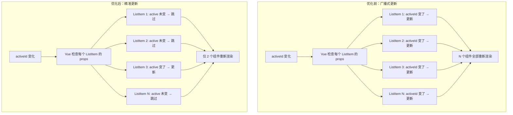
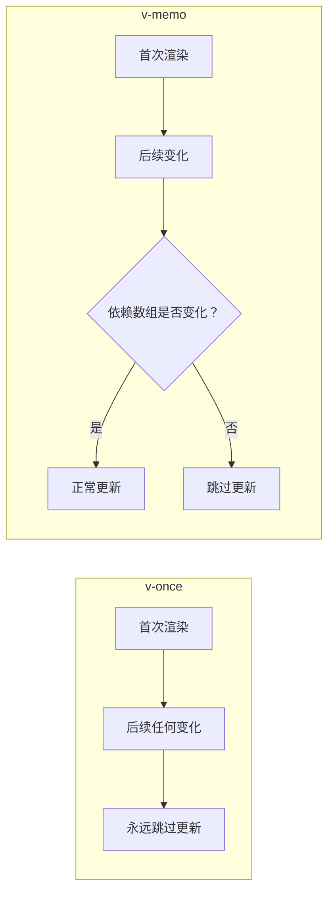
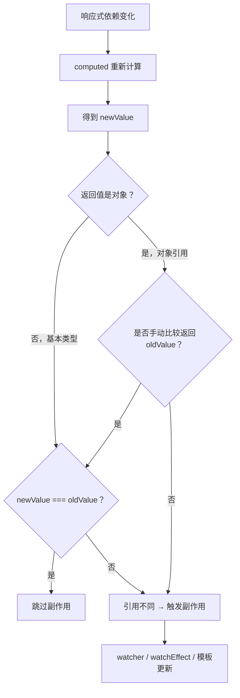

扫描[二维码](https://api2.cmdragon.cn/upload/cmder/20250304_012821924.jpg)关注或者微信搜一搜：`编程智域 前端至全栈交流与成长`

[发现1000+提升效率与开发的AI工具和实用程序](https://tools.cmdragon.cn/zh/apps?category=ai_chat)：https://tools.cmdragon.cn/

聊完了页面加载性能的优化，我们该把目光转向另一个同样重要的维度——**更新性能**。你有没有遇到过这样的情况：页面上明明只改了一个小小的状态，结果整个列表"刷"地全重渲染了一遍？或者在滚动、输入这些高频操作时，界面一卡一卡的，体验极差？这些问题的根源，往往不是你的数据量大，而是**该更新的没更新，不该更新的也更新了**。

Vue 3在更新性能优化上给了我们几件趁手的工具：Props稳定性、v-once指令、v-memo指令和计算属性稳定性。这四个策略各有侧重，但核心目标只有一个——**让组件只在真正需要更新时才更新，把不必要的渲染开销砍掉**。

接下来我们就一个一个来聊，每个策略到底是怎么回事，什么时候该用，用的时候有什么坑要避。

## 1.1 Props稳定性：减少不必要的子组件更新

先说一个Vue更新机制的基础事实：**子组件只在至少一个传入的prop发生变化时才会更新**。这话听着像是废话，但它的含义比你想的要深。

什么意思呢？Vue在更新一个子组件之前，会逐个比较它收到的每个prop的新旧值。如果所有prop的值都没变，Vue就跳过这个子组件的更新。这就像是快递员送包裹——如果收件人这一趟没有任何新包裹，快递员就不会跑这一趟。

问题在于，prop的"变化"取决于值的比较方式。对于基本类型（数字、字符串、布尔值），比较是严格的`===`，很靠谱。但对于对象和数组，比较的是引用——即使对象内容一模一样，只要是新创建的对象，引用就不同，Vue就会认为prop变了。

### 经典案例：ListItem组件

来看一个几乎每个列表页面都会遇到的场景。我们有一个列表，每个列表项是一个`ListItem`组件，当前选中项高亮显示：

```vue
<!-- ❌ 问题写法：activeId变化时，所有ListItem都更新 -->
<ListItem
  v-for="item in list"
  :id="item.id"
  :active-id="activeId"
/>
```

这段代码的问题在哪？当用户点击切换选中项时，`activeId`变了，Vue会对每个`ListItem`检查props变化。每个`ListItem`都接收了`activeId`这个prop，而`activeId`的值确实变了——所以**所有ListItem都会更新**，哪怕其中绝大多数的选中状态根本没变。

在一百项的列表里，你只切换了一项的选中状态，却让一百个组件都重新渲染。这就好比广播通知"现在选中了第5号"，全楼的人都跑出来看一眼，然后99个人发现跟自己没关系又回去了——白白折腾。

### 优化方案：把比较逻辑上移到父组件

```vue
<!-- ✅ 优化写法：只有active状态改变的项才更新 -->
<ListItem
  v-for="item in list"
  :id="item.id"
  :active="item.id === activeId"
/>
```

优化思路很简单：不在子组件内部判断"我是不是选中了"，而是在父组件就计算好每个项的`active`布尔值，直接传给子组件。

当`activeId`从3变成5时：
- 第3项：`active`从`true`变成`false`→ 需要更新
- 第5项：`active`从`false`变成`true`→ 需要更新
- 其他项：`active`仍然是`false`→ **跳过更新**

这一下就从N次更新缩减到了最多2次更新。Props稳定性就像"精准投递"——只把变化的信息送到需要的收件人手中，而不是向所有人广播。

### 完整代码示例

```vue
<!-- ListItem.vue -->
<script setup>
// 子组件只接收最终需要的值，不关心比较逻辑
defineProps({
  id: Number,
  active: Boolean  // 优化后：直接传入布尔值
})
</script>

<template>
  <div :class="{ 'list-item': true, 'active': active }">
    Item {{ id }}
  </div>
</template>

<style scoped>
.list-item {
  padding: 8px 16px;
  border-bottom: 1px solid #eee;
  cursor: pointer;
  transition: background-color 0.2s;
}
.list-item.active {
  background-color: #e6f7ff;
  font-weight: bold;
}
</style>
```

```vue
<!-- ListContainer.vue -->
<script setup>
import { ref } from 'vue'
import ListItem from './ListItem.vue'

const activeId = ref(1)  // 当前选中项的id
const list = ref([
  { id: 1, name: '项目一' },
  { id: 2, name: '项目二' },
  { id: 3, name: '项目三' },
  { id: 4, name: '项目四' },
  { id: 5, name: '项目五' },
])

// 切换选中项
function setActive(id) {
  activeId.value = id
}
</script>

<template>
  <div class="list-container">
    <h3>列表选择器</h3>
    <!-- ✅ 优化：让activeId的比较逻辑在父组件完成 -->
    <ListItem
      v-for="item in list"
      :key="item.id"
      :id="item.id"
      :active="item.id === activeId"
    />
  </div>
</template>

<style scoped>
.list-container {
  max-width: 300px;
  border: 1px solid #ddd;
  border-radius: 4px;
}
</style>
```

### 优化前后更新流程对比

下面这张流程图清楚地展示了优化前后的差异：



### Props稳定性的其他要点

除了布尔值的场景，还有几个值得注意的点：

- **对象props要小心**：如果传入的是对象或数组，即使内容没变，只要引用变了（比如每次渲染都创建了新对象），子组件就会更新。解决办法是用`computed`缓存，或者确保传入的是同一个引用。
- **函数props同理**：如果传入的是内联箭头函数，每次父组件更新都会创建新的函数引用，导致子组件也跟着更新。可以改用`defineEmits`或在`<script setup>`顶层定义函数。

## 1.2 v-once：跳过不需要更新的子树

有时候你的组件里确实有一部分内容，渲染完之后就不会再变了——比如页脚的版权信息、文章的标题头、一次性的提示文案等等。Vue 3给这类场景准备了一个轻量指令：**v-once**。

### 基本用法

```vue
<template>
  <!-- v-once标记的子树在首次渲染后不再更新 -->
  <div v-once>
    <h1>{{ title }}</h1>
    <p>这段内容只会渲染一次，后续title变化不会触发更新</p>
  </div>

  <!-- 常见场景：只读的静态内容 -->
  <footer v-once>
    <p>© 2024 我的网站</p>
  </footer>
</template>
```

`v-once`的工作方式很直接：被它标记的元素及其所有子节点，在首次渲染完成后，就会被Vue的更新机制"忘掉"。后续任何响应式数据变化，Vue都不会再来检查这片子树。

打个比方，v-once就像是在门上贴了个"免打扰"的牌子——Vue看到这个牌子，就直接跳过这扇门，不再敲门问"需不需要更新"。

### 与v-for结合使用

```vue
<template>
  <!-- 每个列表项只渲染一次 -->
  <div
    v-for="item in items"
    :key="item.id"
    v-once
  >
    {{ item.name }}
  </div>
</template>
```

当`v-once`和`v-for`一起用时，效果是**每个循环项都只渲染一次**。如果后续`items`数组的数据变了（比如某项的`name`被修改），对应的DOM不会更新。这在某些"渲染完即固化"的场景里是有用的，但更多时候你可能需要的是下一节要讲的`v-memo`。

### 适用场景

`v-once`适合的场景其实不多，但它确实能精准解决一些问题：

- **纯静态内容**：版权信息、网站备案号、固定的装饰文案
- **初始值展示**：某些数据只需要展示首次值，后续不关心变化（比如"初始评分：4.5"）
- **大型静态子树**：一大片纯文本或纯静态的HTML结构，标记`v-once`后Vue完全不会去diff它

### 注意事项

v-once的副作用很明显——**它会让整个子树彻底跳过更新**。所以：

1. 别把需要响应式的内容放进`v-once`里，否则数据变了界面不跟着变，你debug到怀疑人生都找不到原因。
2. 如果内容"大部分时候不变，但偶尔要变"，那`v-once`太粗暴了，应该用`v-memo`。
3. `v-once`对组件也生效——被标记的组件在首次渲染后，其`props`变化也不会触发更新。

## 1.3 v-memo：有条件地跳过子树更新

`v-once`太"一刀切"了——贴上就再也不更新。但实际开发中更常见的需求是：**大部分时候不更新，但某些依赖变了还是要更新**。这就是`v-memo`的舞台。

### 基本语法

`v-memo`接收一个数组，数组里的每个元素是一个依赖值。Vue会记住上一次这个数组的值，在下一次更新时逐项比较。如果数组中每个值都和上次一样，就跳过这片子树的更新；只要有一个不同，就正常更新。

```vue
<template>
  <!-- 只有 item.id === selectedId 的结果变化时才更新 -->
  <div v-memo="[item.id === selectedId]">
    <span>{{ item.name }}</span>
    <span :class="{ active: item.id === selectedId }">选中</span>
  </div>
</template>
```

这段代码的效果是：当`selectedId`变化时，只有选中状态发生切换的那些项才会更新，其余项直接跳过。和前面Props稳定性的思路一致，但`v-memo`是在模板层面实现的，不需要改子组件的props设计。

### v-memo与v-for结合的经典场景

这是`v-memo`最实用的场景——在大型列表中，只有特定字段变化时才重新渲染对应项：

```vue
<template>
  <!-- 只有value变化时才重新渲染列表项 -->
  <div
    v-for="item in list"
    :key="item.id"
    v-memo="[item.value]"
  >
    <span>{{ item.name }}: {{ item.value }}</span>
  </div>
</template>
```

当`list`中的某一项的`value`被修改时，只有那一项会重新渲染。如果修改的是`name`或其他字段，但`value`没变，该项也不会更新——因为你告诉Vue"只关心`value`"。

这就像给每件包裹贴上了"只在意这个属性"的标签，快递员只会在这个属性变化时才送货上门。

### v-memo传入空数组的特殊用法

```vue
<template>
  <!-- 空数组：没有任何依赖，等同于v-once -->
  <div v-memo="[]">
    永远不会更新
  </div>
</template>
```

`v-memo="[]"`意味着依赖数组永远为空，比较结果永远是"没变化"，所以等同于`v-once`。你可以把它理解为`v-memo`的退化形式。

### 完整实战示例：大数据量表格中的v-memo优化

下面这个例子模拟了一个数据表格，每行有一个可编辑的数值列。我们只希望在`score`变化时才更新对应行，`name`等其他列的变化可以忽略（假设name很少变）：

```vue
<!-- ScoreTable.vue -->
<script setup>
import { ref, reactive } from 'vue'

// 模拟100行数据
const tableData = ref(
  Array.from({ length: 100 }, (_, i) => ({
    id: i + 1,
    name: `学生 ${i + 1}`,
    score: Math.floor(Math.random() * 100),
    remark: '正常'
  }))
)

// 只更新某一行的score
function updateScore(id, delta) {
  const row = tableData.value.find(item => item.id === id)
  if (row) {
    row.score = Math.max(0, Math.min(100, row.score + delta))
  }
}

// 批量更新所有score（模拟批量操作）
function batchUpdateScores() {
  tableData.value.forEach(item => {
    item.score = Math.floor(Math.random() * 100)
  })
}
</script>

<template>
  <div class="score-table">
    <h3>成绩管理表</h3>
    <button @click="batchUpdateScores">随机更新所有成绩</button>

    <table>
      <thead>
        <tr>
          <th>ID</th>
          <th>姓名</th>
          <th>成绩</th>
          <th>操作</th>
        </tr>
      </thead>
      <tbody>
        <!--
          v-memo="[item.score]"
          只有score变化时才重新渲染这一行
          name、remark等字段的变化不会触发该行更新
        -->
        <tr
          v-for="item in tableData"
          :key="item.id"
          v-memo="[item.score]"
        >
          <td>{{ item.id }}</td>
          <td>{{ item.name }}</td>
          <td :class="{ 'high-score': item.score >= 90, 'low-score': item.score < 60 }">
            {{ item.score }}
          </td>
          <td>
            <button @click="updateScore(item.id, 5)">+5</button>
            <button @click="updateScore(item.id, -5)">-5</button>
          </td>
        </tr>
      </tbody>
    </table>
  </div>
</template>

<style scoped>
.score-table { padding: 16px; }
.high-score { color: #52c41a; font-weight: bold; }
.low-score { color: #ff4d4f; }
</style>
```

在这个例子中，点击"+5"或"-5"时，`score`变了，只有那一行会重新渲染。但如果你修改了`name`，对应行不会更新——因为`v-memo`的依赖数组里只有`[item.score]`，name不在监控范围内。

### v-memo与v-once的对比



简单来说：`v-once`是"永远不更新"，`v-memo`是"看着情况更新"。能用`v-memo`解决的场景，尽量不要用`v-once`，因为前者更灵活、更安全。

## 1.4 计算属性稳定性：减少非必要副作用触发

前面三节聊的都是模板层面的更新优化，这一节我们进入逻辑层面——计算属性（computed）的稳定性。

从Vue 3.4开始，计算属性有了一个重要的行为改进：**计算属性仅在其计算值较前一个值发生更改时才会触发副作用**。换句话说，如果computed重新计算了，但结果和上次一样，它就不会通知依赖它的watcher和watchEffect。

### 基本场景

```js
const count = ref(0)
const isEven = computed(() => count.value % 2 === 0)

watchEffect(() => console.log(isEven.value))
// 初始打印：true

count.value = 1  // isEven变为false → 触发watchEffect，打印false
count.value = 2  // isEven变为true → 触发watchEffect，打印true
count.value = 4  // isEven仍为true → 不触发watchEffect！
```

`count`从2变到4，`isEven`重新计算了，但结果还是`true`，和上次一样。在Vue 3.4之前，这种情况下watchEffect也会被触发（因为computed的依赖`count`确实变了）。但3.4之后，Vue多做了一步比较：**新值和旧值一样，就不通知下游**。

这对性能来说是好消息——如果computed的消费者是一个组件的模板，那组件就少了一次不必要的重新渲染。

### 计算属性返回对象的问题

但这个"稳定性"机制有一个天然的盲区：**当computed返回的是对象时，每次计算都创建新对象，新旧值永远不相等**。

```js
// ❌ 问题：每次计算都创建新对象，新旧值始终不同
const computedObj = computed(() => {
  return {
    isEven: count.value % 2 === 0
  }
})

watchEffect(() => console.log(computedObj.value.isEven))
// count.value = 2 → isEven为true，打印true
// count.value = 4 → isEven仍为true，但watchEffect还是触发了！
```

为什么？因为`{ isEven: true }`和`{ isEven: true }`是两个不同的对象，`{} === {}`的结果是`false`。Vue比较新旧值时发现"变了"，就通知下游，尽管逻辑上没有任何有意义的改变。

### 解决方案：手动比较并返回旧值

Vue 3.4的computed支持一个`oldValue`参数，让你在计算函数里拿到上一次的返回值。你可以手动比较新旧值，如果内容没变，就返回旧值——这样Vue的引用比较就能识别"没变化"了。

```js
// ✅ 解决：手动比较新旧值，无变化时返回旧值
const computedObj = computed((oldValue) => {
  const newValue = {
    isEven: count.value % 2 === 0
  }

  // 如果oldValue存在，且isEven属性没变，就复用旧对象
  if (oldValue && oldValue.isEven === newValue.isEven) {
    return oldValue  // 返回旧引用，Vue判断为"未变化"
  }

  return newValue  // 有变化，返回新对象
})

watchEffect(() => console.log(computedObj.value.isEven))
// count.value = 2 → 打印true
// count.value = 4 → isEven仍为true，返回oldValue → 不触发watchEffect
// count.value = 3 → isEven变为false，返回newValue → 触发watchEffect
```

### ⚠️ 重要提示：先完整计算，再比较返回

这一点非常关键：**始终在比较和返回旧值之前，执行完整的计算逻辑**。

```js
// ❌ 错误写法：提前返回导致依赖收集不完整
const badComputed = computed((oldValue) => {
  // 如果提前返回oldValue，count.value的读取不会执行
  // Vue就无法收集到count这个依赖！
  if (oldValue && oldValue.isEven === (count.value % 2 === 0)) {
    return oldValue
  }
  return { isEven: count.value % 2 === 0 }
})

// ✅ 正确写法：先计算，再比较
const goodComputed = computed((oldValue) => {
  // 先完整执行计算，确保所有响应式依赖都被读取
  const newValue = {
    isEven: count.value % 2 === 0
  }
  // 然后再比较和决定返回值
  if (oldValue && oldValue.isEven === newValue.isEven) {
    return oldValue
  }
  return newValue
})
```

如果你提前返回了旧值，导致某些响应式数据没有被读取，Vue就收集不到对应的依赖。后续那个数据变了，computed不会重新计算——因为它"不知道"自己依赖那个数据。

这就像是你跳过了体检的某几项检查，然后告诉医生"和上次一样没问题"——但如果你没检查，怎么知道没问题呢？

### 计算属性稳定性判断流程



## 1.5 课后Quiz

**问题一：在ListItem列表中，为什么将activeId的比较逻辑移入父组件能优化更新性能？**

<details>
<summary>点击查看答案</summary>

当子组件直接接收`activeId`时，只要`activeId`变化，所有子组件的该prop都变了，Vue无法跳过任何一个子组件的更新。而将比较逻辑移入父组件后，子组件接收的是布尔值`active`。当`activeId`变化时，只有选中状态发生切换的那一两个项的`active`布尔值会变（一个从true变false，一个从false变true），其余项的`active`保持不变，Vue就会跳过它们的更新。核心原理是：**布尔值的比较代价极低且结果稳定，而原始值的传播范围太广**。

</details>

**问题二：v-once和v-memo的核心区别是什么？各自适合什么场景？**

<details>
<summary>点击查看答案</summary>

核心区别：`v-once`无条件跳过后续所有更新，而`v-memo`根据依赖数组有条件地跳过更新。`v-memo="[]"`等同于`v-once`。

- **v-once适合**：纯静态内容（版权信息、固定文案）、渲染后永远不变的数据展示。场景非常有限。
- **v-memo适合**：大部分时候不变但偶尔要更新的内容，特别是大型列表中只有个别项的特定字段会变化时。这是更常用的优化手段。

选择原则：如果能用`v-memo`表达你的意图，就不要用`v-once`，因为前者更灵活且不容易出错。

</details>

**问题三：当计算属性返回一个新对象时，为什么计算属性稳定性会失效？如何通过手动比较解决？**

<details>
<summary>点击查看答案</summary>

失效原因：每次computed重新计算时都会创建一个新对象，即使内容完全相同，两个对象的引用也不同（`{} !== {}`）。Vue通过引用比较判断"值是否变化"，所以永远得到"变了"的结论，从而触发下游副作用。

解决方案：利用computed的`oldValue`参数，在计算函数中先完整执行计算得到`newValue`，然后手动比较新旧对象的关键属性。如果所有属性都相同，返回`oldValue`（旧引用），Vue的引用比较就能正确识别"未变化"，跳过副作用触发。关键是**必须先完整计算再比较**，确保每次运行都能收集到相同的响应式依赖。

</details>

## 1.6 常见报错与解决方案

### 报错一：v-memo依赖数组中使用了响应式数据但未生效

**现象**：给`v-memo`加了依赖数组，但组件更新行为没有变化，该跳过的没跳过。

**原因**：依赖数组写成了字符串而不是JavaScript表达式，或者忘记在`<script setup>`中声明对应的响应式变量。

```vue
<!-- ❌ 错误：字符串不会被求值 -->
<div v-memo="['item.value']">

<!-- ✅ 正确：JavaScript表达式 -->
<div v-memo="[item.value]">
```

**解决**：确保`v-memo`的数组中是有效的JavaScript表达式，能访问到当前作用域的响应式数据。同时注意`v-memo`的值是在模板编译时处理的，不要试图传入函数调用等复杂逻辑（简单的三元表达式是可以的）。

### 报错二：v-once导致动态数据不更新

**现象**：标记了`v-once`的区域里，响应式数据变化后界面没有更新。

**原因**：误将需要响应式更新的内容放进了`v-once`标记的子树中。`v-once`会让整个子树在首次渲染后跳过所有更新，不管数据怎么变。

**解决**：检查`v-once`标记范围内的所有内容，确认没有需要响应式更新的数据。如果内容"大部分时候不变但偶尔要变"，改用`v-memo`。记住一个判断原则：**只要你对"这片内容会不会变"有哪怕一丝犹豫，就不要用v-once**。

### 报错三：计算属性返回对象时watchEffect频繁触发

**现象**：computed返回的是对象，即使内容没变，watchEffect或watch也在不断触发。

**原因**：每次computed重新计算都创建了新对象，引用不同，Vue的稳定性比较失效。

**解决**：使用computed的`oldValue`参数进行手动比较。注意一定要**先完整计算newValue，再与oldValue比较**，保证依赖收集的完整性。如果对象属性很多，可以考虑只比较有意义的属性，或者使用浅比较工具函数。

### 报错四：Props传递对象引用导致子组件频繁更新

**现象**：父组件传入的prop是对象，子组件在不该更新时也频繁重新渲染。

**原因**：父组件每次渲染都创建了新的对象（比如内联对象字面量`:config="{ theme: 'dark' }"`），引用不同，Vue认为prop变了。

**解决**：

```vue
<!-- ❌ 每次渲染都创建新对象 -->
<ChildComponent :config="{ theme: theme, size: 'medium' }" />

<!-- ✅ 用computed缓存，只有内容变了才返回新对象 -->
<script setup>
import { computed } from 'vue'
const theme = ref('dark')

const config = computed(() => ({
  theme: theme.value,
  size: 'medium'
}))
</script>

<template>
  <ChildComponent :config="config" />
</template>
```

或者如果对象完全静态，直接在`<script setup>`顶层定义常量即可，不用computed。

### 预防建议

1. **养成Props稳定性的意识**：每次往子组件传prop时，想一想"这个值什么时候会变？变了之后多少子组件会受影响？"
2. **v-memo优先于v-once**：当你想跳过更新时，先考虑`v-memo`，只有确信内容永远不变时才用`v-once`。
3. **computed返回对象时三思**：如果computed的结果是对象，考虑是否可以用ref/reactive替代，或者加上oldValue手动比较逻辑。
4. **性能问题先定位再优化**：用Vue DevTools的Performance面板或`onUpdated`钩子确认哪些组件在频繁更新，不要凭感觉加优化。

参考链接：https://cn.vuejs.org/guide/best-practices/performance.html

余下文章内容请点击跳转至 个人博客页面 或者 扫描[二维码](https://api2.cmdragon.cn/upload/cmder/20250304_012821924.jpg)关注或者微信搜一搜：`编程智域 前端至全栈交流与成长`，阅读完整的文章：[Vue 3性能优化三：更新性能优化——Props稳定性、v-once、v-memo与计算属性稳定性](https://blog.cmdragon.cn/posts/c3d4e5f6g7h8i9j0k1l2m3n4o5p6q7r8/)
