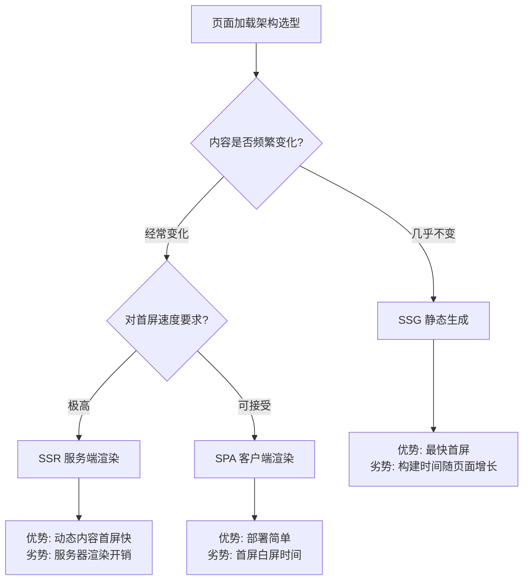
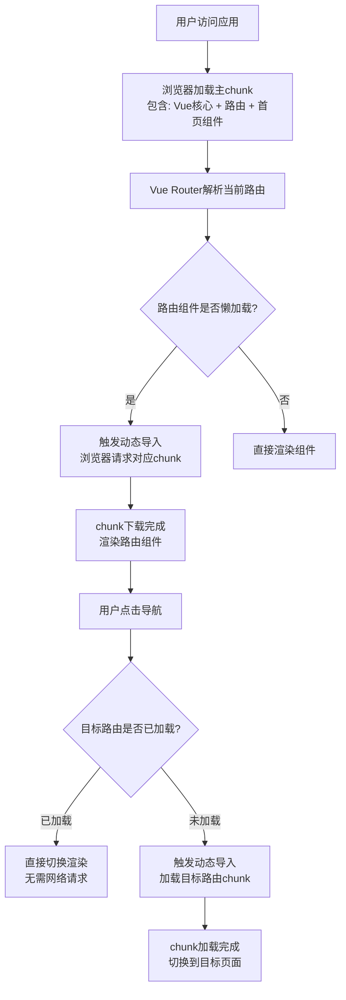

扫描[二维码](https://api2.cmdragon.cn/upload/cmder/20250304_012821924.jpg)关注或者微信搜一搜：`编程智域 前端至全栈交流与成长`

[发现1000+提升效率与开发的AI工具和实用程序](https://tools.cmdragon.cn/zh/apps?category=ai_chat)：https://tools.cmdragon.cn/


## 1.1 选用正确的架构：SSR、SSG与SPA的性能抉择

你打开一个网页，白屏转了三四秒才看到内容——这种体验谁都不想要。Vue官方文档说得很直白：如果你的应用对页面加载性能敏感，就别只走纯客户端SPA这条路。为什么？因为SPA的工作方式注定了首屏会慢。

### 纯SPA的首屏加载瓶颈

SPA的加载流程是这样的：浏览器先下载一个几乎空白的HTML → 然后下载整个JS包 → 解析执行JS → JS再把页面渲染出来。在这个过程中，用户看到的始终是一片空白。JS包越大，白屏时间越长。

打个比方，SPA就像一家**自助餐厅**——客人到了餐厅，食材还在仓库里，厨师得先去取食材、备菜、再炒菜，客人只能干等着。即使你只点了一盘花生米，也得等厨师把整个厨房的设备都就位。

### SSR：服务器直接返回HTML

SSR（Server-Side Rendering）的思路是：当用户请求页面时，服务器先在后台把Vue组件渲染成完整的HTML字符串，然后直接发给浏览器。浏览器拿到HTML就能立刻展示内容，之后再进行"水合"（hydration），让静态HTML变成可交互的Vue应用。

SSR就像一家**现炒餐厅**——你点了菜，后厨立马炒好端上来，你能马上开吃。虽然每道菜需要现做（服务器有渲染开销），但客人不用干等。

### SSG：构建时生成静态HTML

SSG（Static Site Generation）更进了一步：在构建阶段就把所有页面渲染成静态HTML文件，部署后用户访问时直接返回这些文件，连服务器实时渲染都省了。博客、文档站、营销页面这类内容变化不频繁的场景，SSG简直是量身定做。

SSG就像一家**快餐店**——菜品早就做好放在保温柜里了，客人一点单，服务员直接从柜子里拿出来递过去，快到几乎零等待。

### 三种架构的对比



### 混合方案：取长补短

实际项目中往往不会只用一种方案。比较常见的做法是：主应用走SPA保证交互体验，而营销落地页、关于我们这类页面用SSG提前生成。Nuxt 3对这种混合模式的支持非常友好：

```js
// nuxt.config.ts
export default defineNuxtConfig({
  // SSR模式（Nuxt 3默认开启）
  ssr: true,
  
  // 如果要对部分路由做SSG静态生成
  // 在ssr: true的基础上，配置预渲染路由
  nitro: {
    prerender: {
      // 这些路由会在构建时生成静态HTML
      routes: ['/', '/about', '/blog']
    }
  }
})
```

在这个配置里，`/`、`/about`、`/blog` 三个页面会在构建阶段预渲染成静态HTML文件，用户访问时直接返回，速度飞快；而其他动态页面仍然走SSR，由服务器实时渲染。这样既保证了营销页面的极致速度，又保留了动态内容的服务端渲染能力。

选架构没有银弹，关键看你的业务场景。如果你的应用是后台管理系统，首屏稍慢一点用户也能接受，SPA完全够用；如果是面向C端的内容站，SSG或SSR就是刚需了。


## 1.2 包体积与Tree-shaking优化

架构选好了，接下来我们看看怎么让打出来的包更瘦。包体积直接影响下载时间，体积越大，用户等得越久。

### 构建步骤的必要性

Vue官方文档强调了一点：始终使用构建步骤。这不是可选建议，而是性能优化的基本前提。两个原因：

**第一，模板预编译。** Vue的模板在浏览器里运行时需要编译器把模板字符串转成渲染函数。但如果你在构建阶段就完成这个编译，最终产物里就不需要包含Vue的编译器了。编译器大约占14kb（gzip压缩后），省掉它就是实打实的体积缩减。

**第二，Tree-shaking。** 只有经过构建工具的处理，才能分析出哪些代码没被使用并把它们移除。没有构建步骤，所有代码都会原样打包，用没用到都算你的。

### Tree-shaking的工作原理

Tree-shaking这个名字挺形象——摇一棵树，枯叶（未使用的代码）就会掉下来。它的核心逻辑是：构建工具从入口文件开始，分析所有模块的导入导出关系，标记出那些被导入但从未被实际使用的导出，最后在生成产物时把它们移除。


举个例子来说，假设你的项目里只用了Vue的`ref`和`computed`，没用到`watch`、`reactive`等API。经过Tree-shaking后，`watch`和`reactive`的代码不会出现在最终的JS文件里。这就是为什么Vue 3从架构上改成了命名导出——每个API都是独立导出的，构建工具才能精确地判断哪些用到了、哪些没用到。

### 依赖引入方式的正确姿势

Tree-shaking能不能生效，很大程度上取决于你引入依赖的方式。来看一个最常见的反面教材：

```js
// ❌ 不好的方式：引入整个lodash
import { debounce } from 'lodash'

// 虽然只用了debounce，但lodash是CommonJS格式
// 构建工具无法确定其他函数是否被间接引用
// 结果：整个lodash（约70kb gzip）都会被打包
```

```js
// ✅ 好的方式：引入ES模块版本
import { debounce } from 'lodash-es'

// lodash-es是ES模块格式，每个函数都是独立导出
// 构建工具可以精确地只打包debounce函数
// 结果：只有debounce相关的代码被打包（约1kb gzip）
```

差别大到惊人——70kb和1kb的区别。原因很简单：CommonJS模块的`require`是动态的，构建工具在静态分析阶段无法确定哪些导出被使用了；而ES模块的`import`是静态声明的，构建工具可以在编译阶段就完成依赖分析。

所以，选依赖库的时候，优先选提供ES模块格式的版本。库名带`-es`后缀的（比如`lodash-es`、`axios-es`）通常是ES模块版本，或者查看`package.json`里的`module`或`exports`字段。

### 依赖体积评估

在引入一个新依赖之前，最好先看看它有多大。[bundlejs.com](https://bundlejs.com)是个不错的在线工具，把包名输进去就能看到gzip后的体积。一个工具库如果gzip后超过10kb，你就该想想有没有更轻量的替代方案了。

说到轻量替代，Vue官方提供了一个叫**petite-vue**的渐进增强方案，只有约6kb（gzip）。如果你的需求只是在已有HTML页面上添加少量交互（比如表单验证、下拉菜单），不需要完整的SPA框架，petite-vue比引入完整的Vue划算得多。

### Vite中的Tree-shaking配置

Vite底层使用Rollup进行生产构建，Tree-shaking默认就是开启的，不需要额外配置。不过你可以通过一些选项来进一步优化分包策略：

```js
// vite.config.js
import { defineConfig } from 'vite'
import vue from '@vitejs/plugin-vue'

export default defineConfig({
  plugins: [vue()],
  build: {
    // Rollup的Tree-shaking默认开启，无需手动配置
    rollupOptions: {
      output: {
        // 手动分包策略：将第三方库拆分成独立的chunk
        // 这样当业务代码变化时，浏览器可以复用缓存的vendor chunk
        manualChunks: {
          // Vue核心库打包到一起
          'vue-vendor': ['vue', 'vue-router'],
          // UI组件库单独打包
          'ui-vendor': ['element-plus']
        }
      }
    }
  }
})
```

分包的好处是缓存利用率。`vue`和`vue-router`这种几乎不会变的库放在一个chunk里，业务代码放在另一个chunk里。业务代码更新后，用户只需要重新下载业务chunk，`vue-vendor`这个chunk可以从浏览器缓存里直接拿。


## 1.3 代码分割与懒加载

Tree-shaking解决的是"不该有的代码别打包"的问题，代码分割解决的是"该有的代码别一次性全加载"的问题。一个大型应用可能有几十个页面，但用户打开首页时根本不需要加载设置页、个人中心页的代码——等用户真的点击导航过去再加载也不迟。

### 动态导入与代码分割

Vue官方文档指出：Rollup（Vite底层使用的构建工具）和webpack都支持ESM的动态导入（dynamic import），并且会自动将动态导入的模块及其依赖拆分到单独的文件中。

```js
// lazy.js及其所有依赖会被拆分到一个单独的文件
// 只有在调用loadLazy()时才会下载这个文件
function loadLazy() {
  return import('./lazy.js')
}
```

当构建工具遇到`import()`这种动态导入语法时，它会自动进行代码分割：把`lazy.js`和它引用的其他模块打成一个独立的chunk，和主入口的代码分开。用户首次加载页面时不会下载这个chunk，只有当代码执行到`import('./lazy.js')`时，浏览器才会发起请求去加载它。

### defineAsyncComponent异步组件

Vue 3提供了`defineAsyncComponent`函数，专门用来定义异步加载的组件。它的底层原理就是利用动态导入实现代码分割：

```js
import { defineAsyncComponent } from 'vue'

// 简单用法：为Foo.vue及其依赖创建单独的代码块
const Foo = defineAsyncComponent(() => import('./Foo.vue'))

// 完整配置：带加载状态和错误处理
const AsyncComp = defineAsyncComponent({
  // 加载函数，返回一个Promise
  loader: () => import('./HeavyComponent.vue'),
  // 加载中显示的组件
  loadingComponent: LoadingSpinner,
  // 加载失败显示的组件
  errorComponent: ErrorDisplay,
  // 延迟200ms才显示loading组件
  // 避免加载很快时出现闪烁
  delay: 200,
  // 超时时间，超过3秒视为加载失败
  timeout: 3000
})
```

`delay`这个选项特别值得注意。如果组件在200ms内就加载完了，loading组件压根不会出现，用户看不到任何闪烁。只有加载时间超过200ms，loading才显示出来，这样体验更自然。`timeout`则是一个兜底机制——网络太差或CDN挂了的时候，3秒后用户能看到一个错误提示，而不是无限转圈。

### Vue Router懒加载路由

这是代码分割最常见的应用场景。如果你的路由组件全部静态导入，那不管用户访问哪个页面，所有页面的代码都会在首次加载时一起下载，白白浪费带宽和时间：

```js
// router/index.js
import { createRouter, createWebHistory } from 'vue-router'

const routes = [
  {
    path: '/',
    name: 'Home',
    // ❌ 静态导入：所有路由组件都会打包到主chunk
    // component: Home
    
    // ✅ 懒加载：只有访问首页时才加载HomeView的代码
    component: () => import('../views/HomeView.vue')
  },
  {
    path: '/dashboard',
    name: 'Dashboard',
    // 用户访问/dashboard时才下载DashboardView的代码
    component: () => import('../views/DashboardView.vue')
  },
  {
    path: '/settings',
    name: 'Settings',
    // 用户访问/settings时才下载SettingsView的代码
    component: () => import('../views/SettingsView.vue')
  }
]

const router = createRouter({
  history: createWebHistory(),
  routes
})

export default router
```

改成懒加载之后，每个路由组件都会被打包成独立的chunk。用户访问首页时只下载首页的代码，点击"设置"时才下载设置页的代码。假设你的应用有20个页面，每个页面的代码平均50kb，静态导入意味着首次要下载1000kb，懒加载则只需要下载50kb——差距不言而喻。

### Vite手动分包优化

除了路由级别的自动代码分割，你还可以通过Vite的`manualChunks`函数更精细地控制分包策略。这个函数接收模块ID作为参数，返回值就是该模块应该归属的chunk名称：

```js
// vite.config.js
import { defineConfig } from 'vite'
import vue from '@vitejs/plugin-vue'

export default defineConfig({
  plugins: [vue()],
  build: {
    rollupOptions: {
      output: {
        manualChunks(id) {
          // 将node_modules中的包按需分组
          if (id.includes('node_modules')) {
            // element-plus单独一个chunk
            if (id.includes('element-plus')) {
              return 'element-plus'
            }
            // echarts单独一个chunk
            if (id.includes('echarts')) {
              return 'echarts'
            }
            // 其他第三方库统一放vendor
            return 'vendor'
          }
        }
      }
    }
  }
})
```

为什么要这么分？因为`element-plus`和`echarts`都是体积很大的库，把它们各自独立出来，当你的业务代码更新时，这些大体积的第三方库chunk可以从缓存读取，不用重新下载。如果全部混在`vendor`里，任何一个库变化都会导致整个`vendor` chunk失效。

### 代码分割的加载流程

把整个代码分割的加载流程画出来，思路会更清晰：



从这个流程图可以看出，代码分割的本质是"按需加载"：首页只加载首页需要的代码，其他页面的代码等到用户真的要访问时才加载。一旦某个页面的代码加载过了，后续再切换过去就不需要网络请求了，因为chunk已经在浏览器缓存里了。


## 1.4 课后Quiz

**问题一：为什么Vue使用构建步骤后可以节省约14kb的包体积？**

Vue的模板编译器负责在运行时将模板字符串编译为JavaScript渲染函数，体积约14kb（gzip后）。使用构建步骤后，模板在构建阶段就通过`@vue/compiler-sfc`预编译成了渲染函数，最终产物不再需要包含运行时编译器，所以能省掉这14kb。这也是为什么Vue官方推荐始终使用构建步骤。

**问题二：lodash和lodash-es在Tree-shaking方面的关键区别是什么？**

关键区别在于模块格式。`lodash`使用CommonJS格式（`module.exports`），CommonJS的`require`是动态执行的，构建工具在静态分析阶段无法确定哪些导出被使用了，因此整个库都会被打包。`lodash-es`使用ES模块格式（`export`），`import`是静态声明的，构建工具可以精确分析出哪些导出被引用了，只打包被使用的函数。同样只用了`debounce`，`lodash`会打包整个70kb，`lodash-es`只打包约1kb。

**问题三：Vue Router路由组件使用懒加载时，代码分割是在哪个阶段发生的？**

代码分割发生在**构建阶段**。当构建工具（Rollup/Vite/webpack）遇到`import()`动态导入语法时，它会在打包过程中将动态导入的模块及其依赖拆分成独立的chunk文件。浏览器加载阶段只是按需请求这些已经分割好的chunk——用户访问某个路由时，浏览器才去下载对应的chunk文件，但分割本身是构建工具提前完成的。


## 1.5 常见报错与解决方案

### 报错一：Failed to fetch dynamically imported module

**现象：** 懒加载路由或异步组件在加载时报错，控制台显示"Failed to fetch dynamically imported module"。

**原因：** 部署时静态资源的路径配置有问题。代码分割后，浏览器需要按路径去请求各个chunk文件，如果`base`路径配置错误或者CDN路径不正确，请求就会404。

**解决：** 检查Vite配置中的`base`选项，确保它和实际部署路径一致。如果部署在子路径下（比如`https://example.com/app/`），`base`必须设为`'/app/'`：

```js
// vite.config.js
export default defineConfig({
  base: '/app/',  // 与部署路径保持一致
  // ...其他配置
})
```

另外，如果你的应用部署在Nginx上，确保Nginx配置了对静态资源的正确代理，以及SPA的`try_files`回退：

```nginx
location /app/ {
    try_files $uri $uri/ /app/index.html;
}
```

### 报错二：Tree-shaking未生效，包体积未减小

**现象：** 明明只用了某个库的一两个函数，但打包后整个库都被包含进来了，体积没有缩减。

**原因：** 通常有两种情况：一是引入了CommonJS格式的包，构建工具无法进行静态分析；二是`package.json`中的`sideEffects`字段配置不正确。

**解决：**

第一步，确认使用ES模块格式的包。检查`node_modules/对应包/package.json`，看`module`或`exports`字段是否存在：

```js
// ❌ 引入CommonJS格式，Tree-shaking不生效
import { debounce } from 'lodash'

// ✅ 引入ES模块格式，Tree-shaking可以生效
import { debounce } from 'lodash-es'
```

第二步，检查项目自身的`sideEffects`配置。如果你的代码没有副作用（大部分前端项目都是这样），在`package.json`中设置：

```json
{
  "sideEffects": false
}
```

这告诉构建工具："放心移除未使用的导出吧，不会有副作用的。"如果有少数文件存在副作用，可以用数组列出这些文件：

```json
{
  "sideEffects": ["*.css", "*.vue"]
}
```

### 报错三：异步组件加载失败无错误提示

**现象：** 使用`defineAsyncComponent`定义的异步组件加载失败后，页面一片空白，没有任何提示信息。

**原因：** 使用了简写形式的`defineAsyncComponent`，没有配置`errorComponent`和`timeout`选项。加载失败时Vue无法知道应该显示什么，只能展示空白。

**解决：** 使用完整的配置对象，至少加上`errorComponent`和`timeout`：

```js
import { defineAsyncComponent } from 'vue'
import ErrorDisplay from './ErrorDisplay.vue'
import LoadingSpinner from './LoadingSpinner.vue'

const AsyncComp = defineAsyncComponent({
  loader: () => import('./HeavyComponent.vue'),
  loadingComponent: LoadingSpinner,  // 加载中显示
  errorComponent: ErrorDisplay,       // ✅ 加载失败时显示
  delay: 200,
  timeout: 3000                       // ✅ 3秒超时后触发错误状态
})
```

### 报错四：Vite手动分包后chunk命名混乱

**现象：** 配置了`manualChunks`后，生成的chunk文件名不符合预期，或者多个本应分开的模块被打到了同一个chunk里。

**原因：** `manualChunks`函数的逻辑不够严谨，导致模块被错误归类。比如用`id.includes('utils')`做判断，可能会把`element-plus/utils`和自己的`src/utils`都分到同一个chunk。

**解决：** 在`manualChunks`函数中使用更精确的匹配条件。优先匹配`node_modules`路径，并且用更具体的路径判断：

```js
manualChunks(id) {
  // 只处理node_modules中的依赖
  if (id.includes('node_modules')) {
    // 用更精确的路径匹配
    if (id.includes('node_modules/element-plus/')) {
      return 'element-plus'
    }
    if (id.includes('node_modules/echarts/')) {
      return 'echarts'
    }
    if (id.includes('node_modules/lodash-es/')) {
      return 'lodash-es'
    }
    // 其他第三方库
    return 'vendor'
  }
  // 业务代码不单独分包，留在主chunk
}
```

或者，你也可以用对象形式的`manualChunks`，更简洁但灵活性稍低：

```js
manualChunks: {
  'element-plus': ['element-plus'],
  'echarts': ['echarts'],
  'vue-vendor': ['vue', 'vue-router', 'pinia']
}
```


参考链接：https://cn.vuejs.org/guide/best-practices/performance.html

余下文章内容请点击跳转至 个人博客页面 或者 扫描[二维码](https://api2.cmdragon.cn/upload/cmder/20250304_012821924.jpg)关注或者微信搜一搜：`编程智域 前端至全栈交流与成长`，阅读完整的文章：[Vue 3性能优化二：页面加载优化——架构选型、Tree-shaking与代码分割实战](https://blog.cmdragon.cn/posts/b2c3d4e5f6g7h8i9j0k1l2m3n4o5p6q7/)


<details>
<summary>往期文章归档</summary>

- [Vue 3 静态与动态 Props 如何传递？TypeScript 类型约束有何必要？](https://blog.cmdragon.cn/posts/94ab48753b64780ca3ab7a7115ae8522/)
- [Vue 3中组件局部注册的优势与实现方式如何？](https://blog.cmdragon.cn/posts/dbf576e744870f6de26fd8a2e03e47da/)
- [如何在Vue3中优化生命周期钩子性能并规避常见陷阱？](https://blog.cmdragon.cn/posts/12d98b3b9ccd6c19a1b169d720ac5c80/)</details>


<details>
<summary>免费好用的热门在线工具</summary>

- [多直播聚合器 - 应用商店 | By cmdragon](https://tools.cmdragon.cn/zh/apps/multi-live-aggregator)
- [Proto文件生成器 - 应用商店 | By cmdragon](https://tools.cmdragon.cn/zh/apps/proto-file-generator)
- [图片转粒子 - 应用商店 | By cmdragon](https://tools.cmdragon.cn/zh/apps/image-to-particles)
- [视频下载器 - 应用商店 | By cmdragon](https://tools.cmdragon.cn/zh/apps/video-downloader)
- [文件格式转换器 - 应用商店 | By cmdragon](https://tools.cmdragon.cn/zh/apps/file-converter)
- [M3U8在线播放器 - 应用商店 | By cmdragon](https://tools.cmdragon.cn/zh/apps/m3u8-player)
- [快图设计 - 应用商店 | By cmdragon](https://tools.cmdragon.cn/zh/apps/quick-image-design)
- [高级文字转图片转换器 - 应用商店 | By cmdragon](https://tools.cmdragon.cn/zh/apps/text-to-image-advanced)
- [RAID 计算器 - 应用商店 | By cmdragon](https://tools.cmdragon.cn/zh/apps/raid-calculator)
- [在线PS - 应用商店 | By cmdragon](https://tools.cmdragon.cn/zh/apps/photoshop-online)
- [Mermaid 在线编辑器 - 应用商店 | By cmdragon](https://tools.cmdragon.cn/zh/apps/mermaid-live-editor)
- [数学求解计算器 - 应用商店 | By cmdragon](https://tools.cmdragon.cn/zh/apps/math-solver-calculator)
- [智能提词器 - 应用商店 | By cmdragon](https://tools.cmdragon.cn/zh/apps/smart-teleprompter)
- [魔法简历 - 应用商店 | By cmdragon](https://tools.cmdragon.cn/zh/apps/magic-resume)
- [Image Puzzle Tool - 图片拼图工具 | By cmdragon](https://tools.cmdragon.cn/zh/apps/image-puzzle-tool)
- [字幕下载工具 - 应用商店 | By cmdragon](https://tools.cmdragon.cn/zh/apps/subtitle-downloader)
- [歌词生成工具 - 应用商店 | By cmdragon](https://tools.cmdragon.cn/zh/apps/lyrics-generator)
- [网盘资源聚合搜索 - 应用商店 | By cmdragon](https://tools.cmdragon.cn/zh/apps/cloud-drive-search)
- [ASCII字符画生成器 - 应用商店 | By cmdragon](https://tools.cmdragon.cn/zh/apps/ascii-art-generator)
- [JSON Web Tokens 工具 - 应用商店 | By cmdragon](https://tools.cmdragon.cn/zh/apps/jwt-tool)
- [Bcrypt 密码工具 - 应用商店 | By cmdragon](https://tools.cmdragon.cn/zh/apps/bcrypt-tool)
- [GIF 合成器 - 应用商店 | By cmdragon](https://tools.cmdragon.cn/zh/apps/gif-composer)
- [GIF 分解器 - 应用商店 | By cmdragon](https://tools.cmdragon.cn/zh/apps/gif-decomposer)
- [文本隐写术 - 应用商店 | By cmdragon](https://tools.cmdragon.cn/zh/apps/text-steganography)
- [CMDragon 在线工具 - 高级AI工具箱与开发者套件 | 免费好用的在线工具](https://tools.cmdragon.cn/zh)
- [应用商店 - 发现1000+提升效率与开发的AI工具和实用程序 | 免费好用的在线工具](https://tools.cmdragon.cn/zh/apps?category=trending)
- [CMDragon 更新日志 - 最新更新、功能与改进 | 免费好用的在线工具](https://tools.cmdragon.cn/zh/changelog)
- [支持我们 - 成为赞助者 | 免费好用的在线工具](https://tools.cmdragon.cn/zh/sponsor)
- [AI文本生成图像 - 应用商店 | 免费好用的在线工具](https://tools.cmdragon.cn/zh/apps/text-to-image-ai)
- [临时邮箱 - 应用商店 | 免费好用的在线工具](https://tools.cmdragon.cn/zh/apps/temp-email)
- [二维码解析器 - 应用商店 | 免费好用的在线工具](https://tools.cmdragon.cn/zh/apps/qrcode-parser)
- [文本转思维导图 - 应用商店 | 免费好用的在线工具](https://tools.cmdragon.cn/zh/apps/text-to-mindmap)
- [正则表达式可视化工具 - 应用商店 | 免费好用的在线工具](https://tools.cmdragon.cn/zh/apps/regex-visualizer)
- [文件隐写工具 - 应用商店 | 免费好用的在线工具](https://tools.cmdragon.cn/zh/apps/steganography-tool)
- [IPTV 频道探索器 - 应用商店 | 免费好用的在线工具](https://tools.cmdragon.cn/zh/apps/iptv-explorer)
- [快传 - 应用商店 | 免费好用的在线工具](https://tools.cmdragon.cn/zh/apps/snapdrop)
- [随机抽奖工具 - 应用商店 | 免费好用的在线工具](https://tools.cmdragon.cn/zh/apps/lucky-draw)
- [动漫场景查找器 - 应用商店 | 免费好用的在线工具](https://tools.cmdragon.cn/zh/apps/anime-scene-finder)
- [时间工具箱 - 应用商店 | 免费好用的在线工具](https://tools.cmdragon.cn/zh/apps/time-toolkit)
- [网速测试 - 应用商店 | 免费好用的在线工具](https://tools.cmdragon.cn/zh/apps/speed-test)
- [AI 智能抠图工具 - 应用商店 | 免费好用的在线工具](https://tools.cmdragon.cn/zh/apps/background-remover)
- [背景替换工具 - 应用商店 | 免费好用的在线工具](https://tools.cmdragon.cn/zh/apps/background-replacer)
- [艺术二维码生成器 - 应用商店 | 免费好用的在线工具](https://tools.cmdragon.cn/zh/apps/artistic-qrcode)
- [Open Graph 元标签生成器 - 应用商店 | 免费好用的在线工具](https://tools.cmdragon.cn/zh/apps/open-graph-generator)
- [图像对比工具 - 应用商店 | 免费好用的在线工具](https://tools.cmdragon.cn/zh/apps/image-comparison)
- [图片压缩专业版 - 应用商店 | 免费好用的在线工具](https://tools.cmdragon.cn/zh/apps/image-compressor)
- [密码生成器 - 应用商店 | 免费好用的在线工具](https://tools.cmdragon.cn/zh/apps/password-generator)
- [SVG优化器 - 应用商店 | 免费好用的在线工具](https://tools.cmdragon.cn/zh/apps/svg-optimizer)
- [调色板生成器 - 应用商店 | 免费好用的在线工具](https://tools.cmdragon.cn/zh/apps/color-palette)
- [在线节拍器 - 应用商店 | 免费好用的在线工具](https://tools.cmdragon.cn/zh/apps/online-metronome)
- [IP归属地查询 - 应用商店 | 免费好用的在线工具](https://tools.cmdragon.cn/zh/apps/ip-geolocation)
- [CSS网格布局生成器 - 应用商店 | 免费好用的在线工具](https://tools.cmdragon.cn/zh/apps/css-grid-layout)
- [邮箱验证工具 - 应用商店 | 免费好用的在线工具](https://tools.cmdragon.cn/zh/apps/email-validator)
- [书法练习字帖 - 应用商店 | 免费好用的在线工具](https://tools.cmdragon.cn/zh/apps/calligraphy-practice)
- [金融计算器套件 - 应用商店 | 免费好用的在线工具](https://tools.cmdragon.cn/zh/apps/finance-calculator-suite)
- [中国亲戚关系计算器 - 应用商店 | 免费好用的在线工具](https://tools.cmdragon.cn/zh/apps/chinese-kinship-calculator)
- [Protocol Buffer 工具箱 - 应用商店 | 免费好用的在线工具](https://tools.cmdragon.cn/zh/apps/protobuf-toolkit)
- [IP归属地查询 - 应用商店 | 免费好用的在线工具](https://tools.cmdragon.cn/zh/apps/ip-geolocation)
- [图片无损放大 - 应用商店 | 免费好用的在线工具](https://tools.cmdragon.cn/zh/apps/image-upscaler)
- [文本比较工具 - 应用商店 | 免费好用的在线工具](https://tools.cmdragon.cn/zh/apps/text-compare)
- [IP批量查询工具 - 应用商店 | 免费好用的在线工具](https://tools.cmdragon.cn/zh/apps/ip-batch-lookup)
- [域名查询工具 - 应用商店 | 免费好用的在线工具](https://tools.cmdragon.cn/zh/apps/domain-finder)
- [DNS工具箱 - 应用商店 | 免费好用的在线工具](https://tools.cmdragon.cn/zh/apps/dns-toolkit)
- [网站图标生成器 - 应用商店 | 免费好用的在线工具](https://tools.cmdragon.cn/zh/apps/favicon-generator)
- [XML Sitemap](https://tools.cmdragon.cn/sitemap_index.xml)

</details>
