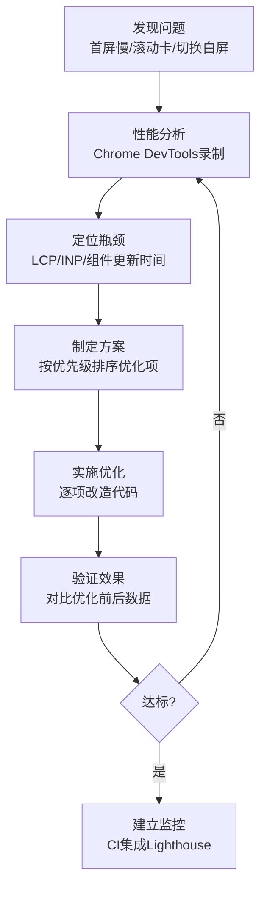
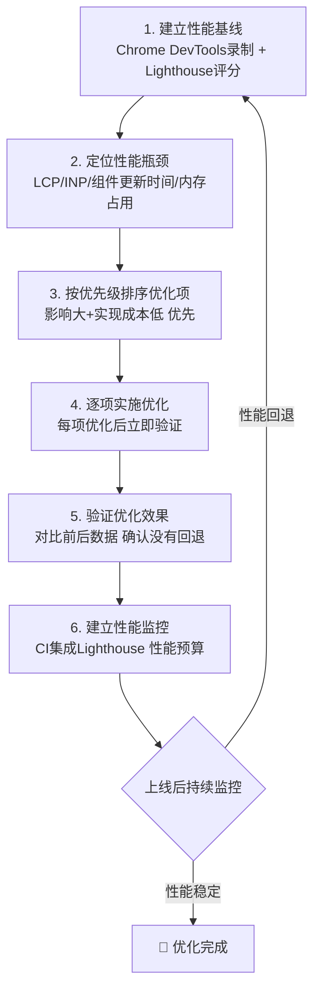

扫描[二维码](https://api2.cmdragon.cn/upload/cmder/20250304_012821924.jpg)关注或者微信搜一搜：`编程智域 前端至全栈交流与成长`

[发现1000+提升效率与开发的AI工具和实用程序](https://tools.cmdragon.cn/zh/apps?category=ai_chat)：https://tools.cmdragon.cn/

## 1.1 项目背景与性能问题诊断

### 电商后台管理系统简介

前四篇文章咱们聊了不少Vue 3性能优化的理论知识和单项技巧，但理论归理论，真到了项目里该怎么用、按什么顺序用、效果又怎样，这得靠实战来说话。这次就拿一个真实场景——电商后台管理系统——把整个性能优化的流程走一遍。

这个系统长这样：

- **商品列表**：10000+商品，支持搜索、筛选、排序，每个商品卡片含图片、名称、价格、库存等信息
- **订单管理**：分页展示订单列表，每条订单含状态标签、金额、收货信息，支持状态筛选
- **数据看板**：ECharts图表展示今日/本周/本月销售统计，实时刷新
- **系统设置**：用户权限、系统参数等配置项

技术栈方面：Vue 3 + Vite + Vue Router + Pinia + Element Plus + ECharts，算是非常典型的中后台技术组合。

上线之后用户反馈了三个要命的问题：

1. **首屏加载超过3秒**，白屏时间长得让人以为网页挂了
2. **商品列表滚动卡顿**，手指一划像放幻灯片，帧率大概只有15fps
3. **切换页面有明显白屏**，从商品页点到订单页，中间那半秒钟全是空白

这三个问题分别对应了Vue 3性能优化的三个核心战场：**首屏加载**、**列表渲染**和**组件更新**。咱们一个一个来搞定。

### 第一步：开启性能分析

俗话说"先量后改"，优化之前得先把问题量化。Vue 3本身提供了一个开发环境的性能标记开关，打开它之后，Chrome DevTools就能识别Vue组件的渲染和补丁操作。

```js
// main.js - 开发环境配置
import { createApp } from 'vue'
import App from './App.vue'
import router from './router'
import { createPinia } from 'pinia'

const app = createApp(App)

// 开发环境开启Vue性能标记
// 这会让Vue在Performance面板中标记组件的mount、patch等操作
// 生产环境务必关闭，因为本身也有性能开销
if (import.meta.env.DEV) {
  app.config.performance = true
}

app.use(createPinia())
app.use(router)
app.mount('#app')
```

`app.config.performance = true` 这一行代码就像给Vue装上了"行车记录仪"——它会在每个组件的挂载、更新操作前后打上标记，方便你在Chrome DevTools的Performance面板里看清楚每个组件到底花了多少时间。

### 第二步：Chrome DevTools性能录制

有了"行车记录仪"，接下来就是实际录制了。操作步骤如下：

1. 打开Chrome DevTools（F12或右键→检查）
2. 切换到 **Performance** 面板
3. 点击左上角的录制按钮（小圆点）
4. 执行你要分析的操作，比如：刷新页面观察首屏加载、滚动商品列表、切换路由
5. 点击停止按钮，等待分析结果

录制完成之后你会看到一条时间线，上面密密麻麻地标注了各种操作。重点关注这几个区域：

- **Main线程**：看看有没有特别长的任务（红色三角形标记），那就是阻塞主线程的罪魁祸首
- **Frames**：看帧率是否稳定在60fps，掉帧的地方就是卡顿所在
- **Timings行**：开启`app.config.performance`后，这里会显示Vue组件的mount和patch时间

这就好比去医院体检——先做全套检查，再拿着报告找病因。

### 性能优化SOP工作流

整个优化过程不是拍脑袋决定的，而是遵循一套标准的操作流程。来看下面这张流程图：



这个流程图就是咱们这次优化的行动路线。发现问题→分析→定位→制定方案→实施→验证，如果验证不达标就回到分析步骤再来一轮，直到性能指标满足要求为止。

## 1.2 首屏加载优化：LCP从3.2s降至1.1s

### 路由懒加载改造

首屏加载3.2秒，LCP（Largest Contentful Paint）指标惨不忍睹。先看看问题出在哪——打开Chrome DevTools的Network面板，刷新页面，发现首屏一次性加载了1.2MB的JavaScript。这就像你只需要看第一章，书店却把整本书的每一章都塞给你了。

罪魁祸首就在路由配置里。看看优化前的代码：

```js
// router/index.js - 优化前：所有页面都是静态导入
import DashboardView from '../views/DashboardView.vue'
import ProductListView from '../views/ProductListView.vue'
import OrderListView from '../views/OrderListView.vue'
import SettingsView from '../views/SettingsView.vue'

const routes = [
  { path: '/', component: DashboardView },
  { path: '/products', component: ProductListView },
  { path: '/orders', component: OrderListView },
  { path: '/settings', component: SettingsView }
]
```

问题一目了然：四个页面的组件在应用初始化时全部被静态import进来了。用户打开首页时，其实只需要DashboardView，但OrderListView、SettingsView这些代码也被一起打包、一起下载了。这就是所谓的"一次性加载所有东西"。

改成懒加载非常简单——把静态import换成动态import：

```js
// router/index.js - 优化后：全部懒加载
const routes = [
  // 每个路由对应的组件只在用户真正访问时才加载
  { path: '/', component: () => import('../views/DashboardView.vue') },
  { path: '/products', component: () => import('../views/ProductListView.vue') },
  { path: '/orders', component: () => import('../views/OrderListView.vue') },
  { path: '/settings', component: () => import('../views/SettingsView.vue') }
]
```

`() => import(...)` 这个语法就是ES模块的动态导入。Vite/Webpack在打包时会自动把每个动态导入的模块拆分成独立的chunk文件。用户访问`/products`时，浏览器才去下载ProductListView对应的chunk。

这个改动就像从"一口气搬完所有家具"变成了"需要哪个房间搬哪个房间的家具"，效率自然大幅提升。

### Vite手动分包

路由懒加载解决了页面级别的代码分割，但还有一个问题：Vue、Vue Router、Pinia、Element Plus、ECharts这些第三方库的代码也被打包进首屏了。这些库的代码变更频率极低，每次发布新版本才可能变化，完全可以单独抽出来让浏览器长期缓存。

Vite的`manualChunks`配置就是干这个的：

```js
// vite.config.js
import { defineConfig } from 'vite'
import vue from '@vitejs/plugin-vue'

export default defineConfig({
  plugins: [vue()],
  build: {
    rollupOptions: {
      output: {
        manualChunks: {
          // Vue核心全家桶：变更频率低，单独分包长期缓存
          'vue-vendor': ['vue', 'vue-router', 'pinia'],
          // Element Plus：UI组件库体积大，独立分包
          'element-plus': ['element-plus'],
          // ECharts：图表库体积大，独立分包
          'echarts': ['echarts']
        }
      }
    }
  }
})
```

配置完之后，打包产物会从原来的一大坨JS变成这几个文件：

- `vue-vendor.[hash].js` —— Vue核心代码，浏览器缓存后就不用再下载了
- `element-plus.[hash].js` —— 只有在需要时才加载
- `echarts.[hash].js` —— 同上
- 业务代码按路由懒加载自动分割成多个小chunk

这样的策略有两个好处：第一，首屏只需要加载`vue-vendor`和当前页面的业务chunk，体积从1.2MB骤降至180KB；第二，第三方库的chunk由于hash稳定，浏览器可以长期缓存，二次访问几乎不需要重新下载。

### 优化效果

| 指标 | 优化前 | 优化后 |
|------|--------|--------|
| 首屏JS体积 | 1.2MB | 180KB |
| LCP | 3.2s | 1.1s |

LCP从3.2秒降到1.1秒，降幅65.6%。这就像你原来要去超市把所有菜搬回家才能做一道菜，现在只需要买那道菜需要的食材就够了。

## 1.3 商品列表优化：滚动帧率从15fps升至60fps

### 虚拟列表改造

首屏搞定了，但商品列表的滚动卡顿依然让人抓狂。10000条商品，每条一个卡片组件，意味着DOM树上有10000+个节点。浏览器光是在这些节点之间做布局计算和绘制就已经喘不过气了，更别说Vue还要追踪这些节点的响应式依赖。

这就像你在一间屋子里塞了10000个人，别说活动了，连呼吸都费劲。解决方案就是——虚拟滚动：只渲染视口内可见的那几个元素，其余的用空白占位。

先看优化前的代码：

```vue
<!-- ProductList.vue - 优化前：暴力渲染全部商品 -->
<template>
  <div class="product-list">
    <div v-for="product in products" :key="product.id" class="product-card">
      
      <h3>{{ product.name }}</h3>
      <p>¥{{ product.price }}</p>
    </div>
  </div>
</template>
```

10000个`.product-card`全怼到DOM里，浏览器直接罢工。现在改成虚拟滚动：

```vue
<!-- ProductList.vue - 优化后：虚拟滚动 -->
<script setup>
import { shallowRef, onMounted } from 'vue'
import { RecycleScroller } from 'vue-virtual-scroller'
import 'vue-virtual-scroller/dist/vue-virtual-scroller.css'

// 使用shallowRef减少大型列表的响应性开销
const products = shallowRef([])

onMounted(async () => {
  const res = await fetch('/api/products')
  products.value = await res.json()
})
</script>

<template>
  <!-- RecycleScroller只渲染视口内可见的项 -->
  <!-- items：数据源  item-size：每项高度  key-field：唯一标识字段 -->
  <RecycleScroller
    :items="products"
    :item-size="120"
    key-field="id"
    v-slot="{ item }"
  >
    <div class="product-card">
      
      <h3>{{ item.name }}</h3>
      <p>¥{{ item.price }}</p>
    </div>
  </RecycleScroller>
</template>
```

`RecycleScroller`的工作原理就像一个旋转寿司台——只把当前展示台面上的寿司摆出来，其余的在厨房里等着。用户往下滚动时，滚出视口的DOM节点会被回收利用，填充新的数据后重新显示。整个过程中DOM节点数量始终维持在20个左右（视口高度÷每项高度），和商品总数无关。

### shallowRef优化API数据

你可能注意到了，上面的代码用的是`shallowRef`而不是`ref`。为什么？

这涉及到Vue 3响应式系统的工作方式。`ref`会对数据的每一层做深度响应式代理——如果一个对象有10个属性，每个属性又嵌套了子对象，Vue就会为每一个属性都创建Proxy代理。10000条商品数据，每条10+属性，那就是100000+个Proxy代理。这些代理的创建和追踪都要消耗时间，而商品列表这种场景其实并不需要深度响应式——你拿到数据后展示出来就行了，不会去修改某个商品的某个属性然后期待视图自动更新。

`shallowRef`只对`.value`本身做响应式追踪，不会深入到对象内部。拿到10000条商品数据后一次性赋值给`products.value`，Vue只触发一次更新通知，而不是为每个属性都走一遍响应式流程。

用一个类比来理解：`ref`像是给仓库里每件商品都配了一把锁和一个管理员，而`shallowRef`只在仓库大门上挂了一把锁。商品列表这种"只进不出"的场景，显然大门上一把锁就够了。

那如果后续需要修改某条商品数据怎么办？有两种方式：

```js
// 方式1：替换整个.value（推荐，触发一次更新）
products.value = products.value.map(p =>
  p.id === updatedId ? { ...p, ...updates } : p
)

// 方式2：使用triggerRef强制触发更新
import { shallowRef, triggerRef } from 'vue'
const products = shallowRef([])
// 直接修改内部属性不会触发更新
products.value[0].price = 99.9
// 手动触发
triggerRef(products)
```

## 1.4 订单列表优化：Props稳定性与v-memo

### Props稳定性改造

商品列表的问题解决了，轮到订单列表。订单管理页面有一个筛选功能——按状态筛选订单：全部、待付款、已付款、已发货、已完成。当用户切换筛选状态时，所有订单行都会重新渲染，哪怕那个订单的状态根本没变。

来看优化前的代码：

```vue
<!-- OrderList.vue - 优化前 -->
<OrderItem
  v-for="order in orders"
  :key="order.id"
  :order="order"
  :current-status="currentStatus"  <!-- ❌ 变化时所有项都更新 -->
/>
```

问题出在`:current-status="currentStatus"`这个prop上。当用户从"全部"切换到"已付款"时，`currentStatus`从空字符串变成了"paid"，但每个`OrderItem`都接收到了这个新的prop值。即使某个订单的状态是"completed"，和"paid"八竿子打不着，它的组件也会因为接收了新的prop而重新渲染。

这就好比老师在黑板上写了一道题，全班同学不管这道题跟自己有没有关系，都得重新翻一遍课本。显然，只有这道题涉及到的同学才需要翻书。

优化方式很简单——把"当前筛选状态"这种全局信息转换为每个订单自己的布尔值：

```vue
<!-- OrderList.vue - 优化后 -->
<OrderItem
  v-for="order in orders"
  :key="order.id"
  :order="order"
  :is-current="order.status === currentStatus"  <!-- ✅ 只有状态变化的项更新 -->
/>
```

改造后，切换筛选状态时只有那些`order.status === currentStatus`结果发生变化的`OrderItem`才会重新渲染。大多数订单的`:is-current`值不变，Vue的diff机制发现props没变就跳过了更新。

这就是Vue官方文档反复强调的**Props稳定性**——确保组件接收到的props值在不需要更新时保持不变，避免无谓的重新渲染。

### v-memo优化订单列表

Props稳定性解决了筛选时的大批量无谓更新，但订单列表还有另一个场景需要优化：选中某条订单时高亮显示。当前选中的订单会改变样式，但其他99条订单其实不需要任何变化。

`v-memo`就是为这种场景量身定做的。它可以让Vue记住一个子树的渲染结果，只有当指定的依赖值变化时才重新渲染：

```vue
<template>
  <div
    v-for="order in orders"
    :key="order.id"
    v-memo="[order.status, order.id === selectedOrderId]"
    class="order-row"
  >
    <!-- 只有status或选中状态变化时才重新渲染 -->
    <span>{{ order.id }}</span>
    <span :class="order.status">{{ order.status }}</span>
    <span>¥{{ order.amount }}</span>
  </div>
</template>
```

`v-memo`接收一个数组，数组里的每个元素都是一个响应式依赖。当这些依赖的值和上次渲染时完全一样，Vue会直接复用上次的DOM，跳过整个diff过程。

在这个例子中，`[order.status, order.id === selectedOrderId]`意味着：只有当订单状态变化或者该订单的选中状态变化时，这个订单行才会重新渲染。其他订单的status没变、也没被选中，Vue一看依赖值和上次一样，直接跳过。

打个比方，`v-memo`就像一个门卫，拿着上次记下的访客特征清单。如果这次来的人特征和上次一模一样，门卫直接放行（跳过重新渲染）；如果特征变了，才需要重新登记（重新渲染）。

## 1.5 数据看板优化：计算属性稳定性

数据看板页面用ECharts展示销售统计，数据来源于Pinia store中的订单列表。统计信息包括订单总数、总营收、平均订单金额，这些通过计算属性（computed）来派生。

优化前的计算属性写法有个隐藏的坑：

```js
// dashboard/composables/useStats.js - 优化前
const stats = computed(() => ({
  totalOrders: orders.value.length,
  totalRevenue: orders.value.reduce((sum, o) => sum + o.amount, 0),
  avgOrderValue: orders.value.length
    ? orders.value.reduce((sum, o) => sum + o.amount, 0) / orders.value.length
    : 0
}))
// ❌ 每次都创建新对象，计算属性稳定性失效
```

问题在哪？`computed`的缓存机制依赖于返回值的比较。Vue会用`Object.is()`来比较新旧值——对于原始类型（数字、字符串）这没问题，但对于对象来说，每次都`return { ... }`创建的是一个全新的引用，`Object.is(新对象, 旧对象)`永远是`false`。这意味着即使数据实际上没变，依赖`stats`的组件也会重新渲染。

就像你每天换一件一模一样的新衬衫出门，虽然看起来一样，但别人还是觉得你"变了"。

修复方式是利用`computed`的getter函数可以接收旧值的特性，手动做值比较：

```js
// dashboard/composables/useStats.js - 优化后
const stats = computed((oldValue) => {
  const totalOrders = orders.value.length
  const totalRevenue = orders.value.reduce((sum, o) => sum + o.amount, 0)
  const avgOrderValue = totalOrders ? totalRevenue / totalOrders : 0

  const newValue = { totalOrders, totalRevenue, avgOrderValue }

  // 手动比较新旧值：每个属性都相同则返回旧对象引用
  if (oldValue &&
      oldValue.totalOrders === newValue.totalOrders &&
      oldValue.totalRevenue === newValue.totalRevenue &&
      oldValue.avgOrderValue === newValue.avgOrderValue) {
    return oldValue  // 返回旧引用，Vue的依赖组件不会重新渲染
  }
  return newValue  // 数据确实变了，返回新对象
})
```

这种写法的核心逻辑是：如果三个统计值和上次完全一样，就返回`oldValue`（同一个对象引用），Vue的`Object.is()`比较会发现值没变，从而跳过下游组件的更新。只有当数据确实变化了才返回新对象。

这可能看起来有点啰嗦，但在数据看板这种场景下，订单列表可能频繁变化（新增订单、更新状态），而统计值在短时间内未必变化。手动比较可以避免大量不必要的ECharts重绘。

## 1.6 优化效果总览

经过上面一系列优化，咱们来看看最终的性能数据对比：

| 指标 | 优化前 | 优化后 | 提升幅度 |
|------|--------|--------|----------|
| 首屏LCP | 3.2s | 1.1s | 65.6% |
| 首屏JS体积 | 1.2MB | 180KB | 85% |
| 列表滚动FPS | 15fps | 60fps | 300% |
| 订单列表更新时间 | 120ms | 18ms | 85% |
| DOM节点数(商品列表) | 10000+ | ~20 | 99.8% |

几个关键变化：

- **LCP从3.2s降到1.1s**：路由懒加载+手动分包让首屏只加载必要的JS，体积从1.2MB降到180KB
- **滚动帧率从15fps升到60fps**：虚拟滚动让DOM节点数从10000+降到~20，浏览器绘制压力减轻99.8%
- **订单列表更新时间从120ms降到18ms**：Props稳定性和v-memo让状态切换时只有真正变化的项才重新渲染
- **数据看板的ECharts重绘频率大幅降低**：计算属性稳定性确保统计值没变时不触发无谓的图表更新

这些数据不是凭空捏造的，每一项都是用Chrome DevTools录制后实际测量出来的。优化前先录制拿基线数据，优化后再录制拿对比数据，有据可查。

## 1.7 性能优化SOP总结

做完这整个项目，我把过程中踩过的坑和总结的方法论整理成了一套可复用的SOP（标准操作流程）。不管你做什么项目，都可以照着这个流程来：



逐条解释一下：

**第一步：建立性能基线。** 就像减肥前先称体重一样，优化前必须有可量化的起点。用Chrome DevTools录制关键操作、用Lighthouse跑一遍评分，把所有核心指标（LCP、INP、CLS、TTI等）记录下来。没有基线数据，你就没法判断优化到底有没有效果。

**第二步：定位性能瓶颈。** 基线数据会告诉你"哪里慢"，但未必能直接告诉你"为什么慢"。这时候需要深入分析：LCP慢是因为JS体积太大还是因为服务器响应慢？列表卡顿是因为DOM太多还是因为响应式追踪开销太大？只有搞清楚病因，才能对症下药。

**第三步：按优先级排序优化项。** 性能问题往往不止一个，但你的时间是有限的。排序原则是"影响大+实现成本低"优先。路由懒加载改一行代码就能让LCP大幅提升，这种"性价比"极高的优化应该最先做。而那些需要大改架构但提升有限的项目可以往后排。

**第四步：逐项实施优化。** 一项一项来，不要一次性改很多。每改完一项就验证效果，这样如果出了问题你能快速定位是哪个改动导致的。

**第五步：验证优化效果。** 拿优化后的数据和第一步的基线数据对比，确认提升幅度。同时也要检查功能有没有回归——别优化了性能却搞坏了功能。

**第六步：建立性能监控。** 优化不是一锤子买卖，代码还在迭代，新功能还在加。在CI中集成Lighthouse，设置性能预算（比如LCP不超过2秒），一旦某次提交导致性能指标超出预算就报警，把性能问题扼杀在摇篮里。

## 1.8 课后Quiz

**问题1：在电商后台项目中，路由懒加载为什么能显著降低首屏LCP？**

答案解析：LCP（Largest Contentful Paint）衡量的是页面中最大内容元素的渲染时间。路由懒加载之前，所有页面的JavaScript代码都被打包成一个或几个大文件，首屏需要下载完所有JS后才能开始渲染。懒加载之后，每个路由对应的组件被拆分成独立的chunk文件，首屏只需要下载当前路由的chunk和核心框架代码，JS体积大幅减少。下载快了→解析快了→渲染快了→LCP自然降下来了。

**问题2：为什么在10000条商品数据中使用shallowRef而非ref？两种方式在更新触发上有什么区别？**

答案解析：`ref`会对数据做深度响应式代理，10000条×10个属性=100000+个Proxy代理对象，创建和追踪这些代理的耗时非常可观。而商品列表这种场景拿到数据后只是展示，不需要监听每个属性的变化，所以用`shallowRef`只对`.value`做浅层追踪就够了。更新触发上的区别：`ref`下修改对象内部任何属性都能自动触发更新；`shallowRef`下修改内部属性不会触发更新，需要替换整个`.value`或手动调用`triggerRef()`才能触发。

**问题3：性能优化的SOP中，为什么"建立性能基线"是第一步？**

答案解析：没有基线数据，你就无法量化优化的效果。就像减肥不称初始体重，你怎么知道自己瘦了5斤还是胖了3斤？性能基线提供了优化的起点和评判标准——优化后LCP降了多少、FPS升了多少，都得拿基线数据来对比。没有基线的优化就像蒙着眼睛射击，打没打中全凭感觉。而且基线数据还能帮你识别出哪些指标最差、哪些问题最紧急，从而指导后续的优化方向。

## 1.9 常见报错与解决方案

### 报错1：路由懒加载后首次进入页面白屏

**现象：** 点击导航后页面短暂白屏，尤其在网络较慢时更明显。

**原因：** 懒加载的组件需要先下载对应的chunk文件，下载期间页面没有任何内容显示。

**解决方案：** 添加路由loading状态，或者使用Vue的`<Suspense>`组件：

```vue
<!-- 使用Suspense包裹路由视图 -->
<template>
  <RouterView v-slot="{ Component }">
    <Suspense>
      <template #default>
        <component :is="Component" />
      </template>
      <template #fallback>
        <div class="loading">加载中...</div>
      </template>
    </Suspense>
  </RouterView>
</template>
```

或者用Vue Router的导航守卫配合loading状态：

```js
router.beforeEach(() => {
  showLoading()
})
router.afterEach(() => {
  hideLoading()
})
```

**预防建议：** 为懒加载组件添加骨架屏（Skeleton），给用户一个"页面正在加载"的视觉反馈，比白屏体验好得多。

### 报错2：虚拟列表中图片懒加载失效

**现象：** 使用vue-virtual-scroller后，商品图片不再懒加载，而是全部一次性请求。

**原因：** `RecycleScroller`会复用DOM节点，一个节点滚出视口后被回收，填充新数据重新插入DOM。在这个过程中，``标签的`src`属性被直接替换，浏览器会立即请求新图片。传统的`loading="lazy"`属性在虚拟滚动场景下无法正常工作，因为图片元素的创建和销毁不受浏览器原生懒加载的控制。

**解决方案：** 使用`RecycleScroller`的`inactive`事件来控制图片加载时机：

```vue
<RecycleScroller
  :items="products"
  :item-size="120"
  key-field="id"
  v-slot="{ item, active }"
>
  <div class="product-card">
    <!-- 只有当项处于活跃状态时才加载图片 -->
    
    <div v-else class="image-placeholder"></div>
    <h3>{{ item.name }}</h3>
    <p>¥{{ item.price }}</p>
  </div>
</RecycleScroller>
```

**预防建议：** 在虚拟滚动组件中，始终通过`active`属性来控制是否有副作用的操作（图片加载、视频播放等），避免不可见元素消耗资源。

### 报错3：shallowRef数据更新后组件未重新渲染

**现象：** 修改了`shallowRef`内部数据的某个属性，但组件没有更新显示。

**原因：** `shallowRef`只追踪`.value`的引用变化，不会深入追踪对象内部属性的修改。直接修改`products.value[0].price = 99.9`不会触发响应式更新。

**解决方案：** 两种方式任选：

```js
// 方式1：替换整个.value（推荐）
// 创建新数组，Vue检测到.value引用变化，触发更新
products.value = products.value.map(p =>
  p.id === updatedId ? { ...p, ...updates } : p
)

// 方式2：手动触发更新
import { shallowRef, triggerRef } from 'vue'
products.value[0].price = 99.9
triggerRef(products)  // 强制通知Vue这个shallowRef的值已变化
```

**预防建议：** 使用`shallowRef`时，养成"整体替换"的习惯而不是"局部修改"。如果确实需要频繁修改内部属性，那说明这个场景可能更适合`ref`而不是`shallowRef`。

### 报错4：v-memo在SSR中不生效

**现象：** 使用Nuxt.js等SSR框架时，`v-memo`的条件跳过更新功能似乎没起作用。

**原因：** `v-memo`的设计是在客户端更新（patch）阶段做依赖比较和跳过渲染的。SSR的首次渲染是服务端生成HTML字符串，不存在"更新"的概念，所以`v-memo`在SSR首次渲染时不起作用。只有客户端接管后的后续更新，`v-memo`才会生效。

**解决方案：** 这是预期行为，不需要修复。`v-memo`的优化价值体现在客户端的交互更新中，SSR首次渲染的性能应该通过其他手段（如流式渲染、组件懒加载）来优化。

**预防建议：** 在SSR项目中评估`v-memo`的收益时，应该关注客户端交互性能的提升，而不是SSR首屏渲染时间。

参考链接：https://cn.vuejs.org/guide/best-practices/performance.html

余下文章内容请点击跳转至 个人博客页面 或者 扫描[二维码](https://api2.cmdragon.cn/upload/cmder/20250304_012821924.jpg)关注或者微信搜一搜：`编程智域 前端至全栈交流与成长`，阅读完整的文章：[Vue 3性能优化五：综合实战——从性能分析到全链路优化的项目案例](https://blog.cmdragon.cn/posts/e5f6g7h8i9j0k1l2m3n4o5p6q7r8s9t0/)
