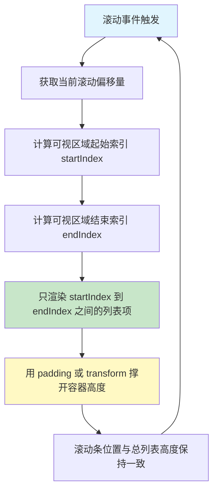

扫描[二维码](https://api2.cmdragon.cn/upload/cmder/20250304_012821924.jpg)关注或者微信搜一搜：`编程智域 前端至全栈交流与成长`

[发现1000+提升效率与开发的AI工具和实用程序](https://tools.cmdragon.cn/zh/apps?category=ai_chat)：https://tools.cmdragon.cn/


## 一 大型虚拟列表：将万级DOM降至十位数

Vue官方文档说得很直白——渲染大型列表是前端最常见的性能问题之一，不管框架做得多么精巧，一口气渲染成千上万个列表项都会变慢。这不是Vue的问题，而是浏览器DOM本身的开销在作祟。每创建一个DOM节点，浏览器都要为其分配内存、计算样式、构建布局树，当节点数量达到万级，这个过程就会变得非常吃力。

打个比方，虚拟列表就像一栋大楼里的"可视电梯"。一栋100层的大楼，电梯面板上只显示当前楼层附近的几个按钮，而不是把1到100层的按钮全都装上去——你根本不需要看到100层在哪儿，因为你现在在5楼。虚拟列表做的也是这件事：屏幕就那么大，用户一次只能看到二三十个列表项，何必把一万个DOM节点全部创建出来？

### 虚拟列表的工作原理

虚拟列表的核心思路很简单：只渲染用户看得见的那几个列表项，其余的用空白占位。当用户滚动时，动态替换掉滚出视野的项，换成滚进视野的新项。整个过程中，DOM节点数量始终保持在"可视区域能容纳的项数"这个量级，而不是总数据量。

下面这张流程图把虚拟列表的核心机制梳理了一遍：



关键步骤拆解一下：

1. **计算可视区域起始/结束索引**：根据当前滚动偏移量和每个列表项的固定高度（或者预估高度），算出当前视口应该展示哪些项。比如视口高度800px，每项高50px，那可视区域能放16个项；如果滚动了200px，起始索引就是4，结束索引就是20。

2. **只渲染可视区域内的列表项**：这步是性能提升的关键。一万条数据，但实际挂载到DOM上的可能只有二三十个节点。

3. **滚动时动态更新渲染范围**：用户每滚动一下，就重新计算起止索引，把滚出视野的项卸载，滚进视野的项挂载。

4. **使用padding/transform保持滚动条正确位置**：如果容器只有16个列表项那么高，滚动条会看起来很奇怪。所以要用上下的padding或者CSS transform把容器撑到总高度，让滚动条的表现和真实列表一模一样。

### vue-virtual-scroller 实战

`vue-virtual-scroller` 是Vue生态里最流行的虚拟滚动库，社区维护多年，功能成熟。它的核心组件 `RecycleScroller` 采用"回收"策略——滚动出视野的DOM节点不会销毁，而是被回收复用，用来渲染新的列表项，这样连DOM创建/销毁的开销都省了。

先安装依赖：

```bash
npm install vue-virtual-scroller
```

然后来看一个完整的组件示例：

```vue
<!-- VirtualList.vue -->
<script setup>
import { ref } from 'vue'
import { RecycleScroller } from 'vue-virtual-scroller'
import 'vue-virtual-scroller/dist/vue-virtual-scroller.css'

// 模拟10000条数据
const items = ref(
  Array.from({ length: 10000 }, (_, i) => ({
    id: i,
    name: `项目 ${i + 1}`,
    description: `这是第 ${i + 1} 个项目的描述信息`
  }))
)
</script>

<template>
  <!--
    RecycleScroller 核心属性：
    - items: 数据源数组
    - item-size: 每个列表项的固定高度（单位px）
    - key-field: 数据中作为唯一标识的字段名，用于节点回收时的匹配
    - v-slot: 作用域插槽，接收 { item, index, active } 等
  -->
  <RecycleScroller
    :items="items"
    :item-size="50"
    key-field="id"
    v-slot="{ item }"
  >
    <div class="list-item">
      <span class="name">{{ item.name }}</span>
      <span class="desc">{{ item.description }}</span>
    </div>
  </RecycleScroller>
</template>

<style scoped>
.list-item {
  height: 50px;
  display: flex;
  align-items: center;
  padding: 0 16px;
  border-bottom: 1px solid #eee;
}
.name {
  font-weight: 600;
  margin-right: 16px;
  min-width: 100px;
}
.desc {
  color: #666;
}
</style>
```

运行这段代码，打开浏览器开发者工具看看DOM树——你会发现不管数据有一万条还是十万条，实际挂载的DOM节点始终只有视口能容纳的那十几个，滚动流畅得像丝一样。

如果你的列表项高度不是固定的，`vue-virtual-scroller` 也提供了 `DynamicScroller` 组件，它会在渲染后测量每个项的实际高度，然后动态调整位置。使用方式几乎一样：

```vue
<!-- DynamicScroller 适用于不等高列表 -->
<script setup>
import { ref } from 'vue'
import { DynamicScroller, DynamicScrollerItem } from 'vue-virtual-scroller'
import 'vue-virtual-scroller/dist/vue-virtual-scroller.css'

const items = ref(
  Array.from({ length: 5000 }, (_, i) => ({
    id: i,
    text: `第${i + 1}条，内容长度随机：${'内容'.repeat(Math.floor(Math.random() * 10) + 1)}`
  }))
)
</script>

<template>
  <DynamicScroller
    :items="items"
    :min-item-size="40"
    key-field="id"
    v-slot="{ item, index, active }"
  >
    <DynamicScrollerItem
      :item="item"
      :active="active"
      :index="index"
    >
      <div class="dynamic-item">{{ item.text }}</div>
    </DynamicScrollerItem>
  </DynamicScroller>
</template>

<style scoped>
.dynamic-item {
  padding: 12px 16px;
  border-bottom: 1px solid #eee;
}
</style>
```

### 其他虚拟列表库对比

除了 `vue-virtual-scroller`，社区还有几个不错的替代品，各自侧重点不同：

| 库名 | 特点 | 适用场景 |
|------|------|----------|
| vue-virtual-scroller | 最流行，生态成熟，支持动态高度 | 通用长列表、不定高列表 |
| vue-virtual-scroll-grid | 支持网格布局，可多列展示 | 图片瀑布流、商品网格 |
| vueuc/VVirtualList | 极轻量，无额外依赖 | 追求包体积的轻量项目 |

如果你的项目只需要一个简单的虚拟列表，`vue-virtual-scroller` 就够了；如果需要网格布局，可以试试 `vue-virtual-scroll-grid`；如果对包体积特别敏感，`vueuc/VVirtualList` 是个不错的选择。

### 虚拟列表的注意事项

虚拟列表虽然好用，但有几个细节需要留心：

- **每个列表项必须有唯一key**：`key-field` 指定的字段值必须唯一，否则回收节点时会匹配错乱，导致渲染出奇怪的内容。千万别用数组索引当key，因为索引在滚动过程中会重新分配。
- **不适合项高度差异过大的场景**：固定高度模式下，所有项必须等高。如果项高度差异很大，应该使用 `DynamicScroller`，它会先渲染再测量，初次渲染时会有短暂的"跳动"。
- **滚动到指定位置的API**：`RecycleScroller` 提供了 `scrollToItem(index)` 方法，可以通过模板引用调用它，实现"跳转到第N项"的功能。比如搜索匹配后跳转到第一个结果。

## 二 浅响应式：减少大型不可变数据的响应性开销

Vue的响应式系统默认是深度的——用 `reactive` 包裹一个对象，它里面不管嵌套多少层，每一层每个属性都会被Proxy代理，任何位置的读取都会触发依赖追踪，任何位置的修改都会通知相关依赖更新。这种"无死角"的响应式在日常开发中非常好用，但当数据量巨大时，这个"无死角"本身就变成了性能负担。

Vue官方文档明确指出：Vue的响应性系统是深度响应的，这在数据量巨大时会导致性能问题，尤其是当你有超过10万次属性访问的场景。不过这种情况只影响少数特定场景，大多数应用完全不用担心。

再打个比方：深度响应式就像一个事无巨细都要管的"超级管家"，连你家里冰箱第三层左边那个苹果变没变味他都要盯着。如果你家里只有几样东西，这管家挺贴心；但如果你经营一个大型仓库，里面有十万件商品，每件商品的每个属性他都盯着——那光"盯着"这件事就够他忙到崩溃了。`shallowRef` 和 `shallowReactive` 就是告诉这个管家："只管大门口进出就行了，仓库里面的细节你别管。"

### shallowRef 与 shallowReactive

#### shallowRef：只追踪 .value 的替换

`shallowRef` 和 `ref` 的区别很简单——`ref` 会对 `.value` 做深度响应式转换，而 `shallowRef` 不会。`shallowRef` 只关心 `.value` 本身有没有被替换，至于 `.value` 内部的属性变了没有，它完全不理会。

```js
import { shallowRef, triggerRef } from 'vue'

// shallowRef：只有 .value 的变化是响应式的
const shallowArray = shallowRef([
  /* 巨大的列表，包含深层对象 */
])

// ❌ 这不会触发更新（深层修改）
// push 修改的是原数组，.value 的引用没变
shallowArray.value.push(newObject)

// ✅ 这才会触发更新（替换整个 .value）
// 创建新数组，.value 指向了新的引用
shallowArray.value = [...shallowArray.value, newObject]

// ❌ 深层属性修改不会触发更新
// 修改的是数组第一个元素的 foo 属性，不是 .value 本身
shallowArray.value[0].foo = 1

// ✅ 必须替换整个数组触发更新
// 创建新数组，第一个元素是新的对象
shallowArray.value = [
  { ...shallowArray.value[0], foo: 1 },
  ...shallowArray.value.slice(1)
]

// ✅ 或者使用 triggerRef 强制触发
// 先直接改数据（不触发更新），再手动通知 Vue
shallowArray.value[0].foo = 1
triggerRef(shallowArray)
```

`triggerRef` 是一个很有用的工具函数，它强制触发与 `shallowRef` 关联的所有副作用（视图更新、侦听器等）。当你确实需要直接修改内部数据、但又要让视图刷新时，`triggerRef` 就派上用场了。

#### shallowReactive：只追踪顶层属性

`shallowReactive` 和 `reactive` 的区别也类似——`reactive` 会递归地把所有嵌套对象都变成响应式，而 `shallowReactive` 只对顶层属性做响应式处理，嵌套对象的属性不会被代理。

```js
import { shallowReactive } from 'vue'

// shallowReactive：只有顶层属性是响应式的
const state = shallowReactive({
  count: 0,      // ✅ 响应式（顶层属性）
  nested: {      // ❌ 非响应式（深层属性）
    value: 1
  }
})

// ✅ 顶层属性修改触发更新
state.count++

// ❌ 深层修改不触发更新
state.nested.value = 2

// ✅ 替换整个顶层属性触发更新
state.nested = { value: 2 }
```

看到这里你可能会有个疑问：`shallowReactive` 和 `shallowRef` 看起来差不多，什么时候用哪个？简单来说：

- **shallowRef**：适合管理一个整体的、不需要细粒度追踪的数据（比如一整个大数组、一个从API拿回来的巨型对象）。你只关心"整体有没有变"。
- **shallowReactive**：适合顶层有几个独立属性需要追踪，但属性的值是大型对象、不需要深度追踪的场景。比如一个配置对象，你知道哪些顶层字段会变，但每个字段下面的内容很大且不变。

### 适用场景

浅响应式API不是日常首选，但在以下场景中它们能显著降低性能开销：

- **从API获取的大型只读数据**：比如一个后台管理系统的数据表格，一次拉回几千行数据，这些数据只会整体刷新，不需要对单个单元格做响应式追踪。用 `shallowRef` 存储最合适。
- **大型不可变的嵌套对象**：比如一份复杂的配置JSON，几百个字段嵌套了好几层，但整个配置要么整体替换，要么根本不会变。`shallowReactive` 可以避免对每个嵌套属性都创建Proxy。
- **性能敏感的列表渲染**：配合虚拟列表使用，列表数据用 `shallowRef` 存储，只在整体替换时触发一次更新，而不是每次修改某个项都触发。

来一张对比表，帮你一眼看清区别：

| 特性 | ref | shallowRef | reactive | shallowReactive |
|------|-----|------------|----------|-----------------|
| 响应式深度 | 深度（递归代理） | 浅层（仅追踪 .value） | 深度（递归代理） | 浅层（仅追踪顶层） |
| 触发更新方式 | 修改任何深层属性 | 替换 .value 或 triggerRef | 修改任何深层属性 | 修改顶层属性 |
| 适用数据量 | 小到中等 | 大型不可变数据 | 小到中等 | 顶层可变、深层不可变 |
| 性能开销 | 中等 | 低 | 中等 | 低 |
| 典型场景 | 表单字段、计数器 | API返回的大列表 | 表单对象、状态集合 | 配置对象、大型选项集 |

## 三 避免不必要的组件抽象

Vue官方文档有个很容易被忽略的提醒：组件实例比普通DOM节点昂贵得多。这不是说组件不好——组件是Vue的核心概念，是代码复用和组织的基石。但组件确实有额外开销：每个组件实例都要维护自己的生命周期、响应式作用域、模板编译结果缓存、props/emit定义等等。当一个组件只渲染几次时，这些开销微不足道；但当你在大型列表里，每个列表项都嵌套了好几层子组件，这些开销就成倍放大了。

打个比方：创建一个DOM节点就像在纸上画一个圆，很快；创建一个组件实例就像开一家分公司——要注册公司、招人、设流程、建账本。开一两家没问题，但如果你要在全国开一万家分公司，那成本就不是画一万个圆能比的了。

### 什么时候不该用组件抽象

最常见的"过度抽象"场景有两种：

**一是无渲染组件在大型列表中使用。** 无渲染组件（Renderless Component）是一种只提供逻辑、不渲染自身DOM的组件模式，通常通过插槽把处理后的数据传给父组件。这个模式本身很好，但如果在 `v-for` 里使用它，每个列表项都会创建一个组件实例。假设一个1000项的列表，每项用一个无渲染组件处理数据，那就是1000个组件实例的开销——而同样的逻辑完全可以写成一个Composable函数，零组件实例。

```vue
<!-- ❌ 不好的方式：在列表中使用无渲染组件 -->
<template>
  <div v-for="item in largeList" :key="item.id">
    <!-- 每个ItemLogic都创建一个组件实例 -->
    <!-- 如果largeList有1000项，就创建1000个实例 -->
    <ItemLogic :item="item" v-slot="{ processed }">
      <div>{{ processed.name }}</div>
    </ItemLogic>
  </div>
</template>
```

**二是高阶组件在频繁渲染的场景中使用。** 高阶组件（HOC）本质上也是一个额外的组件包裹层，每次渲染都会多一层组件实例的创建和更新。

### 替代方案：Composables

Composable（组合式函数）是Vue 3推荐的逻辑复用方式。它本质上就是一个普通函数，不创建组件实例，只返回响应式数据和方法。在大型列表中，用Composable替代无渲染组件，可以把"每个列表项一个组件实例"变成"每个列表项一次函数调用"。

```vue
<!-- ✅ 好的方式：使用 Composable 替代无渲染组件 -->
<script setup>
import { useItemProcessor } from '../composables/useItemProcessor'

const props = defineProps({ item: Object })
// useItemProcessor 只是一个普通函数调用
// 不创建组件实例，开销远小于无渲染组件
const { processed } = useItemProcessor(props.item)
</script>

<template>
  <div>{{ processed.name }}</div>
</template>
```

对应的 `useItemProcessor` Composable：

```js
// composables/useItemProcessor.js
import { computed } from 'vue'

export function useItemProcessor(item) {
  // 用 computed 处理数据，保持响应式
  const processed = computed(() => ({
    name: item.name?.toUpperCase() ?? '',
    summary: item.description?.slice(0, 50) ?? ''
  }))

  return { processed }
}
```

### 替代方案：v-slot 替代高阶组件

如果你用高阶组件是为了往子组件注入额外的数据或行为，考虑用 `v-slot`（作用域插槽）来实现。作用域插槽不会创建额外的组件实例，它只是模板层面的数据传递：

```vue
<!-- ❌ 不好的方式：高阶组件包裹 -->
<template>
  <!-- withAuth 是一个高阶组件，创建额外实例 -->
  <withAuth v-slot="{ user }">
    <UserPanel :user="user" />
  </withAuth>
</template>

<!-- ✅ 好的方式：用 Composable + 普通插槽 -->
<script setup>
import { useAuth } from '../composables/useAuth'
const { user } = useAuth()
</script>

<template>
  <UserPanel :user="user" />
</template>
```

### 判断标准

那到底什么时候需要担心组件抽象的开销？给你一个简单的判断方法：

- **如果组件只渲染几次**——比如页面顶部的导航栏、侧边栏、底部信息栏——完全不用担心，组件实例的开销可以忽略不计。
- **如果在大型列表中**——每个列表项包含多个子组件——那就需要考虑了。100项 × 3个子组件 = 300个组件实例，减掉一个子组件就是减掉100个实例。
- **如果列表项的子组件嵌套很深**——每多一层就多一倍实例数——更要警惕。减少一层组件嵌套，在1000项列表中可能减少1000个实例。

简单说，组件抽象本身没有错，错的是在"量变引起质变"的循环里无意识地使用它。在列表场景下，优先选择Composable；在其他场景下，组件依然是最佳的组织方式。

## 四 课后Quiz

**问题1：虚拟列表为什么能将万级DOM降至十位数？它的核心工作原理是什么？**

> **答案解析**：虚拟列表的核心原理是"只渲染可视区域内的列表项"。它根据容器的滚动偏移量和每个列表项的高度，计算出当前视口应该展示哪些项（起始索引和结束索引），然后只渲染这些项。滚动出视野的项会被卸载或回收，滚进视野的项会被挂载。同时，通过padding或transform撑开容器到总高度，让滚动条位置正确。因此，不管总数据量是一万还是十万，实际DOM节点数量始终约等于"视口高度 ÷ 列表项高度"，通常只有十到几十个。

**问题2：shallowRef和ref的核心区别是什么？什么场景下应该使用shallowRef？**

> **答案解析**：`ref` 会对 `.value` 进行深度响应式转换，内部嵌套的任何属性修改都会触发更新；`shallowRef` 只追踪 `.value` 本身的替换，内部属性的变化不会自动触发更新。应该在以下场景使用 `shallowRef`：数据量很大且不需要细粒度追踪（如API返回的大型只读列表）、数据是整体替换而非局部修改（如表格数据整体刷新）、性能敏感场景下想减少响应式开销。如果需要直接修改内部数据又要触发更新，可以用 `triggerRef` 强制通知。

**问题3：在大型列表中，为什么无渲染组件会导致性能问题？有什么替代方案？**

> **答案解析**：组件实例比普通DOM节点昂贵得多——每个组件实例都有独立的生命周期、响应式作用域、props/emit处理等开销。在大型列表中使用无渲染组件，每个列表项都会创建一个组件实例，1000项列表就有1000个实例。替代方案是使用Composable（组合式函数），它只是普通函数调用，不创建组件实例，开销远小于组件。在Vue 3中，Composable是推荐的结构化复用方式，特别适合替代列表中的无渲染组件和高阶组件。

## 五 常见报错与解决方案

### 1. vue-virtual-scroller 列表项高度不一致导致滚动跳跃

**产生原因**：`RecycleScroller` 默认所有列表项等高，如果你的列表项高度参差不齐，组件按固定高度计算位置，渲染出来的项与预期位置不匹配，滚动时就会出现跳跃和重叠。

**解决办法**：换用 `DynamicScroller` 组件。它会在首次渲染时测量每个项的实际高度，然后动态调整位置。如果部分项高度已知、部分未知，可以给 `DynamicScroller` 设置 `:min-item-size` 提供最小高度估算。

**预防建议**：使用虚拟列表时，尽量保持列表项等高；如果做不到等高，从一开始就选用 `DynamicScroller`，别等上线了再改。

### 2. shallowRef 修改深层属性后视图不更新

**产生原因**：`shallowRef` 只追踪 `.value` 的替换，不追踪内部属性的修改。直接修改 `shallowRef.value` 内部的属性或数组方法（push、splice等），不会触发响应式更新。

**解决办法**：有两种方式。一是替换整个 `.value`（推荐）：`shallowArray.value = [...shallowArray.value, newItem]`。二是使用 `triggerRef` 强制触发：先修改数据，再调用 `triggerRef(shallowArray)` 通知Vue刷新。

**预防建议**：使用 `shallowRef` 时养成习惯——要么整体替换 `.value`，要么改完数据后立刻 `triggerRef`。在代码审查中重点检查 `shallowRef` 数据的修改方式。

### 3. 虚拟列表中使用 key="index" 导致渲染错乱

**产生原因**：虚拟列表回收DOM节点复用时，依赖key来匹配数据项和DOM节点。如果用数组索引作为key，当列表顺序变化（排序、过滤、插入、删除）时，索引和数据的对应关系会错位，回收的DOM节点会渲染出错误的内容。

**解决办法**：使用数据中真正唯一的标识作为key。`RecycleScroller` 通过 `key-field` 属性指定，比如 `key-field="id"`，确保每条数据的 `id` 唯一。

**预防建议**：不管用不用虚拟列表，`v-for` 的key都应该使用唯一标识符，这是Vue开发的基本准则。在数据建模时就给每条记录设计好唯一ID。

### 4. shallowReactive 的深层属性 watch 不触发

**产生原因**：`shallowReactive` 只对顶层属性做响应式处理，深层属性的变化不会触发任何响应式效果，包括 `watch`。当你 `watch(() => state.nested.value, callback)` 时，由于 `state.nested` 本身不是响应式的，访问 `nested.value` 不会收集到依赖。

**解决办法**：如果需要对深层属性进行监听，有两种选择。一是在 `watch` 时加上 `{ deep: true }` 选项，强制深度追踪（但这样会失去 `shallowReactive` 的性能优势）。二是改用 `reactive`，让整个对象变成深度响应式。

**预防建议**：如果你需要对一个对象的深层属性做监听，那这个对象可能不应该用 `shallowReactive`。`shallowReactive` 适合的是"顶层会变、深层不变"的数据结构。如果深层也要变也要追踪，老老实实用 `reactive`。

参考链接：https://cn.vuejs.org/guide/best-practices/performance.html

余下文章内容请点击跳转至 个人博客页面 或者 扫描[二维码](https://api2.cmdragon.cn/upload/cmder/20250304_012821924.jpg)关注或者微信搜一搜：`编程智域 前端至全栈交流与成长`，阅读完整的文章：[Vue 3性能优化四：通用性能优化——虚拟列表、浅响应式与组件抽象精简](https://blog.cmdragon.cn/posts/d4e5f6g7h8i9j0k1l2m3n4o5p6q7r8s9/)


<details>
<summary>往期文章归档</summary>

- [Vue 3 静态与动态 Props 如何传递？TypeScript 类型约束有何必要？](https://blog.cmdragon.cn/posts/94ab48753b64780ca3ab7a7115ae8522/)
- [Vue 3中组件局部注册的优势与实现方式如何？](https://blog.cmdragon.cn/posts/dbf576e744870f6de26fd8a2e03e47da/)
- [如何在Vue3中优化生命周期钩子性能并规避常见陷阱？](https://blog.cmdragon.cn/posts/12d98b3b9ccd6c19a1b169d720ac5c80/)
- [Vue 3 Composition API生命周期钩子：如何实现从基础理解到高阶复用？](https://blog.cmdragon.cn/posts/8884e2b70287fcb263c57648eeb27419/)
- [Vue 3生命周期钩子实战指南：如何正确选择onMounted、onUpdated与onUnmounted的应用场景？](https://blog.cmdragon.cn/posts/883c6dbc50ae4183770a4462e0b8ae4d/)
- [Vue 3中生命周期钩子与响应式系统如何实现协同工作？](https://blog.cmdragon.cn/posts/70dad360ffa9dce14d0d69611b8cb019/)
- [Vue 3组件生命周期钩子的执行顺序与使用场景是什么？](https://blog.cmdragon.cn/posts/db44294a78dc9f666f67b053f6c83567/)
- [Vue组件全局注册与局部注册如何抉择？](https://blog.cmdragon.cn/posts/43ead630ea17da65d99ad2eb8188e472/)
- [Vue3组件化开发中，Props与Emits如何实现数据流转与事件协作？](https://blog.cmdragon.cn/posts/8cff7d2df113da66ea7be560c4d1d22a/)
- [Vue 3模板引用如何与其他特性协同实现复杂交互？](https://blog.cmdragon.cn/posts/331bf75d114ab09116eadfcdca602b58/)
- [Vue 3 v-for中模板引用如何实现高效管理与动态控制？](https://blog.cmdragon.cn/posts/cb380897ddc3578b180ecf8843c774c1/)
- [Vue 3的defineExpose：如何突破script setup组件默认封装，实现精准的父子通讯？](https://blog.cmdragon.cn/posts/202ae0f4acde7128e0e31baf63732fb5/)
- [Vue 3模板引用的生命周期时机如何把握？常见陷阱该如何避免？](https://blog.cmdragon.cn/posts/7d2a0f6555ecbe92afd7d2491c427463/)
- [Vue 3模板引用如何实现父组件与子组件的高效交互？](https://blog.cmdragon.cn/posts/3fb7bdd84128b7efaaa1c979e1f28dee/)
- [Vue中为何需要模板引用？又如何高效实现DOM与组件实例的直接访问？](https://blog.cmdragon.cn/posts/23f3464ba16c7054b4783cded50c04c6/)
- [Vue 3 watch与watchEffect如何区分使用？常见陷阱与性能优化技巧有哪些？](https://blog.cmdragon.cn/posts/68a26cc0023e4994a6bc54fb767365c8/)
- [Vue3侦听器实战：组件与Pinia状态监听如何高效应用？](https://blog.cmdragon.cn/posts/fd4695f668d64332dda9962c24214f32/)
- [Vue 3中何时用watch，何时用watchEffect？核心区别及性能优化策略是什么？](https://blog.cmdragon.cn/posts/cdbbb1837f8c093252e61f46dbf0a2e7/)
- [Vue 3中如何有效管理侦听器的暂停、恢复与副作用清理？](https://blog.cmdragon.cn/posts/09551ab614c463a6d6ca69818e8c2d52/)
- [Vue 3 watchEffect：如何实现响应式依赖的自动追踪与副作用管理？](https://blog.cmdragon.cn/posts/b7bca5d20f628ac09f7192ad935ef664/)
- [Vue 3 watch如何利用immediate、once、deep选项实现初始化、一次性与深度监听？](https://blog.cmdragon.cn/posts/2c6cdb100a20f10c7e7d4413617c7ea9/)
- [Vue 3中watch如何高效监听多数据源、计算结果与数组变化？](https://blog.cmdragon.cn/posts/757a1728bc1b9c0c8b317b0354d85568/)
- [Vue 3中watch监听ref和reactive的核心差异与注意事项是什么？](https://blog.cmdragon.cn/posts/8e70552f0f61e0dc8c7f567a2d272345/)
- [Vue3中Watch与watchEffect的核心差异及适用场景是什么？](https://blog.cmdragon.cn/posts/dde70ab90dc5062c435e0501f5a6e7cb/)
- [Vue 3自定义指令如何赋能表单自动聚焦与防抖输入的高效实现？](https://blog.cmdragon.cn/posts/1f5ed5047850ed52c0fd0386f76bd4ae/)
- [Vue3中如何优雅实现支持多绑定变量和修饰符的双向绑定组件？](https://blog.cmdragon.cn/posts/e3d4e128815ad731611b8ef29e37616b/)
- [Vue 3表单验证如何从基础规则到异步交互构建完整验证体系？](https://blog.cmdragon.cn/posts/7d1caedd822f70542aa0eed67e30963b/)
- [Vue3响应式系统如何支撑表单数据的集中管理、动态扩展与实时计算？](https://blog.cmdragon.cn/posts/3687a5437ab56cb082b5b813d5577a40/)
- [Vue3跨组件通信中，全局事件总线与provide/inject该如何正确选择？](https://blog.cmdragon.cn/posts/ad67c4eb6d76cf7707bdfe6a8146c34f/)
- [Vue3表单事件处理：v-model如何实现数据绑定、验证与提交？](https://blog.cmdragon.cn/posts/1c1e80d697cca0923f29ec70ebb8ccd1/)
- [Vue应用如何基于DOM事件传播机制与事件修饰符实现高效事件处理？](https://blog.cmdragon.cn/posts/b990828143d70aa87f9aa52e16692e48/)
- [Vue3中如何在调用事件处理函数时同时传递自定义参数和原生DOM事件？参数顺序有哪些注意事项？](https://blog.cmdragon.cn/posts/b44316e0866e9f2e6aef927dbcf5152b/)
- [从捕获到冒泡：Vue事件修饰符如何重塑事件执行顺序？](https://blog.cmdragon.cn/posts/021636c2a06f5e2d3d01977a12ddf559/)
- [Vue事件处理：内联还是方法事件处理器，该如何抉择？](https://blog.cmdragon.cn/posts/b3cddf7023ab537e623a61bc01dab6bb/)
- [Vue事件绑定中v-on与@语法如何取舍？参数传递与原生事件处理有哪些实战技巧？](https://blog.cmdragon.cn/posts/bd4d9607ce1bc34cc3bda0a1a46c40f6/)
- [Vue 3中列表排序时为何必须复制数组而非直接修改原始数据？](https://blog.cmdragon.cn/posts/a5f2bacb74476fd7f5e02bb3f1ba6b2b/)
- [Vue虚拟滚动如何将列表DOM数量从万级降至十位数？](https://blog.cmdragon.cn/posts/d3b06b57fb7f126787e6ed22dce1e341/)
- [Vue3中v-if与v-for直接混用为何会报错？计算属性如何解决优先级冲突？](https://blog.cmdragon.cn/posts/3100cc5a2e16f8dac36f722594e6af32/)
- [为何在Vue3递归组件中必须用v-if判断子项存在？](https://blog.cmdragon.cn/posts/455dc2d47c38d12c1cf350e490041e8b/)
- [Vue3列表渲染中，如何用数组方法与计算属性优化v-for的数据处理？](https://blog.cmdragon.cn/posts/3f842bbd7ba0f9c91151b983bf784c8b/)
- [Vue v-for的key：为什么它能解决列表渲染中的"玄学错误"？选错会有哪些后果？](https://blog.cmdragon.cn/posts/1eb3ffac668a743843b5ea1738301d40/)
- [Vue3中v-for与v-if为何不能直接共存于同一元素？](https://blog.cmdragon.cn/posts/138b13c5341f6a1fa9015400433a3611/)
- [Vue3中v-if与v-show的本质区别及动态组件状态保持的关键策略是什么？](https://blog.cmdragon.cn/posts/0242a94dc552b93a1bc335ac4fc33db5/)
- [Vue3中v-show如何通过CSS修改display属性控制条件显示？与v-if的应用场景该如何区分？](https://blog.cmdragon.cn/posts/97c66a18ae0e9b57c6a69b8b3a41ddf6/)
- [Vue3条件渲染中v-if系列指令如何合理使用与规避错误？](https://blog.cmdragon.cn/posts/8a1ddfac64b25062ac56403e4c1201d2/)
- [Vue3动态样式控制：ref、reactive、watch与computed的应用场景与区别是什么？](https://blog.cmdragon.cn/posts/218c3a59282c3b757447ee08a01937bb/)
- [Vue3中动态样式数组的后项覆盖规则如何与计算属性结合实现复杂状态样式管理？](https://blog.cmdragon.cn/posts/1bab953e41f66ac53de099fa9fe76483/)
- [Vue浅响应式如何解决深层响应式的性能问题？适用场景有哪些？](https://blog.cmdragon.cn/posts/c85e1fe16a7ae45e965b4e2df4d9d2f4/)
- [Vue 3组合式API中ref与reactive的核心响应式差异及使用最佳实践是什么？](https://blog.cmdragon.cn/posts/be04b02d2723994632de0d4ca22a3391/)
- [Vue 3组合式API中ref与reactive的核心响应式差异及使用最佳实践是什么？](https://blog.cmdragon.cn/posts/be04b02d2723994632de0d4ca22a3391/)
- [Vue3响应式系统中，对象新增属性、数组改索引、原始值代理的问题如何解决？](https://blog.cmdragon.cn/posts/a0af08dd60a37b9a890a9957f2cbfc9f/)
- [Vue 3中watch侦听器的正确使用姿势你掌握了吗？深度监听、与watchEffect的差异及常见报错解析](https://blog.cmdragon.cn/posts/bc287e1e36287afd90750fd907eca85e/)
- [Vue响应式声明的API差异、底层原理与常见陷阱你都搞懂了吗](https://blog.cmdragon.cn/posts/654b9447ef1ba7ec1126a1bc26a4726d/)
- [Vue响应式声明的API差异、底层原理与常见陷阱你都搞懂了吗](https://blog.cmdragon.cn/posts/654b9447ef1ba7ec1126a1bc26a4726d/)
- [为什么Vue 3需要ref函数？它的响应式原理与正确用法是什么？](https://blog.cmdragon.cn/posts/c405a8d9950af5b7c63b56c348ac36b6/)
- [Vue 3中reactive函数如何通过Proxy实现响应式？使用时要避开哪些误区？](https://blog.cmdragon.cn/posts/a7e9abb9691a81e4404d9facabe0f7c3/)
- [Vue3响应式系统的底层原理与实践要点你真的懂吗？](https://blog.cmdragon.cn/posts/bd995ea45161727597fb85b62566c43d/)
- [Vue 3模板如何通过编译三阶段实现从声明式语法到高效渲染的跨越](https://blog.cmdragon.cn/posts/53e3f270a80675df662c6857a3332c0f/)
- [快速入门Vue模板引用：从收DOM"快递"到调子组件方法，你玩明白了吗？](https://blog.cmdragon.cn/posts/ddbce4f2a23aa72c96b1c0473900321e/)
- [快速入门Vue模板里的JS表达式有啥不能碰？计算属性为啥比方法更能打？](https://blog.cmdragon.cn/posts/23a2d5a334e15575277814c16e45df50/)
- [快速入门Vue的v-model表单绑定：语法糖、动态值、修饰符的小技巧你都掌握了吗？](https://blog.cmdragon.cn/posts/6be38de6382e31d282659b689c5b17f0/)
- [快速入门Vue3事件处理的挑战题：v-on、修饰符、自定义事件你能通关吗？](https://blog.cmdragon.cn/posts/60ce517684f4a418f453d66aa805606c/)
- [快速入门Vue3的v-指令：数据和DOM的"翻译官"到底有多少本事？](https://blog.cmdragon.cn/posts/e4ae7d5e4a9205bb11b2baccb230c637/)
- [快速入门Vue3，插值、动态绑定和避坑技巧你都搞懂了吗？](https://blog.cmdragon.cn/posts/999ce4fb32259ff4fbf4bf7bcb851654/)

</details>


<details>
<summary>免费好用的热门在线工具</summary>

- [多直播聚合器 - 应用商店 | By cmdragon](https://tools.cmdragon.cn/zh/apps/multi-live-aggregator)
- [Proto文件生成器 - 应用商店 | By cmdragon](https://tools.cmdragon.cn/zh/apps/proto-file-generator)
- [图片转粒子 - 应用商店 | By cmdragon](https://tools.cmdragon.cn/zh/apps/image-to-particles)
- [视频下载器 - 应用商店 | By cmdragon](https://tools.cmdragon.cn/zh/apps/video-downloader)
- [文件格式转换器 - 应用商店 | By cmdragon](https://tools.cmdragon.cn/zh/apps/file-converter)
- [M3U8在线播放器 - 应用商店 | By cmdragon](https://tools.cmdragon.cn/zh/apps/m3u8-player)
- [快图设计 - 应用商店 | By cmdragon](https://tools.cmdragon.cn/zh/apps/quick-image-design)
- [高级文字转图片转换器 - 应用商店 | By cmdragon](https://tools.cmdragon.cn/zh/apps/text-to-image-advanced)
- [RAID 计算器 - 应用商店 | By cmdragon](https://tools.cmdragon.cn/zh/apps/raid-calculator)
- [在线PS - 应用商店 | By cmdragon](https://tools.cmdragon.cn/zh/apps/photoshop-online)
- [Mermaid 在线编辑器 - 应用商店 | By cmdragon](https://tools.cmdragon.cn/zh/apps/mermaid-live-editor)
- [数学求解计算器 - 应用商店 | By cmdragon](https://tools.cmdragon.cn/zh/apps/math-solver-calculator)
- [智能提词器 - 应用商店 | By cmdragon](https://tools.cmdragon.cn/zh/apps/smart-teleprompter)
- [魔法简历 - 应用商店 | By cmdragon](https://tools.cmdragon.cn/zh/apps/magic-resume)
- [Image Puzzle Tool - 图片拼图工具 | By cmdragon](https://tools.cmdragon.cn/zh/apps/image-puzzle-tool)
- [字幕下载工具 - 应用商店 | By cmdragon](https://tools.cmdragon.cn/zh/apps/subtitle-downloader)
- [歌词生成工具 - 应用商店 | By cmdragon](https://tools.cmdragon.cn/zh/apps/lyrics-generator)
- [网盘资源聚合搜索 - 应用商店 | By cmdragon](https://tools.cmdragon.cn/zh/apps/cloud-drive-search)
- [ASCII字符画生成器 - 应用商店 | By cmdragon](https://tools.cmdragon.cn/zh/apps/ascii-art-generator)
- [JSON Web Tokens 工具 - 应用商店 | By cmdragon](https://tools.cmdragon.cn/zh/apps/jwt-tool)
- [Bcrypt 密码工具 - 应用商店 | By cmdragon](https://tools.cmdragon.cn/zh/apps/bcrypt-tool)
- [GIF 合成器 - 应用商店 | By cmdragon](https://tools.cmdragon.cn/zh/apps/gif-composer)
- [GIF 分解器 - 应用商店 | By cmdragon](https://tools.cmdragon.cn/zh/apps/gif-decomposer)
- [文本隐写术 - 应用商店 | By cmdragon](https://tools.cmdragon.cn/zh/apps/text-steganography)
- [CMDragon 在线工具 - 高级AI工具箱与开发者套件 | 免费好用的在线工具](https://tools.cmdragon.cn/zh)
- [应用商店 - 发现1000+提升效率与开发的AI工具和实用程序 | 免费好用的在线工具](https://tools.cmdragon.cn/zh/apps?category=trending)
- [CMDragon 更新日志 - 最新更新、功能与改进 | 免费好用的在线工具](https://tools.cmdragon.cn/zh/changelog)
- [支持我们 - 成为赞助者 | 免费好用的在线工具](https://tools.cmdragon.cn/zh/sponsor)
- [AI文本生成图像 - 应用商店 | 免费好用的在线工具](https://tools.cmdragon.cn/zh/apps/text-to-image-ai)
- [临时邮箱 - 应用商店 | 免费好用的在线工具](https://tools.cmdragon.cn/zh/apps/temp-email)
- [二维码解析器 - 应用商店 | 免费好用的在线工具](https://tools.cmdragon.cn/zh/apps/qrcode-parser)
- [文本转思维导图 - 应用商店 | 免费好用的在线工具](https://tools.cmdragon.cn/zh/apps/text-to-mindmap)
- [正则表达式可视化工具 - 应用商店 | 免费好用的在线工具](https://tools.cmdragon.cn/zh/apps/regex-visualizer)
- [文件隐写工具 - 应用商店 | 免费好用的在线工具](https://tools.cmdragon.cn/zh/apps/steganography-tool)
- [IPTV 频道探索器 - 应用商店 | 免费好用的在线工具](https://tools.cmdragon.cn/zh/apps/iptv-explorer)
- [快传 - 应用商店 | 免费好用的在线工具](https://tools.cmdragon.cn/zh/apps/snapdrop)
- [随机抽奖工具 - 应用商店 | 免费好用的在线工具](https://tools.cmdragon.cn/zh/apps/lucky-draw)
- [动漫场景查找器 - 应用商店 | 免费好用的在线工具](https://tools.cmdragon.cn/zh/apps/anime-scene-finder)
- [时间工具箱 - 应用商店 | 免费好用的在线工具](https://tools.cmdragon.cn/zh/apps/time-toolkit)
- [网速测试 - 应用商店 | 免费好用的在线工具](https://tools.cmdragon.cn/zh/apps/speed-test)
- [AI 智能抠图工具 - 应用商店 | 免费好用的在线工具](https://tools.cmdragon.cn/zh/apps/background-remover)
- [背景替换工具 - 应用商店 | 免费好用的在线工具](https://tools.cmdragon.cn/zh/apps/background-replacer)
- [艺术二维码生成器 - 应用商店 | 免费好用的在线工具](https://tools.cmdragon.cn/zh/apps/artistic-qrcode)
- [Open Graph 元标签生成器 - 应用商店 | 免费好用的在线工具](https://tools.cmdragon.cn/zh/apps/open-graph-generator)
- [图像对比工具 - 应用商店 | 免费好用的在线工具](https://tools.cmdragon.cn/zh/apps/image-comparison)
- [图片压缩专业版 - 应用商店 | 免费好用的在线工具](https://tools.cmdragon.cn/zh/apps/image-compressor)
- [密码生成器 - 应用商店 | 免费好用的在线工具](https://tools.cmdragon.cn/zh/apps/password-generator)
- [SVG优化器 - 应用商店 | 免费好用的在线工具](https://tools.cmdragon.cn/zh/apps/svg-optimizer)
- [调色板生成器 - 应用商店 | 免费好用的在线工具](https://tools.cmdragon.cn/zh/apps/color-palette)
- [在线节拍器 - 应用商店 | 免费好用的在线工具](https://tools.cmdragon.cn/zh/apps/online-metronome)
- [IP归属地查询 - 应用商店 | 免费好用的在线工具](https://tools.cmdragon.cn/zh/apps/ip-geolocation)
- [CSS网格布局生成器 - 应用商店 | 免费好用的在线工具](https://tools.cmdragon.cn/zh/apps/css-grid-layout)
- [邮箱验证工具 - 应用商店 | 免费好用的在线工具](https://tools.cmdragon.cn/zh/apps/email-validator)
- [书法练习字帖 - 应用商店 | 免费好用的在线工具](https://tools.cmdragon.cn/zh/apps/calligraphy-practice)
- [金融计算器套件 - 应用商店 | 免费好用的在线工具](https://tools.cmdragon.cn/zh/apps/finance-calculator-suite)
- [中国亲戚关系计算器 - 应用商店 | 免费好用的在线工具](https://tools.cmdragon.cn/zh/apps/chinese-kinship-calculator)
- [Protocol Buffer 工具箱 - 应用商店 | 免费好用的在线工具](https://tools.cmdragon.cn/zh/apps/protobuf-toolkit)
- [IP归属地查询 - 应用商店 | 免费好用的在线工具](https://tools.cmdragon.cn/zh/apps/ip-geolocation)
- [图片无损放大 - 应用商店 | 免费好用的在线工具](https://tools.cmdragon.cn/zh/apps/image-upscaler)
- [文本比较工具 - 应用商店 | 免费好用的在线工具](https://tools.cmdragon.cn/zh/apps/text-compare)
- [IP批量查询工具 - 应用商店 | 免费好用的在线工具](https://tools.cmdragon.cn/zh/apps/ip-batch-lookup)
- [域名查询工具 - 应用商店 | 免费好用的在线工具](https://tools.cmdragon.cn/zh/apps/domain-finder)
- [DNS工具箱 - 应用商店 | 免费好用的在线工具](https://tools.cmdragon.cn/zh/apps/dns-toolkit)
- [网站图标生成器 - 应用商店 | 免费好用的在线工具](https://tools.cmdragon.cn/zh/apps/favicon-generator)
- [XML Sitemap](https://tools.cmdragon.cn/sitemap_index.xml)

</details>
