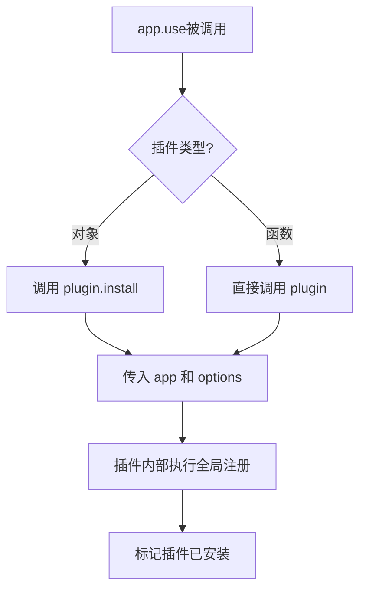
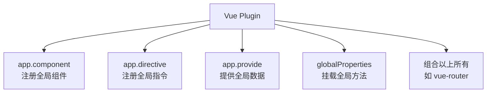

扫描[二维码](https://api2.cmdragon.cn/upload/cmder/20250304_012821924.jpg)关注或者微信搜一搜：`编程智域 前端至全栈交流与成长`

[发现1000+提升效率与开发的AI工具和实用程序](https://tools.cmdragon.cn/zh/apps?category=ai_chat)：https://tools.cmdragon.cn/zh/apps?category=ai_chat

## 一、你肯定用过插件，只是没意识到

如果你写过Vue项目，那你一定写过这样的代码：

```javascript
import { createApp } from "vue";
import App from "./App.vue";
import router from "./router";
import pinia from "./stores";

const app = createApp(App);

app.use(router); // 这就是在用插件！
app.use(pinia); // 这也是！

app.mount("#app");
```

`app.use(router)`、`app.use(pinia)`——这俩都是插件。vue-router是插件，Pinia也是插件。你可能一直把它们当"路由"和"状态管理"来用，但从Vue的角度看，它们都是通过**插件机制**来给Vue添加功能的。

## 二、插件到底是啥？一句话说清楚

官方定义：

> 插件（Plugins）是一种能为 Vue 添加全局功能的工具代码。

翻译成人话——**插件就是一段代码，它能在Vue应用启动的时候，往里面"塞"一些全局都能用的东西**。

这些东西可以是：

- 全局组件
- 全局指令
- 全局方法
- 全局属性
- 全局可注入的数据

你想想，平时你在组件里干的事——定义数据、写方法、注册子组件——这些都是"局部"的，只有当前组件能用。而插件干的事是"全局"的，装上之后整个应用都能用。

## 三、插件长啥样？

一个插件就两种写法：

### 写法一：带install方法的对象

```javascript
const myPlugin = {
  install(app, options) {
    // app 是 Vue 应用实例
    // options 是 app.use() 传进来的额外参数
  },
};
```

### 写法二：直接是一个函数

```javascript
function myPlugin(app, options) {
  // 跟上面效果一样
}
```

两种写法效果完全一样，看你喜欢哪种。对象写法更正式，函数写法更简洁。

## 四、app.use()背后干了啥？

当你调用`app.use(myPlugin, options)`的时候，Vue内部大概干了这么几件事：

1. 检查这个插件有没有被安装过（防止重复安装）
2. 判断插件是对象还是函数
3. 如果是对象，调用它的`install`方法，把`app`和`options`传进去
4. 如果是函数，直接调用它，同样传`app`和`options`
5. 标记这个插件已安装



所以`app.use()`本质上就是给你一个机会，让你在Vue应用创建之后、挂载之前，往里面"装东西"。

## 五、插件能干啥？四大场景

官方列了插件最常见的四种使用场景：

### 场景一：注册全局组件或自定义指令

```javascript
const myPlugin = {
  install(app) {
    // 注册全局组件
    app.component("MyButton", MyButtonComponent);
    app.component("MyInput", MyInputComponent);

    // 注册全局指令
    app.directive("focus", {
      mounted(el) {
        el.focus();
      },
    });
  },
};
```

装了这个插件之后，任何组件里都能直接用`<MyButton>`和`v-focus`，不用再单独导入了。

### 场景二：通过app.provide()提供全局可注入的数据

```javascript
const myPlugin = {
  install(app, options) {
    app.provide("config", options);
  },
};
```

然后任何组件都能通过`inject`拿到这个数据：

```javascript
const config = inject("config");
```

### 场景三：往globalProperties上挂全局方法

```javascript
const myPlugin = {
  install(app) {
    app.config.globalProperties.$hello = () => {
      console.log("Hello from plugin!");
    };
  },
};
```

然后任何组件里都能调用`this.$hello()`（选项式API）。

### 场景四：组合以上所有

像vue-router这种大型插件，它同时做了很多事——注册全局组件（`<RouterView>`、`<RouterLink>`）、提供全局注入（router实例）、往globalProperties上挂东西（`$router`、`$route`）。



## 六、插件 vs 组件：到底啥区别？

很多人搞不清插件和组件的区别，咱们来掰扯掰扯：

| 特性         | 组件                      | 插件                     |
| ------------ | ------------------------- | ------------------------ |
| 作用范围     | 局部的，用在哪里哪里生效  | 全局的，装上后全应用可用 |
| 注册方式     | 局部import或app.component | app.use()                |
| 能有模板吗   | 有，负责渲染UI            | 没有，不负责UI           |
| 能注册组件吗 | 不能                      | 能                       |
| 能注册指令吗 | 不能                      | 能                       |
| 什么时候用   | 需要渲染UI的时候          | 需要全局功能的时候       |

简单来说：**组件是"一块UI"，插件是"一套功能"**。组件管长啥样，插件管能干啥。

你可以把插件理解成一个"安装包"——它往你的Vue应用里安装了一些全局可用的能力。就像给手机装个App，装完之后你手机就多了一些功能。

## 七、什么时候该用插件？

### 该用的情况

- 你有一套功能需要在**整个应用**中使用（比如路由、状态管理、国际化）
- 你需要注册**多个全局组件或指令**（比如一个UI组件库）
- 你需要给整个应用提供**全局配置或工具方法**

### 不该用的情况

- 只在个别组件里用到的功能，直接写组件或Composable就行
- 只是为了省几行import代码就搞个插件，杀鸡用牛刀了
- 全局属性挂太多，会让应用变得难以理解和维护

官方也提醒了：

> 请谨慎使用全局属性，如果在整个应用中使用不同插件注入的太多全局属性，很容易让应用变得难以理解和维护。

## 课后 Quiz

### 问题 1

`app.use(router)`这行代码执行时，Vue内部做了什么？

#### 答案解析

Vue会检查router是否已被安装过，然后判断router是对象还是函数。如果是对象，调用它的`install`方法并传入app实例和额外选项；如果是函数，直接调用。执行完后标记该插件已安装，防止重复安装。

### 问题 2

插件的两种写法（对象和函数）有什么区别？

#### 答案解析

没有本质区别。对象写法需要有一个`install`方法，函数写法本身就是安装函数。两种方式接收的参数一样——第一个是app实例，第二个是`app.use()`传入的额外选项。选择哪种纯粹看个人喜好，对象写法更正式，函数写法更简洁。

### 问题 3

下面哪种情况适合用插件而不是Composable？

- A. 在多个组件中复用鼠标追踪逻辑
- B. 给整个应用添加国际化翻译功能
- C. 封装一个表单验证逻辑

#### 答案解析

B适合用插件。国际化是全局性的功能——翻译字典需要在整个应用中使用，翻译方法需要在所有模板中可用，这正好是插件的典型场景。A和C更适合用Composable，因为它们是局部性的逻辑复用，不需要全局注册。

## 常见报错解决方案

### 报错 1：`Cannot read property 'install' of undefined`

**错误场景**：

```javascript
import { myPlugin } from "./plugins/myPlugin";
app.use(myPlugin); // 💥 myPlugin是undefined
```

**报错原因**：
导入的插件是undefined，通常是因为导出方式不对。比如插件文件用了默认导出，但你用了命名导入。

**解决方案**：
检查导出和导入方式是否匹配：

```javascript
// 插件文件：默认导出
export default { install(app) { ... } }

// 导入时也要用默认导入
import myPlugin from './plugins/myPlugin' // ✅ 不带花括号
```

### 报错 2：插件安装了但全局属性访问不到

**错误场景**：

```javascript
// 插件里挂了全局方法
app.config.globalProperties.$hello = () => "hello";

// 组合式API中访问
const msg = this.$hello(); // 💥 setup中没有this
```

**报错原因**：
`<script setup>`中没有`this`，所以无法通过`this.$hello`访问globalProperties。

**解决方案**：
在组合式API中，通过`getCurrentInstance`访问：

```javascript
import { getCurrentInstance } from "vue";

const app = getCurrentInstance();
const msg = app.appContext.config.globalProperties.$hello();
```

或者更好的方式——用`app.provide()` + `inject()`代替globalProperties。

### 报错 3：插件被重复安装

**错误场景**：

```javascript
app.use(myPlugin);
app.use(myPlugin); // 会不会装两遍？
```

**报错原因**：
Vue内部会记录已安装的插件，同一个插件`app.use`多次只会执行一次install。但如果你传了不同的options，第二次的options会被忽略。

**解决方案**：
确保每个插件只`app.use`一次，把所有配置集中在一个地方。如果确实需要不同配置，考虑创建不同的插件实例。

## 参考链接

- Vue 3 官方文档 - 插件：https://vuejs.org/guide/reusability/plugins.html
- Vue 3 官方文档 - 应用 API：https://vuejs.org/api/application.html

余下文章内容请点击跳转至 个人博客页面 或者 扫描[二维码](https://api2.cmdragon.cn/upload/cmder/20250304_012821924.jpg)关注或者微信搜一搜：`编程智域 前端至全栈交流与成长`，阅读完整的文章：[Vue 3插件到底是啥？跟组件有啥不一样？](https://blog.cmdragon.cn/posts/p1a2b3c4d5e6f7a8b9c0d1e2f3a4b5c6/)

<details>
<summary>往期文章归档</summary>

- [Vue 3 静态与动态 Props 如何传递？TypeScript 类型约束有何必要？](https://blog.cmdragon.cn/posts/94ab48753b64780ca3ab7a7115ae8522/)
- [Vue 3中组件局部注册的优势与实现方式如何？](https://blog.cmdragon.cn/posts/dbf576e744870f6de26fd8a2e03e47da/)
- [如何在Vue3中优化生命周期钩子性能并规避常见陷阱？](https://blog.cmdragon.cn/posts/12d98b3b9ccd6c19a1b169d720ac5c80/)
- [Vue 3 Composition API生命周期钩子：如何实现从基础理解到高阶复用？](https://blog.cmdragon.cn/posts/8884e2b70287fcb263c57648eeb27419/)
- [Vue 3生命周期钩子实战指南：如何正确选择onMounted、onUpdated与onUnmounted的应用场景？](https://blog.cmdragon.cn/posts/883c6dbc50ae4183770a4462e0b8ae4d/)
- [Vue 3中生命周期钩子与响应式系统如何实现协同工作？](https://blog.cmdragon.cn/posts/70dad360ffa9dce14d0d69611b8cb019/)
- [Vue 3组件生命周期钩子的执行顺序与使用场景是什么？](https://blog.cmdragon.cn/posts/db44294a78dc9f666f67b053f6c83567/)
- [Vue组件全局注册与局部注册如何抉择？](https://blog.cmdragon.cn/posts/43ead630ea17da65d99ad2eb8188e472/)
- [Vue3组件化开发中，Props与Emits如何实现数据流转与事件协作？](https://blog.cmdragon.cn/posts/8cff7d2df113da66ea7be560c4d1d22a/)
- [Vue 3模板引用如何与其他特性协同实现复杂交互？](https://blog.cmdragon.cn/posts/331bf75d114ab09116eadfcdca602b58/)
- [Vue 3 v-for中模板引用如何实现高效管理与动态控制？](https://blog.cmdragon.cn/posts/cb380897ddc3578b180ecf8843c774c1/)
- [Vue 3的defineExpose：如何突破script setup组件默认封装，实现精准的父子通讯？](https://blog.cmdragon.cn/posts/202ae0f4acde7128e0e31baf63732fb5/)
- [Vue 3模板引用的生命周期时机如何把握？常见陷阱该如何避免？](https://blog.cmdragon.cn/posts/7d2a0f6555ecbe92afd7d2491c427463/)
- [Vue 3模板引用如何实现父组件与子组件的高效交互？](https://blog.cmdragon.cn/posts/3fb7bdd84128b7efaaa1c979e1f28dee/)
- [Vue中为何需要模板引用？又如何高效实现DOM与组件实例的直接访问？](https://blog.cmdragon.cn/posts/23f3464ba16c7054b4783cded50c04c6/)

</details>

<details>
<summary>免费好用的热门在线工具</summary>

- [多直播聚合器 - 应用商店 | By cmdragon](https://tools.cmdragon.cn/zh/apps/multi-live-aggregator)
- [Proto文件生成器 - 应用商店 | By cmdragon](https://tools.cmdragon.cn/zh/apps/proto-file-generator)
- [图片转粒子 - 应用商店 | By cmdragon](https://tools.cmdragon.cn/zh/apps/image-to-particles)
- [视频下载器 - 应用商店 | By cmdragon](https://tools.cmdragon.cn/zh/apps/video-downloader)
- [文件格式转换器 - 应用商店 | By cmdragon](https://tools.cmdragon.cn/zh/apps/file-converter)
- [M3U8在线播放器 - 应用商店 | By cmdragon](https://tools.cmdragon.cn/zh/apps/m3u8-player)
- [快图设计 - 应用商店 | By cmdragon](https://tools.cmdragon.cn/zh/apps/quick-image-design)
- [高级文字转图片转换器 - 应用商店 | By cmdragon](https://tools.cmdragon.cn/zh/apps/text-to-image-advanced)
- [RAID 计算器 - 应用商店 | By cmdragon](https://tools.cmdragon.cn/zh/apps/raid-calculator)
- [在线PS - 应用商店 | By cmdragon](https://tools.cmdragon.cn/zh/apps/photoshop-online)
- [Mermaid 在线编辑器 - 应用商店 | By cmdragon](https://tools.cmdragon.cn/zh/apps/mermaid-live-editor)
- [数学求解计算器 - 应用商店 | By cmdragon](https://tools.cmdragon.cn/zh/apps/math-solver-calculator)
- [智能提词器 - 应用商店 | By cmdragon](https://tools.cmdragon.cn/zh/apps/smart-teleprompter)
- [魔法简历 - 应用商店 | By cmdragon](https://tools.cmdragon.cn/zh/apps/magic-resume)
- [Image Puzzle Tool - 图片拼图工具 | By cmdragon](https://tools.cmdragon.cn/zh/apps/image-puzzle-tool)
- [字幕下载工具 - 应用商店 | By cmdragon](https://tools.cmdragon.cn/zh/apps/subtitle-downloader)
- [歌词生成工具 - 应用商店 | By cmdragon](https://tools.cmdragon.cn/zh/apps/lyrics-generator)
- [网盘资源聚合搜索 - 应用商店 | By cmdragon](https://tools.cmdragon.cn/zh/apps/cloud-drive-search)
- [ASCII字符画生成器 - 应用商店 | By cmdragon](https://tools.cmdragon.cn/zh/apps/ascii-art-generator)
- [JSON Web Tokens 工具 - 应用商店 | By cmdragon](https://tools.cmdragon.cn/zh/apps/jwt-tool)
- [Bcrypt 密码工具 - 应用商店 | By cmdragon](https://tools.cmdragon.cn/zh/apps/bcrypt-tool)
- [GIF 合成器 - 应用商店 | By cmdragon](https://tools.cmdragon.cn/zh/apps/gif-composer)
- [GIF 分解器 - 应用商店 | By cmdragon](https://tools.cmdragon.cn/zh/apps/gif-decomposer)
- [文本隐写术 - 应用商店 | By cmdragon](https://tools.cmdragon.cn/zh/apps/text-steganography)
- [CMDragon 在线工具 - 高级AI工具箱与开发者套件 | 免费好用的在线工具](https://tools.cmdragon.cn/zh)
- [应用商店 - 发现1000+提升效率与开发的AI工具和实用程序 | 免费好用的在线工具](https://tools.cmdragon.cn/zh/apps?category=trending)
- [CMDragon 更新日志 - 最新更新、功能与改进 | 免费好用的在线工具](https://tools.cmdragon.cn/zh/changelog)
- [支持我们 - 成为赞助者 | 免费好用的在线工具](https://tools.cmdragon.cn/zh/sponsor)
- [AI文本生成图像 - 应用商店 | 免费好用的在线工具](https://tools.cmdragon.cn/zh/apps/text-to-image-ai)
- [临时邮箱 - 应用商店 | 免费好用的在线工具](https://tools.cmdragon.cn/zh/apps/temp-email)
- [二维码解析器 - 应用商店 | 免费好用的在线工具](https://tools.cmdragon.cn/zh/apps/qrcode-parser)
- [文本转思维导图 - 应用商店 | 免费好用的在线工具](https://tools.cmdragon.cn/zh/apps/text-to-mindmap)
- [正则表达式可视化工具 - 应用商店 | 免费好用的在线工具](https://tools.cmdragon.cn/zh/apps/regex-visualizer)
- [文件隐写工具 - 应用商店 | 免费好用的在线工具](https://tools.cmdragon.cn/zh/apps/steganography-tool)
- [IPTV 频道探索器 - 应用商店 | 免费好用的在线工具](https://tools.cmdragon.cn/zh/apps/iptv-explorer)
- [快传 - 应用商店 | By cmdragon](https://tools.cmdragon.cn/zh/apps/snapdrop)
- [随机抽奖工具 - 应用商店 | 免费好用的在线工具](https://tools.cmdragon.cn/zh/apps/lucky-draw)
- [动漫场景查找器 - 应用商店 | 免费好用的在线工具](https://tools.cmdragon.cn/zh/apps/anime-scene-finder)
- [时间工具箱 - 应用商店 | 免费好用的在线工具](https://tools.cmdragon.cn/zh/apps/time-toolkit)
- [网速测试 - 应用商店 | 免费好用的在线工具](https://tools.cmdragon.cn/zh/apps/speed-test)
- [AI 智能抠图工具 - 应用商店 | 免费好用的在线工具](https://tools.cmdragon.cn/zh/apps/background-remover)
- [背景替换工具 - 应用商店 | 免费好用的在线工具](https://tools.cmdragon.cn/zh/apps/background-replacer)
- [艺术二维码生成器 - 应用商店 | 免费好用的在线工具](https://tools.cmdragon.cn/zh/apps/artistic-qrcode)
- [Open Graph 元标签生成器 - 应用商店 | 免费好用的在线工具](https://tools.cmdragon.cn/zh/apps/open-graph-generator)
- [图像对比工具 - 应用商店 | 免费好用的在线工具](https://tools.cmdragon.cn/zh/apps/image-comparison)
- [图片压缩专业版 - 应用商店 | 免费好用的在线工具](https://tools.cmdragon.cn/zh/apps/image-compressor)
- [密码生成器 - 应用商店 | 免费好用的在线工具](https://tools.cmdragon.cn/zh/apps/password-generator)
- [SVG优化器 - 应用商店 | 免费好用的在线工具](https://tools.cmdragon.cn/zh/apps/svg-optimizer)
- [调色板生成器 - 应用商店 | 免费好用的在线工具](https://tools.cmdragon.cn/zh/apps/color-palette)
- [在线节拍器 - 应用商店 | 免费好用的在线工具](https://tools.cmdragon.cn/zh/apps/online-metronome)
- [IP归属地查询 - 应用商店 | 免费好用的在线工具](https://tools.cmdragon.cn/zh/apps/ip-geolocation)
- [CSS网格布局生成器 - 应用商店 | 免费好用的在线工具](https://tools.cmdragon.cn/zh/apps/css-grid-layout)
- [邮箱验证工具 - 应用商店 | 免费好用的在线工具](https://tools.cmdragon.cn/zh/apps/email-validator)
- [书法练习字帖 - 应用商店 | 免费好用的在线工具](https://tools.cmdragon.cn/zh/apps/calligraphy-practice)
- [金融计算器套件 - 应用商店 | 免费好用的在线工具](https://tools.cmdragon.cn/zh/apps/finance-calculator-suite)
- [中国亲戚关系计算器 - 应用商店 | 免费好用的在线工具](https://tools.cmdragon.cn/zh/apps/chinese-kinship-calculator)
- [Protocol Buffer 工具箱 - 应用商店 | 免费好用的在线工具](https://tools.cmdragon.cn/zh/apps/protobuf-toolkit)
- [IP归属地查询 - 应用商店 | 免费好用的在线工具](https://tools.cmdragon.cn/zh/apps/ip-geolocation)
- [图片无损放大 - 应用商店 | 免费好用的在线工具](https://tools.cmdragon.cn/zh/apps/image-upscaler)
- [文本比较工具 - 应用商店 | 免费好用的在线工具](https://tools.cmdragon.cn/zh/apps/text-compare)
- [IP批量查询工具 - 应用商店 | 免费好用的在线工具](https://tools.cmdragon.cn/zh/apps/ip-batch-lookup)
- [域名查询工具 - 应用商店 | 免费好用的在线工具](https://tools.cmdragon.cn/zh/apps/domain-finder)
- [DNS工具箱 - 应用商店 | 免费好用的在线工具](https://tools.cmdragon.cn/zh/apps/dns-toolkit)
- [网站图标生成器 - 应用商店 | 免费好用的在线工具](https://tools.cmdragon.cn/zh/apps/favicon-generator)
- [XML Sitemap](https://tools.cmdragon.cn/sitemap_index.xml)

</details>
