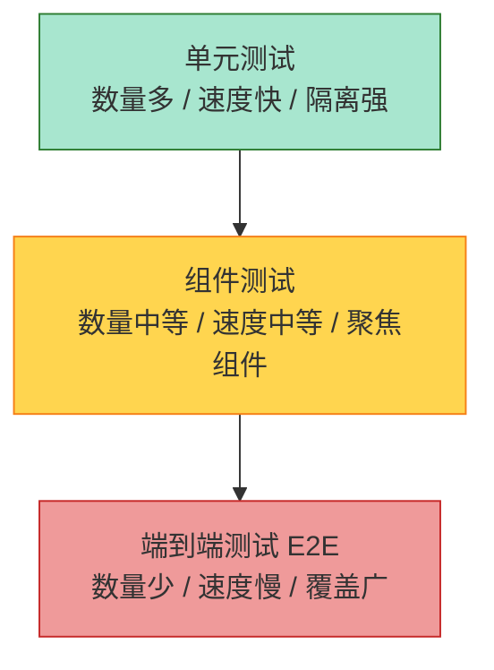
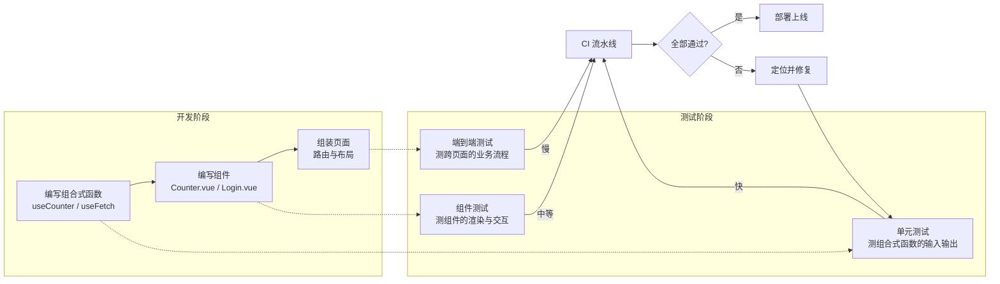

扫描[二维码](https://api2.cmdragon.cn/upload/cmder/20250304_012821924.jpg)关注或者微信搜一搜：`编程智域 前端至全栈交流与成长`

[发现1000+提升效率与开发的AI工具和实用程序](https://tools.cmdragon.cn/zh/apps?category=ai_chat)：https://tools.cmdragon.cn/


## 一、从工厂里的质检员说起

想象一下你去一家汽车厂参观。每辆车上装配线之前，零件要过一道质检关；组装到一半，质检员又会拿仪器量一量尺寸；整车下线之前，还得开到测试场跑两圈。要是没有这些环节，直接把车交给用户，出了事故谁负责？

前端项目其实也是一家"工厂"。我们写出来的函数、组件、页面，就是流水线上的一道道工序。如果没有质检员把关，代码一旦堆得多了，今天改个样式明天动个逻辑，保不齐哪天就埋下个雷。而自动化测试，就是给这个工厂配上一批不知疲倦的"质检员"，每次代码有变动，它们就自动上场，把已经验过的功能再过一遍，一旦哪里不对劲，立刻大声报警。

这章我们就来聊聊：为什么 Vue 3 项目值得花时间配这么一帮"质检员"，以及它们到底分几种工种，各自负责什么活儿。

## 二、为什么前端项目需要测试

很多人第一次接触测试，心里都会嘀咕："我自己点一点页面不就行了？为啥还要写一堆测试代码？"这个想法很正常，但只要项目稍微做大一点，你就会发现手动点测有几条硬伤。

### 1. 手动点测的三个尴尬

第一条，**记不住**。你的应用可能有几十个页面、上百个交互，今天改了登录逻辑，你能保证把所有可能受影响的地方都点一遍吗？人脑真的没那么靠谱。

第二条，**慢**。手动跑一遍完整流程可能要半小时，但自动化测试几十秒就跑完了。在频繁迭代的场景下，这点时间差会累计成巨大的开发成本。

第三条，**容易漏**。人点东西的时候会有"路径依赖"，习惯了走某条路，就不太会去试那些边边角角。而测试用例只要写进去了，每次都会被老老实实执行。

### 2. 自动化测试带来的三样东西

**第一样，预防无意引入的 bug。** 你改了 A 模块，结果 B 模块悄悄坏了，这种"牵一发而动全身"的事在前端特别常见。有了测试，CI 一跑，红灯立刻告诉你哪里出问题了。

**第二样，鼓励你把代码写得更"可测"。** 这一点其实很多人没意识到。当你开始写测试，你会发现那些动辄几百行、塞满副作用的大函数特别难测。于是你会本能地把它拆成一个个小而纯的函数、独立的组合式函数（composables）。代码结构因此变得更健康。换句话说，测试不只是验证工具，它还是一面镜子，照出你代码设计上的毛病。

**第三样，给团队协作兜底。** 多人协作时，谁都不敢说自己绝对理解别人写的每一行代码。测试用例就像一份"活文档"，它告诉你这个函数期望输入什么、应该输出什么。新人改代码时心里有底，reviewer 看代码时也更有信心。

官方文档里说得很直白：自动化测试能够预防无意引入的 bug，并鼓励开发者将应用分解为可测试、可维护的函数、模块、类和组件。这两句话听着平淡，但真正写过几年代码的人，才会体会到它的分量。

## 三、什么时候开始写测试

答案就俩字：**越早越好**。

听起来像废话，但这是踩过坑的人的真心话。Vue 官方文档也是这么建议的：拖得越久，应用就会有越多的依赖和复杂性，补测试的成本就越高。

打个比方，这就像盖楼。地基刚打好的时候，你想加几根承重柱，几锤子的事；等楼盖到二十层了，你再想动地基，那叫拆楼重建。

实际项目里这种感受特别明显：

- 项目刚开始，函数都没几个，写测试轻轻松松；
- 等做到一半，业务逻辑已经缠成一团，你想给某个函数补测试，发现它依赖了一堆全局状态、定时器、网络请求，光把这些 mock 掉就够你喝一壶；
- 等项目上线了，历史包袱更重，补测试几乎成了"先有鸡还是先有蛋"的难题。

所以哪怕你现在只是写个小 demo，也建议早点把测试环境搭起来。哪怕只测一两个核心函数，也是一种"肌肉记忆"的训练，等你真做大了，写测试就是顺手的事。

## 四、测试的三种类型

这是这一章的重头戏。Vue 官方把测试分成三大类：单元测试、组件测试、端到端测试。它们各自站在不同的"高度"上看你的应用，分工明确，谁也替代不了谁。

### 1. 单元测试：质检员里最细致的那位

单元测试检查的是**给定函数、类或组合式函数的输入，是否产生预期的输出或副作用**。它是最底层、最细颗粒度的测试，就像是质检员拿着放大镜一个零件一个零件地看。

它的特点是：

- 跑得快，通常毫秒级；
- 隔离性强，被测对象不依赖外部环境（数据库、网络、DOM）；
- 数量多，一个项目里几百上千个单元测试很正常。

咱们看一个 Vue 官方文档里的经典例子，一个 `increment` 函数：

```js
// helpers.js
// 一个简单的自增函数，current 是当前值，max 是上限，默认 10
export function increment(current, max = 10) {
  // 如果当前值还没到上限，就加 1
  if (current < max) {
    return current + 1
  }
  // 到了上限就原样返回，不越界
  return current
}
```

对应的测试文件长这样：

```js
// helpers.spec.js
// 引入要测的函数
import { increment } from './helpers'

// describe 把一组相关的测试用例包在一起，方便组织
describe('increment', () => {
  // 第一个用例：正常情况下应该加 1
  test('increments the current number by 1', () => {
    // expect 是断言，toBe 检查是否严格相等
    expect(increment(0, 10)).toBe(1)
  })

  // 第二个用例：到达上限时不再增加
  test('does not increment the current number over the max', () => {
    expect(increment(10, 10)).toBe(10)
  })

  // 第三个用例：不传 max 时默认是 10
  test('has a default max of 10', () => {
    expect(increment(10)).toBe(10)
  })
})
```

你看，每个用例都在验证一个明确的小点。这种"小步快跑"的方式让定位问题特别容易——哪个用例红了，问题就出在它对应的那段逻辑里。

在 Vue 3 项目里，单元测试最常用来测什么？**组合式函数**。因为好的组合式函数本来就是"输入 → 输出"的纯逻辑，天然适合单元测试。比如一个 `useCounter`、一个 `useFetch`，都可以脱离组件单独测。

### 2. 组件测试：把组件当成一个整体来验

单元测试管的是零件，组件测试管的是**装好的小部件**。它检查组件是否正常挂载和渲染、是否可以与之互动、表现是否符合预期。

跟单元测试比，组件测试复杂在哪？

第一，它要面对 DOM。组件渲染出来是一堆标签，你得用选择器去查里面有没有某个文字、某个 class。

第二，它要处理交互。点击按钮、输入文字、触发事件，这些动作都得模拟。

第三，它经常要 mock 子组件或者依赖。比如一个登录组件依赖了路由和接口，测试时你得把这些"环境"准备好。

举个 Vue 3 的组件测试例子，假设我们有个计数器组件：

```vue
<!-- Counter.vue -->
<script setup>
import { ref } from 'vue'

// 定义一个响应式的计数器，初始值 0
const count = ref(0)

// 点击时自增
function handleClick() {
  count.value++
}
</script>

<template>
  <!-- 显示当前计数 -->
  <p>当前计数：{{ count }}</p>
  <!-- 点击按钮触发自增 -->
  <button @click="handleClick">加一</button>
</template>
```

测试它的时候，我们关注三件事：渲染出来对不对、交互后对不对、props/emits 对不对。伪代码大概是这样：

```js
// Counter.spec.js
import { mount } from '@vue/test-utils'
import Counter from './Counter.vue'

describe('Counter', () => {
  // 测渲染：刚挂载时应该显示 0
  test('renders initial count', () => {
    const wrapper = mount(Counter)
    // 找到 p 标签，检查文本内容
    expect(wrapper.text()).toContain('当前计数：0')
  })

  // 测交互：点击按钮后应该变成 1
  test('increments count on button click', async () => {
    const wrapper = mount(Counter)
    // 模拟点击
    await wrapper.find('button').trigger('click')
    // 检查文本是否更新
    expect(wrapper.text()).toContain('当前计数：1')
  })
})
```

这里有个细节值得留意：`trigger('click')` 前面加了 `await`。因为 Vue 的更新是异步的，触发事件后要等下一个 tick，DOM 才会刷新。这是组件测试里非常常见的坑，后面报错章节还会提到。

### 3. 端到端测试：站在用户的角度走一遍

端到端测试（End-to-End，简称 E2E）检查的是**跨越多个页面的功能**。它对生产构建的 Vue 应用进行实际网络请求，模拟真实用户的操作路径。

如果说单元测试是质检员拿放大镜看零件，组件测试是把小部件装好测一测，那 E2E 就是把整车开到测试场跑一圈。它最接近真实用户体验，但也最"重"。

E2E 测试的特点：

- 跑得慢，一个用例可能要好几秒；
- 要起真实的服务、真实的浏览器；
- 数量不宜多，聚焦关键业务流程。

典型场景比如：用户打开登录页 → 输入账号密码 → 点登录 → 跳到首页 → 看到欢迎信息。这一整条链路，就是 E2E 测试要覆盖的。

它的价值在于：哪怕你的单元测试和组件测试都绿了，也可能出现"拼起来不工作"的情况——比如路由配置错了、接口字段对不上、构建产物有问题。E2E 能把这些"集成层面"的问题揪出来。

## 五、测试金字塔：三种测试怎么搭配

光知道有三种测试还不够，关键是怎么用。业界有个老概念叫"测试金字塔"，它形象地说明了各层测试的数量比例。



金字塔从下到上分别是单元测试、组件测试、端到端测试。底层最多，顶层最少。为什么这么排？

- 底层的单元测试又快又便宜，可以多写，覆盖各种边界条件；
- 中间的组件测试验证组装是否正确，数量适中；
- 顶层的 E2E 跑得慢、维护成本高，只挑最核心的业务流程来写。

在 Vue 3 应用里，这三层的分工可以这样理解：

| 层级 | 主要被测对象 | 典型工具 | 关注点 |
|------|------------|---------|--------|
| 单元测试 | 组合式函数、工具函数、Pinia store 的纯逻辑 | Vitest | 输入输出、边界条件 |
| 组件测试 | 单个 Vue 组件的渲染与交互 | Vitest + @vue/test-utils | 挂载、props、emits、用户操作 |
| 端到端测试 | 跨页面的业务流程 | Playwright / Cypress | 真实浏览器下的完整链路 |

需要提醒的是，金字塔不是铁律，有些团队会根据项目特点调整成"测试奖杯"之类的形状，把组件测试的比重加大。但核心思路不变：**底层的快测试多做，顶层的慢测试精做**。

下面这张流程图把三种测试在 Vue 应用生命周期里的位置串起来，帮你看清它们各自在哪个环节发挥作用：



## 六、课后 Quiz

### Quiz 1

题目：项目已经上线三个月了，业务逻辑缠得比较紧，老板突然要求"补上自动化测试"。按照官方建议，下面哪种思路最合理？

A. 从最复杂的页面开始，先写端到端测试覆盖核心流程
B. 从最容易拆分、最纯的工具函数和组合式函数开始补单元测试
C. 一次性把所有页面都补上组件测试，做到全覆盖
D. 先不写测试，等下个版本重构时再说

**答案解析**：选 B。官方明确建议"越早越好"，而面对历史包袱重的项目，最务实的做法是从"投入产出比最高"的地方入手——也就是那些逻辑独立、依赖少的纯函数和组合式函数。这部分测试写起来快、维护成本低，能迅速建立起一道安全网。A 选项 E2E 测试维护成本高，不适合一上来就大范围铺开；C 选项"全覆盖"听起来美好，但历史代码往往可测性差，硬补会拖垮团队；D 选项是典型的拖延，越拖越难。

### Quiz 2

题目：下面这段 `increment` 函数有三个测试用例，如果有人把 `if (current < max)` 改成了 `if (current <= max)`，哪些用例会失败？

```js
export function increment(current, max = 10) {
  if (current < max) {
    return current + 1
  }
  return current
}
```

A. 只有"increments the current number by 1"会失败
B. 只有"does not increment the current number over the max"会失败
C. "has a default max of 10"和"does not increment the current number over the max"都会失败
D. 都不会失败

**答案解析**：选 C。改完后，当 `current` 等于 `max` 时也会进入自增分支。原用例 `increment(10, 10)` 期望返回 `10`，改后会返回 `11`，所以"does not increment the current number over the max"会失败；`increment(10)` 也走默认 max=10 的路径，同样期望返回 `10`，改后返回 `11`，所以"has a default max of 10"也会失败。而第一个用例 `increment(0, 10)` 期望返回 `1`，改后仍然返回 `1`，不受影响。这个例子很好地说明了"边界条件用例"的价值——它们能精准捕获这种 off-by-one 的错误。

### Quiz 3

题目：下面哪种情况最适合用端到端测试来覆盖？

A. 验证一个 `formatDate` 工具函数在不同时区下的输出
B. 验证一个 `TodoList` 组件点击"删除"按钮后列表是否更新
C. 验证用户从注册到登录再到下单的完整业务流程
D. 验证一个 Pinia store 的 `addToCart` action 是否正确修改了状态

**答案解析**：选 C。E2E 测试的核心价值在于验证"跨越多个页面的功能"和"集成层面的问题"，C 选项正好是一条横跨多个页面、涉及多个组件协同的业务链路，是 E2E 的典型场景。A 是纯函数，用单元测试最合适；B 是单个组件的交互，用组件测试最合适；D 是 store 内部逻辑，属于单元测试范畴。记住一个判断原则：能用更轻的测试覆盖的，就别用更重的；E2E 留给那些"非整条链路跑一遍验不出问题"的场景。

## 七、常见报错解决方案

### 报错 1：测试文件运行后报 "No test files found"

**产生原因**：测试框架找不到测试文件。最常见的原因是文件命名不符合约定。以 Vitest 为例，测试文件名必须包含 `.test.` 或 `.spec.`，比如 `helpers.spec.js` 或 `counter.test.ts`。如果你起名叫 `helpers.test.js.bak` 或者 `helpers.spec.md`，都不会被识别。另一个常见原因是配置文件里的 `include` 或 `test.match` 写错了路径。

**解决办法**：

第一步，确认文件名。把文件改成 `xxx.spec.js` 或 `xxx.test.ts` 这种标准命名。

第二步，检查 `vitest.config.ts`（或 `vite.config.ts` 里的 `test` 字段）的 `include` 配置，确保它指向了你测试文件所在的目录。默认一般是 `['**/*.{test,spec}.?(c|m)[jt]s?(x)']`。

第三步，如果你是手动执行 `npx vitest run`，注意命令运行的工作目录，路径不对也会找不到文件。

**预防建议**：项目一开始就把测试文件的命名约定写进团队规范，比如"工具函数用 `.test.ts`，组件用 `.spec.ts`"。新建文件时让编辑器配个代码片段，省得每次手敲还敲错。

### 报错 2：组件测试里 `wrapper.text()` 拿不到更新后的内容

**产生原因**：Vue 的响应式更新是异步的。当你用 `trigger('click')` 触发了一个事件，组件内部的状态虽然改了，但 DOM 的重新渲染要等到下一个事件循环的 tick。如果你在 `trigger` 之后立刻读 `wrapper.text()`，拿到的还是旧值。这是组件测试里最常见的"时序坑"。

**解决办法**：在触发事件后加 `await`，让测试等待 Vue 完成 DOM 更新。改成这样：

```js
test('increments count on button click', async () => {
  const wrapper = mount(Counter)
  // 注意这里的 await，等 DOM 更新完成
  await wrapper.find('button').trigger('click')
  // 现在拿到的就是更新后的文本
  expect(wrapper.text()).toContain('当前计数：1')
})
```

如果一次触发多个事件或者有多个异步操作，可以用 `await nextTick()` 或者 `await flushPromises()`（来自 `@vue/test-utils`）来显式等待。

**预防建议**：养成习惯——凡是涉及交互的组件测试用例，回调函数一律写成 `async`，凡是 `trigger`、`setValue` 这类操作一律加 `await`。宁可多等一个 tick，也别为了省那几个字符埋雷。

### 报错 3：单元测试报 "Cannot read properties of undefined (reading 'xxx')"

**产生原因**：被测对象依赖了某个外部环境，但测试里没准备。比如一个组合式函数内部用了 `window.localStorage`，而你的测试环境是 Node.js（jsdom 没有完整实现 localStorage），或者它依赖了某个全局变量、某个被 mock 掉的模块但 mock 不完整，导致读到 `undefined`。

**解决办法**：

第一步，看报错堆栈，定位是哪一行代码读到了 `undefined`。

第二步，判断这个依赖是不是被测逻辑"真正需要"的。如果是核心依赖，就在测试里把它准备好。比如需要 `localStorage`，可以在 `beforeEach` 里手动挂一个：

```js
// 在每个测试前，给 globalThis 挂一个简易的 localStorage
beforeEach(() => {
  const store = {}
  globalThis.localStorage = {
    getItem: (key) => store[key] ?? null,
    setItem: (key, value) => { store[key] = String(value) },
    removeItem: (key) => { delete store[key] },
    clear: () => { Object.keys(store).forEach(k => delete store[k]) }
  }
})
```

第三步，如果这个依赖只是"顺手用了一下"，跟当前用例无关，可以用 `vi.stubGlobal` 或 `vi.mock` 把它 stub 掉，返回一个占位对象。

**预防建议**：写组合式函数的时候，尽量把"对外部环境的依赖"收敛到一个地方，甚至通过参数传入。这样测试时替换起来特别方便。这其实就是"可测性设计"的体现——为测试留口子，本身就是好架构的信号。

## 八、参考链接

- 参考链接：https://vuejs.org/guide/scaling-up/testing.html
- 参考链接：https://vitest.dev/guide/
- 参考链接：https://vuejs.org/guide/quick-start.html

余下文章内容请点击跳转至 个人博客页面 或者 扫描[二维码](https://api2.cmdragon.cn/upload/cmder/20250304_012821924.jpg)关注或者微信搜一搜：`编程智域 前端至全栈交流与成长`，阅读完整的文章：[Vue 3测试入门第一章：为什么前端项目需要测试？测试类型与策略全解析](https://blog.cmdragon.cn/posts/3a7f9c2e8b1d4f60/)


<details>
<summary>往期文章归档</summary>

- [Vue 3 静态与动态 Props 如何传递？TypeScript 类型约束有何必要？](https://blog.cmdragon.cn/posts/94ab48753b64780ca3ab7a7115ae8522/)
- [Vue 3中组件局部注册的优势与实现方式如何？](https://blog.cmdragon.cn/posts/dbf576e744870f6de26fd8a2e03e47da/)
- [如何在Vue3中优化生命周期钩子性能并规避常见陷阱？](https://blog.cmdragon.cn/posts/12d98b3b9ccd6c19a1b169d720ac5c80/)
- [Vue 3 Composition API生命周期钩子：如何实现从基础理解到高阶复用？](https://blog.cmdragon.cn/posts/8884e2b70287fcb263c57648eeb27419/)
- [Vue 3生命周期钩子实战指南：如何正确选择onMounted、onUpdated与onUnmounted的应用场景？](https://blog.cmdragon.cn/posts/883c6dbc50ae4183770a4462e0b8ae4d/)
- [Vue 3中生命周期钩子与响应式系统如何实现协同工作？](https://blog.cmdragon.cn/posts/70dad360ffa9dce14d0d69611b8cb019/)
- [Vue 3组件生命周期钩子的执行顺序与使用场景是什么？](https://blog.cmdragon.cn/posts/db44294a78dc9f666f67b053f6c83567/)
- [Vue组件全局注册与局部注册如何抉择？](https://blog.cmdragon.cn/posts/43ead630ea17da65d99ad2eb8188e472/)
- [Vue3组件化开发中，Props与Emits如何实现数据流转与事件协作？](https://blog.cmdragon.cn/posts/8cff7d2df113da66ea7be560c4d1d22a/)
- [Vue 3模板引用如何与其他特性协同实现复杂交互？](https://blog.cmdragon.cn/posts/331bf75d114ab09116eadfcdca602b58/)
- [Vue 3 v-for中模板引用如何实现高效管理与动态控制？](https://blog.cmdragon.cn/posts/cb380897ddc3578b180ecf8843c774c1/)
- [Vue 3的defineExpose：如何突破script setup组件默认封装，实现精准的父子通讯？](https://blog.cmdragon.cn/posts/202ae0f4acde7128e0e31baf63732fb5/)
- [Vue 3模板引用的生命周期时机如何把握？常见陷阱该如何避免？](https://blog.cmdragon.cn/posts/7d2a0f6555ecbe92afd7d2491c427463/)
- [Vue 3模板引用如何实现父组件与子组件的高效交互？](https://blog.cmdragon.cn/posts/3fb7bdd84128b7efaaa1c979e1f28dee/)
- [Vue中为何需要模板引用？又如何高效实现DOM与组件实例的直接访问？](https://blog.cmdragon.cn/posts/23f3464ba16c7054b4783cded50c04c6/)
- [Vue 3 watch与watchEffect如何区分使用？常见陷阱与性能优化技巧有哪些？](https://blog.cmdragon.cn/posts/68a26cc0023e4994a6bc54fb767365c8/)
- [Vue3侦听器实战：组件与Pinia状态监听如何高效应用？](https://blog.cmdragon.cn/posts/fd4695f668d64332dda9962c24214f32/)
- [Vue 3中何时用watch，何时用watchEffect？核心区别及性能优化策略是什么？](https://blog.cmdragon.cn/posts/cdbbb1837f8c093252e61f46dbf0a2e7/)
- [Vue 3中如何有效管理侦听器的暂停、恢复与副作用清理？](https://blog.cmdragon.cn/posts/09551ab614c463a6d6ca69818e8c2d52/)
- [Vue 3 watchEffect：如何实现响应式依赖的自动追踪与副作用管理？](https://blog.cmdragon.cn/posts/b7bca5d20f628ac09f7192ad935ef664/)
- [Vue 3 watch如何利用immediate、once、deep选项实现初始化、一次性与深度监听？](https://blog.cmdragon.cn/posts/2c6cdb100a20f10c7e7d4413617c7ea9/)
- [Vue 3中watch如何高效监听多数据源、计算结果与数组变化？](https://blog.cmdragon.cn/posts/757a1728bc1b9c0c8b317b0354d85568/)
- [Vue 3中watch监听ref和reactive的核心差异与注意事项是什么？](https://blog.cmdragon.cn/posts/8e70552f0f61e0dc8c7f567a2d272345/)
- [Vue3中Watch与watchEffect的核心差异及适用场景是什么？](https://blog.cmdragon.cn/posts/dde70ab90dc5062c435e0501f5a6e7cb/)
- [Vue 3自定义指令如何赋能表单自动聚焦与防抖输入的高效实现？](https://blog.cmdragon.cn/posts/1f5ed5047850ed52c0fd0386f76bd4ae/)
- [Vue3中如何优雅实现支持多绑定变量和修饰符的双向绑定组件？](https://blog.cmdragon.cn/posts/e3d4e128815ad731611b8ef29e37616b/)
- [Vue 3表单验证如何从基础规则到异步交互构建完整验证体系？](https://blog.cmdragon.cn/posts/7d1caedd822f70542aa0eed67e30963b/)
- [Vue3响应式系统如何支撑表单数据的集中管理、动态扩展与实时计算？](https://blog.cmdragon.cn/posts/3687a5437ab56cb082b5b813d5577a40/)
- [Vue3跨组件通信中，全局事件总线与provide/inject该如何正确选择？](https://blog.cmdragon.cn/posts/ad67c4eb6d76cf7707bdfe6a8146c34f/)
- [Vue3表单事件处理：v-model如何实现数据绑定、验证与提交？](https://blog.cmdragon.cn/posts/1c1e80d697cca0923f29ec70ebb8ccd1/)
- [Vue应用如何基于DOM事件传播机制与事件修饰符实现高效事件处理？](https://blog.cmdragon.cn/posts/b990828143d70aa87f9aa52e16692e48/)
- [Vue3中如何在调用事件处理函数时同时传递自定义参数和原生DOM事件？参数顺序有哪些注意事项？](https://blog.cmdragon.cn/posts/b44316e0866e9f2e6aef927dbcf5152b/)
- [从捕获到冒泡：Vue事件修饰符如何重塑事件执行顺序？](https://blog.cmdragon.cn/posts/021636c2a06f5e2d3d01977a12ddf559/)
- [Vue事件处理：内联还是方法事件处理器，该如何抉择？](https://blog.cmdragon.cn/posts/b3cddf7023ab537e623a61bc01dab6bb/)
- [Vue事件绑定中v-on与@语法如何取舍？参数传递与原生事件处理有哪些实战技巧？](https://blog.cmdragon.cn/posts/bd4d9607ce1bc34cc3bda0a1a46c40f6/)
- [Vue 3中列表排序时为何必须复制数组而非直接修改原始数据？](https://blog.cmdragon.cn/posts/a5f2bacb74476fd7f5e02bb3f1ba6b2b/)
- [Vue虚拟滚动如何将列表DOM数量从万级降至十位数？](https://blog.cmdragon.cn/posts/d3b06b57fb7f126787e6ed22dce1e341/)
- [Vue3中v-if与v-for直接混用为何会报错？计算属性如何解决优先级冲突？](https://blog.cmdragon.cn/posts/3100cc5a2e16f8dac36f722594e6af32/)
- [为何在Vue3递归组件中必须用v-if判断子项存在？](https://blog.cmdragon.cn/posts/455dc2d47c38d12c1cf350e490041e8b/)
- [Vue3列表渲染中，如何用数组方法与计算属性优化v-for的数据处理？](https://blog.cmdragon.cn/posts/3f842bbd7ba0f9c91151b983bf784c8b/)
- [Vue v-for的key：为什么它能解决列表渲染中的“玄学错误”？选错会有哪些后果？](https://blog.cmdragon.cn/posts/1eb3ffac668a743843b5ea1738301d40/)
- [Vue3中v-for与v-if为何不能直接共存于同一元素？](https://blog.cmdragon.cn/posts/138b13c5341f6a1fa9015400433a3611/)
- [Vue3中v-if与v-show的本质区别及动态组件状态保持的关键策略是什么？](https://blog.cmdragon.cn/posts/0242a94dc552b93a1bc335ac4fc33db5/)
 - [Vue3中v-show如何通过CSS修改display属性控制条件显示？与v-if的应用场景该如何区分？](https://blog.cmdragon.cn/posts/97c66a18ae0e9b57c6a69b8b3a41ddf6/)
- [Vue3条件渲染中v-if系列指令如何合理使用与规避错误？](https://blog.cmdragon.cn/posts/8a1ddfac64b25062ac56403e4c1201d2/)
- [Vue3动态样式控制：ref、reactive、watch与computed的应用场景与区别是什么？](https://blog.cmdragon.cn/posts/218c3a59282c3b757447ee08a01937bb/)
- [Vue3中动态样式数组的后项覆盖规则如何与计算属性结合实现复杂状态样式管理？](https://blog.cmdragon.cn/posts/1bab953e41f66ac53de099fa9fe76483/)
- [Vue浅响应式如何解决深层响应式的性能问题？适用场景有哪些？ - cmdragon's Blog](https://blog.cmdragon.cn/posts/c85e1fe16a7ae45e965b4e2df4d9d2f4/)
- [Vue 3组合式API中ref与reactive的核心响应式差异及使用最佳实践是什么？ - cmdragon's Blog](https://blog.cmdragon.cn/posts/be04b02d2723994632de0d4ca22a3391/)
- [Vue 3组合式API中ref与reactive的核心响应式差异及使用最佳实践是什么？ - cmdragon's Blog](https://blog.cmdragon.cn/posts/be04b02d2723994632de0d4ca22a3391/)
- [Vue3响应式系统中，对象新增属性、数组改索引、原始值代理的问题如何解决？ - cmdragon's Blog](https://blog.cmdragon.cn/posts/a0af08dd60a37b9a890a9957f2cbfc9f/)
- [Vue 3中watch侦听器的正确使用姿势你掌握了吗？深度监听、与watchEffect的差异及常见报错解析 - cmdragon's Blog](https://blog.cmdragon.cn/posts/bc287e1e36287afd90750fd907eca85e/)
- [Vue响应式声明的API差异、底层原理与常见陷阱你都搞懂了吗 - cmdragon's Blog](https://blog.cmdragon.cn/posts/654b9447ef1ba7ec1126a1bc26a4726d/)
- [Vue响应式声明的API差异、底层原理与常见陷阱你都搞懂了吗 - cmdragon's Blog](https://blog.cmdragon.cn/posts/654b9447ef1ba7ec1126a1bc26a4726d/)
- [为什么Vue 3需要ref函数？它的响应式原理与正确用法是什么？ - cmdragon's Blog](https://blog.cmdragon.cn/posts/c405a8d9950af5b7c63b56c348ac36b6/)
- [Vue 3中reactive函数如何通过Proxy实现响应式？使用时要避开哪些误区？ - cmdragon's Blog](https://blog.cmdragon.cn/posts/a7e9abb9691a81e4404d9facabe0f7c3/)
- [Vue3响应式系统的底层原理与实践要点你真的懂吗？ - cmdragon's Blog](https://blog.cmdragon.cn/posts/bd995ea45161727597fb85b62566c43d/)
- [Vue 3模板如何通过编译三阶段实现从声明式语法到高效渲染的跨越 - cmdragon's Blog](https://blog.cmdragon.cn/posts/53e3f270a80675df662c6857a3332c0f/)
- [快速入门Vue模板引用：从收DOM“快递”到调子组件方法，你玩明白了吗？ - cmdragon's Blog](https://blog.cmdragon.cn/posts/ddbce4f2a23aa72c96b1c0473900321e/)
- [快速入门Vue模板里的JS表达式有啥不能碰？计算属性为啥比方法更能打？ - cmdragon's Blog](https://blog.cmdragon.cn/posts/23a2d5a334e15575277814c16e45df50/)
- [快速入门Vue的v-model表单绑定：语法糖、动态值、修饰符的小技巧你都掌握了吗？ - cmdragon's Blog](https://blog.cmdragon.cn/posts/6be38de6382e31d282659b689c5b17f0/)
- [快速入门Vue3事件处理的挑战题：v-on、修饰符、自定义事件你能通关吗？ - cmdragon's Blog](https://blog.cmdragon.cn/posts/60ce517684f4a418f453d66aa805606c/)
- [快速入门Vue3的v-指令：数据和DOM的“翻译官”到底有多少本事？ - cmdragon's Blog](https://blog.cmdragon.cn/posts/e4ae7d5e4a9205bb11b2baccb230c637/)
- [快速入门Vue3，插值、动态绑定和避坑技巧你都搞懂了吗？ - cmdragon's Blog](https://blog.cmdragon.cn/posts/999ce4fb32259ff4fbf4bf7bcb851654/)
- [想让PostgreSQL快到飞起？先找健康密码还是先换引擎？ - cmdragon's Blog](https://blog.cmdragon.cn/posts/a6997d81b49cd232b87e1cf603888ad1/)
- [想让PostgreSQL查询快到飞起？分区表、物化视图、并行查询这三招灵不灵？ - cmdragon's Blog](https://blog.cmdragon.cn/posts/1fee7afbb9abd4540b8aa9c141d6845d/)
- [子查询总拖慢查询？把它变成连接就能解决？ - cmdragon's Blog](https://blog.cmdragon.cn/posts/79c590fbd87ece535b11a71c9667884f/)
- [PostgreSQL全表扫描慢到崩溃？建索引+改查询+更统计信息三招能破？ - cmdragon's Blog](https://blog.cmdragon.cn/posts/748cdac2536008199abf8a8a2cd0ec85/)
- [复杂查询总拖后腿？PostgreSQL多列索引+覆盖索引的神仙技巧你get没？ - cmdragon's Blog](https://blog.cmdragon.cn/posts/32ca943703226d317d4276a8fb53b0dd/)
- [只给表子集建索引？用函数结果建索引？PostgreSQL这俩操作凭啥能省空间又加速？ - cmdragon's Blog](https://blog.cmdragon.cn/posts/ca93f1d53aa910e7ba5ffd8df611c12b/)
- [B-tree索引像字典查词一样工作？那哪些数据库查询它能加速，哪些不能？ - cmdragon's Blog](https://blog.cmdragon.cn/posts/f507856ebfddd592448813c510a53669/)
- [想抓PostgreSQL里的慢SQL？pg_stat_statements基础黑匣子和pg_stat_monitor时间窗，谁能帮你更准揪出性能小偷？ - cmdragon's Blog](https://blog.cmdragon.cn/posts/b2213bfcb5b88a862f2138404c03d596/)
- [PostgreSQL的“时光机”MVCC和锁机制是怎么搞定高并发的？ - cmdragon's Blog](https://blog.cmdragon.cn/posts/26614eb7da6c476dde41d367ad888d2f/)
- [PostgreSQL性能暴涨的关键？内存IO并发参数居然要这么设置？ - cmdragon's Blog](https://blog.cmdragon.cn/posts/69f99bc6972a860d559c74aad7280da4/)
- [大表查询慢到翻遍整个书架？PostgreSQL分区表教你怎么“分类”才高效](https://blog.cmdragon.cn/posts/7b7053f392147a8b3b1a16bebeb08d0a/)
- [PostgreSQL 查询慢？是不是忘了优化 GROUP BY、ORDER BY 和窗口函数？ - cmdragon's Blog](https://blog.cmdragon.cn/posts/c856e3cb073822349f3bf2d29995dcfc/)
- [PostgreSQL里的子查询和CTE居然在性能上“掐架”？到底该站哪边？ - cmdragon's Blog](https://blog.cmdragon.cn/posts/c096347d18e67b7431faacd2c4757093/)
- [PostgreSQL选Join策略有啥小九九？Nested Loop/Merge/Hash谁是它的菜？ - cmdragon's Blog](https://blog.cmdragon.cn/posts/2eca89463454fd4250d7b66243b9fe5a/)
- [PostgreSQL新手SQL总翻车？这7个性能陷阱你踩过没？ - cmdragon's Blog](https://blog.cmdragon.cn/posts/068ecb772a87d7df20a8c9fb4b233f8e/)
- [PostgreSQL索引选B-Tree还是GiST？“瑞士军刀”和“多面手”的差别你居然还不知道？ - cmdragon's Blog](https://blog.cmdragon.cn/posts/d498f63cd0a2d5a77e445c688a8b88db/)
- [想知道数据库怎么给查询“算成本选路线”？EXPLAIN能帮你看明白？ - cmdragon's Blog](https://blog.cmdragon.cn/posts/9101b75bdec6faea9b35d54f14e37f36/)
- [PostgreSQL处理SQL居然像做蛋糕？解析到执行的4步里藏着多少查询优化的小心机？ - cmdragon's Blog](https://blog.cmdragon.cn/posts/d527f8ebb6e3dae2c7dfe4c8d8979444/)
- [PostgreSQL备份不是复制文件？物理vs逻辑咋选？误删还能精准恢复到1分钟前？ - cmdragon's Blog](https://blog.cmdragon.cn/posts/6bfdae84f313cf7ad0bb7045c4392347/)
- [转账不翻车、并发不干扰，PostgreSQL的ACID特性到底有啥魔法？ - cmdragon's Blog](https://blog.cmdragon.cn/posts/de3672803de34dbad244d0a8d48b0eb5/)
- [银行转账不白扣钱、电商下单不超卖，PostgreSQL事务的诀窍是啥？ - cmdragon's Blog](https://blog.cmdragon.cn/posts/e463e8a2668abdf00a228c9b79324ded/)
- [PostgreSQL里的PL/pgSQL到底是啥？能让SQL从“说目标”变“讲步骤”？ - cmdragon's Blog](https://blog.cmdragon.cn/posts/5c967e595058c4a1fc4474a68e64031d/)
- [PostgreSQL视图不存数据？那它怎么简化查询还能递归生成序列和控制权限？ - cmdragon's Blog](https://blog.cmdragon.cn/posts/325047855e3e23b5ef82f7d2db134fbd/)
- [PostgreSQL索引这么玩，才能让你的查询真的“飞”起来？ - cmdragon's Blog](https://blog.cmdragon.cn/posts/d2dba50bb6e4df7b27e735245a06a2a2/)
- [PostgreSQL的表关系和约束，咋帮你搞定用户订单不混乱、学生选课不重复？ - cmdragon's Blog](https://blog.cmdragon.cn/posts/849ae5bab0f8c66e94c2f6ad1bb798e3/)
- [PostgreSQL查询的筛子、排序、聚合、分组？你会用它们搞定数据吗？ - cmdragon's Blog](https://blog.cmdragon.cn/posts/ef4800975ffa84f1ca51976a70a1585b/)
- [PostgreSQL数据类型怎么选才高效不踩坑？ - cmdragon's Blog](https://blog.cmdragon.cn/posts/bf54711525c507c5eacfa7b0151c39d2/)
- [想解锁PostgreSQL查询从基础到进阶的核心知识点？你都get了吗？ - cmdragon's Blog](https://blog.cmdragon.cn/posts/887809b3e0375f5956873cd442f516d8/)
- [PostgreSQL DELETE居然有这些操作？返回数据、连表删你试过没？ - cmdragon's Blog](https://blog.cmdragon.cn/posts/934be1203725e8be9d6f6e9104e5abcc/)
- [PostgreSQL UPDATE语句怎么玩？从改邮箱到批量更新的避坑技巧你都会吗？ - cmdragon's Blog](https://blog.cmdragon.cn/posts/0f0622e9b7402b599e618150d0596ffe/)
- [PostgreSQL插入数据还在逐条敲？批量、冲突处理、返回自增ID的技巧你会吗？ - cmdragon's Blog](https://blog.cmdragon.cn/posts/0e3bf7efc030b024ea67ee855a00f2de/)
- [PostgreSQL的“仓库-房间-货架”游戏，你能建出电商数据库和表吗？ - cmdragon's Blog](https://blog.cmdragon.cn/posts/b6cd3c86da6aac26ed829e472d34078e/)
- [PostgreSQL 17安装总翻车？Windows/macOS/Linux避坑指南帮你搞定？ - cmdragon's Blog](https://blog.cmdragon.cn/posts/ba1f545a3410144552fbdbfcf31b5265/)
- [能当关系型数据库还能玩对象特性，能拆复杂查询还能自动管库存，PostgreSQL凭什么这么香？ - cmdragon's Blog](https://blog.cmdragon.cn/posts/b5474d1480509c5072085abc80b3dd9f/)
- [给接口加新字段又不搞崩老客户端？FastAPI的多版本API靠哪三招实现？ - cmdragon's Blog](https://blog.cmdragon.cn/posts/cc098d8836e787baa8a4d92e4d56d5c5/)
- [流量突增要搞崩FastAPI？熔断测试是怎么防系统雪崩的？ - cmdragon's Blog](https://blog.cmdragon.cn/posts/46d05151c5bd31cf37a7bcf0b8f5b0b8/)
- [FastAPI秒杀库存总变负数？Redis分布式锁能帮你守住底线吗 - cmdragon's Blog](https://blog.cmdragon.cn/posts/65ce343cc5df9faf3a8e2eeaab42ae45/)
- [FastAPI的CI流水线怎么自动测端点，还能让Allure报告美到犯规？ - cmdragon's Blog](https://blog.cmdragon.cn/posts/eed6cd8985d9be0a4b092a7da38b3e0c/)
- [如何用GitHub Actions为FastAPI项目打造自动化测试流水线？ - cmdragon's Blog](https://blog.cmdragon.cn/posts/6157d87338ce894d18c013c3c4777abb/)

</details>


<details>
<summary>免费好用的热门在线工具</summary>

- [多直播聚合器 - 应用商店 | By cmdragon](https://tools.cmdragon.cn/zh/apps/multi-live-aggregator)
- [Proto文件生成器 - 应用商店 | By cmdragon](https://tools.cmdragon.cn/zh/apps/proto-file-generator)
- [图片转粒子 - 应用商店 | By cmdragon](https://tools.cmdragon.cn/zh/apps/image-to-particles)
- [视频下载器 - 应用商店 | By cmdragon](https://tools.cmdragon.cn/zh/apps/video-downloader)
- [文件格式转换器 - 应用商店 | By cmdragon](https://tools.cmdragon.cn/zh/apps/file-converter)
- [M3U8在线播放器 - 应用商店 | By cmdragon](https://tools.cmdragon.cn/zh/apps/m3u8-player)
- [快图设计 - 应用商店 | By cmdragon](https://tools.cmdragon.cn/zh/apps/quick-image-design)
- [高级文字转图片转换器 - 应用商店 | By cmdragon](https://tools.cmdragon.cn/zh/apps/text-to-image-advanced)
- [RAID 计算器 - 应用商店 | By cmdragon](https://tools.cmdragon.cn/zh/apps/raid-calculator)
- [在线PS - 应用商店 | By cmdragon](https://tools.cmdragon.cn/zh/apps/photoshop-online)
- [Mermaid 在线编辑器 - 应用商店 | By cmdragon](https://tools.cmdragon.cn/zh/apps/mermaid-live-editor)
- [数学求解计算器 - 应用商店 | By cmdragon](https://tools.cmdragon.cn/zh/apps/math-solver-calculator)
- [智能提词器 - 应用商店 | By cmdragon](https://tools.cmdragon.cn/zh/apps/smart-teleprompter)
- [魔法简历 - 应用商店 | By cmdragon](https://tools.cmdragon.cn/zh/apps/magic-resume)
- [Image Puzzle Tool - 图片拼图工具 | By cmdragon](https://tools.cmdragon.cn/zh/apps/image-puzzle-tool)
- [字幕下载工具 - 应用商店 | By cmdragon](https://tools.cmdragon.cn/zh/apps/subtitle-downloader)
- [歌词生成工具 - 应用商店 | By cmdragon](https://tools.cmdragon.cn/zh/apps/lyrics-generator)
- [网盘资源聚合搜索 - 应用商店 | By cmdragon](https://tools.cmdragon.cn/zh/apps/cloud-drive-search)
- [ASCII字符画生成器 - 应用商店 | By cmdragon](https://tools.cmdragon.cn/zh/apps/ascii-art-generator)
- [JSON Web Tokens 工具 - 应用商店 | By cmdragon](https://tools.cmdragon.cn/zh/apps/jwt-tool)
- [Bcrypt 密码工具 - 应用商店 | By cmdragon](https://tools.cmdragon.cn/zh/apps/bcrypt-tool)
- [GIF 合成器 - 应用商店 | By cmdragon](https://tools.cmdragon.cn/zh/apps/gif-composer)
- [GIF 分解器 - 应用商店 | By cmdragon](https://tools.cmdragon.cn/zh/apps/gif-decomposer)
- [文本隐写术 - 应用商店 | By cmdragon](https://tools.cmdragon.cn/zh/apps/text-steganography)
- [CMDragon 在线工具 - 高级AI工具箱与开发者套件 | 免费好用的在线工具](https://tools.cmdragon.cn/zh)
- [应用商店 - 发现1000+提升效率与开发的AI工具和实用程序 | 免费好用的在线工具](https://tools.cmdragon.cn/zh/apps?category=trending)
- [CMDragon 更新日志 - 最新更新、功能与改进 | 免费好用的在线工具](https://tools.cmdragon.cn/zh/changelog)
- [支持我们 - 成为赞助者 | 免费好用的在线工具](https://tools.cmdragon.cn/zh/sponsor)
- [AI文本生成图像 - 应用商店 | 免费好用的在线工具](https://tools.cmdragon.cn/zh/apps/text-to-image-ai)
- [临时邮箱 - 应用商店 | 免费好用的在线工具](https://tools.cmdragon.cn/zh/apps/temp-email)
- [二维码解析器 - 应用商店 | 免费好用的在线工具](https://tools.cmdragon.cn/zh/apps/qrcode-parser)
- [文本转思维导图 - 应用商店 | 免费好用的在线工具](https://tools.cmdragon.cn/zh/apps/text-to-mindmap)
- [正则表达式可视化工具 - 应用商店 | 免费好用的在线工具](https://tools.cmdragon.cn/zh/apps/regex-visualizer)
- [文件隐写工具 - 应用商店 | 免费好用的在线工具](https://tools.cmdragon.cn/zh/apps/steganography-tool)
- [IPTV 频道探索器 - 应用商店 | 免费好用的在线工具](https://tools.cmdragon.cn/zh/apps/iptv-explorer)
- [快传 - 应用商店 | 免费好用的在线工具](https://tools.cmdragon.cn/zh/apps/snapdrop)
- [随机抽奖工具 - 应用商店 | 免费好用的在线工具](https://tools.cmdragon.cn/zh/apps/lucky-draw)
- [动漫场景查找器 - 应用商店 | 免费好用的在线工具](https://tools.cmdragon.cn/zh/apps/anime-scene-finder)
- [时间工具箱 - 应用商店 | 免费好用的在线工具](https://tools.cmdragon.cn/zh/apps/time-toolkit)
- [网速测试 - 应用商店 | 免费好用的在线工具](https://tools.cmdragon.cn/zh/apps/speed-test)
- [AI 智能抠图工具 - 应用商店 | 免费好用的在线工具](https://tools.cmdragon.cn/zh/apps/background-remover)
- [背景替换工具 - 应用商店 | 免费好用的在线工具](https://tools.cmdragon.cn/zh/apps/background-replacer)
- [艺术二维码生成器 - 应用商店 | 免费好用的在线工具](https://tools.cmdragon.cn/zh/apps/artistic-qrcode)
- [Open Graph 元标签生成器 - 应用商店 | 免费好用的在线工具](https://tools.cmdragon.cn/zh/apps/open-graph-generator)
- [图像对比工具 - 应用商店 | 免费好用的在线工具](https://tools.cmdragon.cn/zh/apps/image-comparison)
- [图片压缩专业版 - 应用商店 | 免费好用的在线工具](https://tools.cmdragon.cn/zh/apps/image-compressor)
- [密码生成器 - 应用商店 | 免费好用的在线工具](https://tools.cmdragon.cn/zh/apps/password-generator)
- [SVG优化器 - 应用商店 | 免费好用的在线工具](https://tools.cmdragon.cn/zh/apps/svg-optimizer)
- [调色板生成器 - 应用商店 | 免费好用的在线工具](https://tools.cmdragon.cn/zh/apps/color-palette)
- [在线节拍器 - 应用商店 | 免费好用的在线工具](https://tools.cmdragon.cn/zh/apps/online-metronome)
- [IP归属地查询 - 应用商店 | 免费好用的在线工具](https://tools.cmdragon.cn/zh/apps/ip-geolocation)
- [CSS网格布局生成器 - 应用商店 | 免费好用的在线工具](https://tools.cmdragon.cn/zh/apps/css-grid-layout)
- [邮箱验证工具 - 应用商店 | 免费好用的在线工具](https://tools.cmdragon.cn/zh/apps/email-validator)
- [书法练习字帖 - 应用商店 | 免费好用的在线工具](https://tools.cmdragon.cn/zh/apps/calligraphy-practice)
- [金融计算器套件 - 应用商店 | 免费好用的在线工具](https://tools.cmdragon.cn/zh/apps/finance-calculator-suite)
- [中国亲戚关系计算器 - 应用商店 | 免费好用的在线工具](https://tools.cmdragon.cn/zh/apps/chinese-kinship-calculator)
- [Protocol Buffer 工具箱 - 应用商店 | 免费好用的在线工具](https://tools.cmdragon.cn/zh/apps/protobuf-toolkit)
- [IP归属地查询 - 应用商店 | 免费好用的在线工具](https://tools.cmdragon.cn/zh/apps/ip-geolocation)
- [图片无损放大 - 应用商店 | 免费好用的在线工具](https://tools.cmdragon.cn/zh/apps/image-upscaler)
- [文本比较工具 - 应用商店 | 免费好用的在线工具](https://tools.cmdragon.cn/zh/apps/text-compare)
- [IP批量查询工具 - 应用商店 | 免费好用的在线工具](https://tools.cmdragon.cn/zh/apps/ip-batch-lookup)
- [域名查询工具 - 应用商店 | 免费好用的在线工具](https://tools.cmdragon.cn/zh/apps/domain-finder)
- [DNS工具箱 - 应用商店 | 免费好用的在线工具](https://tools.cmdragon.cn/zh/apps/dns-toolkit)
- [网站图标生成器 - 应用商店 | 免费好用的在线工具](https://tools.cmdragon.cn/zh/apps/favicon-generator)
- [XML Sitemap](https://tools.cmdragon.cn/sitemap_index.xml)

</details>
