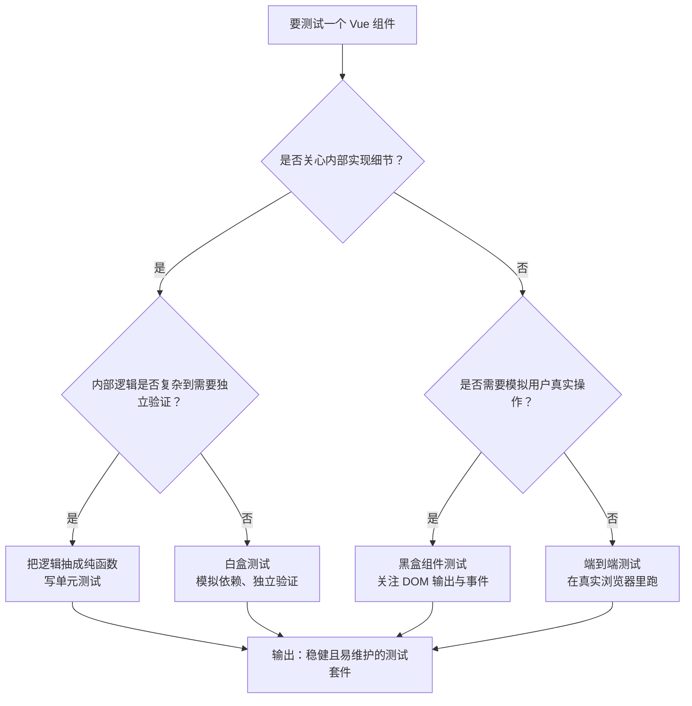

扫描[二维码](https://api2.cmdragon.cn/upload/cmder/20250304_012821924.jpg)关注或者微信搜一搜：`编程智域 前端至全栈交流与成长`

[发现1000+提升效率与开发的AI工具和实用程序](https://tools.cmdragon.cn/zh/apps?category=ai_chat)：https://tools.cmdragon.cn/


## 一、白盒与黑盒：两种看待组件的方式

你有没有过这样的体验：买回一台咖啡机，一种人喜欢先翻说明书，把每个零件怎么转、水流怎么走都搞清楚再用；另一种人则直接插电、按按钮，看它能不能出咖啡，能出就说明没问题。

Vue 3 的组件测试，其实就分这两种思路。前者叫**白盒测试**（单元测试），后者叫**黑盒测试**（组件测试）。它们并不是谁取代谁的关系，而是站在不同视角观察同一个组件。

### 白盒测试：拆开机器看零件

白盒测试的核心特征是**知晓组件的实现细节和依赖关系**。就像拆开咖啡机看内部线路一样，你会关心组件用了哪个 store、调用了哪个 composable、子组件被怎么模拟（mock）了。

它的优势在于**独立性强**：你可以把组件从整个系统里"摘"出来，单独验证某一段逻辑。比如一个登录表单组件，白盒测试可以模拟掉 `useAuth()` 这个 composable，只验证表单在拿到不同返回值时渲染是否正确。

### 黑盒测试：当一名真实用户

黑盒测试则**不知晓实现细节**，尽可能少地模拟东西，把组件放到整个系统里去跑。你只关心"我传了什么 prop、点了什么按钮，它应该给出什么 DOM 输出"，至于内部用了什么 store、什么 composable，统统不管。

这种方式的好处是**更接近真实使用场景**，测试出来的结果也更值得信赖。比如同一个登录表单，黑盒测试会真的让 `useAuth()` 跑起来（或者用一个假的但行为一致的实现），然后通过用户视角的输入和点击来验证流程。

## 二、组件测试的推荐做法

Vue 官方文档把组件测试的推荐做法归结为两类：**视图测试**和**交互测试**。这两类都属于黑盒思维的范畴，因为它们关注的是组件对外的"接口"——渲染输出和事件。

### 视图测试：根据输入断言输出

视图测试的套路很固定：给组件喂不同的 prop 和插槽，然后断言它渲染出来的 DOM 是否符合预期。这就像考试批卷——题目（prop）变了，答案（DOM）也得跟着变。

### 交互测试：模拟用户操作

交互测试则更进一步：模拟用户点击、输入、拖拽，断言渲染更新是否正确，或者组件是否触发了正确的事件。

### 一个 Stepper 组件的完整示例

光说不练假把式，咱们写一个 Stepper（步进器）组件，把上面两种测试都跑一遍。

**运行环境说明**：
- Node.js 18+
- 包管理器：pnpm（也可用 npm/yarn）
- 测试框架：Vitest 1.6.0
- Vue 测试工具：@vue/test-utils 2.4.6
- Vue 版本：3.4.x

安装依赖：

```bash
pnpm add -D vitest@1.6.0 @vue/test-utils@2.4.6 @vitejs/plugin-vue@5.0.4 jsdom@24.0.0
```

先看组件代码 `src/components/Stepper.vue`：

```vue
<script setup>
import { ref, computed } from 'vue'

// 接收 min、max、modelValue 三个 prop
const props = defineProps({
  // 最小值，默认 0
  min: {
    type: Number,
    default: 0
  },
  // 最大值，默认 10
  max: {
    type: Number,
    default: 10
  },
  // 当前值，支持 v-model
  modelValue: {
    type: Number,
    default: 0
  }
})

// 定义 update:modelValue 事件，用于双向绑定
const emit = defineEmits(['update:modelValue'])

// 内部维护一个响应式值，初始化为 modelValue
const current = ref(props.modelValue)

// 计算属性：是否已达上限，用于禁用加号按钮
const isMax = computed(() => current.value >= props.max)
// 计算属性：是否已达下限，用于禁用减号按钮
const isMin = computed(() => current.value <= props.min)

// 加一操作，到达上限后不再增加
function increase() {
  if (current.value < props.max) {
    current.value++
    // 通知父组件值变了
    emit('update:modelValue', current.value)
  }
}

// 减一操作，到达下限后不再减少
function decrease() {
  if (current.value > props.min) {
    current.value--
    emit('update:modelValue', current.value)
  }
}
</script>

<template>
  <div class="stepper">
    <!-- 减号按钮，到达下限时禁用 -->
    <button class="minus" :disabled="isMin" @click="decrease">-</button>
    <!-- 显示当前值 -->
    <span class="value">{{ current }}</span>
    <!-- 加号按钮，到达上限时禁用 -->
    <button class="plus" :disabled="isMax" @click="increase">+</button>
  </div>
</template>
```

再看测试文件 `src/components/Stepper.spec.js`：

```javascript
import { mount } from '@vue/test-utils'
import { describe, it, expect } from 'vitest'
import Stepper from './Stepper.vue'

// 测试套件：Stepper 组件
describe('Stepper.vue', () => {
  // 视图测试：默认值渲染
  it('使用默认 prop 时渲染出 0', () => {
    // 挂载组件，不传任何 prop
    const wrapper = mount(Stepper)
    // 断言 value 元素的文本内容是 0
    expect(wrapper.find('.value').text()).toBe('0')
  })

  // 视图测试：传入 max 后加号按钮应该被禁用
  it('当 modelValue 等于 max 时，加号按钮被禁用', () => {
    const wrapper = mount(Stepper, {
      props: {
        modelValue: 5,
        max: 5
      }
    })
    // 找到加号按钮，断言它带有 disabled 属性
    expect(wrapper.find('.plus').attributes('disabled')).toBeDefined()
  })

  // 交互测试：点击加号后值应增加并触发事件
  it('点击加号后，值增加为 1，并触发 update:modelValue 事件', async () => {
    const wrapper = mount(Stepper)
    // 触发点击
    await wrapper.find('.plus').trigger('click')
    // 断言渲染的值变成 1
    expect(wrapper.find('.value').text()).toBe('1')
    // 断言组件向父组件发出了 update:modelValue 事件，携带值 1
    expect(wrapper.emitted('update:modelValue')).toBeTruthy()
    expect(wrapper.emitted('update:modelValue')[0]).toEqual([1])
  })

  // 交互测试：到达上限后点击加号不应再增加
  it('到达 max 后点击加号，值不再增加', async () => {
    const wrapper = mount(Stepper, {
      props: {
        modelValue: 3,
        max: 3
      }
    })
    await wrapper.find('.plus').trigger('click')
    // 值仍然是 3
    expect(wrapper.find('.value').text()).toBe('3')
    // 也没有触发事件
    expect(wrapper.emitted('update:modelValue')).toBeFalsy()
  })
})
```

注意看上面的测试，咱们全程没有去戳组件内部的 `current.value`、`isMax` 这些"零件"，而是通过 prop 输入和按钮点击来观察 DOM 输出和事件触发。这就是黑盒思维的精髓——**测试组件做了什么，而不是怎么做到的**。

## 三、组件测试应避免的做法

知道了该做什么，还得知道不该做什么。下面这几条都是 Vue 官方文档明确点名的"坑"，踩了会让你的测试代码又脆又难维护。

### 不要测试私有状态和私有方法

为什么？因为**测试实现细节会让测试代码变得脆弱**。组件内部今天叫 `current`，明天重构改名叫 `innerValue`，功能完全没变，但你的测试全红了——这不冤吗？

组件的最终工作就是渲染出正确的 DOM。专注 DOM 输出的测试更健壮，因为对外接口（props、事件、插槽）才是稳定的契约。

### 不要完全依赖快照测试

快照测试看起来很省事：拍一张 HTML 字符串的"照片"，下次比对一下就行。但 Vue 官方明确说：**断言 HTML 字符串不能完全说明正确性**。

想象一下：组件渲染出了一个按钮，快照里写的是 `<button class="danger">删除</button>`。这能说明按钮在被点击时真的会触发删除事件吗？显然不能。快照只能告诉你"结构变了"，但"结构变了"不等于"功能坏了"，反之亦然。

正确姿势是：**编写有意图的测试**，针对具体行为写断言，快照只作为辅助手段。

### 需要测试的方法应提取为独立函数

如果你发现某个组件内部方法逻辑很复杂，复杂到你忍不住想直接测它，那就**把它提取到独立的实用函数中**，为它写专门的单元测试。

比如 Stepper 里如果把"判断是否到达上限"的逻辑抽出来：

```javascript
// src/utils/stepper.js
// 判断当前值是否到达上限
export function isAtMax(current, max) {
  return current >= max
}

// 判断当前值是否到达下限
export function isAtMin(current, min) {
  return current <= min
}
```

这样组件里只调用这个函数，而函数本身可以被独立测试，干净利落。

## 四、测试公开接口：props、事件、插槽

把前面的原则收拢一下，组件的"公开接口"其实就是三件套：

1. **props**：组件接收的输入
2. **事件**：组件向父组件发出的信号
3. **插槽**：组件留给父组件填充内容的位置

只要把这三样测全了，组件的行为基本就稳了。下面用一段代码演示插槽测试：

```javascript
it('能正确渲染父组件传入的插槽内容', () => {
  const wrapper = mount(Stepper, {
    slots: {
      // 假设组件有一个名为 label 的插槽
      default: '<strong>数量</strong>'
    }
  })
  // 断言插槽内容被渲染出来
  expect(wrapper.html()).toContain('<strong>数量</strong>')
})
```

## 五、白盒还是黑盒：决策流程图

面对一个具体场景，到底选白盒还是黑盒？下面这张流程图帮你理清思路：



图里能看到，白盒和黑盒并不是非此即彼，而是**分层协作**：纯逻辑用单元测试，组件行为用黑盒测试，整体流程用 E2E 测试。每层各司其职，整体才稳。

## 六、课后 Quiz

### Quiz 1
**题目**：下面哪种测试方式最符合 Vue 官方推荐的"组件测试"思路？

A. 直接读取组件实例的 `current` ref，断言它的值是 5  
B. 通过 `wrapper.vm.somePrivateMethod()` 调用私有方法并断言返回值  
C. 给组件传入 `modelValue=5` 的 prop，断言渲染出的 `.value` 文本是 5  
D. 用快照测试记录整个 HTML 字符串，每次比对是否变化

**答案解析**：选 C。

A 错在断言组件实例的私有状态，这属于实现细节，组件一重构测试就崩。B 错在调用私有方法，私有方法随时可能被改名或删除，测试会很脆弱。D 错在完全依赖快照，HTML 字符串变了不代表功能坏了，反过来也一样。C 是正确的黑盒思路——通过公开的 prop 输入，断言公开的 DOM 输出，这正是 Vue 官方推荐的"视图测试"做法。

### Quiz 2
**题目**：你写了一个购物车组件，里面有个 `formatPrice` 方法把分转成元。现在想给它写测试，下面哪种做法最合适？

A. 在组件测试里通过 `wrapper.vm.formatPrice(999)` 调用它断言返回 "9.99"  
B. 把 `formatPrice` 抽到 `utils/format.js`，为它单独写单元测试  
C. 用快照测试记录组件渲染结果  
D. 写一个 E2E 测试，真实点击购物车按钮看价格显示

**答案解析**：选 B。

Vue 官方明确建议：如果一个方法需要测试，就把它提取到独立的实用函数中。这样做有两个好处：一是函数变成纯逻辑后，单元测试又快又稳；二是组件内部代码更清爽，职责更单一。A 的问题是直接调用组件实例的方法，依然耦合实现细节。C 和 D 都不是测这个方法本身，而是测它的副作用，覆盖不到核心逻辑。

### Quiz 3
**题目**：下面关于快照测试的说法，哪句是正确的？

A. 快照测试能完全替代有意图的断言测试  
B. 快照测试只能作为辅助手段，不能说明功能的正确性  
C. 快照一旦生成就不能更新  
D. 快照测试比交互测试更能捕捉用户操作问题

**答案解析**：选 B。

快照测试的本质是"字符串比对"，它只能告诉你"结构变了"，但"结构变了"不等于"功能坏了"。比如你把按钮文案从"删除"改成"移除"，快照会报红，但功能完全正常。反过来，如果按钮的点击事件被误删了，快照可能还是绿的。所以 Vue 官方明确说"不要完全依赖快照测试"，它只能作为辅助，真正的正确性还得靠有意图的断言来保证。

## 七、常见报错解决方案

### 报错一：快照不匹配（Snapshot mismatch）

**报错信息**：`Snapshot has changed unexpectedly`

**产生原因**：组件渲染出的 HTML 结构发生了变化，可能是你主动改了组件，也可能是依赖升级导致的细微差异。

**解决办法**：
1. 先人工核对变化是不是预期的
2. 如果是预期变化，运行 `npx vitest -u` 更新快照
3. 如果不是预期变化，回溯代码找出意外副作用

**预防建议**：把快照测试和有意图的断言测试搭配使用，别让快照成为唯一的判断依据。每次依赖升级后单独跑一遍测试，及时更新快照。

### 报错二：私有方法测试失败（Cannot read property of undefined）

**报错信息**：`TypeError: Cannot read properties of undefined (reading 'someMethod')`

**产生原因**：你试图通过 `wrapper.vm.somePrivateMethod()` 调用一个在 `<script setup>` 中定义但没有 `defineExpose` 暴露的方法。`<script setup>` 默认是封闭的，外部访问不到内部变量。

**解决办法**：
1. 最好的办法是别测私有方法，把它抽成纯函数单独测
2. 如果确实需要暴露，用 `defineExpose({ someMethod })` 显式暴露
3. 改用黑盒方式：通过用户交互（点击、输入）间接触发该方法，观察 DOM 输出

**预防建议**：写测试前先问自己一句——"这个方法会被父组件调用吗？"如果不会，就别测它本身，测它产生的效果。

### 报错三：emit 事件断言失败

**报错信息**：`expect(wrapper.emitted('some-event')).toBeTruthy() 失败`

**产生原因**：常见有三类——事件名拼错了（比如 `update:modelValue` 写成 `update:modelvalue`）；事件在异步操作后才触发，但测试没加 `await`；触发事件的元素被 `v-if` 隐藏了，点击没生效。

**解决办法**：
1. 仔细核对事件名大小写和连字符
2. 所有交互操作后都加 `await wrapper.trigger('click')`
3. 用 `wrapper.find('.btn').exists()` 先确认元素存在
4. 必要时用 `await flushPromises()` 等待响应式更新

**预防建议**：把事件名定义为常量，避免硬编码字符串拼写错误：

```javascript
// src/constants/events.js
export const UPDATE_MODEL_VALUE = 'update:modelValue'
```

参考链接：https://vuejs.org/guide/scaling-up/testing.html

余下文章内容请点击跳转至 个人博客页面 或者 扫描[二维码](https://api2.cmdragon.cn/upload/cmder/20250304_012821924.jpg)关注或者微信搜一搜：`编程智域 前端至全栈交流与成长`，阅读完整的文章：[Vue 3测试入门第七章：白盒还是黑盒？组件测试的应该做与不该做](https://blog.cmdragon.cn/posts/6d3f8c1a4e7b2a90/)


<details>
<summary>往期文章归档</summary>

- [Vue 3 静态与动态 Props 如何传递？TypeScript 类型约束有何必要？](https://blog.cmdragon.cn/posts/94ab48753b64780ca3ab7a7115ae8522/)
- [Vue 3中组件局部注册的优势与实现方式如何？](https://blog.cmdragon.cn/posts/dbf576e744870f6de26fd8a2e03e47da/)
- [如何在Vue3中优化生命周期钩子性能并规避常见陷阱？](https://blog.cmdragon.cn/posts/12d98b3b9ccd6c19a1b169d720ac5c80/)
- [Vue 3 Composition API生命周期钩子：如何实现从基础理解到高阶复用？](https://blog.cmdragon.cn/posts/8884e2b70287fcb263c57648eeb27419/)
- [Vue 3生命周期钩子实战指南：如何正确选择onMounted、onUpdated与onUnmounted的应用场景？](https://blog.cmdragon.cn/posts/883c6dbc50ae4183770a4462e0b8ae4d/)
- [Vue 3中生命周期钩子与响应式系统如何实现协同工作？](https://blog.cmdragon.cn/posts/70dad360ffa9dce14d0d69611b8cb019/)
- [Vue 3组件生命周期钩子的执行顺序与使用场景是什么？](https://blog.cmdragon.cn/posts/db44294a78dc9f666f67b053f6c83567/)
- [Vue组件全局注册与局部注册如何抉择？](https://blog.cmdragon.cn/posts/43ead630ea17da65d99ad2eb8188e472/)
- [Vue3组件化开发中，Props与Emits如何实现数据流转与事件协作？](https://blog.cmdragon.cn/posts/8cff7d2df113da66ea7be560c4d1d22a/)
- [Vue 3模板引用如何与其他特性协同实现复杂交互？](https://blog.cmdragon.cn/posts/331bf75d114ab09116eadfcdca602b58/)
- [Vue 3 v-for中模板引用如何实现高效管理与动态控制？](https://blog.cmdragon.cn/posts/cb380897ddc3578b180ecf8843c774c1/)
- [Vue 3的defineExpose：如何突破script setup组件默认封装，实现精准的父子通讯？](https://blog.cmdragon.cn/posts/202ae0f4acde7128e0e31baf63732fb5/)
- [Vue 3模板引用的生命周期时机如何把握？常见陷阱该如何避免？](https://blog.cmdragon.cn/posts/7d2a0f6555ecbe92afd7d2491c427463/)
- [Vue 3模板引用如何实现父组件与子组件的高效交互？](https://blog.cmdragon.cn/posts/3fb7bdd84128b7efaaa1c979e1f28dee/)
- [Vue中为何需要模板引用？又如何高效实现DOM与组件实例的直接访问？](https://blog.cmdragon.cn/posts/23f3464ba16c7054b4783cded50c04c6/)
- [Vue 3 watch与watchEffect如何区分使用？常见陷阱与性能优化技巧有哪些？](https://blog.cmdragon.cn/posts/68a26cc0023e4994a6bc54fb767365c8/)
- [Vue3侦听器实战：组件与Pinia状态监听如何高效应用？](https://blog.cmdragon.cn/posts/fd4695f668d64332dda9962c24214f32/)
- [Vue 3中何时用watch，何时用watchEffect？核心区别及性能优化策略是什么？](https://blog.cmdragon.cn/posts/cdbbb1837f8c093252e61f46dbf0a2e7/)
- [Vue 3中如何有效管理侦听器的暂停、恢复与副作用清理？](https://blog.cmdragon.cn/posts/09551ab614c463a6d6ca69818e8c2d52/)
- [Vue 3 watchEffect：如何实现响应式依赖的自动追踪与副作用管理？](https://blog.cmdragon.cn/posts/b7bca5d20f628ac09f7192ad935ef664/)
- [Vue 3 watch如何利用immediate、once、deep选项实现初始化、一次性与深度监听？](https://blog.cmdragon.cn/posts/2c6cdb100a20f10c7e7d4413617c7ea9/)
- [Vue 3中watch如何高效监听多数据源、计算结果与数组变化？](https://blog.cmdragon.cn/posts/757a1728bc1b9c0c8b317b0354d85568/)
- [Vue 3中watch监听ref和reactive的核心差异与注意事项是什么？](https://blog.cmdragon.cn/posts/8e70552f0f61e0dc8c7f567a2d272345/)
- [Vue3中Watch与watchEffect的核心差异及适用场景是什么？](https://blog.cmdragon.cn/posts/dde70ab90dc5062c435e0501f5a6e7cb/)
- [Vue 3自定义指令如何赋能表单自动聚焦与防抖输入的高效实现？](https://blog.cmdragon.cn/posts/1f5ed5047850ed52c0fd0386f76bd4ae/)
- [Vue3中如何优雅实现支持多绑定变量和修饰符的双向绑定组件？](https://blog.cmdragon.cn/posts/e3d4e128815ad731611b8ef29e37616b/)
- [Vue 3表单验证如何从基础规则到异步交互构建完整验证体系？](https://blog.cmdragon.cn/posts/7d1caedd822f70542aa0eed67e30963b/)
- [Vue3响应式系统如何支撑表单数据的集中管理、动态扩展与实时计算？](https://blog.cmdragon.cn/posts/3687a5437ab56cb082b5b813d5577a40/)
- [Vue3跨组件通信中，全局事件总线与provide/inject该如何正确选择？](https://blog.cmdragon.cn/posts/ad67c4eb6d76cf7707bdfe6a8146c34f/)
- [Vue3表单事件处理：v-model如何实现数据绑定、验证与提交？](https://blog.cmdragon.cn/posts/1c1e80d697cca0923f29ec70ebb8ccd1/)
- [Vue应用如何基于DOM事件传播机制与事件修饰符实现高效事件处理？](https://blog.cmdragon.cn/posts/b990828143d70aa87f9aa52e16692e48/)
- [Vue3中如何在调用事件处理函数时同时传递自定义参数和原生DOM事件？参数顺序有哪些注意事项？](https://blog.cmdragon.cn/posts/b44316e0866e9f2e6aef927dbcf5152b/)
- [从捕获到冒泡：Vue事件修饰符如何重塑事件执行顺序？](https://blog.cmdragon.cn/posts/021636c2a06f5e2d3d01977a12ddf559/)
- [Vue事件处理：内联还是方法事件处理器，该如何抉择？](https://blog.cmdragon.cn/posts/b3cddf7023ab537e623a61bc01dab6bb/)
- [Vue事件绑定中v-on与@语法如何取舍？参数传递与原生事件处理有哪些实战技巧？](https://blog.cmdragon.cn/posts/bd4d9607ce1bc34cc3bda0a1a46c40f6/)
- [Vue 3中列表排序时为何必须复制数组而非直接修改原始数据？](https://blog.cmdragon.cn/posts/a5f2bacb74476fd7f5e02bb3f1ba6b2b/)
- [Vue虚拟滚动如何将列表DOM数量从万级降至十位数？](https://blog.cmdragon.cn/posts/d3b06b57fb7f126787e6ed22dce1e341/)
- [Vue3中v-if与v-for直接混用为何会报错？计算属性如何解决优先级冲突？](https://blog.cmdragon.cn/posts/3100cc5a2e16f8dac36f722594e6af32/)
- [为何在Vue3递归组件中必须用v-if判断子项存在？](https://blog.cmdragon.cn/posts/455dc2d47c38d12c1cf350e490041e8b/)
- [Vue3列表渲染中，如何用数组方法与计算属性优化v-for的数据处理？](https://blog.cmdragon.cn/posts/3f842bbd7ba0f9c91151b983bf784c8b/)
- [Vue v-for的key：为什么它能解决列表渲染中的“玄学错误”？选错会有哪些后果？](https://blog.cmdragon.cn/posts/1eb3ffac668a743843b5ea1738301d40/)
- [Vue3中v-for与v-if为何不能直接共存于同一元素？](https://blog.cmdragon.cn/posts/138b13c5341f6a1fa9015400433a3611/)
- [Vue3中v-if与v-show的本质区别及动态组件状态保持的关键策略是什么？](https://blog.cmdragon.cn/posts/0242a94dc552b93a1bc335ac4fc33db5/)
 - [Vue3中v-show如何通过CSS修改display属性控制条件显示？与v-if的应用场景该如何区分？](https://blog.cmdragon.cn/posts/97c66a18ae0e9b57c6a69b8b3a41ddf6/)
- [Vue3条件渲染中v-if系列指令如何合理使用与规避错误？](https://blog.cmdragon.cn/posts/8a1ddfac64b25062ac56403e4c1201d2/)
- [Vue3动态样式控制：ref、reactive、watch与computed的应用场景与区别是什么？](https://blog.cmdragon.cn/posts/218c3a59282c3b757447ee08a01937bb/)
- [Vue3中动态样式数组的后项覆盖规则如何与计算属性结合实现复杂状态样式管理？](https://blog.cmdragon.cn/posts/1bab953e41f66ac53de099fa9fe76483/)
- [Vue浅响应式如何解决深层响应式的性能问题？适用场景有哪些？ - cmdragon's Blog](https://blog.cmdragon.cn/posts/c85e1fe16a7ae45e965b4e2df4d9d2f4/)
- [Vue 3组合式API中ref与reactive的核心响应式差异及使用最佳实践是什么？ - cmdragon's Blog](https://blog.cmdragon.cn/posts/be04b02d2723994632de0d4ca22a3391/)
- [Vue 3组合式API中ref与reactive的核心响应式差异及使用最佳实践是什么？ - cmdragon's Blog](https://blog.cmdragon.cn/posts/be04b02d2723994632de0d4ca22a3391/)
- [Vue3响应式系统中，对象新增属性、数组改索引、原始值代理的问题如何解决？ - cmdragon's Blog](https://blog.cmdragon.cn/posts/a0af08dd60a37b9a890a9957f2cbfc9f/)
- [Vue 3中watch侦听器的正确使用姿势你掌握了吗？深度监听、与watchEffect的差异及常见报错解析 - cmdragon's Blog](https://blog.cmdragon.cn/posts/bc287e1e36287afd90750fd907eca85e/)
- [Vue响应式声明的API差异、底层原理与常见陷阱你都搞懂了吗 - cmdragon's Blog](https://blog.cmdragon.cn/posts/654b9447ef1ba7ec1126a1bc26a4726d/)
- [Vue响应式声明的API差异、底层原理与常见陷阱你都搞懂了吗 - cmdragon's Blog](https://blog.cmdragon.cn/posts/654b9447ef1ba7ec1126a1bc26a4726d/)
- [为什么Vue 3需要ref函数？它的响应式原理与正确用法是什么？ - cmdragon's Blog](https://blog.cmdragon.cn/posts/c405a8d9950af5b7c63b56c348ac36b6/)
- [Vue 3中reactive函数如何通过Proxy实现响应式？使用时要避开哪些误区？ - cmdragon's Blog](https://blog.cmdragon.cn/posts/a7e9abb9691a81e4404d9facabe0f7c3/)
- [Vue3响应式系统的底层原理与实践要点你真的懂吗？ - cmdragon's Blog](https://blog.cmdragon.cn/posts/bd995ea45161727597fb85b62566c43d/)
- [Vue 3模板如何通过编译三阶段实现从声明式语法到高效渲染的跨越 - cmdragon's Blog](https://blog.cmdragon.cn/posts/53e3f270a80675df662c6857a3332c0f/)
- [快速入门Vue模板引用：从收DOM“快递”到调子组件方法，你玩明白了吗？ - cmdragon's Blog](https://blog.cmdragon.cn/posts/ddbce4f2a23aa72c96b1c0473900321e/)
- [快速入门Vue模板里的JS表达式有啥不能碰？计算属性为啥比方法更能打？ - cmdragon's Blog](https://blog.cmdragon.cn/posts/23a2d5a334e15575277814c16e45df50/)
- [快速入门Vue的v-model表单绑定：语法糖、动态值、修饰符的小技巧你都掌握了吗？ - cmdragon's Blog](https://blog.cmdragon.cn/posts/6be38de6382e31d282659b689c5b17f0/)
- [快速入门Vue3事件处理的挑战题：v-on、修饰符、自定义事件你能通关吗？ - cmdragon's Blog](https://blog.cmdragon.cn/posts/60ce517684f4a418f453d66aa805606c/)
- [快速入门Vue3的v-指令：数据和DOM的“翻译官”到底有多少本事？ - cmdragon's Blog](https://blog.cmdragon.cn/posts/e4ae7d5e4a9205bb11b2baccb230c637/)
- [快速入门Vue3，插值、动态绑定和避坑技巧你都搞懂了吗？ - cmdragon's Blog](https://blog.cmdragon.cn/posts/999ce4fb32259ff4fbf4bf7bcb851654/)
- [想让PostgreSQL快到飞起？先找健康密码还是先换引擎？ - cmdragon's Blog](https://blog.cmdragon.cn/posts/a6997d81b49cd232b87e1cf603888ad1/)
- [想让PostgreSQL查询快到飞起？分区表、物化视图、并行查询这三招灵不灵？ - cmdragon's Blog](https://blog.cmdragon.cn/posts/1fee7afbb9abd4540b8aa9c141d6845d/)
- [子查询总拖慢查询？把它变成连接就能解决？ - cmdragon's Blog](https://blog.cmdragon.cn/posts/79c590fbd87ece535b11a71c9667884f/)
- [PostgreSQL全表扫描慢到崩溃？建索引+改查询+更统计信息三招能破？ - cmdragon's Blog](https://blog.cmdragon.cn/posts/748cdac2536008199abf8a8a2cd0ec85/)
- [复杂查询总拖后腿？PostgreSQL多列索引+覆盖索引的神仙技巧你get没？ - cmdragon's Blog](https://blog.cmdragon.cn/posts/32ca943703226d317d4276a8fb53b0dd/)
- [只给表子集建索引？用函数结果建索引？PostgreSQL这俩操作凭啥能省空间又加速？ - cmdragon's Blog](https://blog.cmdragon.cn/posts/ca93f1d53aa910e7ba5ffd8df611c12b/)
- [B-tree索引像字典查词一样工作？那哪些数据库查询它能加速，哪些不能？ - cmdragon's Blog](https://blog.cmdragon.cn/posts/f507856ebfddd592448813c510a53669/)
- [想抓PostgreSQL里的慢SQL？pg_stat_statements基础黑匣子和pg_stat_monitor时间窗，谁能帮你更准揪出性能小偷？ - cmdragon's Blog](https://blog.cmdragon.cn/posts/b2213bfcb5b88a862f2138404c03d596/)
- [PostgreSQL的“时光机”MVCC和锁机制是怎么搞定高并发的？ - cmdragon's Blog](https://blog.cmdragon.cn/posts/26614eb7da6c476dde41d367ad888d2f/)
- [PostgreSQL性能暴涨的关键？内存IO并发参数居然要这么设置？ - cmdragon's Blog](https://blog.cmdragon.cn/posts/69f99bc6972a860d559c74aad7280da4/)
- [大表查询慢到翻遍整个书架？PostgreSQL分区表教你怎么“分类”才高效](https://blog.cmdragon.cn/posts/7b7053f392147a8b3b1a16bebeb08d0a/)
- [PostgreSQL 查询慢？是不是忘了优化 GROUP BY、ORDER BY 和窗口函数？ - cmdragon's Blog](https://blog.cmdragon.cn/posts/c856e3cb073822349f3bf2d29995dcfc/)
- [PostgreSQL里的子查询和CTE居然在性能上“掐架”？到底该站哪边？ - cmdragon's Blog](https://blog.cmdragon.cn/posts/c096347d18e67b7431faacd2c4757093/)
- [PostgreSQL选Join策略有啥小九九？Nested Loop/Merge/Hash谁是它的菜？ - cmdragon's Blog](https://blog.cmdragon.cn/posts/2eca89463454fd4250d7b66243b9fe5a/)
- [PostgreSQL新手SQL总翻车？这7个性能陷阱你踩过没？ - cmdragon's Blog](https://blog.cmdragon.cn/posts/068ecb772a87d7df20a8c9fb4b233f8e/)
- [PostgreSQL索引选B-Tree还是GiST？“瑞士军刀”和“多面手”的差别你居然还不知道？ - cmdragon's Blog](https://blog.cmdragon.cn/posts/d498f63cd0a2d5a77e445c688a8b88db/)
- [想知道数据库怎么给查询“算成本选路线”？EXPLAIN能帮你看明白？ - cmdragon's Blog](https://blog.cmdragon.cn/posts/9101b75bdec6faea9b35d54f14e37f36/)
- [PostgreSQL处理SQL居然像做蛋糕？解析到执行的4步里藏着多少查询优化的小心机？ - cmdragon's Blog](https://blog.cmdragon.cn/posts/d527f8ebb6e3dae2c7dfe4c8d8979444/)
- [PostgreSQL备份不是复制文件？物理vs逻辑咋选？误删还能精准恢复到1分钟前？ - cmdragon's Blog](https://blog.cmdragon.cn/posts/6bfdae84f313cf7ad0bb7045c4392347/)
- [转账不翻车、并发不干扰，PostgreSQL的ACID特性到底有啥魔法？ - cmdragon's Blog](https://blog.cmdragon.cn/posts/de3672803de34dbad244d0a8d48b0eb5/)
- [银行转账不白扣钱、电商下单不超卖，PostgreSQL事务的诀窍是啥？ - cmdragon's Blog](https://blog.cmdragon.cn/posts/e463e8a2668abdf00a228c9b79324ded/)
- [PostgreSQL里的PL/pgSQL到底是啥？能让SQL从“说目标”变“讲步骤”？ - cmdragon's Blog](https://blog.cmdragon.cn/posts/5c967e595058c4a1fc4474a68e64031d/)
- [PostgreSQL视图不存数据？那它怎么简化查询还能递归生成序列和控制权限？ - cmdragon's Blog](https://blog.cmdragon.cn/posts/325047855e3e23b5ef82f7d2db134fbd/)
- [PostgreSQL索引这么玩，才能让你的查询真的“飞”起来？ - cmdragon's Blog](https://blog.cmdragon.cn/posts/d2dba50bb6e4df7b27e735245a06a2a2/)
- [PostgreSQL的表关系和约束，咋帮你搞定用户订单不混乱、学生选课不重复？ - cmdragon's Blog](https://blog.cmdragon.cn/posts/849ae5bab0f8c66e94c2f6ad1bb798e3/)
- [PostgreSQL查询的筛子、排序、聚合、分组？你会用它们搞定数据吗？ - cmdragon's Blog](https://blog.cmdragon.cn/posts/ef4800975ffa84f1ca51976a70a1585b/)
- [PostgreSQL数据类型怎么选才高效不踩坑？ - cmdragon's Blog](https://blog.cmdragon.cn/posts/bf54711525c507c5eacfa7b0151c39d2/)
- [想解锁PostgreSQL查询从基础到进阶的核心知识点？你都get了吗？ - cmdragon's Blog](https://blog.cmdragon.cn/posts/887809b3e0375f5956873cd442f516d8/)
- [PostgreSQL DELETE居然有这些操作？返回数据、连表删你试过没？ - cmdragon's Blog](https://blog.cmdragon.cn/posts/934be1203725e8be9d6f6e9104e5abcc/)
- [PostgreSQL UPDATE语句怎么玩？从改邮箱到批量更新的避坑技巧你都会吗？ - cmdragon's Blog](https://blog.cmdragon.cn/posts/0f0622e9b7402b599e618150d0596ffe/)
- [PostgreSQL插入数据还在逐条敲？批量、冲突处理、返回自增ID的技巧你会吗？ - cmdragon's Blog](https://blog.cmdragon.cn/posts/0e3bf7efc030b024ea67ee855a00f2de/)
- [PostgreSQL的“仓库-房间-货架”游戏，你能建出电商数据库和表吗？ - cmdragon's Blog](https://blog.cmdragon.cn/posts/b6cd3c86da6aac26ed829e472d34078e/)
- [PostgreSQL 17安装总翻车？Windows/macOS/Linux避坑指南帮你搞定？ - cmdragon's Blog](https://blog.cmdragon.cn/posts/ba1f545a3410144552fbdbfcf31b5265/)
- [能当关系型数据库还能玩对象特性，能拆复杂查询还能自动管库存，PostgreSQL凭什么这么香？ - cmdragon's Blog](https://blog.cmdragon.cn/posts/b5474d1480509c5072085abc80b3dd9f/)
- [给接口加新字段又不搞崩老客户端？FastAPI的多版本API靠哪三招实现？ - cmdragon's Blog](https://blog.cmdragon.cn/posts/cc098d8836e787baa8a4d92e4d56d5c5/)
- [流量突增要搞崩FastAPI？熔断测试是怎么防系统雪崩的？ - cmdragon's Blog](https://blog.cmdragon.cn/posts/46d05151c5bd31cf37a7bcf0b8f5b0b8/)
- [FastAPI秒杀库存总变负数？Redis分布式锁能帮你守住底线吗 - cmdragon's Blog](https://blog.cmdragon.cn/posts/65ce343cc5df9faf3a8e2eeaab42ae45/)
- [FastAPI的CI流水线怎么自动测端点，还能让Allure报告美到犯规？ - cmdragon's Blog](https://blog.cmdragon.cn/posts/eed6cd8985d9be0a4b092a7da38b3e0c/)
- [如何用GitHub Actions为FastAPI项目打造自动化测试流水线？ - cmdragon's Blog](https://blog.cmdragon.cn/posts/6157d87338ce894d18c013c3c4777abb/)

</details>


<details>
<summary>免费好用的热门在线工具</summary>

- [多直播聚合器 - 应用商店 | By cmdragon](https://tools.cmdragon.cn/zh/apps/multi-live-aggregator)
- [Proto文件生成器 - 应用商店 | By cmdragon](https://tools.cmdragon.cn/zh/apps/proto-file-generator)
- [图片转粒子 - 应用商店 | By cmdragon](https://tools.cmdragon.cn/zh/apps/image-to-particles)
- [视频下载器 - 应用商店 | By cmdragon](https://tools.cmdragon.cn/zh/apps/video-downloader)
- [文件格式转换器 - 应用商店 | By cmdragon](https://tools.cmdragon.cn/zh/apps/file-converter)
- [M3U8在线播放器 - 应用商店 | By cmdragon](https://tools.cmdragon.cn/zh/apps/m3u8-player)
- [快图设计 - 应用商店 | By cmdragon](https://tools.cmdragon.cn/zh/apps/quick-image-design)
- [高级文字转图片转换器 - 应用商店 | By cmdragon](https://tools.cmdragon.cn/zh/apps/text-to-image-advanced)
- [RAID 计算器 - 应用商店 | By cmdragon](https://tools.cmdragon.cn/zh/apps/raid-calculator)
- [在线PS - 应用商店 | By cmdragon](https://tools.cmdragon.cn/zh/apps/photoshop-online)
- [Mermaid 在线编辑器 - 应用商店 | By cmdragon](https://tools.cmdragon.cn/zh/apps/mermaid-live-editor)
- [数学求解计算器 - 应用商店 | By cmdragon](https://tools.cmdragon.cn/zh/apps/math-solver-calculator)
- [智能提词器 - 应用商店 | By cmdragon](https://tools.cmdragon.cn/zh/apps/smart-teleprompter)
- [魔法简历 - 应用商店 | By cmdragon](https://tools.cmdragon.cn/zh/apps/magic-resume)
- [Image Puzzle Tool - 图片拼图工具 | By cmdragon](https://tools.cmdragon.cn/zh/apps/image-puzzle-tool)
- [字幕下载工具 - 应用商店 | By cmdragon](https://tools.cmdragon.cn/zh/apps/subtitle-downloader)
- [歌词生成工具 - 应用商店 | By cmdragon](https://tools.cmdragon.cn/zh/apps/lyrics-generator)
- [网盘资源聚合搜索 - 应用商店 | By cmdragon](https://tools.cmdragon.cn/zh/apps/cloud-drive-search)
- [ASCII字符画生成器 - 应用商店 | By cmdragon](https://tools.cmdragon.cn/zh/apps/ascii-art-generator)
- [JSON Web Tokens 工具 - 应用商店 | By cmdragon](https://tools.cmdragon.cn/zh/apps/jwt-tool)
- [Bcrypt 密码工具 - 应用商店 | By cmdragon](https://tools.cmdragon.cn/zh/apps/bcrypt-tool)
- [GIF 合成器 - 应用商店 | By cmdragon](https://tools.cmdragon.cn/zh/apps/gif-composer)
- [GIF 分解器 - 应用商店 | By cmdragon](https://tools.cmdragon.cn/zh/apps/gif-decomposer)
- [文本隐写术 - 应用商店 | By cmdragon](https://tools.cmdragon.cn/zh/apps/text-steganography)
- [CMDragon 在线工具 - 高级AI工具箱与开发者套件 | 免费好用的在线工具](https://tools.cmdragon.cn/zh)
- [应用商店 - 发现1000+提升效率与开发的AI工具和实用程序 | 免费好用的在线工具](https://tools.cmdragon.cn/zh/apps?category=trending)
- [CMDragon 更新日志 - 最新更新、功能与改进 | 免费好用的在线工具](https://tools.cmdragon.cn/zh/changelog)
- [支持我们 - 成为赞助者 | 免费好用的在线工具](https://tools.cmdragon.cn/zh/sponsor)
- [AI文本生成图像 - 应用商店 | 免费好用的在线工具](https://tools.cmdragon.cn/zh/apps/text-to-image-ai)
- [临时邮箱 - 应用商店 | 免费好用的在线工具](https://tools.cmdragon.cn/zh/apps/temp-email)
- [二维码解析器 - 应用商店 | 免费好用的在线工具](https://tools.cmdragon.cn/zh/apps/qrcode-parser)
- [文本转思维导图 - 应用商店 | 免费好用的在线工具](https://tools.cmdragon.cn/zh/apps/text-to-mindmap)
- [正则表达式可视化工具 - 应用商店 | 免费好用的在线工具](https://tools.cmdragon.cn/zh/apps/regex-visualizer)
- [文件隐写工具 - 应用商店 | 免费好用的在线工具](https://tools.cmdragon.cn/zh/apps/steganography-tool)
- [IPTV 频道探索器 - 应用商店 | 免费好用的在线工具](https://tools.cmdragon.cn/zh/apps/iptv-explorer)
- [快传 - 应用商店 | 免费好用的在线工具](https://tools.cmdragon.cn/zh/apps/snapdrop)
- [随机抽奖工具 - 应用商店 | 免费好用的在线工具](https://tools.cmdragon.cn/zh/apps/lucky-draw)
- [动漫场景查找器 - 应用商店 | 免费好用的在线工具](https://tools.cmdragon.cn/zh/apps/anime-scene-finder)
- [时间工具箱 - 应用商店 | 免费好用的在线工具](https://tools.cmdragon.cn/zh/apps/time-toolkit)
- [网速测试 - 应用商店 | 免费好用的在线工具](https://tools.cmdragon.cn/zh/apps/speed-test)
- [AI 智能抠图工具 - 应用商店 | 免费好用的在线工具](https://tools.cmdragon.cn/zh/apps/background-remover)
- [背景替换工具 - 应用商店 | 免费好用的在线工具](https://tools.cmdragon.cn/zh/apps/background-replacer)
- [艺术二维码生成器 - 应用商店 | 免费好用的在线工具](https://tools.cmdragon.cn/zh/apps/artistic-qrcode)
- [Open Graph 元标签生成器 - 应用商店 | 免费好用的在线工具](https://tools.cmdragon.cn/zh/apps/open-graph-generator)
- [图像对比工具 - 应用商店 | 免费好用的在线工具](https://tools.cmdragon.cn/zh/apps/image-comparison)
- [图片压缩专业版 - 应用商店 | 免费好用的在线工具](https://tools.cmdragon.cn/zh/apps/image-compressor)
- [密码生成器 - 应用商店 | 免费好用的在线工具](https://tools.cmdragon.cn/zh/apps/password-generator)
- [SVG优化器 - 应用商店 | 免费好用的在线工具](https://tools.cmdragon.cn/zh/apps/svg-optimizer)
- [调色板生成器 - 应用商店 | 免费好用的在线工具](https://tools.cmdragon.cn/zh/apps/color-palette)
- [在线节拍器 - 应用商店 | 免费好用的在线工具](https://tools.cmdragon.cn/zh/apps/online-metronome)
- [IP归属地查询 - 应用商店 | 免费好用的在线工具](https://tools.cmdragon.cn/zh/apps/ip-geolocation)
- [CSS网格布局生成器 - 应用商店 | 免费好用的在线工具](https://tools.cmdragon.cn/zh/apps/css-grid-layout)
- [邮箱验证工具 - 应用商店 | 免费好用的在线工具](https://tools.cmdragon.cn/zh/apps/email-validator)
- [书法练习字帖 - 应用商店 | 免费好用的在线工具](https://tools.cmdragon.cn/zh/apps/calligraphy-practice)
- [金融计算器套件 - 应用商店 | 免费好用的在线工具](https://tools.cmdragon.cn/zh/apps/finance-calculator-suite)
- [中国亲戚关系计算器 - 应用商店 | 免费好用的在线工具](https://tools.cmdragon.cn/zh/apps/chinese-kinship-calculator)
- [Protocol Buffer 工具箱 - 应用商店 | 免费好用的在线工具](https://tools.cmdragon.cn/zh/apps/protobuf-toolkit)
- [IP归属地查询 - 应用商店 | 免费好用的在线工具](https://tools.cmdragon.cn/zh/apps/ip-geolocation)
- [图片无损放大 - 应用商店 | 免费好用的在线工具](https://tools.cmdragon.cn/zh/apps/image-upscaler)
- [文本比较工具 - 应用商店 | 免费好用的在线工具](https://tools.cmdragon.cn/zh/apps/text-compare)
- [IP批量查询工具 - 应用商店 | 免费好用的在线工具](https://tools.cmdragon.cn/zh/apps/ip-batch-lookup)
- [域名查询工具 - 应用商店 | 免费好用的在线工具](https://tools.cmdragon.cn/zh/apps/domain-finder)
- [DNS工具箱 - 应用商店 | 免费好用的在线工具](https://tools.cmdragon.cn/zh/apps/dns-toolkit)
- [网站图标生成器 - 应用商店 | 免费好用的在线工具](https://tools.cmdragon.cn/zh/apps/favicon-generator)
- [XML Sitemap](https://tools.cmdragon.cn/sitemap_index.xml)

</details>
