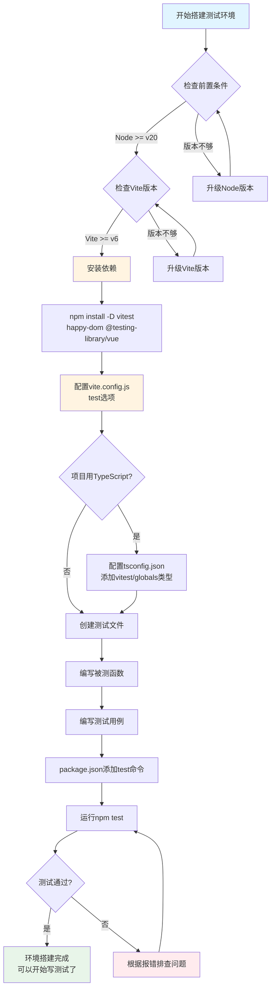

扫描[二维码](https://api2.cmdragon.cn/upload/cmder/20250304_012821924.jpg)关注或者微信搜一搜：`编程智域 前端至全栈交流与成长`

[发现1000+提升效率与开发的AI工具和实用程序](https://tools.cmdragon.cn/zh/apps?category=ai_chat)：https://tools.cmdragon.cn/


## 一、装修前先搭脚手架

你有没有装修过房子？装修师傅进场第一件事不是刷墙贴砖，而是先搭脚手架。脚手架本身不是房子的一部分，但没有它，刷墙够不着，贴砖站不稳。搭脚手架这步看着不起眼，却是整个装修工程能顺利推进的根基。

Vue 3项目里写测试也是这个道理。你想给组件写测试，想验证函数逻辑对不对，第一件事不是写测试代码，而是先把测试环境搭好。测试环境就是你的"脚手架"——它本身不会出现在最终上线的产品里，但没有它，测试代码跑不起来，验证无从谈起。

这一章咱们就干这件事：从零开始，一步一步把Vitest测试环境搭起来，最后跑通第一个单元测试。整个过程就像搭积木，每一步都有它的道理，搭完之后你会发现，原来写测试并没有想象中那么玄乎。

## 二、前置环境要求：开工前的检查清单

装修搭脚手架之前，得先确认地面平不平、承重够不够。搭Vitest环境之前，也得先确认几个前置条件满足了没。Vitest对Node和Vite的版本有硬性要求，版本不够会直接罢工。

### 2.1 Node版本要求

Vitest要求Node版本不低于v20.0.0。这个版本号不是随便定的，因为Vitest用到了一些Node新版本才有的API和性能优化。你可以打开终端，敲一行命令看看自己的Node版本：

```bash
node -v
```

如果输出的是`v20.x.x`或者更高的版本，恭喜你，这一关过了。如果版本偏低，去Node官网下载最新的LTS版本装上就行。建议用nvm（Node Version Manager）来管理Node版本，切换起来方便，不用每次都去官网下安装包。

### 2.2 Vite版本要求

Vitest跟Vite是"一家人"，它复用了Vite的配置和依赖处理能力。所以Vite版本也不能太老，要求不低于v6.0.0。在你的Vue项目根目录下，看看`package.json`里Vite的版本：

```bash
npm list vite
```

如果Vite版本不够，升级一下：

```bash
npm install vite@latest -D
```

### 2.3 Vue项目要能正常跑

这个听起来像废话，但真有人项目本身都没跑起来就急着加测试。确认你的Vue项目能正常`npm run dev`启动，能正常`npm run build`打包。如果项目本身有问题，先把项目修好再搭测试环境，否则测试报错了你都分不清是测试环境的问题还是项目代码的问题。

## 三、安装依赖：三个包各司其职

前置条件确认完毕，开始装依赖。Vue官方文档推荐装三个包：

```bash
npm install -D vitest happy-dom @testing-library/vue
```

注意那个`-D`参数，意思是装到`devDependencies`里。测试相关的依赖只在开发时用，上线时不需要，所以必须装到开发依赖里，别装成生产依赖让打包体积白白变大。

这三个包各管一摊事儿，弄明白它们的作用对你后续排查问题很有帮助。

### 3.1 vitest：测试框架本体

vitest是测试框架本身，相当于装修队里的"工头"。它负责找到你的测试文件、执行测试、收集结果、输出报告。它跟Vite共享配置，所以你的Vue项目里用的别名、插件，测试时都能直接用，不用再配一遍。这也是Vitest相比Jest最大的优势——跟Vite项目无缝集成，配置成本极低。

截至本文写作时，Vitest的最新稳定版本是2.x系列。安装时npm会自动拉最新版，不用特意指定版本号。

### 3.2 happy-dom：模拟浏览器环境

Vue组件测试离不开DOM操作，但Node环境里没有DOM。happy-dom就是来补这个缺的——它在Node里模拟出一个轻量级的浏览器DOM环境，让`document.createElement`、`querySelector`这些API都能正常工作。

你可能会问，为啥不用jsdom？happy-dom比jsdom更轻、更快，Vitest官方也推荐用它。当然如果你的测试对DOM兼容性要求特别高，换成jsdom也行，配置方式一样。

### 3.3 @testing-library/vue：组件测试工具

这个库提供了`render`、`fireEvent`这些方法，让你能方便地渲染Vue组件、模拟用户操作、查询DOM元素。它的设计理念是"以用户视角测试组件"——不关心组件内部实现细节，只关心用户能看到啥、能点到啥。这种思路写出来的测试更稳定，组件重构时不容易挂掉。

## 四、配置vite.config.js：给测试框架下指令

依赖装好了，接下来要告诉Vitest怎么跑测试。Vitest默认会读取项目根目录下的`vite.config.js`（或`vite.config.ts`），你只需要在里面加一个`test`字段就行。

### 4.1 基础配置

打开你的`vite.config.js`，加上test配置：

```javascript
import { defineConfig } from 'vite'

export default defineConfig({
  // 你原有的插件配置（比如vue()）保留不动
  test: {
    // 启用全局测试API，这样test、expect、describe这些方法
    // 不用在每个测试文件里都import一遍，用起来更省事
    globals: true,
    // 指定测试环境为happy-dom，模拟浏览器DOM
    // 这样组件测试里才能用document、querySelector这些API
    environment: 'happy-dom'
  }
})
```

如果你的项目原本就有Vite配置（Vue项目一般都有），只需要在`defineConfig`的对象里加上`test`字段，原有的`plugins`等内容保留不动。

### 4.2 globals选项详解

`globals: true`开了之后，`test`、`expect`、`describe`、`it`这些方法会变成全局变量，你在测试文件里直接用就行，不用写`import { test, expect } from 'vitest'`。这个设计跟Jest保持一致，从Jest迁移过来的项目几乎不用改测试代码。

不过有些人不喜欢全局变量，觉得不够显式。如果你有代码洁癖，可以不开globals，每个测试文件手动import也行，就是多写几行代码的事儿。

### 4.3 environment选项详解

`environment: 'happy-dom'`告诉Vitest，测试代码运行在happy-dom模拟的DOM环境里。这个选项对组件测试至关重要——没它的话，你的测试代码访问`document`会直接报`document is not defined`。

除了`happy-dom`，常见的可选值还有：

- `jsdom`：另一个DOM模拟库，兼容性更好但更重
- `node`：纯Node环境，不模拟DOM，适合测纯逻辑函数
- `jsdom`：老牌DOM模拟，生态成熟

如果你只是测工具函数（比如加减法、格式化日期），不需要DOM，可以用`environment: 'node'`，跑得更快。但Vue项目里大部分测试都要渲染组件，所以默认用`happy-dom`更省心。

## 五、TypeScript项目配置：让类型检查器认识测试API

如果你的Vue项目用了TypeScript（推荐用），还需要配置一下`tsconfig.json`，让TypeScript认识Vitest的全局API类型，否则编辑器会满屏飘红，提示`Cannot find name 'test'`。

### 5.1 添加types配置

打开`tsconfig.json`，在`compilerOptions`里加上`types`字段：

```json
{
  "compilerOptions": {
    "types": ["vitest/globals"]
  }
}
```

这样TypeScript就能识别`test`、`expect`、`describe`这些全局方法的类型定义了。编辑器不再飘红，还能享受自动补全，写测试时按个`.`就能看到`expect`后面能跟哪些匹配器。

### 5.2 引用配置三行注释法

如果你不想用全局类型，也可以在每个测试文件顶部加一行引用注释：

```typescript
/// <reference types="vitest/globals" />
```

效果跟配置`tsconfig.json`一样，只是作用范围限于单个文件。一般还是推荐在`tsconfig.json`里统一配置，省得每个文件都加一遍。

### 5.3 Vite配置文件的类型提示

如果你用的是`vite.config.ts`（TypeScript版本），想给`test`字段加上类型提示，在文件顶部加一行三斜线引用：

```typescript
/// <reference types="vitest" />
import { defineConfig } from 'vite'

export default defineConfig({
  test: {
    globals: true,
    environment: 'happy-dom'
  }
})
```

这行注释告诉TypeScript，`defineConfig`的参数里可以包含`test`字段，否则`test`下面会画红线说类型不匹配。

## 六、创建第一个测试文件：从sum函数开始

环境配置完毕，激动人心的时刻到了——咱们来写第一个测试，跑通它！

### 6.1 先写一个被测函数

在`src`目录下创建一个`sum.js`文件，写一个简单的加法函数：

```javascript
// src/sum.js

/**
 * 加法函数，把两个数字加起来
 * @param {number} a - 第一个数字
 * @param {number} b - 第二个数字
 * @returns {number} 两个数字的和
 */
export function sum(a, b) {
  return a + b
}
```

这个函数简单到不能再简单了，但用它来跑通第一个测试再合适不过。就像学开车先在空场地上练起步，不急着上路。

### 6.2 编写测试文件

在`sum.js`旁边创建`sum.test.js`文件。Vitest默认把名字里包含`.test.`或`.spec.`的文件当作测试文件：

```javascript
// src/sum.test.js

// 从vitest导入测试API（如果开了globals可以不写这行，但写了更清晰）
import { expect, test } from 'vitest'
// 导入要测试的函数
import { sum } from './sum.js'

// test函数定义一个测试用例
// 第一个参数是测试名称，描述这个测试在验证什么
// 第二个参数是回调函数，里面写具体的测试逻辑
test('1 加 2 应该等于 3', () => {
  // expect包装实际值，toBe是匹配器，判断实际值是否等于期望值
  // 类似于：我期望 sum(1, 2) 的结果是 3
  expect(sum(1, 2)).toBe(3)
})
```

逐行解读一下这段代码：

- `import { expect, test } from 'vitest'`：从Vitest导入两个核心API。`test`用来定义测试用例，`expect`用来断言结果。如果你开了`globals: true`，这行可以省略，但写上更明确。
- `import { sum } from './sum.js'`：导入你要测试的函数。跟普通import没区别。
- `test('测试名称', 回调函数)`：`test`函数接收两个参数。第一个是测试的描述信息，会显示在终端输出里，让你知道哪个测试在跑。第二个是回调函数，里面写测试逻辑。
- `expect(sum(1, 2)).toBe(3)`：这是断言。`expect(实际值)`包装你得到的实际结果，`.toBe(期望值)`判断实际值是否严格等于期望值。如果`sum(1, 2)`返回的不是`3`，这个测试就会失败。

### 6.3 测试文件的命名规则

Vitest对测试文件的命名有要求，文件名里必须包含`.test.`或`.spec.`。常见的命名方式有两种：

- `sum.test.js`：跟被测文件同名，后缀`.test.js`
- `sum.spec.js`：跟被测文件同名，后缀`.spec.js`

两种都行，团队统一就好。`.test.js`更常见一些，`.spec.js`是从Jasmine/Ruby那边传过来的习惯。如果你起个名叫`sum-test.js`（用横线而不是点），Vitest默认不会把它当测试文件，跑测试时会忽略它。

## 七、package.json添加test命令

每次敲`npx vitest`太长了，在`package.json`里加个快捷命令：

```json
{
  "scripts": {
    "dev": "vite",
    "build": "vite build",
    "test": "vitest"
  }
}
```

加完之后，终端里敲`npm test`就能跑测试了。这个命令会启动Vitest的监听模式。

## 八、运行测试：监听模式与单次运行

Vitest有两种运行模式，适用场景不同。

### 8.1 监听模式（watch mode）

```bash
npm test
```

或者：

```bash
npx vitest
```

这是Vitest的默认模式。它启动后会一直运行，监视你的文件变化。你改了测试代码或被测代码，它会自动重新跑相关测试，反馈特别快。开发时用这个模式，写完代码瞄一眼终端就知道测试过没过。

监听模式下终端会显示一个交互界面，按`a`跑全部测试，按`f`只跑失败的，按`q`退出。刚开始用可能觉得花哨，用习惯了效率确实高。

### 8.2 单次运行模式

```bash
npx vitest run
```

加了`run`参数后，Vitest跑完所有测试就退出，不会一直监视。这种模式适合在CI/CD流水线里用——CI环境跑完测试就该结束了，不能一直挂着。

如果你想在`package.json`里区分本地和CI两种命令，可以这么加：

```json
{
  "scripts": {
    "test": "vitest",
    "test:ci": "vitest run"
  }
}
```

本地开发用`npm test`（监听模式），CI里用`npm run test:ci`（单次运行）。

## 九、查看测试输出结果：读懂终端在说啥

第一次跑测试，终端输出的信息可能看着眼花。咱们拆解一下，看看每部分都是啥意思。

### 9.1 测试通过的输出

假设你的`sum(1, 2)`确实返回了`3`，终端会输出类似这样的内容：

```
 ✓ src/sum.test.js (1)
   ✓ 1 加 2 应该等于 3

 Test Files  1 passed (1)
      Tests  1 passed (1)
   Start at  10:30:45
   Duration  320ms
```

逐行解读：

- `✓ src/sum.test.js (1)`：这个测试文件里有1个测试用例，全部通过。绿色的`✓`表示通过。
- `✓ 1 加 2 应该等于 3`：这个测试用例通过了，名字就是你`test()`里写的描述。
- `Test Files 1 passed (1)`：总共1个测试文件，1个通过。
- `Tests 1 passed (1)`：总共1个测试用例，1个通过。
- `Duration 320ms`：跑完测试花了320毫秒。

### 9.2 测试失败的输出

如果你故意把`sum`函数改错，比如返回`a - b`，终端输出会变成这样：

```
 ❯ src/sum.test.js (1)
   × 1 加 2 应该等于 3
     expected 3 to be -1  // Object.is equality
     Expected: 3
     Received: -1

 ⎯⎯⎯ Failed Tests 1 ⎯⎯⎯

 FAIL  src/sum.test.js
 ❯ 1 加 2 应该等于 3
   expected 3 to be -1
   Expected: 3
   Received: -1

 Test Files  1 failed (1)
      Tests  1 failed (1)
```

红色的`×`表示测试失败。关键是中间那段：

- `Expected: 3`：你期望的结果是3。
- `Received: -1`：实际得到的结果是-1。

看到这俩值，你就知道`sum(1, 2)`返回了`-1`而不是`3`，问题出在函数实现上。Vitest的报错信息会把期望值和实际值都标出来，定位问题特别方便。

## 十、VS Code扩展：让测试体验更丝滑

终端里看测试结果够用，但如果你用VS Code，装个官方扩展体验会更好。

### 10.1 安装Vitest扩展

在VS Code扩展市场搜索`Vitest`，找到官方扩展（名字就叫`Vitest`，作者是Vitest团队），点安装就行。扩展的标识符是`vitest.explorer`。

### 10.2 扩展能干啥

装完扩展后，VS Code侧边栏会多出一个测试图标。点开它，你能看到：

- 项目里所有测试文件的树形结构，按文件分组
- 每个测试用例旁边有个绿色勾或红色叉，表示通过或失败
- 点测试用例旁边的播放按钮，可以单独跑这个测试
- 测试失败时，鼠标悬停在红色叉上能看到错误信息

最大的好处是：不用切到终端看结果了，编辑器里直接看。改完代码保存，扩展会自动重跑相关测试，结果实时更新在侧边栏。这种"写代码看测试"一体化的体验，比终端来回切换舒服多了。

### 10.3 扩展配置

扩展默认会自动检测项目里的Vitest配置，一般不用额外配置。如果你的项目结构比较特殊，可以在VS Code的`settings.json`里调整：

```json
{
  "vitest.include": ["src/**/*.{test,spec}.{js,ts}"],
  "vitest.exclude": ["node_modules", "dist"]
}
```

这些配置控制扩展扫描哪些文件作为测试文件。默认值能覆盖大部分项目，除非你的测试文件放在奇葩位置，否则不用改。

## 十一、环境搭建完整流程图

把上面的步骤串起来，整个环境搭建流程是这样的：



照着这个流程图走一遍，环境就搭好了。整个过程一气呵成，没什么弯弯绕。

## 课后 Quiz

**问题1：Vitest的监听模式和单次运行模式有什么区别？分别适合什么场景？**

答案解析：监听模式（`npx vitest`或`npm test`）启动后会一直运行，监视文件变化，代码一改就自动重跑相关测试，反馈即时，适合本地开发时用。单次运行模式（`npx vitest run`）跑完所有测试就退出，不会持续监视，适合在CI/CD流水线里用，因为CI环境跑完测试就该结束了，不能一直挂着。简单说就是：本地开发用监听模式图个快，CI用单次模式图个干净利落。

**问题2：`globals: true`配置开了和没开，写测试代码有什么区别？**

答案解析：开了`globals: true`后，`test`、`expect`、`describe`、`it`这些方法变成全局变量，测试文件里可以直接用，不用写`import { test, expect } from 'vitest'`。没开的话，每个测试文件都得手动import这些方法，多写几行代码。从Jest迁移过来的项目开globals可以几乎不改测试代码。但有些人觉得全局变量不够显式，喜欢手动import。两种方式功能上没区别，看个人或团队偏好。不过如果用TypeScript，开了globals还得在tsconfig.json里加`"types": ["vitest/globals"]`，否则类型检查器不认识这些全局方法。

**问题3：happy-dom和jsdom都是DOM模拟库，为什么Vitest官方推荐happy-dom？**

答案解析：主要有三个原因。第一是性能，happy-dom比jsdom轻量，启动快、内存占用小，跑测试时速度优势明显，测试用例多了之后差距更明显。第二是维护活跃度，happy-dom更新比较勤，对新API的支持跟进得快。第三是Vitest官方文档默认用happy-dom做示例，社区资源也更多。但jsdom也有优势——它存在时间更长，兼容性更好，有些边缘DOM API场景happy-dom可能没覆盖到。如果你的测试对DOM兼容性要求特别高，或者从Jest（默认用jsdom）迁移过来不想改环境，用jsdom也完全没问题，配置方式就是把`environment`的值改成`'jsdom'`。

## 常见报错解决方案

### 报错1：Error: Cannot find module 'happy-dom'

**产生原因：** 配置里写了`environment: 'happy-dom'`，但没装`happy-dom`这个包。Vitest在启动时找不到这个环境模块，就会报这个错。也有可能是装了但装到了错误的依赖分类里。

**解决方案：** 确认安装了happy-dom：

```bash
npm install -D happy-dom
```

注意`-D`参数，装到`devDependencies`里。装完确认`package.json`的`devDependencies`里有`happy-dom`这一项：

```json
{
  "devDependencies": {
    "happy-dom": "^15.0.0",
    "vitest": "^2.0.0"
  }
}
```

如果装了还报错，试试删掉`node_modules`重装：

```bash
rm -rf node_modules package-lock.json
npm install
```

**预防建议：** 安装依赖时一条命令把三个包一起装上，别漏装：`npm install -D vitest happy-dom @testing-library/vue`。配置`environment`之前先确认对应的包已经装好。

### 报错2：配置了test字段但Vitest没生效

**产生原因：** 常见情况是`vite.config.js`的`defineConfig`没正确识别`test`字段。用JavaScript配置文件时一般不会有这个问题，但用TypeScript（`vite.config.ts`）时，如果没有添加三斜线引用，TypeScript可能不认识`test`字段，导致配置不生效。另一个可能是配置文件名写错了，比如写成了`vitest.config.js`（这倒也能用）但内容不对。

**解决方案：** 如果用`vite.config.ts`，在文件顶部加三斜线引用：

```typescript
/// <reference types="vitest" />
import { defineConfig } from 'vite'

export default defineConfig({
  test: {
    globals: true,
    environment: 'happy-dom'
  }
})
```

如果配置还是不生效，检查一下是不是有多个配置文件冲突。Vitest读取配置的优先级是：`vitest.config.*` > `vite.config.*`。如果你同时有这两个文件，`vitest.config.*`会覆盖`vite.config.*`里的test配置。

确认配置生效的方法：在终端跑`npx vitest --config vite.config.js`（或你的配置文件名），如果配置正确，输出里会显示当前用的environment和globals设置。

**预防建议：** 项目里只保留一个配置文件。要么用`vite.config.js`（推荐，跟Vite配置放一起），要么用独立的`vitest.config.js`，别两个都有。用TypeScript配置文件时记得加三斜线引用。

### 报错3：测试文件没有被Vitest识别

**产生原因：** Vitest默认只识别文件名包含`.test.`或`.spec.`的文件。如果你的测试文件起名叫`sum-test.js`、`test-sum.js`或者`sum.tests.js`（多了个s），Vitest默认不会把它当测试文件，跑测试时会提示"No test files found"。

**解决方案：** 把测试文件改名，确保文件名包含`.test.`或`.spec.`：

- `sum.js` → 测试文件应该叫`sum.test.js`或`sum.spec.js`
- `Counter.vue` → 测试文件应该叫`Counter.test.js`或`Counter.spec.ts`

如果你的测试文件命名确实特殊，可以在配置里自定义匹配规则：

```javascript
import { defineConfig } from 'vite'

export default defineConfig({
  test: {
    // 自定义测试文件匹配规则
    include: ['src/**/*.{test,spec}.{js,ts,jsx,tsx}'],
    globals: true,
    environment: 'happy-dom'
  }
})
```

`include`字段是个数组，列出哪些文件算测试文件。改成你的命名规则就行。

**预防建议：** 团队统一测试文件命名规范，推荐用`.test.js`（或`.test.ts`），跟被测文件同名放一起。比如`sum.js`和`sum.test.js`放在同一个目录下，一目了然。

## 参考链接

- https://cn.vitest.dev/guide/
- https://vitest.dev/guide/
- https://vuejs.org/guide/scaling-up/testing.html
- https://testing-library.com/docs/vue-testing-library/intro/

余下文章内容请点击跳转至 个人博客页面 或者 扫描[二维码](https://api2.cmdragon.cn/upload/cmder/20250304_012821924.jpg)关注或者微信搜一搜：`编程智域 前端至全栈交流与成长`，阅读完整的文章：[Vue 3测试入门第三章：从零搭建Vitest测试环境，跑通第一个单元测试](https://blog.cmdragon.cn/posts/7c4e1a9f2b5d8c30/)


<details>
<summary>往期文章归档</summary>

- [Vue 3 静态与动态 Props 如何传递？TypeScript 类型约束有何必要？](https://blog.cmdragon.cn/posts/94ab48753b64780ca3ab7a7115ae8522/)
- [Vue 3中组件局部注册的优势与实现方式如何？](https://blog.cmdragon.cn/posts/dbf576e744870f6de26fd8a2e03e47da/)
- [如何在Vue3中优化生命周期钩子性能并规避常见陷阱？](https://blog.cmdragon.cn/posts/12d98b3b9ccd6c19a1b169d720ac5c80/)
- [Vue 3 Composition API生命周期钩子：如何实现从基础理解到高阶复用？](https://blog.cmdragon.cn/posts/8884e2b70287fcb263c57648eeb27419/)
- [Vue 3生命周期钩子实战指南：如何正确选择onMounted、onUpdated与onUnmounted的应用场景？](https://blog.cmdragon.cn/posts/883c6dbc50ae4183770a4462e0b8ae4d/)
- [Vue 3中生命周期钩子与响应式系统如何实现协同工作？](https://blog.cmdragon.cn/posts/70dad360ffa9dce14d0d69611b8cb019/)
- [Vue 3组件生命周期钩子的执行顺序与使用场景是什么？](https://blog.cmdragon.cn/posts/db44294a78dc9f666f67b053f6c83567/)
- [Vue组件全局注册与局部注册如何抉择？](https://blog.cmdragon.cn/posts/43ead630ea17da65d99ad2eb8188e472/)
- [Vue3组件化开发中，Props与Emits如何实现数据流转与事件协作？](https://blog.cmdragon.cn/posts/8cff7d2df113da66ea7be560c4d1d22a/)
- [Vue 3模板引用如何与其他特性协同实现复杂交互？](https://blog.cmdragon.cn/posts/331bf75d114ab09116eadfcdca602b58/)
- [Vue 3 v-for中模板引用如何实现高效管理与动态控制？](https://blog.cmdragon.cn/posts/cb380897ddc3578b180ecf8843c774c1/)
- [Vue 3的defineExpose：如何突破script setup组件默认封装，实现精准的父子通讯？](https://blog.cmdragon.cn/posts/202ae0f4acde7128e0e31baf63732fb5/)
- [Vue 3模板引用的生命周期时机如何把握？常见陷阱该如何避免？](https://blog.cmdragon.cn/posts/7d2a0f6555ecbe92afd7d2491c427463/)
- [Vue 3模板引用如何实现父组件与子组件的高效交互？](https://blog.cmdragon.cn/posts/3fb7bdd84128b7efaaa1c979e1f28dee/)
- [Vue中为何需要模板引用？又如何高效实现DOM与组件实例的直接访问？](https://blog.cmdragon.cn/posts/23f3464ba16c7054b4783cded50c04c6/)
- [Vue 3 watch与watchEffect如何区分使用？常见陷阱与性能优化技巧有哪些？](https://blog.cmdragon.cn/posts/68a26cc0023e4994a6bc54fb767365c8/)
- [Vue3侦听器实战：组件与Pinia状态监听如何高效应用？](https://blog.cmdragon.cn/posts/fd4695f668d64332dda9962c24214f32/)
- [Vue 3中何时用watch，何时用watchEffect？核心区别及性能优化策略是什么？](https://blog.cmdragon.cn/posts/cdbbb1837f8c093252e61f46dbf0a2e7/)
- [Vue 3中如何有效管理侦听器的暂停、恢复与副作用清理？](https://blog.cmdragon.cn/posts/09551ab614c463a6d6ca69818e8c2d52/)
- [Vue 3 watchEffect：如何实现响应式依赖的自动追踪与副作用管理？](https://blog.cmdragon.cn/posts/b7bca5d20f628ac09f7192ad935ef664/)
- [Vue 3 watch如何利用immediate、once、deep选项实现初始化、一次性与深度监听？](https://blog.cmdragon.cn/posts/2c6cdb100a20f10c7e7d4413617c7ea9/)
- [Vue 3中watch如何高效监听多数据源、计算结果与数组变化？](https://blog.cmdragon.cn/posts/757a1728bc1b9c0c8b317b0354d85568/)
- [Vue 3中watch监听ref和reactive的核心差异与注意事项是什么？](https://blog.cmdragon.cn/posts/8e70552f0f61e0dc8c7f567a2d272345/)
- [Vue3中Watch与watchEffect的核心差异及适用场景是什么？](https://blog.cmdragon.cn/posts/dde70ab90dc5062c435e0501f5a6e7cb/)
- [Vue 3自定义指令如何赋能表单自动聚焦与防抖输入的高效实现？](https://blog.cmdragon.cn/posts/1f5ed5047850ed52c0fd0386f76bd4ae/)
- [Vue3中如何优雅实现支持多绑定变量和修饰符的双向绑定组件？](https://blog.cmdragon.cn/posts/e3d4e128815ad731611b8ef29e37616b/)
- [Vue 3表单验证如何从基础规则到异步交互构建完整验证体系？](https://blog.cmdragon.cn/posts/7d1caedd822f70542aa0eed67e30963b/)
- [Vue3响应式系统如何支撑表单数据的集中管理、动态扩展与实时计算？](https://blog.cmdragon.cn/posts/3687a5437ab56cb082b5b813d5577a40/)
- [Vue3跨组件通信中，全局事件总线与provide/inject该如何正确选择？](https://blog.cmdragon.cn/posts/ad67c4eb6d76cf7707bdfe6a8146c34f/)
- [Vue3表单事件处理：v-model如何实现数据绑定、验证与提交？](https://blog.cmdragon.cn/posts/1c1e80d697cca0923f29ec70ebb8ccd1/)
- [Vue应用如何基于DOM事件传播机制与事件修饰符实现高效事件处理？](https://blog.cmdragon.cn/posts/b990828143d70aa87f9aa52e16692e48/)
- [Vue3中如何在调用事件处理函数时同时传递自定义参数和原生DOM事件？参数顺序有哪些注意事项？](https://blog.cmdragon.cn/posts/b44316e0866e9f2e6aef927dbcf5152b/)
- [从捕获到冒泡：Vue事件修饰符如何重塑事件执行顺序？](https://blog.cmdragon.cn/posts/021636c2a06f5e2d3d01977a12ddf559/)
- [Vue事件处理：内联还是方法事件处理器，该如何抉择？](https://blog.cmdragon.cn/posts/b3cddf7023ab537e623a61bc01dab6bb/)
- [Vue事件绑定中v-on与@语法如何取舍？参数传递与原生事件处理有哪些实战技巧？](https://blog.cmdragon.cn/posts/bd4d9607ce1bc34cc3bda0a1a46c40f6/)
- [Vue 3中列表排序时为何必须复制数组而非直接修改原始数据？](https://blog.cmdragon.cn/posts/a5f2bacb74476fd7f5e02bb3f1ba6b2b/)
- [Vue虚拟滚动如何将列表DOM数量从万级降至十位数？](https://blog.cmdragon.cn/posts/d3b06b57fb7f126787e6ed22dce1e341/)
- [Vue3中v-if与v-for直接混用为何会报错？计算属性如何解决优先级冲突？](https://blog.cmdragon.cn/posts/3100cc5a2e16f8dac36f722594e6af32/)
- [为何在Vue3递归组件中必须用v-if判断子项存在？](https://blog.cmdragon.cn/posts/455dc2d47c38d12c1cf350e490041e8b/)
- [Vue3列表渲染中，如何用数组方法与计算属性优化v-for的数据处理？](https://blog.cmdragon.cn/posts/3f842bbd7ba0f9c91151b983bf784c8b/)
- [Vue v-for的key：为什么它能解决列表渲染中的“玄学错误”？选错会有哪些后果？](https://blog.cmdragon.cn/posts/1eb3ffac668a743843b5ea1738301d40/)
- [Vue3中v-for与v-if为何不能直接共存于同一元素？](https://blog.cmdragon.cn/posts/138b13c5341f6a1fa9015400433a3611/)
- [Vue3中v-if与v-show的本质区别及动态组件状态保持的关键策略是什么？](https://blog.cmdragon.cn/posts/0242a94dc552b93a1bc335ac4fc33db5/)
 - [Vue3中v-show如何通过CSS修改display属性控制条件显示？与v-if的应用场景该如何区分？](https://blog.cmdragon.cn/posts/97c66a18ae0e9b57c6a69b8b3a41ddf6/)
- [Vue3条件渲染中v-if系列指令如何合理使用与规避错误？](https://blog.cmdragon.cn/posts/8a1ddfac64b25062ac56403e4c1201d2/)
- [Vue3动态样式控制：ref、reactive、watch与computed的应用场景与区别是什么？](https://blog.cmdragon.cn/posts/218c3a59282c3b757447ee08a01937bb/)
- [Vue3中动态样式数组的后项覆盖规则如何与计算属性结合实现复杂状态样式管理？](https://blog.cmdragon.cn/posts/1bab953e41f66ac53de099fa9fe76483/)
- [Vue浅响应式如何解决深层响应式的性能问题？适用场景有哪些？ - cmdragon's Blog](https://blog.cmdragon.cn/posts/c85e1fe16a7ae45e965b4e2df4d9d2f4/)
- [Vue 3组合式API中ref与reactive的核心响应式差异及使用最佳实践是什么？ - cmdragon's Blog](https://blog.cmdragon.cn/posts/be04b02d2723994632de0d4ca22a3391/)
- [Vue 3组合式API中ref与reactive的核心响应式差异及使用最佳实践是什么？ - cmdragon's Blog](https://blog.cmdragon.cn/posts/be04b02d2723994632de0d4ca22a3391/)
- [Vue3响应式系统中，对象新增属性、数组改索引、原始值代理的问题如何解决？ - cmdragon's Blog](https://blog.cmdragon.cn/posts/a0af08dd60a37b9a890a9957f2cbfc9f/)
- [Vue 3中watch侦听器的正确使用姿势你掌握了吗？深度监听、与watchEffect的差异及常见报错解析 - cmdragon's Blog](https://blog.cmdragon.cn/posts/bc287e1e36287afd90750fd907eca85e/)
- [Vue响应式声明的API差异、底层原理与常见陷阱你都搞懂了吗 - cmdragon's Blog](https://blog.cmdragon.cn/posts/654b9447ef1ba7ec1126a1bc26a4726d/)
- [Vue响应式声明的API差异、底层原理与常见陷阱你都搞懂了吗 - cmdragon's Blog](https://blog.cmdragon.cn/posts/654b9447ef1ba7ec1126a1bc26a4726d/)
- [为什么Vue 3需要ref函数？它的响应式原理与正确用法是什么？ - cmdragon's Blog](https://blog.cmdragon.cn/posts/c405a8d9950af5b7c63b56c348ac36b6/)
- [Vue 3中reactive函数如何通过Proxy实现响应式？使用时要避开哪些误区？ - cmdragon's Blog](https://blog.cmdragon.cn/posts/a7e9abb9691a81e4404d9facabe0f7c3/)
- [Vue3响应式系统的底层原理与实践要点你真的懂吗？ - cmdragon's Blog](https://blog.cmdragon.cn/posts/bd995ea45161727597fb85b62566c43d/)
- [Vue 3模板如何通过编译三阶段实现从声明式语法到高效渲染的跨越 - cmdragon's Blog](https://blog.cmdragon.cn/posts/53e3f270a80675df662c6857a3332c0f/)
- [快速入门Vue模板引用：从收DOM“快递”到调子组件方法，你玩明白了吗？ - cmdragon's Blog](https://blog.cmdragon.cn/posts/ddbce4f2a23aa72c96b1c0473900321e/)
- [快速入门Vue模板里的JS表达式有啥不能碰？计算属性为啥比方法更能打？ - cmdragon's Blog](https://blog.cmdragon.cn/posts/23a2d5a334e15575277814c16e45df50/)
- [快速入门Vue的v-model表单绑定：语法糖、动态值、修饰符的小技巧你都掌握了吗？ - cmdragon's Blog](https://blog.cmdragon.cn/posts/6be38de6382e31d282659b689c5b17f0/)
- [快速入门Vue3事件处理的挑战题：v-on、修饰符、自定义事件你能通关吗？ - cmdragon's Blog](https://blog.cmdragon.cn/posts/60ce517684f4a418f453d66aa805606c/)
- [快速入门Vue3的v-指令：数据和DOM的“翻译官”到底有多少本事？ - cmdragon's Blog](https://blog.cmdragon.cn/posts/e4ae7d5e4a9205bb11b2baccb230c637/)
- [快速入门Vue3，插值、动态绑定和避坑技巧你都搞懂了吗？ - cmdragon's Blog](https://blog.cmdragon.cn/posts/999ce4fb32259ff4fbf4bf7bcb851654/)
- [想让PostgreSQL快到飞起？先找健康密码还是先换引擎？ - cmdragon's Blog](https://blog.cmdragon.cn/posts/a6997d81b49cd232b87e1cf603888ad1/)
- [想让PostgreSQL查询快到飞起？分区表、物化视图、并行查询这三招灵不灵？ - cmdragon's Blog](https://blog.cmdragon.cn/posts/1fee7afbb9abd4540b8aa9c141d6845d/)
- [子查询总拖慢查询？把它变成连接就能解决？ - cmdragon's Blog](https://blog.cmdragon.cn/posts/79c590fbd87ece535b11a71c9667884f/)
- [PostgreSQL全表扫描慢到崩溃？建索引+改查询+更统计信息三招能破？ - cmdragon's Blog](https://blog.cmdragon.cn/posts/748cdac2536008199abf8a8a2cd0ec85/)
- [复杂查询总拖后腿？PostgreSQL多列索引+覆盖索引的神仙技巧你get没？ - cmdragon's Blog](https://blog.cmdragon.cn/posts/32ca943703226d317d4276a8fb53b0dd/)
- [只给表子集建索引？用函数结果建索引？PostgreSQL这俩操作凭啥能省空间又加速？ - cmdragon's Blog](https://blog.cmdragon.cn/posts/ca93f1d53aa910e7ba5ffd8df611c12b/)
- [B-tree索引像字典查词一样工作？那哪些数据库查询它能加速，哪些不能？ - cmdragon's Blog](https://blog.cmdragon.cn/posts/f507856ebfddd592448813c510a53669/)
- [想抓PostgreSQL里的慢SQL？pg_stat_statements基础黑匣子和pg_stat_monitor时间窗，谁能帮你更准揪出性能小偷？ - cmdragon's Blog](https://blog.cmdragon.cn/posts/b2213bfcb5b88a862f2138404c03d596/)
- [PostgreSQL的“时光机”MVCC和锁机制是怎么搞定高并发的？ - cmdragon's Blog](https://blog.cmdragon.cn/posts/26614eb7da6c476dde41d367ad888d2f/)
- [PostgreSQL性能暴涨的关键？内存IO并发参数居然要这么设置？ - cmdragon's Blog](https://blog.cmdragon.cn/posts/69f99bc6972a860d559c74aad7280da4/)
- [大表查询慢到翻遍整个书架？PostgreSQL分区表教你怎么“分类”才高效](https://blog.cmdragon.cn/posts/7b7053f392147a8b3b1a16bebeb08d0a/)
- [PostgreSQL 查询慢？是不是忘了优化 GROUP BY、ORDER BY 和窗口函数？ - cmdragon's Blog](https://blog.cmdragon.cn/posts/c856e3cb073822349f3bf2d29995dcfc/)
- [PostgreSQL里的子查询和CTE居然在性能上“掐架”？到底该站哪边？ - cmdragon's Blog](https://blog.cmdragon.cn/posts/c096347d18e67b7431faacd2c4757093/)
- [PostgreSQL选Join策略有啥小九九？Nested Loop/Merge/Hash谁是它的菜？ - cmdragon's Blog](https://blog.cmdragon.cn/posts/2eca89463454fd4250d7b66243b9fe5a/)
- [PostgreSQL新手SQL总翻车？这7个性能陷阱你踩过没？ - cmdragon's Blog](https://blog.cmdragon.cn/posts/068ecb772a87d7df20a8c9fb4b233f8e/)
- [PostgreSQL索引选B-Tree还是GiST？“瑞士军刀”和“多面手”的差别你居然还不知道？ - cmdragon's Blog](https://blog.cmdragon.cn/posts/d498f63cd0a2d5a77e445c688a8b88db/)
- [想知道数据库怎么给查询“算成本选路线”？EXPLAIN能帮你看明白？ - cmdragon's Blog](https://blog.cmdragon.cn/posts/9101b75bdec6faea9b35d54f14e37f36/)
- [PostgreSQL处理SQL居然像做蛋糕？解析到执行的4步里藏着多少查询优化的小心机？ - cmdragon's Blog](https://blog.cmdragon.cn/posts/d527f8ebb6e3dae2c7dfe4c8d8979444/)
- [PostgreSQL备份不是复制文件？物理vs逻辑咋选？误删还能精准恢复到1分钟前？ - cmdragon's Blog](https://blog.cmdragon.cn/posts/6bfdae84f313cf7ad0bb7045c4392347/)
- [转账不翻车、并发不干扰，PostgreSQL的ACID特性到底有啥魔法？ - cmdragon's Blog](https://blog.cmdragon.cn/posts/de3672803de34dbad244d0a8d48b0eb5/)
- [银行转账不白扣钱、电商下单不超卖，PostgreSQL事务的诀窍是啥？ - cmdragon's Blog](https://blog.cmdragon.cn/posts/e463e8a2668abdf00a228c9b79324ded/)
- [PostgreSQL里的PL/pgSQL到底是啥？能让SQL从“说目标”变“讲步骤”？ - cmdragon's Blog](https://blog.cmdragon.cn/posts/5c967e595058c4a1fc4474a68e64031d/)
- [PostgreSQL视图不存数据？那它怎么简化查询还能递归生成序列和控制权限？ - cmdragon's Blog](https://blog.cmdragon.cn/posts/325047855e3e23b5ef82f7d2db134fbd/)
- [PostgreSQL索引这么玩，才能让你的查询真的“飞”起来？ - cmdragon's Blog](https://blog.cmdragon.cn/posts/d2dba50bb6e4df7b27e735245a06a2a2/)
- [PostgreSQL的表关系和约束，咋帮你搞定用户订单不混乱、学生选课不重复？ - cmdragon's Blog](https://blog.cmdragon.cn/posts/849ae5bab0f8c66e94c2f6ad1bb798e3/)
- [PostgreSQL查询的筛子、排序、聚合、分组？你会用它们搞定数据吗？ - cmdragon's Blog](https://blog.cmdragon.cn/posts/ef4800975ffa84f1ca51976a70a1585b/)
- [PostgreSQL数据类型怎么选才高效不踩坑？ - cmdragon's Blog](https://blog.cmdragon.cn/posts/bf54711525c507c5eacfa7b0151c39d2/)
- [想解锁PostgreSQL查询从基础到进阶的核心知识点？你都get了吗？ - cmdragon's Blog](https://blog.cmdragon.cn/posts/887809b3e0375f5956873cd442f516d8/)
- [PostgreSQL DELETE居然有这些操作？返回数据、连表删你试过没？ - cmdragon's Blog](https://blog.cmdragon.cn/posts/934be1203725e8be9d6f6e9104e5abcc/)
- [PostgreSQL UPDATE语句怎么玩？从改邮箱到批量更新的避坑技巧你都会吗？ - cmdragon's Blog](https://blog.cmdragon.cn/posts/0f0622e9b7402b599e618150d0596ffe/)
- [PostgreSQL插入数据还在逐条敲？批量、冲突处理、返回自增ID的技巧你会吗？ - cmdragon's Blog](https://blog.cmdragon.cn/posts/0e3bf7efc030b024ea67ee855a00f2de/)
- [PostgreSQL的“仓库-房间-货架”游戏，你能建出电商数据库和表吗？ - cmdragon's Blog](https://blog.cmdragon.cn/posts/b6cd3c86da6aac26ed829e472d34078e/)
- [PostgreSQL 17安装总翻车？Windows/macOS/Linux避坑指南帮你搞定？ - cmdragon's Blog](https://blog.cmdragon.cn/posts/ba1f545a3410144552fbdbfcf31b5265/)
- [能当关系型数据库还能玩对象特性，能拆复杂查询还能自动管库存，PostgreSQL凭什么这么香？ - cmdragon's Blog](https://blog.cmdragon.cn/posts/b5474d1480509c5072085abc80b3dd9f/)
- [给接口加新字段又不搞崩老客户端？FastAPI的多版本API靠哪三招实现？ - cmdragon's Blog](https://blog.cmdragon.cn/posts/cc098d8836e787baa8a4d92e4d56d5c5/)
- [流量突增要搞崩FastAPI？熔断测试是怎么防系统雪崩的？ - cmdragon's Blog](https://blog.cmdragon.cn/posts/46d05151c5bd31cf37a7bcf0b8f5b0b8/)
- [FastAPI秒杀库存总变负数？Redis分布式锁能帮你守住底线吗 - cmdragon's Blog](https://blog.cmdragon.cn/posts/65ce343cc5df9faf3a8e2eeaab42ae45/)
- [FastAPI的CI流水线怎么自动测端点，还能让Allure报告美到犯规？ - cmdragon's Blog](https://blog.cmdragon.cn/posts/eed6cd8985d9be0a4b092a7da38b3e0c/)
- [如何用GitHub Actions为FastAPI项目打造自动化测试流水线？ - cmdragon's Blog](https://blog.cmdragon.cn/posts/6157d87338ce894d18c013c3c4777abb/)

</details>


<details>
<summary>免费好用的热门在线工具</summary>

- [多直播聚合器 - 应用商店 | By cmdragon](https://tools.cmdragon.cn/zh/apps/multi-live-aggregator)
- [Proto文件生成器 - 应用商店 | By cmdragon](https://tools.cmdragon.cn/zh/apps/proto-file-generator)
- [图片转粒子 - 应用商店 | By cmdragon](https://tools.cmdragon.cn/zh/apps/image-to-particles)
- [视频下载器 - 应用商店 | By cmdragon](https://tools.cmdragon.cn/zh/apps/video-downloader)
- [文件格式转换器 - 应用商店 | By cmdragon](https://tools.cmdragon.cn/zh/apps/file-converter)
- [M3U8在线播放器 - 应用商店 | By cmdragon](https://tools.cmdragon.cn/zh/apps/m3u8-player)
- [快图设计 - 应用商店 | By cmdragon](https://tools.cmdragon.cn/zh/apps/quick-image-design)
- [高级文字转图片转换器 - 应用商店 | By cmdragon](https://tools.cmdragon.cn/zh/apps/text-to-image-advanced)
- [RAID 计算器 - 应用商店 | By cmdragon](https://tools.cmdragon.cn/zh/apps/raid-calculator)
- [在线PS - 应用商店 | By cmdragon](https://tools.cmdragon.cn/zh/apps/photoshop-online)
- [Mermaid 在线编辑器 - 应用商店 | By cmdragon](https://tools.cmdragon.cn/zh/apps/mermaid-live-editor)
- [数学求解计算器 - 应用商店 | By cmdragon](https://tools.cmdragon.cn/zh/apps/math-solver-calculator)
- [智能提词器 - 应用商店 | By cmdragon](https://tools.cmdragon.cn/zh/apps/smart-teleprompter)
- [魔法简历 - 应用商店 | By cmdragon](https://tools.cmdragon.cn/zh/apps/magic-resume)
- [Image Puzzle Tool - 图片拼图工具 | By cmdragon](https://tools.cmdragon.cn/zh/apps/image-puzzle-tool)
- [字幕下载工具 - 应用商店 | By cmdragon](https://tools.cmdragon.cn/zh/apps/subtitle-downloader)
- [歌词生成工具 - 应用商店 | By cmdragon](https://tools.cmdragon.cn/zh/apps/lyrics-generator)
- [网盘资源聚合搜索 - 应用商店 | By cmdragon](https://tools.cmdragon.cn/zh/apps/cloud-drive-search)
- [ASCII字符画生成器 - 应用商店 | By cmdragon](https://tools.cmdragon.cn/zh/apps/ascii-art-generator)
- [JSON Web Tokens 工具 - 应用商店 | By cmdragon](https://tools.cmdragon.cn/zh/apps/jwt-tool)
- [Bcrypt 密码工具 - 应用商店 | By cmdragon](https://tools.cmdragon.cn/zh/apps/bcrypt-tool)
- [GIF 合成器 - 应用商店 | By cmdragon](https://tools.cmdragon.cn/zh/apps/gif-composer)
- [GIF 分解器 - 应用商店 | By cmdragon](https://tools.cmdragon.cn/zh/apps/gif-decomposer)
- [文本隐写术 - 应用商店 | By cmdragon](https://tools.cmdragon.cn/zh/apps/text-steganography)
- [CMDragon 在线工具 - 高级AI工具箱与开发者套件 | 免费好用的在线工具](https://tools.cmdragon.cn/zh)
- [应用商店 - 发现1000+提升效率与开发的AI工具和实用程序 | 免费好用的在线工具](https://tools.cmdragon.cn/zh/apps?category=trending)
- [CMDragon 更新日志 - 最新更新、功能与改进 | 免费好用的在线工具](https://tools.cmdragon.cn/zh/changelog)
- [支持我们 - 成为赞助者 | 免费好用的在线工具](https://tools.cmdragon.cn/zh/sponsor)
- [AI文本生成图像 - 应用商店 | 免费好用的在线工具](https://tools.cmdragon.cn/zh/apps/text-to-image-ai)
- [临时邮箱 - 应用商店 | 免费好用的在线工具](https://tools.cmdragon.cn/zh/apps/temp-email)
- [二维码解析器 - 应用商店 | 免费好用的在线工具](https://tools.cmdragon.cn/zh/apps/qrcode-parser)
- [文本转思维导图 - 应用商店 | 免费好用的在线工具](https://tools.cmdragon.cn/zh/apps/text-to-mindmap)
- [正则表达式可视化工具 - 应用商店 | 免费好用的在线工具](https://tools.cmdragon.cn/zh/apps/regex-visualizer)
- [文件隐写工具 - 应用商店 | 免费好用的在线工具](https://tools.cmdragon.cn/zh/apps/steganography-tool)
- [IPTV 频道探索器 - 应用商店 | 免费好用的在线工具](https://tools.cmdragon.cn/zh/apps/iptv-explorer)
- [快传 - 应用商店 | 免费好用的在线工具](https://tools.cmdragon.cn/zh/apps/snapdrop)
- [随机抽奖工具 - 应用商店 | 免费好用的在线工具](https://tools.cmdragon.cn/zh/apps/lucky-draw)
- [动漫场景查找器 - 应用商店 | 免费好用的在线工具](https://tools.cmdragon.cn/zh/apps/anime-scene-finder)
- [时间工具箱 - 应用商店 | 免费好用的在线工具](https://tools.cmdragon.cn/zh/apps/time-toolkit)
- [网速测试 - 应用商店 | 免费好用的在线工具](https://tools.cmdragon.cn/zh/apps/speed-test)
- [AI 智能抠图工具 - 应用商店 | 免费好用的在线工具](https://tools.cmdragon.cn/zh/apps/background-remover)
- [背景替换工具 - 应用商店 | 免费好用的在线工具](https://tools.cmdragon.cn/zh/apps/background-replacer)
- [艺术二维码生成器 - 应用商店 | 免费好用的在线工具](https://tools.cmdragon.cn/zh/apps/artistic-qrcode)
- [Open Graph 元标签生成器 - 应用商店 | 免费好用的在线工具](https://tools.cmdragon.cn/zh/apps/open-graph-generator)
- [图像对比工具 - 应用商店 | 免费好用的在线工具](https://tools.cmdragon.cn/zh/apps/image-comparison)
- [图片压缩专业版 - 应用商店 | 免费好用的在线工具](https://tools.cmdragon.cn/zh/apps/image-compressor)
- [密码生成器 - 应用商店 | 免费好用的在线工具](https://tools.cmdragon.cn/zh/apps/password-generator)
- [SVG优化器 - 应用商店 | 免费好用的在线工具](https://tools.cmdragon.cn/zh/apps/svg-optimizer)
- [调色板生成器 - 应用商店 | 免费好用的在线工具](https://tools.cmdragon.cn/zh/apps/color-palette)
- [在线节拍器 - 应用商店 | 免费好用的在线工具](https://tools.cmdragon.cn/zh/apps/online-metronome)
- [IP归属地查询 - 应用商店 | 免费好用的在线工具](https://tools.cmdragon.cn/zh/apps/ip-geolocation)
- [CSS网格布局生成器 - 应用商店 | 免费好用的在线工具](https://tools.cmdragon.cn/zh/apps/css-grid-layout)
- [邮箱验证工具 - 应用商店 | 免费好用的在线工具](https://tools.cmdragon.cn/zh/apps/email-validator)
- [书法练习字帖 - 应用商店 | 免费好用的在线工具](https://tools.cmdragon.cn/zh/apps/calligraphy-practice)
- [金融计算器套件 - 应用商店 | 免费好用的在线工具](https://tools.cmdragon.cn/zh/apps/finance-calculator-suite)
- [中国亲戚关系计算器 - 应用商店 | 免费好用的在线工具](https://tools.cmdragon.cn/zh/apps/chinese-kinship-calculator)
- [Protocol Buffer 工具箱 - 应用商店 | 免费好用的在线工具](https://tools.cmdragon.cn/zh/apps/protobuf-toolkit)
- [IP归属地查询 - 应用商店 | 免费好用的在线工具](https://tools.cmdragon.cn/zh/apps/ip-geolocation)
- [图片无损放大 - 应用商店 | 免费好用的在线工具](https://tools.cmdragon.cn/zh/apps/image-upscaler)
- [文本比较工具 - 应用商店 | 免费好用的在线工具](https://tools.cmdragon.cn/zh/apps/text-compare)
- [IP批量查询工具 - 应用商店 | 免费好用的在线工具](https://tools.cmdragon.cn/zh/apps/ip-batch-lookup)
- [域名查询工具 - 应用商店 | 免费好用的在线工具](https://tools.cmdragon.cn/zh/apps/domain-finder)
- [DNS工具箱 - 应用商店 | 免费好用的在线工具](https://tools.cmdragon.cn/zh/apps/dns-toolkit)
- [网站图标生成器 - 应用商店 | 免费好用的在线工具](https://tools.cmdragon.cn/zh/apps/favicon-generator)
- [XML Sitemap](https://tools.cmdragon.cn/sitemap_index.xml)

</details>
