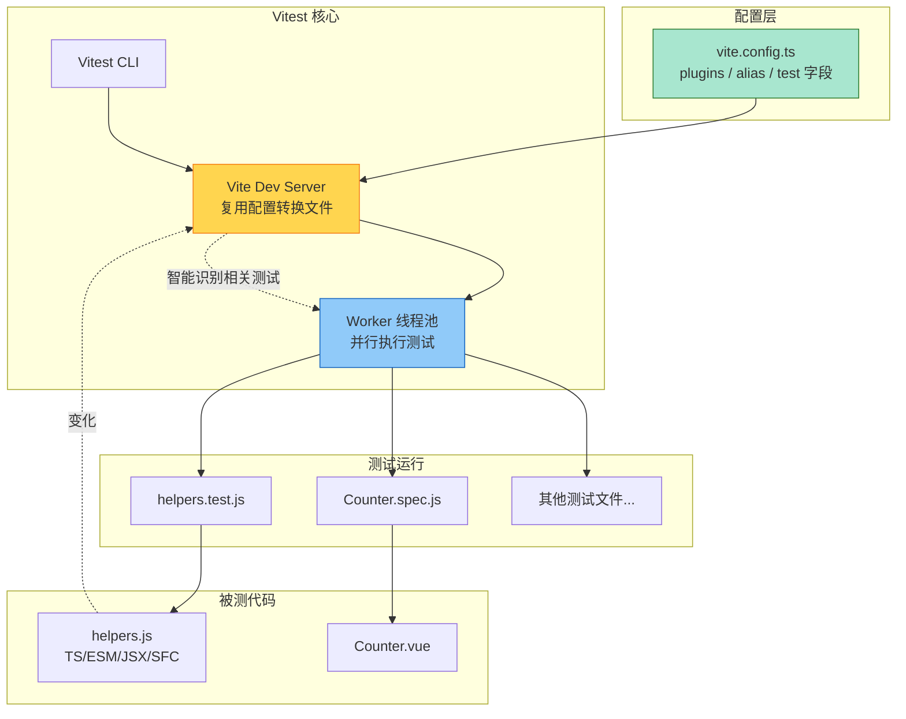

扫描[二维码](https://api2.cmdragon.cn/upload/cmder/20250304_012821924.jpg)关注或者微信搜一搜：`编程智域 前端至全栈交流与成长`

[发现1000+提升效率与开发的AI工具和实用程序](https://tools.cmdragon.cn/zh/apps?category=ai_chat)：https://tools.cmdragon.cn/


## 一、同一套工具链的好处

假设你开了一家小餐馆。厨师炒菜用一套锅碗瓢盆，洗碗工洗碗又用另一套，结果两套家伙事儿规格还不一样——厨师要的盘子洗碗工不洗，洗碗工洗好的盘子厨师用不上。每天光是协调这两套东西就够你头疼的了。

如果你能让厨师和洗碗工共用同一套标准化的器具，事情就顺多了：洗好的盘子厨师拿来就能用，规格统一，沟通成本几乎为零。

前端项目里的"两套家伙事儿"是怎么来的？就是构建工具和测试工具各搞各的。你用 Vite 做开发服务器和构建，又用 Jest 写测试，结果两边各自维护一套配置、一套插件、一套转换管道。开发环境能跑的东西，测试环境跑不了；测试环境改的 alias，开发环境又不认。这事儿在 Vue 3 项目里特别明显，因为 Vue 用了 SFC（单文件组件）、用了 JSX、用了 TypeScript，每一项都得在 Jest 里额外配置一遍。

Vitest 就是为解决这个问题而生的。它和 Vite 共用一套"锅碗瓢盆"，让你的开发、构建、测试跑在同一套配置上。这一章我们就来好好聊聊它。

## 二、Vitest 是什么

Vitest（发音"veetest"）是一个由 Vite 驱动的下一代测试框架。说白了，它就是 Vite 的"亲儿子"——由 Vue/Vite 团队开发和维护，和 Vite 共享同一套配置和插件生态。

官方对它的定位非常明确：**Vite Powered**。它不是另起炉灶造一个全新的测试工具，而是直接复用 Vite 的 dev server 来转换文件，把测试这件事"挂"在 Vite 已经搭好的管道上。

Vue 官方测试文档里也是把 Vitest 列为推荐方案的：对于 Vue 3 项目，单元测试和组件测试首选 Vitest，理由就是它和 Vite 无缝集成。只有在一种情况下官方才推荐 Jest——你已经有现成的 Jest 配置需要迁移，那可以先用着，不必为了换而换。

## 三、为什么需要 Vitest

要理解 Vitest 的价值，得先看看在它出现之前，Vite 项目用 Jest 写测试是什么感受。

### 1. Jest 和 Vite 的"两套管道线"痛点

Jest 诞生于 2014 年，那时候 React 还很年轻，Vite 连影子都没有。Jest 自带一套完整的文件转换系统：用 Babel 或者 ts-jest 处理 TypeScript，用 babel-jest 处理 JSX，遇到 Vue SFC 还得装 `vue-jest`……每一类文件都得在 Jest 的 `transform` 配置里写一条规则。

而你的 Vite 项目里，这些东西早就配好了：`vite.config.ts` 里的 `resolve.alias`、`plugins` 里的 `@vitejs/plugin-vue`、`@vitejs/plugin-react`、PostCSS 配置……开发服务器跑得好好的，构建也没问题。

问题来了：**这些配置 Jest 不认**。

你在 `vite.config.ts` 里写了个 `@/` 指向 `src/`，开发环境美滋滋；可是 Jest 不读这个配置，它有自己的 `moduleNameMapper`。你给 Jest 配了一遍 `@/`，哪天 Vite 那边改了路径，Jest 这边忘了同步，测试就红。Vue SFC 也是一样，Vite 有 `@vitejs/plugin-vue` 处理，Jest 这边得单独装 `@vue/vue3-jest` 并配 transform。ESM、装饰器、路径别名……每一项都得在两边各配一次。

这就形成了一种很尴尬的局面：**同一个项目里，开发和测试用的是两套互不相通的转换管道**。配置重复、行为不一致、维护成本翻倍。

### 2. Vitest 的解法：复用 Vite 的管道

Vitest 的思路特别直接：既然 Vite 已经能把这些文件转换好了，我干嘛还要再搞一套？直接让测试代码也走 Vite 的转换管道不就行了。

于是 Vitest 启动时，会读取你的 `vite.config.ts`，复用里面的插件和别名配置。你在 Vite 里配了 `@/` 指向 `src/`，Vitest 自动就认；你装了 `@vitejs/plugin-vue`，Vitest 自动就能处理 `.vue` 文件。一套配置，开发和测试共享，再也不会出现"开发能跑测试跑不了"的怪事。

Vitest 官方文档里说得很清楚：它利用 Vite dev server 来转换文件，无需处理源文件转换的复杂性，从而专注于提供最佳测试体验（DX）。这种"少做一件事，做得更好"的哲学，正是它快且省心的根源。

## 四、Vitest 的核心优势

### 1. Vite 驱动：一套配置走天下

这是 Vitest 最大的卖点。你的 `vite.config.ts` 就是 Vitest 的配置文件（也可以单独建 `vitest.config.ts`，但大多数情况下没必要）。

来看一个最小化的配置示例：

```ts
// vite.config.ts
import { defineConfig } from 'vitest/config'
import vue from '@vitejs/plugin-vue'

// defineConfig 让配置有类型提示，写错了编辑器会提醒
export default defineConfig({
  // 插件：让 Vite 能处理 .vue 文件，Vitest 自动复用
  plugins: [vue()],
  resolve: {
    alias: {
      // 路径别名：开发和测试都生效
      '@': '/src'
    }
  },
  test: {
    // test 字段是 Vitest 专用的，Vite 会忽略它
    environment: 'jsdom', // 组件测试需要 DOM 环境
    globals: true          // 让 describe/test/expect 全局可用，不用每次 import
  }
})
```

注意几个细节：

- 从 `vitest/config` 导入 `defineConfig`，它比 Vite 的版本多了 `test` 字段的类型；
- `plugins` 和 `resolve.alias` 是 Vite 原生配置，Vitest 直接复用；
- `test` 字段是 Vitest 独有的，Vite 跑 dev 服务器时会自动忽略它，不会互相干扰。

这一套配置下来，你的开发服务器、构建命令、测试命令，全用同一个文件，真正实现了"一处配置，处处生效"。

### 2. Jest 兼容：迁移成本几乎为零

如果你之前用过 Jest，转 Vitest 几乎不用学新东西。`describe`、`test`、`expect`、`beforeEach`、`afterEach` 这些 API 的用法跟 Jest 一模一样；快照测试、mock、覆盖率这些高级功能也都有对应实现。

看一段典型的 Vitest 测试代码：

```js
// math.test.js
// 从 vitest 导入 test 和 expect（如果开了 globals: true 可以省略这行）
import { test, expect } from 'vitest'
import { add } from './math'

// describe 把用例分组，跟 Jest 完全一样
describe('add', () => {
  // test 定义一个用例
  test('两个正数相加', () => {
    // expect 断言，toBe 检查严格相等
    expect(add(1, 2)).toBe(3)
  })

  test('负数相加', () => {
    expect(add(-1, -2)).toBe(-3)
  })
})
```

是不是跟你写过的 Jest 测试长得几乎一样？这就是 Vitest 友好的地方：API 兼容，肌肉记忆直接复用。从 Jest 迁移，官方还提供了 `vitest migrate` 命令，能帮你自动改一部分配置。

### 3. 智能监听模式：测试版的 HMR

Vite 开发体验最爽的一点是什么？HMR（热模块替换）。你改一行代码，浏览器不用整页刷新，只更新变化的部分，几乎瞬间生效。

Vitest 把这个思路搬到了测试里。它的监听模式（watch mode）默认开启，而且很"聪明"——它不会傻乎乎地把所有测试都重跑一遍，而是只重跑跟改动相关的那些用例。

打个比方，你改了 `helpers.js` 里的 `increment` 函数，Vitest 知道只有 `helpers.spec.js` 依赖它，于是只重跑这一个文件；如果 `helpers.js` 还被 `Counter.vue` 用到，那 `Counter.spec.js` 也会被重跑。其他的几百个测试文件，纹丝不动，省下大量时间。

这种"精准重跑"的能力，让开发时的反馈循环特别短。你改完代码，眼睛一眨，测试结果就出来了。官方管这叫 "Smart & instant watch mode"。

### 4. ESM、TypeScript、JSX 开箱即用

在 Jest 里用 ESM 是个老大难。要么得开 `--experimental-vm-modules`，要么得用 Babel 转一道，配置写起来很容易头大。TypeScript 要装 `ts-jest` 或者配 `transform`，JSX 也得单独处理。

Vitest 这边呢？因为底层是 Vite，而 Vite 本来就内置了对 ESM、TypeScript、JSX 的支持，所以这些在 Vitest 里**全都是开箱即用**的。你写 `.ts`、`.tsx`、`.jsx`，写 `import/export`，啥都不用额外配，直接跑。

官方说这个能力是由 Oxc（一个用 Rust 写的 JS 工具链）驱动的，速度特别快。对使用者来说，你只需要知道：写现代 JS，不用纠结工具链配置。

### 5. Worker 线程并行：跑得快的另一个秘密

除了转换文件快，Vitest 还会用 Worker 线程把测试文件并行跑。你有 8 个 CPU 核心，它就开 8 个 worker，每个 worker 跑一部分测试文件，互不阻塞。一个文件卡住了，不会拖累其他文件。

这点在测试用例多的时候优势特别明显。几百个测试文件串行跑可能要一两分钟，并行跑可能十几秒就完事了。

## 五、Vitest vs Jest 对比

光说优势可能不够直观，咱们来一张对比表，把两者的差异摆出来：

| 对比维度 | Vitest | Jest |
|---------|--------|------|
| 与 Vite 集成 | 原生复用 Vite 配置和插件 | 需要单独配置 transform 和 alias |
| ESM 支持 | 开箱即用 | 需额外配置，体验较繁琐 |
| TypeScript 支持 | 开箱即用 | 需要 ts-jest 或 babel |
| Vue SFC 支持 | 通过 @vitejs/plugin-vue 自动处理 | 需要安装 @vue/vue3-jest 并配置 transform |
| 监听模式 | 智能重跑相关测试 | 重跑所有受影响文件，相对较慢 |
| 并行执行 | Worker 线程并行 | 也有并行，但文件转换开销大 |
| API 兼容性 | 兼容 Jest 主要 API | 自身就是事实标准 |
| 启动速度 | 快（复用 Vite dev server） | 慢（需独立转换文件） |
| 适合项目 | Vite 项目首选 | 已有 Jest 配置的老项目 |
| 维护团队 | Vue/Vite 团队 | Meta（Facebook） |

从这张表能看出来，对于 Vue 3 + Vite 项目，Vitest 几乎在每个维度都更顺手。但 Jest 也不是没价值——它生态成熟、文档丰富、社区大，如果你接手的是个老项目，原来就配好了 Jest，没必要为了追新而强行迁移。

## 六、Vitest 的适用场景

### 1. Vite 项目：天然绝配

如果你的项目本来就用 Vite 构建（现在新建的 Vue 3 项目基本都是），那 Vitest 就是默认选择，没有之二。配置零重复，启动飞快，Vue SFC 直接能测，TypeScript 直接能写。

### 2. 非 Vite 项目：也能用，但没那么香

Vitest 也能用在非 Vite 项目里（比如 Webpack 构建的项目）。它依然能跑，依然快，但你享受不到"复用 Vite 配置"这个核心红利——你还是得给 Vitest 单独配 alias、配插件。这种情况下，要不要从 Jest 切到 Vitest，就得权衡一下迁移成本了。

Vue 官方文档的建议很务实：推荐 Vitest 用于 Vite 项目；只在已有 Jest 配置且需要迁移时才考虑 Jest。换句话说，**新项目用 Vitest，老项目按需迁移**。

## 七、安装与第一个测试

光说不练假把式，咱们来真正装一下、跑一个。

### 1. 环境要求

Vitest 官方要求：Vite >= v6.0.0，Node >= v20.0.0。版本低了会报错，装之前先 `node -v` 和 `npm ls vite` 看一眼。

### 2. 安装

```bash
# 安装 vitest 作为开发依赖
npm install -D vitest
```

如果你要做组件测试，还得装两个伙伴：

```bash
# jsdom 提供模拟的 DOM 环境
# @vue/test-utils 是官方的 Vue 组件测试工具
npm install -D jsdom @vue/test-utils
```

### 3. 配置

在 `vite.config.ts` 里加上 `test` 字段：

```ts
// vite.config.ts
import { defineConfig } from 'vitest/config'
import vue from '@vitejs/plugin-vue'

export default defineConfig({
  plugins: [vue()],
  test: {
    environment: 'jsdom',
    globals: true
  }
})
```

### 4. 写第一个测试

```js
// src/helpers.js
// 一个简单的加法函数
export function add(a, b) {
  return a + b
}
```

```js
// src/helpers.test.js
import { test, expect } from 'vitest'
import { add } from './helpers'

test('add 把两个数字加起来', () => {
  expect(add(1, 2)).toBe(3)
})
```

### 5. 运行测试

在 `package.json` 里加一条脚本：

```json
{
  "scripts": {
    "test": "vitest run",
    "test:watch": "vitest"
  }
}
```

- `npm test` 是单次运行，跑完就退出，适合 CI；
- `npm run test:watch` 是监听模式，适合开发时用，改代码自动重跑。

下面这张架构图把 Vitest 的工作原理串起来，你可以更直观地看到它和 Vite 的关系：



从图里能看出来，Vite 配置是整个流程的"源头"，Vitest 复用它来转换文件，再分发给 Worker 并行跑。被测代码一旦变化，Vite dev server 会感知到，Vitest 据此智能选择要重跑的测试，形成高效的反馈循环。

## 八、课后 Quiz

### Quiz 1

题目：下面关于 Vitest 和 Vite 配置关系的说法，哪个是正确的？

A. Vitest 必须单独创建 `vitest.config.ts`，不能复用 `vite.config.ts`
B. Vitest 会读取 `vite.config.ts` 中的 `plugins` 和 `resolve.alias`，但忽略 `test` 字段以外的内容
C. Vite 开发服务器会读取 `vite.config.ts` 中的 `test` 字段并报错
D. `vite.config.ts` 里的 `test` 字段只有 Vitest 认，Vite 跑 dev/build 时会自动忽略它

**答案解析**：选 D。Vitest 默认复用 `vite.config.ts`，里面的 `plugins`、`resolve.alias` 等配置它都认，`test` 字段是 Vitest 专用的扩展，Vite 在跑 dev server 或 build 时会自动忽略它，不会报错。A 错，Vitest 可以复用 `vite.config.ts`，不一定非得单独建文件；B 错，Vitest 不只是读 `test` 字段，它同样会用到 `plugins` 和 `alias`；C 错，Vite 不认 `test` 字段但也不会报错，只是忽略。这个设计很巧妙：一个文件，两个工具各取所需，互不打扰。

### Quiz 2

题目：为什么 Vitest 的监听模式比 Jest 的 watch 模式更快？下面哪个说法最准确？

A. Vitest 用 Rust 重写了整个测试运行器
B. Vitest 只重跑跟改动文件有依赖关系的测试，而不是全部重跑
C. Vitest 不支持监听模式，只能单次运行
D. Vitest 跳过了所有断言检查，所以快

**答案解析**：选 B。Vitest 的智能监听模式会分析文件依赖关系，只重跑那些真正受改动影响的测试文件，其他无关测试不执行。这种"按需重跑"的方式大幅缩短了反馈时间。A 错，Vitest 确实用了 Oxc（Rust 写的工具链）来加速文件转换，但运行器本身不是 Rust 重写的；C 错，Vitest 默认就是监听模式，`vitest run` 才是单次运行；D 错，断言是测试的核心，不可能跳过。这道题考的是"智能"二字的真正含义——不是更快地跑完所有，而是少跑那些不需要跑的。

### Quiz 3

题目：你的 Vue 3 项目用 Vite 构建，要给一个 `.vue` 组件写测试。下面哪种做法是 Vitest 推荐的？

A. 安装 `@vue/vue3-jest` 并在 transform 里配置 `.vue` 文件的处理
B. 在 `vite.config.ts` 里配置 `@vitejs/plugin-vue`，Vitest 自动复用，无需额外装处理 SFC 的包
C. 把 `.vue` 文件先编译成 `.js`，再让 Vitest 测试编译后的文件
D. Vitest 不支持测试 `.vue` 组件，必须用 Cypress

**答案解析**：选 B。因为 Vitest 复用 Vite 的配置和插件，只要 `vite.config.ts` 里配了 `@vitejs/plugin-vue`，Vitest 就能直接处理 `.vue` 文件，不需要额外装 `@vue/vue3-jest` 那套转换管道。A 是 Jest 时代的做法，在 Vitest 里属于多此一举；C 是非常老派的思路，现代测试框架不需要手动预编译；D 完全错误，Vitest 配合 `@vue/test-utils` 完全可以测 Vue 组件。这个题考的就是"一套配置走天下"这个核心优势的具体体现。

## 九、常见报错解决方案

### 报错 1："Failed to resolve import" 或 "Cannot find module '@/xxx'"

**产生原因**：路径别名没生效。最常见的情况是 `vite.config.ts` 里配了 `@` 指向 `src/`，但 Vitest 没读到这个配置。可能是因为你把配置写在了 `vitest.config.ts` 里，而那个文件没继承 Vite 的 alias；也可能是 alias 的写法不对，Vite 用绝对路径 `/src/`，而 Vitest 在 Node 环境下有时需要 `path.resolve(__dirname, 'src')` 这种形式。

**解决办法**：

第一步，确认配置文件。优先用 `vite.config.ts`，让 Vitest 和 Vite 共享配置。如果必须分开，确保 `vitest.config.ts` 里也写了 alias。

第二步，alias 用 `path.resolve` 写法更稳妥：

```ts
// vite.config.ts
import { defineConfig } from 'vitest/config'
import path from 'node:path'
import vue from '@vitejs/plugin-vue'

export default defineConfig({
  plugins: [vue()],
  resolve: {
    alias: {
      // 用绝对路径，开发和测试都能识别
      '@': path.resolve(__dirname, 'src')
    }
  },
  test: {
    environment: 'jsdom'
  }
})
```

第三步，如果还是不行，检查 `tsconfig.json` 里的 `paths` 是否和 `resolve.alias` 一致，IDE 能跳转不代表 Vitest 能解析。

**预防建议**：项目初始化时就统一好 alias 配置，`vite.config.ts`、`tsconfig.json`、Vitest 三处保持一致。别图省事只在 `tsconfig.json` 里配 paths，那只是给 IDE 看的，运行时不认。

### 报错 2："Error: Cannot find module 'vitest'" 或 "vitest is not recognized"

**产生原因**：Vitest 没装好，或者装了但没装到当前项目的 `node_modules` 里。常见于用 pnpm 或 yarn 的项目，包管理器的 hoisting 机制把 Vitest 装到了别的地方，导致命令找不到。另一个原因是全局装了 Vitest 但项目里没装，CI 环境下会失败。

**解决办法**：

第一步，确认是否安装。看 `package.json` 的 `devDependencies` 里有没有 `vitest`。没有就装：

```bash
npm install -D vitest
```

第二步，用 `npx vitest run` 而不是直接 `vitest run`。`npx` 会优先找项目本地的 `node_modules/.bin`，避免用到全局的旧版本。

第三步，如果你用 pnpm，确认 `pnpm-workspace.yaml` 没把 vitest 排除在外。monorepo 场景下，建议在每个子包里单独装，或者在根目录装并配置 `public-hoist-pattern[]=vitest`。

**预防建议**：把 `vitest` 锁定在项目 `devDependencies` 里，别依赖全局安装。CI 环境一定要 `npm ci` 安装，确保和本地版本一致。版本号可以用 `^`，但别差太多大版本。

### 报错 3："ReferenceError: window is not defined" 或 "document is not defined"

**产生原因**：测试代码里用到了 `window` 或 `document` 这些浏览器 API，但 Vitest 的运行环境是 Node.js，默认没有这些全局对象。这种情况在组件测试里特别常见——挂载组件会触碰到 DOM。

**解决办法**：

第一步，在配置里指定 `environment` 为 `jsdom`（或 `happy-dom`）：

```ts
// vite.config.ts
export default defineConfig({
  test: {
    environment: 'jsdom' // 提供 window、document 等 DOM API
  }
})
```

第二步，确保装了 `jsdom`：

```bash
npm install -D jsdom
```

第三步，如果只有部分测试需要 DOM 环境，可以在文件顶部用注释指令单独指定，避免全局开 jsdom 拖慢纯单元测试：

```js
// @vitest-environment jsdom
// 这一行告诉 Vitest：这个文件用 jsdom 环境
import { test, expect } from 'vitest'

test('能访问 document', () => {
  expect(document).toBeDefined()
})
```

**预防建议**：项目结构上把组件测试和纯单元测试分目录放，配置上用 `environmentMatchGlobs`（或 `projects` 配置）按目录自动切换环境。这样纯逻辑测试跑在 node 环境里更快，组件测试跑在 jsdom 里有 DOM。既保证速度，又避免报错。

## 十、参考链接

- 参考链接：https://vuejs.org/guide/scaling-up/testing.html
- 参考链接：https://vitest.dev/guide/
- 参考链接：https://vitest.dev/api/
- 参考链接：https://vuejs.org/guide/quick-start.html

余下文章内容请点击跳转至 个人博客页面 或者 扫描[二维码](https://api2.cmdragon.cn/upload/cmder/20250304_012821924.jpg)关注或者微信搜一搜：`编程智域 前端至全栈交流与成长`，阅读完整的文章：[Vue 3测试入门第二章：Vitest是什么？Vite原生测试框架凭什么这么快](https://blog.cmdragon.cn/posts/5e2a8c1f9d3b6e70/)


<details>
<summary>往期文章归档</summary>

- [Vue 3 静态与动态 Props 如何传递？TypeScript 类型约束有何必要？](https://blog.cmdragon.cn/posts/94ab48753b64780ca3ab7a7115ae8522/)
- [Vue 3中组件局部注册的优势与实现方式如何？](https://blog.cmdragon.cn/posts/dbf576e744870f6de26fd8a2e03e47da/)
- [如何在Vue3中优化生命周期钩子性能并规避常见陷阱？](https://blog.cmdragon.cn/posts/12d98b3b9ccd6c19a1b169d720ac5c80/)
- [Vue 3 Composition API生命周期钩子：如何实现从基础理解到高阶复用？](https://blog.cmdragon.cn/posts/8884e2b70287fcb263c57648eeb27419/)
- [Vue 3生命周期钩子实战指南：如何正确选择onMounted、onUpdated与onUnmounted的应用场景？](https://blog.cmdragon.cn/posts/883c6dbc50ae4183770a4462e0b8ae4d/)
- [Vue 3中生命周期钩子与响应式系统如何实现协同工作？](https://blog.cmdragon.cn/posts/70dad360ffa9dce14d0d69611b8cb019/)
- [Vue 3组件生命周期钩子的执行顺序与使用场景是什么？](https://blog.cmdragon.cn/posts/db44294a78dc9f666f67b053f6c83567/)
- [Vue组件全局注册与局部注册如何抉择？](https://blog.cmdragon.cn/posts/43ead630ea17da65d99ad2eb8188e472/)
- [Vue3组件化开发中，Props与Emits如何实现数据流转与事件协作？](https://blog.cmdragon.cn/posts/8cff7d2df113da66ea7be560c4d1d22a/)
- [Vue 3模板引用如何与其他特性协同实现复杂交互？](https://blog.cmdragon.cn/posts/331bf75d114ab09116eadfcdca602b58/)
- [Vue 3 v-for中模板引用如何实现高效管理与动态控制？](https://blog.cmdragon.cn/posts/cb380897ddc3578b180ecf8843c774c1/)
- [Vue 3的defineExpose：如何突破script setup组件默认封装，实现精准的父子通讯？](https://blog.cmdragon.cn/posts/202ae0f4acde7128e0e31baf63732fb5/)
- [Vue 3模板引用的生命周期时机如何把握？常见陷阱该如何避免？](https://blog.cmdragon.cn/posts/7d2a0f6555ecbe92afd7d2491c427463/)
- [Vue 3模板引用如何实现父组件与子组件的高效交互？](https://blog.cmdragon.cn/posts/3fb7bdd84128b7efaaa1c979e1f28dee/)
- [Vue中为何需要模板引用？又如何高效实现DOM与组件实例的直接访问？](https://blog.cmdragon.cn/posts/23f3464ba16c7054b4783cded50c04c6/)
- [Vue 3 watch与watchEffect如何区分使用？常见陷阱与性能优化技巧有哪些？](https://blog.cmdragon.cn/posts/68a26cc0023e4994a6bc54fb767365c8/)
- [Vue3侦听器实战：组件与Pinia状态监听如何高效应用？](https://blog.cmdragon.cn/posts/fd4695f668d64332dda9962c24214f32/)
- [Vue 3中何时用watch，何时用watchEffect？核心区别及性能优化策略是什么？](https://blog.cmdragon.cn/posts/cdbbb1837f8c093252e61f46dbf0a2e7/)
- [Vue 3中如何有效管理侦听器的暂停、恢复与副作用清理？](https://blog.cmdragon.cn/posts/09551ab614c463a6d6ca69818e8c2d52/)
- [Vue 3 watchEffect：如何实现响应式依赖的自动追踪与副作用管理？](https://blog.cmdragon.cn/posts/b7bca5d20f628ac09f7192ad935ef664/)
- [Vue 3 watch如何利用immediate、once、deep选项实现初始化、一次性与深度监听？](https://blog.cmdragon.cn/posts/2c6cdb100a20f10c7e7d4413617c7ea9/)
- [Vue 3中watch如何高效监听多数据源、计算结果与数组变化？](https://blog.cmdragon.cn/posts/757a1728bc1b9c0c8b317b0354d85568/)
- [Vue 3中watch监听ref和reactive的核心差异与注意事项是什么？](https://blog.cmdragon.cn/posts/8e70552f0f61e0dc8c7f567a2d272345/)
- [Vue3中Watch与watchEffect的核心差异及适用场景是什么？](https://blog.cmdragon.cn/posts/dde70ab90dc5062c435e0501f5a6e7cb/)
- [Vue 3自定义指令如何赋能表单自动聚焦与防抖输入的高效实现？](https://blog.cmdragon.cn/posts/1f5ed5047850ed52c0fd0386f76bd4ae/)
- [Vue3中如何优雅实现支持多绑定变量和修饰符的双向绑定组件？](https://blog.cmdragon.cn/posts/e3d4e128815ad731611b8ef29e37616b/)
- [Vue 3表单验证如何从基础规则到异步交互构建完整验证体系？](https://blog.cmdragon.cn/posts/7d1caedd822f70542aa0eed67e30963b/)
- [Vue3响应式系统如何支撑表单数据的集中管理、动态扩展与实时计算？](https://blog.cmdragon.cn/posts/3687a5437ab56cb082b5b813d5577a40/)
- [Vue3跨组件通信中，全局事件总线与provide/inject该如何正确选择？](https://blog.cmdragon.cn/posts/ad67c4eb6d76cf7707bdfe6a8146c34f/)
- [Vue3表单事件处理：v-model如何实现数据绑定、验证与提交？](https://blog.cmdragon.cn/posts/1c1e80d697cca0923f29ec70ebb8ccd1/)
- [Vue应用如何基于DOM事件传播机制与事件修饰符实现高效事件处理？](https://blog.cmdragon.cn/posts/b990828143d70aa87f9aa52e16692e48/)
- [Vue3中如何在调用事件处理函数时同时传递自定义参数和原生DOM事件？参数顺序有哪些注意事项？](https://blog.cmdragon.cn/posts/b44316e0866e9f2e6aef927dbcf5152b/)
- [从捕获到冒泡：Vue事件修饰符如何重塑事件执行顺序？](https://blog.cmdragon.cn/posts/021636c2a06f5e2d3d01977a12ddf559/)
- [Vue事件处理：内联还是方法事件处理器，该如何抉择？](https://blog.cmdragon.cn/posts/b3cddf7023ab537e623a61bc01dab6bb/)
- [Vue事件绑定中v-on与@语法如何取舍？参数传递与原生事件处理有哪些实战技巧？](https://blog.cmdragon.cn/posts/bd4d9607ce1bc34cc3bda0a1a46c40f6/)
- [Vue 3中列表排序时为何必须复制数组而非直接修改原始数据？](https://blog.cmdragon.cn/posts/a5f2bacb74476fd7f5e02bb3f1ba6b2b/)
- [Vue虚拟滚动如何将列表DOM数量从万级降至十位数？](https://blog.cmdragon.cn/posts/d3b06b57fb7f126787e6ed22dce1e341/)
- [Vue3中v-if与v-for直接混用为何会报错？计算属性如何解决优先级冲突？](https://blog.cmdragon.cn/posts/3100cc5a2e16f8dac36f722594e6af32/)
- [为何在Vue3递归组件中必须用v-if判断子项存在？](https://blog.cmdragon.cn/posts/455dc2d47c38d12c1cf350e490041e8b/)
- [Vue3列表渲染中，如何用数组方法与计算属性优化v-for的数据处理？](https://blog.cmdragon.cn/posts/3f842bbd7ba0f9c91151b983bf784c8b/)
- [Vue v-for的key：为什么它能解决列表渲染中的“玄学错误”？选错会有哪些后果？](https://blog.cmdragon.cn/posts/1eb3ffac668a743843b5ea1738301d40/)
- [Vue3中v-for与v-if为何不能直接共存于同一元素？](https://blog.cmdragon.cn/posts/138b13c5341f6a1fa9015400433a3611/)
- [Vue3中v-if与v-show的本质区别及动态组件状态保持的关键策略是什么？](https://blog.cmdragon.cn/posts/0242a94dc552b93a1bc335ac4fc33db5/)
 - [Vue3中v-show如何通过CSS修改display属性控制条件显示？与v-if的应用场景该如何区分？](https://blog.cmdragon.cn/posts/97c66a18ae0e9b57c6a69b8b3a41ddf6/)
- [Vue3条件渲染中v-if系列指令如何合理使用与规避错误？](https://blog.cmdragon.cn/posts/8a1ddfac64b25062ac56403e4c1201d2/)
- [Vue3动态样式控制：ref、reactive、watch与computed的应用场景与区别是什么？](https://blog.cmdragon.cn/posts/218c3a59282c3b757447ee08a01937bb/)
- [Vue3中动态样式数组的后项覆盖规则如何与计算属性结合实现复杂状态样式管理？](https://blog.cmdragon.cn/posts/1bab953e41f66ac53de099fa9fe76483/)
- [Vue浅响应式如何解决深层响应式的性能问题？适用场景有哪些？ - cmdragon's Blog](https://blog.cmdragon.cn/posts/c85e1fe16a7ae45e965b4e2df4d9d2f4/)
- [Vue 3组合式API中ref与reactive的核心响应式差异及使用最佳实践是什么？ - cmdragon's Blog](https://blog.cmdragon.cn/posts/be04b02d2723994632de0d4ca22a3391/)
- [Vue 3组合式API中ref与reactive的核心响应式差异及使用最佳实践是什么？ - cmdragon's Blog](https://blog.cmdragon.cn/posts/be04b02d2723994632de0d4ca22a3391/)
- [Vue3响应式系统中，对象新增属性、数组改索引、原始值代理的问题如何解决？ - cmdragon's Blog](https://blog.cmdragon.cn/posts/a0af08dd60a37b9a890a9957f2cbfc9f/)
- [Vue 3中watch侦听器的正确使用姿势你掌握了吗？深度监听、与watchEffect的差异及常见报错解析 - cmdragon's Blog](https://blog.cmdragon.cn/posts/bc287e1e36287afd90750fd907eca85e/)
- [Vue响应式声明的API差异、底层原理与常见陷阱你都搞懂了吗 - cmdragon's Blog](https://blog.cmdragon.cn/posts/654b9447ef1ba7ec1126a1bc26a4726d/)
- [Vue响应式声明的API差异、底层原理与常见陷阱你都搞懂了吗 - cmdragon's Blog](https://blog.cmdragon.cn/posts/654b9447ef1ba7ec1126a1bc26a4726d/)
- [为什么Vue 3需要ref函数？它的响应式原理与正确用法是什么？ - cmdragon's Blog](https://blog.cmdragon.cn/posts/c405a8d9950af5b7c63b56c348ac36b6/)
- [Vue 3中reactive函数如何通过Proxy实现响应式？使用时要避开哪些误区？ - cmdragon's Blog](https://blog.cmdragon.cn/posts/a7e9abb9691a81e4404d9facabe0f7c3/)
- [Vue3响应式系统的底层原理与实践要点你真的懂吗？ - cmdragon's Blog](https://blog.cmdragon.cn/posts/bd995ea45161727597fb85b62566c43d/)
- [Vue 3模板如何通过编译三阶段实现从声明式语法到高效渲染的跨越 - cmdragon's Blog](https://blog.cmdragon.cn/posts/53e3f270a80675df662c6857a3332c0f/)
- [快速入门Vue模板引用：从收DOM“快递”到调子组件方法，你玩明白了吗？ - cmdragon's Blog](https://blog.cmdragon.cn/posts/ddbce4f2a23aa72c96b1c0473900321e/)
- [快速入门Vue模板里的JS表达式有啥不能碰？计算属性为啥比方法更能打？ - cmdragon's Blog](https://blog.cmdragon.cn/posts/23a2d5a334e15575277814c16e45df50/)
- [快速入门Vue的v-model表单绑定：语法糖、动态值、修饰符的小技巧你都掌握了吗？ - cmdragon's Blog](https://blog.cmdragon.cn/posts/6be38de6382e31d282659b689c5b17f0/)
- [快速入门Vue3事件处理的挑战题：v-on、修饰符、自定义事件你能通关吗？ - cmdragon's Blog](https://blog.cmdragon.cn/posts/60ce517684f4a418f453d66aa805606c/)
- [快速入门Vue3的v-指令：数据和DOM的“翻译官”到底有多少本事？ - cmdragon's Blog](https://blog.cmdragon.cn/posts/e4ae7d5e4a9205bb11b2baccb230c637/)
- [快速入门Vue3，插值、动态绑定和避坑技巧你都搞懂了吗？ - cmdragon's Blog](https://blog.cmdragon.cn/posts/999ce4fb32259ff4fbf4bf7bcb851654/)
- [想让PostgreSQL快到飞起？先找健康密码还是先换引擎？ - cmdragon's Blog](https://blog.cmdragon.cn/posts/a6997d81b49cd232b87e1cf603888ad1/)
- [想让PostgreSQL查询快到飞起？分区表、物化视图、并行查询这三招灵不灵？ - cmdragon's Blog](https://blog.cmdragon.cn/posts/1fee7afbb9abd4540b8aa9c141d6845d/)
- [子查询总拖慢查询？把它变成连接就能解决？ - cmdragon's Blog](https://blog.cmdragon.cn/posts/79c590fbd87ece535b11a71c9667884f/)
- [PostgreSQL全表扫描慢到崩溃？建索引+改查询+更统计信息三招能破？ - cmdragon's Blog](https://blog.cmdragon.cn/posts/748cdac2536008199abf8a8a2cd0ec85/)
- [复杂查询总拖后腿？PostgreSQL多列索引+覆盖索引的神仙技巧你get没？ - cmdragon's Blog](https://blog.cmdragon.cn/posts/32ca943703226d317d4276a8fb53b0dd/)
- [只给表子集建索引？用函数结果建索引？PostgreSQL这俩操作凭啥能省空间又加速？ - cmdragon's Blog](https://blog.cmdragon.cn/posts/ca93f1d53aa910e7ba5ffd8df611c12b/)
- [B-tree索引像字典查词一样工作？那哪些数据库查询它能加速，哪些不能？ - cmdragon's Blog](https://blog.cmdragon.cn/posts/f507856ebfddd592448813c510a53669/)
- [想抓PostgreSQL里的慢SQL？pg_stat_statements基础黑匣子和pg_stat_monitor时间窗，谁能帮你更准揪出性能小偷？ - cmdragon's Blog](https://blog.cmdragon.cn/posts/b2213bfcb5b88a862f2138404c03d596/)
- [PostgreSQL的“时光机”MVCC和锁机制是怎么搞定高并发的？ - cmdragon's Blog](https://blog.cmdragon.cn/posts/26614eb7da6c476dde41d367ad888d2f/)
- [PostgreSQL性能暴涨的关键？内存IO并发参数居然要这么设置？ - cmdragon's Blog](https://blog.cmdragon.cn/posts/69f99bc6972a860d559c74aad7280da4/)
- [大表查询慢到翻遍整个书架？PostgreSQL分区表教你怎么“分类”才高效](https://blog.cmdragon.cn/posts/7b7053f392147a8b3b1a16bebeb08d0a/)
- [PostgreSQL 查询慢？是不是忘了优化 GROUP BY、ORDER BY 和窗口函数？ - cmdragon's Blog](https://blog.cmdragon.cn/posts/c856e3cb073822349f3bf2d29995dcfc/)
- [PostgreSQL里的子查询和CTE居然在性能上“掐架”？到底该站哪边？ - cmdragon's Blog](https://blog.cmdragon.cn/posts/c096347d18e67b7431faacd2c4757093/)
- [PostgreSQL选Join策略有啥小九九？Nested Loop/Merge/Hash谁是它的菜？ - cmdragon's Blog](https://blog.cmdragon.cn/posts/2eca89463454fd4250d7b66243b9fe5a/)
- [PostgreSQL新手SQL总翻车？这7个性能陷阱你踩过没？ - cmdragon's Blog](https://blog.cmdragon.cn/posts/068ecb772a87d7df20a8c9fb4b233f8e/)
- [PostgreSQL索引选B-Tree还是GiST？“瑞士军刀”和“多面手”的差别你居然还不知道？ - cmdragon's Blog](https://blog.cmdragon.cn/posts/d498f63cd0a2d5a77e445c688a8b88db/)
- [想知道数据库怎么给查询“算成本选路线”？EXPLAIN能帮你看明白？ - cmdragon's Blog](https://blog.cmdragon.cn/posts/9101b75bdec6faea9b35d54f14e37f36/)
- [PostgreSQL处理SQL居然像做蛋糕？解析到执行的4步里藏着多少查询优化的小心机？ - cmdragon's Blog](https://blog.cmdragon.cn/posts/d527f8ebb6e3dae2c7dfe4c8d8979444/)
- [PostgreSQL备份不是复制文件？物理vs逻辑咋选？误删还能精准恢复到1分钟前？ - cmdragon's Blog](https://blog.cmdragon.cn/posts/6bfdae84f313cf7ad0bb7045c4392347/)
- [转账不翻车、并发不干扰，PostgreSQL的ACID特性到底有啥魔法？ - cmdragon's Blog](https://blog.cmdragon.cn/posts/de3672803de34dbad244d0a8d48b0eb5/)
- [银行转账不白扣钱、电商下单不超卖，PostgreSQL事务的诀窍是啥？ - cmdragon's Blog](https://blog.cmdragon.cn/posts/e463e8a2668abdf00a228c9b79324ded/)
- [PostgreSQL里的PL/pgSQL到底是啥？能让SQL从“说目标”变“讲步骤”？ - cmdragon's Blog](https://blog.cmdragon.cn/posts/5c967e595058c4a1fc4474a68e64031d/)
- [PostgreSQL视图不存数据？那它怎么简化查询还能递归生成序列和控制权限？ - cmdragon's Blog](https://blog.cmdragon.cn/posts/325047855e3e23b5ef82f7d2db134fbd/)
- [PostgreSQL索引这么玩，才能让你的查询真的“飞”起来？ - cmdragon's Blog](https://blog.cmdragon.cn/posts/d2dba50bb6e4df7b27e735245a06a2a2/)
- [PostgreSQL的表关系和约束，咋帮你搞定用户订单不混乱、学生选课不重复？ - cmdragon's Blog](https://blog.cmdragon.cn/posts/849ae5bab0f8c66e94c2f6ad1bb798e3/)
- [PostgreSQL查询的筛子、排序、聚合、分组？你会用它们搞定数据吗？ - cmdragon's Blog](https://blog.cmdragon.cn/posts/ef4800975ffa84f1ca51976a70a1585b/)
- [PostgreSQL数据类型怎么选才高效不踩坑？ - cmdragon's Blog](https://blog.cmdragon.cn/posts/bf54711525c507c5eacfa7b0151c39d2/)
- [想解锁PostgreSQL查询从基础到进阶的核心知识点？你都get了吗？ - cmdragon's Blog](https://blog.cmdragon.cn/posts/887809b3e0375f5956873cd442f516d8/)
- [PostgreSQL DELETE居然有这些操作？返回数据、连表删你试过没？ - cmdragon's Blog](https://blog.cmdragon.cn/posts/934be1203725e8be9d6f6e9104e5abcc/)
- [PostgreSQL UPDATE语句怎么玩？从改邮箱到批量更新的避坑技巧你都会吗？ - cmdragon's Blog](https://blog.cmdragon.cn/posts/0f0622e9b7402b599e618150d0596ffe/)
- [PostgreSQL插入数据还在逐条敲？批量、冲突处理、返回自增ID的技巧你会吗？ - cmdragon's Blog](https://blog.cmdragon.cn/posts/0e3bf7efc030b024ea67ee855a00f2de/)
- [PostgreSQL的“仓库-房间-货架”游戏，你能建出电商数据库和表吗？ - cmdragon's Blog](https://blog.cmdragon.cn/posts/b6cd3c86da6aac26ed829e472d34078e/)
- [PostgreSQL 17安装总翻车？Windows/macOS/Linux避坑指南帮你搞定？ - cmdragon's Blog](https://blog.cmdragon.cn/posts/ba1f545a3410144552fbdbfcf31b5265/)
- [能当关系型数据库还能玩对象特性，能拆复杂查询还能自动管库存，PostgreSQL凭什么这么香？ - cmdragon's Blog](https://blog.cmdragon.cn/posts/b5474d1480509c5072085abc80b3dd9f/)
- [给接口加新字段又不搞崩老客户端？FastAPI的多版本API靠哪三招实现？ - cmdragon's Blog](https://blog.cmdragon.cn/posts/cc098d8836e787baa8a4d92e4d56d5c5/)
- [流量突增要搞崩FastAPI？熔断测试是怎么防系统雪崩的？ - cmdragon's Blog](https://blog.cmdragon.cn/posts/46d05151c5bd31cf37a7bcf0b8f5b0b8/)
- [FastAPI秒杀库存总变负数？Redis分布式锁能帮你守住底线吗 - cmdragon's Blog](https://blog.cmdragon.cn/posts/65ce343cc5df9faf3a8e2eeaab42ae45/)
- [FastAPI的CI流水线怎么自动测端点，还能让Allure报告美到犯规？ - cmdragon's Blog](https://blog.cmdragon.cn/posts/eed6cd8985d9be0a4b092a7da38b3e0c/)
- [如何用GitHub Actions为FastAPI项目打造自动化测试流水线？ - cmdragon's Blog](https://blog.cmdragon.cn/posts/6157d87338ce894d18c013c3c4777abb/)

</details>


<details>
<summary>免费好用的热门在线工具</summary>

- [多直播聚合器 - 应用商店 | By cmdragon](https://tools.cmdragon.cn/zh/apps/multi-live-aggregator)
- [Proto文件生成器 - 应用商店 | By cmdragon](https://tools.cmdragon.cn/zh/apps/proto-file-generator)
- [图片转粒子 - 应用商店 | By cmdragon](https://tools.cmdragon.cn/zh/apps/image-to-particles)
- [视频下载器 - 应用商店 | By cmdragon](https://tools.cmdragon.cn/zh/apps/video-downloader)
- [文件格式转换器 - 应用商店 | By cmdragon](https://tools.cmdragon.cn/zh/apps/file-converter)
- [M3U8在线播放器 - 应用商店 | By cmdragon](https://tools.cmdragon.cn/zh/apps/m3u8-player)
- [快图设计 - 应用商店 | By cmdragon](https://tools.cmdragon.cn/zh/apps/quick-image-design)
- [高级文字转图片转换器 - 应用商店 | By cmdragon](https://tools.cmdragon.cn/zh/apps/text-to-image-advanced)
- [RAID 计算器 - 应用商店 | By cmdragon](https://tools.cmdragon.cn/zh/apps/raid-calculator)
- [在线PS - 应用商店 | By cmdragon](https://tools.cmdragon.cn/zh/apps/photoshop-online)
- [Mermaid 在线编辑器 - 应用商店 | By cmdragon](https://tools.cmdragon.cn/zh/apps/mermaid-live-editor)
- [数学求解计算器 - 应用商店 | By cmdragon](https://tools.cmdragon.cn/zh/apps/math-solver-calculator)
- [智能提词器 - 应用商店 | By cmdragon](https://tools.cmdragon.cn/zh/apps/smart-teleprompter)
- [魔法简历 - 应用商店 | By cmdragon](https://tools.cmdragon.cn/zh/apps/magic-resume)
- [Image Puzzle Tool - 图片拼图工具 | By cmdragon](https://tools.cmdragon.cn/zh/apps/image-puzzle-tool)
- [字幕下载工具 - 应用商店 | By cmdragon](https://tools.cmdragon.cn/zh/apps/subtitle-downloader)
- [歌词生成工具 - 应用商店 | By cmdragon](https://tools.cmdragon.cn/zh/apps/lyrics-generator)
- [网盘资源聚合搜索 - 应用商店 | By cmdragon](https://tools.cmdragon.cn/zh/apps/cloud-drive-search)
- [ASCII字符画生成器 - 应用商店 | By cmdragon](https://tools.cmdragon.cn/zh/apps/ascii-art-generator)
- [JSON Web Tokens 工具 - 应用商店 | By cmdragon](https://tools.cmdragon.cn/zh/apps/jwt-tool)
- [Bcrypt 密码工具 - 应用商店 | By cmdragon](https://tools.cmdragon.cn/zh/apps/bcrypt-tool)
- [GIF 合成器 - 应用商店 | By cmdragon](https://tools.cmdragon.cn/zh/apps/gif-composer)
- [GIF 分解器 - 应用商店 | By cmdragon](https://tools.cmdragon.cn/zh/apps/gif-decomposer)
- [文本隐写术 - 应用商店 | By cmdragon](https://tools.cmdragon.cn/zh/apps/text-steganography)
- [CMDragon 在线工具 - 高级AI工具箱与开发者套件 | 免费好用的在线工具](https://tools.cmdragon.cn/zh)
- [应用商店 - 发现1000+提升效率与开发的AI工具和实用程序 | 免费好用的在线工具](https://tools.cmdragon.cn/zh/apps?category=trending)
- [CMDragon 更新日志 - 最新更新、功能与改进 | 免费好用的在线工具](https://tools.cmdragon.cn/zh/changelog)
- [支持我们 - 成为赞助者 | 免费好用的在线工具](https://tools.cmdragon.cn/zh/sponsor)
- [AI文本生成图像 - 应用商店 | 免费好用的在线工具](https://tools.cmdragon.cn/zh/apps/text-to-image-ai)
- [临时邮箱 - 应用商店 | 免费好用的在线工具](https://tools.cmdragon.cn/zh/apps/temp-email)
- [二维码解析器 - 应用商店 | 免费好用的在线工具](https://tools.cmdragon.cn/zh/apps/qrcode-parser)
- [文本转思维导图 - 应用商店 | 免费好用的在线工具](https://tools.cmdragon.cn/zh/apps/text-to-mindmap)
- [正则表达式可视化工具 - 应用商店 | 免费好用的在线工具](https://tools.cmdragon.cn/zh/apps/regex-visualizer)
- [文件隐写工具 - 应用商店 | 免费好用的在线工具](https://tools.cmdragon.cn/zh/apps/steganography-tool)
- [IPTV 频道探索器 - 应用商店 | 免费好用的在线工具](https://tools.cmdragon.cn/zh/apps/iptv-explorer)
- [快传 - 应用商店 | 免费好用的在线工具](https://tools.cmdragon.cn/zh/apps/snapdrop)
- [随机抽奖工具 - 应用商店 | 免费好用的在线工具](https://tools.cmdragon.cn/zh/apps/lucky-draw)
- [动漫场景查找器 - 应用商店 | 免费好用的在线工具](https://tools.cmdragon.cn/zh/apps/anime-scene-finder)
- [时间工具箱 - 应用商店 | 免费好用的在线工具](https://tools.cmdragon.cn/zh/apps/time-toolkit)
- [网速测试 - 应用商店 | 免费好用的在线工具](https://tools.cmdragon.cn/zh/apps/speed-test)
- [AI 智能抠图工具 - 应用商店 | 免费好用的在线工具](https://tools.cmdragon.cn/zh/apps/background-remover)
- [背景替换工具 - 应用商店 | 免费好用的在线工具](https://tools.cmdragon.cn/zh/apps/background-replacer)
- [艺术二维码生成器 - 应用商店 | 免费好用的在线工具](https://tools.cmdragon.cn/zh/apps/artistic-qrcode)
- [Open Graph 元标签生成器 - 应用商店 | 免费好用的在线工具](https://tools.cmdragon.cn/zh/apps/open-graph-generator)
- [图像对比工具 - 应用商店 | 免费好用的在线工具](https://tools.cmdragon.cn/zh/apps/image-comparison)
- [图片压缩专业版 - 应用商店 | 免费好用的在线工具](https://tools.cmdragon.cn/zh/apps/image-compressor)
- [密码生成器 - 应用商店 | 免费好用的在线工具](https://tools.cmdragon.cn/zh/apps/password-generator)
- [SVG优化器 - 应用商店 | 免费好用的在线工具](https://tools.cmdragon.cn/zh/apps/svg-optimizer)
- [调色板生成器 - 应用商店 | 免费好用的在线工具](https://tools.cmdragon.cn/zh/apps/color-palette)
- [在线节拍器 - 应用商店 | 免费好用的在线工具](https://tools.cmdragon.cn/zh/apps/online-metronome)
- [IP归属地查询 - 应用商店 | 免费好用的在线工具](https://tools.cmdragon.cn/zh/apps/ip-geolocation)
- [CSS网格布局生成器 - 应用商店 | 免费好用的在线工具](https://tools.cmdragon.cn/zh/apps/css-grid-layout)
- [邮箱验证工具 - 应用商店 | 免费好用的在线工具](https://tools.cmdragon.cn/zh/apps/email-validator)
- [书法练习字帖 - 应用商店 | 免费好用的在线工具](https://tools.cmdragon.cn/zh/apps/calligraphy-practice)
- [金融计算器套件 - 应用商店 | 免费好用的在线工具](https://tools.cmdragon.cn/zh/apps/finance-calculator-suite)
- [中国亲戚关系计算器 - 应用商店 | 免费好用的在线工具](https://tools.cmdragon.cn/zh/apps/chinese-kinship-calculator)
- [Protocol Buffer 工具箱 - 应用商店 | 免费好用的在线工具](https://tools.cmdragon.cn/zh/apps/protobuf-toolkit)
- [IP归属地查询 - 应用商店 | 免费好用的在线工具](https://tools.cmdragon.cn/zh/apps/ip-geolocation)
- [图片无损放大 - 应用商店 | 免费好用的在线工具](https://tools.cmdragon.cn/zh/apps/image-upscaler)
- [文本比较工具 - 应用商店 | 免费好用的在线工具](https://tools.cmdragon.cn/zh/apps/text-compare)
- [IP批量查询工具 - 应用商店 | 免费好用的在线工具](https://tools.cmdragon.cn/zh/apps/ip-batch-lookup)
- [域名查询工具 - 应用商店 | 免费好用的在线工具](https://tools.cmdragon.cn/zh/apps/domain-finder)
- [DNS工具箱 - 应用商店 | 免费好用的在线工具](https://tools.cmdragon.cn/zh/apps/dns-toolkit)
- [网站图标生成器 - 应用商店 | 免费好用的在线工具](https://tools.cmdragon.cn/zh/apps/favicon-generator)
- [XML Sitemap](https://tools.cmdragon.cn/sitemap_index.xml)

</details>
