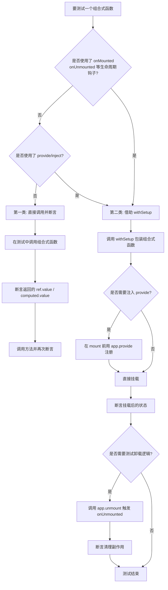

扫描[二维码](https://api2.cmdragon.cn/upload/cmder/20250304_012821924.jpg)关注或者微信搜一搜：`编程智域 前端至全栈交流与成长`

[发现1000+提升效率与开发的AI工具和实用程序](https://tools.cmdragon.cn/zh/apps?category=ai_chat)：https://tools.cmdragon.cn/


## 一、为什么要单独聊聊组合式函数的测试

想象一下你买了一台新车，整车开起来很顺畅，但如果你不知道发动机里每个零件是不是都经得起考验，心里总会发慌。组合式函数（Composable）就像Vue应用这台车里的零部件——它们封装了响应式状态、副作用、事件监听等逻辑，是整个应用运转的核心齿轮。

测试组合式函数，相当于给每个齿轮单独做一次"压力测试"，确认它在不同工况下都能稳定输出。这样做有几个实实在在的好处：第一，组合式函数往往被多个组件复用，一旦它出问题，影响面会成片扩散；第二，组件测试虽然能间接覆盖到组合式函数，但定位问题时会被组件渲染、模板逻辑干扰，排查起来像在噪音里听耳语；第三，单独测试组合式函数速度极快，因为不需要渲染DOM，几毫秒就能跑完一个用例。

Vue官方测试文档把组合式函数按"是否依赖宿主组件实例"分成了两类，这个分类很关键，因为它直接决定了你该用哪种测试姿势。下面我们就顺着这个分类，一步步把两种场景都摸透。

## 二、组合式函数测试的两种场景

在动手写测试之前，先花一分钟理清分类，能帮你少走很多弯路。Vue官方把组合式函数分成下面两类：

### 2.1 第一类：不依赖宿主组件实例

这类组合式函数只使用了响应式API，比如`ref`、`reactive`、`computed`、`watch`等。它们就像一个独立的"小电器"，只要通电（被调用）就能工作，不需要插在某个特定的插座（组件实例）上。

典型例子是一个计数器函数：

```js
// counter.js
import { ref } from 'vue'

// 导出一个组合式函数，内部只用了 ref，不依赖任何组件上下文
export function useCounter() {
  // 创建响应式状态，初始值为 0
  const count = ref(0)
  // 提供一个增加计数的方法
  const increment = () => count.value++
  // 把状态和方法返回给调用方
  return { count, increment }
}
```

### 2.2 第二类：依赖宿主组件实例

这类组合式函数用到了`onMounted`、`onUnmounted`等生命周期钩子，或者用了`provide`/`inject`做依赖注入。它们就像需要装在特定机箱里的模块，脱离了机箱就启动不了——因为这些API必须在组件`setup()`执行期间被调用，才能拿到当前组件实例的上下文。

```js
// mousePosition.js
import { ref, onMounted, onUnmounted } from 'vue'

export function useMousePosition() {
  const x = ref(0)
  const y = ref(0)
  
  // 鼠标移动事件的处理函数
  const update = (e) => {
    x.value = e.pageX
    y.value = e.pageY
  }
  
  // 依赖 onMounted：组件挂载后才会注册监听
  onMounted(() => window.addEventListener('mousemove', update))
  // 依赖 onUnmounted：组件卸载时移除监听，避免内存泄漏
  onUnmounted(() => window.removeEventListener('mousemove', update))
  
  return { x, y }
}
```

如果直接在测试文件里调用`useMousePosition()`，你会看到控制台报出一串警告，说`onMounted`只能在`setup`里调用。这就是为什么需要一种特殊的方式——`withSetup`辅助函数。

## 三、第一类：不依赖组件实例的组合式函数

先从简单的入手。第一类组合式函数测试起来非常直白，跟测试普通JS函数几乎没区别。

### 3.1 编写组合式函数

我们以一个稍微完整一点的`useCounter`为例，加上最大值限制：

```js
// src/composables/useCounter.js
import { ref, computed } from 'vue'

/**
 * 计数器组合式函数
 * @param {number} initial - 初始值
 * @param {number} max - 允许的最大值
 */
export function useCounter(initial = 0, max = Infinity) {
  // 响应式状态：当前计数
  const count = ref(initial)
  
  // 计算属性：是否已经达到上限
  const isMax = computed(() => count.value >= max)
  
  // 增加计数，但如果到顶了就不动了
  const increment = () => {
    if (count.value < max) {
      count.value++
    }
  }
  
  // 重置计数
  const reset = () => {
    count.value = initial
  }
  
  return { count, isMax, increment, reset }
}
```

### 3.2 编写测试用例

测试文件放在同名`.test.js`里，用Vitest的`test`和`expect`即可：

```js
// src/composables/useCounter.test.js
import { describe, test, expect } from 'vitest'
import { useCounter } from './useCounter.js'

describe('useCounter', () => {
  // 用例1：默认初始值应该是 0
  test('默认从 0 开始', () => {
    const { count } = useCounter()
    expect(count.value).toBe(0)
  })
  
  // 用例2：increment 应该让计数加 1
  test('increment 能正确加 1', () => {
    const { count, increment } = useCounter()
    expect(count.value).toBe(0)
    increment()
    expect(count.value).toBe(1)
    increment()
    expect(count.value).toBe(2)
  })
  
  // 用例3：达到 max 时不应该继续增加
  test('达到 max 后 increment 无效', () => {
    const { count, isMax, increment } = useCounter(0, 2)
    increment()
    expect(count.value).toBe(1)
    expect(isMax.value).toBe(false)
    increment()
    expect(count.value).toBe(2)
    expect(isMax.value).toBe(true)
    // 再调一次应该不动
    increment()
    expect(count.value).toBe(2)
  })
  
  // 用例4：reset 应该回到初始值
  test('reset 回到初始值', () => {
    const { count, increment, reset } = useCounter(5)
    increment()
    expect(count.value).toBe(6)
    reset()
    expect(count.value).toBe(5)
  })
})
```

### 3.3 运行测试与解读

确保你已经装好了Vitest。如果你用Vite脚手架，直接：

```bash
npm install -D vitest
```

然后在`package.json`里加一条脚本：

```json
{
  "scripts": {
    "test": "vitest"
  }
}
```

运行`npm test`，你会看到4个用例全部通过。这里有个小细节值得注意：因为`count`是`ref`，断言时必须用`count.value`，而不是`count`本身。这一点初学者很容易踩坑——`ref`返回的是一个对象，真正的值藏在`.value`里。

第一类组合式函数的测试就这么简单，几乎不需要任何额外工具。难点全在第二类上，我们继续往下看。

## 四、第二类：依赖生命周期或供给注入的组合式函数

### 4.1 为什么需要宿主组件

回想一下`onMounted`是怎么工作的：它内部会去读取"当前正在执行`setup`的那个组件实例"。如果你在测试文件顶层直接调用`useMousePosition()`，此时根本没有任何组件在执行`setup`，Vue找不到当前实例，就会打印警告并且钩子不会生效。

`provide`/`inject`也是一样：`inject`需要从当前组件实例向上查找供给链，脱离组件树就无从查起。

所以解决思路很明确——我们得造一个"临时组件"，让组合式函数在这个组件的`setup`里运行，从而获得完整的组件上下文。这就是`withSetup`辅助函数要干的事。

### 4.2 withSetup辅助函数的实现原理

`withSetup`的核心思路是借助`createApp`创建一个临时应用，并在它的根组件`setup`里调用我们要测试的组合式函数。来看代码：

```js
// src/test-utils/withSetup.js
import { createApp } from 'vue'

/**
 * 在一个临时组件上下文中执行组合式函数
 * @param {Function} composable - 要测试的组合式函数
 * @returns {[result, app]} - 返回组合式函数的返回值和 app 实例
 */
export function withSetup(composable) {
  let result
  // 创建一个临时应用，根组件的 setup 调用组合式函数
  const app = createApp({
    setup() {
      // 把组合式函数的返回值存到外部变量
      result = composable()
      // setup 必须返回一个渲染函数或模板，这里返回空函数即可
      return () => {}
    }
  })
  // 挂载到一个临时的 div 上，触发 onMounted 等钩子
  app.mount(document.createElement('div'))
  // 把结果和 app 都返回出去，方便后续操作（如 unmount）
  return [result, app]
}
```

这段代码做了三件事：

1. 用`createApp`造一个最小可用的Vue应用，根组件只有一个`setup`。
2. 在`setup`里调用传入的组合式函数，把它的返回值存到外部变量`result`。
3. 调用`app.mount`挂载到一个临时`div`上，这一步会触发`onMounted`钩子；最后把`result`和`app`一起返回。

返回`app`很关键，因为后续要测试`onUnmounted`时需要调用`app.unmount()`，要测试`provide`时需要调用`app.provide()`。

### 4.3 withSetup的基本使用

先用一个简单的例子感受一下：

```js
// src/composables/useDocumentTitle.test.js
import { describe, test, expect } from 'vitest'
import { ref, watch } from 'vue'
import { withSetup } from '../test-utils/withSetup.js'

// 一个依赖 watch 的组合式函数（watch 需要组件上下文来注册）
function useDocumentTitle(title) {
  const titleRef = ref(title)
  // 当 title 变化时同步到 document.title
  watch(titleRef, (newTitle) => {
    document.title = newTitle
  }, { immediate: true })
  return titleRef
}

describe('useDocumentTitle', () => {
  test('初始挂载时设置 document.title', () => {
    const [titleRef] = withSetup(() => useDocumentTitle('hello'))
    expect(document.title).toBe('hello')
    
    // 修改响应式值，watch 应该触发
    titleRef.value = 'world'
    expect(document.title).toBe('world')
  })
})
```

注意这里我们没有用到`app`，但依然把它返回出来是好习惯——后续用例可能需要。

### 4.4 测试 provide / inject

很多组合式函数会通过`inject`接收外部依赖，比如主题、用户信息等。测试时可以用`app.provide`模拟上游的供给。

```js
// src/composables/useUser.test.js
import { describe, test, expect, vi } from 'vitest'
import { inject } from 'vue'
import { withSetup } from '../test-utils/withSetup.js'

// 一个注入 user 的组合式函数
function useUser() {
  const user = inject('user')
  const isAdmin = () => user?.role === 'admin'
  return { user, isAdmin }
}

describe('useUser', () => {
  test('能正确注入上游提供的 user', () => {
    // withSetup 返回 app，可以用 app.provide 模拟供给
    const [{ user, isAdmin }, app] = withSetup(() => useUser())
    
    // 注意：withSetup 内部已经 mount 完成，provide 需要在 mount 之前调用
    // 所以这里更推荐下面的写法
  })
  
  // 推荐写法：在调用 withSetup 之前先用 app.provide
  test('正确读取 admin 角色', () => {
    // 我们改造一下调用方式：先创建 app，再 provide，再 mount
    // 这里用一个更灵活的版本
    const [result] = withSetupWithProvide(
      () => useUser(),
      { user: { name: 'cmdragon', role: 'admin' } }
    )
    expect(result.isAdmin()).toBe(true)
  })
})

// 提供一个支持预设 provide 的辅助函数
import { createApp } from 'vue'
function withSetupWithProvide(composable, provides = {}) {
  let result
  const app = createApp({
    setup() {
      result = composable()
      return () => {}
    }
  })
  // 在 mount 之前，把所有预设的 provide 注册进去
  for (const [key, value] of Object.entries(provides)) {
    app.provide(key, value)
  }
  app.mount(document.createElement('div'))
  return [result, app]
}
```

这里有个非常容易踩的坑：`app.provide`必须在`app.mount`之前调用才生效。如果你先mount再provide，组合式函数里的`inject`会拿不到值，因为供给链是在挂载时建立的。上面的`withSetupWithProvide`就是按正确顺序封装的。

### 4.5 测试 onUnmounted 等清理逻辑

组合式函数经常在`onUnmounted`里做清理工作，比如移除事件监听、清除定时器。这部分逻辑必须通过`app.unmount()`来触发。

```js
import { describe, test, expect, vi } from 'vitest'
import { ref, onUnmounted } from 'vue'
import { withSetup } from '../test-utils/withSetup.js'

// 一个会创建定时器并在卸载时清理的组合式函数
function useTimer() {
  const count = ref(0)
  const timer = setInterval(() => count.value++, 1000)
  // 卸载时清除定时器，避免内存泄漏
  onUnmounted(() => clearInterval(timer))
  return { count, timer }
}

describe('useTimer', () => {
  test('卸载后定时器应该被清除', () => {
    vi.useFakeTimers() // 使用假定时器，避免真的等 1 秒
    const clearSpy = vi.spyOn(global, 'clearInterval')
    
    const [{ count, timer }, app] = withSetup(() => useTimer())
    
    // 推进 1 秒，count 应该变成 1
    vi.advanceTimersByTime(1000)
    expect(count.value).toBe(1)
    
    // 卸载组件，触发 onUnmounted
    app.unmount()
    
    // 验证 clearInterval 被调用了
    expect(clearSpy).toHaveBeenCalledWith(timer)
    
    vi.useRealTimers()
  })
})
```

这个用例用到了Vitest的假定时器（`vi.useFakeTimers`），它能让我们"快进"时间，不用真的等一秒。卸载后断言`clearInterval`被调用，能确保你的清理逻辑确实生效。

## 五、完整实战：测试一个 useMousePosition

把前面学的串起来，做一个完整的实战。这个组合式函数依赖`onMounted`和`onUnmounted`，是典型的第二类场景。

```js
// src/composables/useMousePosition.js
import { ref, onMounted, onUnmounted } from 'vue'

/**
 * 跟踪鼠标在页面上的位置
 * @param {number} throttle - 节流间隔（毫秒），默认 0 不节流
 */
export function useMousePosition(throttle = 0) {
  const x = ref(0)
  const y = ref(0)
  let lastTime = 0
  
  const update = (e) => {
    // 简单的节流逻辑
    if (throttle > 0) {
      const now = Date.now()
      if (now - lastTime < throttle) return
      lastTime = now
    }
    x.value = e.pageX
    y.value = e.pageY
  }
  
  // 挂载时注册监听
  onMounted(() => {
    window.addEventListener('mousemove', update)
  })
  
  // 卸载时移除监听
  onUnmounted(() => {
    window.removeEventListener('mousemove', update)
  })
  
  return { x, y }
}
```

测试文件：

```js
// src/composables/useMousePosition.test.js
import { describe, test, expect, vi } from 'vitest'
import { withSetup } from '../test-utils/withSetup.js'
import { useMousePosition } from './useMousePosition.js'

describe('useMousePosition', () => {
  test('挂载后能响应鼠标移动事件', () => {
    const addSpy = vi.spyOn(window, 'addEventListener')
    const [{ x, y }] = withSetup(() => useMousePosition())
    
    // onMounted 已触发，addEventListener 应被调用
    expect(addSpy).toHaveBeenCalledWith('mousemove', expect.any(Function))
    
    // 模拟鼠标移动
    const handler = addSpy.mock.calls[0][1]
    handler({ pageX: 100, pageY: 200 })
    expect(x.value).toBe(100)
    expect(y.value).toBe(200)
    
    addSpy.mockRestore()
  })
  
  test('卸载后会移除事件监听', () => {
    const removeSpy = vi.spyOn(window, 'removeEventListener')
    const [, app] = withSetup(() => useMousePosition())
    
    app.unmount()
    
    expect(removeSpy).toHaveBeenCalledWith('mousemove', expect.any(Function))
    removeSpy.mockRestore()
  })
  
  test('节流模式下高频事件被忽略', () => {
    vi.useFakeTimers()
    const now = vi.spyOn(Date, 'now')
    // 模拟时间序列：0ms, 50ms, 150ms
    now.mockReturnValueOnce(0).mockReturnValueOnce(50).mockReturnValueOnce(150)
    
    const [{ x }] = withSetup(() => useMousePosition(100))
    const addSpy = vi.spyOn(window, 'addEventListener')
    const handler = addSpy.mock.calls[0][1]
    
    // 第一次：时间 0，应该更新
    handler({ pageX: 10 })
    expect(x.value).toBe(10)
    
    // 第二次：时间 50，距离上次 50ms < 100ms，应该被忽略
    handler({ pageX: 20 })
    expect(x.value).toBe(10) // 没变
    
    // 第三次：时间 150，距离上次 150ms >= 100ms，应该更新
    handler({ pageX: 30 })
    expect(x.value).toBe(30)
    
    vi.useRealTimers()
    addSpy.mockRestore()
  })
})
```

这个实战把生命周期钩子、事件监听、节流逻辑都覆盖到了。如果你能在自己的项目里把这种组合式函数都测到这个程度，代码的稳定性会肉眼可见地提升。

## 六、组合式函数测试决策流程图

写测试前先看一眼下面这张图，能快速帮你决定用哪种姿势。



这张图把决策流程浓缩成几个清晰的分支，建议你在写每个组合式函数测试前都对照一遍，避免选错方式白费功夫。

## 七、课后Quiz

### Quiz 1
下面这个组合式函数应该用哪种方式测试？

```js
import { ref, computed } from 'vue'
export function useFilteredTodos(todos) {
  const keyword = ref('')
  const filtered = computed(() =>
    todos.value.filter(t => t.text.includes(keyword.value))
  )
  return { keyword, filtered }
}
```

**答案解析**：应该用第一类方式——直接调用断言。这个函数只用了`ref`和`computed`，没有任何生命周期钩子或`provide`/`inject`。测试时直接`const { keyword, filtered } = useFilteredTodos(someRef)`，然后修改`keyword.value`断言`filtered.value`即可。判断的依据是"是否依赖组件上下文"，而不是函数本身的复杂度。

### Quiz 2
使用`withSetup`测试`onUnmounted`逻辑时，下面哪种写法是正确的？

A. 先`app.mount()`，再`app.unmount()`，最后断言
B. 直接调用`onUnmounted()`传入回调
C. 在`withSetup`外部用`app.unmount()`然后断言
D. 在组合式函数里手动调用清理函数

**答案解析**：选A和C（两种描述等价）。`withSetup`内部已经调用了`mount`，所以拿到`app`后直接调`app.unmount()`即可触发`onUnmounted`回调。B错误——`onUnmounted`只能在`setup`执行期间调用，不能在外部直接调。D错误——手动调用清理函数违背了"测试公开行为而非内部实现"的原则，一旦内部实现变化测试就失效。

### Quiz 3
如果你给组合式函数用了`inject('config')`，但测试时报`inject`返回`undefined`，最可能的原因是什么？

**答案解析**：最可能是`app.provide`调用顺序不对——你在`app.mount()`之后才调用`app.provide('config', ...)`。供给链是在挂载过程中建立的，mount之后再provide就来不及了。正确做法是先`createApp`，再`app.provide`，最后`app.mount`，就像本章`withSetupWithProvide`辅助函数演示的那样。另一个可能是key不匹配——`provide`和`inject`用的字符串或Symbol必须完全一致。

## 八、常见报错解决方案

### 报错1：onMounted is called when there is no active component instance

**产生原因**：你在测试文件里直接调用了第二类组合式函数，而此时没有任何组件在执行`setup`，Vue找不到当前组件实例。

**解决办法**：改用`withSetup`辅助函数把组合式函数包起来，让它在临时组件的`setup`里执行。参考本章第四节的代码。

**预防建议**：写组合式函数时在文件顶部注释里标明"依赖组件上下文"或"不依赖组件上下文"，这样写测试时一眼就知道该用哪种方式。

### 报错2：inject() can only be used inside setup() or functional components

**产生原因**：和上面的报错类似，`inject`必须在组件`setup`期间调用。直接在测试里调用包含`inject`的组合式函数会触发这个警告。

**解决办法**：用`withSetup`包装，并且如果需要预设`provide`值，用本章提供的`withSetupWithProvide`变体，在mount前调用`app.provide`。

**预防建议**：封装一个项目级的测试工具文件，把`withSetup`和`withSetupWithProvide`都放进去，团队成员直接import使用，避免每个人重复造轮子。

### 报错3：测试中 `expect(count.value).toBe(0)` 失败，但代码逻辑看起来没错

**产生原因**：很可能你在断言响应式状态前没有触发响应式更新。比如用了`watch`但没等到`flush`，或者异步更新还没完成。

**解决办法**：如果是异步逻辑（如`nextTick`），用`await`等待；如果是`watch`的副作用，可以用`vi.waitFor`或手动`await nextTick()`。对于同步的`ref`修改，断言应该立即可用。

**预防建议**：在测试中养成"修改→等待→断言"的节奏，特别是涉及`watch`、`computed`、`nextTick`的场景。

### 报错4：定时器测试卡住不动或超时

**产生原因**：组合式函数里用了真实的`setInterval`或`setTimeout`，测试会真的等待对应时间，导致用例变慢甚至超时。

**解决办法**：在用例开头调`vi.useFakeTimers()`，然后用`vi.advanceTimersByTime(ms)`推进时间。用例结束记得`vi.useRealTimers()`恢复。

**预防建议**：所有涉及时间的组合式函数测试都应该用假定时器，既快又稳定。

### 报错5：document is not defined

**产生原因**：你的测试环境是Node.js，没有DOM。但`withSetup`需要`document.createElement`来挂载组件。

**解决办法**：在Vitest配置里启用jsdom环境。在`vitest.config.js`里：

```js
import { defineConfig } from 'vitest/config'
import vue from '@vitejs/plugin-vue'

export default defineConfig({
  plugins: [vue()],
  test: {
    environment: 'jsdom', // 关键：提供 DOM 环境
  },
})
```

**预防建议**：项目初始化时就配置好测试环境，并安装`jsdom`依赖（`npm install -D jsdom`）。

## 九、参考链接

参考链接：https://vuejs.org/guide/scaling-up/testing.html#testing-composables

参考链接：https://vuejs.org/guide/reusability/composables.html

参考链接：https://vitest.dev/api/

余下文章内容请点击跳转至 个人博客页面 或者 扫描[二维码](https://api2.cmdragon.cn/upload/cmder/20250304_012821924.jpg)关注或者微信搜一搜：`编程智域 前端至全栈交流与成长`，阅读完整的文章：[Vue 3测试入门第五章：组合式函数如何测试？withSetup辅助函数来解决](https://blog.cmdragon.cn/posts/2b8d4f1a6c9e3a50/)


<details>
<summary>往期文章归档</summary>

- [Vue 3 静态与动态 Props 如何传递？TypeScript 类型约束有何必要？](https://blog.cmdragon.cn/posts/94ab48753b64780ca3ab7a7115ae8522/)
- [Vue 3中组件局部注册的优势与实现方式如何？](https://blog.cmdragon.cn/posts/dbf576e744870f6de26fd8a2e03e47da/)
- [如何在Vue3中优化生命周期钩子性能并规避常见陷阱？](https://blog.cmdragon.cn/posts/12d98b3b9ccd6c19a1b169d720ac5c80/)
- [Vue 3 Composition API生命周期钩子：如何实现从基础理解到高阶复用？](https://blog.cmdragon.cn/posts/8884e2b70287fcb263c57648eeb27419/)
- [Vue 3生命周期钩子实战指南：如何正确选择onMounted、onUpdated与onUnmounted的应用场景？](https://blog.cmdragon.cn/posts/883c6dbc50ae4183770a4462e0b8ae4d/)
- [Vue 3中生命周期钩子与响应式系统如何实现协同工作？](https://blog.cmdragon.cn/posts/70dad360ffa9dce14d0d69611b8cb019/)
- [Vue 3组件生命周期钩子的执行顺序与使用场景是什么？](https://blog.cmdragon.cn/posts/db44294a78dc9f666f67b053f6c83567/)
- [Vue组件全局注册与局部注册如何抉择？](https://blog.cmdragon.cn/posts/43ead630ea17da65d99ad2eb8188e472/)
- [Vue3组件化开发中，Props与Emits如何实现数据流转与事件协作？](https://blog.cmdragon.cn/posts/8cff7d2df113da66ea7be560c4d1d22a/)
- [Vue 3模板引用如何与其他特性协同实现复杂交互？](https://blog.cmdragon.cn/posts/331bf75d114ab09116eadfcdca602b58/)
- [Vue 3 v-for中模板引用如何实现高效管理与动态控制？](https://blog.cmdragon.cn/posts/cb380897ddc3578b180ecf8843c774c1/)
- [Vue 3的defineExpose：如何突破script setup组件默认封装，实现精准的父子通讯？](https://blog.cmdragon.cn/posts/202ae0f4acde7128e0e31baf63732fb5/)
- [Vue 3模板引用的生命周期时机如何把握？常见陷阱该如何避免？](https://blog.cmdragon.cn/posts/7d2a0f6555ecbe92afd7d2491c427463/)
- [Vue 3模板引用如何实现父组件与子组件的高效交互？](https://blog.cmdragon.cn/posts/3fb7bdd84128b7efaaa1c979e1f28dee/)
- [Vue中为何需要模板引用？又如何高效实现DOM与组件实例的直接访问？](https://blog.cmdragon.cn/posts/23f3464ba16c7054b4783cded50c04c6/)
- [Vue 3 watch与watchEffect如何区分使用？常见陷阱与性能优化技巧有哪些？](https://blog.cmdragon.cn/posts/68a26cc0023e4994a6bc54fb767365c8/)
- [Vue3侦听器实战：组件与Pinia状态监听如何高效应用？](https://blog.cmdragon.cn/posts/fd4695f668d64332dda9962c24214f32/)
- [Vue 3中何时用watch，何时用watchEffect？核心区别及性能优化策略是什么？](https://blog.cmdragon.cn/posts/cdbbb1837f8c093252e61f46dbf0a2e7/)
- [Vue 3中如何有效管理侦听器的暂停、恢复与副作用清理？](https://blog.cmdragon.cn/posts/09551ab614c463a6d6ca69818e8c2d52/)
- [Vue 3 watchEffect：如何实现响应式依赖的自动追踪与副作用管理？](https://blog.cmdragon.cn/posts/b7bca5d20f628ac09f7192ad935ef664/)
- [Vue 3 watch如何利用immediate、once、deep选项实现初始化、一次性与深度监听？](https://blog.cmdragon.cn/posts/2c6cdb100a20f10c7e7d4413617c7ea9/)
- [Vue 3中watch如何高效监听多数据源、计算结果与数组变化？](https://blog.cmdragon.cn/posts/757a1728bc1b9c0c8b317b0354d85568/)
- [Vue 3中watch监听ref和reactive的核心差异与注意事项是什么？](https://blog.cmdragon.cn/posts/8e70552f0f61e0dc8c7f567a2d272345/)
- [Vue3中Watch与watchEffect的核心差异及适用场景是什么？](https://blog.cmdragon.cn/posts/dde70ab90dc5062c435e0501f5a6e7cb/)
- [Vue 3自定义指令如何赋能表单自动聚焦与防抖输入的高效实现？](https://blog.cmdragon.cn/posts/1f5ed5047850ed52c0fd0386f76bd4ae/)
- [Vue3中如何优雅实现支持多绑定变量和修饰符的双向绑定组件？](https://blog.cmdragon.cn/posts/e3d4e128815ad731611b8ef29e37616b/)
- [Vue 3表单验证如何从基础规则到异步交互构建完整验证体系？](https://blog.cmdragon.cn/posts/7d1caedd822f70542aa0eed67e30963b/)
- [Vue3响应式系统如何支撑表单数据的集中管理、动态扩展与实时计算？](https://blog.cmdragon.cn/posts/3687a5437ab56cb082b5b813d5577a40/)
- [Vue3跨组件通信中，全局事件总线与provide/inject该如何正确选择？](https://blog.cmdragon.cn/posts/ad67c4eb6d76cf7707bdfe6a8146c34f/)
- [Vue3表单事件处理：v-model如何实现数据绑定、验证与提交？](https://blog.cmdragon.cn/posts/1c1e80d697cca0923f29ec70ebb8ccd1/)
- [Vue应用如何基于DOM事件传播机制与事件修饰符实现高效事件处理？](https://blog.cmdragon.cn/posts/b990828143d70aa87f9aa52e16692e48/)
- [Vue3中如何在调用事件处理函数时同时传递自定义参数和原生DOM事件？参数顺序有哪些注意事项？](https://blog.cmdragon.cn/posts/b44316e0866e9f2e6aef927dbcf5152b/)
- [从捕获到冒泡：Vue事件修饰符如何重塑事件执行顺序？](https://blog.cmdragon.cn/posts/021636c2a06f5e2d3d01977a12ddf559/)
- [Vue事件处理：内联还是方法事件处理器，该如何抉择？](https://blog.cmdragon.cn/posts/b3cddf7023ab537e623a61bc01dab6bb/)
- [Vue事件绑定中v-on与@语法如何取舍？参数传递与原生事件处理有哪些实战技巧？](https://blog.cmdragon.cn/posts/bd4d9607ce1bc34cc3bda0a1a46c40f6/)
- [Vue 3中列表排序时为何必须复制数组而非直接修改原始数据？](https://blog.cmdragon.cn/posts/a5f2bacb74476fd7f5e02bb3f1ba6b2b/)
- [Vue虚拟滚动如何将列表DOM数量从万级降至十位数？](https://blog.cmdragon.cn/posts/d3b06b57fb7f126787e6ed22dce1e341/)
- [Vue3中v-if与v-for直接混用为何会报错？计算属性如何解决优先级冲突？](https://blog.cmdragon.cn/posts/3100cc5a2e16f8dac36f722594e6af32/)
- [为何在Vue3递归组件中必须用v-if判断子项存在？](https://blog.cmdragon.cn/posts/455dc2d47c38d12c1cf350e490041e8b/)
- [Vue3列表渲染中，如何用数组方法与计算属性优化v-for的数据处理？](https://blog.cmdragon.cn/posts/3f842bbd7ba0f9c91151b983bf784c8b/)
- [Vue v-for的key：为什么它能解决列表渲染中的“玄学错误”？选错会有哪些后果？](https://blog.cmdragon.cn/posts/1eb3ffac668a743843b5ea1738301d40/)
- [Vue3中v-for与v-if为何不能直接共存于同一元素？](https://blog.cmdragon.cn/posts/138b13c5341f6a1fa9015400433a3611/)
- [Vue3中v-if与v-show的本质区别及动态组件状态保持的关键策略是什么？](https://blog.cmdragon.cn/posts/0242a94dc552b93a1bc335ac4fc33db5/)
 - [Vue3中v-show如何通过CSS修改display属性控制条件显示？与v-if的应用场景该如何区分？](https://blog.cmdragon.cn/posts/97c66a18ae0e9b57c6a69b8b3a41ddf6/)
- [Vue3条件渲染中v-if系列指令如何合理使用与规避错误？](https://blog.cmdragon.cn/posts/8a1ddfac64b25062ac56403e4c1201d2/)
- [Vue3动态样式控制：ref、reactive、watch与computed的应用场景与区别是什么？](https://blog.cmdragon.cn/posts/218c3a59282c3b757447ee08a01937bb/)
- [Vue3中动态样式数组的后项覆盖规则如何与计算属性结合实现复杂状态样式管理？](https://blog.cmdragon.cn/posts/1bab953e41f66ac53de099fa9fe76483/)
- [Vue浅响应式如何解决深层响应式的性能问题？适用场景有哪些？ - cmdragon's Blog](https://blog.cmdragon.cn/posts/c85e1fe16a7ae45e965b4e2df4d9d2f4/)
- [Vue 3组合式API中ref与reactive的核心响应式差异及使用最佳实践是什么？ - cmdragon's Blog](https://blog.cmdragon.cn/posts/be04b02d2723994632de0d4ca22a3391/)
- [Vue 3组合式API中ref与reactive的核心响应式差异及使用最佳实践是什么？ - cmdragon's Blog](https://blog.cmdragon.cn/posts/be04b02d2723994632de0d4ca22a3391/)
- [Vue3响应式系统中，对象新增属性、数组改索引、原始值代理的问题如何解决？ - cmdragon's Blog](https://blog.cmdragon.cn/posts/a0af08dd60a37b9a890a9957f2cbfc9f/)
- [Vue 3中watch侦听器的正确使用姿势你掌握了吗？深度监听、与watchEffect的差异及常见报错解析 - cmdragon's Blog](https://blog.cmdragon.cn/posts/bc287e1e36287afd90750fd907eca85e/)
- [Vue响应式声明的API差异、底层原理与常见陷阱你都搞懂了吗 - cmdragon's Blog](https://blog.cmdragon.cn/posts/654b9447ef1ba7ec1126a1bc26a4726d/)
- [Vue响应式声明的API差异、底层原理与常见陷阱你都搞懂了吗 - cmdragon's Blog](https://blog.cmdragon.cn/posts/654b9447ef1ba7ec1126a1bc26a4726d/)
- [为什么Vue 3需要ref函数？它的响应式原理与正确用法是什么？ - cmdragon's Blog](https://blog.cmdragon.cn/posts/c405a8d9950af5b7c63b56c348ac36b6/)
- [Vue 3中reactive函数如何通过Proxy实现响应式？使用时要避开哪些误区？ - cmdragon's Blog](https://blog.cmdragon.cn/posts/a7e9abb9691a81e4404d9facabe0f7c3/)
- [Vue3响应式系统的底层原理与实践要点你真的懂吗？ - cmdragon's Blog](https://blog.cmdragon.cn/posts/bd995ea45161727597fb85b62566c43d/)
- [Vue 3模板如何通过编译三阶段实现从声明式语法到高效渲染的跨越 - cmdragon's Blog](https://blog.cmdragon.cn/posts/53e3f270a80675df662c6857a3332c0f/)
- [快速入门Vue模板引用：从收DOM“快递”到调子组件方法，你玩明白了吗？ - cmdragon's Blog](https://blog.cmdragon.cn/posts/ddbce4f2a23aa72c96b1c0473900321e/)
- [快速入门Vue模板里的JS表达式有啥不能碰？计算属性为啥比方法更能打？ - cmdragon's Blog](https://blog.cmdragon.cn/posts/23a2d5a334e15575277814c16e45df50/)
- [快速入门Vue的v-model表单绑定：语法糖、动态值、修饰符的小技巧你都掌握了吗？ - cmdragon's Blog](https://blog.cmdragon.cn/posts/6be38de6382e31d282659b689c5b17f0/)
- [快速入门Vue3事件处理的挑战题：v-on、修饰符、自定义事件你能通关吗？ - cmdragon's Blog](https://blog.cmdragon.cn/posts/60ce517684f4a418f453d66aa805606c/)
- [快速入门Vue3的v-指令：数据和DOM的“翻译官”到底有多少本事？ - cmdragon's Blog](https://blog.cmdragon.cn/posts/e4ae7d5e4a9205bb11b2baccb230c637/)
- [快速入门Vue3，插值、动态绑定和避坑技巧你都搞懂了吗？ - cmdragon's Blog](https://blog.cmdragon.cn/posts/999ce4fb32259ff4fbf4bf7bcb851654/)
- [想让PostgreSQL快到飞起？先找健康密码还是先换引擎？ - cmdragon's Blog](https://blog.cmdragon.cn/posts/a6997d81b49cd232b87e1cf603888ad1/)
- [想让PostgreSQL查询快到飞起？分区表、物化视图、并行查询这三招灵不灵？ - cmdragon's Blog](https://blog.cmdragon.cn/posts/1fee7afbb9abd4540b8aa9c141d6845d/)
- [子查询总拖慢查询？把它变成连接就能解决？ - cmdragon's Blog](https://blog.cmdragon.cn/posts/79c590fbd87ece535b11a71c9667884f/)
- [PostgreSQL全表扫描慢到崩溃？建索引+改查询+更统计信息三招能破？ - cmdragon's Blog](https://blog.cmdragon.cn/posts/748cdac2536008199abf8a8a2cd0ec85/)
- [复杂查询总拖后腿？PostgreSQL多列索引+覆盖索引的神仙技巧你get没？ - cmdragon's Blog](https://blog.cmdragon.cn/posts/32ca943703226d317d4276a8fb53b0dd/)
- [只给表子集建索引？用函数结果建索引？PostgreSQL这俩操作凭啥能省空间又加速？ - cmdragon's Blog](https://blog.cmdragon.cn/posts/ca93f1d53aa910e7ba5ffd8df611c12b/)
- [B-tree索引像字典查词一样工作？那哪些数据库查询它能加速，哪些不能？ - cmdragon's Blog](https://blog.cmdragon.cn/posts/f507856ebfddd592448813c510a53669/)
- [想抓PostgreSQL里的慢SQL？pg_stat_statements基础黑匣子和pg_stat_monitor时间窗，谁能帮你更准揪出性能小偷？ - cmdragon's Blog](https://blog.cmdragon.cn/posts/b2213bfcb5b88a862f2138404c03d596/)
- [PostgreSQL的“时光机”MVCC和锁机制是怎么搞定高并发的？ - cmdragon's Blog](https://blog.cmdragon.cn/posts/26614eb7da6c476dde41d367ad888d2f/)
- [PostgreSQL性能暴涨的关键？内存IO并发参数居然要这么设置？ - cmdragon's Blog](https://blog.cmdragon.cn/posts/69f99bc6972a860d559c74aad7280da4/)
- [大表查询慢到翻遍整个书架？PostgreSQL分区表教你怎么“分类”才高效](https://blog.cmdragon.cn/posts/7b7053f392147a8b3b1a16bebeb08d0a/)
- [PostgreSQL 查询慢？是不是忘了优化 GROUP BY、ORDER BY 和窗口函数？ - cmdragon's Blog](https://blog.cmdragon.cn/posts/c856e3cb073822349f3bf2d29995dcfc/)
- [PostgreSQL里的子查询和CTE居然在性能上“掐架”？到底该站哪边？ - cmdragon's Blog](https://blog.cmdragon.cn/posts/c096347d18e67b7431faacd2c4757093/)
- [PostgreSQL选Join策略有啥小九九？Nested Loop/Merge/Hash谁是它的菜？ - cmdragon's Blog](https://blog.cmdragon.cn/posts/2eca89463454fd4250d7b66243b9fe5a/)
- [PostgreSQL新手SQL总翻车？这7个性能陷阱你踩过没？ - cmdragon's Blog](https://blog.cmdragon.cn/posts/068ecb772a87d7df20a8c9fb4b233f8e/)
- [PostgreSQL索引选B-Tree还是GiST？“瑞士军刀”和“多面手”的差别你居然还不知道？ - cmdragon's Blog](https://blog.cmdragon.cn/posts/d498f63cd0a2d5a77e445c688a8b88db/)
- [想知道数据库怎么给查询“算成本选路线”？EXPLAIN能帮你看明白？ - cmdragon's Blog](https://blog.cmdragon.cn/posts/9101b75bdec6faea9b35d54f14e37f36/)
- [PostgreSQL处理SQL居然像做蛋糕？解析到执行的4步里藏着多少查询优化的小心机？ - cmdragon's Blog](https://blog.cmdragon.cn/posts/d527f8ebb6e3dae2c7dfe4c8d8979444/)
- [PostgreSQL备份不是复制文件？物理vs逻辑咋选？误删还能精准恢复到1分钟前？ - cmdragon's Blog](https://blog.cmdragon.cn/posts/6bfdae84f313cf7ad0bb7045c4392347/)
- [转账不翻车、并发不干扰，PostgreSQL的ACID特性到底有啥魔法？ - cmdragon's Blog](https://blog.cmdragon.cn/posts/de3672803de34dbad244d0a8d48b0eb5/)
- [银行转账不白扣钱、电商下单不超卖，PostgreSQL事务的诀窍是啥？ - cmdragon's Blog](https://blog.cmdragon.cn/posts/e463e8a2668abdf00a228c9b79324ded/)
- [PostgreSQL里的PL/pgSQL到底是啥？能让SQL从“说目标”变“讲步骤”？ - cmdragon's Blog](https://blog.cmdragon.cn/posts/5c967e595058c4a1fc4474a68e64031d/)
- [PostgreSQL视图不存数据？那它怎么简化查询还能递归生成序列和控制权限？ - cmdragon's Blog](https://blog.cmdragon.cn/posts/325047855e3e23b5ef82f7d2db134fbd/)
- [PostgreSQL索引这么玩，才能让你的查询真的“飞”起来？ - cmdragon's Blog](https://blog.cmdragon.cn/posts/d2dba50bb6e4df7b27e735245a06a2a2/)
- [PostgreSQL的表关系和约束，咋帮你搞定用户订单不混乱、学生选课不重复？ - cmdragon's Blog](https://blog.cmdragon.cn/posts/849ae5bab0f8c66e94c2f6ad1bb798e3/)
- [PostgreSQL查询的筛子、排序、聚合、分组？你会用它们搞定数据吗？ - cmdragon's Blog](https://blog.cmdragon.cn/posts/ef4800975ffa84f1ca51976a70a1585b/)
- [PostgreSQL数据类型怎么选才高效不踩坑？ - cmdragon's Blog](https://blog.cmdragon.cn/posts/bf54711525c507c5eacfa7b0151c39d2/)
- [想解锁PostgreSQL查询从基础到进阶的核心知识点？你都get了吗？ - cmdragon's Blog](https://blog.cmdragon.cn/posts/887809b3e0375f5956873cd442f516d8/)
- [PostgreSQL DELETE居然有这些操作？返回数据、连表删你试过没？ - cmdragon's Blog](https://blog.cmdragon.cn/posts/934be1203725e8be9d6f6e9104e5abcc/)
- [PostgreSQL UPDATE语句怎么玩？从改邮箱到批量更新的避坑技巧你都会吗？ - cmdragon's Blog](https://blog.cmdragon.cn/posts/0f0622e9b7402b599e618150d0596ffe/)
- [PostgreSQL插入数据还在逐条敲？批量、冲突处理、返回自增ID的技巧你会吗？ - cmdragon's Blog](https://blog.cmdragon.cn/posts/0e3bf7efc030b024ea67ee855a00f2de/)
- [PostgreSQL的“仓库-房间-货架”游戏，你能建出电商数据库和表吗？ - cmdragon's Blog](https://blog.cmdragon.cn/posts/b6cd3c86da6aac26ed829e472d34078e/)
- [PostgreSQL 17安装总翻车？Windows/macOS/Linux避坑指南帮你搞定？ - cmdragon's Blog](https://blog.cmdragon.cn/posts/ba1f545a3410144552fbdbfcf31b5265/)
- [能当关系型数据库还能玩对象特性，能拆复杂查询还能自动管库存，PostgreSQL凭什么这么香？ - cmdragon's Blog](https://blog.cmdragon.cn/posts/b5474d1480509c5072085abc80b3dd9f/)
- [给接口加新字段又不搞崩老客户端？FastAPI的多版本API靠哪三招实现？ - cmdragon's Blog](https://blog.cmdragon.cn/posts/cc098d8836e787baa8a4d92e4d56d5c5/)
- [流量突增要搞崩FastAPI？熔断测试是怎么防系统雪崩的？ - cmdragon's Blog](https://blog.cmdragon.cn/posts/46d05151c5bd31cf37a7bcf0b8f5b0b8/)
- [FastAPI秒杀库存总变负数？Redis分布式锁能帮你守住底线吗 - cmdragon's Blog](https://blog.cmdragon.cn/posts/65ce343cc5df9faf3a8e2eeaab42ae45/)
- [FastAPI的CI流水线怎么自动测端点，还能让Allure报告美到犯规？ - cmdragon's Blog](https://blog.cmdragon.cn/posts/eed6cd8985d9be0a4b092a7da38b3e0c/)
- [如何用GitHub Actions为FastAPI项目打造自动化测试流水线？ - cmdragon's Blog](https://blog.cmdragon.cn/posts/6157d87338ce894d18c013c3c4777abb/)

</details>


<details>
<summary>免费好用的热门在线工具</summary>

- [多直播聚合器 - 应用商店 | By cmdragon](https://tools.cmdragon.cn/zh/apps/multi-live-aggregator)
- [Proto文件生成器 - 应用商店 | By cmdragon](https://tools.cmdragon.cn/zh/apps/proto-file-generator)
- [图片转粒子 - 应用商店 | By cmdragon](https://tools.cmdragon.cn/zh/apps/image-to-particles)
- [视频下载器 - 应用商店 | By cmdragon](https://tools.cmdragon.cn/zh/apps/video-downloader)
- [文件格式转换器 - 应用商店 | By cmdragon](https://tools.cmdragon.cn/zh/apps/file-converter)
- [M3U8在线播放器 - 应用商店 | By cmdragon](https://tools.cmdragon.cn/zh/apps/m3u8-player)
- [快图设计 - 应用商店 | By cmdragon](https://tools.cmdragon.cn/zh/apps/quick-image-design)
- [高级文字转图片转换器 - 应用商店 | By cmdragon](https://tools.cmdragon.cn/zh/apps/text-to-image-advanced)
- [RAID 计算器 - 应用商店 | By cmdragon](https://tools.cmdragon.cn/zh/apps/raid-calculator)
- [在线PS - 应用商店 | By cmdragon](https://tools.cmdragon.cn/zh/apps/photoshop-online)
- [Mermaid 在线编辑器 - 应用商店 | By cmdragon](https://tools.cmdragon.cn/zh/apps/mermaid-live-editor)
- [数学求解计算器 - 应用商店 | By cmdragon](https://tools.cmdragon.cn/zh/apps/math-solver-calculator)
- [智能提词器 - 应用商店 | By cmdragon](https://tools.cmdragon.cn/zh/apps/smart-teleprompter)
- [魔法简历 - 应用商店 | By cmdragon](https://tools.cmdragon.cn/zh/apps/magic-resume)
- [Image Puzzle Tool - 图片拼图工具 | By cmdragon](https://tools.cmdragon.cn/zh/apps/image-puzzle-tool)
- [字幕下载工具 - 应用商店 | By cmdragon](https://tools.cmdragon.cn/zh/apps/subtitle-downloader)
- [歌词生成工具 - 应用商店 | By cmdragon](https://tools.cmdragon.cn/zh/apps/lyrics-generator)
- [网盘资源聚合搜索 - 应用商店 | By cmdragon](https://tools.cmdragon.cn/zh/apps/cloud-drive-search)
- [ASCII字符画生成器 - 应用商店 | By cmdragon](https://tools.cmdragon.cn/zh/apps/ascii-art-generator)
- [JSON Web Tokens 工具 - 应用商店 | By cmdragon](https://tools.cmdragon.cn/zh/apps/jwt-tool)
- [Bcrypt 密码工具 - 应用商店 | By cmdragon](https://tools.cmdragon.cn/zh/apps/bcrypt-tool)
- [GIF 合成器 - 应用商店 | By cmdragon](https://tools.cmdragon.cn/zh/apps/gif-composer)
- [GIF 分解器 - 应用商店 | By cmdragon](https://tools.cmdragon.cn/zh/apps/gif-decomposer)
- [文本隐写术 - 应用商店 | By cmdragon](https://tools.cmdragon.cn/zh/apps/text-steganography)
- [CMDragon 在线工具 - 高级AI工具箱与开发者套件 | 免费好用的在线工具](https://tools.cmdragon.cn/zh)
- [应用商店 - 发现1000+提升效率与开发的AI工具和实用程序 | 免费好用的在线工具](https://tools.cmdragon.cn/zh/apps?category=trending)
- [CMDragon 更新日志 - 最新更新、功能与改进 | 免费好用的在线工具](https://tools.cmdragon.cn/zh/changelog)
- [支持我们 - 成为赞助者 | 免费好用的在线工具](https://tools.cmdragon.cn/zh/apps/sponsor)
- [AI文本生成图像 - 应用商店 | 免费好用的在线工具](https://tools.cmdragon.cn/zh/apps/text-to-image-ai)
- [临时邮箱 - 应用商店 | 免费好用的在线工具](https://tools.cmdragon.cn/zh/apps/temp-email)
- [二维码解析器 - 应用商店 | 免费好用的在线工具](https://tools.cmdragon.cn/zh/apps/qrcode-parser)
- [文本转思维导图 - 应用商店 | 免费好用的在线工具](https://tools.cmdragon.cn/zh/apps/text-to-mindmap)
- [正则表达式可视化工具 - 应用商店 | 免费好用的在线工具](https://tools.cmdragon.cn/zh/apps/regex-visualizer)
- [文件隐写工具 - 应用商店 | 免费好用的在线工具](https://tools.cmdragon.cn/zh/apps/steganography-tool)
- [IPTV 频道探索器 - 应用商店 | 免费好用的在线工具](https://tools.cmdragon.cn/zh/apps/iptv-explorer)
- [快传 - 应用商店 | 免费好用的在线工具](https://tools.cmdragon.cn/zh/apps/snapdrop)
- [随机抽奖工具 - 应用商店 | 免费好用的在线工具](https://tools.cmdragon.cn/zh/apps/lucky-draw)
- [动漫场景查找器 - 应用商店 | 免费好用的在线工具](https://tools.cmdragon.cn/zh/apps/anime-scene-finder)
- [时间工具箱 - 应用商店 | 免费好用的在线工具](https://tools.cmdragon.cn/zh/apps/time-toolkit)
- [网速测试 - 应用商店 | 免费好用的在线工具](https://tools.cmdragon.cn/zh/apps/speed-test)
- [AI 智能抠图工具 - 应用商店 | 免费好用的在线工具](https://tools.cmdragon.cn/zh/apps/background-remover)
- [背景替换工具 - 应用商店 | 免费好用的在线工具](https://tools.cmdragon.cn/zh/apps/background-replacer)
- [艺术二维码生成器 - 应用商店 | 免费好用的在线工具](https://tools.cmdragon.cn/zh/apps/artistic-qrcode)
- [Open Graph 元标签生成器 - 应用商店 | 免费好用的在线工具](https://tools.cmdragon.cn/zh/apps/open-graph-generator)
- [图像对比工具 - 应用商店 | 免费好用的在线工具](https://tools.cmdragon.cn/zh/apps/image-comparison)
- [图片压缩专业版 - 应用商店 | 免费好用的在线工具](https://tools.cmdragon.cn/zh/apps/image-compressor)
- [密码生成器 - 应用商店 | 免费好用的在线工具](https://tools.cmdragon.cn/zh/apps/password-generator)
- [SVG优化器 - 应用商店 | 免费好用的在线工具](https://tools.cmdragon.cn/zh/apps/svg-optimizer)
- [调色板生成器 - 应用商店 | 免费好用的在线工具](https://tools.cmdragon.cn/zh/apps/color-palette)
- [在线节拍器 - 应用商店 | 免费好用的在线工具](https://tools.cmdragon.cn/zh/apps/online-metronome)
- [IP归属地查询 - 应用商店 | 免费好用的在线工具](https://tools.cmdragon.cn/zh/apps/ip-geolocation)
- [CSS网格布局生成器 - 应用商店 | 免费好用的在线工具](https://tools.cmdragon.cn/zh/apps/css-grid-layout)
- [邮箱验证工具 - 应用商店 | 免费好用的在线工具](https://tools.cmdragon.cn/zh/apps/email-validator)
- [书法练习字帖 - 应用商店 | 免费好用的在线工具](https://tools.cmdragon.cn/zh/apps/calligraphy-practice)
- [金融计算器套件 - 应用商店 | 免费好用的在线工具](https://tools.cmdragon.cn/zh/apps/finance-calculator-suite)
- [中国亲戚关系计算器 - 应用商店 | 免费好用的在线工具](https://tools.cmdragon.cn/zh/apps/chinese-kinship-calculator)
- [Protocol Buffer 工具箱 - 应用商店 | 免费好用的在线工具](https://tools.cmdragon.cn/zh/apps/protobuf-toolkit)
- [IP归属地查询 - 应用商店 | 免费好用的在线工具](https://tools.cmdragon.cn/zh/apps/ip-geolocation)
- [图片无损放大 - 应用商店 | 免费好用的在线工具](https://tools.cmdragon.cn/zh/apps/image-upscaler)
- [文本比较工具 - 应用商店 | 免费好用的在线工具](https://tools.cmdragon.cn/zh/apps/text-compare)
- [IP批量查询工具 - 应用商店 | 免费好用的在线工具](https://tools.cmdragon.cn/zh/apps/ip-batch-lookup)
- [域名查询工具 - 应用商店 | 免费好用的在线工具](https://tools.cmdragon.cn/zh/apps/domain-finder)
- [DNS工具箱 - 应用商店 | 免费好用的在线工具](https://tools.cmdragon.cn/zh/apps/dns-toolkit)
- [网站图标生成器 - 应用商店 | 免费好用的在线工具](https://tools.cmdragon.cn/zh/apps/favicon-generator)
- [XML Sitemap](https://tools.cmdragon.cn/sitemap_index.xml)

</details>
