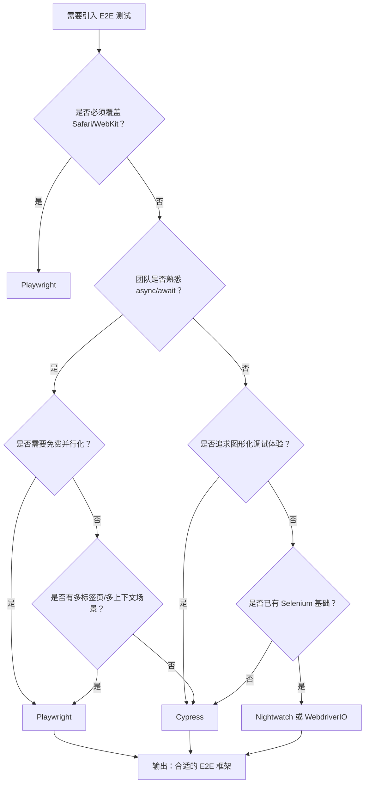

扫描[二维码](https://api2.cmdragon.cn/upload/cmder/20250304_012821924.jpg)关注或者微信搜一搜：`编程智域 前端至全栈交流与成长`

[发现1000+提升效率与开发的AI工具和实用程序](https://tools.cmdragon.cn/zh/apps?category=ai_chat)：https://tools.cmdragon.cn/


## 一、出厂前的整车路试：端到端测试是什么

想象你在造一辆汽车。每个零件（螺丝、轮胎、发动机）都单独测过合格了，这叫单元测试；把零件装成转向系统、刹车系统后再测一次，这叫组件测试。但你能直接交付吗？显然不能——还得让一辆完整的车开上测试跑道，跑一圈看它在真实路况下到底能不能转、能能刹、能能跑。

端到端测试（End-to-End Testing，简称 E2E）就是这趟"整车路试"。它针对**生产构建的应用**，在**真实浏览器**里运行，模拟用户从打开页面到完成业务的全流程操作。

Vue 官方文档对 E2E 测试的描述很直白：它重点检验**多页面应用表现**，针对生产环境进行网络请求，通常需要数据库或后端配合。

## 二、E2E 测试与单元/组件测试的边界

很多人分不清这三层测试的边界，下面这张表能帮你快速对齐：

| 维度 | 单元测试 | 组件测试 | 端到端测试 |
| --- | --- | --- | --- |
| 测试对象 | 纯函数 / 工具方法 | 单个 Vue 组件 | 整个应用 |
| 运行环境 | Node.js（jsdom） | Node.js 或浏览器 | 真实浏览器 |
| 是否导入应用代码 | 是 | 是 | 否 |
| 是否依赖后端 | 否 | 否（可模拟） | 是（真实后端或测试环境） |
| 反馈速度 | 极快（毫秒级） | 快（秒级） | 慢（分钟级） |
| 能捕捉的问题 | 逻辑错误 | 组件渲染与交互 | 路由、状态、网络、整体流程 |

最关键的一点是：**E2E 测试不导入任何 Vue 应用代码**。它完全依靠在真实浏览器中浏览整个页面来测试，就像一个真实用户那样点来点去。

Kent C. Dodds 有一句被反复引用的话：

> "你的测试越是类似于你的软件的使用方式，它们就越能值得你信赖。"

E2E 测试就是最接近用户使用方式的测试，所以它的可信度也最高。

## 三、E2E 测试能捕捉哪些问题

E2E 测试之所以值得花时间跑，是因为它能捕捉到单元测试和组件测试都漏掉的问题。Vue 官方文档明确列出了它擅长的几类：

1. **路由问题**：从首页跳到详情页，URL 参数丢了；带 hash 的路由在刷新后 404
2. **状态管理库问题**：Pinia store 在多页面间的同步出错了，登录后用户信息没存住
3. **顶级组件问题**：根组件的 `provide` 没有正确传给深层子组件
4. **公共资源问题**：图片、字体、CSS 加载失败导致页面白屏
5. **请求处理问题**：接口返回慢导致 loading 态卡住；接口字段变了导致页面崩

这些问题在单元测试里根本暴露不出来——因为你模拟掉了路由、模拟掉了 store、模拟掉了网络请求。只有把它们全部串起来跑，才会真正显现。

## 四、选择 E2E 框架的四大考量

市面上的 E2E 框架不少，Vue 官方推荐 Cypress 和 Playwright 为主。但具体怎么选？可以从四个维度衡量。

### 考量一：跨浏览器测试

理想情况下，我们希望测试在 100% 的浏览器上都跑一遍——Chrome、Firefox、Safari、Edge。但现实是**回报递减**：覆盖到前两个主流浏览器后，再增加第三个能发现的问题就很少了，而测试时间却翻倍。

所以需要权衡：你的用户画像是什么？如果用户几乎全用 Chrome，那只在 Chromium 系上跑就够了；如果企业客户必须用 Safari，那 WebKit 支持就很重要。

### 考量二：更快的反馈

E2E 测试最大的痛点就是慢。一个好框架应该在这些方面给你加速：
- **并行化**：把多个测试用例分到多台机器上同时跑
- **选择性运行**：只跑改动相关的那个测试，而不是每次全跑
- **测试热重载**：改了测试代码立即重跑，不用手动重启

### 考量三：第一优先级的调试体验

测试挂了之后，你能不能快速定位原因？这取决于框架的调试能力。理想状态是能直接用浏览器开发工具（DevTools）查看 DOM、看网络请求、打断点。

### 考量四：无头模式下的可见性

CI 环境里跑测试都是无头模式（headless），看不见浏览器界面。这时候如果测试挂了，你只能对着日志干瞪眼。好框架会提供**快照、视频录像**，让你事后能"回放"失败现场。

## 五、Cypress：最完整的 E2E 解决方案

Cypress 是 Vue 官方文档首推的 E2E 框架，它的定位是"最完整的 E2E 解决方案"。

**核心优势**：
- 图形化界面（Test Runner）：左边是测试用例树，右边是实时渲染的浏览器，所见即所得
- 调试性极强：失败时自动截图、录屏，还能看到每一步的 DOM 快照
- 内置断言：基于 Chai 和 Sinon，不用额外装断言库
- 内置 Mock：可以拦截网络请求并返回假数据
- 并行化：通过 Cypress Cloud 支持分布式执行
- 浏览器支持：Chromium 系（Chrome、Edge）和 Firefox

**安装示例**：

```bash
# 安装 Cypress（最新版 13.x）
pnpm add -D cypress@13.13.0

# 启动图形界面
npx cypress open
```

**一个简单的登录测试** `cypress/e2e/login.cy.js`：

```javascript
// describe 定义一个测试套件
describe('登录流程', () => {
  // beforeEach 在每个测试用例前都会执行一次
  beforeEach(() => {
    // 访问登录页
    cy.visit('/login')
  })

  // it 定义一个测试用例
  it('输入正确账号密码后跳转到首页', () => {
    // 找到用户名输入框并输入
    cy.get('[data-testid="username"]').type('admin')
    // 找到密码输入框并输入
    cy.get('[data-testid="password"]').type('123456')
    // 点击登录按钮
    cy.get('[data-testid="submit"]').click()
    // 断言 URL 变成了首页
    cy.url().should('include', '/home')
    // 断言页面上显示了欢迎语
    cy.contains('欢迎回来').should('be.visible')
  })

  it('密码错误时显示提示', () => {
    cy.get('[data-testid="username"]').type('admin')
    cy.get('[data-testid="password"]').type('wrong')
    cy.get('[data-testid="submit"]').click()
    // 断言错误提示出现
    cy.contains('密码不正确').should('be.visible')
    // 断言 URL 还在登录页
    cy.url().should('include', '/login')
  })
})
```

注意里面用的 `data-testid` 选择器。E2E 测试推荐用专门的测试属性来定位元素，而不是依赖 class 或文本——因为 class 会因为样式重构而变，文本会因国际化而变，只有 `data-testid` 是稳定的。

## 六、Playwright：支持更广浏览器品类

Playwright 是微软出的 E2E 框架，最大的卖点是**支持更广的浏览器品类**，尤其是 WebKit（Safari 内核）。

**核心优势**：
- 浏览器覆盖广：Chromium、Firefox、WebKit 都原生支持
- 自动等待：元素出现、可点击、网络空闲都自动等待，不用手写 `cy.wait()`
- 多上下文测试：一个测试可以同时操作多个浏览器标签页
- 录制工具：`npx playwright codegen` 可以录制你手动操作的过程生成测试代码
- 跨平台：Windows、macOS、Linux 都能跑

**安装示例**：

```bash
# 安装 Playwright
pnpm add -D @playwright/test@1.45.0

# 安装浏览器二进制
npx playwright install
```

**同样的登录测试** `tests/login.spec.js`：

```javascript
// import 测试模块
import { test, expect } from '@playwright/test'

// test.describe 定义测试套件
test.describe('登录流程', () => {
  // test.beforeEach 每个用例前执行
  test.beforeEach(async ({ page }) => {
    // page 是 Playwright 提供的浏览器页面对象
    await page.goto('/login')
  })

  test('输入正确账号密码后跳转到首页', async ({ page }) => {
    // 定位并填入用户名
    await page.locator('[data-testid="username"]').fill('admin')
    // 定位并填入密码
    await page.locator('[data-testid="password"]').fill('123456')
    // 点击登录按钮
    await page.locator('[data-testid="submit"]').click()
    // 断言 URL 包含 /home
    await expect(page).toHaveURL(/\/home/)
    // 断言页面上有"欢迎回来"
    await expect(page.locator('text=欢迎回来')).toBeVisible()
  })

  test('密码错误时显示提示', async ({ page }) => {
    await page.locator('[data-testid="username"]').fill('admin')
    await page.locator('[data-testid="password"]').fill('wrong')
    await page.locator('[data-testid="submit"]').click()
    // 断言错误提示可见
    await expect(page.locator('text=密码不正确')).toBeVisible()
    // 断言 URL 还在登录页
    await expect(page).toHaveURL(/\/login/)
  })
})
```

## 七、Cypress vs Playwright：对比一览

两者各有侧重，下面这张表帮你横向对比：

| 对比维度 | Cypress | Playwright |
| --- | --- | --- |
| 浏览器支持 | Chromium、Firefox | Chromium、Firefox、WebKit |
| 执行速度 | 中等 | 较快（并行能力强） |
| 调试体验 | 图形界面极佳 | 内置 Trace Viewer，回放能力强 |
| API 风格 | 链式调用 `cy.get().click()` | async/await 风格 |
| 多标签页支持 | 较弱 | 原生支持 |
| 并行化 | 需要 Cypress Cloud（付费） | 内置并行化（免费） |
| 录制工具 | 较弱 | codegen 强大 |
| 学习曲线 | 平缓 | 稍陡（需懂 async/await） |
| 社区生态 | 老牌，社区资料多 | 新兴但增长快 |
| 适用项目 | 中小型、以 Chromium 为主 | 大型、需要覆盖 Safari |

**一句话选择建议**：
- 团队以 Chrome 用户为主、想要最顺手的图形化调试体验 → **Cypress**
- 必须覆盖 Safari/WebKit、需要免费并行化、有多个标签页场景 → **Playwright**

## 八、其他选择：Nightwatch 与 WebdriverIO

除了 Cypress 和 Playwright，Vue 官方文档还提到了两个备选。

**Nightwatch**：基于 Selenium WebDriver 协议，浏览器支持范围最广，几乎能跑所有主流浏览器。但配置相对繁琐，速度也比 Cypress/Playwright 慢。适合历史项目已经有 Selenium 基础的团队。

**WebdriverIO**：同样基于 WebDriver 协议，但更现代化，支持移动端测试。如果你有"一套测试既测 Web 又测移动端"的需求，可以重点考虑。

新项目一般不需要优先选这两个，了解它们的存在即可。

## 九、E2E 框架选择决策流程图

面对具体项目，到底选哪个？下面这张流程图给你一个决策路径：



这张图不是死规定，但能在你纠结时给一个参考起点。很多时候，团队对某个框架的熟悉度本身就是最重要的决策因素——一个用得熟的框架，比"理论上更合适"但没人会用的框架，要靠谱得多。

## 十、课后 Quiz

### Quiz 1
**题目**：下面哪种说法最能准确描述 E2E 测试的特点？

A. E2E 测试会导入 Vue 组件代码，单独验证组件渲染  
B. E2E 测试在 Node.js 环境里用 jsdom 模拟浏览器运行  
C. E2E 测试不导入任何 Vue 应用代码，完全在真实浏览器中浏览页面来测试  
D. E2E 测试主要用于验证纯函数的逻辑正确性

**答案解析**：选 C。

E2E 测试的核心特征是"不导入应用代码，靠真实浏览器浏览页面"，这正是它和单元测试、组件测试最大的区别。A 描述的是组件测试；B 描述的是单元/组件测试在 Node.js 里的运行方式；D 描述的是单元测试。E2E 测试之所以可信度高，就是因为它最接近用户真实使用方式——用户可不会去 import 你的组件，用户只会打开浏览器点来点去。

### Quiz 2
**题目**：你的项目用户主要使用 Chrome 和 Edge，团队没人写过 E2E 测试，希望上手越简单越好。下面哪个框架最合适？

A. Playwright  
B. Cypress  
C. Nightwatch  
D. WebdriverIO

**答案解析**：选 B。

Cypress 的图形化界面（Test Runner）对新手非常友好，左边测试树右边实时浏览器，所见即所得，失败时还能自动截图录屏。它的 API 是链式调用，不需要理解 async/await，学习曲线最平缓。Playwright 虽然功能更强，但需要 async/await 基础，对新手稍陡。Nightwatch 和 WebdriverIO 都基于 WebDriver 协议，配置繁琐，更适合有 Selenium 基础的团队。题干里"用户主要用 Chrome/Edge"也排除了必须用 WebKit 的场景，所以 Cypress 是最优解。

### Quiz 3
**题目**：下面关于 E2E 测试跨浏览器覆盖的说法，哪句是正确的？

A. 必须在所有主流浏览器上都跑 100% 的测试，否则不专业  
B. 跨浏览器覆盖存在回报递减，覆盖前两个主流浏览器后再增加收益有限  
C. Cypress 原生支持 WebKit，所以跨浏览器能力比 Playwright 强  
D. Playwright 不支持 Firefox，只能跑 Chromium 系

**答案解析**：选 B。

Vue 官方文档明确指出跨浏览器测试存在"回报递减"——前两个浏览器覆盖后，再增加第三个能发现的新问题很少，而测试时间却显著增加。所以不是"必须 100% 覆盖"，而是要根据用户画像权衡。C 错在 Cypress 不原生支持 WebKit；D 错在 Playwright 同时支持 Chromium、Firefox 和 WebKit，反而是浏览器覆盖最广的。

## 十一、常见报错解决方案

### 报错一：测试超时（Timeout）

**报错信息**：`Cypress: Timed out retrying: cy.click() failed because the element is not visible` 或 `Playwright: Test timeout of 30000ms exceeded`

**产生原因**：元素还没渲染出来就去点了，或者元素被遮挡、动画没结束。也可能是接口返回太慢，页面一直卡在 loading 态。

**解决办法**：
1. Cypress 用 `cy.get('.btn').should('be.visible').click()`，让它在点击前自动等待
2. Playwright 默认就有自动等待，确保你用的是 `locator` 而不是 `querySelector`
3. 如果是接口慢，用 `cy.intercept()` 或 `page.route()` 拦截网络请求返回假数据
4. 适当调大超时时间，但别无限调大——超时往往是真有问题的信号

**预防建议**：在 CI 环境里给一个稍宽的超时（比如 60 秒），本地开发可以短一点（15 秒）。优先用"等待某个条件"而不是"等待固定时间"，避免测试又慢又脆。

### 报错二：元素找不到（Element not found）

**报错信息**：`Cypress: No element found matching selector: [data-testid="submit"]` 或 `Playwright: Error: locator.click: Timeout waiting for selector`

**产生原因**：选择器写错了，或者元素被 `v-if` 隐藏了，或者元素在 iframe 里（Cypress 默认不切进 iframe）。

**解决办法**：
1. 在浏览器 DevTools 里手动执行 `document.querySelector('[data-testid="submit"]')` 确认选择器有效
2. 检查元素是否被 `v-if` 控制——如果是，需要先触发让它显示的条件
3. 如果元素在 iframe 内，Cypress 需要 `cy.iframe()` 插件，Playwright 用 `frame_locator()`
4. 检查是否有多个同名 `data-testid`，导致选择器命中了隐藏的那个

**预防建议**：给每个可交互元素都加上 `data-testid`，命名要有语义（如 `login-submit-btn`），并在团队内约定一套命名规范，避免重复。

### 报错三：跨域问题（Cross-origin）

**报错信息**：`Cypress: Cypress detected a cross origin request was made but Cypress was not configured to handle it`

**产生原因**：测试过程中跳到了不同源的页面（比如从 `localhost:3000` 跳到 `auth.example.com`），Cypress 默认禁止跨域以防止安全问题。

**解决办法**：
1. Cypress 13+ 用 `experimentalModifyObstructiveThirdPartyCode` 或在配置里加上 `e2e.experimentalSourceRewriting: true`
2. 在 `cypress.config.js` 里配置 `e2e.specPattern` 和白名单域
3. 如果是第三方登录，考虑用 `cy.origin()` 显式声明跨域操作
4. Playwright 对跨域更宽松，通常不会遇到这个问题——如果团队经常遇到跨域测试场景，可以考虑迁移

**预防建议**：测试环境尽量把所有服务都放在同一个域下，或者用反向代理把不同后端统一到一个域名下。这样既方便测试，也更接近生产架构。

### 报错四：CI 环境下测试不稳定（Flaky tests）

**报错信息**：同一个测试本地能过，CI 上时过时不过，没有规律

**产生原因**：CI 机器性能不如本地，导致动画、网络请求、响应式更新都比本地慢；测试里隐式依赖了时间（比如 `setTimeout`）；并行测试之间有共享状态污染。

**解决办法**：
1. 用 `cy.intercept()` 或 `page.route()` 把网络请求 stub 掉，消除网络抖动
2. 关闭动画（给 Vue 应用加 `:css="false"` 或在测试环境注入全局样式禁用 transition）
3. 在 `beforeEach` 里彻底重置状态，避免用例间互相污染
4. 用 Cypress 的 `testIsolation: true` 或 Playwright 的隔离上下文，确保每个用例都是干净环境

**预防建议**：把 flaky 测试当成"测试代码的 bug"认真对待，而不是"运气不好"。每次遇到都查根因，否则 flaky 测试会逐渐侵蚀团队对测试套件的信任。

参考链接：https://vuejs.org/guide/scaling-up/testing.html

余下文章内容请点击跳转至 个人博客页面 或者 扫描[二维码](https://api2.cmdragon.cn/upload/cmder/20250304_012821924.jpg)关注或者微信搜一搜：`编程智域 前端至全栈交流与成长`，阅读完整的文章：[Vue 3测试入门第八章：端到端测试是什么？Cypress与Playwright如何选择](https://blog.cmdragon.cn/posts/8a5e3b7c1d9f2e40/)


<details>
<summary>往期文章归档</summary>

- [Vue 3 静态与动态 Props 如何传递？TypeScript 类型约束有何必要？](https://blog.cmdragon.cn/posts/94ab48753b64780ca3ab7a7115ae8522/)
- [Vue 3中组件局部注册的优势与实现方式如何？](https://blog.cmdragon.cn/posts/dbf576e744870f6de26fd8a2e03e47da/)
- [如何在Vue3中优化生命周期钩子性能并规避常见陷阱？](https://blog.cmdragon.cn/posts/12d98b3b9ccd6c19a1b169d720ac5c80/)
- [Vue 3 Composition API生命周期钩子：如何实现从基础理解到高阶复用？](https://blog.cmdragon.cn/posts/8884e2b70287fcb263c57648eeb27419/)
- [Vue 3生命周期钩子实战指南：如何正确选择onMounted、onUpdated与onUnmounted的应用场景？](https://blog.cmdragon.cn/posts/883c6dbc50ae4183770a4462e0b8ae4d/)
- [Vue 3中生命周期钩子与响应式系统如何实现协同工作？](https://blog.cmdragon.cn/posts/70dad360ffa9dce14d0d69611b8cb019/)
- [Vue 3组件生命周期钩子的执行顺序与使用场景是什么？](https://blog.cmdragon.cn/posts/db44294a78dc9f666f67b053f6c83567/)
- [Vue组件全局注册与局部注册如何抉择？](https://blog.cmdragon.cn/posts/43ead630ea17da65d99ad2eb8188e472/)
- [Vue3组件化开发中，Props与Emits如何实现数据流转与事件协作？](https://blog.cmdragon.cn/posts/8cff7d2df113da66ea7be560c4d1d22a/)
- [Vue 3模板引用如何与其他特性协同实现复杂交互？](https://blog.cmdragon.cn/posts/331bf75d114ab09116eadfcdca602b58/)
- [Vue 3 v-for中模板引用如何实现高效管理与动态控制？](https://blog.cmdragon.cn/posts/cb380897ddc3578b180ecf8843c774c1/)
- [Vue 3的defineExpose：如何突破script setup组件默认封装，实现精准的父子通讯？](https://blog.cmdragon.cn/posts/202ae0f4acde7128e0e31baf63732fb5/)
- [Vue 3模板引用的生命周期时机如何把握？常见陷阱该如何避免？](https://blog.cmdragon.cn/posts/7d2a0f6555ecbe92afd7d2491c427463/)
- [Vue 3模板引用如何实现父组件与子组件的高效交互？](https://blog.cmdragon.cn/posts/3fb7bdd84128b7efaaa1c979e1f28dee/)
- [Vue中为何需要模板引用？又如何高效实现DOM与组件实例的直接访问？](https://blog.cmdragon.cn/posts/23f3464ba16c7054b4783cded50c04c6/)
- [Vue 3 watch与watchEffect如何区分使用？常见陷阱与性能优化技巧有哪些？](https://blog.cmdragon.cn/posts/68a26cc0023e4994a6bc54fb767365c8/)
- [Vue3侦听器实战：组件与Pinia状态监听如何高效应用？](https://blog.cmdragon.cn/posts/fd4695f668d64332dda9962c24214f32/)
- [Vue 3中何时用watch，何时用watchEffect？核心区别及性能优化策略是什么？](https://blog.cmdragon.cn/posts/cdbbb1837f8c093252e61f46dbf0a2e7/)
- [Vue 3中如何有效管理侦听器的暂停、恢复与副作用清理？](https://blog.cmdragon.cn/posts/09551ab614c463a6d6ca69818e8c2d52/)
- [Vue 3 watchEffect：如何实现响应式依赖的自动追踪与副作用管理？](https://blog.cmdragon.cn/posts/b7bca5d20f628ac09f7192ad935ef664/)
- [Vue 3 watch如何利用immediate、once、deep选项实现初始化、一次性与深度监听？](https://blog.cmdragon.cn/posts/2c6cdb100a20f10c7e7d4413617c7ea9/)
- [Vue 3中watch如何高效监听多数据源、计算结果与数组变化？](https://blog.cmdragon.cn/posts/757a1728bc1b9c0c8b317b0354d85568/)
- [Vue 3中watch监听ref和reactive的核心差异与注意事项是什么？](https://blog.cmdragon.cn/posts/8e70552f0f61e0dc8c7f567a2d272345/)
- [Vue3中Watch与watchEffect的核心差异及适用场景是什么？](https://blog.cmdragon.cn/posts/dde70ab90dc5062c435e0501f5a6e7cb/)
- [Vue 3自定义指令如何赋能表单自动聚焦与防抖输入的高效实现？](https://blog.cmdragon.cn/posts/1f5ed5047850ed52c0fd0386f76bd4ae/)
- [Vue3中如何优雅实现支持多绑定变量和修饰符的双向绑定组件？](https://blog.cmdragon.cn/posts/e3d4e128815ad731611b8ef29e37616b/)
- [Vue 3表单验证如何从基础规则到异步交互构建完整验证体系？](https://blog.cmdragon.cn/posts/7d1caedd822f70542aa0eed67e30963b/)
- [Vue3响应式系统如何支撑表单数据的集中管理、动态扩展与实时计算？](https://blog.cmdragon.cn/posts/3687a5437ab56cb082b5b813d5577a40/)
- [Vue3跨组件通信中，全局事件总线与provide/inject该如何正确选择？](https://blog.cmdragon.cn/posts/ad67c4eb6d76cf7707bdfe6a8146c34f/)
- [Vue3表单事件处理：v-model如何实现数据绑定、验证与提交？](https://blog.cmdragon.cn/posts/1c1e80d697cca0923f29ec70ebb8ccd1/)
- [Vue应用如何基于DOM事件传播机制与事件修饰符实现高效事件处理？](https://blog.cmdragon.cn/posts/b990828143d70aa87f9aa52e16692e48/)
- [Vue3中如何在调用事件处理函数时同时传递自定义参数和原生DOM事件？参数顺序有哪些注意事项？](https://blog.cmdragon.cn/posts/b44316e0866e9f2e6aef927dbcf5152b/)
- [从捕获到冒泡：Vue事件修饰符如何重塑事件执行顺序？](https://blog.cmdragon.cn/posts/021636c2a06f5e2d3d01977a12ddf559/)
- [Vue事件处理：内联还是方法事件处理器，该如何抉择？](https://blog.cmdragon.cn/posts/b3cddf7023ab537e623a61bc01dab6bb/)
- [Vue事件绑定中v-on与@语法如何取舍？参数传递与原生事件处理有哪些实战技巧？](https://blog.cmdragon.cn/posts/bd4d9607ce1bc34cc3bda0a1a46c40f6/)
- [Vue 3中列表排序时为何必须复制数组而非直接修改原始数据？](https://blog.cmdragon.cn/posts/a5f2bacb74476fd7f5e02bb3f1ba6b2b/)
- [Vue虚拟滚动如何将列表DOM数量从万级降至十位数？](https://blog.cmdragon.cn/posts/d3b06b57fb7f126787e6ed22dce1e341/)
- [Vue3中v-if与v-for直接混用为何会报错？计算属性如何解决优先级冲突？](https://blog.cmdragon.cn/posts/3100cc5a2e16f8dac36f722594e6af32/)
- [为何在Vue3递归组件中必须用v-if判断子项存在？](https://blog.cmdragon.cn/posts/455dc2d47c38d12c1cf350e490041e8b/)
- [Vue3列表渲染中，如何用数组方法与计算属性优化v-for的数据处理？](https://blog.cmdragon.cn/posts/3f842bbd7ba0f9c91151b983bf784c8b/)
- [Vue v-for的key：为什么它能解决列表渲染中的“玄学错误”？选错会有哪些后果？](https://blog.cmdragon.cn/posts/1eb3ffac668a743843b5ea1738301d40/)
- [Vue3中v-for与v-if为何不能直接共存于同一元素？](https://blog.cmdragon.cn/posts/138b13c5341f6a1fa9015400433a3611/)
- [Vue3中v-if与v-show的本质区别及动态组件状态保持的关键策略是什么？](https://blog.cmdragon.cn/posts/0242a94dc552b93a1bc335ac4fc33db5/)
 - [Vue3中v-show如何通过CSS修改display属性控制条件显示？与v-if的应用场景该如何区分？](https://blog.cmdragon.cn/posts/97c66a18ae0e9b57c6a69b8b3a41ddf6/)
- [Vue3条件渲染中v-if系列指令如何合理使用与规避错误？](https://blog.cmdragon.cn/posts/8a1ddfac64b25062ac56403e4c1201d2/)
- [Vue3动态样式控制：ref、reactive、watch与computed的应用场景与区别是什么？](https://blog.cmdragon.cn/posts/218c3a59282c3b757447ee08a01937bb/)
- [Vue3中动态样式数组的后项覆盖规则如何与计算属性结合实现复杂状态样式管理？](https://blog.cmdragon.cn/posts/1bab953e41f66ac53de099fa9fe76483/)
- [Vue浅响应式如何解决深层响应式的性能问题？适用场景有哪些？ - cmdragon's Blog](https://blog.cmdragon.cn/posts/c85e1fe16a7ae45e965b4e2df4d9d2f4/)
- [Vue 3组合式API中ref与reactive的核心响应式差异及使用最佳实践是什么？ - cmdragon's Blog](https://blog.cmdragon.cn/posts/be04b02d2723994632de0d4ca22a3391/)
- [Vue 3组合式API中ref与reactive的核心响应式差异及使用最佳实践是什么？ - cmdragon's Blog](https://blog.cmdragon.cn/posts/be04b02d2723994632de0d4ca22a3391/)
- [Vue3响应式系统中，对象新增属性、数组改索引、原始值代理的问题如何解决？ - cmdragon's Blog](https://blog.cmdragon.cn/posts/a0af08dd60a37b9a890a9957f2cbfc9f/)
- [Vue 3中watch侦听器的正确使用姿势你掌握了吗？深度监听、与watchEffect的差异及常见报错解析 - cmdragon's Blog](https://blog.cmdragon.cn/posts/bc287e1e36287afd90750fd907eca85e/)
- [Vue响应式声明的API差异、底层原理与常见陷阱你都搞懂了吗 - cmdragon's Blog](https://blog.cmdragon.cn/posts/654b9447ef1ba7ec1126a1bc26a4726d/)
- [Vue响应式声明的API差异、底层原理与常见陷阱你都搞懂了吗 - cmdragon's Blog](https://blog.cmdragon.cn/posts/654b9447ef1ba7ec1126a1bc26a4726d/)
- [为什么Vue 3需要ref函数？它的响应式原理与正确用法是什么？ - cmdragon's Blog](https://blog.cmdragon.cn/posts/c405a8d9950af5b7c63b56c348ac36b6/)
- [Vue 3中reactive函数如何通过Proxy实现响应式？使用时要避开哪些误区？ - cmdragon's Blog](https://blog.cmdragon.cn/posts/a7e9abb9691a81e4404d9facabe0f7c3/)
- [Vue3响应式系统的底层原理与实践要点你真的懂吗？ - cmdragon's Blog](https://blog.cmdragon.cn/posts/bd995ea45161727597fb85b62566c43d/)
- [Vue 3模板如何通过编译三阶段实现从声明式语法到高效渲染的跨越 - cmdragon's Blog](https://blog.cmdragon.cn/posts/53e3f270a80675df662c6857a3332c0f/)
- [快速入门Vue模板引用：从收DOM“快递”到调子组件方法，你玩明白了吗？ - cmdragon's Blog](https://blog.cmdragon.cn/posts/ddbce4f2a23aa72c96b1c0473900321e/)
- [快速入门Vue模板里的JS表达式有啥不能碰？计算属性为啥比方法更能打？ - cmdragon's Blog](https://blog.cmdragon.cn/posts/23a2d5a334e15575277814c16e45df50/)
- [快速入门Vue的v-model表单绑定：语法糖、动态值、修饰符的小技巧你都掌握了吗？ - cmdragon's Blog](https://blog.cmdragon.cn/posts/6be38de6382e31d282659b689c5b17f0/)
- [快速入门Vue3事件处理的挑战题：v-on、修饰符、自定义事件你能通关吗？ - cmdragon's Blog](https://blog.cmdragon.cn/posts/60ce517684f4a418f453d66aa805606c/)
- [快速入门Vue3的v-指令：数据和DOM的“翻译官”到底有多少本事？ - cmdragon's Blog](https://blog.cmdragon.cn/posts/e4ae7d5e4a9205bb11b2baccb230c637/)
- [快速入门Vue3，插值、动态绑定和避坑技巧你都搞懂了吗？ - cmdragon's Blog](https://blog.cmdragon.cn/posts/999ce4fb32259ff4fbf4bf7bcb851654/)
- [想让PostgreSQL快到飞起？先找健康密码还是先换引擎？ - cmdragon's Blog](https://blog.cmdragon.cn/posts/a6997d81b49cd232b87e1cf603888ad1/)
- [想让PostgreSQL查询快到飞起？分区表、物化视图、并行查询这三招灵不灵？ - cmdragon's Blog](https://blog.cmdragon.cn/posts/1fee7afbb9abd4540b8aa9c141d6845d/)
- [子查询总拖慢查询？把它变成连接就能解决？ - cmdragon's Blog](https://blog.cmdragon.cn/posts/79c590fbd87ece535b11a71c9667884f/)
- [PostgreSQL全表扫描慢到崩溃？建索引+改查询+更统计信息三招能破？ - cmdragon's Blog](https://blog.cmdragon.cn/posts/748cdac2536008199abf8a8a2cd0ec85/)
- [复杂查询总拖后腿？PostgreSQL多列索引+覆盖索引的神仙技巧你get没？ - cmdragon's Blog](https://blog.cmdragon.cn/posts/32ca943703226d317d4276a8fb53b0dd/)
- [只给表子集建索引？用函数结果建索引？PostgreSQL这俩操作凭啥能省空间又加速？ - cmdragon's Blog](https://blog.cmdragon.cn/posts/ca93f1d53aa910e7ba5ffd8df611c12b/)
- [B-tree索引像字典查词一样工作？那哪些数据库查询它能加速，哪些不能？ - cmdragon's Blog](https://blog.cmdragon.cn/posts/f507856ebfddd592448813c510a53669/)
- [想抓PostgreSQL里的慢SQL？pg_stat_statements基础黑匣子和pg_stat_monitor时间窗，谁能帮你更准揪出性能小偷？ - cmdragon's Blog](https://blog.cmdragon.cn/posts/b2213bfcb5b88a862f2138404c03d596/)
- [PostgreSQL的“时光机”MVCC和锁机制是怎么搞定高并发的？ - cmdragon's Blog](https://blog.cmdragon.cn/posts/26614eb7da6c476dde41d367ad888d2f/)
- [PostgreSQL性能暴涨的关键？内存IO并发参数居然要这么设置？ - cmdragon's Blog](https://blog.cmdragon.cn/posts/69f99bc6972a860d559c74aad7280da4/)
- [大表查询慢到翻遍整个书架？PostgreSQL分区表教你怎么“分类”才高效](https://blog.cmdragon.cn/posts/7b7053f392147a8b3b1a16bebeb08d0a/)
- [PostgreSQL 查询慢？是不是忘了优化 GROUP BY、ORDER BY 和窗口函数？ - cmdragon's Blog](https://blog.cmdragon.cn/posts/c856e3cb073822349f3bf2d29995dcfc/)
- [PostgreSQL里的子查询和CTE居然在性能上“掐架”？到底该站哪边？ - cmdragon's Blog](https://blog.cmdragon.cn/posts/c096347d18e67b7431faacd2c4757093/)
- [PostgreSQL选Join策略有啥小九九？Nested Loop/Merge/Hash谁是它的菜？ - cmdragon's Blog](https://blog.cmdragon.cn/posts/2eca89463454fd4250d7b66243b9fe5a/)
- [PostgreSQL新手SQL总翻车？这7个性能陷阱你踩过没？ - cmdragon's Blog](https://blog.cmdragon.cn/posts/068ecb772a87d7df20a8c9fb4b233f8e/)
- [PostgreSQL索引选B-Tree还是GiST？“瑞士军刀”和“多面手”的差别你居然还不知道？ - cmdragon's Blog](https://blog.cmdragon.cn/posts/d498f63cd0a2d5a77e445c688a8b88db/)
- [想知道数据库怎么给查询“算成本选路线”？EXPLAIN能帮你看明白？ - cmdragon's Blog](https://blog.cmdragon.cn/posts/9101b75bdec6faea9b35d54f14e37f36/)
- [PostgreSQL处理SQL居然像做蛋糕？解析到执行的4步里藏着多少查询优化的小心机？ - cmdragon's Blog](https://blog.cmdragon.cn/posts/d527f8ebb6e3dae2c7dfe4c8d8979444/)
- [PostgreSQL备份不是复制文件？物理vs逻辑咋选？误删还能精准恢复到1分钟前？ - cmdragon's Blog](https://blog.cmdragon.cn/posts/6bfdae84f313cf7ad0bb7045c4392347/)
- [转账不翻车、并发不干扰，PostgreSQL的ACID特性到底有啥魔法？ - cmdragon's Blog](https://blog.cmdragon.cn/posts/de3672803de34dbad244d0a8d48b0eb5/)
- [银行转账不白扣钱、电商下单不超卖，PostgreSQL事务的诀窍是啥？ - cmdragon's Blog](https://blog.cmdragon.cn/posts/e463e8a2668abdf00a228c9b79324ded/)
- [PostgreSQL里的PL/pgSQL到底是啥？能让SQL从“说目标”变“讲步骤”？ - cmdragon's Blog](https://blog.cmdragon.cn/posts/5c967e595058c4a1fc4474a68e64031d/)
- [PostgreSQL视图不存数据？那它怎么简化查询还能递归生成序列和控制权限？ - cmdragon's Blog](https://blog.cmdragon.cn/posts/325047855e3e23b5ef82f7d2db134fbd/)
- [PostgreSQL索引这么玩，才能让你的查询真的“飞”起来？ - cmdragon's Blog](https://blog.cmdragon.cn/posts/d2dba50bb6e4df7b27e735245a06a2a2/)
- [PostgreSQL的表关系和约束，咋帮你搞定用户订单不混乱、学生选课不重复？ - cmdragon's Blog](https://blog.cmdragon.cn/posts/849ae5bab0f8c66e94c2f6ad1bb798e3/)
- [PostgreSQL查询的筛子、排序、聚合、分组？你会用它们搞定数据吗？ - cmdragon's Blog](https://blog.cmdragon.cn/posts/ef4800975ffa84f1ca51976a70a1585b/)
- [PostgreSQL数据类型怎么选才高效不踩坑？ - cmdragon's Blog](https://blog.cmdragon.cn/posts/bf54711525c507c5eacfa7b0151c39d2/)
- [想解锁PostgreSQL查询从基础到进阶的核心知识点？你都get了吗？ - cmdragon's Blog](https://blog.cmdragon.cn/posts/887809b3e0375f5956873cd442f516d8/)
- [PostgreSQL DELETE居然有这些操作？返回数据、连表删你试过没？ - cmdragon's Blog](https://blog.cmdragon.cn/posts/934be1203725e8be9d6f6e9104e5abcc/)
- [PostgreSQL UPDATE语句怎么玩？从改邮箱到批量更新的避坑技巧你都会吗？ - cmdragon's Blog](https://blog.cmdragon.cn/posts/0f0622e9b7402b599e618150d0596ffe/)
- [PostgreSQL插入数据还在逐条敲？批量、冲突处理、返回自增ID的技巧你会吗？ - cmdragon's Blog](https://blog.cmdragon.cn/posts/0e3bf7efc030b024ea67ee855a00f2de/)
- [PostgreSQL的“仓库-房间-货架”游戏，你能建出电商数据库和表吗？ - cmdragon's Blog](https://blog.cmdragon.cn/posts/b6cd3c86da6aac26ed829e472d34078e/)
- [PostgreSQL 17安装总翻车？Windows/macOS/Linux避坑指南帮你搞定？ - cmdragon's Blog](https://blog.cmdragon.cn/posts/ba1f545a3410144552fbdbfcf31b5265/)
- [能当关系型数据库还能玩对象特性，能拆复杂查询还能自动管库存，PostgreSQL凭什么这么香？ - cmdragon's Blog](https://blog.cmdragon.cn/posts/b5474d1480509c5072085abc80b3dd9f/)
- [给接口加新字段又不搞崩老客户端？FastAPI的多版本API靠哪三招实现？ - cmdragon's Blog](https://blog.cmdragon.cn/posts/cc098d8836e787baa8a4d92e4d56d5c5/)
- [流量突增要搞崩FastAPI？熔断测试是怎么防系统雪崩的？ - cmdragon's Blog](https://blog.cmdragon.cn/posts/46d05151c5bd31cf37a7bcf0b8f5b0b8/)
- [FastAPI秒杀库存总变负数？Redis分布式锁能帮你守住底线吗 - cmdragon's Blog](https://blog.cmdragon.cn/posts/65ce343cc5df9faf3a8e2eeaab42ae45/)
- [FastAPI的CI流水线怎么自动测端点，还能让Allure报告美到犯规？ - cmdragon's Blog](https://blog.cmdragon.cn/posts/eed6cd8985d9be0a4b092a7da38b3e0c/)
- [如何用GitHub Actions为FastAPI项目打造自动化测试流水线？ - cmdragon's Blog](https://blog.cmdragon.cn/posts/6157d87338ce894d18c013c3c4777abb/)

</details>


<details>
<summary>免费好用的热门在线工具</summary>

- [多直播聚合器 - 应用商店 | By cmdragon](https://tools.cmdragon.cn/zh/apps/multi-live-aggregator)
- [Proto文件生成器 - 应用商店 | By cmdragon](https://tools.cmdragon.cn/zh/apps/proto-file-generator)
- [图片转粒子 - 应用商店 | By cmdragon](https://tools.cmdragon.cn/zh/apps/image-to-particles)
- [视频下载器 - 应用商店 | By cmdragon](https://tools.cmdragon.cn/zh/apps/video-downloader)
- [文件格式转换器 - 应用商店 | By cmdragon](https://tools.cmdragon.cn/zh/apps/file-converter)
- [M3U8在线播放器 - 应用商店 | By cmdragon](https://tools.cmdragon.cn/zh/apps/m3u8-player)
- [快图设计 - 应用商店 | By cmdragon](https://tools.cmdragon.cn/zh/apps/quick-image-design)
- [高级文字转图片转换器 - 应用商店 | By cmdragon](https://tools.cmdragon.cn/zh/apps/text-to-image-advanced)
- [RAID 计算器 - 应用商店 | By cmdragon](https://tools.cmdragon.cn/zh/apps/raid-calculator)
- [在线PS - 应用商店 | By cmdragon](https://tools.cmdragon.cn/zh/apps/photoshop-online)
- [Mermaid 在线编辑器 - 应用商店 | By cmdragon](https://tools.cmdragon.cn/zh/apps/mermaid-live-editor)
- [数学求解计算器 - 应用商店 | By cmdragon](https://tools.cmdragon.cn/zh/apps/math-solver-calculator)
- [智能提词器 - 应用商店 | By cmdragon](https://tools.cmdragon.cn/zh/apps/smart-teleprompter)
- [魔法简历 - 应用商店 | By cmdragon](https://tools.cmdragon.cn/zh/apps/magic-resume)
- [Image Puzzle Tool - 图片拼图工具 | By cmdragon](https://tools.cmdragon.cn/zh/apps/image-puzzle-tool)
- [字幕下载工具 - 应用商店 | By cmdragon](https://tools.cmdragon.cn/zh/apps/subtitle-downloader)
- [歌词生成工具 - 应用商店 | By cmdragon](https://tools.cmdragon.cn/zh/apps/lyrics-generator)
- [网盘资源聚合搜索 - 应用商店 | By cmdragon](https://tools.cmdragon.cn/zh/apps/cloud-drive-search)
- [ASCII字符画生成器 - 应用商店 | By cmdragon](https://tools.cmdragon.cn/zh/apps/ascii-art-generator)
- [JSON Web Tokens 工具 - 应用商店 | By cmdragon](https://tools.cmdragon.cn/zh/apps/jwt-tool)
- [Bcrypt 密码工具 - 应用商店 | By cmdragon](https://tools.cmdragon.cn/zh/apps/bcrypt-tool)
- [GIF 合成器 - 应用商店 | By cmdragon](https://tools.cmdragon.cn/zh/apps/gif-composer)
- [GIF 分解器 - 应用商店 | By cmdragon](https://tools.cmdragon.cn/zh/apps/gif-decomposer)
- [文本隐写术 - 应用商店 | By cmdragon](https://tools.cmdragon.cn/zh/apps/text-steganography)
- [CMDragon 在线工具 - 高级AI工具箱与开发者套件 | 免费好用的在线工具](https://tools.cmdragon.cn/zh)
- [应用商店 - 发现1000+提升效率与开发的AI工具和实用程序 | 免费好用的在线工具](https://tools.cmdragon.cn/zh/apps?category=trending)
- [CMDragon 更新日志 - 最新更新、功能与改进 | 免费好用的在线工具](https://tools.cmdragon.cn/zh/changelog)
- [支持我们 - 成为赞助者 | 免费好用的在线工具](https://tools.cmdragon.cn/zh/sponsor)
- [AI文本生成图像 - 应用商店 | 免费好用的在线工具](https://tools.cmdragon.cn/zh/apps/text-to-image-ai)
- [临时邮箱 - 应用商店 | 免费好用的在线工具](https://tools.cmdragon.cn/zh/apps/temp-email)
- [二维码解析器 - 应用商店 | 免费好用的在线工具](https://tools.cmdragon.cn/zh/apps/qrcode-parser)
- [文本转思维导图 - 应用商店 | 免费好用的在线工具](https://tools.cmdragon.cn/zh/apps/text-to-mindmap)
- [正则表达式可视化工具 - 应用商店 | 免费好用的在线工具](https://tools.cmdragon.cn/zh/apps/regex-visualizer)
- [文件隐写工具 - 应用商店 | 免费好用的在线工具](https://tools.cmdragon.cn/zh/apps/steganography-tool)
- [IPTV 频道探索器 - 应用商店 | 免费好用的在线工具](https://tools.cmdragon.cn/zh/apps/iptv-explorer)
- [快传 - 应用商店 | 免费好用的在线工具](https://tools.cmdragon.cn/zh/apps/snapdrop)
- [随机抽奖工具 - 应用商店 | 免费好用的在线工具](https://tools.cmdragon.cn/zh/apps/lucky-draw)
- [动漫场景查找器 - 应用商店 | 免费好用的在线工具](https://tools.cmdragon.cn/zh/apps/anime-scene-finder)
- [时间工具箱 - 应用商店 | 免费好用的在线工具](https://tools.cmdragon.cn/zh/apps/time-toolkit)
- [网速测试 - 应用商店 | 免费好用的在线工具](https://tools.cmdragon.cn/zh/apps/speed-test)
- [AI 智能抠图工具 - 应用商店 | 免费好用的在线工具](https://tools.cmdragon.cn/zh/apps/background-remover)
- [背景替换工具 - 应用商店 | 免费好用的在线工具](https://tools.cmdragon.cn/zh/apps/background-replacer)
- [艺术二维码生成器 - 应用商店 | 免费好用的在线工具](https://tools.cmdragon.cn/zh/apps/artistic-qrcode)
- [Open Graph 元标签生成器 - 应用商店 | 免费好用的在线工具](https://tools.cmdragon.cn/zh/apps/open-graph-generator)
- [图像对比工具 - 应用商店 | 免费好用的在线工具](https://tools.cmdragon.cn/zh/apps/image-comparison)
- [图片压缩专业版 - 应用商店 | 免费好用的在线工具](https://tools.cmdragon.cn/zh/apps/image-compressor)
- [密码生成器 - 应用商店 | 免费好用的在线工具](https://tools.cmdragon.cn/zh/apps/password-generator)
- [SVG优化器 - 应用商店 | 免费好用的在线工具](https://tools.cmdragon.cn/zh/apps/svg-optimizer)
- [调色板生成器 - 应用商店 | 免费好用的在线工具](https://tools.cmdragon.cn/zh/apps/color-palette)
- [在线节拍器 - 应用商店 | 免费好用的在线工具](https://tools.cmdragon.cn/zh/apps/online-metronome)
- [IP归属地查询 - 应用商店 | 免费好用的在线工具](https://tools.cmdragon.cn/zh/apps/ip-geolocation)
- [CSS网格布局生成器 - 应用商店 | 免费好用的在线工具](https://tools.cmdragon.cn/zh/apps/css-grid-layout)
- [邮箱验证工具 - 应用商店 | 免费好用的在线工具](https://tools.cmdragon.cn/zh/apps/email-validator)
- [书法练习字帖 - 应用商店 | 免费好用的在线工具](https://tools.cmdragon.cn/zh/apps/calligraphy-practice)
- [金融计算器套件 - 应用商店 | 免费好用的在线工具](https://tools.cmdragon.cn/zh/apps/finance-calculator-suite)
- [中国亲戚关系计算器 - 应用商店 | 免费好用的在线工具](https://tools.cmdragon.cn/zh/apps/chinese-kinship-calculator)
- [Protocol Buffer 工具箱 - 应用商店 | 免费好用的在线工具](https://tools.cmdragon.cn/zh/apps/protobuf-toolkit)
- [IP归属地查询 - 应用商店 | 免费好用的在线工具](https://tools.cmdragon.cn/zh/apps/ip-geolocation)
- [图片无损放大 - 应用商店 | 免费好用的在线工具](https://tools.cmdragon.cn/zh/apps/image-upscaler)
- [文本比较工具 - 应用商店 | 免费好用的在线工具](https://tools.cmdragon.cn/zh/apps/text-compare)
- [IP批量查询工具 - 应用商店 | 免费好用的在线工具](https://tools.cmdragon.cn/zh/apps/ip-batch-lookup)
- [域名查询工具 - 应用商店 | 免费好用的在线工具](https://tools.cmdragon.cn/zh/apps/domain-finder)
- [DNS工具箱 - 应用商店 | 免费好用的在线工具](https://tools.cmdragon.cn/zh/apps/dns-toolkit)
- [网站图标生成器 - 应用商店 | 免费好用的在线工具](https://tools.cmdragon.cn/zh/apps/favicon-generator)
- [XML Sitemap](https://tools.cmdragon.cn/sitemap_index.xml)

</details>
