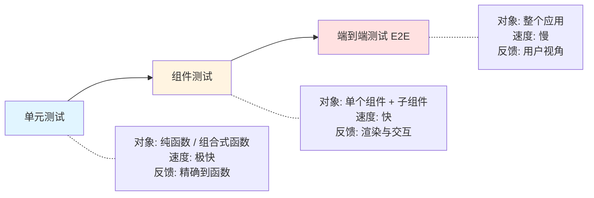
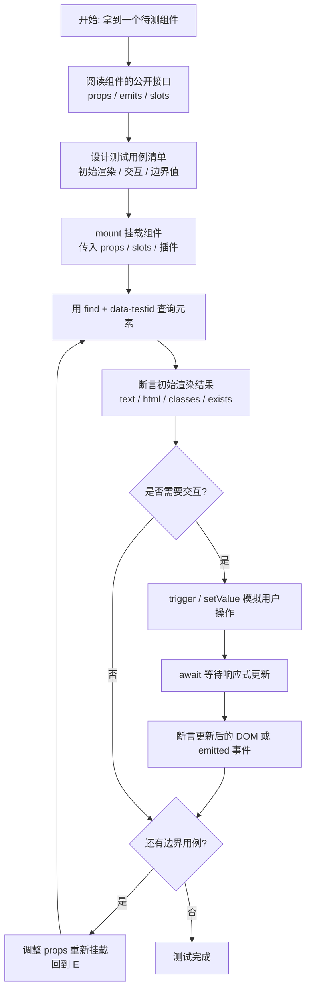

扫描[二维码](https://api2.cmdragon.cn/upload/cmder/20250304_012821924.jpg)关注或者微信搜一搜：`编程智域 前端至全栈交流与成长`

[发现1000+提升效率与开发的AI工具和实用程序](https://tools.cmdragon.cn/zh/apps?category=ai_chat)：https://tools.cmdragon.cn/


## 一、组件测试到底在测什么

买车之前你一定会去4S店试驾——坐进车里点火、踩油门、打方向盘、按喇叭，确认这台车开起来顺手、各项功能正常。组件测试就是Vue组件的"试驾"：把组件挂载起来，给它喂各种props和插槽，模拟用户的点击和输入，然后看看渲染出来的DOM和触发的事件是否符合预期。

跟单元测试相比，组件测试的粒度更大——它不关心某个函数内部怎么实现，而是关心"这个组件作为一个整体，对外表现如何"。Vue官方文档把它定位成介于单元测试和端到端测试（E2E）之间的一种测试，可以理解为一种轻量级的集成测试。它不需要启动整个应用，但会真实渲染组件树，所以能捕捉到单元测试容易遗漏的整合性问题，比如props传递、事件触发、插槽渲染等。

组件测试应该捕捉的内容包括：prop的变化是否影响渲染、事件是否正确触发并携带正确的载荷、插槽是否被正确填充、样式和class是否按预期切换、生命周期钩子是否按序执行。而它不应该做的事，是模拟子组件——官方明确建议"不要桩化子组件"，而是像真实用户一样通过互动来测试整个组件树。

## 二、组件测试的粒度与定位

在动手之前，先理清组件测试在整个测试体系中的位置，能帮你避免"测得太碎"或"测得太粗"两个极端。



从图里能看到，组件测试处在一个"承上启下"的位置：它比单元测试覆盖面更广（多个组件协作），但又比E2E轻量得多（不启动浏览器、不连后端）。一个经验法则：每个Vue组件都应该有自己的组件测试文件，文件名跟组件同名加`.spec`或`.test`后缀，比如`Stepper.vue`对应`Stepper.spec.js`。

## 三、@vue/test-utils 与 @testing-library/vue 的取舍

Vue生态里有两套主流的组件测试工具，选哪个经常让新手犯难。我们先把它们的差异摆出来。

### 3.1 @vue/test-utils

这是Vue官方维护的底层组件测试库，特点是API贴近Vue内部机制，能直接访问组件实例、props、emitted事件。

```js
import { mount } from '@vue/test-utils'
import Stepper from './Stepper.vue'

const wrapper = mount(Stepper, {
  props: { max: 1 }
})
// 直接读 props
wrapper.vm.count      // 访问组件实例的响应式状态
wrapper.props('max')  // 读传入的 prop
```

它的优势在于：官方出品、文档齐全、API稳定、对Vue特性（如`provide`/`inject`、`v-model`、自定义指令）支持完善。劣势是 temptation 太大——很容易写出"测内部实现"的脆弱测试。

### 3.2 @testing-library/vue

这套库基于`@vue/test-utils`构建，但哲学完全不同：它强调"以用户视角查询DOM"，鼓励你通过角色（role）、文本、标签来查找元素，而不是通过CSS选择器或组件实例。

```js
import { render } from '@testing-library/vue'
import Stepper from './Stepper.vue'

const { getByRole, getByText } = render(Stepper, {
  props: { max: 1 }
})
// 通过 ARIA 角色查询，更贴近无障碍标准
getByRole('button', { name: /increment/i })
```

它的好处是测试更"以人为本"——只要组件的无障碍属性不变，内部怎么重构测试都不坏。但学习曲线略陡，对初学者不太友好。

### 3.3 怎么选

Vue官方在测试文档里推荐：在应用中使用`@vue/test-utils`测试组件。所以本章后续都围绕它展开。如果你之后做组件库或者对无障碍有强需求，可以再考虑`@testing-library/vue`。两者并不冲突，甚至可以并存。

| 对比维度 | @vue/test-utils | @testing-library/vue |
|---------|----------------|---------------------|
| 出品方 | Vue官方 | 社区（基于test-utils） |
| 查询方式 | CSS选择器、组件实例 | ARIA角色、文本、标签 |
| 学习曲线 | 平缓 | 略陡 |
| 适合场景 | 应用内部组件测试 | 组件库、无障碍优先 |

## 四、mount 与 shallowMount 的区别

`@vue/test-utils`提供两个挂载函数：`mount`和`shallowMount`。理解它们的差异能避免测试又慢又脆。

### 4.1 mount：完整渲染

`mount`会真实渲染组件及其所有子组件，相当于把整棵子树都跑起来。优点是行为最接近真实运行环境，能发现子组件集成问题；缺点是子组件多时测试会变慢，且子组件的props/数据变化可能影响当前组件测试结果。

```js
import { mount } from '@vue/test-utils'
import Parent from './Parent.vue'

// Parent 内部的 Child 也会被真实渲染
const wrapper = mount(Parent)
```

### 4.2 shallowMount：浅渲染

`shallowMount`只渲染当前组件，把所有子组件替换成桩（stub）——一个空壳子组件，只保留标签和props，不执行其内部逻辑。优点是快、隔离性强；缺点是测不到子组件的真实交互。

```js
import { shallowMount } from '@vue/test-utils'
import Parent from './Parent.vue'

// Child 被替换成 <child-stub>，不执行 Child 的 setup
const wrapper = shallowMount(Parent)
```

### 4.3 选择策略

官方建议是优先用`mount`，让测试更贴近真实使用。只在以下情况考虑`shallowMount`：

- 子组件依赖外部资源（如网络请求、WebSocket）难以在测试中提供
- 子组件渲染成本极高，拖慢整个测试套件
- 你只想测试当前组件的模板结构，不想被子组件行为干扰

一个折中方案是：用`mount`但配合`global.stubs`只桩化特定的"重型"子组件，而不是全部浅渲染。

## 五、查询DOM的方法

挂载之后下一步就是查询渲染出来的DOM，断言里面的内容。`@vue/test-utils`的`wrapper`对象提供了一系列查询方法。

### 5.1 基础查询：find 与 findAll

```js
// 通过 CSS 选择器查单个元素，返回 DOMWrapper
const valueEl = wrapper.find('[data-testid=stepper-value]')
// 查多个元素，返回数组
const buttons = wrapper.findAll('button')
// 通过组件名查子组件
const child = wrapper.findComponent(ChildComponent)
```

### 5.2 读取内容：text()、html()、attributes()

```js
// 获取元素的文本内容
valueEl.text()                    // '0'
// 获取元素的 HTML（包含标签）
valueEl.html()                    // '<span data-testid="stepper-value">0</span>'
// 获取元素的属性
button.attributes('disabled')     // undefined 或 ''
// 检查是否包含某个 class
button.classes('is-active')       // true / false
// 检查元素是否存在
wrapper.find('.not-exist').exists()  // false
```

### 5.3 查询策略：优先 data-testid

查询元素有三种常见策略，按优先级排：

1. **data-testid**：最稳定，跟UI解耦，重构样式不会破坏测试。
2. **ARIA角色/文本**：贴近用户视角，适合按钮、链接等可交互元素。
3. **CSS class / 标签**：脆弱，改样式就坏，尽量少用。

```js
// 推荐
wrapper.find('[data-testid=stepper-value]')
// 可接受
wrapper.findByRole('button', { name: 'increment' })
// 不推荐
wrapper.find('.stepper-value-span')
```

## 六、交互测试：trigger 与 setValue

光查不算测试，还得能"动"。`@vue/test-utils`提供了`trigger`和`setValue`来模拟用户操作。

### 6.1 trigger：触发DOM事件

```js
const button = wrapper.find('button')
// 触发点击
await button.trigger('click')
// 触发带参事件
await button.trigger('keydown', { key: 'Enter' })
// 触发自定义事件
await input.trigger('custom-event', { detail: 123 })
```

注意：`trigger`返回的是Promise，必须`await`，否则Vue还没来得及更新DOM，断言就会失败。这是新手最常踩的坑之一。

### 6.2 setValue：设置表单值

```js
const input = wrapper.find('input')
await input.setValue('hello')
// 等价于
// input.element.value = 'hello'
// await input.trigger('input')
```

`setValue`是`@vue/test-utils`提供的语法糖，对`input`、`select`、`textarea`都适用，比手动设置`element.value`再触发`input`更简洁。

### 6.3 断言事件触发

如果组件通过`emit`向外抛事件，可以用`emitted`查询：

```js
await button.trigger('click')
// 检查是否触发了 change 事件
expect(wrapper.emitted('change')).toBeTruthy()
// 检查触发次数
expect(wrapper.emitted('change')).toHaveLength(1)
// 检查事件载荷
expect(wrapper.emitted('change')[0]).toEqual([1])
```

## 七、Stepper组件完整实战

把前面的知识点串起来，做一个完整的实战——Vue官方测试文档里也用到了这个例子，我们把它做完整。

### 7.1 编写Stepper组件

需求：一个步进器，显示当前计数，有"增加"按钮，可通过`max` prop限制最大值，达到上限时按钮禁用，每次变化通过`change`事件通知父组件。

```vue
<!-- src/components/Stepper.vue -->
<script setup>
import { ref, computed } from 'vue'

// 通过 props 接收最大值，默认不限制
const props = defineProps({
  max: {
    type: Number,
    default: Infinity
  }
})

// 向外抛 change 事件
const emit = defineEmits(['change'])

// 响应式状态：当前计数
const count = ref(0)

// 计算属性：是否达到上限
const isMax = computed(() => count.value >= props.max)

// 增加计数，并触发 change 事件
const increment = () => {
  if (isMax.value) return
  count.value++
  emit('change', count.value)
}
</script>

<template>
  <div class="stepper">
    <!-- 用 data-testid 标记，方便测试查询 -->
    <span data-testid="stepper-value">{{ count }}</span>
    <button
      data-testid="increment"
      :disabled="isMax"
      @click="increment"
    >
      increment
    </button>
  </div>
</template>

<style scoped>
.stepper {
  display: inline-flex;
  align-items: center;
  gap: 8px;
}
button:disabled {
  opacity: 0.5;
  cursor: not-allowed;
}
</style>
```

### 7.2 编写组件测试

按"挂载→断言初始值→交互→断言更新值"的节奏写：

```js
// src/components/Stepper.spec.js
import { describe, test, expect } from 'vitest'
import { mount } from '@vue/test-utils'
import Stepper from './Stepper.vue'

// 把选择器提取为常量，方便复用，改 UI 时只改一处
const valueSelector = '[data-testid=stepper-value]'
const buttonSelector = '[data-testid=increment]'

describe('Stepper', () => {
  // 用例1：默认初始值是 0
  test('初始渲染时显示 0', () => {
    const wrapper = mount(Stepper)
    expect(wrapper.find(valueSelector).text()).toContain('0')
  })
  
  // 用例2：点击 increment 后值加 1
  test('点击按钮后计数加 1', async () => {
    const wrapper = mount(Stepper)
    
    // 初始值
    expect(wrapper.find(valueSelector).text()).toContain('0')
    
    // 触发点击（必须 await）
    await wrapper.find(buttonSelector).trigger('click')
    
    // 断言更新后的值
    expect(wrapper.find(valueSelector).text()).toContain('1')
  })
  
  // 用例3：达到 max 后按钮禁用，计数不再增加
  test('达到 max 时按钮禁用且计数不变', async () => {
    const wrapper = mount(Stepper, {
      props: { max: 1 }
    })
    
    // 第一次点击：0 → 1，应该成功
    await wrapper.find(buttonSelector).trigger('click')
    expect(wrapper.find(valueSelector).text()).toContain('1')
    
    // 此时按钮应该 disabled
    const button = wrapper.find(buttonSelector)
    expect(button.attributes('disabled')).toBeDefined()
    
    // 第二次点击：因为 disabled，点击应无效
    await button.trigger('click')
    expect(wrapper.find(valueSelector).text()).toContain('1')
  })
  
  // 用例4：每次计数变化应触发 change 事件并携带新值
  test('计数变化时触发 change 事件', async () => {
    const wrapper = mount(Stepper)
    
    await wrapper.find(buttonSelector).trigger('click')
    await wrapper.find(buttonSelector).trigger('click')
    
    // change 应该被触发 2 次
    expect(wrapper.emitted('change')).toHaveLength(2)
    // 第一次载荷是 1，第二次是 2
    expect(wrapper.emitted('change')[0]).toEqual([1])
    expect(wrapper.emitted('change')[1]).toEqual([2])
  })
  
  // 用例5：到达 max 时再点击也不触发 change
  test('max 限制下不触发多余的 change', async () => {
    const wrapper = mount(Stepper, { props: { max: 1 } })
    
    await wrapper.find(buttonSelector).trigger('click') // 0→1
    await wrapper.find(buttonSelector).trigger('click') // disabled，无效
    
    expect(wrapper.emitted('change')).toHaveLength(1)
  })
})
```

### 7.3 运行环境与依赖

确保项目里装好这些依赖（截至2026年的最新主版本）：

```bash
npm install -D vitest @vue/test-utils jsdom @vitejs/plugin-vue
```

`vitest.config.js`配置：

```js
import { defineConfig } from 'vitest/config'
import vue from '@vitejs/plugin-vue'

export default defineConfig({
  plugins: [vue()],
  test: {
    environment: 'jsdom',
    globals: true, // 让 test、expect 全局可用，不用每个文件都 import
  },
})
```

跑测试：

```bash
npx vitest run src/components/Stepper.spec.js
```

如果5个用例全绿，说明你已经掌握了组件测试的基本套路。

## 八、data-testid 的作用与最佳实践

前面多次出现的`data-testid`是组件测试里一个非常关键的小约定，值得单独聊聊。

### 8.1 它解决什么问题

测试查询元素时，最怕两件事：一是查询方式太脆弱（比如用class，改个样式测试就崩）；二是查询方式太隐晦（比如用某个深层结构选择器，没人看得懂这测的是啥）。`data-testid`通过给元素打一个"测试专用身份证号"解决了这两个问题：

- 它跟UI解耦——改样式、改结构、改文案都不影响，只要这个测试ID还在就行。
- 它语义清晰——`data-testid="stepper-value"`一看就知道是步进器的值显示位。

### 8.2 命名规范

- 用小写加连字符：`stepper-value`、`submit-button`，不要驼峰。
- 描述"是什么"而不是"长什么样"：`user-avatar`好过`round-image`。
- 包含组件上下文：`todo-item-checkbox`比孤零零的`checkbox`更易定位。

### 8.3 生产环境是否保留

`data-testid`属性在生产环境会保留在HTML里，但不会影响功能、不会影响SEO、不会影响样式，体积也很小。如果你介意，可以用Babel或Vite插件在构建时移除，但对绝大多数项目来说没必要。

## 九、组件测试流程图

把整个组件测试的流程画出来，帮你形成肌肉记忆。



这张图里有两个关键节点值得反复强调：一是`await`，二是`data-testid`。前者保证你断言时DOM已经更新，后者保证你的查询稳定可靠。

## 十、课后Quiz

### Quiz 1
下面哪种情况应该优先使用`shallowMount`而不是`mount`？

A. 测试一个简单的展示型组件，没有子组件
B. 测试一个容器组件，其子组件依赖WebSocket且难以mock
C. 想确认父组件正确地把props传给了子组件
D. 想验证整条组件链的事件传递

**答案解析**：选B。`shallowMount`的核心价值是隔离，当子组件依赖难以提供的外部资源时，桩化它能让你专注测当前组件。A错误——没有子组件时两种方式效果一样，但`mount`更接近真实。C和D都要求真实渲染子组件，必须用`mount`，否则桩化后子组件根本不会真正执行，props传递和事件链都验证不了。记住：能用`mount`就别用`shallowMount`，桩化是最后的手段。

### Quiz 2
运行下面这段测试，结果断言失败提示"未找到 change 事件"。最可能的原因是什么？

```js
test('点击触发 change', () => {
  const wrapper = mount(Stepper)
  wrapper.find('[data-testid=increment]').trigger('click')
  expect(wrapper.emitted('change')).toHaveLength(1)
})
```

**答案解析**：缺少`await`。`trigger`返回的是Promise，Vue需要时间来响应式更新和触发事件回调。没有`await`的话，断言在事件还没真正触发时就执行了，自然找不到。正确写法是把测试函数改成`async`并`await wrapper.find(...).trigger('click')`。这是组件测试最经典的坑——任何涉及交互的用例，触发事件后都必须`await`。

### Quiz 3
下面哪种查询方式在重构后最不容易让测试失败？

A. `wrapper.find('.btn-primary')`
B. `wrapper.find('button:nth-child(2)')`
C. `wrapper.find('[data-testid=submit-btn]')`
D. `wrapper.find('div > span.value')`

**答案解析**：选C。`data-testid`是专门为测试设计的稳定标识，跟UI样式、DOM结构完全解耦。A的class会随样式重构变化；B的结构选择器会因调整DOM层级而失效；D同理。只有C只要不删掉这个测试ID就稳如老狗。这也是为什么官方和社区都推荐优先用`data-testid`查询——它让测试专注于"组件该做什么"而不是"组件长什么样"。

## 十一、常见报错解决方案

### 报错1：[Vue warn]: Failed to resolve component: xxx

**产生原因**：被测组件用到了某个全局注册的组件或自定义指令，但在测试环境里没有提供，Vue找不到就报警告，渲染结果可能少一块。

**解决办法**：在`mount`时通过`global`选项注入缺失的组件或指令。

```js
import MyButton from './MyButton.vue'

const wrapper = mount(Stepper, {
  global: {
    components: { MyButton },
    directives: { focus: { /* ... */ } }
  }
})
```

**预防建议**：把全局依赖收敛到一个插件里，测试时直接`global.plugins: [myPlugin]`一次性注入，避免每个测试文件都重复声明。

### 报错2：Cannot find element with selector: xxx

**产生原因**：`wrapper.find`的选择器没匹配到任何元素，可能是组件没渲染出来，或者选择器写错了。

**解决办法**：先用`wrapper.html()`打印整个渲染结果，肉眼确认元素是否存在、属性名是否拼写正确。常见错误是把`data-testid`写成`data-test-id`或`data-test`。

**预防建议**：把常用选择器提取为模块顶部的常量（就像Stepper示例里那样），统一管理，改UI时一处修改处处生效。还可以封装一个`getByTestId(wrapper, id)`辅助函数，集中处理找不到元素时的友好报错。

### 报错3：trigger 后断言失败，DOM还是旧值

**产生原因**：忘了`await`。`trigger`触发的更新是异步的，Vue会在下一个微任务里flush，没等到flush就断言自然读到旧值。

**解决办法**：把测试函数改成`async`，并在`trigger`前加`await`。

```js
test('...', async () => {
  await wrapper.find('button').trigger('click')
  expect(...).toBe(...)
})
```

**预防建议**：在ESLint里加规则禁止未await的Promise，或者在团队规范里写死"任何`trigger`/`setValue`后必须`await`"。

### 报错4：document is not defined 或 window is not defined

**产生原因**：Vitest默认运行在Node环境，没有DOM。组件挂载需要`document`，于是报错。

**解决办法**：在`vitest.config.js`里设置`environment: 'jsdom'`，并安装`jsdom`。

```js
// vitest.config.js
export default defineConfig({
  test: {
    environment: 'jsdom'
  }
})
```

**预防建议**：项目初始化时就配好测试环境，把`jsdom`加入`devDependencies`，避免每个新成员都踩这个坑。

### 报错5：测试通过但 console 里一堆 Vue 警告

**产生原因**：组件里用到了某些API（如`provide`/`inject`、`useRoute`），测试时没提供对应的上下文，Vue虽然没崩但打了警告。这些警告不影响用例通过，但会污染日志、可能掩盖真实问题。

**解决办法**：根据警告内容补充对应的全局配置。比如用了`vue-router`就挂上`router`，用了Pinia就装上`createTestingPinia`。

```js
import { createMemoryHistory, createRouter } from 'vue-router'

const router = createRouter({
  history: createMemoryHistory(),
  routes: [{ path: '/', component: { template: '<div/>' } }]
})

const wrapper = mount(MyComponent, {
  global: {
    plugins: [router]
  }
})
```

**预防建议**：在测试配置里把`console.warn`的Vue警告转成失败（用`vi.spyOn`），强迫大家把警告当回事，能避免很多潜在bug。

## 十二、参考链接

参考链接：https://vuejs.org/guide/scaling-up/testing.html#component-testing

参考链接：https://test-utils.vuejs.org/

参考链接：https://vitest.dev/guide/

参考链接：https://vuejs.org/guide/scaling-up/testing.html

余下文章内容请点击跳转至 个人博客页面 或者 扫描[二维码](https://api2.cmdragon.cn/upload/cmder/20250304_012821924.jpg)关注或者微信搜一搜：`编程智域 前端至全栈交流与成长`，阅读完整的文章：[Vue 3测试入门第六章：组件测试入门：@vue/test-utils挂载、查询与交互](https://blog.cmdragon.cn/posts/4e7a2c9f1b5d3e60/)


<details>
<summary>往期文章归档</summary>

- [Vue 3 静态与动态 Props 如何传递？TypeScript 类型约束有何必要？](https://blog.cmdragon.cn/posts/94ab48753b64780ca3ab7a7115ae8522/)
- [Vue 3中组件局部注册的优势与实现方式如何？](https://blog.cmdragon.cn/posts/dbf576e744870f6de26fd8a2e03e47da/)
- [如何在Vue3中优化生命周期钩子性能并规避常见陷阱？](https://blog.cmdragon.cn/posts/12d98b3b9ccd6c19a1b169d720ac5c80/)
- [Vue 3 Composition API生命周期钩子：如何实现从基础理解到高阶复用？](https://blog.cmdragon.cn/posts/8884e2b70287fcb263c57648eeb27419/)
- [Vue 3生命周期钩子实战指南：如何正确选择onMounted、onUpdated与onUnmounted的应用场景？](https://blog.cmdragon.cn/posts/883c6dbc50ae4183770a4462e0b8ae4d/)
- [Vue 3中生命周期钩子与响应式系统如何实现协同工作？](https://blog.cmdragon.cn/posts/70dad360ffa9dce14d0d69611b8cb019/)
- [Vue 3组件生命周期钩子的执行顺序与使用场景是什么？](https://blog.cmdragon.cn/posts/db44294a78dc9f666f67b053f6c83567/)
- [Vue组件全局注册与局部注册如何抉择？](https://blog.cmdragon.cn/posts/43ead630ea17da65d99ad2eb8188e472/)
- [Vue3组件化开发中，Props与Emits如何实现数据流转与事件协作？](https://blog.cmdragon.cn/posts/8cff7d2df113da66ea7be560c4d1d22a/)
- [Vue 3模板引用如何与其他特性协同实现复杂交互？](https://blog.cmdragon.cn/posts/331bf75d114ab09116eadfcdca602b58/)
- [Vue 3 v-for中模板引用如何实现高效管理与动态控制？](https://blog.cmdragon.cn/posts/cb380897ddc3578b180ecf8843c774c1/)
- [Vue 3的defineExpose：如何突破script setup组件默认封装，实现精准的父子通讯？](https://blog.cmdragon.cn/posts/202ae0f4acde7128e0e31baf63732fb5/)
- [Vue 3模板引用的生命周期时机如何把握？常见陷阱该如何避免？](https://blog.cmdragon.cn/posts/7d2a0f6555ecbe92afd7d2491c427463/)
- [Vue 3模板引用如何实现父组件与子组件的高效交互？](https://blog.cmdragon.cn/posts/3fb7bdd84128b7efaaa1c979e1f28dee/)
- [Vue中为何需要模板引用？又如何高效实现DOM与组件实例的直接访问？](https://blog.cmdragon.cn/posts/23f3464ba16c7054b4783cded50c04c6/)
- [Vue 3 watch与watchEffect如何区分使用？常见陷阱与性能优化技巧有哪些？](https://blog.cmdragon.cn/posts/68a26cc0023e4994a6bc54fb767365c8/)
- [Vue3侦听器实战：组件与Pinia状态监听如何高效应用？](https://blog.cmdragon.cn/posts/fd4695f668d64332dda9962c24214f32/)
- [Vue 3中何时用watch，何时用watchEffect？核心区别及性能优化策略是什么？](https://blog.cmdragon.cn/posts/cdbbb1837f8c093252e61f46dbf0a2e7/)
- [Vue 3中如何有效管理侦听器的暂停、恢复与副作用清理？](https://blog.cmdragon.cn/posts/09551ab614c463a6d6ca69818e8c2d52/)
- [Vue 3 watchEffect：如何实现响应式依赖的自动追踪与副作用管理？](https://blog.cmdragon.cn/posts/b7bca5d20f628ac09f7192ad935ef664/)
- [Vue 3 watch如何利用immediate、once、deep选项实现初始化、一次性与深度监听？](https://blog.cmdragon.cn/posts/2c6cdb100a20f10c7e7d4413617c7ea9/)
- [Vue 3中watch如何高效监听多数据源、计算结果与数组变化？](https://blog.cmdragon.cn/posts/757a1728bc1b9c0c8b317b0354d85568/)
- [Vue 3中watch监听ref和reactive的核心差异与注意事项是什么？](https://blog.cmdragon.cn/posts/8e70552f0f61e0dc8c7f567a2d272345/)
- [Vue3中Watch与watchEffect的核心差异及适用场景是什么？](https://blog.cmdragon.cn/posts/dde70ab90dc5062c435e0501f5a6e7cb/)
- [Vue 3自定义指令如何赋能表单自动聚焦与防抖输入的高效实现？](https://blog.cmdragon.cn/posts/1f5ed5047850ed52c0fd0386f76bd4ae/)
- [Vue3中如何优雅实现支持多绑定变量和修饰符的双向绑定组件？](https://blog.cmdragon.cn/posts/e3d4e128815ad731611b8ef29e37616b/)
- [Vue 3表单验证如何从基础规则到异步交互构建完整验证体系？](https://blog.cmdragon.cn/posts/7d1caedd822f70542aa0eed67e30963b/)
- [Vue3响应式系统如何支撑表单数据的集中管理、动态扩展与实时计算？](https://blog.cmdragon.cn/posts/3687a5437ab56cb082b5b813d5577a40/)
- [Vue3跨组件通信中，全局事件总线与provide/inject该如何正确选择？](https://blog.cmdragon.cn/posts/ad67c4eb6d76cf7707bdfe6a8146c34f/)
- [Vue3表单事件处理：v-model如何实现数据绑定、验证与提交？](https://blog.cmdragon.cn/posts/1c1e80d697cca0923f29ec70ebb8ccd1/)
- [Vue应用如何基于DOM事件传播机制与事件修饰符实现高效事件处理？](https://blog.cmdragon.cn/posts/b990828143d70aa87f9aa52e16692e48/)
- [Vue3中如何在调用事件处理函数时同时传递自定义参数和原生DOM事件？参数顺序有哪些注意事项？](https://blog.cmdragon.cn/posts/b44316e0866e9f2e6aef927dbcf5152b/)
- [从捕获到冒泡：Vue事件修饰符如何重塑事件执行顺序？](https://blog.cmdragon.cn/posts/021636c2a06f5e2d3d01977a12ddf559/)
- [Vue事件处理：内联还是方法事件处理器，该如何抉择？](https://blog.cmdragon.cn/posts/b3cddf7023ab537e623a61bc01dab6bb/)
- [Vue事件绑定中v-on与@语法如何取舍？参数传递与原生事件处理有哪些实战技巧？](https://blog.cmdragon.cn/posts/bd4d9607ce1bc34cc3bda0a1a46c40f6/)
- [Vue 3中列表排序时为何必须复制数组而非直接修改原始数据？](https://blog.cmdragon.cn/posts/a5f2bacb74476fd7f5e02bb3f1ba6b2b/)
- [Vue虚拟滚动如何将列表DOM数量从万级降至十位数？](https://blog.cmdragon.cn/posts/d3b06b57fb7f126787e6ed22dce1e341/)
- [Vue3中v-if与v-for直接混用为何会报错？计算属性如何解决优先级冲突？](https://blog.cmdragon.cn/posts/3100cc5a2e16f8dac36f722594e6af32/)
- [为何在Vue3递归组件中必须用v-if判断子项存在？](https://blog.cmdragon.cn/posts/455dc2d47c38d12c1cf350e490041e8b/)
- [Vue3列表渲染中，如何用数组方法与计算属性优化v-for的数据处理？](https://blog.cmdragon.cn/posts/3f842bbd7ba0f9c91151b983bf784c8b/)
- [Vue v-for的key：为什么它能解决列表渲染中的“玄学错误”？选错会有哪些后果？](https://blog.cmdragon.cn/posts/1eb3ffac668a743843b5ea1738301d40/)
- [Vue3中v-for与v-if为何不能直接共存于同一元素？](https://blog.cmdragon.cn/posts/138b13c5341f6a1fa9015400433a3611/)
- [Vue3中v-if与v-show的本质区别及动态组件状态保持的关键策略是什么？](https://blog.cmdragon.cn/posts/0242a94dc552b93a1bc335ac4fc33db5/)
 - [Vue3中v-show如何通过CSS修改display属性控制条件显示？与v-if的应用场景该如何区分？](https://blog.cmdragon.cn/posts/97c66a18ae0e9b57c6a69b8b3a41ddf6/)
- [Vue3条件渲染中v-if系列指令如何合理使用与规避错误？](https://blog.cmdragon.cn/posts/8a1ddfac64b25062ac56403e4c1201d2/)
- [Vue3动态样式控制：ref、reactive、watch与computed的应用场景与区别是什么？](https://blog.cmdragon.cn/posts/218c3a59282c3b757447ee08a01937bb/)
- [Vue3中动态样式数组的后项覆盖规则如何与计算属性结合实现复杂状态样式管理？](https://blog.cmdragon.cn/posts/1bab953e41f66ac53de099fa9fe76483/)
- [Vue浅响应式如何解决深层响应式的性能问题？适用场景有哪些？ - cmdragon's Blog](https://blog.cmdragon.cn/posts/c85e1fe16a7ae45e965b4e2df4d9d2f4/)
- [Vue 3组合式API中ref与reactive的核心响应式差异及使用最佳实践是什么？ - cmdragon's Blog](https://blog.cmdragon.cn/posts/be04b02d2723994632de0d4ca22a3391/)
- [Vue 3组合式API中ref与reactive的核心响应式差异及使用最佳实践是什么？ - cmdragon's Blog](https://blog.cmdragon.cn/posts/be04b02d2723994632de0d4ca22a3391/)
- [Vue3响应式系统中，对象新增属性、数组改索引、原始值代理的问题如何解决？ - cmdragon's Blog](https://blog.cmdragon.cn/posts/a0af08dd60a37b9a890a9957f2cbfc9f/)
- [Vue 3中watch侦听器的正确使用姿势你掌握了吗？深度监听、与watchEffect的差异及常见报错解析 - cmdragon's Blog](https://blog.cmdragon.cn/posts/bc287e1e36287afd90750fd907eca85e/)
- [Vue响应式声明的API差异、底层原理与常见陷阱你都搞懂了吗 - cmdragon's Blog](https://blog.cmdragon.cn/posts/654b9447ef1ba7ec1126a1bc26a4726d/)
- [Vue响应式声明的API差异、底层原理与常见陷阱你都搞懂了吗 - cmdragon's Blog](https://blog.cmdragon.cn/posts/654b9447ef1ba7ec1126a1bc26a4726d/)
- [为什么Vue 3需要ref函数？它的响应式原理与正确用法是什么？ - cmdragon's Blog](https://blog.cmdragon.cn/posts/c405a8d9950af5b7c63b56c348ac36b6/)
- [Vue 3中reactive函数如何通过Proxy实现响应式？使用时要避开哪些误区？ - cmdragon's Blog](https://blog.cmdragon.cn/posts/a7e9abb9691a81e4404d9facabe0f7c3/)
- [Vue3响应式系统的底层原理与实践要点你真的懂吗？ - cmdragon's Blog](https://blog.cmdragon.cn/posts/bd995ea45161727597fb85b62566c43d/)
- [Vue 3模板如何通过编译三阶段实现从声明式语法到高效渲染的跨越 - cmdragon's Blog](https://blog.cmdragon.cn/posts/53e3f270a80675df662c6857a3332c0f/)
- [快速入门Vue模板引用：从收DOM“快递”到调子组件方法，你玩明白了吗？ - cmdragon's Blog](https://blog.cmdragon.cn/posts/ddbce4f2a23aa72c96b1c0473900321e/)
- [快速入门Vue模板里的JS表达式有啥不能碰？计算属性为啥比方法更能打？ - cmdragon's Blog](https://blog.cmdragon.cn/posts/23a2d5a334e15575277814c16e45df50/)
- [快速入门Vue的v-model表单绑定：语法糖、动态值、修饰符的小技巧你都掌握了吗？ - cmdragon's Blog](https://blog.cmdragon.cn/posts/6be38de6382e31d282659b689c5b17f0/)
- [快速入门Vue3事件处理的挑战题：v-on、修饰符、自定义事件你能通关吗？ - cmdragon's Blog](https://blog.cmdragon.cn/posts/60ce517684f4a418f453d66aa805606c/)
- [快速入门Vue3的v-指令：数据和DOM的“翻译官”到底有多少本事？ - cmdragon's Blog](https://blog.cmdragon.cn/posts/e4ae7d5e4a9205bb11b2baccb230c637/)
- [快速入门Vue3，插值、动态绑定和避坑技巧你都搞懂了吗？ - cmdragon's Blog](https://blog.cmdragon.cn/posts/999ce4fb32259ff4fbf4bf7bcb851654/)
- [想让PostgreSQL快到飞起？先找健康密码还是先换引擎？ - cmdragon's Blog](https://blog.cmdragon.cn/posts/a6997d81b49cd232b87e1cf603888ad1/)
- [想让PostgreSQL查询快到飞起？分区表、物化视图、并行查询这三招灵不灵？ - cmdragon's Blog](https://blog.cmdragon.cn/posts/1fee7afbb9abd4540b8aa9c141d6845d/)
- [子查询总拖慢查询？把它变成连接就能解决？ - cmdragon's Blog](https://blog.cmdragon.cn/posts/79c590fbd87ece535b11a71c9667884f/)
- [PostgreSQL全表扫描慢到崩溃？建索引+改查询+更统计信息三招能破？ - cmdragon's Blog](https://blog.cmdragon.cn/posts/748cdac2536008199abf8a8a2cd0ec85/)
- [复杂查询总拖后腿？PostgreSQL多列索引+覆盖索引的神仙技巧你get没？ - cmdragon's Blog](https://blog.cmdragon.cn/posts/32ca943703226d317d4276a8fb53b0dd/)
- [只给表子集建索引？用函数结果建索引？PostgreSQL这俩操作凭啥能省空间又加速？ - cmdragon's Blog](https://blog.cmdragon.cn/posts/ca93f1d53aa910e7ba5ffd8df611c12b/)
- [B-tree索引像字典查词一样工作？那哪些数据库查询它能加速，哪些不能？ - cmdragon's Blog](https://blog.cmdragon.cn/posts/f507856ebfddd592448813c510a53669/)
- [想抓PostgreSQL里的慢SQL？pg_stat_statements基础黑匣子和pg_stat_monitor时间窗，谁能帮你更准揪出性能小偷？ - cmdragon's Blog](https://blog.cmdragon.cn/posts/b2213bfcb5b88a862f2138404c03d596/)
- [PostgreSQL的“时光机”MVCC和锁机制是怎么搞定高并发的？ - cmdragon's Blog](https://blog.cmdragon.cn/posts/26614eb7da6c476dde41d367ad888d2f/)
- [PostgreSQL性能暴涨的关键？内存IO并发参数居然要这么设置？ - cmdragon's Blog](https://blog.cmdragon.cn/posts/69f99bc6972a860d559c74aad7280da4/)
- [大表查询慢到翻遍整个书架？PostgreSQL分区表教你怎么“分类”才高效](https://blog.cmdragon.cn/posts/7b7053f392147a8b3b1a16bebeb08d0a/)
- [PostgreSQL 查询慢？是不是忘了优化 GROUP BY、ORDER BY 和窗口函数？ - cmdragon's Blog](https://blog.cmdragon.cn/posts/c856e3cb073822349f3bf2d29995dcfc/)
- [PostgreSQL里的子查询和CTE居然在性能上“掐架”？到底该站哪边？ - cmdragon's Blog](https://blog.cmdragon.cn/posts/c096347d18e67b7431faacd2c4757093/)
- [PostgreSQL选Join策略有啥小九九？Nested Loop/Merge/Hash谁是它的菜？ - cmdragon's Blog](https://blog.cmdragon.cn/posts/2eca89463454fd4250d7b66243b9fe5a/)
- [PostgreSQL新手SQL总翻车？这7个性能陷阱你踩过没？ - cmdragon's Blog](https://blog.cmdragon.cn/posts/068ecb772a87d7df20a8c9fb4b233f8e/)
- [PostgreSQL索引选B-Tree还是GiST？“瑞士军刀”和“多面手”的差别你居然还不知道？ - cmdragon's Blog](https://blog.cmdragon.cn/posts/d498f63cd0a2d5a77e445c688a8b88db/)
- [想知道数据库怎么给查询“算成本选路线”？EXPLAIN能帮你看明白？ - cmdragon's Blog](https://blog.cmdragon.cn/posts/9101b75bdec6faea9b35d54f14e37f36/)
- [PostgreSQL处理SQL居然像做蛋糕？解析到执行的4步里藏着多少查询优化的小心机？ - cmdragon's Blog](https://blog.cmdragon.cn/posts/d527f8ebb6e3dae2c7dfe4c8d8979444/)
- [PostgreSQL备份不是复制文件？物理vs逻辑咋选？误删还能精准恢复到1分钟前？ - cmdragon's Blog](https://blog.cmdragon.cn/posts/6bfdae84f313cf7ad0bb7045c4392347/)
- [转账不翻车、并发不干扰，PostgreSQL的ACID特性到底有啥魔法？ - cmdragon's Blog](https://blog.cmdragon.cn/posts/de3672803de34dbad244d0a8d48b0eb5/)
- [银行转账不白扣钱、电商下单不超卖，PostgreSQL事务的诀窍是啥？ - cmdragon's Blog](https://blog.cmdragon.cn/posts/e463e8a2668abdf00a228c9b79324ded/)
- [PostgreSQL里的PL/pgSQL到底是啥？能让SQL从“说目标”变“讲步骤”？ - cmdragon's Blog](https://blog.cmdragon.cn/posts/5c967e595058c4a1fc4474a68e64031d/)
- [PostgreSQL视图不存数据？那它怎么简化查询还能递归生成序列和控制权限？ - cmdragon's Blog](https://blog.cmdragon.cn/posts/325047855e3e23b5ef82f7d2db134fbd/)
- [PostgreSQL索引这么玩，才能让你的查询真的“飞”起来？ - cmdragon's Blog](https://blog.cmdragon.cn/posts/d2dba50bb6e4df7b27e735245a06a2a2/)
- [PostgreSQL的表关系和约束，咋帮你搞定用户订单不混乱、学生选课不重复？ - cmdragon's Blog](https://blog.cmdragon.cn/posts/849ae5bab0f8c66e94c2f6ad1bb798e3/)
- [PostgreSQL查询的筛子、排序、聚合、分组？你会用它们搞定数据吗？ - cmdragon's Blog](https://blog.cmdragon.cn/posts/ef4800975ffa84f1ca51976a70a1585b/)
- [PostgreSQL数据类型怎么选才高效不踩坑？ - cmdragon's Blog](https://blog.cmdragon.cn/posts/bf54711525c507c5eacfa7b0151c39d2/)
- [想解锁PostgreSQL查询从基础到进阶的核心知识点？你都get了吗？ - cmdragon's Blog](https://blog.cmdragon.cn/posts/887809b3e0375f5956873cd442f516d8/)
- [PostgreSQL DELETE居然有这些操作？返回数据、连表删你试过没？ - cmdragon's Blog](https://blog.cmdragon.cn/posts/934be1203725e8be9d6f6e9104e5abcc/)
- [PostgreSQL UPDATE语句怎么玩？从改邮箱到批量更新的避坑技巧你都会吗？ - cmdragon's Blog](https://blog.cmdragon.cn/posts/0f0622e9b7402b599e618150d0596ffe/)
- [PostgreSQL插入数据还在逐条敲？批量、冲突处理、返回自增ID的技巧你会吗？ - cmdragon's Blog](https://blog.cmdragon.cn/posts/0e3bf7efc030b024ea67ee855a00f2de/)
- [PostgreSQL的“仓库-房间-货架”游戏，你能建出电商数据库和表吗？ - cmdragon's Blog](https://blog.cmdragon.cn/posts/b6cd3c86da6aac26ed829e472d34078e/)
- [PostgreSQL 17安装总翻车？Windows/macOS/Linux避坑指南帮你搞定？ - cmdragon's Blog](https://blog.cmdragon.cn/posts/ba1f545a3410144552fbdbfcf31b5265/)
- [能当关系型数据库还能玩对象特性，能拆复杂查询还能自动管库存，PostgreSQL凭什么这么香？ - cmdragon's Blog](https://blog.cmdragon.cn/posts/b5474d1480509c5072085abc80b3dd9f/)
- [给接口加新字段又不搞崩老客户端？FastAPI的多版本API靠哪三招实现？ - cmdragon's Blog](https://blog.cmdragon.cn/posts/cc098d8836e787baa8a4d92e4d56d5c5/)
- [流量突增要搞崩FastAPI？熔断测试是怎么防系统雪崩的？ - cmdragon's Blog](https://blog.cmdragon.cn/posts/46d05151c5bd31cf37a7bcf0b8f5b0b8/)
- [FastAPI秒杀库存总变负数？Redis分布式锁能帮你守住底线吗 - cmdragon's Blog](https://blog.cmdragon.cn/posts/65ce343cc5df9faf3a8e2eeaab42ae45/)
- [FastAPI的CI流水线怎么自动测端点，还能让Allure报告美到犯规？ - cmdragon's Blog](https://blog.cmdragon.cn/posts/eed6cd8985d9be0a4b092a7da38b3e0c/)
- [如何用GitHub Actions为FastAPI项目打造自动化测试流水线？ - cmdragon's Blog](https://blog.cmdragon.cn/posts/6157d87338ce894d18c013c3c4777abb/)

</details>


<details>
<summary>免费好用的热门在线工具</summary>

- [多直播聚合器 - 应用商店 | By cmdragon](https://tools.cmdragon.cn/zh/apps/multi-live-aggregator)
- [Proto文件生成器 - 应用商店 | By cmdragon](https://tools.cmdragon.cn/zh/apps/proto-file-generator)
- [图片转粒子 - 应用商店 | By cmdragon](https://tools.cmdragon.cn/zh/apps/image-to-particles)
- [视频下载器 - 应用商店 | By cmdragon](https://tools.cmdragon.cn/zh/apps/video-downloader)
- [文件格式转换器 - 应用商店 | By cmdragon](https://tools.cmdragon.cn/zh/apps/file-converter)
- [M3U8在线播放器 - 应用商店 | By cmdragon](https://tools.cmdragon.cn/zh/apps/m3u8-player)
- [快图设计 - 应用商店 | By cmdragon](https://tools.cmdragon.cn/zh/apps/quick-image-design)
- [高级文字转图片转换器 - 应用商店 | By cmdragon](https://tools.cmdragon.cn/zh/apps/text-to-image-advanced)
- [RAID 计算器 - 应用商店 | By cmdragon](https://tools.cmdragon.cn/zh/apps/raid-calculator)
- [在线PS - 应用商店 | By cmdragon](https://tools.cmdragon.cn/zh/apps/photoshop-online)
- [Mermaid 在线编辑器 - 应用商店 | By cmdragon](https://tools.cmdragon.cn/zh/apps/mermaid-live-editor)
- [数学求解计算器 - 应用商店 | By cmdragon](https://tools.cmdragon.cn/zh/apps/math-solver-calculator)
- [智能提词器 - 应用商店 | By cmdragon](https://tools.cmdragon.cn/zh/apps/smart-teleprompter)
- [魔法简历 - 应用商店 | By cmdragon](https://tools.cmdragon.cn/zh/apps/magic-resume)
- [Image Puzzle Tool - 图片拼图工具 | By cmdragon](https://tools.cmdragon.cn/zh/apps/image-puzzle-tool)
- [字幕下载工具 - 应用商店 | By cmdragon](https://tools.cmdragon.cn/zh/apps/subtitle-downloader)
- [歌词生成工具 - 应用商店 | By cmdragon](https://tools.cmdragon.cn/zh/apps/lyrics-generator)
- [网盘资源聚合搜索 - 应用商店 | By cmdragon](https://tools.cmdragon.cn/zh/apps/cloud-drive-search)
- [ASCII字符画生成器 - 应用商店 | By cmdragon](https://tools.cmdragon.cn/zh/apps/ascii-art-generator)
- [JSON Web Tokens 工具 - 应用商店 | By cmdragon](https://tools.cmdragon.cn/zh/apps/jwt-tool)
- [Bcrypt 密码工具 - 应用商店 | By cmdragon](https://tools.cmdragon.cn/zh/apps/bcrypt-tool)
- [GIF 合成器 - 应用商店 | By cmdragon](https://tools.cmdragon.cn/zh/apps/gif-composer)
- [GIF 分解器 - 应用商店 | By cmdragon](https://tools.cmdragon.cn/zh/apps/gif-decomposer)
- [文本隐写术 - 应用商店 | By cmdragon](https://tools.cmdragon.cn/zh/apps/text-steganography)
- [CMDragon 在线工具 - 高级AI工具箱与开发者套件 | 免费好用的在线工具](https://tools.cmdragon.cn/zh)
- [应用商店 - 发现1000+提升效率与开发的AI工具和实用程序 | 免费好用的在线工具](https://tools.cmdragon.cn/zh/apps?category=trending)
- [CMDragon 更新日志 - 最新更新、功能与改进 | 免费好用的在线工具](https://tools.cmdragon.cn/zh/changelog)
- [支持我们 - 成为赞助者 | 免费好用的在线工具](https://tools.cmdragon.cn/zh/sponsor)
- [AI文本生成图像 - 应用商店 | 免费好用的在线工具](https://tools.cmdragon.cn/zh/apps/text-to-image-ai)
- [临时邮箱 - 应用商店 | 免费好用的在线工具](https://tools.cmdragon.cn/zh/apps/temp-email)
- [二维码解析器 - 应用商店 | 免费好用的在线工具](https://tools.cmdragon.cn/zh/apps/qrcode-parser)
- [文本转思维导图 - 应用商店 | 免费好用的在线工具](https://tools.cmdragon.cn/zh/apps/text-to-mindmap)
- [正则表达式可视化工具 - 应用商店 | 免费好用的在线工具](https://tools.cmdragon.cn/zh/apps/regex-visualizer)
- [文件隐写工具 - 应用商店 | 免费好用的在线工具](https://tools.cmdragon.cn/zh/apps/steganography-tool)
- [IPTV 频道探索器 - 应用商店 | 免费好用的在线工具](https://tools.cmdragon.cn/zh/apps/iptv-explorer)
- [快传 - 应用商店 | 免费好用的在线工具](https://tools.cmdragon.cn/zh/apps/snapdrop)
- [随机抽奖工具 - 应用商店 | 免费好用的在线工具](https://tools.cmdragon.cn/zh/apps/lucky-draw)
- [动漫场景查找器 - 应用商店 | 免费好用的在线工具](https://tools.cmdragon.cn/zh/apps/anime-scene-finder)
- [时间工具箱 - 应用商店 | 免费好用的在线工具](https://tools.cmdragon.cn/zh/apps/time-toolkit)
- [网速测试 - 应用商店 | 免费好用的在线工具](https://tools.cmdragon.cn/zh/apps/speed-test)
- [AI 智能抠图工具 - 应用商店 | 免费好用的在线工具](https://tools.cmdragon.cn/zh/apps/background-remover)
- [背景替换工具 - 应用商店 | 免费好用的在线工具](https://tools.cmdragon.cn/zh/apps/background-replacer)
- [艺术二维码生成器 - 应用商店 | 免费好用的在线工具](https://tools.cmdragon.cn/zh/apps/artistic-qrcode)
- [Open Graph 元标签生成器 - 应用商店 | 免费好用的在线工具](https://tools.cmdragon.cn/zh/apps/open-graph-generator)
- [图像对比工具 - 应用商店 | 免费好用的在线工具](https://tools.cmdragon.cn/zh/apps/image-comparison)
- [图片压缩专业版 - 应用商店 | 免费好用的在线工具](https://tools.cmdragon.cn/zh/apps/image-compressor)
- [密码生成器 - 应用商店 | 免费好用的在线工具](https://tools.cmdragon.cn/zh/apps/password-generator)
- [SVG优化器 - 应用商店 | 免费好用的在线工具](https://tools.cmdragon.cn/zh/apps/svg-optimizer)
- [调色板生成器 - 应用商店 | 免费好用的在线工具](https://tools.cmdragon.cn/zh/apps/color-palette)
- [在线节拍器 - 应用商店 | 免费好用的在线工具](https://tools.cmdragon.cn/zh/apps/online-metronome)
- [IP归属地查询 - 应用商店 | 免费好用的在线工具](https://tools.cmdragon.cn/zh/apps/ip-geolocation)
- [CSS网格布局生成器 - 应用商店 | 免费好用的在线工具](https://tools.cmdragon.cn/zh/apps/css-grid-layout)
- [邮箱验证工具 - 应用商店 | 免费好用的在线工具](https://tools.cmdragon.cn/zh/apps/email-validator)
- [书法练习字帖 - 应用商店 | 免费好用的在线工具](https://tools.cmdragon.cn/zh/apps/calligraphy-practice)
- [金融计算器套件 - 应用商店 | 免费好用的在线工具](https://tools.cmdragon.cn/zh/apps/finance-calculator-suite)
- [中国亲戚关系计算器 - 应用商店 | 免费好用的在线工具](https://tools.cmdragon.cn/zh/apps/chinese-kinship-calculator)
- [Protocol Buffer 工具箱 - 应用商店 | 免费好用的在线工具](https://tools.cmdragon.cn/zh/apps/protobuf-toolkit)
- [IP归属地查询 - 应用商店 | 免费好用的在线工具](https://tools.cmdragon.cn/zh/apps/ip-geolocation)
- [图片无损放大 - 应用商店 | 免费好用的在线工具](https://tools.cmdragon.cn/zh/apps/image-upscaler)
- [文本比较工具 - 应用商店 | 免费好用的在线工具](https://tools.cmdragon.cn/zh/apps/text-compare)
- [IP批量查询工具 - 应用商店 | 免费好用的在线工具](https://tools.cmdragon.cn/zh/apps/ip-batch-lookup)
- [域名查询工具 - 应用商店 | 免费好用的在线工具](https://tools.cmdragon.cn/zh/apps/domain-finder)
- [DNS工具箱 - 应用商店 | 免费好用的在线工具](https://tools.cmdragon.cn/zh/apps/dns-toolkit)
- [网站图标生成器 - 应用商店 | 免费好用的在线工具](https://tools.cmdragon.cn/zh/apps/favicon-generator)
- [XML Sitemap](https://tools.cmdragon.cn/sitemap_index.xml)

</details>