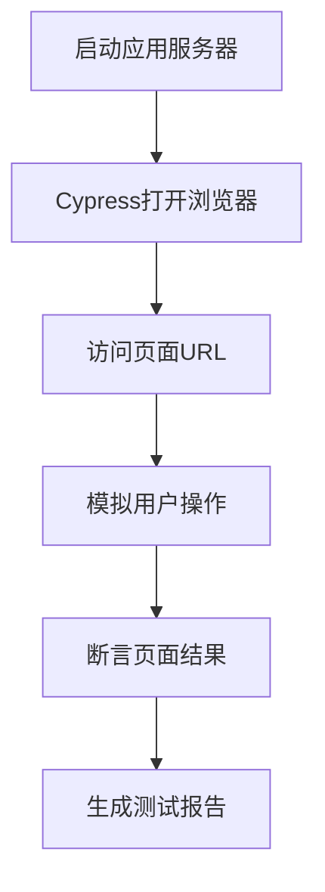

扫描[二维码](https://api2.cmdragon.cn/upload/cmder/20250304_012821924.jpg)关注或者微信搜一搜：`编程智域 前端至全栈交流与成长`

[发现1000+提升效率与开发的AI工具和实用程序](https://tools.cmdragon.cn/zh/apps?category=ai_chat)：https://tools.cmdragon.cn/


## 一、E2E测试：给应用做一次"全身体检"

还记得第八章我们聊过的端到端测试吗？当时只是纸上谈兵，了解了E2E测试的概念和工具选型。这一章，我们终于要把理论落地了——真正动手写E2E测试！

打个比方，单元测试和组件测试就像去医院验血、拍片子，它们各管一摊，只看某个局部有没有问题。而E2E测试呢？它更像体检时让你亲自去跑一圈，看你的心脏、肺活量、关节配合得怎么样——是从用户的视角，把整个应用从头到尾走一遍。

这里有个关键点你得牢记：**E2E测试不会导入任何Vue代码**。它跟单元测试、组件测试完全不同，后者可以直接import组件、访问组件内部状态；而E2E测试完全在真实浏览器中运行，模拟的是一个真实用户在点击、输入、等待页面响应的全过程。 Cypress不知道你用的是Vue还是React，它眼里只有HTML页面和DOM元素。

所以E2E测试的流程大概长这样：



整个链路一目了然：先让应用跑起来，Cypress接管浏览器，像真人一样操作页面，最后判断结果对不对。任何一环出问题，测试就会亮红灯。

## 二、安装Cypress

### 前提条件

你已经有一个Vue 3 + Vite项目在手上，能通过 `npm run dev` 正常启动开发服务器。如果还没有，赶紧回头补第三章的内容。

### 安装Cypress

一行命令搞定：

```bash
npm install -D cypress
```

Cypress是个重量级选手，安装包比较大，耐心等一会儿。装完后它会在 `node_modules/.bin/` 下注册 `cypress` 命令。

### 初始化Cypress

首次运行会触发初始化，Cypress会帮你生成一套标准的目录结构：

```bash
npx cypress open
```

第一次跑这个命令时，Cypress会弹出欢迎界面，让你选择测试类型（选E2E Testing），然后自动在项目根目录创建以下结构：

```
cypress/
├── e2e/          # E2E测试文件放这里
│   └── specs/
├── fixtures/     # 测试用的静态数据（JSON等）
└── support/      # 公共配置和自定义命令
    ├── commands.js
    └── e2e.js
```

简单说一下每个目录的用途：

- **cypress/e2e/** —— 你写的所有E2E测试用例都放这里，Cypress默认会扫描这个目录来寻找测试文件。
- **cypress/fixtures/** —— 存放测试数据，比如模拟接口返回的JSON文件，方便用 `cy.fixture()` 加载。
- **cypress/support/** —— 放公共逻辑，比如自定义Cypress命令、全局的 `beforeEach` 钩子等。

### 配置cypress.config.js

Cypress在项目根目录生成了一个配置文件，我们来改一下：

```js
const { defineConfig } = require('cypress')

module.exports = defineConfig({
  e2e: {
    // 应用的基础URL，之后用cy.visit('/')就会访问这个地址
    baseUrl: 'http://localhost:5173',
    // 浏览器视口宽度，模拟桌面端
    viewportWidth: 1280,
    // 浏览器视口高度
    viewportHeight: 720
  }
})
```

`baseUrl` 这个配置特别实用——设了之后，`cy.visit('/')` 就等同于 `cy.visit('http://localhost:5173/')`，写测试时省去一大串前缀。

### 添加npm脚本

在 `package.json` 的 `scripts` 里加上这两行：

```json
{
  "scripts": {
    "test:e2e": "start-server-and-test dev http://localhost:5173 'cypress open'",
    "test:e2e:ci": "start-server-and-test dev http://localhost:5173 'cypress run'"
  }
}
```

- **test:e2e** —— 本地开发时用，会弹出Cypress的可视化界面，方便调试。
- **test:e2e:ci** —— CI环境用，headless模式跑测试，不弹窗，直接输出结果。

但这里有个问题：`start-server-and-test` 这个包还没装呢！

### 安装start-server-and-test

E2E测试有个硬性前提——应用服务器必须在运行状态。总不能手动开一个终端跑 `npm run dev`，再开一个终端跑Cypress吧？`start-server-and-test` 就是来解决这个痛点的：它会先启动dev server，等 `http://localhost:5173` 可访问了，再执行Cypress命令，Cypress跑完后自动关掉服务器。

```bash
npm install -D start-server-and-test
```

装好之后，你只需要一行 `npm run test:e2e` 就能自动完成"启动服务器→等服务器就绪→打开Cypress"的全部流程，省心多了。

## 三、第一个E2E测试：验证首页加载

环境搭好了，来写第一个测试！先从最简单的场景入手：验证首页能不能正常加载。

在 `cypress/e2e/` 目录下创建 `home.cy.js`：

```js
describe('首页', () => {
  // beforeEach会在每个it测试用例执行前都跑一遍
  // 相当于每次测试前都"归位"到首页
  beforeEach(() => {
    cy.visit('/')
  })

  it('成功加载首页', () => {
    // cy.contains()查找包含指定文本的元素
    // 这里找h1标签里包含"我的Vue应用"的元素
    // 如果找不到，测试就会失败
    cy.contains('h1', '我的Vue应用')
    // cy.get()通过CSS选择器查找元素
    // should('be.visible')断言这个元素是可见的
    cy.get('nav').should('be.visible')
  })

  it('导航链接可点击', () => {
    // 找到包含"关于"文本的元素并点击它
    cy.contains('关于').click()
    // 点击后URL应该变成了/about
    cy.url().should('include', '/about')
  })
})
```

来拆解一下这段代码用到的几个核心API：

- **`describe(name, fn)`** —— 测试套件，把相关的测试用例归到一组。
- **`beforeEach(fn)`** —— 每个测试用例执行前的钩子，这里用来确保每次都从首页开始。
- **`cy.visit(path)`** —— 访问页面，路径会拼接到 `baseUrl` 后面。
- **`cy.contains(selector, text)`** —— 查找包含特定文本的元素。省略selector时会在整个页面找。
- **`cy.get(selector)`** —— 用CSS选择器找元素，跟jQuery的 `$()` 一个思路。
- **`cy.url()`** —— 获取当前页面的URL。
- **`.should(assertion)`** —— 断言，可以链式调用。

运行测试：

```bash
npm run test:e2e
```

Cypress弹出可视化界面后，选择你的测试文件，就能看到浏览器自动打开、自动操作页面、自动断言的全过程。那种看着浏览器"自己动起来"的感觉，还挺神奇的。

## 四、核心命令详解

Cypress的命令体系不算复杂，但覆盖了你能想到的几乎所有用户操作。把下面这些命令搞熟，写E2E测试就基本够用了。

### 页面导航

| 命令 | 作用 | 示例 |
|------|------|------|
| `cy.visit(url)` | 访问页面 | `cy.visit('/login')` |
| `cy.url()` | 获取当前URL | `cy.url().should('include', '/home')` |
| `cy.go(direction)` | 前进/后退 | `cy.go('back')`、`cy.go('forward')` |
| `cy.reload()` | 刷新页面 | `cy.reload()` |

### 元素查找

| 命令 | 作用 | 示例 |
|------|------|------|
| `cy.get(selector)` | CSS选择器查找 | `cy.get('.btn-primary')` |
| `cy.contains(text)` | 按文本内容查找 | `cy.contains('提交')` |
| `cy.get().find()` | 在子元素中查找 | `cy.get('.card').find('h3')` |
| `cy.get().eq(index)` | 按索引选取 | `cy.get('li').eq(0)` 获取第一个li |

### 用户交互

| 命令 | 作用 | 示例 |
|------|------|------|
| `cy.type(text)` | 输入文本 | `cy.get('input').type('hello')` |
| `cy.click()` | 点击元素 | `cy.get('button').click()` |
| `cy.select(value)` | 选择下拉选项 | `cy.get('select').select('选项1')` |
| `cy.check()` | 勾选复选框 | `cy.get('[type=checkbox]').check()` |
| `cy.uncheck()` | 取消勾选 | `cy.get('[type=checkbox]').uncheck()` |
| `cy.clear()` | 清空输入框 | `cy.get('input').clear()` |
| `cy.dblclick()` | 双击 | `cy.get('.item').dblclick()` |
| `cy.rightclick()` | 右键点击 | `cy.get('.item').rightclick()` |

### 断言

Cypress的断言通过 `.should()` 链式调用，写起来很流畅：

```js
// 元素可见
cy.get('.modal').should('be.visible')

// 包含文本
cy.get('.title').should('contain.text', '欢迎回来')

// 输入框的值
cy.get('input[name=email]').should('have.value', 'test@example.com')

// 含某个CSS类
cy.get('.tab').should('have.class', 'active')

// 元素不存在
cy.get('.loading').should('not.exist')

// 元素数量
cy.get('.todo-item').should('have.length', 3)

// 链式断言——一个元素同时满足多个条件
cy.get('.btn')
  .should('be.visible')
  .and('be.enabled')
  .and('contain.text', '提交')
```

这里有个小技巧：Cypress的命令是**自动重试**的。比如你写了 `cy.get('.modal').should('be.visible')`，如果弹窗还没出来（比如动画还在播放），Cypress不会立即报错，而是会在默认4秒内反复查找，直到元素出现或超时。这就省去了手动写 `setTimeout` 的麻烦。

## 五、实战：Todo应用的E2E测试

纸上得来终觉浅，来个完整点的实战。假设你的Vue项目里有个Todo应用，支持添加、完成、删除待办事项，我们来给它写一套E2E测试。

在 `cypress/e2e/` 下创建 `todo.cy.js`：

```js
describe('Todo应用', () => {
  // 每个测试开始前，先访问首页（Todo应用就在首页上）
  beforeEach(() => {
    cy.visit('/')
  })

  it('添加一条待办', () => {
    // 找到输入框，输入文字后按回车
    cy.get('[data-testid=new-todo]').type('学习Vue测试{enter}')
    // 断言：待办列表中出现了刚输入的内容
    cy.get('[data-testid=todo-list]').should('contain.text', '学习Vue测试')
  })

  it('完成待办', () => {
    // 先添加一条待办
    cy.get('[data-testid=new-todo]').type('学习Cypress{enter}')
    // 找到第一条待办，勾选它的完成按钮
    cy.get('[data-testid=todo-item]').first().find('.toggle').check()
    // 断言：这条待办应该有了completed样式类
    cy.get('[data-testid=todo-item]').first().should('have.class', 'completed')
  })

  it('删除待办', () => {
    // 先添加一条待办
    cy.get('[data-testid=new-todo]').type('学习Vitest{enter}')
    // 找到第一条待办的删除按钮，点击它
    // force:true是因为删除按钮可能需要鼠标悬停才显示
    cy.get('[data-testid=todo-item]').first().find('.destroy').click({ force: true })
    // 断言：列表中不应该再包含这条待办
    cy.get('[data-testid=todo-list]').should('not.contain.text', '学习Vitest')
  })
})
```

注意看，我们在选择器里大量使用了 `[data-testid=xxx]` 这种写法。这不是随便选的，而是E2E测试的最佳实践——下一节会详细聊为什么。

再补充一个过滤功能的测试场景：

```js
describe('Todo应用 - 过滤功能', () => {
  beforeEach(() => {
    cy.visit('/')
    // 预先添加两条待办，一条完成一条没完成
    cy.get('[data-testid=new-todo]').type('未完成的事项{enter}')
    cy.get('[data-testid=new-todo]').type('已完成的事项{enter}')
    // 勾选第二条为已完成
    cy.get('[data-testid=todo-item]').eq(1).find('.toggle').check()
  })

  it('只显示未完成的待办', () => {
    // 点击"未完成"过滤按钮
    cy.contains('Active').click()
    // 断言：只显示未完成的事项
    cy.get('[data-testid=todo-list]')
      .should('contain.text', '未完成的事项')
      .and('not.contain.text', '已完成的事项')
  })

  it('只显示已完成的待办', () => {
    // 点击"已完成"过滤按钮
    cy.contains('Completed').click()
    // 断言：只显示已完成的事项
    cy.get('[data-testid=todo-list]')
      .should('contain.text', '已完成的事项')
      .and('not.contain.text', '未完成的事项')
  })
})
```

这个过滤测试有个值得学习的点：我们在 `beforeEach` 里统一准备好了测试数据（两条待办，一完成一未完成），每个测试用例都基于同样的初始状态来验证，互不干扰。

## 六、E2E测试的最佳实践

写了几个测试之后，有些"规矩"得尽早立起来，不然项目一复杂，测试维护起来比写业务代码还痛苦。

### 1. 使用data-testid选择器

选择元素的方式有很多种，但稳定性天差地别：

```js
// ❌ 按CSS类名选择——改个样式测试就挂了
cy.get('.todo-item')

// ❌ 按ID选择——ID可能被重构掉
cy.get('#todo-1')

// ❌ 按DOM层级选择——结构一调整就完蛋
cy.get('ul > li:first-child > .toggle')

// ✅ 按data-testid选择——专门给测试用的，改样式改结构都不影响
cy.get('[data-testid=todo-item]')
```

`data-testid` 就像是给元素贴了个"测试专用标签"，产品代码改动时不会随意去碰它，测试代码就稳了。在Vue组件里加起来也很简单：

```html
<template>
  <input data-testid="new-todo" v-model="newTodo" />
  <ul data-testid="todo-list">
    <li v-for="todo in todos" :key="todo.id" data-testid="todo-item">
      {{ todo.text }}
    </li>
  </ul>
</template>
```

### 2. 每个测试独立，用beforeEach重置状态

测试之间不能有依赖关系。第二个测试不能指望第一个测试已经添加了数据——万一第一个测试挂了呢？用 `beforeEach` 让每个测试都从干净的初始状态开始：

```js
beforeEach(() => {
  // 重置到初始状态
  cy.visit('/')
  // 如果需要，还可以清除本地存储
  cy.clearLocalStorage()
})
```

### 3. 不要依赖其他测试的执行结果

这条跟上一条是一脉相承的。千万别写"测试A添加数据，测试B验证数据"这种有依赖的用例。Cypress并行跑测试时，执行顺序不一定是文件里写的顺序。

### 4. 用cy.intercept()模拟API响应

E2E测试最理想的状态是：不依赖后端，自己就能跑。`cy.intercept()` 可以拦截网络请求并返回你预设的数据：

```js
// 拦截获取待办列表的API，返回预设数据
cy.intercept('GET', '/api/todos', {
  statusCode: 200,
  body: [
    { id: 1, text: '学习Cypress', completed: false },
    { id: 2, text: '写E2E测试', completed: true }
  ]
}).as('getTodos')

// 访问页面后，等待API调用完成
cy.visit('/')
cy.wait('@getTodos')

// 现在可以安全地断言页面内容了
cy.get('[data-testid=todo-item]').should('have.length', 2)
```

这样做的好处是：测试不再受后端服务影响，也不会因为网络问题偶尔超时，速度更快、更稳定。

### 5. 保持测试简短，一个测试验证一个流程

别在一个 `it()` 里塞太多东西。理想情况下，一个测试用例只验证一个完整的用户流程，比如"添加待办"或"删除待办"。测试越短，出问题时定位错误越容易。

## 七、课后Quiz

**题目：E2E测试与组件测试在选择元素时有什么关键区别？为什么E2E测试推荐用data-testid？**

<details>
<summary>点击查看答案</summary>

组件测试和E2E测试在选择元素这件事上，根本思路就不一样。

组件测试用的是 `vue-test-utils` 提供的 `wrapper` 对象，你可以直接通过 `wrapper.vm` 访问组件实例，用 `wrapper.findComponent()` 找子组件，用 `wrapper.emitted()` 检查触发的事件——你是在"组件内部"操作的，能看到组件的骨架和内脏。

而E2E测试只能通过DOM选择器来定位页面元素，就像一个真实用户只能看到浏览器里渲染出来的内容一样。这意味着如果你用CSS类名（`.btn-primary`）或DOM结构（`div > ul > li`）来选择元素，一旦设计师改了样式类名、前端同学调整了DOM结构，测试就会莫名其妙地挂掉。

`data-testid` 之所以被推荐，是因为它是一个"约定"——这个属性存在的唯一目的就是给测试用，产品代码的需求变更不会去碰它。它就像给你的元素绑了个"身份证号"，不管这人换了什么衣服（CSS类名变了）、搬了什么房子（DOM结构调整了），身份证号不变，测试就能稳定地找到它。

</details>

## 八、常见报错排查

### 报错1："Cypress detected that your test tried to visit a URL that was not served by your app"

**产生原因：** Cypress检测到你试图访问的URL并不是你的应用提供的。最常见的两种情况：一是开发服务器压根没启动；二是 `cypress.config.js` 里的 `baseUrl` 配置错了（比如端口号对不上）。

**解决办法：**

1. 先确认 `npm run dev` 能正常启动，浏览器能访问 `http://localhost:5173`。
2. 检查 `cypress.config.js` 中的 `baseUrl` 是否跟实际开发服务器地址一致。
3. 最省心的方案是使用 `start-server-and-test`，它会自动帮你管好服务器的启停，不用操心这个顺序问题。

**预防建议：** 把启动服务器和运行Cypress绑成一个npm脚本，永远通过 `npm run test:e2e` 来跑测试，别手动分开操作。

### 报错2："Timed out retrying: Expected to find element: '[data-testid=xxx]', but never found it"

**产生原因：** Cypress在默认超时时间（4秒）内没找到你指定的元素。可能的原因有：元素还没渲染出来你就开始找了（比如接口数据还没返回）、选择器拼写有误、或者元素确实不存在。

**解决办法：**

1. 先检查选择器有没有写错——在浏览器开发者工具里用 `document.querySelector('[data-testid=xxx]')` 手动试一下。
2. 如果是异步渲染导致的，可以用 `.should()` 让Cypress自动等待：`cy.get('[data-testid=xxx]').should('be.visible')`。Cypress会在超时前反复重试，直到元素出现。
3. 千万别用 `cy.wait(3000)` 这种硬编码延时，又慢又不靠谱。

**预防建议：** 对所有可能异步出现的元素，养成用 `.should()` 链式等待的习惯，而不是手动加延时。

### 报错3：测试间状态互相污染

**产生原因：** 前一个测试往列表里添加了数据，后一个测试期望列表是空的——结果当然对不上。这类问题特别隐蔽，因为每个测试单独跑都能过，但一整组一起跑就挂。

**解决办法：**

1. 在 `beforeEach` 中用 `cy.clearLocalStorage()` 清除前端存储。
2. 如果后端有状态，用 `cy.request()` 调用后端的测试重置接口，或者用 `cy.exec()` 执行脚本重置数据库。
3. 对于网络请求，用 `cy.intercept()` 拦截并返回固定的测试数据，不依赖后端状态。

**预防建议：** 每个测试用例都应该能独立运行——在任何顺序下、在任何时间点执行，结果都应该一样。把"独立准备数据"当成铁律来遵守。

## 参考链接

参考链接：https://cn.vuejs.org/guide/scaling-up/testing.html

余下文章内容请点击跳转至 个人博客页面 或者 扫描[二维码](https://api2.cmdragon.cn/upload/cmder/20250304_012821924.jpg)关注或者微信搜一搜：`编程智域 前端至全栈交流与成长`，阅读完整的文章：[Vue 3测试入门第十一章：E2E测试实战——Cypress从安装到跑通第一个用例](https://blog.cmdragon.cn/posts/c3d4e5f6g7h8i9j0/)

<details>
<summary>往期文章归档</summary>

- [Vue 3 静态与动态 Props 如何传递？TypeScript 类型约束有何必要？](https://blog.cmdragon.cn/posts/94ab48753b64780ca3ab7a7115ae8522/)
- [Vue 3中组件局部注册的优势与实现方式如何？](https://blog.cmdragon.cn/posts/dbf576e744870f6de26fd8a2e03e47da/)
- [如何在Vue3中优化生命周期钩子性能并规避常见陷阱？](https://blog.cmdragon.cn/posts/12d98b3b9ccd6c19a1b169d720ac5c80/)
- [Vue 3 Composition API生命周期钩子：如何实现从基础理解到高阶复用？](https://blog.cmdragon.cn/posts/8884e2b70287fcb263c57648eeb27419/)
- [Vue 3生命周期钩子实战指南：如何正确选择onMounted、onUpdated与onUnmounted的应用场景？](https://blog.cmdragon.cn/posts/883c6dbc50ae4183770a4462e0b8ae4d/)
- [Vue 3中生命周期钩子与响应式系统如何实现协同工作？](https://blog.cmdragon.cn/posts/70dad360ffa9dce14d0d69611b8cb019/)
- [Vue 3组件生命周期钩子的执行顺序与使用场景是什么？](https://blog.cmdragon.cn/posts/db44294a78dc9f666f67b053f6c83567/)
- [Vue组件全局注册与局部注册如何抉择？](https://blog.cmdragon.cn/posts/43ead630ea17da65d99ad2eb8188e472/)
- [Vue3组件化开发中，Props与Emits如何实现数据流转与事件协作？](https://blog.cmdragon.cn/posts/8cff7d2df113da66ea7be560c4d1d22a/)
- [Vue 3模板引用如何与其他特性协同实现复杂交互？](https://blog.cmdragon.cn/posts/331bf75d114ab09116eadfcdca602b58/)
- [Vue 3 v-for中模板引用如何实现高效管理与动态控制？](https://blog.cmdragon.cn/posts/cb380897ddc3578b180ecf8843c774c1/)
- [Vue 3的defineExpose：如何突破script setup组件默认封装，实现精准的父子通讯？](https://blog.cmdragon.cn/posts/202ae0f4acde7128e0e31baf63732fb5/)
- [Vue 3模板引用的生命周期时机如何把握？常见陷阱该如何避免？](https://blog.cmdragon.cn/posts/7d2a0f6555ecbe92afd7d2491c427463/)
- [Vue 3模板引用如何实现父组件与子组件的高效交互？](https://blog.cmdragon.cn/posts/3fb7bdd84128b7efaaa1c979e1f28dee/)
- [Vue中为何需要模板引用？又如何高效实现DOM与组件实例的直接访问？](https://blog.cmdragon.cn/posts/23f3464ba16c7054b4783cded50c04c6/)
- [Vue 3 watch与watchEffect如何区分使用？常见陷阱与性能优化技巧有哪些？](https://blog.cmdragon.cn/posts/68a26cc0023e4994a6bc54fb767365c8/)
- [Vue3侦听器实战：组件与Pinia状态监听如何高效应用？](https://blog.cmdragon.cn/posts/fd4695f668d64332dda9962c24214f32/)
- [Vue 3中何时用watch，何时用watchEffect？核心区别及性能优化策略是什么？](https://blog.cmdragon.cn/posts/cdbbb1837f8c093252e61f46dbf0a2e7/)
- [Vue 3中如何有效管理侦听器的暂停、恢复与副作用清理？](https://blog.cmdragon.cn/posts/09551ab614c463a6d6ca69818e8c2d52/)
- [Vue 3 watchEffect：如何实现响应式依赖的自动追踪与副作用管理？](https://blog.cmdragon.cn/posts/b7bca5d20f628ac09f7192ad935ef664/)
- [Vue 3 watch如何利用immediate、once、deep选项实现初始化、一次性与深度监听？](https://blog.cmdragon.cn/posts/2c6cdb100a20f10c7e7d4413617c7ea9/)
- [Vue 3中watch如何高效监听多数据源、计算结果与数组变化？](https://blog.cmdragon.cn/posts/757a1728bc1b9c0c8b317b0354d85568/)
- [Vue 3中watch监听ref和reactive的核心差异与注意事项是什么？](https://blog.cmdragon.cn/posts/8e70552f0f61e0dc8c7f567a2d272345/)
- [Vue3中Watch与watchEffect的核心差异及适用场景是什么？](https://blog.cmdragon.cn/posts/dde70ab90dc5062c435e0501f5a6e7cb/)
- [Vue 3自定义指令如何赋能表单自动聚焦与防抖输入的高效实现？](https://blog.cmdragon.cn/posts/1f5ed5047850ed52c0fd0386f76bd4ae/)
- [Vue3中如何优雅实现支持多绑定变量和修饰符的双向绑定组件？](https://blog.cmdragon.cn/posts/e3d4e128815ad731611b8ef29e37616b/)
- [Vue 3表单验证如何从基础规则到异步交互构建完整验证体系？](https://blog.cmdragon.cn/posts/7d1caedd822f70542aa0eed67e30963b/)
- [Vue3响应式系统如何支撑表单数据的集中管理、动态扩展与实时计算？](https://blog.cmdragon.cn/posts/3687a5437ab56cb082b5b813d5577a40/)
- [Vue3跨组件通信中，全局事件总线与provide/inject该如何正确选择？](https://blog.cmdragon.cn/posts/ad67c4eb6d76cf7707bdfe6a8146c34f/)
- [Vue3表单事件处理：v-model如何实现数据绑定、验证与提交？](https://blog.cmdragon.cn/posts/1c1e80d697cca0923f29ec70ebb8ccd1/)
- [Vue应用如何基于DOM事件传播机制与事件修饰符实现高效事件处理？](https://blog.cmdragon.cn/posts/b990828143d70aa87f9aa52e16692e48/)
- [Vue3中如何在调用事件处理函数时同时传递自定义参数和原生DOM事件？参数顺序有哪些注意事项？](https://blog.cmdragon.cn/posts/b44316e0866e9f2e6aef927dbcf5152b/)
- [从捕获到冒泡：Vue事件修饰符如何重塑事件执行顺序？](https://blog.cmdragon.cn/posts/021636c2a06f5e2d3d01977a12ddf559/)
- [Vue事件处理：内联还是方法事件处理器，该如何抉择？](https://blog.cmdragon.cn/posts/b3cddf7023ab537e623a61bc01dab6bb/)
- [Vue事件绑定中v-on与@语法如何取舍？参数传递与原生事件处理有哪些实战技巧？](https://blog.cmdragon.cn/posts/bd4d9607ce1bc34cc3bda0a1a46c40f6/)
- [Vue 3中列表排序时为何必须复制数组而非直接修改原始数据？](https://blog.cmdragon.cn/posts/a5f2bacb74476fd7f5e02bb3f1ba6b2b/)
- [Vue虚拟滚动如何将列表DOM数量从万级降至十位数？](https://blog.cmdragon.cn/posts/d3b06b57fb7f126787e6ed22dce1e341/)
- [Vue3中v-if与v-for直接混用为何会报错？计算属性如何解决优先级冲突？](https://blog.cmdragon.cn/posts/3100cc5a2e16f8dac36f722594e6af32/)
- [为何在Vue3递归组件中必须用v-if判断子项存在？](https://blog.cmdragon.cn/posts/455dc2d47c38d12c1cf350e490041e8b/)
- [Vue3列表渲染中，如何用数组方法与计算属性优化v-for的数据处理？](https://blog.cmdragon.cn/posts/3f842bbd7ba0f9c91151b983bf784c8b/)
- [Vue v-for的key：为什么它能解决列表渲染中的"玄学错误"？选错会有哪些后果？](https://blog.cmdragon.cn/posts/1eb3ffac668a743843b5ea1738301d40/)
- [Vue3中v-for与v-if为何不能直接共存于同一元素？](https://blog.cmdragon.cn/posts/138b13c5341f6a1fa9015400433a3611/)
- [Vue3中v-if与v-show的本质区别及动态组件状态保持的关键策略是什么？](https://blog.cmdragon.cn/posts/0242a94dc552b93a1bc335ac4fc33db5/)
- [Vue3中v-show如何通过CSS修改display属性控制条件显示？与v-if的应用场景该如何区分？](https://blog.cmdragon.cn/posts/97c66a18ae0e9b57c6a69b8b3a41ddf6/)
- [Vue3条件渲染中v-if系列指令如何合理使用与规避错误？](https://blog.cmdragon.cn/posts/8a1ddfac64b25062ac56403e4c1201d2/)
- [Vue3动态样式控制：ref、reactive、watch与computed的应用场景与区别是什么？](https://blog.cmdragon.cn/posts/218c3a59282c3b757447ee08a01937bb/)
- [Vue3中动态样式数组的后项覆盖规则如何与计算属性结合实现复杂状态样式管理？](https://blog.cmdragon.cn/posts/1bab953e41f66ac53de099fa9fe76483/)
- [Vue浅响应式如何解决深层响应式的性能问题？适用场景有哪些？](https://blog.cmdragon.cn/posts/c85e1fe16a7ae45e965b4e2df4d9d2f4/)
- [Vue 3组合式API中ref与reactive的核心响应式差异及使用最佳实践是什么？](https://blog.cmdragon.cn/posts/be04b02d2723994632de0d4ca22a3391/)
- [Vue3响应式系统中，对象新增属性、数组改索引、原始值代理的问题如何解决？](https://blog.cmdragon.cn/posts/a0af08dd60a37b9a890a9957f2cbfc9f/)
- [Vue 3中watch侦听器的正确使用姿势你掌握了吗？深度监听、与watchEffect的差异及常见报错解析](https://blog.cmdragon.cn/posts/bc287e1e36287afd90750fd907eca85e/)
- [Vue响应式声明的API差异、底层原理与常见陷阱你都搞懂了吗](https://blog.cmdragon.cn/posts/654b9447ef1ba7ec1126a1bc26a4726d/)
- [为什么Vue 3需要ref函数？它的响应式原理与正确用法是什么？](https://blog.cmdragon.cn/posts/c405a8d9950af5b7c63b56c348ac36b6/)
- [Vue 3中reactive函数如何通过Proxy实现响应式？使用时要避开哪些误区？](https://blog.cmdragon.cn/posts/a7e9abb9691a81e4404d9facabe0f7c3/)
- [Vue3响应式系统的底层原理与实践要点你真的懂吗？](https://blog.cmdragon.cn/posts/bd995ea45161727597fb85b62566c43d/)
- [Vue 3模板如何通过编译三阶段实现从声明式语法到高效渲染的跨越](https://blog.cmdragon.cn/posts/53e3f270a80675df662c6857a3332c0f/)
- [快速入门Vue模板引用：从收DOM"快递"到调子组件方法，你玩明白了吗？](https://blog.cmdragon.cn/posts/ddbce4f2a23aa72c96b1c0473900321e/)
- [快速入门Vue模板里的JS表达式有啥不能碰？计算属性为啥比方法更能打？](https://blog.cmdragon.cn/posts/23a2d5a334e15575277814c16e45df50/)
- [快速入门Vue的v-model表单绑定：语法糖、动态值、修饰符的小技巧你都掌握了吗？](https://blog.cmdragon.cn/posts/6be38de6382e31d282659b689c5b17f0/)
- [快速入门Vue3事件处理的挑战题：v-on、修饰符、自定义事件你能通关吗？](https://blog.cmdragon.cn/posts/60ce517684f4a418f453d66aa805606c/)
- [快速入门Vue3的v-指令：数据和DOM的"翻译官"到底有多少本事？](https://blog.cmdragon.cn/posts/e4ae7d5e4a9205bb11b2baccb230c637/)
- [快速入门Vue3，插值、动态绑定和避坑技巧你都搞懂了吗？](https://blog.cmdragon.cn/posts/999ce4fb32259ff4fbf4bf7bcb851654/)

</details>

<details>
<summary>免费好用的热门在线工具</summary>

- [多直播聚合器 - 应用商店 | By cmdragon](https://tools.cmdragon.cn/zh/apps/multi-live-aggregator)
- [Proto文件生成器 - 应用商店 | By cmdragon](https://tools.cmdragon.cn/zh/apps/proto-file-generator)
- [图片转粒子 - 应用商店 | By cmdragon](https://tools.cmdragon.cn/zh/apps/image-to-particles)
- [视频下载器 - 应用商店 | By cmdragon](https://tools.cmdragon.cn/zh/apps/video-downloader)
- [文件格式转换器 - 应用商店 | By cmdragon](https://tools.cmdragon.cn/zh/apps/file-converter)
- [M3U8在线播放器 - 应用商店 | By cmdragon](https://tools.cmdragon.cn/zh/apps/m3u8-player)
- [快图设计 - 应用商店 | By cmdragon](https://tools.cmdragon.cn/zh/apps/quick-image-design)
- [高级文字转图片转换器 - 应用商店 | By cmdragon](https://tools.cmdragon.cn/zh/apps/text-to-image-advanced)
- [RAID 计算器 - 应用商店 | By cmdragon](https://tools.cmdragon.cn/zh/apps/raid-calculator)
- [在线PS - 应用商店 | By cmdragon](https://tools.cmdragon.cn/zh/apps/photoshop-online)
- [Mermaid 在线编辑器 - 应用商店 | By cmdragon](https://tools.cmdragon.cn/zh/apps/mermaid-live-editor)
- [数学求解计算器 - 应用商店 | By cmdragon](https://tools.cmdragon.cn/zh/apps/math-solver-calculator)
- [智能提词器 - 应用商店 | By cmdragon](https://tools.cmdragon.cn/zh/apps/smart-teleprompter)
- [魔法简历 - 应用商店 | By cmdragon](https://tools.cmdragon.cn/zh/apps/magic-resume)
- [Image Puzzle Tool - 图片拼图工具 | By cmdragon](https://tools.cmdragon.cn/zh/apps/image-puzzle-tool)
- [字幕下载工具 - 应用商店 | By cmdragon](https://tools.cmdragon.cn/zh/apps/subtitle-downloader)
- [歌词生成工具 - 应用商店 | By cmdragon](https://tools.cmdragon.cn/zh/apps/lyrics-generator)
- [网盘资源聚合搜索 - 应用商店 | By cmdragon](https://tools.cmdragon.cn/zh/apps/cloud-drive-search)
- [ASCII字符画生成器 - 应用商店 | By cmdragon](https://tools.cmdragon.cn/zh/apps/ascii-art-generator)
- [JSON Web Tokens 工具 - 应用商店 | By cmdragon](https://tools.cmdragon.cn/zh/apps/jwt-tool)
- [Bcrypt 密码工具 - 应用商店 | By cmdragon](https://tools.cmdragon.cn/zh/apps/bcrypt-tool)
- [GIF 合成器 - 应用商店 | By cmdragon](https://tools.cmdragon.cn/zh/apps/gif-composer)
- [GIF 分解器 - 应用商店 | By cmdragon](https://tools.cmdragon.cn/zh/apps/gif-decomposer)
- [文本隐写术 - 应用商店 | By cmdragon](https://tools.cmdragon.cn/zh/apps/text-steganography)
- [CMDragon 在线工具 - 高级AI工具箱与开发者套件 | 免费好用的在线工具](https://tools.cmdragon.cn/zh)
- [应用商店 - 发现1000+提升效率与开发的AI工具和实用程序 | 免费好用的在线工具](https://tools.cmdragon.cn/zh/apps?category=trending)
- [CMDragon 更新日志 - 最新更新、功能与改进 | 免费好用的在线工具](https://tools.cmdragon.cn/zh/changelog)
- [支持我们 - 成为赞助者 | 免费好用的在线工具](https://tools.cmdragon.cn/zh/sponsor)
- [AI文本生成图像 - 应用商店 | 免费好用的在线工具](https://tools.cmdragon.cn/zh/apps/text-to-image-ai)
- [临时邮箱 - 应用商店 | 免费好用的在线工具](https://tools.cmdragon.cn/zh/apps/temp-email)
- [二维码解析器 - 应用商店 | 免费好用的在线工具](https://tools.cmdragon.cn/zh/apps/qrcode-parser)
- [文本转思维导图 - 应用商店 | 免费好用的在线工具](https://tools.cmdragon.cn/zh/apps/text-to-mindmap)
- [正则表达式可视化工具 - 应用商店 | 免费好用的在线工具](https://tools.cmdragon.cn/zh/apps/regex-visualizer)
- [文件隐写工具 - 应用商店 | 免费好用的在线工具](https://tools.cmdragon.cn/zh/apps/steganography-tool)
- [IPTV 频道探索器 - 应用商店 | 免费好用的在线工具](https://tools.cmdragon.cn/zh/apps/iptv-explorer)
- [快传 - 应用商店 | 免费好用的在线工具](https://tools.cmdragon.cn/zh/apps/snapdrop)
- [随机抽奖工具 - 应用商店 | 免费好用的在线工具](https://tools.cmdragon.cn/zh/apps/lucky-draw)
- [动漫场景查找器 - 应用商店 | 免费好用的在线工具](https://tools.cmdragon.cn/zh/apps/anime-scene-finder)
- [时间工具箱 - 应用商店 | 免费好用的在线工具](https://tools.cmdragon.cn/zh/apps/time-toolkit)
- [网速测试 - 应用商店 | 免费好用的在线工具](https://tools.cmdragon.cn/zh/apps/speed-test)
- [AI 智能抠图工具 - 应用商店 | 免费好用的在线工具](https://tools.cmdragon.cn/zh/apps/background-remover)
- [背景替换工具 - 应用商店 | 免费好用的在线工具](https://tools.cmdragon.cn/zh/apps/background-replacer)
- [艺术二维码生成器 - 应用商店 | 免费好用的在线工具](https://tools.cmdragon.cn/zh/apps/artistic-qrcode)
- [Open Graph 元标签生成器 - 应用商店 | 免费好用的在线工具](https://tools.cmdragon.cn/zh/apps/open-graph-generator)
- [图像对比工具 - 应用商店 | 免费好用的在线工具](https://tools.cmdragon.cn/zh/apps/image-comparison)
- [图片压缩专业版 - 应用商店 | 免费好用的在线工具](https://tools.cmdragon.cn/zh/apps/image-compressor)
- [密码生成器 - 应用商店 | 免费好用的在线工具](https://tools.cmdragon.cn/zh/apps/password-generator)
- [SVG优化器 - 应用商店 | 免费好用的在线工具](https://tools.cmdragon.cn/zh/apps/svg-optimizer)
- [调色板生成器 - 应用商店 | 免费好用的在线工具](https://tools.cmdragon.cn/zh/apps/color-palette)
- [在线节拍器 - 应用商店 | 免费好用的在线工具](https://tools.cmdragon.cn/zh/apps/online-metronome)
- [IP归属地查询 - 应用商店 | 免费好用的在线工具](https://tools.cmdragon.cn/zh/apps/ip-geolocation)
- [CSS网格布局生成器 - 应用商店 | 免费好用的在线工具](https://tools.cmdragon.cn/zh/apps/css-grid-layout)
- [邮箱验证工具 - 应用商店 | 免费好用的在线工具](https://tools.cmdragon.cn/zh/apps/email-validator)
- [书法练习字帖 - 应用商店 | 免费好用的在线工具](https://tools.cmdragon.cn/zh/apps/calligraphy-practice)
- [金融计算器套件 - 应用商店 | 免费好用的在线工具](https://tools.cmdragon.cn/zh/apps/finance-calculator-suite)
- [中国亲戚关系计算器 - 应用商店 | 免费好用的在线工具](https://tools.cmdragon.cn/zh/apps/chinese-kinship-calculator)
- [Protocol Buffer 工具箱 - 应用商店 | 免费好用的在线工具](https://tools.cmdragon.cn/zh/apps/protobuf-toolkit)
- [IP归属地查询 - 应用商店 | 免费好用的在线工具](https://tools.cmdragon.cn/zh/apps/ip-geolocation)
- [图片无损放大 - 应用商店 | 免费好用的在线工具](https://tools.cmdragon.cn/zh/apps/image-upscaler)
- [文本比较工具 - 应用商店 | 免费好用的在线工具](https://tools.cmdragon.cn/zh/apps/text-compare)
- [IP批量查询工具 - 应用商店 | 免费好用的在线工具](https://tools.cmdragon.cn/zh/apps/ip-batch-lookup)
- [域名查询工具 - 应用商店 | 免费好用的在线工具](https://tools.cmdragon.cn/zh/apps/domain-finder)
- [DNS工具箱 - 应用商店 | 免费好用的在线工具](https://tools.cmdragon.cn/zh/apps/dns-toolkit)
- [网站图标生成器 - 应用商店 | 免费好用的在线工具](https://tools.cmdragon.cn/zh/apps/favicon-generator)
- [XML Sitemap](https://tools.cmdragon.cn/sitemap_index.xml)

</details>

REFERENCES

链接：https://tools.cmdragon.cn/
链接：https://blog.cmdragon.cn/
链接：https://linknest.cmdragon.cn/
链接：https://nopq.cn/
链接：https://magic-resume.cmdragon.cn/
