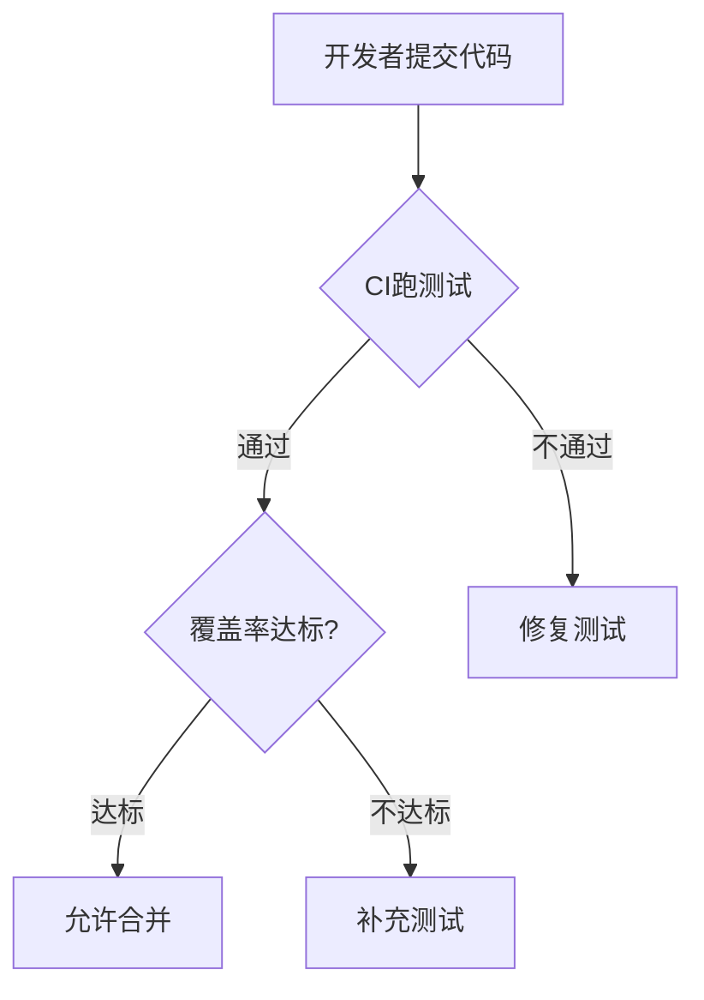
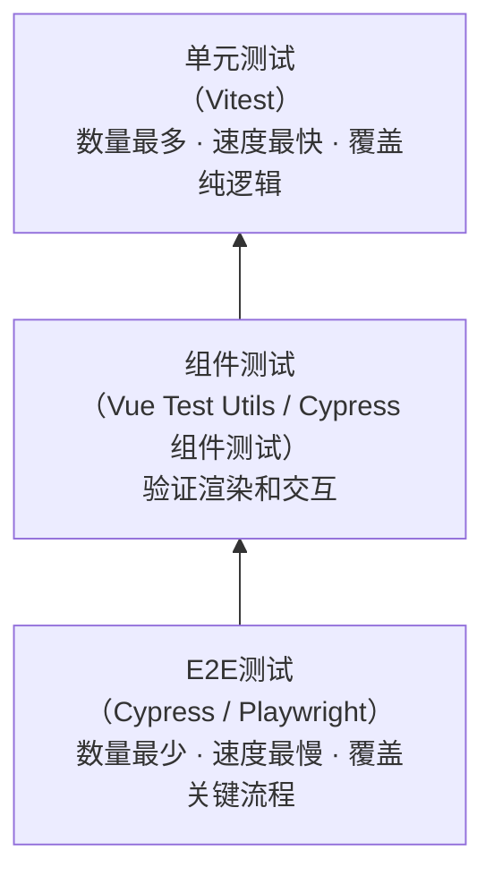
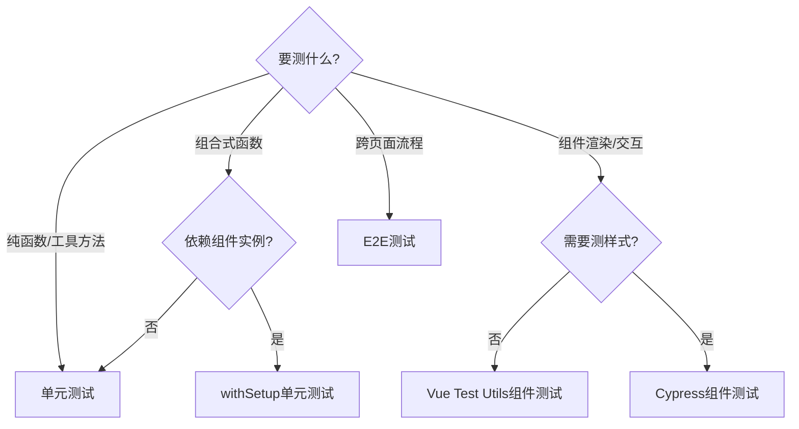

扫描[二维码](https://api2.cmdragon.cn/upload/cmder/20250304_012821924.jpg)关注或者微信搜一搜：`编程智域 前端至全栈交流与成长`

[发现1000+提升效率与开发的AI工具和实用程序](https://tools.cmdragon.cn/zh/apps?category=ai_chat)：https://tools.cmdragon.cn/

## 一、覆盖率：测试的"体检报告单"

你做完体检，医生会给你一张报告单，上面写着各项指标——血压、血糖、肝功能……覆盖率对代码来说，就是这张体检报告单。它告诉你：哪些代码被测试"检查"过了，哪些还处于"漏诊"状态。

但这里有个关键认知你得先建立：**覆盖率100%不等于没有bug**。就像体检报告全绿灯，也不代表你一定不会生病——它只能说明"该查的都查了"，但查得对不对、查得深不深，那是另一回事。

### 覆盖率的核心指标

覆盖率其实不是单一数字，它有四个维度，就像体检报告有好几个科目一样：

- **行覆盖率（Lines）**：被执行到的代码行占总代码行的比例。比如一个函数有10行，测试跑了其中8行，行覆盖率就是80%。这是最直观的指标，也是大家最常说的那个"覆盖率"。

- **分支覆盖率（Branches）**：`if/else`分支被执行的比例。假设有个`if (a > 0) { ... } else { ... }`，你的测试只走了`a > 0`的情况，分支覆盖率就是50%——因为`else`那条路根本没走过。分支覆盖率比行覆盖率更能暴露问题，一个`if`里藏的bug往往就在你没走到的那条分支上。

- **函数覆盖率（Functions）**：被调用过的函数占总函数的比例。一个工具文件导出了5个函数，你只测了3个，函数覆盖率就是60%。

- **语句覆盖率（Statements）**：被执行的语句占总语句的比例。跟行覆盖率很像，但更精确——一行代码可能包含多条语句，比如`const a = 1, b = 2;`这行有两条语句。

### 覆盖率不是万能的

这句话怎么强调都不过分：**80%覆盖率的代码可能比100%覆盖率的代码bug更少**。

为什么？因为覆盖率只衡量"执行了没有"，不衡量"验证了没有"。你可以写一个测试，调用了函数的每一个分支，但一个`expect`都不写——覆盖率蹭蹭往上涨，但这个测试啥也没验证，跟没写一样。

所以覆盖率是"必要条件"而非"充分条件"：覆盖率低说明测试不够，但覆盖率高不代表测试质量好。关键是**测对地方**——核心业务逻辑的每一个分支都该覆盖到，而一个简单的getter/setter，覆盖了也意义不大。

## 二、配置Vitest覆盖率

知道了覆盖率是什么，接下来就把它接到我们的Vitest测试流程里。

### 安装覆盖率提供者

Vitest本身不内置覆盖率工具，需要装一个"提供者"。有两个选择：

```bash
# 推荐方案：基于V8引擎，速度快，适合大多数项目
npm install -D @vitest/coverage-v8

# 备选方案：基于Istanbul，兼容性更好（比如某些V8不支持的语法），但速度慢一些
npm install -D @vitest/coverage-istanbul
```

一般选v8就行，V8是Node.js内置的覆盖率采集机制，性能优势明显。除非你发现v8对某些代码报错，再换istanbul。

### 在vite.config.js中配置

打开你的`vite.config.js`（或`vitest.config.ts`），在`test`字段下添加`coverage`配置：

```js
import { defineConfig } from 'vite'

export default defineConfig({
  test: {
    globals: true,
    environment: 'happy-dom',
    coverage: {
      // 使用哪个覆盖率提供者
      provider: 'v8', // 或 'istanbul'
      // 报告格式：text终端输出、json数据文件、html可视化报告、lcov给CI用
      reporter: ['text', 'json', 'html', 'lcov'],
      // 报告输出目录
      reportsDirectory: './coverage',
      // 覆盖率阈值——未达标会报错，这是给团队立规矩的关键
      thresholds: {
        lines: 80,        // 行覆盖率不低于80%
        branches: 70,     // 分支覆盖率不低于70%
        functions: 80,    // 函数覆盖率不低于80%
        statements: 80    // 语句覆盖率不低于80%
      },
      // 只统计src目录下的源代码（测试文件本身不纳入计算）
      include: ['src/**/*.{js,ts,vue}'],
      // 排除不需要覆盖的文件
      exclude: [
        'src/**/*.spec.ts',   // 测试文件
        'src/**/*.test.ts',   // 测试文件
        'src/main.ts',        // 应用入口，通常不需要测试
        'src/types/**'        // 类型定义文件
      ]
    }
  }
})
```

每个配置项都有讲究：`include`和`exclude`控制的是"哪些源代码参与覆盖率统计"，不是"哪些测试参与运行"。你不会想让测试文件本身的覆盖率也被算进去吧？`main.ts`是应用启动入口，一般不写单元测试；`types/`目录放的是类型定义，也没必要测。

### 运行覆盖率

```bash
npx vitest run --coverage
```

注意这里用的是`vitest run`而不是`vitest`——`run`表示跑完一次就退出，不加的话Vitest会进入watch模式，覆盖率报告不会生成。

跑完后终端会输出类似这样的结果：

```
 % Coverage report from v8
  File              | Lines | Branches | Functions | Statements
  src/utils.ts      |  95%  |   85%    |   100%   |   95%
  src/composables/  |  78%  |   62%    |    80%   |   78%
  src/components/   |  82%  |   71%    |    75%   |   82%
  All files         |  82%  |   68%    |    78%   |   82%
```

### 查看HTML可视化报告

终端输出一闪而过，想仔细看每个文件具体哪行没覆盖？打开`coverage/index.html`：

```bash
# 用浏览器打开HTML报告
npx open coverage/index.html
```

HTML报告会用颜色标注每行代码的覆盖状态：绿色是覆盖到了，红色是没覆盖，黄色是部分覆盖（比如`if`只走了true分支）。这种可视化体验比看终端数字直观多了，你一眼就能发现"哦，这个`else`分支没测到"。

## 三、覆盖率阈值：给团队立规矩

配置里那个`thresholds`字段，是整个覆盖率体系最关键的一环。

### 为什么要设阈值？

不设阈值的话，覆盖率会自然"滑坡"——这就像不设考试及格线，学生就不会努力复习。新代码不写测试？没人管。旧代码的测试被删了？也没人管。日积月累，覆盖率从80%滑到60%、40%……

设了阈值，情况就不一样了：覆盖率低于阈值，Vitest直接报错退出码非0。CI跑测试就会失败，PR就合不进去。**这就是用机器来守护规矩，比人盯有效多了。**

### 阈值该设多少？

这要看项目阶段和团队成熟度：

- **起步阶段**：建议设50%-60%。项目刚上测试，要求太高会让团队抵触，先让覆盖率"从0到1"最重要。
- **成长阶段**：逐步提高到70%-80%。有了测试文化的基础，就可以适当加码。
- **成熟阶段**：核心模块可以设90%+。但全项目不建议设100%，原因后面Quiz会讲。

### 一个实用建议：分级设阈值

不同代码的重要性不同，一刀切不公平。核心业务逻辑模块——比如支付计算、权限校验、数据转换——设高阈值（90%+）；工具函数、UI组件可以适当降低（60%-70%）。Vitest本身不支持按目录设不同阈值，但你可以结合CI脚本实现：对不同目录分别跑覆盖率，应用不同阈值。

### 阈值守护的流程



这个流程形成了一个闭环：测试不通过→修测试，覆盖率不达标→补测试。代码要合进主分支，就必须同时满足"测试通过"和"覆盖率达标"两个条件。

## 四、GitHub Actions CI集成

覆盖率在本地跑只能管住你自己，要管住整个团队，就得把测试搬上CI（持续集成）。GitHub Actions是目前最主流的CI方案之一。

### 创建Workflow文件

在你的项目根目录下创建`.github/workflows/test.yml`，GitHub会自动识别这个目录下的YAML文件作为CI配置：

```yaml
name: Test

on:
  push:
    branches: [main, dev]
  pull_request:
    branches: [main]

jobs:
  vitest:
    runs-on: ubuntu-latest
    steps:
      # 第一步：检出代码
      - uses: actions/checkout@v4
      
      # 第二步：设置Node.js环境
      - name: Setup Node.js
        uses: actions/setup-node@v4
        with:
          node-version: 20
          cache: 'npm'
      
      # 第三步：安装依赖
      - name: Install dependencies
        run: npm ci
      
      # 第四步：跑单元测试并生成覆盖率
      - name: Run unit tests
        run: npm run test:unit -- --coverage
        
      # 第五步：上传覆盖率报告（不管测试是否通过都上传）
      - name: Upload coverage report
        uses: actions/upload-artifact@v4
        if: always()
        with:
          name: coverage-report
          path: coverage/
          retention-days: 7

  cypress:
    runs-on: ubuntu-latest
    steps:
      - uses: actions/checkout@v4
      
      - name: Setup Node.js
        uses: actions/setup-node@v4
        with:
          node-version: 20
          cache: 'npm'
      
      - name: Install dependencies
        run: npm ci
      
      # 跑Cypress E2E测试
      - name: Run Cypress E2E tests
        uses: cypress-io/github-action@v6
        with:
          start: npm run dev          # 先启动开发服务器
          wait-on: 'http://localhost:5173'  # 等服务器就绪
          wait-on-timeout: 60         # 最多等60秒
```

### 逐行解析关键配置

**触发条件**`on`：`push`到`main`和`dev`分支时跑，PR目标为`main`时也跑。这样既保护主分支，也不影响开发分支的日常推送。

**两个Job**`vitest`和`cypress`：它们会并行运行，节省时间。`vitest`跑单元测试+覆盖率，`cypress`跑E2E测试。

**`npm ci`而非`npm install`**：`ci`严格按照`package-lock.json`安装，速度更快且结果可复现。CI环境最怕"我这能跑你那不能跑"的问题，`npm ci`能避免它。

**`if: always()`**：覆盖率报告的上传设了`always()`，意味着即使测试失败也会上传。这样你可以在GitHub Actions的Artifacts里下载报告，看看具体哪里没覆盖到。

**`cache: 'npm'`**：让GitHub Actions缓存`node_modules`，后续运行可以省掉大量安装时间，快几十秒到几分钟不等。

## 五、提交前自动跑测试：husky + lint-staged

CI是最后一道防线，但反馈周期还是太长——你push了代码，等CI跑完可能要几分钟，才发现测试挂了。如果能在`git commit`的时候就拦住呢？

husky + lint-staged就是干这个的：**在代码提交到本地仓库之前，自动对修改的文件跑lint和测试**。不合规的代码根本进不了仓库，更别提推到远程了。

### 安装依赖

```bash
npm install -D husky lint-staged
```

### 初始化husky

```bash
npx husky init
```

这个命令会做几件事：创建`.husky/`目录，在`package.json`中添加`prepare`脚本，配置Git的`core.hooksPath`指向`.husky/`。

### 创建pre-commit钩子

在`.husky/pre-commit`文件中写入：

```bash
npx lint-staged
```

就这么一行。每次`git commit`时，Git会先执行这个脚本，脚本跑lint-staged，lint-staged再对暂存区的文件执行你配置的任务。

### 配置lint-staged

在`package.json`中添加：

```json
{
  "lint-staged": {
    "*.{js,ts,vue}": [
      "eslint --fix",
      "vitest related --run"
    ]
  }
}
```

这段配置的意思是：对所有修改的`.js`、`.ts`、`.vue`文件，先跑ESLint自动修复格式问题，再跑Vitest的`related`模式——只测试跟修改文件相关的测试用例，不是跑全部测试，速度很快。

### 实际效果

现在你提交代码的流程变成了这样：

1. `git add`暂存修改的文件
2. `git commit`触发pre-commit钩子
3. lint-staged对暂存文件跑ESLint → 有格式问题自动修复，有规则违规直接报错
4. lint-staged对暂存文件跑相关测试 → 测试挂了，commit失败
5. 全部通过 → commit成功

**好处是显而易见的**：不合规的代码进不了仓库，CI不会被无意义的提交浪费资源，团队review代码时也能专注于逻辑而非格式问题。

### 一个小提醒

`vitest related`只跑跟修改文件相关的测试，速度快但覆盖面有限。如果你改了一个工具函数，而它的测试文件命名不规范（比如没跟源文件同目录），`related`可能找不到对应的测试。所以保持测试文件和源文件的目录结构对应，是一个好习惯。

## 六、全链路测试策略总结

到这一章，我们的Vue 3测试入门系列已经讲了12章了。是时候把所有知识点串起来，看看全链路测试策略长什么样了。

### 测试金字塔



测试金字塔是测试策略的经典模型：

- **底层：单元测试（Vitest）**——数量最多，速度最快，覆盖纯逻辑。你在第四章、第五章写的那些`expect`就是单元测试，它们测的是函数和组合式函数的输入输出，不涉及DOM。
- **中层：组件测试（Vue Test Utils / Cypress组件测试）**——验证组件渲染和交互。第六章、第七章讲的挂载组件、触发事件、断言DOM就是这一层。它们比单元测试慢，但比E2E快。
- **顶层：E2E测试（Cypress / Playwright）**——数量最少，速度最慢，覆盖关键流程。第八章开始的端到端测试就是这一层，它模拟真实用户操作整个应用。

金字塔的原则：**底层多投，顶层少投**。单元测试投入产出比最高，E2E测试是保险但成本也最高。

### 测试写在哪的决策流程

不是所有代码都需要同一层级的测试。怎么判断？看这个决策流程图：



这个图基本涵盖了Vue 3项目里你会遇到的所有测试场景：

- 纯函数和工具方法→直接单元测试
- 组合式函数不依赖组件实例→当纯函数测
- 组合式函数依赖组件实例→用`withSetup`辅助函数（第五章讲的）来测
- 组件的渲染和交互→Vue Test Utils组件测试
- 组件样式也需要验证→Cypress组件测试（它跑在真实浏览器里）
- 跨页面的用户流程→E2E测试

### CI流程串联

从代码提交到部署，测试的完整流程是：

**lint → unit test → coverage → component test → E2E test → deploy**

每一步都是下一步的前提。lint不过→不跑测试；单元测试挂了→不跑覆盖率；覆盖率不达标→不跑组件测试；组件测试挂了→不跑E2E；E2E挂了→不部署。一层层守护，确保合进主分支的代码质量是过关的。

## 七、课后Quiz

**题目：测试覆盖率阈值设成100%好不好？为什么？**

**答案解析：**

不建议设100%。原因有三：

第一，100%覆盖率会催生"为覆盖率而测试"的不良风气。团队成员为了凑数字，可能写只执行但不验证结果的测试——调了函数，没写`expect`，覆盖率涨了但测试毫无价值。这比不写测试还危险，因为它给人"已经测过了"的错觉。

第二，有些代码的覆盖率价值极低。比如一个简单的getter：`get name() { return this._name }`，你写个测试调用它，覆盖率+1，但这个测试基本没意义——getter就是返回值，不会有逻辑错误。TypeScript的类型检查已经能覆盖这类场景。

第三，追求100%的维护成本很高。每次重构、每新增一个简单函数，都得配套写测试，否则CI就挂。这会拖慢开发节奏，让团队对测试产生抵触情绪。

**正确的做法是**：核心业务逻辑设高阈值（90%+），比如支付计算、权限校验、数据转换这些出bug代价大的模块；工具代码、UI组件可以适当降低（60%-70%）。把精力花在刀刃上，而不是追求数字上的完美。

## 八、常见报错排查

### 报错1：覆盖率不达标

```
ERROR: Coverage for lines (65.3%) does not meet threshold (80%)
```

**产生原因**：代码行覆盖率65.3%，低于配置的80%阈值。Vitest跑完测试后统计覆盖率，发现不达标就直接报错。

**解决办法**：
- 方案一：补充缺失的测试用例。打开`coverage/index.html`的HTML报告，找到标红的代码行，针对性地写测试覆盖它们。
- 方案二：如果阈值确实设高了（比如项目刚上测试），可以在`vite.config.js`中降低`thresholds.lines`的值，比如先降到65%，等测试补全后再提上来。

**预防建议**：养成"新功能同步写测试"的习惯，不要等开发完了再补测试——事后补测试的心态和事前写测试完全不同，事后容易偷懒只追覆盖率数字。

### 报错2：GitHub Actions中Vitest找不到模块

```
Error: Cannot find module 'some-package' or its corresponding type declarations
```

**产生原因**：CI环境中没有安装依赖，或者Node.js版本与本地不一致导致某些原生模块不兼容。

**解决办法**：
- 确保workflow中在跑测试之前先执行了`npm ci`安装依赖。
- 检查`actions/setup-node`的`node-version`是否与你本地Node版本一致。你本地用Node 20，CI里写Node 18，就可能出兼容问题。
- 如果用了`cache: 'npm'`，确保`package-lock.json`已提交到仓库，否则缓存无法命中。

**预防建议**：在CI中使用`npm ci`而非`npm install`，前者严格按照lock文件安装，保证环境一致性。同时在`package.json`的`engines`字段指定Node版本：`"engines": { "node": ">=18 <21" }`。

### 报错3：husky pre-commit钩子不触发

你`git commit`了，但pre-commit钩子没跑，ESLint和测试都没执行。

**产生原因**：husky没有正确初始化，或者Git的hooks路径配置不正确。常见于团队其他成员clone项目后首次使用。

**解决办法**：
- 重新运行`npx husky init`，确保`.husky/`目录和钩子文件存在。
- 检查`.git/config`中是否设置了`core.hooksPath = .husky`，这是husky工作的前提。
- 确认`package.json`中有`"prepare": "husky"`脚本，`npm install`时会自动执行它。

**预防建议**：在项目README中注明husky初始化步骤，团队成员clone后先运行`npm run prepare`。也可以在`package.json`的`postinstall`脚本中加上`husky`，让`npm install`自动初始化。

## 九、参考链接

参考链接：https://cn.vuejs.org/guide/scaling-up/testing.html

---

余下文章内容请点击跳转至 个人博客页面 或者 扫描[二维码](https://api2.cmdragon.cn/upload/cmder/20250304_012821924.jpg)关注或者微信搜一搜：`编程智域 前端至全栈交流与成长`，阅读完整的文章：[Vue 3测试入门第十二章：测试覆盖率与CI集成——让测试守护每一次提交](https://blog.cmdragon.cn/posts/d4e5f6g7h8i9j0k1/)

外部链接

REFERENCES
链接：https://tools.cmdragon.cn/
链接：https://tools.cmdragon.cn/
链接：https://blog.cmdragon.cn/
链接：https://linknest.cmdragon.cn/
链接：https://nopq.cn/
链接：https://magic-resume.cmdragon.cn/
