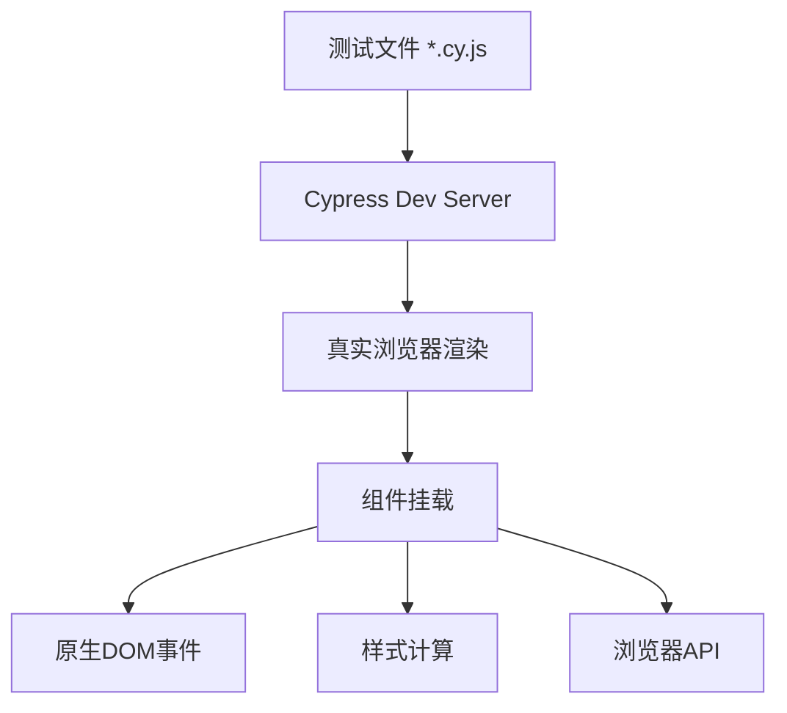

扫描[二维码](https://api2.cmdragon.cn/upload/cmder/20250304_012821924.jpg)关注或者微信搜一搜：`编程智域 前端至全栈交流与成长`

[发现1000+提升效率与开发的AI工具和实用程序](https://tools.cmdragon.cn/zh/apps?category=ai_chat)：https://tools.cmdragon.cn/


## 一、两个厨房做同一道菜：浏览器环境vs Node环境

你有没有想过，为什么同样的组件测试代码，换个运行环境就可能出现不同的结果？这背后其实藏着一个很有意思的道理——环境不同，结果就可能不同。

咱们打个比方：假设你要做一道宫保鸡丁。你有两个厨房可选——

**Node环境（Vitest）** 就像用电磁炉模拟炒菜。电磁炉加热快，几秒钟就能开火，一锅菜从下锅到出锅可能只要两三分钟，效率确实高。但问题是，电磁炉的火候和真正的大灶不一样，有些菜在电磁炉上炒出来味道就是差点意思——比如你模拟的"爆炒"，其实并没有经历真正的高温瞬间锁汁。

**浏览器环境（Cypress）** 就像用真正的灶台炒菜。你得先开火、等锅热、倒油、等油烟起来，这个准备时间比电磁炉长多了。但炒出来的菜，火候一模一样，味道和你在饭店吃到的没区别，因为这就是真实的烹饪过程。

Vue官方文档对此有明确的说明：Vitest和基于浏览器的运行器之间的主要区别，就是**速度和执行上下文**。

那"执行上下文"不同，到底会导致什么问题呢？基于浏览器的运行器能捕捉到Node运行器**无法捕捉**的几类问题：

- **样式问题**——你的按钮明明设了红色背景，但在jsdom里根本不会真正渲染，你也没法断言它的计算样式到底对不对
- **原生DOM事件**——模拟的click和用户真正在浏览器里点的click，事件对象的属性可能不一致
- **Cookies**——Node环境里没有真正的cookie机制，你得手动mock
- **本地存储**——localStorage、sessionStorage在Node里都不存在原生实现
- **网络故障**——浏览器的网络请求行为（CORS、重定向等）在Node环境中无法完整复现

当然，浏览器运行器也有明显的代价——它比Vitest**慢几个数量级**。一个在Vitest里50毫秒跑完的测试，在Cypress里可能要花2秒甚至更久。

所以结论很清晰：两种环境各有所长，关键在于你测试的到底是什么。如果是纯逻辑，电磁炉就够了；如果是真刀真枪的交互和渲染，还是得上真灶台。

## 二、Cypress组件测试的架构

很多同学对Cypress的印象还停留在"端到端测试工具"这个层面，其实Cypress早就进化了——它既支持E2E测试，也支持组件测试。这两种模式的区别在于：E2E测试需要启动整个应用服务器，模拟用户在浏览器中从头到尾走完一个流程；而组件测试只挂载单个组件，聚焦在组件本身的行为上。

在组件测试模式下，Cypress的工作方式是这样的：它会在一个真实的浏览器窗口中，单独挂载你要测试的Vue组件。你不需要启动整个应用服务器，Cypress自带的dev server会帮你处理组件的编译和挂载。

来看一下整个架构的流程：



简单解读一下这个流程图：

1. 你编写测试文件（比如`Stepper.cy.js`），告诉Cypress"我要测试这个组件"
2. Cypress的Dev Server接管编译工作——它会读取你的Vite配置，把Vue单文件组件编译成浏览器能执行的JavaScript
3. 编译后的代码被注入到一个真实的浏览器窗口中执行
4. 组件在浏览器中被挂载，此时它可以访问所有浏览器原生能力
5. 你可以触发真实的DOM事件、检查计算后的样式、访问localStorage等浏览器API

和Vitest最大的区别就在第3步——Vitest是在Node.js进程中用jsdom或happy-dom模拟一个DOM环境，而Cypress是真的打开一个Chrome浏览器，把组件放进去跑。

## 三、搭建Cypress组件测试环境

工欲善其事，必先利其器。要让Cypress跑起Vue组件测试，得先把环境搭好。

### 安装依赖

在你的Vue 3项目中，打开终端执行：

```bash
# 安装Cypress核心包 + Vue组件测试支持 + Vite开发服务器集成
npm install -D cypress @cypress/vue @cypress/vite-dev-server
```

这里解释一下每个包的作用：

- `cypress`：Cypress测试框架本体
- `@cypress/vue`：提供`cy.mount()`等Vue组件挂载命令
- `@cypress/vite-dev-server`：让Cypress组件测试使用Vite作为开发服务器，和你的项目构建配置保持一致

### 初始化Cypress

安装完依赖后，运行初始化命令：

```bash
npx cypress open
```

这个命令会打开Cypress的图形界面，首次运行时它会自动在项目根目录创建`cypress/`文件夹和基础配置文件。不过对于组件测试来说，我们还需要手动调整一些配置。

### 配置cypress.config.js

在项目根目录找到或创建`cypress.config.js`，写入以下内容：

```js
// cypress.config.js
const { defineConfig } from 'cypress'

export default defineConfig({
  // 组件测试专用配置
  component: {
    devServer: {
      // 指定框架为Vue
      framework: 'vue',
      // 指定构建工具为Vite（和项目保持一致）
      bundler: 'vite'
    }
  }
})
```

这段配置告诉Cypress：做组件测试的时候，用Vite来编译代码，用Vue来解析组件。这样一来，Cypress的编译行为就和你的开发环境完全一致了。

### 在cypress/support/component.js中引入Vue

Cypress需要在support文件中注册Vue的挂载逻辑。打开`cypress/support/component.js`（如果没有就创建），添加以下内容：

```js
// cypress/support/component.js
import { mount } from '@cypress/vue'

// 将mount命令注册到Cypress中，这样测试文件里就能用cy.mount()
Cypress.Commands.add('mount', mount)
```

这一步很关键——如果你忘了这行代码，后面在测试里调用`cy.mount()`的时候会报"cy.mount is not a function"的错误。

### 创建第一个组件测试文件

假设我们有一个简单的`Stepper.vue`组件，先来写第一个Cypress组件测试：

```js
// cypress/components/Stepper.cy.js
import Stepper from '../../src/components/Stepper.vue'

describe('Stepper', () => {
  it('renders the initial value', () => {
    cy.mount(Stepper)
    cy.get('[data-testid=stepper-value]').should('contain.text', '0')
  })
})
```

创建好测试文件后，运行`npx cypress open`，选择"Component Testing"，Cypress会自动发现你的测试文件。点击运行，你就能在浏览器中看到组件被真实渲染出来，测试结果也会实时显示。

## 四、在Cypress中写组件测试

环境搭好之后，咱们来深入学习Cypress组件测试的几个核心API。你会发现，Cypress的写法和Vitest + Vue Test Utils不太一样，它采用的是一种"链式调用"的风格。

### 核心API一览

| API | 作用 | 类比 |
|-----|------|------|
| `cy.mount()` | 挂载Vue组件到浏览器 | 相当于Vue Test Utils的`mount()` |
| `cy.get()` | 通过选择器查询DOM元素 | 相当于`wrapper.find()` |
| `cy.contains()` | 查找包含指定文本的元素 | 更直观的文本查找方式 |
| `.click()` | 触发点击事件 | 原生的浏览器点击，不是模拟的 |
| `.should()` | 断言 | 相当于`expect()` |
| `.type()` | 模拟键盘输入 | 原生的键盘事件 |

### 完整示例——测试Stepper组件

假设我们有这样一个Stepper组件：

```vue
<!-- src/components/Stepper.vue -->
<template>
  <div class="stepper">
    <button data-testid="decrement" @click="decrement">－</button>
    <span data-testid="stepper-value">{{ count }}</span>
    <button data-testid="increment" @click="increment">＋</button>
  </div>
</template>

<script setup>
import { ref } from 'vue'

// 接收max属性，限制最大值
const props = defineProps({
  max: {
    type: Number,
    default: Infinity
  }
})

const count = ref(0)

// 点击加号，不超过max值
function increment() {
  if (count.value < props.max) {
    count.value++
  }
}

// 点击减号，不低于0
function decrement() {
  if (count.value > 0) {
    count.value--
  }
}
</script>
```

对应的Cypress组件测试如下：

```js
// cypress/components/Stepper.cy.js
import Stepper from '../../src/components/Stepper.vue'

describe('Stepper', () => {
  it('increments on click', () => {
    // 挂载组件，传入props
    cy.mount(Stepper, {
      props: { max: 2 }
    })

    // 初始值应该是0
    cy.get('[data-testid=stepper-value]').should('contain.text', '0')

    // 点击加号，值变为1
    cy.get('[data-testid=increment]').click()
    cy.get('[data-testid=stepper-value]').should('contain.text', '1')

    // 再点击加号，值变为2
    cy.get('[data-testid=increment]').click()
    cy.get('[data-testid=stepper-value]').should('contain.text', '2')

    // 点击第三次，因为max为2，值应该保持2不变
    cy.get('[data-testid=increment]').click()
    cy.get('[data-testid=stepper-value]').should('contain.text', '2')
  })

  it('decrements on click', () => {
    // 不传max，使用默认值Infinity
    cy.mount(Stepper)

    // 初始值为0，点击减号不应该变成负数
    cy.get('[data-testid=decrement]').click()
    cy.get('[data-testid=stepper-value]').should('contain.text', '0')

    // 先加到1，再减回0
    cy.get('[data-testid=increment]').click()
    cy.get('[data-testid=stepper-value]').should('contain.text', '1')

    cy.get('[data-testid=decrement]').click()
    cy.get('[data-testid=stepper-value]').should('contain.text', '0')
  })
})
```

注意看几个关键点：

1. `cy.mount(Stepper, { props: { max: 2 } })`——挂载组件的同时传入props，和Vue Test Utils的写法很类似
2. `cy.get('[data-testid=stepper-value]')`——通过`data-testid`选择元素，这是Cypress官方推荐的做法
3. `.should('contain.text', '0')`——断言元素包含指定文本
4. `.click()`——触发的是真实的浏览器点击事件，不是jsdom里模拟的那种

另外，Cypress的链式调用还有一个特点——每一步都会自动等待。也就是说，你不需要像Vue Test Utils那样手动调`await nextTick()`，Cypress会自动等待DOM更新完成后再执行下一步操作。

## 五、Cypress组件测试的独特价值

到这一步你可能要问了：既然Vitest跑得那么快，我干嘛还要费劲搭Cypress？它到底有什么Vitest做不到的事情？

好问题。Cypress组件测试的独特价值，恰恰就藏在"浏览器环境"这四个字里。

### 1. 原生DOM事件——不是模拟的，是真实触发的

在Vitest + Vue Test Utils中，你调用`wrapper.trigger('click')`，底层其实是通过`simulateEvents`来模拟一个click事件。这个模拟事件和用户在浏览器中真正点击产生的事件对象，在某些属性上可能不一致——比如`event.isTrusted`，模拟事件永远是`false`，而真实用户触发的点击是`true`。

有些组件可能会根据`isTrusted`来区分用户操作和程序触发，这种差异在Vitest里根本测不出来。

Cypress的`.click()`是直接在浏览器中触发原生事件，和用户真实点击完全一致。

### 2. 样式验证——Node环境里做不到的事

在jsdom或happy-dom中，CSS根本不会真正计算。你给按钮设了`background-color: blue`，在jsdom里读取`getComputedStyle`返回的可能全是空值。但在Cypress中，样式是被浏览器真正计算过的，你可以断言任何计算样式：

```js
// 验证按钮的背景色确实是蓝色
cy.get('.btn-primary').should('have.css', 'background-color', 'rgb(29, 78, 216)')

// 验证元素确实不可见（display: none）
cy.get('.hidden-element').should('not.be.visible')

// 验证元素的宽度
cy.get('.sidebar').should('have.css', 'width', '240px')
```

这种样式断言在Vitest里是完全做不到的——jsdom压根不渲染样式。

### 3. 浏览器API可访问——Cookies、localStorage不需要mock

在Vitest中，如果你想测试一个依赖`localStorage`的组件，你必须先mock localStorage，测试完再清理mock。这不仅麻烦，而且mock的行为和真实浏览器的行为可能有细微差异。

Cypress直接跑在浏览器里，所有浏览器API都是原生可用的：

```js
// 直接操作真实的localStorage，不需要mock
cy.mount(LoginForm)
cy.get('[data-testid=username]').type('cmdragon')
cy.get('[data-testid=password]').type('123456')
cy.get('[data-testid=login-btn]').click()

// 验证token确实存入了localStorage
cy.window().then((win) => {
  expect(win.localStorage.getItem('token')).to.exist
})
```

### 4. 视觉调试——截图和视频回放

Cypress每次运行测试时都可以自动截图和录屏。当测试失败的时候，你可以直接看截图或者回放视频，定位问题比看终端日志直观多了。

Vitest的输出就是终端里的文字，遇到复杂问题你得自己脑补组件渲染后的样子。而Cypress给你一张图或者一段视频，一眼就能看出哪里不对。

## 六、Vitest组件测试 vs Cypress组件测试

说了这么多，咱们来做一个正面交锋的对比，让你一目了然地看清两种方案的差异：

| 维度 | Vitest + Vue Test Utils | Cypress组件测试 |
|------|------------------------|----------------|
| 运行环境 | Node.js（happy-dom/jsdom） | 真实浏览器 |
| 执行速度 | 极快（毫秒级） | 较慢（秒级） |
| DOM事件 | 模拟事件（simulateEvents） | 原生DOM事件 |
| 样式验证 | 不支持（CSS不会真正计算） | 完全支持 |
| 浏览器API | 需要mock（localStorage等） | 原生可用 |
| 调试方式 | 终端日志 | 可视化时间旅行 |
| CI运行 | 快速、轻量 | 需要浏览器环境 |
| 适用场景 | 逻辑测试为主 | 样式和交互为主 |

Vue官方给出的建议也很明确：**Vitest处理大多数组件测试，Cypress补充样式和原生事件测试**。

什么意思呢？就是说你日常的组件测试——测数据流转、测事件触发、测条件渲染——这些用Vitest就够了，速度快、效率高。但如果你要测"按钮hover后背景色是否变成蓝色"、"拖拽时鼠标事件是否正确触发"、"组件在真实浏览器中的布局是否正确"这类问题，就得请Cypress出马了。

一个比较合理的实践是：一个项目中，Vitest组件测试占80%，Cypress组件测试占20%。大部分逻辑用Vitest快速覆盖，少部分需要真实浏览器环境的场景用Cypress补充。这样既保证了测试速度，又不会遗漏浏览器环境才有的问题。

## 七、课后Quiz

**题目：Vitest组件测试和Cypress组件测试最大的运行环境区别是什么？这会导致哪些Vitest无法捕捉的问题？**

**答案解析：**

最大的运行环境区别在于：Vitest在Node.js环境中运行，使用happy-dom或jsdom来模拟DOM；而Cypress在真实的浏览器环境中运行，组件被真正渲染到Chrome等浏览器中。

这会导致Vitest无法捕捉以下几类问题：

1. **样式渲染问题**——jsdom不会真正计算CSS，你无法在Vitest中断言元素的计算样式（如颜色、尺寸、可见性）
2. **原生DOM事件差异**——Vitest使用`simulateEvents`模拟事件，与真实浏览器触发的原生事件在属性上可能有区别（如`isTrusted`字段），某些依赖原生事件属性的组件行为在Vitest中可能测不准
3. **浏览器API相关问题**——Cookies、localStorage、sessionStorage等在Node环境中需要mock，mock的行为和真实浏览器行为可能有细微差异

理解了这个核心区别，你就能在项目中合理选择两种测试工具了。

## 八、常见报错排查

### 报错1："Cypress could not find a plugin file"

**产生原因：** Cypress配置文件中指定的插件路径不存在，或者你手动创建了`cypress.config.js`但没有正确设置插件路径。

**解决办法：** 检查`cypress.config.js`中的`setupNodeEvents`等配置项，确认引用的文件路径确实存在。如果你用的是默认配置，可以先把自定义插件路径移除，让Cypress使用默认行为。

**预防建议：** 使用`npx cypress open`命令初始化时，让Cypress自动生成配置文件和目录结构，不要手动创建，避免路径写错。

### 报错2："Your component devServer config is missing"

**产生原因：** `cypress.config.js`中没有配置`component.devServer`字段，Cypress不知道该用什么方式编译你的组件。

**解决办法：** 在`cypress.config.js`中添加devServer配置：

```js
export default defineConfig({
  component: {
    devServer: {
      framework: 'vue',
      bundler: 'vite'
    }
  }
})
```

**预防建议：** 参照Cypress官方文档的Vue 3 + Vite模板配置来设置，不要遗漏关键字段。如果你用的是webpack而非Vite，就把`bundler`改为`'webpack'`。

### 报错3：组件挂载后样式与开发环境不一致

**产生原因：** Cypress的dev server没有正确处理CSS预处理器（如Sass、Less）或PostCSS配置。比如你的项目用了Tailwind CSS，但Cypress运行时Tailwind的配置没有生效，导致样式缺失。

**解决办法：** 首先确保`cypress/support/component-index.html`中引入了全局样式文件。其次检查`vite.config.js`中的CSS配置是否完整，Cypress会复用这个配置。如果有独立的CSS配置文件，确保它被Vite正确引用。

**预防建议：** 将CSS配置集中到`vite.config.js`中，让Cypress和开发环境共享同一套配置。避免在多个地方分散配置CSS预处理和PostCSS，减少不一致的可能性。

## 九、参考链接

参考链接：https://cn.vuejs.org/guide/scaling-up/testing.html


余下文章内容请点击跳转至 个人博客页面 或者 扫描[二维码](https://api2.cmdragon.cn/upload/cmder/20250304_012821924.jpg)关注或者微信搜一搜：`编程智域 前端至全栈交流与成长`，阅读完整的文章：[Vue 3测试入门第十章：Cypress组件测试——浏览器环境下的双重测试方案](https://blog.cmdragon.cn/posts/b2c3d4e5f6g7h8i9/)


REFERENCES
链接：https://tools.cmdragon.cn/
链接：https://blog.cmdragon.cn/
链接：https://linknest.cmdragon.cn/
链接：https://nopq.cn/
链接：https://magic-resume.cmdragon.cn/
