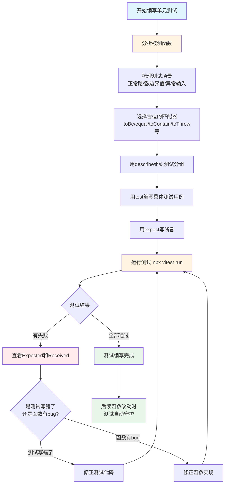

扫描[二维码](https://api2.cmdragon.cn/upload/cmder/20250304_012821924.jpg)关注或者微信搜一搜：`编程智域 前端至全栈交流与成长`

[发现1000+提升效率与开发的AI工具和实用程序](https://tools.cmdragon.cn/zh/apps?category=ai_chat)：https://tools.cmdragon.cn/


## 一、质检员检查产品：单元测试到底在干啥

想象一下工厂流水线上有个质检员。他不会等到产品装箱发货了才检查，而是每个零件生产出来就量一量尺寸、测一测性能。尺寸不对的返工，性能不达标的报废。这样等到产品组装完成时，每个零件都是靠谱的，整体出问题的概率就小很多。

单元测试就是你的"代码质检员"。它不关心整个应用跑起来什么样（那是E2E测试的活儿），它只关心每个最小的代码单元——一个函数、一个方法、一个组件——行为对不对。`sum(1, 2)`该返回`3`，就检查它是不是真返回`3`；`increment(5)`该变成`6`，就验证它是不是真变成了`6`。每个零件都测过了，组装起来心里才有底。

上一章咱们把测试环境搭好了，脚手架立起来了，这章就开始真正写测试代码。从单元测试的基本概念，到断言和匹配器，再到完整的increment函数实战，一步一步走完整个流程。

## 二、单元测试的基本概念：什么是"单元"

写单元测试之前，先搞清楚"单元"到底指啥。

### 2.1 什么算一个单元

在Vue 3项目里，"单元"通常指代码里最小的可测试片段。具体来说：

- 一个独立的函数，比如`sum(a, b)`、`formatDate(date)`
- 一个独立的类方法，比如`user.validate()`
- 一个Vue组件，比如`<Counter />`

单元测试的特点是"隔离"——测一个函数时，不依赖其他函数或外部环境（数据库、网络请求等）。如果函数内部依赖了别的东西，得用mock（模拟）把依赖替换掉，保证测试只验证这个函数本身的逻辑。

### 2.2 单元测试关注什么

单元测试关注的是"输入和输出的对应关系"。给定什么输入，期望什么输出。比如：

- 给`increment(5)`传5，期望返回6
- 给`formatPrice(null)`传null，期望返回"￥0.00"（边界值处理）
- 给`validateEmail('abc')`传非法邮箱，期望返回false（异常输入处理）

它不关心函数内部是怎么实现的——用for循环还是用map，用if还是三元运算符，无所谓。只要输入对、输出对，测试就通过。这种"黑盒测试"思路的好处是：你重构函数内部实现时，测试不会挂掉，因为外部行为没变。

## 三、测试三要素：describe、test、expect

Vitest的测试代码围绕三个核心API展开，搞懂它们你就掌握了写测试的基本套路。

### 3.1 describe：把相关测试分组

`describe`像个文件夹，把相关的测试用例归到一起。比如测一个用户管理模块，登录相关的测试放一组，注册相关的测试放一组，看着条理清晰。

```javascript
import { describe, test, expect } from 'vitest'
import { login, register } from './user.js'

// describe把登录相关的测试归为一组
describe('用户登录功能', () => {
  test('正确的账号密码应该登录成功', () => {
    // 测试逻辑
  })

  test('密码错误应该登录失败', () => {
    // 测试逻辑
  })
})

// 注册相关的测试归为另一组
describe('用户注册功能', () => {
  test('合法邮箱应该注册成功', () => {
    // 测试逻辑
  })
})
```

`describe`的第一个参数是分组名称，会显示在终端输出里，帮你快速定位哪块功能出了问题。第二个参数是回调函数，里面放属于这个分组的所有测试用例。

### 3.2 test：定义一个测试用例

`test`（也可以用别名`it`）定义一个具体的测试用例。每个`test`验证一个行为点。

```javascript
test('1 加 2 应该等于 3', () => {
  expect(sum(1, 2)).toBe(3)
})
```

`test`的第一个参数是测试描述，要写得清晰具体，说清楚"在什么情况下应该怎样"。`expect(sum(1, 2)).toBe(3)`这种描述就比`test('测试sum', ...)`好得多——光看名字就知道这个测试在验证啥，失败时也能立刻明白是哪个行为出了问题。

`test`和`it`功能完全一样，用哪个都行。`it`读起来更像自然语言："it should work"（它应该能工作），有些团队习惯用`it`让测试描述读起来更通顺。

### 3.3 expect：断言结果对不对

`expect`是断言的核心。它包装你得到的实际值，然后链式调用匹配器（matcher）来判断结果是否符合预期。

```javascript
// expect(实际值).匹配器(期望值)
expect(sum(1, 2)).toBe(3)       // 实际值 等于 期望值
expect(name).toBe('cmdragon')   // 实际值 等于 'cmdragon'
expect(list).toContain(3)       // 实际值（数组）包含 3
```

`expect`后面跟的匹配器决定了"怎么判断对不对"。`toBe`判断严格相等，`toContain`判断包含关系，`toBeTruthy`判断是否为真值……匹配器有很多，下一节详细讲。

## 四、常用匹配器详解：怎么判断结果对不对

匹配器是断言的"判断规则"。Vitest提供了几十种匹配器，常用的就那么十来个，记住这些够日常开发用了。

### 4.1 相等性匹配器

| 匹配器 | 作用 | 例子 |
|--------|------|------|
| `toBe` | 严格相等（用Object.is判断） | `expect(1 + 1).toBe(2)` |
| `toEqual` | 深度相等（递归比较对象内容） | `expect({a: 1}).toEqual({a: 1})` |
| `not` | 取反 | `expect(1).not.toBe(2)` |

`toBe`和`toEqual`的区别容易混淆，重点说一下。`toBe`比较的是"是不是同一个东西"——基本类型比较值，引用类型比较引用地址。`toEqual`比较的是"内容一不一样"——递归比较对象的所有属性值。

```javascript
// toBe：引用类型比较地址，两个不同的对象地址不同
const obj1 = { a: 1 }
const obj2 = { a: 1 }
expect(obj1).toBe(obj2)       // 失败！两个对象地址不同
expect(obj1).toEqual(obj2)   // 通过！内容一样

// toBe：基本类型比较值
expect(1).toBe(1)             // 通过
expect('hello').toBe('hello') // 通过
```

测对象、数组时用`toEqual`，测基本类型时用`toBe`，记住这个口诀就不会选错。

### 4.2 真假值匹配器

| 匹配器 | 作用 | 判断为真的情况 |
|--------|------|----------------|
| `toBeTruthy` | 判断是否为真值 | 非空字符串、非零数字、非null、非undefined、true |
| `toBeFalsy` | 判断是否为假值 | 空字符串、0、null、undefined、false、NaN |
| `toBeNull` | 判断是否为null | 仅null |
| `toBeUndefined` | 判断是否为undefined | 仅undefined |
| `toBeDefined` | 判断是否已定义 | 非undefined |

这些匹配器适合测"有没有值"的场景，不用关心具体值是多少。

```javascript
// 测一个查找函数，没找到时返回null
expect(findUser(-1)).toBeNull()

// 测一个初始化函数，调用后变量应该有值了
expect(config).toBeDefined()

// 测一个校验函数，非法输入应该返回假值
expect(validate('')).toBeFalsy()
```

### 4.3 数字大小匹配器

| 匹配器 | 作用 | 例子 |
|--------|------|------|
| `toBeGreaterThan` | 大于 | `expect(5).toBeGreaterThan(3)` |
| `toBeGreaterThanOrEqual` | 大于等于 | `expect(5).toBeGreaterThanOrEqual(5)` |
| `toBeLessThan` | 小于 | `expect(3).toBeLessThan(5)` |
| `toBeLessThanOrEqual` | 小于等于 | `expect(3).toBeLessThanOrEqual(3)` |
| `toBeCloseTo` | 近似相等（解决浮点数精度问题） | `expect(0.1 + 0.2).toBeCloseTo(0.3)` |

最后那个`toBeCloseTo`值得说道说道。JavaScript里`0.1 + 0.2`不等于`0.3`，而是等于`0.30000000000000004`（浮点数精度问题）。如果你写`expect(0.1 + 0.2).toBe(0.3)`，测试会失败。这时候用`toBeCloseTo`，它允许有微小的误差，专门处理浮点数比较。

```javascript
// 浮点数精度问题
expect(0.1 + 0.2).toBe(0.3)            // 失败！实际是0.30000000000000004
expect(0.1 + 0.2).toBeCloseTo(0.3)     // 通过！允许2位小数的误差
expect(0.1 + 0.2).toBeCloseTo(0.3, 5)  // 通过！指定5位小数精度
```

### 4.4 字符串和数组匹配器

| 匹配器 | 作用 | 例子 |
|--------|------|------|
| `toContain` | 数组包含某元素 / 字符串包含子串 | `expect([1,2,3]).toContain(2)` |
| `toMatch` | 字符串匹配正则表达式 | `expect('hello').toMatch(/^hel/)` |
| `toHaveLength` | 数组或字符串长度 | `expect('abc').toHaveLength(3)` |

```javascript
// 测数组包含
expect([1, 2, 3]).toContain(2)        // 通过
expect('hello world').toContain('wor') // 通过，字符串也行

// 测字符串匹配正则
expect('cmdragon@example.com').toMatch(/@/)  // 通过，包含@符号
expect('2026-07-06').toMatch(/^\d{4}-\d{2}-\d{2}$/)  // 通过，日期格式

// 测长度
expect([1, 2, 3]).toHaveLength(3)
expect('hello').toHaveLength(5)
```

### 4.5 异常匹配器

测一个函数该抛错时有没有抛错，用`toThrow`：

```javascript
// 测除零函数应该抛出错误
expect(() => divide(1, 0)).toThrow('除数不能为零')
expect(() => divide(1, 0)).toThrow(Error)  // 抛出Error类型
expect(() => divide(1, 0)).toThrow()       // 只要抛错就行
```

注意`toThrow`包装的是函数本身（`() => divide(1, 0)`），不是函数的返回值。因为如果直接调用`divide(1, 0)`，错误会在`expect`之前就抛出了，测试框架捕获不到。

## 五、increment函数完整实战

概念和匹配器都讲完了，现在用一个完整的例子把流程走一遍。Vue官方文档里用的就是`increment`函数这个例子，咱们也用它，保持跟官方一致。

### 5.1 编写被测函数

先写一个`increment`函数。这个函数模拟"计数器递增"的场景——当前值小于最大值时加1，达到最大值时不再增加。

在`src`目录下创建`helpers.js`：

```javascript
// src/helpers.js

/**
 * 计数器递增函数
 * 当前值小于最大值时加1，达到或超过最大值时保持不变
 * @param {number} current - 当前计数值
 * @param {number} max - 最大值，默认为10
 * @returns {number} 递增后的计数值
 */
export function increment(current, max = 10) {
  // 如果当前值还没到最大值，就加1
  if (current < max) {
    return current + 1
  }
  // 已经到最大值了，不再增加，原样返回
  return current
}
```

这个函数虽然简单，但涵盖了几个值得测的点：正常递增、边界值处理、默认参数。一个看似简单的函数，测试用例能写出好几个。

### 5.2 编写测试用例

在`helpers.js`旁边创建`helpers.spec.js`（这次用`.spec.`后缀，跟官方文档保持一致）：

```javascript
// src/helpers.spec.js

import { describe, test, expect } from 'vitest'
// 导入要测试的函数
import { increment } from './helpers.js'

// describe把increment相关的测试用例组织在一起
describe('increment', () => {
  // 测试用例1：正常递增场景
  test('当前值加1', () => {
    // 当前值是0，最大值是10，期望结果是1
    expect(increment(0, 10)).toBe(1)
  })

  // 测试用例2：边界值场景——达到最大值时不再递增
  test('达到最大值时不再递增', () => {
    // 当前值已经是10（等于最大值），期望结果还是10
    expect(increment(10, 10)).toBe(10)
  })

  // 测试用例3：默认参数场景——不传max时默认为10
  test('不传max时默认最大值为10', () => {
    // 只传current=10，不传max，期望结果还是10（默认max为10）
    expect(increment(10)).toBe(10)
  })
})
```

逐个用例解读一下设计思路：

**用例1：当前值加1**。这是最基础的"正常路径"测试——给一个常规输入（current=0, max=10），验证函数是否按预期递增。如果这个测试都过不了，说明函数核心逻辑有问题，其他测试也没必要跑了。

**用例2：达到最大值时不再递增**。这是"边界值"测试——输入正好等于最大值（current=10, max=10），验证函数是否会"卡住"不继续增加。边界值是bug高发区，比如把`<`写成`<=`，这个测试就能抓住。

**用例3：不传max时默认最大值为10**。这是"默认参数"测试——只传一个参数，验证默认值是否生效。如果有人不小心改了默认值（比如改成`max = 5`），这个测试会立刻报错。

三个测试用例覆盖了正常路径、边界值、默认参数三个维度，虽然不算穷尽，但抓住了关键场景。这就是单元测试的思路：不用测遍所有可能，但关键路径和边界值一定要覆盖到。

### 5.3 运行测试并解读结果

在终端跑测试：

```bash
npx vitest run src/helpers.spec.js
```

加了文件路径参数，Vitest只跑这一个测试文件。如果三个用例都通过，输出类似这样：

```
 ✓ src/helpers.spec.js (3)
   ✓ increment
     ✓ 当前值加1
     ✓ 达到最大值时不再递增
     ✓ 不传max时默认最大值为10

 Test Files  1 passed (1)
      Tests  3 passed (3)
   Duration  285ms
```

注意输出的层级结构：

- 第一层`✓ src/helpers.spec.js (3)`：这个文件里共3个测试用例，全通过。
- 第二层`✓ increment`：`describe`分组的名称。
- 第三层三个`✓`：每个`test`用例的名称，全通过。
- 底部`Tests 3 passed (3)`：3个测试用例全部通过。

如果某个用例失败了，比如故意把函数里的`<`改成`<=`（让边界值判断出错），输出会变成：

```
 ❯ src/helpers.spec.js (3)
   ✓ increment
     ✓ 当前值加1
     × 达到最大值时不再递增
       expected 10 to be 11  // Object.is equality
       Expected: 10
       Received: 11
     ✓ 不传max时默认最大值为10

 ⎯⎯⎯ Failed Tests 1 ⎯⎯⎯

 FAIL  src/helpers.spec.js
 ❯ increment > 达到最大值时不再递增
   expected 10 to be 11
   Expected: 10
   Received: 11

 Test Files  1 failed (1)
      Tests  1 failed | 2 passed (3)
```

关键信息在失败那个用例下面：

- `Expected: 10`：期望返回10（不再递增）。
- `Received: 11`：实际返回了11（还是递增了）。

看到这俩值，你立刻就知道：`increment(10, 10)`返回了11而不是10，说明`current < max`这个条件判断有问题。把`<=`改回`<`，测试就通过了。这就是单元测试的价值——精确定位哪个行为出了问题，期望和实际差在哪。

## 六、测试组织技巧：让测试代码更整洁

测试用例多了之后，组织方式会影响代码的可读性和维护性。这儿介绍两个常用技巧。

### 6.1 describe嵌套

`describe`可以嵌套，形成层级结构。测一个复杂函数时，可以按场景分组：

```javascript
describe('increment', () => {
  // 正常递增场景
  describe('正常递增', () => {
    test('0递增到1', () => {
      expect(increment(0, 10)).toBe(1)
    })

    test('5递增到6', () => {
      expect(increment(5, 10)).toBe(6)
    })
  })

  // 边界值场景
  describe('边界值处理', () => {
    test('达到最大值不递增', () => {
      expect(increment(10, 10)).toBe(10)
    })

    test('超过最大值不递增', () => {
      expect(increment(15, 10)).toBe(15)
    })
  })

  // 默认参数场景
  describe('默认参数', () => {
    test('不传max时默认为10', () => {
      expect(increment(10)).toBe(10)
    })
  })
})
```

终端输出会体现这个层级：

```
 ✓ increment
   ✓ 正常递增
     ✓ 0递增到1
     ✓ 5递增到6
   ✓ 边界值处理
     ✓ 达到最大值不递增
     ✓ 超过最大值不递增
   ✓ 默认参数
     ✓ 不传max时默认为10
```

层级清晰，一看就知道每个测试在验证哪个场景。测试用例多了之后，这种组织方式比一坨`test`平铺在一起好维护得多。

### 6.2 beforeEach和afterEach

有些测试用例跑之前需要"准备工作"——初始化数据、设置mock等。每个`test`里都写一遍太啰嗦，用`beforeEach`统一处理：

```javascript
import { describe, test, expect, beforeEach, afterEach } from 'vitest'

describe('用户列表管理', () => {
  // 每个test之前都会执行，用来做准备工作
  beforeEach(() => {
    // 比如初始化一个空的用户列表
    // 这里用全局变量模拟，实际项目里可能操作数据库或store
    userList = []
  })

  // 每个test之后都会执行，用来做清理工作
  afterEach(() => {
    // 清理测试产生的副作用
    // 比如重置mock、清除定时器等
    userList = null
  })

  test('添加用户后列表长度应该加1', () => {
    // beforeEach已经初始化了userList，这里直接用
    userList.push({ id: 1, name: '张三' })
    expect(userList).toHaveLength(1)
  })

  test('空列表长度应该是0', () => {
    // 每个test都有独立的userList，上个test的添加不影响这个test
    expect(userList).toHaveLength(0)
  })
})
```

`beforeEach`在每个`test`执行前自动运行一次，`afterEach`在每个`test`执行后自动运行一次。它们保证每个测试用例都有干净、独立的初始环境，不会互相干扰。这种"测试隔离"很重要——如果测试之间互相依赖，一个挂了可能连累一串，排查起来特别痛苦。

除了`beforeEach`和`afterEach`，还有`beforeAll`和`afterAll`，分别在整个`describe`块开始前和结束后执行一次（而不是每个test前后）。适合做一次性的重活，比如连接测试数据库、启动测试服务器等。

## 七、单元测试编写流程图

把编写单元测试的完整流程画出来，照着走不容易遗漏步骤：



这个流程图里有个关键分支：测试失败时，要判断是测试代码写错了还是函数实现有bug。两种情况处理方式不同——测试写错了改测试，函数有bug改函数。别一看到测试失败就条件反射地去改函数，有时候是测试本身的期望值写错了。

## 课后 Quiz

**问题1：`toBe`和`toEqual`有什么区别？什么时候该用哪个？**

答案解析：`toBe`用`Object.is`判断严格相等，对引用类型比较的是引用地址（是不是同一个对象）；`toEqual`递归比较对象的所有属性值（内容一不一样）。测基本类型（数字、字符串、布尔值）用`toBe`，因为它更严格、性能更好。测对象和数组用`toEqual`，因为你关心的是内容对不对，不是引用地址。比如`expect({a: 1}).toBe({a: 1})`会失败（两个对象地址不同），但`expect({a: 1}).toEqual({a: 1})`会通过（内容一样）。记住口诀：基本类型用toBe，对象数组用toEqual。

**问题2：测一个该抛错的函数时，为什么要把函数包在箭头函数里传给expect？**

答案解析：因为如果直接调用函数，错误会在`expect`执行之前就抛出了，测试框架捕获不到，整个测试直接崩溃。把函数包在箭头函数里（`() => divide(1, 0)`），传给`expect`的是函数本身而不是函数的执行结果，`expect`会在自己的try-check里执行这个函数，从而捕获到错误并判断是否符合预期。正确写法是`expect(() => divide(1, 0)).toThrow()`，不能写成`expect(divide(1, 0)).toThrow()`——后者在`expect`拿到值之前`divide`就已经抛错了。

**问题3：`beforeEach`和`beforeAll`有什么区别？什么时候该用哪个？**

答案解析：`beforeEach`在每个测试用例执行前都会运行一次，`beforeAll`在整个`describe`块开始前只运行一次。如果每个测试用例都需要独立的初始环境（比如重置数据、清除mock），用`beforeEach`，保证测试之间互不干扰。如果初始化操作很重且只需要做一次（比如连接数据库、启动服务器），用`beforeAll`省时间。原则是：能保证测试隔离性的前提下尽量用`beforeAll`提升性能，但如果初始化状态会被测试用例修改，必须用`beforeEach`让每个用例都有干净的环境。宁可慢一点也别让测试互相影响，否则排查问题会让你怀疑人生。

## 常见报错解决方案

### 报错1：AssertionError: expected 3 to be 5

**产生原因：** 这是最常见的断言失败报错。`expected`后面是期望值，`to be`后面是实际值（或者反过来，具体看匹配器）。出现这个报错说明函数返回的结果跟你期望的不一样。可能是函数实现有bug，也可能是测试的期望值写错了。

**解决方案：** 先看报错信息里的`Expected`和`Received`两个值：

- `Expected: 3`：你期望的结果是3。
- `Received: 5`：实际得到的结果是5。

然后判断是哪边的问题：

1. 如果函数逻辑应该返回3但返回了5，说明函数有bug，去检查函数实现。
2. 如果函数返回5是对的，是你期望值写错了，改成`expect(result).toBe(5)`。

举个实际的例子。你测`increment(5, 10)`，期望返回6，但函数里把`+`写成了`-`，返回了4。报错会显示`Expected: 6, Received: 4`。看到这俩值你就知道函数算错了，去检查实现代码。

**预防建议：** 写测试时先明确"这个函数在这个输入下应该返回什么"，再写断言。别凭感觉写期望值，否则可能把函数的bug当成"正确行为"写进测试里，测试通过了但bug还在。如果不确定期望值，先手动调用函数看看返回啥，再决定这个返回值对不对。

### 报错2：SyntaxError: The requested module does not provide an export named 'increment'

**产生原因：** 导入导出不匹配。测试文件里写`import { increment } from './helpers.js'`，但`helpers.js`里没有导出名为`increment`的东西。可能是导出名写错了（比如实际导出的是`incrementCount`），或者`helpers.js`里用的是默认导出（`export default`）而不是命名导出（`export`）。

**解决方案：** 检查被测文件的导出方式：

```javascript
// 命名导出——导入时要用花括号
// helpers.js
export function increment(current, max = 10) { ... }

// 测试文件
import { increment } from './helpers.js'  // 正确

// 默认导出——导入时不用花括号
// helpers.js
export default function increment(current, max = 10) { ... }

// 测试文件
import increment from './helpers.js'  // 正确，不用花括号
import { increment } from './helpers.js'  // 错误！默认导出不能用花括号
```

确认导出和导入方式匹配。如果是改名了，用`as`关键字起别名：

```javascript
// helpers.js导出的是incrementCount
export function incrementCount(current, max = 10) { ... }

// 测试文件里想叫increment
import { incrementCount as increment } from './helpers.js'
```

**预防建议：** 统一用命名导出，团队约定好导出名跟函数名一致。命名导出比默认导出更安全——重命名时编辑器能帮你检查所有引用点，默认导出改名了编译器不一定报错。写测试前先确认被测文件的导出方式，避免导入方式写错。

### 报错3：TypeError: increment is not a function

**产生原因：** 你导入的东西不是个函数。可能是导入路径写错了，导入了一个不存在的模块；或者被测文件里`increment`是个变量而不是函数；或者导入时解构方式不对，拿到了`undefined`。

**解决方案：** 一步步排查：

```javascript
// 先打印看看导入的是啥
import * as Helpers from './helpers.js'
console.log(Helpers)  // 看看模块里到底导出了啥
console.log(typeof Helpers.increment)  // 看看increment的类型

// 如果输出undefined，说明导出名不对或路径不对
```

常见情况：

1. 路径写错：`./helpers.js`写成了`./helper.js`（少了个s），检查文件名。
2. 导出名写错：实际导出的是`increment`，导入时写成了`increament`（多了个a），检查拼写。
3. 扩展名问题：有些项目配置了省略扩展名，有些没配置。如果不确定，加上`.js`后缀最保险。

```javascript
// 最稳妥的写法：路径和名字都写全
import { increment } from './helpers.js'
```

**预防建议：** 用VS Code的自动导入功能（输入函数名时按Tab键自动补全import语句），避免手写拼写错误。TypeScript项目里开启类型检查，导入不存在的导出会立刻报红，不用等到跑测试才发现。文件命名要规范，`helpers.js`就别写成`helper.js`，单复数统一。

## 参考链接

- https://cn.vitest.dev/guide/
- https://vitest.dev/api/
- https://vuejs.org/guide/scaling-up/testing.html
- https://vitest.dev/guide/migration.html

余下文章内容请点击跳转至 个人博客页面 或者 扫描[二维码](https://api2.cmdragon.cn/upload/cmder/20250304_012821924.jpg)关注或者微信搜一搜：`编程智域 前端至全栈交流与成长`，阅读完整的文章：[Vue 3测试入门第四章：单元测试怎么写？断言、匹配器与increment函数实战](https://blog.cmdragon.cn/posts/9f1c5a3e7b2d4f80/)


<details>
<summary>往期文章归档</summary>

- [Vue 3 静态与动态 Props 如何传递？TypeScript 类型约束有何必要？](https://blog.cmdragon.cn/posts/94ab48753b64780ca3ab7a7115ae8522/)
- [Vue 3中组件局部注册的优势与实现方式如何？](https://blog.cmdragon.cn/posts/dbf576e744870f6de26fd8a2e03e47da/)
- [如何在Vue3中优化生命周期钩子性能并规避常见陷阱？](https://blog.cmdragon.cn/posts/12d98b3b9ccd6c19a1b169d720ac5c80/)
- [Vue 3 Composition API生命周期钩子：如何实现从基础理解到高阶复用？](https://blog.cmdragon.cn/posts/8884e2b70287fcb263c57648eeb27419/)
- [Vue 3生命周期钩子实战指南：如何正确选择onMounted、onUpdated与onUnmounted的应用场景？](https://blog.cmdragon.cn/posts/883c6dbc50ae4183770a4462e0b8ae4d/)
- [Vue 3中生命周期钩子与响应式系统如何实现协同工作？](https://blog.cmdragon.cn/posts/70dad360ffa9dce14d0d69611b8cb019/)
- [Vue 3组件生命周期钩子的执行顺序与使用场景是什么？](https://blog.cmdragon.cn/posts/db44294a78dc9f666f67b053f6c83567/)
- [Vue组件全局注册与局部注册如何抉择？](https://blog.cmdragon.cn/posts/43ead630ea17da65d99ad2eb8188e472/)
- [Vue3组件化开发中，Props与Emits如何实现数据流转与事件协作？](https://blog.cmdragon.cn/posts/8cff7d2df113da66ea7be560c4d1d22a/)
- [Vue 3模板引用如何与其他特性协同实现复杂交互？](https://blog.cmdragon.cn/posts/331bf75d114ab09116eadfcdca602b58/)
- [Vue 3 v-for中模板引用如何实现高效管理与动态控制？](https://blog.cmdragon.cn/posts/cb380897ddc3578b180ecf8843c774c1/)
- [Vue 3的defineExpose：如何突破script setup组件默认封装，实现精准的父子通讯？](https://blog.cmdragon.cn/posts/202ae0f4acde7128e0e31baf63732fb5/)
- [Vue 3模板引用的生命周期时机如何把握？常见陷阱该如何避免？](https://blog.cmdragon.cn/posts/7d2a0f6555ecbe92afd7d2491c427463/)
- [Vue 3模板引用如何实现父组件与子组件的高效交互？](https://blog.cmdragon.cn/posts/3fb7bdd84128b7efaaa1c979e1f28dee/)
- [Vue中为何需要模板引用？又如何高效实现DOM与组件实例的直接访问？](https://blog.cmdragon.cn/posts/23f3464ba16c7054b4783cded50c04c6/)
- [Vue 3 watch与watchEffect如何区分使用？常见陷阱与性能优化技巧有哪些？](https://blog.cmdragon.cn/posts/68a26cc0023e4994a6bc54fb767365c8/)
- [Vue3侦听器实战：组件与Pinia状态监听如何高效应用？](https://blog.cmdragon.cn/posts/fd4695f668d64332dda9962c24214f32/)
- [Vue 3中何时用watch，何时用watchEffect？核心区别及性能优化策略是什么？](https://blog.cmdragon.cn/posts/cdbbb1837f8c093252e61f46dbf0a2e7/)
- [Vue 3中如何有效管理侦听器的暂停、恢复与副作用清理？](https://blog.cmdragon.cn/posts/09551ab614c463a6d6ca69818e8c2d52/)
- [Vue 3 watchEffect：如何实现响应式依赖的自动追踪与副作用管理？](https://blog.cmdragon.cn/posts/b7bca5d20f628ac09f7192ad935ef664/)
- [Vue 3 watch如何利用immediate、once、deep选项实现初始化、一次性与深度监听？](https://blog.cmdragon.cn/posts/2c6cdb100a20f10c7e7d4413617c7ea9/)
- [Vue 3中watch如何高效监听多数据源、计算结果与数组变化？](https://blog.cmdragon.cn/posts/757a1728bc1b9c0c8b317b0354d85568/)
- [Vue 3中watch监听ref和reactive的核心差异与注意事项是什么？](https://blog.cmdragon.cn/posts/8e70552f0f61e0dc8c7f567a2d272345/)
- [Vue3中Watch与watchEffect的核心差异及适用场景是什么？](https://blog.cmdragon.cn/posts/dde70ab90dc5062c435e0501f5a6e7cb/)
- [Vue 3自定义指令如何赋能表单自动聚焦与防抖输入的高效实现？](https://blog.cmdragon.cn/posts/1f5ed5047850ed52c0fd0386f76bd4ae/)
- [Vue3中如何优雅实现支持多绑定变量和修饰符的双向绑定组件？](https://blog.cmdragon.cn/posts/e3d4e128815ad731611b8ef29e37616b/)
- [Vue 3表单验证如何从基础规则到异步交互构建完整验证体系？](https://blog.cmdragon.cn/posts/7d1caedd822f70542aa0eed67e30963b/)
- [Vue3响应式系统如何支撑表单数据的集中管理、动态扩展与实时计算？](https://blog.cmdragon.cn/posts/3687a5437ab56cb082b5b813d5577a40/)
- [Vue3跨组件通信中，全局事件总线与provide/inject该如何正确选择？](https://blog.cmdragon.cn/posts/ad67c4eb6d76cf7707bdfe6a8146c34f/)
- [Vue3表单事件处理：v-model如何实现数据绑定、验证与提交？](https://blog.cmdragon.cn/posts/1c1e80d697cca0923f29ec70ebb8ccd1/)
- [Vue应用如何基于DOM事件传播机制与事件修饰符实现高效事件处理？](https://blog.cmdragon.cn/posts/b990828143d70aa87f9aa52e16692e48/)
- [Vue3中如何在调用事件处理函数时同时传递自定义参数和原生DOM事件？参数顺序有哪些注意事项？](https://blog.cmdragon.cn/posts/b44316e0866e9f2e6aef927dbcf5152b/)
- [从捕获到冒泡：Vue事件修饰符如何重塑事件执行顺序？](https://blog.cmdragon.cn/posts/021636c2a06f5e2d3d01977a12ddf559/)
- [Vue事件处理：内联还是方法事件处理器，该如何抉择？](https://blog.cmdragon.cn/posts/b3cddf7023ab537e623a61bc01dab6bb/)
- [Vue事件绑定中v-on与@语法如何取舍？参数传递与原生事件处理有哪些实战技巧？](https://blog.cmdragon.cn/posts/bd4d9607ce1bc34cc3bda0a1a46c40f6/)
- [Vue 3中列表排序时为何必须复制数组而非直接修改原始数据？](https://blog.cmdragon.cn/posts/a5f2bacb74476fd7f5e02bb3f1ba6b2b/)
- [Vue虚拟滚动如何将列表DOM数量从万级降至十位数？](https://blog.cmdragon.cn/posts/d3b06b57fb7f126787e6ed22dce1e341/)
- [Vue3中v-if与v-for直接混用为何会报错？计算属性如何解决优先级冲突？](https://blog.cmdragon.cn/posts/3100cc5a2e16f8dac36f722594e6af32/)
- [为何在Vue3递归组件中必须用v-if判断子项存在？](https://blog.cmdragon.cn/posts/455dc2d47c38d12c1cf350e490041e8b/)
- [Vue3列表渲染中，如何用数组方法与计算属性优化v-for的数据处理？](https://blog.cmdragon.cn/posts/3f842bbd7ba0f9c91151b983bf784c8b/)
- [Vue v-for的key：为什么它能解决列表渲染中的“玄学错误”？选错会有哪些后果？](https://blog.cmdragon.cn/posts/1eb3ffac668a743843b5ea1738301d40/)
- [Vue3中v-for与v-if为何不能直接共存于同一元素？](https://blog.cmdragon.cn/posts/138b13c5341f6a1fa9015400433a3611/)
- [Vue3中v-if与v-show的本质区别及动态组件状态保持的关键策略是什么？](https://blog.cmdragon.cn/posts/0242a94dc552b93a1bc335ac4fc33db5/)
 - [Vue3中v-show如何通过CSS修改display属性控制条件显示？与v-if的应用场景该如何区分？](https://blog.cmdragon.cn/posts/97c66a18ae0e9b57c6a69b8b3a41ddf6/)
- [Vue3条件渲染中v-if系列指令如何合理使用与规避错误？](https://blog.cmdragon.cn/posts/8a1ddfac64b25062ac56403e4c1201d2/)
- [Vue3动态样式控制：ref、reactive、watch与computed的应用场景与区别是什么？](https://blog.cmdragon.cn/posts/218c3a59282c3b757447ee08a01937bb/)
- [Vue3中动态样式数组的后项覆盖规则如何与计算属性结合实现复杂状态样式管理？](https://blog.cmdragon.cn/posts/1bab953e41f66ac53de099fa9fe76483/)
- [Vue浅响应式如何解决深层响应式的性能问题？适用场景有哪些？ - cmdragon's Blog](https://blog.cmdragon.cn/posts/c85e1fe16a7ae45e965b4e2df4d9d2f4/)
- [Vue 3组合式API中ref与reactive的核心响应式差异及使用最佳实践是什么？ - cmdragon's Blog](https://blog.cmdragon.cn/posts/be04b02d2723994632de0d4ca22a3391/)
- [Vue 3组合式API中ref与reactive的核心响应式差异及使用最佳实践是什么？ - cmdragon's Blog](https://blog.cmdragon.cn/posts/be04b02d2723994632de0d4ca22a3391/)
- [Vue3响应式系统中，对象新增属性、数组改索引、原始值代理的问题如何解决？ - cmdragon's Blog](https://blog.cmdragon.cn/posts/a0af08dd60a37b9a890a9957f2cbfc9f/)
- [Vue 3中watch侦听器的正确使用姿势你掌握了吗？深度监听、与watchEffect的差异及常见报错解析 - cmdragon's Blog](https://blog.cmdragon.cn/posts/bc287e1e36287afd90750fd907eca85e/)
- [Vue响应式声明的API差异、底层原理与常见陷阱你都搞懂了吗 - cmdragon's Blog](https://blog.cmdragon.cn/posts/654b9447ef1ba7ec1126a1bc26a4726d/)
- [Vue响应式声明的API差异、底层原理与常见陷阱你都搞懂了吗 - cmdragon's Blog](https://blog.cmdragon.cn/posts/654b9447ef1ba7ec1126a1bc26a4726d/)
- [为什么Vue 3需要ref函数？它的响应式原理与正确用法是什么？ - cmdragon's Blog](https://blog.cmdragon.cn/posts/c405a8d9950af5b7c63b56c348ac36b6/)
- [Vue 3中reactive函数如何通过Proxy实现响应式？使用时要避开哪些误区？ - cmdragon's Blog](https://blog.cmdragon.cn/posts/a7e9abb9691a81e4404d9facabe0f7c3/)
- [Vue3响应式系统的底层原理与实践要点你真的懂吗？ - cmdragon's Blog](https://blog.cmdragon.cn/posts/bd995ea45161727597fb85b62566c43d/)
- [Vue 3模板如何通过编译三阶段实现从声明式语法到高效渲染的跨越 - cmdragon's Blog](https://blog.cmdragon.cn/posts/53e3f270a80675df662c6857a3332c0f/)
- [快速入门Vue模板引用：从收DOM“快递”到调子组件方法，你玩明白了吗？ - cmdragon's Blog](https://blog.cmdragon.cn/posts/ddbce4f2a23aa72c96b1c0473900321e/)
- [快速入门Vue模板里的JS表达式有啥不能碰？计算属性为啥比方法更能打？ - cmdragon's Blog](https://blog.cmdragon.cn/posts/23a2d5a334e15575277814c16e45df50/)
- [快速入门Vue的v-model表单绑定：语法糖、动态值、修饰符的小技巧你都掌握了吗？ - cmdragon's Blog](https://blog.cmdragon.cn/posts/6be38de6382e31d282659b689c5b17f0/)
- [快速入门Vue3事件处理的挑战题：v-on、修饰符、自定义事件你能通关吗？ - cmdragon's Blog](https://blog.cmdragon.cn/posts/60ce517684f4a418f453d66aa805606c/)
- [快速入门Vue3的v-指令：数据和DOM的“翻译官”到底有多少本事？ - cmdragon's Blog](https://blog.cmdragon.cn/posts/e4ae7d5e4a9205bb11b2baccb230c637/)
- [快速入门Vue3，插值、动态绑定和避坑技巧你都搞懂了吗？ - cmdragon's Blog](https://blog.cmdragon.cn/posts/999ce4fb32259ff4fbf4bf7bcb851654/)
- [想让PostgreSQL快到飞起？先找健康密码还是先换引擎？ - cmdragon's Blog](https://blog.cmdragon.cn/posts/a6997d81b49cd232b87e1cf603888ad1/)
- [想让PostgreSQL查询快到飞起？分区表、物化视图、并行查询这三招灵不灵？ - cmdragon's Blog](https://blog.cmdragon.cn/posts/1fee7afbb9abd4540b8aa9c141d6845d/)
- [子查询总拖慢查询？把它变成连接就能解决？ - cmdragon's Blog](https://blog.cmdragon.cn/posts/79c590fbd87ece535b11a71c9667884f/)
- [PostgreSQL全表扫描慢到崩溃？建索引+改查询+更统计信息三招能破？ - cmdragon's Blog](https://blog.cmdragon.cn/posts/748cdac2536008199abf8a8a2cd0ec85/)
- [复杂查询总拖后腿？PostgreSQL多列索引+覆盖索引的神仙技巧你get没？ - cmdragon's Blog](https://blog.cmdragon.cn/posts/32ca943703226d317d4276a8fb53b0dd/)
- [只给表子集建索引？用函数结果建索引？PostgreSQL这俩操作凭啥能省空间又加速？ - cmdragon's Blog](https://blog.cmdragon.cn/posts/ca93f1d53aa910e7ba5ffd8df611c12b/)
- [B-tree索引像字典查词一样工作？那哪些数据库查询它能加速，哪些不能？ - cmdragon's Blog](https://blog.cmdragon.cn/posts/f507856ebfddd592448813c510a53669/)
- [想抓PostgreSQL里的慢SQL？pg_stat_statements基础黑匣子和pg_stat_monitor时间窗，谁能帮你更准揪出性能小偷？ - cmdragon's Blog](https://blog.cmdragon.cn/posts/b2213bfcb5b88a862f2138404c03d596/)
- [PostgreSQL的“时光机”MVCC和锁机制是怎么搞定高并发的？ - cmdragon's Blog](https://blog.cmdragon.cn/posts/26614eb7da6c476dde41d367ad888d2f/)
- [PostgreSQL性能暴涨的关键？内存IO并发参数居然要这么设置？ - cmdragon's Blog](https://blog.cmdragon.cn/posts/69f99bc6972a860d559c74aad7280da4/)
- [大表查询慢到翻遍整个书架？PostgreSQL分区表教你怎么“分类”才高效](https://blog.cmdragon.cn/posts/7b7053f392147a8b3b1a16bebeb08d0a/)
- [PostgreSQL 查询慢？是不是忘了优化 GROUP BY、ORDER BY 和窗口函数？ - cmdragon's Blog](https://blog.cmdragon.cn/posts/c856e3cb073822349f3bf2d29995dcfc/)
- [PostgreSQL里的子查询和CTE居然在性能上“掐架”？到底该站哪边？ - cmdragon's Blog](https://blog.cmdragon.cn/posts/c096347d18e67b7431faacd2c4757093/)
- [PostgreSQL选Join策略有啥小九九？Nested Loop/Merge/Hash谁是它的菜？ - cmdragon's Blog](https://blog.cmdragon.cn/posts/2eca89463454fd4250d7b66243b9fe5a/)
- [PostgreSQL新手SQL总翻车？这7个性能陷阱你踩过没？ - cmdragon's Blog](https://blog.cmdragon.cn/posts/068ecb772a87d7df20a8c9fb4b233f8e/)
- [PostgreSQL索引选B-Tree还是GiST？“瑞士军刀”和“多面手”的差别你居然还不知道？ - cmdragon's Blog](https://blog.cmdragon.cn/posts/d498f63cd0a2d5a77e445c688a8b88db/)
- [想知道数据库怎么给查询“算成本选路线”？EXPLAIN能帮你看明白？ - cmdragon's Blog](https://blog.cmdragon.cn/posts/9101b75bdec6faea9b35d54f14e37f36/)
- [PostgreSQL处理SQL居然像做蛋糕？解析到执行的4步里藏着多少查询优化的小心机？ - cmdragon's Blog](https://blog.cmdragon.cn/posts/d527f8ebb6e3dae2c7dfe4c8d8979444/)
- [PostgreSQL备份不是复制文件？物理vs逻辑咋选？误删还能精准恢复到1分钟前？ - cmdragon's Blog](https://blog.cmdragon.cn/posts/6bfdae84f313cf7ad0bb7045c4392347/)
- [转账不翻车、并发不干扰，PostgreSQL的ACID特性到底有啥魔法？ - cmdragon's Blog](https://blog.cmdragon.cn/posts/de3672803de34dbad244d0a8d48b0eb5/)
- [银行转账不白扣钱、电商下单不超卖，PostgreSQL事务的诀窍是啥？ - cmdragon's Blog](https://blog.cmdragon.cn/posts/e463e8a2668abdf00a228c9b79324ded/)
- [PostgreSQL里的PL/pgSQL到底是啥？能让SQL从“说目标”变“讲步骤”？ - cmdragon's Blog](https://blog.cmdragon.cn/posts/5c967e595058c4a1fc4474a68e64031d/)
- [PostgreSQL视图不存数据？那它怎么简化查询还能递归生成序列和控制权限？ - cmdragon's Blog](https://blog.cmdragon.cn/posts/325047855e3e23b5ef82f7d2db134fbd/)
- [PostgreSQL索引这么玩，才能让你的查询真的“飞”起来？ - cmdragon's Blog](https://blog.cmdragon.cn/posts/d2dba50bb6e4df7b27e735245a06a2a2/)
- [PostgreSQL的表关系和约束，咋帮你搞定用户订单不混乱、学生选课不重复？ - cmdragon's Blog](https://blog.cmdragon.cn/posts/849ae5bab0f8c66e94c2f6ad1bb798e3/)
- [PostgreSQL查询的筛子、排序、聚合、分组？你会用它们搞定数据吗？ - cmdragon's Blog](https://blog.cmdragon.cn/posts/ef4800975ffa84f1ca51976a70a1585b/)
- [PostgreSQL数据类型怎么选才高效不踩坑？ - cmdragon's Blog](https://blog.cmdragon.cn/posts/bf54711525c507c5eacfa7b0151c39d2/)
- [想解锁PostgreSQL查询从基础到进阶的核心知识点？你都get了吗？ - cmdragon's Blog](https://blog.cmdragon.cn/posts/887809b3e0375f5956873cd442f516d8/)
- [PostgreSQL DELETE居然有这些操作？返回数据、连表删你试过没？ - cmdragon's Blog](https://blog.cmdragon.cn/posts/934be1203725e8be9d6f6e9104e5abcc/)
- [PostgreSQL UPDATE语句怎么玩？从改邮箱到批量更新的避坑技巧你都会吗？ - cmdragon's Blog](https://blog.cmdragon.cn/posts/0f0622e9b7402b599e618150d0596ffe/)
- [PostgreSQL插入数据还在逐条敲？批量、冲突处理、返回自增ID的技巧你会吗？ - cmdragon's Blog](https://blog.cmdragon.cn/posts/0e3bf7efc030b024ea67ee855a00f2de/)
- [PostgreSQL的“仓库-房间-货架”游戏，你能建出电商数据库和表吗？ - cmdragon's Blog](https://blog.cmdragon.cn/posts/b6cd3c86da6aac26ed829e472d34078e/)
- [PostgreSQL 17安装总翻车？Windows/macOS/Linux避坑指南帮你搞定？ - cmdragon's Blog](https://blog.cmdragon.cn/posts/ba1f545a3410144552fbdbfcf31b5265/)
- [能当关系型数据库还能玩对象特性，能拆复杂查询还能自动管库存，PostgreSQL凭什么这么香？ - cmdragon's Blog](https://blog.cmdragon.cn/posts/b5474d1480509c5072085abc80b3dd9f/)
- [给接口加新字段又不搞崩老客户端？FastAPI的多版本API靠哪三招实现？ - cmdragon's Blog](https://blog.cmdragon.cn/posts/cc098d8836e787baa8a4d92e4d56d5c5/)
- [流量突增要搞崩FastAPI？熔断测试是怎么防系统雪崩的？ - cmdragon's Blog](https://blog.cmdragon.cn/posts/46d05151c5bd31cf37a7bcf0b8f5b0b8/)
- [FastAPI秒杀库存总变负数？Redis分布式锁能帮你守住底线吗 - cmdragon's Blog](https://blog.cmdragon.cn/posts/65ce343cc5df9faf3a8e2eeaab42ae45/)
- [FastAPI的CI流水线怎么自动测端点，还能让Allure报告美到犯规？ - cmdragon's Blog](https://blog.cmdragon.cn/posts/eed6cd8985d9be0a4b092a7da38b3e0c/)
- [如何用GitHub Actions为FastAPI项目打造自动化测试流水线？ - cmdragon's Blog](https://blog.cmdragon.cn/posts/6157d87338ce894d18c013c3c4777abb/)

</details>


<details>
<summary>免费好用的热门在线工具</summary>

- [多直播聚合器 - 应用商店 | By cmdragon](https://tools.cmdragon.cn/zh/apps/multi-live-aggregator)
- [Proto文件生成器 - 应用商店 | By cmdragon](https://tools.cmdragon.cn/zh/apps/proto-file-generator)
- [图片转粒子 - 应用商店 | By cmdragon](https://tools.cmdragon.cn/zh/apps/image-to-particles)
- [视频下载器 - 应用商店 | By cmdragon](https://tools.cmdragon.cn/zh/apps/video-downloader)
- [文件格式转换器 - 应用商店 | By cmdragon](https://tools.cmdragon.cn/zh/apps/file-converter)
- [M3U8在线播放器 - 应用商店 | By cmdragon](https://tools.cmdragon.cn/zh/apps/m3u8-player)
- [快图设计 - 应用商店 | By cmdragon](https://tools.cmdragon.cn/zh/apps/quick-image-design)
- [高级文字转图片转换器 - 应用商店 | By cmdragon](https://tools.cmdragon.cn/zh/apps/text-to-image-advanced)
- [RAID 计算器 - 应用商店 | By cmdragon](https://tools.cmdragon.cn/zh/apps/raid-calculator)
- [在线PS - 应用商店 | By cmdragon](https://tools.cmdragon.cn/zh/apps/photoshop-online)
- [Mermaid 在线编辑器 - 应用商店 | By cmdragon](https://tools.cmdragon.cn/zh/apps/mermaid-live-editor)
- [数学求解计算器 - 应用商店 | By cmdragon](https://tools.cmdragon.cn/zh/apps/math-solver-calculator)
- [智能提词器 - 应用商店 | By cmdragon](https://tools.cmdragon.cn/zh/apps/smart-teleprompter)
- [魔法简历 - 应用商店 | By cmdragon](https://tools.cmdragon.cn/zh/apps/magic-resume)
- [Image Puzzle Tool - 图片拼图工具 | By cmdragon](https://tools.cmdragon.cn/zh/apps/image-puzzle-tool)
- [字幕下载工具 - 应用商店 | By cmdragon](https://tools.cmdragon.cn/zh/apps/subtitle-downloader)
- [歌词生成工具 - 应用商店 | By cmdragon](https://tools.cmdragon.cn/zh/apps/lyrics-generator)
- [网盘资源聚合搜索 - 应用商店 | By cmdragon](https://tools.cmdragon.cn/zh/apps/cloud-drive-search)
- [ASCII字符画生成器 - 应用商店 | By cmdragon](https://tools.cmdragon.cn/zh/apps/ascii-art-generator)
- [JSON Web Tokens 工具 - 应用商店 | By cmdragon](https://tools.cmdragon.cn/zh/apps/jwt-tool)
- [Bcrypt 密码工具 - 应用商店 | By cmdragon](https://tools.cmdragon.cn/zh/apps/bcrypt-tool)
- [GIF 合成器 - 应用商店 | By cmdragon](https://tools.cmdragon.cn/zh/apps/gif-composer)
- [GIF 分解器 - 应用商店 | By cmdragon](https://tools.cmdragon.cn/zh/apps/gif-decomposer)
- [文本隐写术 - 应用商店 | By cmdragon](https://tools.cmdragon.cn/zh/apps/text-steganography)
- [CMDragon 在线工具 - 高级AI工具箱与开发者套件 | 免费好用的在线工具](https://tools.cmdragon.cn/zh)
- [应用商店 - 发现1000+提升效率与开发的AI工具和实用程序 | 免费好用的在线工具](https://tools.cmdragon.cn/zh/apps?category=trending)
- [CMDragon 更新日志 - 最新更新、功能与改进 | 免费好用的在线工具](https://tools.cmdragon.cn/zh/changelog)
- [支持我们 - 成为赞助者 | 免费好用的在线工具](https://tools.cmdragon.cn/zh/sponsor)
- [AI文本生成图像 - 应用商店 | 免费好用的在线工具](https://tools.cmdragon.cn/zh/apps/text-to-image-ai)
- [临时邮箱 - 应用商店 | 免费好用的在线工具](https://tools.cmdragon.cn/zh/apps/temp-email)
- [二维码解析器 - 应用商店 | 免费好用的在线工具](https://tools.cmdragon.cn/zh/apps/qrcode-parser)
- [文本转思维导图 - 应用商店 | 免费好用的在线工具](https://tools.cmdragon.cn/zh/apps/text-to-mindmap)
- [正则表达式可视化工具 - 应用商店 | 免费好用的在线工具](https://tools.cmdragon.cn/zh/apps/regex-visualizer)
- [文件隐写工具 - 应用商店 | 免费好用的在线工具](https://tools.cmdragon.cn/zh/apps/steganography-tool)
- [IPTV 频道探索器 - 应用商店 | 免费好用的在线工具](https://tools.cmdragon.cn/zh/apps/iptv-explorer)
- [快传 - 应用商店 | 免费好用的在线工具](https://tools.cmdragon.cn/zh/apps/snapdrop)
- [随机抽奖工具 - 应用商店 | 免费好用的在线工具](https://tools.cmdragon.cn/zh/apps/lucky-draw)
- [动漫场景查找器 - 应用商店 | 免费好用的在线工具](https://tools.cmdragon.cn/zh/apps/anime-scene-finder)
- [时间工具箱 - 应用商店 | 免费好用的在线工具](https://tools.cmdragon.cn/zh/apps/time-toolkit)
- [网速测试 - 应用商店 | 免费好用的在线工具](https://tools.cmdragon.cn/zh/apps/speed-test)
- [AI 智能抠图工具 - 应用商店 | 免费好用的在线工具](https://tools.cmdragon.cn/zh/apps/background-remover)
- [背景替换工具 - 应用商店 | 免费好用的在线工具](https://tools.cmdragon.cn/zh/apps/background-replacer)
- [艺术二维码生成器 - 应用商店 | 免费好用的在线工具](https://tools.cmdragon.cn/zh/apps/artistic-qrcode)
- [Open Graph 元标签生成器 - 应用商店 | 免费好用的在线工具](https://tools.cmdragon.cn/zh/apps/open-graph-generator)
- [图像对比工具 - 应用商店 | 免费好用的在线工具](https://tools.cmdragon.cn/zh/apps/image-comparison)
- [图片压缩专业版 - 应用商店 | 免费好用的在线工具](https://tools.cmdragon.cn/zh/apps/image-compressor)
- [密码生成器 - 应用商店 | 免费好用的在线工具](https://tools.cmdragon.cn/zh/apps/password-generator)
- [SVG优化器 - 应用商店 | 免费好用的在线工具](https://tools.cmdragon.cn/zh/apps/svg-optimizer)
- [调色板生成器 - 应用商店 | 免费好用的在线工具](https://tools.cmdragon.cn/zh/apps/color-palette)
- [在线节拍器 - 应用商店 | 免费好用的在线工具](https://tools.cmdragon.cn/zh/apps/online-metronome)
- [IP归属地查询 - 应用商店 | 免费好用的在线工具](https://tools.cmdragon.cn/zh/apps/ip-geolocation)
- [CSS网格布局生成器 - 应用商店 | 免费好用的在线工具](https://tools.cmdragon.cn/zh/apps/css-grid-layout)
- [邮箱验证工具 - 应用商店 | 免费好用的在线工具](https://tools.cmdragon.cn/zh/apps/email-validator)
- [书法练习字帖 - 应用商店 | 免费好用的在线工具](https://tools.cmdragon.cn/zh/apps/calligraphy-practice)
- [金融计算器套件 - 应用商店 | 免费好用的在线工具](https://tools.cmdragon.cn/zh/apps/finance-calculator-suite)
- [中国亲戚关系计算器 - 应用商店 | 免费好用的在线工具](https://tools.cmdragon.cn/zh/apps/chinese-kinship-calculator)
- [Protocol Buffer 工具箱 - 应用商店 | 免费好用的在线工具](https://tools.cmdragon.cn/zh/apps/protobuf-toolkit)
- [IP归属地查询 - 应用商店 | 免费好用的在线工具](https://tools.cmdragon.cn/zh/apps/ip-geolocation)
- [图片无损放大 - 应用商店 | 免费好用的在线工具](https://tools.cmdragon.cn/zh/apps/image-upscaler)
- [文本比较工具 - 应用商店 | 免费好用的在线工具](https://tools.cmdragon.cn/zh/apps/text-compare)
- [IP批量查询工具 - 应用商店 | 免费好用的在线工具](https://tools.cmdragon.cn/zh/apps/ip-batch-lookup)
- [域名查询工具 - 应用商店 | 免费好用的在线工具](https://tools.cmdragon.cn/zh/apps/domain-finder)
- [DNS工具箱 - 应用商店 | 免费好用的在线工具](https://tools.cmdragon.cn/zh/apps/dns-toolkit)
- [网站图标生成器 - 应用商店 | 免费好用的在线工具](https://tools.cmdragon.cn/zh/apps/favicon-generator)
- [XML Sitemap](https://tools.cmdragon.cn/sitemap_index.xml)

</details>
