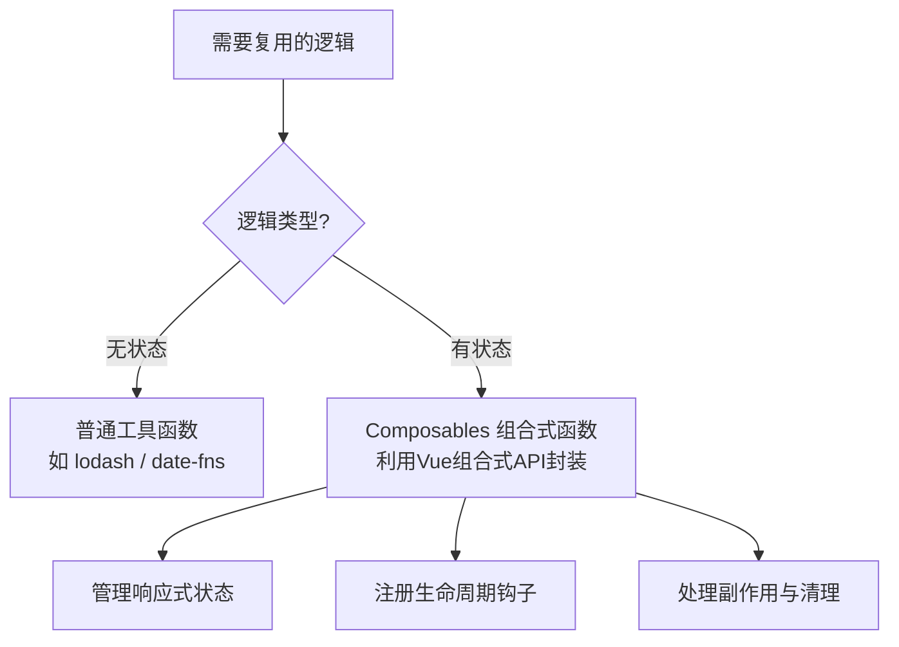
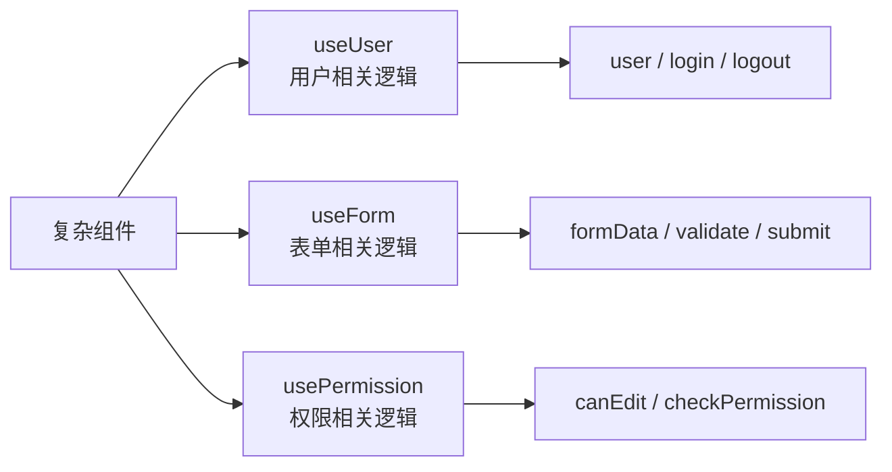

扫描[二维码](https://api2.cmdragon.cn/upload/cmder/20250304_012821924.jpg)关注或者微信搜一搜：`编程智域 前端至全栈交流与成长`

[发现1000+提升效率与开发的AI工具和实用程序](https://tools.cmdragon.cn/zh/apps?category=ai_chat)：https://tools.cmdragon.cn/zh/apps?category=ai_chat

## 一、先搞清楚：你写的代码为啥老重复？

不知道你有没有这种感觉——写Vue写到后面，好几个组件里都在干差不多的事。比如好几个页面都要获取用户信息、好几个组件都要监听窗口大小变化、好几个表单都要做那套验证逻辑……

一开始你可能觉得"复制粘贴嘛，能跑就行"，但慢慢地你就会发现：改一个地方得去好几个组件里同步改，漏改一个就出bug，整个人都不好了。

这就是Vue 3推出**组合式函数（Composables）**的核心原因——**把那些在多个组件里反复出现的逻辑，抽出来变成一个可以复用的函数**。

## 二、两种逻辑：有状态 vs 无状态

在理解Composables之前，你得先分清楚两种逻辑的区别，这个真的很关键。

### 无状态逻辑：给啥返回啥

无状态逻辑就是——你给它一个输入，它就给你一个输出，中间不存任何东西。就像计算器一样，按1+1它就给你2，它不会记住你上次按了啥。

```javascript
// 格式化日期的无状态函数
function formatDate(date, format) {
  // 给个日期和格式，直接返回格式化后的字符串
  // 不存任何状态，不关心之前调用过没有
  return dayjs(date).format(format);
}

// 用起来就是这样
formatDate(new Date(), "YYYY-MM-DD"); // '2026-05-19'
```

这种函数你肯定不陌生，像`lodash`、`date-fns`这些库里导出的基本都是无状态逻辑。它们的特点就是**纯粹**——同样的输入永远给你同样的输出。

### 有状态逻辑：会"记住"东西的

有状态逻辑就不一样了，它内部维护着会随时间变化的状态。举个最简单的例子——跟踪鼠标在页面上的位置：

```javascript
// 这个逻辑是有状态的
// x和y会随着鼠标移动不断变化
// 而且还得监听事件、还得在不用的时候取消监听
let x = 0;
let y = 0;

window.addEventListener("mousemove", (event) => {
  x = event.pageX;
  y = event.pageY;
});
```

你看，这个逻辑里面有几个特点：

1. **有状态**：x和y一直在变
2. **有副作用**：注册了事件监听器
3. **需要清理**：不用的时候得把监听器移除掉，不然内存泄漏

这种有状态逻辑，你用普通的工具函数是搞不定的，因为它涉及到状态的维护、生命周期的管理、副作用的清理……这些都不是一个纯函数能搞定的。

而**Composables就是专门用来封装这种有状态逻辑的**。



## 三、Composables到底是个啥？

官方定义是：

> "组合式函数"（Composables）是一个利用 Vue 的组合式 API 来封装和复用**有状态逻辑**的函数。

说白了，它就是一个函数，但不是普通的函数——它里面可以用`ref`、`reactive`、`computed`、`watch`、`onMounted`这些Vue的组合式API，能够管理响应式状态、挂载生命周期钩子、处理副作用。

### 它长啥样？

一个典型的Composable大概长这样：

```javascript
// useXxx.js
import { ref, onMounted, onUnmounted } from "vue";

// 约定：函数名以 use 开头
export function useXxx() {
  // 1. 定义响应式状态
  const state = ref(initialValue);

  // 2. 定义方法
  function doSomething() {
    // ...
  }

  // 3. 注册生命周期钩子
  onMounted(() => {
    // 启动副作用
  });

  onUnmounted(() => {
    // 清理副作用
  });

  // 4. 返回需要暴露的状态和方法
  return { state, doSomething };
}
```

### 在组件里怎么用？

```vue
<script setup>
import { useXxx } from "./useXxx.js";

// 解构出来直接用
const { state, doSomething } = useXxx();
</script>
```

就这么简单！你把它当成一个"逻辑的黑盒子"——你不用管它里面怎么实现的，你只要知道它给你返回了啥就行。

## 四、没有Composables的世界有多痛苦？

咱们来看一个真实的场景。假设你有3个组件都需要跟踪鼠标位置：

### 不用Composables：复制粘贴三遍

```vue
<!-- ComponentA.vue -->
<script setup>
import { ref, onMounted, onUnmounted } from "vue";

const x = ref(0);
const y = ref(0);

function update(event) {
  x.value = event.pageX;
  y.value = event.pageY;
}

onMounted(() => window.addEventListener("mousemove", update));
onUnmounted(() => window.removeEventListener("mousemove", update));
</script>

<template>鼠标位置：{{ x }}, {{ y }}</template>
```

```vue
<!-- ComponentB.vue -->
<!-- 又得写一遍一模一样的代码... -->
<script setup>
import { ref, onMounted, onUnmounted } from "vue";

const x = ref(0);
const y = ref(0);

function update(event) {
  x.value = event.pageX;
  y.value = event.pageY;
}

onMounted(() => window.addEventListener("mousemove", update));
onUnmounted(() => window.removeEventListener("mousemove", update));
</script>

<template>光标坐标：({{ x }}, {{ y }})</template>
```

```vue
<!-- ComponentC.vue -->
<!-- 再来一遍...人都要麻了 -->
<script setup>
import { ref, onMounted, onUnmounted } from "vue";

const x = ref(0);
const y = ref(0);

function update(event) {
  x.value = event.pageX;
  y.value = event.pageY;
}

onMounted(() => window.addEventListener("mousemove", update));
onUnmounted(() => window.removeEventListener("mousemove", update));
</script>

<template>当前位置：X={{ x }} Y={{ y }}</template>
```

三遍！而且如果哪天你想加个功能（比如限制鼠标追踪的范围），你得去三个地方改。漏改一个？恭喜你，bug来了。

### 用Composables：写一次，到处用

```javascript
// mouse.js
import { ref, onMounted, onUnmounted } from "vue";

export function useMouse() {
  const x = ref(0);
  const y = ref(0);

  function update(event) {
    x.value = event.pageX;
    y.value = event.pageY;
  }

  onMounted(() => window.addEventListener("mousemove", update));
  onUnmounted(() => window.removeEventListener("mousemove", update));

  return { x, y };
}
```

然后在任何组件里：

```vue
<!-- 不管哪个组件，都是这么用 -->
<script setup>
import { useMouse } from "./mouse.js";

const { x, y } = useMouse();
</script>

<template>鼠标位置：{{ x }}, {{ y }}</template>
```

看到了吧？逻辑只写一遍，想改就改一个地方，所有用到的地方都跟着变。而且每个组件调用`useMouse()`都会创建自己独立的x和y状态，不会互相干扰。

## 五、Composables能干啥？不只是复用

很多人以为Composables就是为了复用，其实它还有一个很重要的作用——**代码组织**。

当一个组件越来越复杂的时候，你的`<script setup>`里可能会堆一大堆逻辑：用户相关的、表单相关的、权限相关的……全都混在一起，看着头疼。

用Composables就可以按逻辑功能来拆分：

```vue
<script setup>
// 以前：所有逻辑混在一起，几百行代码看着眼花
// 现在：按功能拆开，清清爽爽
import { useUser } from "./useUser.js";
import { useForm } from "./useForm.js";
import { usePermission } from "./usePermission.js";

const { user, login, logout } = useUser();
const { formData, validate, submit } = useForm();
const { canEdit, checkPermission } = usePermission();
</script>
```

你看，一眼就能看出这个组件干了啥——用户管理、表单处理、权限检查，各司其职，互不干扰。



## 六、Composables和普通工具函数有啥本质区别？

这个问题很多人搞不清楚，咱们来掰扯掰扯：

| 特性                 | 普通工具函数   | Composables      |
| -------------------- | -------------- | ---------------- |
| 能用ref/reactive吗   | ❌ 不能        | ✅ 能            |
| 能注册生命周期钩子吗 | ❌ 不能        | ✅ 能            |
| 能用watch/computed吗 | ❌ 不能        | ✅ 能            |
| 返回值是响应式的吗   | ❌ 不是        | ✅ 是            |
| 能管理副作用吗       | ❌ 不能        | ✅ 能            |
| 适用场景             | 无状态的纯逻辑 | 有状态的复杂逻辑 |

简单来说，普通工具函数就是个"计算器"——输入啥就输出啥，不存状态。而Composables是个"小管家"——它帮你管着状态、盯着变化、到点就清理，啥都给你安排得明明白白。

## 课后 Quiz

### 问题 1

下面哪个逻辑适合用Composable来封装，哪个用普通函数就行？

- A. 把时间戳转成"2026-05-19"这种格式
- B. 跟踪浏览器窗口大小变化，窗口变了就重新计算布局

#### 答案解析

A用普通函数就行，因为格式化时间是无状态逻辑——给它一个时间戳它就给你一个字符串，不需要维护任何状态。

B适合用Composable封装，因为窗口大小是会随时间变化的状态，而且还需要监听`resize`事件、在组件卸载时移除监听器，这些都是有状态逻辑的特征。

### 问题 2

一个Composable函数名应该以什么开头？

#### 答案解析

以`use`开头，比如`useMouse`、`useFetch`、`useLocalStorage`。这是Vue社区的约定，看到`use`开头你就知道这是个Composable。

### 问题 3

多个组件调用同一个Composable时，它们共享同一份状态吗？

#### 答案解析

不共享。每次调用Composable都会创建一份独立的状态。比如组件A和组件B都调用了`useMouse()`，它们各自有自己的x和y，互不影响。如果你确实需要跨组件共享状态，应该用Pinia这类状态管理方案。

## 常见报错解决方案

### 报错 1：`onMounted is called when there is no active component instance`

**错误场景**：

```javascript
// 在组件外面直接调用Composable
import { useMouse } from "./mouse.js";

const { x, y } = useMouse(); // 💥 报错！
```

**报错原因**：
Composables内部使用了`onMounted`、`onUnmounted`等生命周期钩子，这些钩子必须在组件的`setup`上下文中才能注册。你在组件外面调用，Vue找不到当前活跃的组件实例，自然就报错了。

**解决方案**：
把Composable的调用放到`<script setup>`或`setup()`函数里面：

```vue
<script setup>
import { useMouse } from "./mouse.js";

const { x, y } = useMouse(); // ✅ 在组件setup上下文中调用
</script>
```

### 报错 2：Composable返回的状态解构后失去响应性

**错误场景**：

```javascript
// Composable返回的是reactive对象
export function useCounter() {
  return reactive({
    count: 0,
    increment() {
      this.count++;
    },
  });
}

// 组件里解构后...
const { count } = useCounter(); // 💥 count变成普通数字，不再响应式！
```

**报错原因**：
`reactive`对象被解构后，每个属性就变成了普通的值，和原来的响应式对象断了联系。

**解决方案**：
Composable应该返回包含`ref`的普通对象，这样解构后ref本身还是响应式的：

```javascript
export function useCounter() {
  const count = ref(0);
  function increment() {
    count.value++;
  }
  return { count, increment }; // ✅ 返回ref，解构后依然响应式
}

// 组件里
const { count, increment } = useCounter(); // ✅ count是ref，保持响应式
```

## 参考链接

- Vue 3 官方文档 - 组合式函数：https://vuejs.org/guide/reusability/composables.html
- Vue 3 官方文档 - 组合式 API 常见问答：https://vuejs.org/guide/extras/composition-api-faq.html

余下文章内容请点击跳转至 个人博客页面 或者 扫描[二维码](https://api2.cmdragon.cn/upload/cmder/20250304_012821924.jpg)关注或者微信搜一搜：`编程智域 前端至全栈交流与成长`，阅读完整的文章：[Vue 3组合式函数到底是啥？为啥你的代码总写重复？](https://blog.cmdragon.cn/posts/a1b2c3d4e5f6a7b8c9d0e1f2a3b4c5d6/)

<details>
<summary>往期文章归档</summary>

- [Vue 3 静态与动态 Props 如何传递？TypeScript 类型约束有何必要？](https://blog.cmdragon.cn/posts/94ab48753b64780ca3ab7a7115ae8522/)
- [Vue 3中组件局部注册的优势与实现方式如何？](https://blog.cmdragon.cn/posts/dbf576e744870f6de26fd8a2e03e47da/)
- [如何在Vue3中优化生命周期钩子性能并规避常见陷阱？](https://blog.cmdragon.cn/posts/12d98b3b9ccd6c19a1b169d720ac5c80/)
- [Vue 3 Composition API生命周期钩子：如何实现从基础理解到高阶复用？](https://blog.cmdragon.cn/posts/8884e2b70287fcb263c57648eeb27419/)
- [Vue 3生命周期钩子实战指南：如何正确选择onMounted、onUpdated与onUnmounted的应用场景？](https://blog.cmdragon.cn/posts/883c6dbc50ae4183770a4462e0b8ae4d/)
- [Vue 3中生命周期钩子与响应式系统如何实现协同工作？](https://blog.cmdragon.cn/posts/70dad360ffa9dce14d0d69611b8cb019/)
- [Vue 3组件生命周期钩子的执行顺序与使用场景是什么？](https://blog.cmdragon.cn/posts/db44294a78dc9f666f67b053f6c83567/)
- [Vue组件全局注册与局部注册如何抉择？](https://blog.cmdragon.cn/posts/43ead630ea17da65d99ad2eb8188e472/)
- [Vue3组件化开发中，Props与Emits如何实现数据流转与事件协作？](https://blog.cmdragon.cn/posts/8cff7d2df113da66ea7be560c4d1d22a/)
- [Vue 3模板引用如何与其他特性协同实现复杂交互？](https://blog.cmdragon.cn/posts/331bf75d114ab09116eadfcdca602b58/)
- [Vue 3 v-for中模板引用如何实现高效管理与动态控制？](https://blog.cmdragon.cn/posts/cb380897ddc3578b180ecf8843c774c1/)
- [Vue 3的defineExpose：如何突破script setup组件默认封装，实现精准的父子通讯？](https://blog.cmdragon.cn/posts/202ae0f4acde7128e0e31baf63732fb5/)
- [Vue 3模板引用的生命周期时机如何把握？常见陷阱该如何避免？](https://blog.cmdragon.cn/posts/7d2a0f6555ecbe92afd7d2491c427463/)
- [Vue 3模板引用如何实现父组件与子组件的高效交互？](https://blog.cmdragon.cn/posts/3fb7bdd84128b7efaaa1c979e1f28dee/)
- [Vue中为何需要模板引用？又如何高效实现DOM与组件实例的直接访问？](https://blog.cmdragon.cn/posts/23f3464ba16c7054b4783cded50c04c6/)
- [Vue 3 watch与watchEffect如何区分使用？常见陷阱与性能优化技巧有哪些？](https://blog.cmdragon.cn/posts/68a26cc0023e4994a6bc54fb767365c8/)
- [Vue3侦听器实战：组件与Pinia状态监听如何高效应用？](https://blog.cmdragon.cn/posts/fd4695f668d64332dda9962c24214f32/)
- [Vue 3中何时用watch，何时用watchEffect？核心区别及性能优化策略是什么？](https://blog.cmdragon.cn/posts/cdbbb1837f8c093252e61f46dbf0a2e7/)
- [Vue 3中如何有效管理侦听器的暂停、恢复与副作用清理？](https://blog.cmdragon.cn/posts/09551ab614c463a6d6ca69818e8c2d52/)
- [Vue 3 watchEffect：如何实现响应式依赖的自动追踪与副作用管理？](https://blog.cmdragon.cn/posts/b7bca5d20f628ac09f7192ad935ef664/)
- [Vue 3 watch如何利用immediate、once、deep选项实现初始化、一次性与深度监听？](https://blog.cmdragon.cn/posts/2c6cdb100a20f10c7e7d4413617c7ea9/)
- [Vue 3中watch如何高效监听多数据源、计算结果与数组变化？](https://blog.cmdragon.cn/posts/757a1728bc1b9c0c8b317b0354d85568/)
- [Vue 3中watch监听ref和reactive的核心差异与注意事项是什么？](https://blog.cmdragon.cn/posts/8e70552f0f61e0dc8c7f567a2d272345/)

</details>

<details>
<summary>免费好用的热门在线工具</summary>

- [多直播聚合器 - 应用商店 | By cmdragon](https://tools.cmdragon.cn/zh/apps/multi-live-aggregator)
- [Proto文件生成器 - 应用商店 | By cmdragon](https://tools.cmdragon.cn/zh/apps/proto-file-generator)
- [图片转粒子 - 应用商店 | By cmdragon](https://tools.cmdragon.cn/zh/apps/image-to-particles)
- [视频下载器 - 应用商店 | By cmdragon](https://tools.cmdragon.cn/zh/apps/video-downloader)
- [文件格式转换器 - 应用商店 | By cmdragon](https://tools.cmdragon.cn/zh/apps/file-converter)
- [M3U8在线播放器 - 应用商店 | By cmdragon](https://tools.cmdragon.cn/zh/apps/m3u8-player)
- [快图设计 - 应用商店 | By cmdragon](https://tools.cmdragon.cn/zh/apps/quick-image-design)
- [高级文字转图片转换器 - 应用商店 | By cmdragon](https://tools.cmdragon.cn/zh/apps/text-to-image-advanced)
- [RAID 计算器 - 应用商店 | By cmdragon](https://tools.cmdragon.cn/zh/apps/raid-calculator)
- [在线PS - 应用商店 | By cmdragon](https://tools.cmdragon.cn/zh/apps/photoshop-online)
- [Mermaid 在线编辑器 - 应用商店 | By cmdragon](https://tools.cmdragon.cn/zh/apps/mermaid-live-editor)
- [数学求解计算器 - 应用商店 | By cmdragon](https://tools.cmdragon.cn/zh/apps/math-solver-calculator)
- [智能提词器 - 应用商店 | By cmdragon](https://tools.cmdragon.cn/zh/apps/smart-teleprompter)
- [魔法简历 - 应用商店 | By cmdragon](https://tools.cmdragon.cn/zh/apps/magic-resume)
- [Image Puzzle Tool - 图片拼图工具 | By cmdragon](https://tools.cmdragon.cn/zh/apps/image-puzzle-tool)
- [字幕下载工具 - 应用商店 | By cmdragon](https://tools.cmdragon.cn/zh/apps/subtitle-downloader)
- [歌词生成工具 - 应用商店 | By cmdragon](https://tools.cmdragon.cn/zh/apps/lyrics-generator)
- [网盘资源聚合搜索 - 应用商店 | By cmdragon](https://tools.cmdragon.cn/zh/apps/cloud-drive-search)
- [ASCII字符画生成器 - 应用商店 | By cmdragon](https://tools.cmdragon.cn/zh/apps/ascii-art-generator)
- [JSON Web Tokens 工具 - 应用商店 | By cmdragon](https://tools.cmdragon.cn/zh/apps/jwt-tool)
- [Bcrypt 密码工具 - 应用商店 | By cmdragon](https://tools.cmdragon.cn/zh/apps/bcrypt-tool)
- [GIF 合成器 - 应用商店 | By cmdragon](https://tools.cmdragon.cn/zh/apps/gif-composer)
- [GIF 分解器 - 应用商店 | By cmdragon](https://tools.cmdragon.cn/zh/apps/gif-decomposer)
- [文本隐写术 - 应用商店 | By cmdragon](https://tools.cmdragon.cn/zh/apps/text-steganography)
- [CMDragon 在线工具 - 高级AI工具箱与开发者套件 | 免费好用的在线工具](https://tools.cmdragon.cn/zh)
- [应用商店 - 发现1000+提升效率与开发的AI工具和实用程序 | 免费好用的在线工具](https://tools.cmdragon.cn/zh/apps?category=trending)
- [CMDragon 更新日志 - 最新更新、功能与改进 | 免费好用的在线工具](https://tools.cmdragon.cn/zh/changelog)
- [支持我们 - 成为赞助者 | 免费好用的在线工具](https://tools.cmdragon.cn/zh/sponsor)
- [AI文本生成图像 - 应用商店 | 免费好用的在线工具](https://tools.cmdragon.cn/zh/apps/text-to-image-ai)
- [临时邮箱 - 应用商店 | 免费好用的在线工具](https://tools.cmdragon.cn/zh/apps/temp-email)
- [二维码解析器 - 应用商店 | 免费好用的在线工具](https://tools.cmdragon.cn/zh/apps/qrcode-parser)
- [文本转思维导图 - 应用商店 | 免费好用的在线工具](https://tools.cmdragon.cn/zh/apps/text-to-mindmap)
- [正则表达式可视化工具 - 应用商店 | 免费好用的在线工具](https://tools.cmdragon.cn/zh/apps/regex-visualizer)
- [文件隐写工具 - 应用商店 | 免费好用的在线工具](https://tools.cmdragon.cn/zh/apps/steganography-tool)
- [IPTV 频道探索器 - 应用商店 | 免费好用的在线工具](https://tools.cmdragon.cn/zh/apps/iptv-explorer)
- [快传 - 应用商店 | 免费好用的在线工具](https://tools.cmdragon.cn/zh/apps/snapdrop)
- [随机抽奖工具 - 应用商店 | 免费好用的在线工具](https://tools.cmdragon.cn/zh/apps/lucky-draw)
- [动漫场景查找器 - 应用商店 | 免费好用的在线工具](https://tools.cmdragon.cn/zh/apps/anime-scene-finder)
- [时间工具箱 - 应用商店 | 免费好用的在线工具](https://tools.cmdragon.cn/zh/apps/time-toolkit)
- [网速测试 - 应用商店 | 免费好用的在线工具](https://tools.cmdragon.cn/zh/apps/speed-test)
- [AI 智能抠图工具 - 应用商店 | 免费好用的在线工具](https://tools.cmdragon.cn/zh/apps/background-remover)
- [背景替换工具 - 应用商店 | 免费好用的在线工具](https://tools.cmdragon.cn/zh/apps/background-replacer)
- [艺术二维码生成器 - 应用商店 | 免费好用的在线工具](https://tools.cmdragon.cn/zh/apps/artistic-qrcode)
- [Open Graph 元标签生成器 - 应用商店 | 免费好用的在线工具](https://tools.cmdragon.cn/zh/apps/open-graph-generator)
- [图像对比工具 - 应用商店 | 免费好用的在线工具](https://tools.cmdragon.cn/zh/apps/image-comparison)
- [图片压缩专业版 - 应用商店 | 免费好用的在线工具](https://tools.cmdragon.cn/zh/apps/image-compressor)
- [密码生成器 - 应用商店 | 免费好用的在线工具](https://tools.cmdragon.cn/zh/apps/password-generator)
- [SVG优化器 - 应用商店 | 免费好用的在线工具](https://tools.cmdragon.cn/zh/apps/svg-optimizer)
- [调色板生成器 - 应用商店 | 免费好用的在线工具](https://tools.cmdragon.cn/zh/apps/color-palette)
- [在线节拍器 - 应用商店 | 免费好用的在线工具](https://tools.cmdragon.cn/zh/apps/online-metronome)
- [IP归属地查询 - 应用商店 | 免费好用的在线工具](https://tools.cmdragon.cn/zh/apps/ip-geolocation)
- [CSS网格布局生成器 - 应用商店 | 免费好用的在线工具](https://tools.cmdragon.cn/zh/apps/css-grid-layout)
- [邮箱验证工具 - 应用商店 | 免费好用的在线工具](https://tools.cmdragon.cn/zh/apps/email-validator)
- [书法练习字帖 - 应用商店 | 免费好用的在线工具](https://tools.cmdragon.cn/zh/apps/calligraphy-practice)
- [金融计算器套件 - 应用商店 | 免费好用的在线工具](https://tools.cmdragon.cn/zh/apps/finance-calculator-suite)
- [中国亲戚关系计算器 - 应用商店 | 免费好用的在线工具](https://tools.cmdragon.cn/zh/apps/chinese-kinship-calculator)
- [Protocol Buffer 工具箱 - 应用商店 | 免费好用的在线工具](https://tools.cmdragon.cn/zh/apps/protobuf-toolkit)
- [IP归属地查询 - 应用商店 | 免费好用的在线工具](https://tools.cmdragon.cn/zh/apps/ip-geolocation)
- [图片无损放大 - 应用商店 | 免费好用的在线工具](https://tools.cmdragon.cn/zh/apps/image-upscaler)
- [文本比较工具 - 应用商店 | 免费好用的在线工具](https://tools.cmdragon.cn/zh/apps/text-compare)
- [IP批量查询工具 - 应用商店 | 免费好用的在线工具](https://tools.cmdragon.cn/zh/apps/ip-batch-lookup)
- [域名查询工具 - 应用商店 | 免费好用的在线工具](https://tools.cmdragon.cn/zh/apps/domain-finder)
- [DNS工具箱 - 应用商店 | 免费好用的在线工具](https://tools.cmdragon.cn/zh/apps/dns-toolkit)
- [网站图标生成器 - 应用商店 | 免费好用的在线工具](https://tools.cmdragon.cn/zh/apps/favicon-generator)
- [XML Sitemap](https://tools.cmdragon.cn/sitemap_index.xml)

</details>
