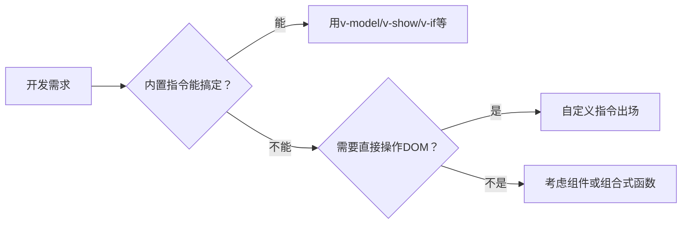
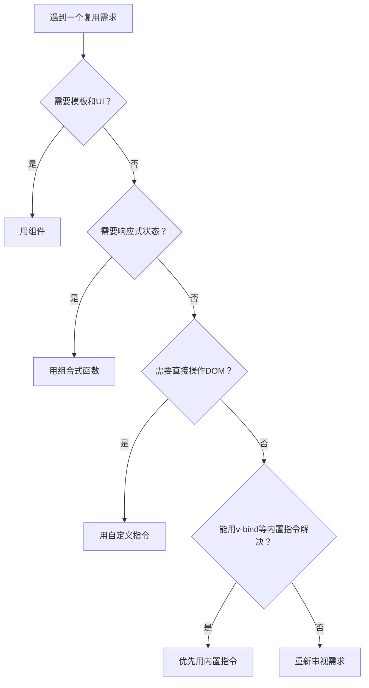
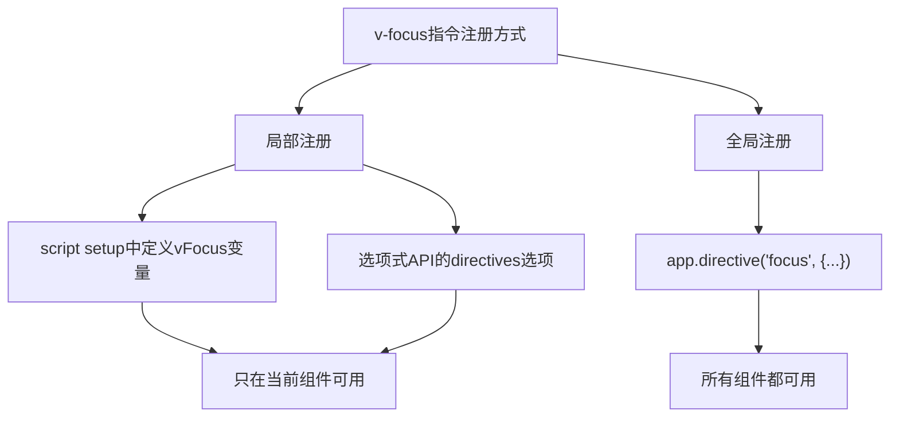

扫描[二维码](https://api2.cmdragon.cn/upload/cmder/20250304_012821924.jpg)关注或者微信搜一搜：`编程智域 前端至全栈交流与成长`

[发现1000+提升效率与开发的AI工具和实用程序](https://tools.cmdragon.cn/zh/apps?category=ai_chat)：https://tools.cmdragon.cn/zh/apps?category=ai_chat

## 一、Vue 3内置指令能干啥，不能干啥？

学Vue到现在，你肯定跟这些内置指令混得挺熟了：`v-model`帮你搞定双向绑定，`v-show`帮你控制显隐，`v-if`帮你做条件渲染，`v-for`帮你遍历列表，`v-bind`帮你绑定属性，`v-on`帮你绑定事件……基本上日常开发80%的场景，它们都能兜住。

但你有没有遇到过这种情况——你想让一个输入框一出来就自动获得焦点？你想给页面加上水印？你想做一个拖拽排序？你想根据权限控制某个按钮能不能点？

这些需求有个共同点：**它们都需要直接操作DOM**。

然后你回头看了看内置指令们，`v-model`说"我只管数据绑定"，`v-show`说"我只管display切换"，`v-bind`说"我只管属性绑定"……抱歉，直接操作DOM这活儿，它们谁也接不了。

打个比方，内置指令就像一家餐厅的固定菜单，家常菜、招牌菜都有，够你日常吃的。但哪天你想来个特殊口味——比如少油少盐的清蒸鲈鱼——固定菜单上没有，你就得找厨师单独做。自定义指令，就是Vue给你留的"私人定制"通道。



## 二、自定义指令到底是个啥？

说白了，自定义指令就是你自己定义的`v-xxx`指令。你想叫`v-focus`就叫`v-focus`，想叫`v-drag`就叫`v-drag`，随你。

从代码层面看，它本质上就是一个**对象**，里面包含类似组件生命周期的钩子函数。这些钩子函数会在特定时机被Vue调用，并且会接收到指令绑定的DOM元素作为参数——这就给了你直接操作DOM的能力。

来看一个最简单的例子，`v-highlight`，给元素加个高亮class：

```vue
<script setup>
// 在script setup中，以v开头的驼峰变量自动成为指令
// vHighlight → 模板中使用 v-highlight
const vHighlight = {
  // mounted钩子：元素被插入DOM后调用
  mounted(el) {
    // el就是指令绑定的那个DOM元素
    el.classList.add("is-highlight");
  },
};
</script>

<template>
  <!-- 使用自定义指令，就像用v-model一样自然 -->
  <p v-highlight>这句话会被高亮显示！</p>
</template>

<style>
.is-highlight {
  background-color: yellow;
  padding: 2px 4px;
  border-radius: 3px;
}
</style>
```

注意看这个命名规则——在`<script setup>`里，你定义一个以`v`开头的驼峰式变量，Vue就会自动把它识别为自定义指令。`vHighlight`对应模板里的`v-highlight`，`vFocus`对应`v-focus`，以此类推。这个自动识别机制是Vue 3专门为`<script setup>`提供的便利。

如果你不用`<script setup>`，那就得通过`directives`选项来注册：

```javascript
const highlight = {
  mounted(el) {
    el.classList.add("is-highlight");
  },
};

export default {
  directives: {
    // 在模板中启用 v-highlight
    highlight,
  },
};
```

两种写法效果一样，只是注册方式不同。现在大家都更习惯用`<script setup>`了，写起来确实更省事。

那指令里都能写哪些钩子呢？先混个眼熟，后面文章会细讲：

| 钩子函数        | 触发时机                              |
| --------------- | ------------------------------------- |
| `created`       | 绑定元素的attribute或事件监听器应用前 |
| `beforeMount`   | 元素被插入DOM前                       |
| `mounted`       | 元素插入DOM后                         |
| `beforeUpdate`  | 绑定元素的父组件更新前                |
| `updated`       | 绑定元素的父组件及子节点更新后        |
| `beforeUnmount` | 绑定元素的父组件卸载前                |
| `unmounted`     | 绑定元素的父组件卸载后                |

是不是看着眼熟？没错，它们跟组件的生命周期钩子几乎一一对应。区别在于组件钩子关注的是组件自身，而指令钩子关注的是它绑定的那个DOM元素。

## 三、啥时候该用自定义指令？

这是很多人会纠结的问题——我有个需求，到底该用组件、组合式函数还是自定义指令？

Vue官方给了一个很明确的建议：**只有当所需功能只能通过直接的DOM操作来实现时，才应该使用自定义指令**。

关键词是"只能"。能用别的方案解决的，就别用自定义指令。

来，咱们把三者掰开了对比一下：

| 维度       | 组件             | 组合式函数           | 自定义指令           |
| ---------- | ---------------- | -------------------- | -------------------- |
| 核心定位   | 构建UI模块       | 复用有状态的逻辑     | 复用底层DOM操作      |
| 侧重点     | 模板+样式+逻辑   | 响应式状态+计算+侦听 | 直接操作DOM元素      |
| 典型场景   | 按钮、弹窗、表单 | useMouse、useFetch   | 自动聚焦、拖拽、水印 |
| 有没有模板 | 有               | 没有                 | 没有                 |
| 有没有状态 | 可以有           | 通常有               | 通常无状态           |
| SSR友好度  | 友好             | 友好                 | 不太友好             |

举个具体的例子帮你区分：

- **做一组可复用的按钮样式** → 用组件，因为你要的是UI模块
- **做鼠标位置追踪** → 用组合式函数，因为你要的是响应式状态x和y
- **做输入框自动聚焦** → 用自定义指令，因为你要的是调用`el.focus()`这个DOM API



还有一点很重要：**能用`v-bind`等内置指令解决的，优先用内置指令**。为啥？因为内置指令更高效，而且对服务端渲染（SSR）更友好。自定义指令里直接操作DOM，在SSR环境下是没有DOM可操作的，容易出问题。

所以自定义指令不是什么"高级"的写法，它更像是一把特殊工具——平时用不上，但遇到特定场景时，没它还真不行。

## 四、手搓第一个自定义指令：v-focus

好了，概念讲够了，咱们来动手写一个真正能用的自定义指令——`v-focus`，让输入框自动获得焦点。

### script setup写法

```vue
<!-- FocusInput.vue -->
<script setup>
// 定义v-focus指令
// vFocus → 模板中使用 v-focus
const vFocus = {
  // 元素挂载后自动聚焦
  mounted(el) {
    el.focus();
  },
};
</script>

<template>
  <div>
    <p>页面加载后，下面的输入框会自动获得焦点：</p>
    <!-- 使用v-focus指令 -->
    <input v-focus placeholder="我自动获得焦点啦" />
  </div>
</template>
```

就这么几行代码，搞定。当Vue把这个`<input>`插入DOM后，`mounted`钩子被触发，`el.focus()`让输入框自动获得焦点。

### 选项式写法

如果你习惯选项式API，写法是这样的：

```vue
<!-- FocusInput.vue -->
<script>
const focus = {
  mounted(el) {
    el.focus();
  },
};

export default {
  directives: {
    // 通过directives选项注册，模板中用 v-focus
    focus,
  },
};
</script>

<template>
  <input v-focus placeholder="我自动获得焦点啦" />
</template>
```

逻辑完全一样，只是注册方式换成了`directives`选项。

### 和HTML原生autofocus有啥区别？

你可能会问：HTML不是有个`autofocus`属性吗？干嘛还要自己写指令？

```html
<!-- 原生autofocus -->
<input autofocus />
```

确实，`autofocus`在页面初次加载时能让输入框获得焦点。但它有个致命的局限——**只在页面初次加载时生效**。

啥意思呢？看这个场景：

```vue
<script setup>
import { ref } from "vue";

const showInput = ref(false);

const vFocus = {
  mounted(el) {
    el.focus();
  },
};
</script>

<template>
  <button @click="showInput = true">显示输入框</button>

  <!-- 用v-if动态插入的输入框 -->
  <input v-if="showInput" v-focus placeholder="动态插入也能聚焦" />

  <!-- 用autofocus？抱歉，动态插入时它不生效 -->
  <!-- <input v-if="showInput" autofocus placeholder="我不行" /> -->
</template>
```

当你点击按钮，`v-if`把输入框动态插入DOM时，`v-focus`指令的`mounted`钩子会被触发，输入框乖乖获得焦点。而`autofocus`呢？它只在浏览器解析HTML时生效一次，Vue动态插入的元素它根本不管。

这就是`v-focus`比`autofocus`强的地方——**不管元素什么时候被插入DOM，它都能让元素自动聚焦**。弹窗里的输入框、条件渲染的表单、异步加载的组件……统统不在话下。

### 全局注册v-focus

如果你希望`v-focus`在整个应用都能用，不用每个组件都写一遍，可以全局注册：

```javascript
// main.js
import { createApp } from "vue";
import App from "./App.vue";

const app = createApp(App);

// 全局注册 v-focus 指令
app.directive("focus", {
  mounted(el) {
    el.focus();
  },
});

app.mount("#app");
```

注册完之后，任何组件的模板里直接写`<input v-focus />`就行，不用再单独声明了。



## 课后 Quiz

### 问题 1

在`<script setup>`中，自定义指令的命名规则是什么？比如你定义了一个叫`vFocus`的变量，模板中应该怎么使用？

#### 答案解析

在`<script setup>`中，任何以`v`开头的驼峰式变量都会被Vue自动识别为自定义指令。`vFocus`对应模板中的`v-focus`，`vDrag`对应`v-drag`，`vLazyLoad`对应`v-lazy-load`。这个转换规则跟组件的命名转换是一样的——驼峰转短横线。反过来想，如果你在模板里写`v-my-directive`，那`<script setup>`里就应该定义一个叫`vMyDirective`的变量。

### 问题 2

自定义指令和组合式函数分别适合什么场景？下面哪个需求应该用自定义指令，哪个应该用组合式函数？

- A. 追踪鼠标在页面上的位置
- B. 让输入框在插入DOM后自动获得焦点

#### 答案解析

A应该用组合式函数，B应该用自定义指令。

追踪鼠标位置需要的是响应式状态（x和y坐标），这些状态要在模板中显示、在计算属性中使用、传递给子组件……这完全是"有状态的逻辑复用"的场景，用`useMouse()`组合式函数最合适。

而自动聚焦需要的是调用`el.focus()`这个DOM API，它不涉及响应式状态，只是对DOM元素做一次操作，这正是自定义指令的用武之地。

记住核心区分点：**需要响应式状态 → 组合式函数，需要直接操作DOM → 自定义指令**。

## 常见报错解决方案

### 报错 1：自定义指令写了但不生效

这是新手最常遇到的问题，写了`v-focus`但输入框就是不聚焦。排查方向有三个：

**原因一：命名错误**

在`<script setup>`中，变量名必须以`v`开头且使用驼峰命名。如果你写成了`vfocus`（小写f）或者`v-focus`（短横线），Vue都不会识别：

```javascript
// ❌ 错误写法
const vfocus = { mounted(el) { el.focus() } }    // 小写f，不会被识别
const v-focus = { mounted(el) { el.focus() } }    // 短横线，语法错误

// ✅ 正确写法
const vFocus = { mounted(el) { el.focus() } }     // 驼峰，vFocus → v-focus
```

**原因二：钩子函数用错了**

如果你把逻辑写在了`created`或`beforeMount`里，那肯定不生效——因为这两个钩子触发时元素还没插入DOM，调用`el.focus()`等于对着空气喊话：

```javascript
// ❌ 元素还没插入DOM，focus()无效
const vFocus = {
  beforeMount(el) {
    el.focus();
  },
};

// ✅ 元素已插入DOM，focus()有效
const vFocus = {
  mounted(el) {
    el.focus();
  },
};
```

**原因三：指令没有注册**

如果用的是选项式写法，忘了在`directives`选项里注册，模板里写了`v-focus`也白搭：

```javascript
// ❌ 忘了注册
export default {
  // 没有directives选项
}

// ✅ 正确注册
export default {
  directives: {
    focus: {
      mounted(el) { el.focus() }
    }
  }
}
```

### 报错 2：v-focus在弹窗中不生效

你给弹窗里的输入框加了`v-focus`，弹窗打开后输入框却没有自动聚焦。

**原因分析**：

弹窗组件通常用`v-if`控制显示，当你把`showDialog`设为`true`时，Vue需要先创建DOM、插入页面，然后才会触发`mounted`钩子。但有些UI库的弹窗组件内部还有动画或者异步渲染逻辑，导致`mounted`触发时，输入框可能还没有完全"准备好"接收焦点。

**解决方案**：

用`nextTick`确保DOM更新完成后再聚焦：

```vue
<script setup>
import { nextTick } from "vue";

const vFocus = {
  async mounted(el) {
    // 等待下一个DOM更新周期
    await nextTick();
    el.focus();
  },
};
</script>
```

或者用`setTimeout`给一个微小的延迟（不推荐，但有时候确实管用）：

```javascript
const vFocus = {
  mounted(el) {
    setTimeout(() => {
      el.focus();
    }, 0);
  },
};
```

**预防建议**：在涉及动画、异步渲染、第三方UI组件的场景中使用自定义指令时，优先考虑`nextTick`方案。它比`setTimeout`更可靠，因为它等待的是Vue的DOM更新周期，而不是一个不确定的时间间隔。

参考链接：https://cn.vuejs.org/guide/reusability/custom-directives.html

余下文章内容请点击跳转至 个人博客页面 或者 扫描[二维码](https://api2.cmdragon.cn/upload/cmder/20250304_012821924.jpg)关注或者微信搜一搜：`编程智域 前端至全栈交流与成长`，阅读完整的文章：[Vue 3里那些内置指令不够用？自己造一个试试！](https://blog.cmdragon.cn/posts/a3f7c1e9d5b24a8f90e6c2d7e1b3a5f8/)

<details>
<summary>往期文章归档</summary>

- [Vue 3 静态与动态 Props 如何传递？TypeScript 类型约束有何必要？](https://blog.cmdragon.cn/posts/94ab48753b64780ca3ab7a7115ae8522/)
- [Vue 3中组件局部注册的优势与实现方式如何？](https://blog.cmdragon.cn/posts/dbf576e744870f6de26fd8a2e03e47da/)
- [如何在Vue3中优化生命周期钩子性能并规避常见陷阱？](https://blog.cmdragon.cn/posts/12d98b3b9ccd6c19a1b169d720ac5c80/)
- [Vue 3 Composition API生命周期钩子：如何实现从基础理解到高阶复用？](https://blog.cmdragon.cn/posts/8884e2b70287fcb263c57648eeb27419/)
- [Vue 3生命周期钩子实战指南：如何正确选择onMounted、onUpdated与onUnmounted的应用场景？](https://blog.cmdragon.cn/posts/883c6dbc50ae4183770a4462e0b8ae4d/)

</details>

<details>
<summary>免费好用的热门在线工具</summary>

- [多直播聚合器 - 应用商店 | By cmdragon](https://tools.cmdragon.cn/zh/apps/multi-live-aggregator)
- [Proto文件生成器 - 应用商店 | By cmdragon](https://tools.cmdragon.cn/zh/apps/proto-file-generator)
- [图片转粒子 - 应用商店 | By cmdragon](https://tools.cmdragon.cn/zh/apps/image-to-particles)
- [视频下载器 - 应用商店 | By cmdragon](https://tools.cmdragon.cn/zh/apps/video-downloader)
- [文件格式转换器 - 应用商店 | By cmdragon](https://tools.cmdragon.cn/zh/apps/file-converter)
- [M3U8在线播放器 - 应用商店 | By cmdragon](https://tools.cmdragon.cn/zh/apps/m3u8-player)
- [CMDragon 在线工具 - 高级AI工具箱与开发者套件 | 免费好用的在线工具](https://tools.cmdragon.cn/zh)
- [应用商店 - 发现1000+提升效率与开发的AI工具和实用程序 | 免费好用的在线工具](https://tools.cmdragon.cn/zh/apps?category=trending)

</details>
