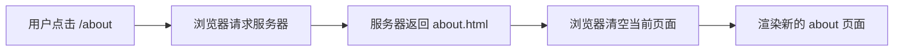
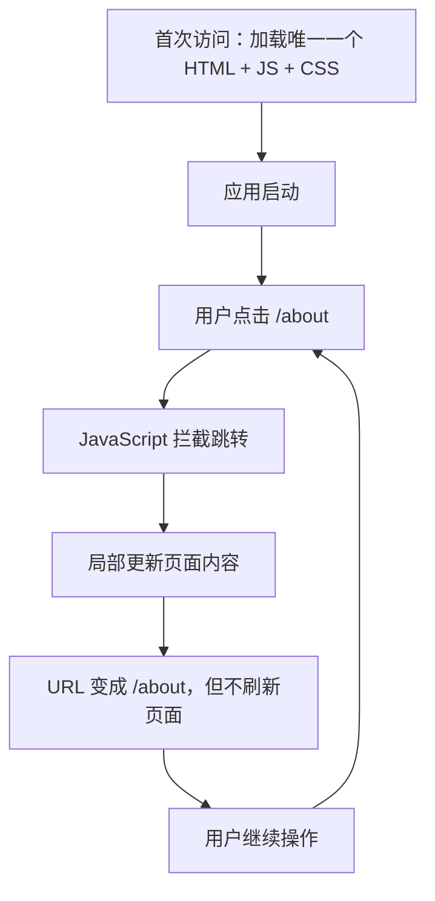
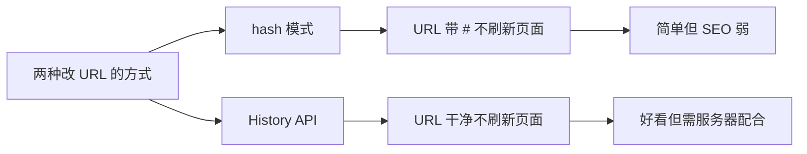
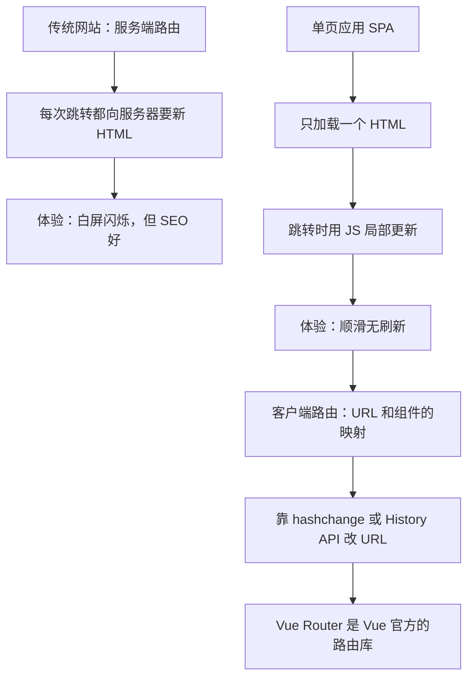

## 一、从一个最熟悉的现象说起：点击链接，页面变了

你打开一个传统的网站，比如一个用 WordPress 搭的博客。点击一篇文章标题，浏览器地址栏变了，页面白一下，然后新内容出来了。

这个过程发生了什么？

```text
你点击链接
-> 浏览器向服务器发请求
-> 服务器根据 URL 找到对应内容
-> 服务器返回一整套全新的 HTML
-> 浏览器丢掉旧页面，渲染新页面
```

这就是最传统的路由方式，叫做**服务端路由**。

## 二、服务端路由：每次跳转都是"换一张纸"

服务端路由的核心特点是：**每一个 URL 都对应服务器上的一份独立内容**。

比如：

| URL | 服务器返回 |
|-----|-----------|
| `/` | 首页的完整 HTML |
| `/about` | 关于页的完整 HTML |
| `/users/123` | 用户 123 的详情页完整 HTML |

每次跳转，浏览器都会从服务器拿到一整套全新的 HTML，然后把当前页面整个丢掉，重新渲染。



这种方式简单直接，但有一个明显的体验问题：**每次跳转都要重新加载整个页面**。

页面会闪一下，已经加载过的 CSS、JS、图片可能要重新请求。如果你的网速一般，这种"白屏闪烁"会让人觉得这个应用很"卡"。

## 三、单页应用（SPA）：不是换纸，是在同一张纸上擦写

为了解决这个体验问题，出现了一种新的应用形态，叫做**单页应用**（Single Page Application，简称 SPA）。

单页应用的核心思路是：

```text
整个应用只加载一个 HTML 页面。
之后的"跳转"，不再是向服务器要新页面，
而是用 JavaScript 在当前页面上擦掉旧内容、画上新内容。
```

你用过的很多产品都是单页应用：Gmail、Google Maps、网易云音乐网页版、Vue 官网文档站。

单页应用的好处很明显：

- 跳转时不重新加载整个页面，体验更顺滑。
- 已经加载的资源可以复用，不用反复请求。
- 更接近原生 App 的操作手感。



## 四、那"路由"在单页应用里是什么意思

在传统网站里，路由是服务器的事：服务器根据 URL 决定返回什么内容。

在单页应用里，页面不再由服务器决定，而是由 JavaScript 决定。所以"路由"这件事，就从服务器搬到了浏览器里，这就是**客户端路由**。

客户端路由要回答的核心问题是：

```text
当前 URL 是什么？
根据这个 URL，应该在页面上显示哪个组件？
用户点击跳转时，怎么在不刷新页面的前提下更新 URL 和内容？
```

把这三件事做完，你就有了一个"路由器"。

## 五、客户端路由靠什么改 URL：两个浏览器 API

你可能会好奇：跳转时不刷新页面，那 URL 是怎么变的？浏览器提供了两套 API 来做这件事。

### 1. hashchange 事件（哈希路由）

URL 里 `#` 后面的部分叫 hash，比如 `https://example.com/#/about` 里的 `#/about`。

hash 有一个重要特性：**改变 hash 不会让浏览器向服务器发请求，也不会刷新页面**。

所以最简单的客户端路由，就是利用 hash 来记录"当前在哪个页面"。

```text
地址变成 #/        -> 显示首页
地址变成 #/about   -> 显示关于页
地址变成 #/users   -> 显示用户页
```

浏览器还提供了 `hashchange` 事件，每当 hash 变化时就会触发，你只需要监听这个事件，然后更新页面内容即可。

### 2. History API（HTML5 模式）

hash 模式有个缺点：URL 里有个 `#`，不太好看，而且对 SEO 不友好。

HTML5 提供了 History API，其中有两个方法可以做到"改 URL 但不刷新页面"：

```js
// 在历史记录里添加一条新记录，URL 变成新地址，但不刷新页面
window.history.pushState(state, title, url)

// 替换当前记录，不会留下历史
window.history.replaceState(state, title, url)
```

这样 URL 就可以是 `https://example.com/about` 这种干净的样子，而不是 `https://example.com/#/about`。



这两种方式各有取舍，后面用到 Vue Router 时我们会详细对比。现在你只需要知道：**客户端路由的底层，就是靠这两个浏览器 API 来"假装跳转"的**。

## 六、为什么需要一个专门的路由库

理论上，你自己用 `hashchange` 或 `pushState` 也能写出一个能跑的客户端路由。但真正做项目时，你会发现有一堆细节要处理：

- URL 和组件的映射关系怎么配置才清晰？
- 路径里带参数怎么办（比如 `/users/123` 里的 `123`）？
- 页面有层级关系怎么办（比如用户页里又有"资料"和"文章"两个子页）？
- 怎么在代码里主动跳转，而不只是靠点击链接？
- 跳转前要做权限校验怎么办？
- 浏览器前进后退按钮怎么正确响应？
- 不同历史模式下，服务器要怎么配合？

这些问题，Vue Router 已经帮你全部想好了。它是 Vue 官方提供的客户端路由库，专门为 Vue 的组件系统设计。

本系列后面的章节，就会带你从手写一个简易路由开始，逐步过渡到使用 Vue Router 解决上面这些问题。

## 七、一张图总结这一章的核心



## 八、学完这一章，你要记住这几句话

- 服务端路由：每个 URL 对应服务器上一份独立内容，跳转就是重新加载整个页面。
- 单页应用：只加载一个 HTML，之后的跳转靠 JavaScript 局部更新，不刷新页面。
- 客户端路由：在浏览器里管理"URL 和显示内容"的对应关系。
- 改 URL 不刷新页面的两种方式：hash 模式 和 History API。
- Vue Router 是 Vue 官方的客户端路由库，专门解决 Vue 应用里的路由问题。

下一章，我们先不装任何库，自己用 `hashchange` 手写一个最简陋的路由器。亲手写一遍，你会真正理解路由器在做什么，之后再学 Vue Router 就会非常顺。

## 练习

先别写代码，试着用自己的话回答下面两个问题：

1. 你平时用的哪个网站，跳转时会"白屏闪烁"？哪个网站跳转时很顺滑、不刷新？分别判断它们更可能是服务端路由还是客户端路由。

2. 如果让你用 hash 来区分"首页"和"关于页"，你会把这两个页面的 URL 设计成什么样？当用户从首页跳到关于页时，浏览器会向服务器发请求吗？

想清楚这两个问题，你就已经理解了客户端路由的根基。

参考链接：https://cn.vuejs.org/guide/scaling-up/routing.html
