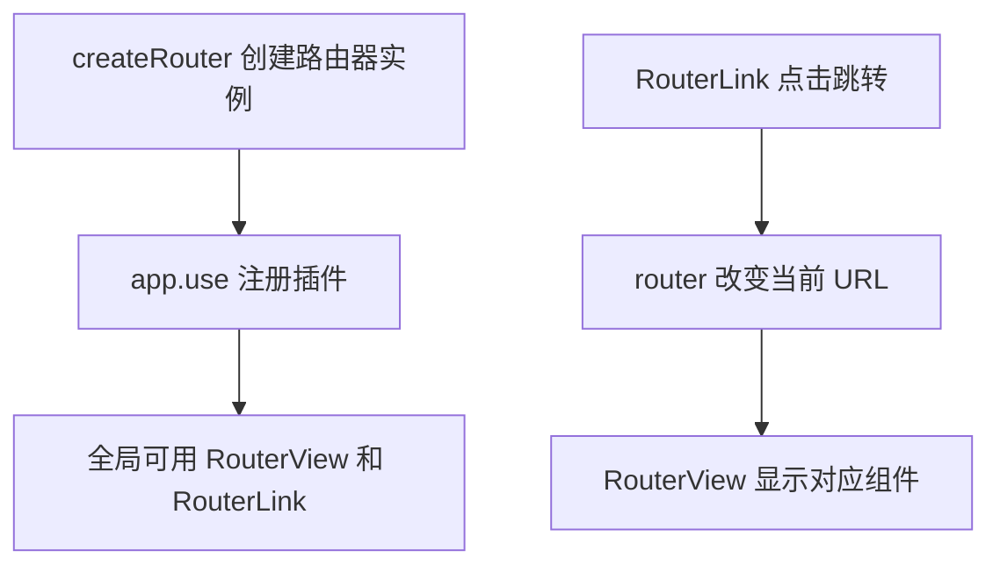
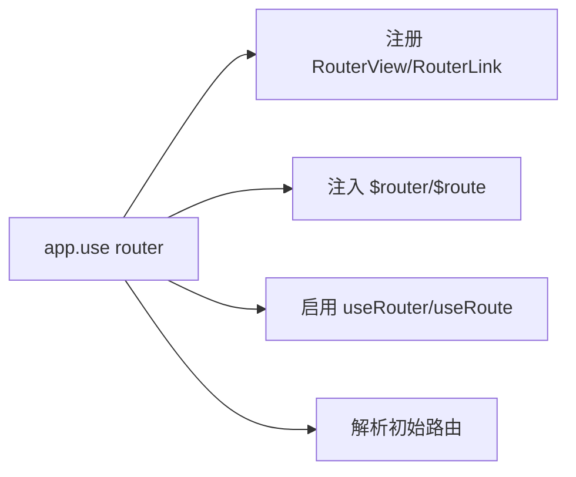
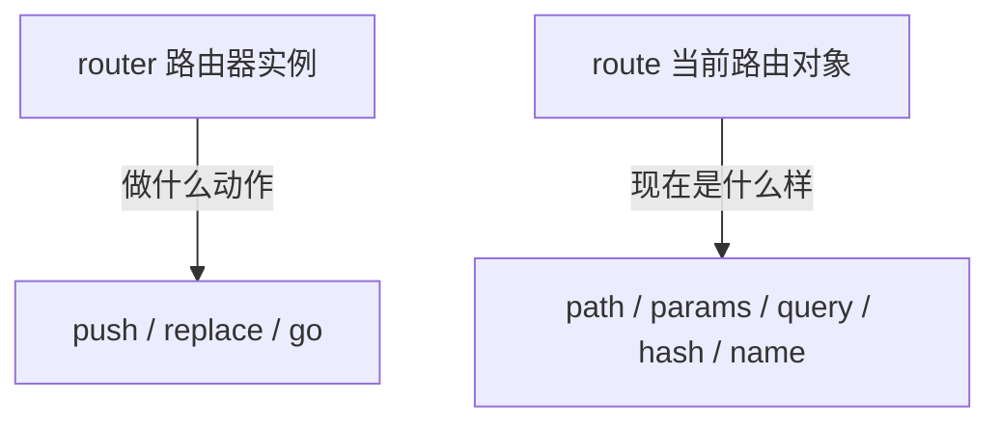

## 一、Vue Router 的三件套，先记住这张关系图

上一章我们手写的简易路由器，核心是"路径表 + 监听 + 动态组件"。Vue Router 把这三件事封装成了三个东西：

- **路由器实例（router）**：由 `createRouter()` 创建，里面装着路由配置表，是整个路由的大管家。
- **`<RouterView>`**：路由的出口，告诉 Vue Router "当前页面要显示在这里"。
- **`<RouterLink>`**：路由的入口，用来创建不刷新页面的跳转链接。



这一章我们就把这三件套用起来，跑通一个真正的 Vue Router 应用。

## 二、安装 Vue Router

如果你是用 `create-vue` 脚手架创建的项目，创建时勾选 Router 选项就行：

```bash
npm create vue@latest
```

按提示操作，勾选"Add Vue Router for Single Page Application development?"，脚手架会自动帮你装好并配置好。

如果你是手动往已有项目里加，就自己安装：

```bash
npm install vue-router@4
```

注意版本号是 `4`。Vue 3 对应的是 Vue Router 4，Vue 2 对应的是 Vue Router 3，别装错了。

## 三、第一步：定义路由配置表

新建一个文件 `src/router/index.js`，先把路由配置写出来：

```js
// src/router/index.js
import { createRouter, createWebHistory } from 'vue-router'

// 引入两个页面组件
import HomeView from '../views/HomeView.vue'
import AboutView from '../views/AboutView.vue'

// 路由配置表：路径和组件的对应关系
const routes = [
  { path: '/', component: HomeView },
  { path: '/about', component: AboutView },
]

// 创建路由器实例
const router = createRouter({
  // 历史模式，后面会详细讲，先用这个
  history: createWebHistory(),
  routes,
})

export default router
```

你发现没有——`routes` 这张表，和我们上一章手写的对照表几乎一样：

```js
// 上一章手写的
const routes = {
  '/': Home,
  '/about': About,
}

// Vue Router 的
const routes = [
  { path: '/', component: HomeView },
  { path: '/about', component: AboutView },
]
```

只是从"对象"变成了"数组"，每条配置是一个对象。变成数组是为了支持更多字段（后面会用到 `name`、`children` 等），也为路径匹配留出了排序空间。

## 四、第二步：在 main.js 里注册路由器插件

光创建路由器实例还不够，得让整个 Vue 应用知道它的存在。这一步通过 `app.use(router)` 完成：

```js
// src/main.js
import { createApp } from 'vue'
import App from './App.vue'
import router from './router'

const app = createApp(App)

// 把路由器注册为插件，必须在 mount 之前
app.use(router)

app.mount('#app')
```

`app.use(router)` 这一步，路由器会偷偷做四件事：

1. 全局注册 `<RouterView>` 和 `<RouterLink>` 两个组件，让你在任何模板里都能直接用，不用手动 import。
2. 给所有组件注入 `$router`（路由器实例）和 `$route`（当前路由对象）两个属性。
3. 启用 `useRouter()` 和 `useRoute()` 两个组合式函数。
4. 触发路由器解析初始路由，也就是一打开应用就根据当前 URL 显示对应页面。



## 五、第三步：在 App.vue 里放好出口和链接

现在打开根组件 `App.vue`，把路由的入口和出口摆好：

```vue
<!-- src/App.vue -->
<template>
  <h1>Hello App!</h1>

  <p>
    <strong>当前路径：</strong>{{ $route.fullPath }}
  </p>

  <!-- 导航链接：用 RouterLink 代替 a 标签 -->
  <nav>
    <RouterLink to="/">首页</RouterLink>
    |
    <RouterLink to="/about">关于</RouterLink>
  </nav>

  <!-- 路由出口：当前 URL 对应的组件会显示在这里 -->
  <main>
    <RouterView />
  </main>
</template>
```

这里有两个关键点：

### 1. `<RouterLink>` 代替 `<a>`

`<RouterLink to="/about">` 渲染出来其实也是一个 `<a>` 标签，但点击它不会刷新页面，而是交给路由器去处理跳转。`to` 属性指定要跳到哪个路径。

```vue
<!-- 这两个效果类似，但 RouterLink 不刷新页面 -->
<a href="/about">关于</a>
<RouterLink to="/about">关于</RouterLink>
```

### 2. `<RouterView>` 是出口

`<RouterView />` 是一个占位符，意思是"当前 URL 对应的组件，请显示在这里"。URL 一变，这里显示的内容就跟着变。

### 3. `$route` 是当前路由对象

模板里的 `{{ $route.fullPath }}` 可以访问当前路由的信息。`fullPath` 是完整的路径（包括查询参数和 hash），`$route` 还有很多其他字段，后面会用到。

## 六、第四步：准备两个页面组件

路由配置里引用了 `HomeView` 和 `AboutView`，把它们创建出来：

```vue
<!-- src/views/HomeView.vue -->
<template>
  <div>
    <h2>首页</h2>
    <p>这是用 Vue Router 跑起来的第一个应用。</p>
  </div>
</template>
```

```vue
<!-- src/views/AboutView.vue -->
<script setup>
import { computed } from 'vue'
import { useRoute } from 'vue-router'

const route = useRoute()

// 演示读取查询参数：访问 /about?search=hello 时，search 的值是 hello
const search = computed(() => route.query.search ?? '（没有搜索词）')
</script>

<template>
  <div>
    <h2>关于页</h2>
    <p>搜索词：{{ search }}</p>
    <p>试试访问 <code>/about?search=vue</code></p>
  </div>
</template>
```

现在运行项目（`npm run dev`），打开浏览器：

- 访问 `/` 显示首页。
- 访问 `/about` 显示关于页。
- 点击导航链接，页面切换但不刷新。
- 地址栏的 URL 会变。

到这里，你的第一个 Vue Router 应用就跑起来了。

## 七、router 和 route：一个字母之差，含义完全不同

新手最容易搞混这两个词，一定要分清：

### router（路由器实例）

`router` 是**路由器实例**，由 `createRouter()` 返回。它是"管理者"，负责执行跳转动作。

- 在组合式 API 里：`const router = useRouter()`
- 在选项式 API 里：`this.$router`

它的方法都是"动作"：跳转、替换、前进、后退。

```js
router.push('/about')     // 跳转到 /about
router.replace('/login')  // 替换当前页（不留历史）
router.go(-1)             // 后退一步
```

### route（当前路由对象）

`route` 是**当前路由对象**，描述"现在这个 URL 是什么样"。它是"信息"，是只读的。

- 在组合式 API 里：`const route = useRoute()`
- 在选项式 API 里：`this.$route`

它的属性都是"信息"：当前路径、参数、查询字符串、hash 等。

```js
route.path        // "/about"
route.fullPath    // "/about?search=vue#top"
route.params      // { id: '123' }（动态路由参数）
route.query       // { search: 'vue' }（查询参数）
route.hash        // "#top"
route.name        // "about"（命名路由的名字）
```



一句话记忆：**router 是"动手的"，route 是"看信息的"**。

## 八、组合式 API 和选项式 API 怎么访问它们

Vue Router 对两种 API 风格都支持。

### 组合式 API（推荐，配合 `<script setup>`）

```vue
<script setup>
import { useRoute, useRouter } from 'vue-router'

const route = useRoute()
const router = useRouter()

function goToAbout() {
  router.push('/about')
}
</script>

<template>
  <p>当前路径：{{ route.path }}</p>
  <button @click="goToAbout">去关于页</button>
</template>
```

### 选项式 API

```vue
<script>
export default {
  methods: {
    goToAbout() {
      this.$router.push('/about')
    },
  },
}
</script>

<template>
  <p>当前路径：{{ $route.path }}</p>
  <button @click="goToAbout">去关于页</button>
</template>
```

两种风格效果一样，本系列后续示例默认用组合式 API，因为 `<script setup>` 更简洁。

## 九、一个常见的困惑：组件名字的大小写

你会发现教程里有时写 `<RouterView>`，有时写 `<router-view>`。这俩是等价的：

```vue
<RouterView />
<router-view></router-view>
```

Vue 的模板编译器同时支持 PascalCase 和 kebab-case。你跟着项目里的约定走就行，本系列统一用 PascalCase。

但有一个例外：如果你用的是"DOM 内模板"（也就是直接写在 HTML 文件里、而不是 `.vue` 文件里的模板），那就必须用 kebab-case 且不能自闭合，得写成 `<router-view></router-view>`。用 `.vue` 文件就没有这个限制。

## 十、用 create-vue 脚手架快速起步

如果你想直接拿到一个配好 Vue Router 的完整项目，用官方脚手架是最快的：

```bash
npm create vue@latest
```

按提示操作：

1. 输入项目名。
2. 是否用 TypeScript？按需选择。
3. 是否启用 JSX？按需选择。
4. **Add Vue Router for Single Page Application development?** → 选 Yes。
5. 其他选项按需选择。

创建出来的项目结构和我们这一章手动搭的几乎一样，已经包含了 `router/index.js`、`App.vue` 里的 `<RouterView>` 和几个示例页面。你可以直接在这个基础上改。

## 十一、学完这一章，你要记住这几句话

- Vue Router 的三件套：`createRouter()` 创建路由器，`<RouterView>` 是出口，`<RouterLink>` 是入口。
- `app.use(router)` 注册插件后，全局就能用 RouterView 和 RouterLink，也能用 `useRouter()`/`useRoute()`。
- `router` 是路由器实例，负责"动手"跳转；`route` 是当前路由对象，负责"描述"当前 URL。
- 路由配置表是一个数组，每条配置至少有 `path` 和 `component` 两个字段。
- `<RouterLink to="...">` 渲染成 `<a>` 标签，但点击不刷新页面。

## 常见报错

### 报错 1：`Failed to resolve component: RouterView`

**原因**：没有调用 `app.use(router)`，或者调用了但顺序不对（在 `mount()` 之后才调用）。

**解决**：确认 `main.js` 里 `app.use(router)` 在 `app.mount('#app')` 之前。

```js
// 正确顺序
app.use(router)
app.mount('#app')
```

### 报错 2：`[Vue Router warn]: No match found for location with path "..."`

**原因**：访问的 URL 在路由配置表里找不到对应项。你还没有配置 404 兜底路由。

**解决**：暂时不用管，下一章讲动态路由匹配时会教你怎么配 404。现在先确认访问的是配置过的路径（`/` 或 `/about`）。

### 报错 3：页面空白，什么都不显示

**原因**：`App.vue` 里忘了写 `<RouterView />`。路由器知道当前该显示哪个组件，但没有出口，它无处可显示。

**解决**：在 `App.vue` 模板里加上 `<RouterView />`。

## 练习

在你的 Vue Router 应用里完成这两件事：

1. 再加一个"联系我"页面，路径 `/contact`。需要：新建组件、在路由表里加一条配置、在导航里加一个 `<RouterLink>`。

2. 在关于页里，用 `useRoute()` 读取当前的 `path` 并显示出来。然后试着在浏览器地址栏手动改成 `/about?search=vue`，看看页面能不能正确读取到查询参数 `search` 的值。

做完这两个练习，你就掌握了 Vue Router 最基本的使用流程：配路由、放出口、写链接、读信息。

参考链接：https://router.vuejs.org/zh/guide/
