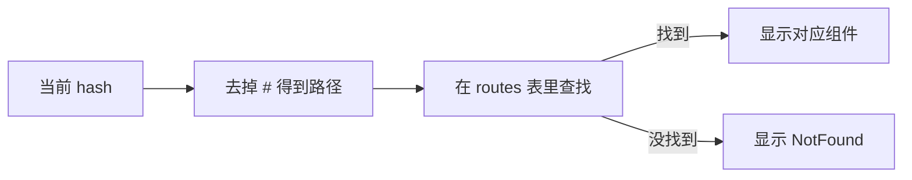
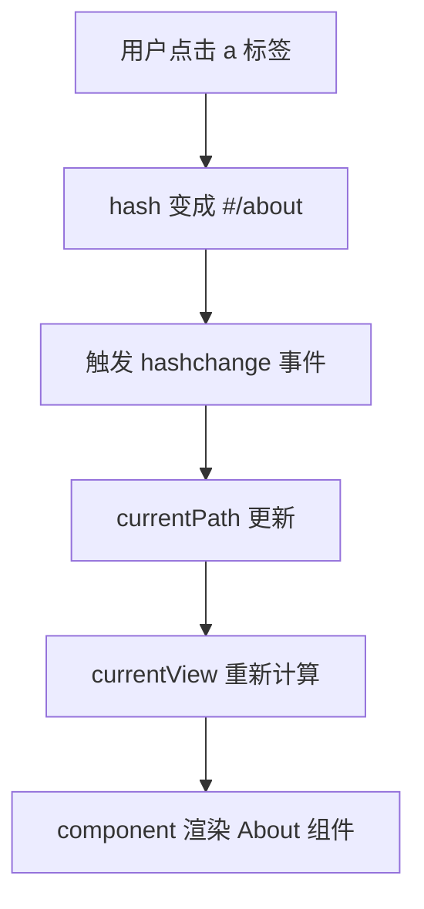
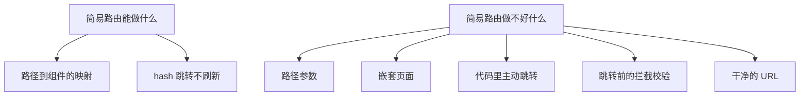

## 一、先想清楚路由器到底在做什么

上一章我们说过，客户端路由要回答三个问题：

```text
当前 URL 是什么？
根据这个 URL，显示哪个组件？
用户跳转时，怎么更新 URL 和内容？
```

如果用 hash 来记录当前页面，这三件事其实可以用很少的代码完成：

- 用 `window.location.hash` 读取当前 URL。
- 用一个对象记录"路径 → 组件"的对应关系。
- 用 `hashchange` 事件监听跳转，跳转时更新当前要显示的组件。

这一章我们就按这个思路，从零写一个能跑的简易路由器。

## 二、准备三个最简单的页面组件

先准备三个组件：首页、关于页、404 页。它们都是最普通的 Vue 组件，没有任何特殊的地方。

```vue
<!-- Home.vue -->
<script setup>
</script>

<template>
  <div>
    <h2>这是首页</h2>
    <p>欢迎来到我的小应用。</p>
  </div>
</template>
```

```vue
<!-- About.vue -->
<script setup>
</script>

<template>
  <div>
    <h2>这是关于页</h2>
    <p>这是一个用来演示手写路由的例子。</p>
  </div>
</template>
```

```vue
<!-- NotFound.vue -->
<script setup>
</script>

<template>
  <div>
    <h2>404</h2>
    <p>你访问的页面不存在。</p>
  </div>
</template>
```

注意，这三个组件本身完全不知道"路由"的存在。它们只负责显示内容。这是好事——**组件应该专注于展示，路由逻辑应该放在外面**。

## 三、核心思路：用一张表把路径和组件对应起来

路由器的核心，其实就是一张"路径 → 组件"的对照表：

```js
const routes = {
  '/': Home,
  '/about': About,
}
```

给定一个路径，从这张表里查出对应的组件；查不到就显示 404。



## 四、用动态组件显示当前页面

Vue 提供了一个内置组件 `<component :is="...">`，它可以"根据传入的组件动态渲染"。这正好符合我们的需求：当前显示哪个组件，由一个变量决定。

```vue
<template>
  <component :is="currentView" />
</template>
```

`currentView` 是什么，页面就显示什么组件。我们只需要在跳转时更新 `currentView` 即可。

## 五、完整代码：一个能跑的简易路由器

把上面的思路拼起来，完整的 `App.vue` 长这样：

```vue
<script setup>
import { ref, computed } from 'vue'
import Home from './Home.vue'
import About from './About.vue'
import NotFound from './NotFound.vue'

// 第一件事：路径和组件的对照表
const routes = {
  '/': Home,
  '/about': About,
}

// 第二件事：用一个 ref 记住当前 hash
const currentPath = ref(window.location.hash)

// 第三件事：监听 hash 变化，跳转时更新 currentPath
window.addEventListener('hashchange', () => {
  currentPath.value = window.location.hash
})

// 第四件事：根据当前路径，算出要显示的组件
const currentView = computed(() => {
  // hash 形如 "#/about"，去掉第一个字符 "#" 得到 "/about"
  // 如果 hash 为空（首次访问），默认走 "/"
  const path = currentPath.value.slice(1) || '/'
  return routes[path] || NotFound
})
</script>

<template>
  <div>
    <h1>我的简易路由应用</h1>

    <!-- 用 a 标签改 hash，href 以 # 开头不会刷新页面 -->
    <nav>
      <a href="#/">首页</a>
      |
      <a href="#/about">关于</a>
      |
      <a href="#/non-existent">一个不存在的页面</a>
    </nav>

    <main>
      <!-- 动态组件：currentView 是什么，就显示什么 -->
      <component :is="currentView" />
    </main>
  </div>
</template>
```

你可以把这段代码放到任意一个 Vue 3 项目里运行（比如用 Vite 创建的项目）。点击不同的链接，地址栏的 hash 会变，页面内容也会跟着变，但整个页面不会刷新。

## 六、逐行解释这段代码在做什么

### 1. 对照表

```js
const routes = {
  '/': Home,
  '/about': About,
}
```

这张表就是路由配置的雏形。后面用 Vue Router 时，你会看到它把这张表写得更强大，但本质一样：**把路径映射到组件**。

### 2. 记住当前 hash

```js
const currentPath = ref(window.location.hash)
```

`window.location.hash` 读取当前地址栏的 hash 部分。首次访问时如果地址是 `https://example.com/`，那 hash 是空字符串 `""`。

### 3. 监听跳转

```js
window.addEventListener('hashchange', () => {
  currentPath.value = window.location.hash
})
```

每当 hash 变化（用户点了链接，或者按了前进后退），`hashchange` 事件就会触发。我们在回调里把新的 hash 写进 `currentPath`。

### 4. 算出当前组件

```js
const currentView = computed(() => {
  const path = currentPath.value.slice(1) || '/'
  return routes[path] || NotFound
})
```

- `currentPath.value` 形如 `"#/about"`。
- `slice(1)` 去掉 `#`，得到 `"/about"`。
- 如果 hash 是空的（首次访问），`|| '/'` 让它默认走首页。
- `routes[path]` 查表，查不到就用 `NotFound` 兜底。

### 5. 模板里的链接和动态组件

```vue
<a href="#/">首页</a>
<a href="#/about">关于</a>
```

`href` 以 `#` 开头时，浏览器不会向服务器发请求，只会改变 hash，从而触发 `hashchange`。这就是"不刷新页面也能跳转"的关键。

```vue
<component :is="currentView" />
```

`currentView` 是一个计算属性，它的值会随 `currentPath` 自动更新。所以 hash 一变，`currentView` 就变，`<component>` 渲染的内容也就跟着变了。



## 七、跑通之后，你会发现自己缺了什么

这个简易路由器能跑，但只要你试着往真实项目里用，马上就会撞到一堵墙：

### 缺失 1：路径里没法带参数

你想做 `/users/123`、`/users/456` 这种地址，但我们的对照表只认死路径。要支持参数，你得自己写正则去匹配，自己提取 `123` 这个值。一旦路径多了，这会非常痛苦。

### 缺失 2：没法嵌套页面

真实页面经常是套娃结构：用户页里又有"资料"和"文章"两个子页。我们的简易路由只能平铺一层，没法表达"谁是谁的子页面"。

### 缺失 3：跳转只能靠 a 标签

很多时候你想在代码里主动跳转，比如"登录成功后跳到首页"、"提交表单后跳到结果页"。现在你只能写 `window.location.hash = '/home'`，既不优雅，也不好维护。

### 缺失 4：没有前进后退的精细控制

浏览器的前进后退按钮虽然能触发 `hashchange`，但如果你想做"离开页面前提示用户保存"这种功能，简易路由根本插不上手。

### 缺失 5：URL 不够好看

`https://example.com/#/about` 里的 `#` 总让人觉得别扭，而且对搜索引擎不友好。



## 八、这一章的意义：理解路由器的本质

写完这个简易路由器，你已经触碰到了路由器的本质：

```text
路由器 = 一张路径表 + 一个监听跳转的机制 + 一个根据路径显示组件的出口
```

Vue Router 看起来有很多 API，但它的核心骨架和你刚写的这段代码是一样的。它只是在这个骨架上，把参数匹配、嵌套、导航控制、历史模式这些事都做得很完善而已。

所以下一章开始用 Vue Router 时，你会发现：**概念全是熟的，只是工具更趁手了**。

## 九、学完这一章，你要记住这几句话

- 路由器的核心是"路径 → 组件"的对照表。
- `<component :is="...">` 是 Vue 用来动态显示组件的出口。
- `hashchange` 事件是监听 hash 跳转的关键。
- 简易路由能跑，但缺参数、缺嵌套、缺导航控制、URL 也不好看。
- Vue Router 在这个简易骨架上补齐了所有真实项目需要的能力。

## 练习

在你的简易路由器基础上，试着做这两件事：

1. 再加一个"联系我"页面，路径是 `/contact`。点击导航能在三个页面之间切换。

2. 试着把 404 页面也加进导航（那个"一个不存在的页面"链接）。点击它，确认页面显示的是 `NotFound` 组件，而不是白屏。

如果你做完发现"加页面就是往 routes 表里加一行而已"，那说明你已经理解路由配置的本质了。下一章我们就请出真正的主角——Vue Router。

参考链接：https://cn.vuejs.org/guide/scaling-up/routing.html
