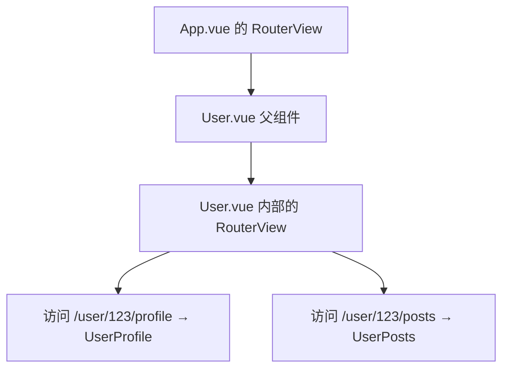
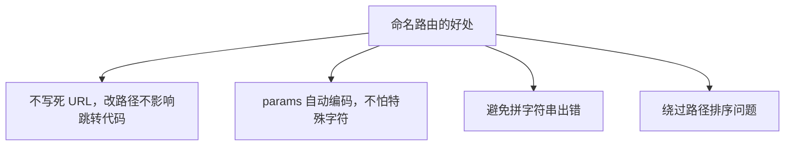

## 一、为什么需要嵌套路由

真实应用的页面经常是"套娃"结构。比如一个用户中心页面：

```text
/user/johnny/profile    用户 John 的「资料」子页
/user/johnny/posts      用户 John 的「文章」子页
```

这两个 URL 的结构告诉我们：它们都属于"用户页"这个大壳子，里面再切换"资料"和"文章"两个小标签。

```text
┌─────────────────────────┐
│ User 用户页（外壳）       │
│  ┌───────────────────┐  │
│  │ Profile / Posts   │  │  ← 子页在这里切换
│  │ （内容区）          │  │
│  └───────────────────┘  │
└─────────────────────────┘
```

如果用上一章的平铺路由，你得为每个子页单独配一条，而且没法共享那个"用户页外壳"。**嵌套路由**就是用来解决这个问题的：让一个路由内部再嵌套子路由，外壳组件保持不变，只切换内部内容。

## 二、嵌套路由怎么配置：children

在路由配置里，用 `children` 字段声明子路由。`children` 是一个数组，结构和外层 `routes` 完全一样：

```js
const routes = [
  {
    path: '/user/:id',
    component: User,
    children: [
      {
        // 匹配 /user/:id/profile
        // UserProfile 渲染在 User 内部的 <RouterView> 里
        path: 'profile',
        component: UserProfile,
      },
      {
        // 匹配 /user/:id/posts
        path: 'posts',
        component: UserPosts,
      },
    ],
  },
]
```

这里有个关键细节：**子路由的 path 不要以 `/` 开头**。

- `path: 'profile'`（正确）→ 拼接出 `/user/:id/profile`
- `path: '/profile'`（错误）→ 变成根路径 `/profile`，脱离了父路由

以 `/` 开头的路径会被当成绝对路径，就不再嵌套在父路径下了。

## 三、子路由渲染在哪里：父组件里的 `<RouterView>`

还记得第三章说过 `<RouterView>` 是路由出口吗？嵌套路由的关键就是：**父组件里也放一个 `<RouterView>`**，子路由的内容就会渲染在那里。

```vue
<!-- User.vue（父组件，外壳） -->
<template>
  <div class="user">
    <h2>用户 {{ $route.params.id }}</h2>

    <!-- 子路由的导航 -->
    <nav>
      <RouterLink :to="`/user/${$route.params.id}/profile`">资料</RouterLink>
      |
      <RouterLink :to="`/user/${$route.params.id}/posts`">文章</RouterLink>
    </nav>

    <!-- 子路由的内容显示在这里 -->
    <RouterView />
  </div>
</template>
```

整个渲染层级是这样的：



也就是说，嵌套路由会有**多个 `<RouterView>`**：最外层一个（在 `App.vue`），父组件里一个。每一层 `<RouterView>` 负责渲染对应层级的路由组件。

## 四、访问父路径时显示什么：空子路由

按上面的配置，访问 `/user/123`（不带 `/profile` 也不带 `/posts`）时，父组件 `User` 会显示，但它内部的 `<RouterView>` 里什么都没有，因为没有子路由匹配到。

如果你想在访问 `/user/123` 时默认显示某个子组件，加一条 `path` 为空字符串的子路由：

```js
const routes = [
  {
    path: '/user/:id',
    component: User,
    children: [
      // 匹配 /user/:id（不带后缀），UserHome 渲染在内部
      { path: '', component: UserHome },
      { path: 'profile', component: UserProfile },
      { path: 'posts', component: UserPosts },
    ],
  },
]
```

现在 `/user/123` 会显示 `User` 外壳 + `UserHome` 内容；`/user/123/profile` 显示 `User` 外壳 + `UserProfile` 内容。

## 五、一个完整例子：用户中心

```js
// src/router/index.js
import { createRouter, createWebHistory } from 'vue-router'
import User from '../views/User.vue'
import UserHome from '../views/UserHome.vue'
import UserProfile from '../views/UserProfile.vue'
import UserPosts from '../views/UserPosts.vue'

const routes = [
  {
    path: '/user/:id',
    component: User,
    children: [
      { path: '', component: UserHome },
      { path: 'profile', component: UserProfile },
      { path: 'posts', component: UserPosts },
    ],
  },
]

const router = createRouter({
  history: createWebHistory(),
  routes,
})

export default router
```

```vue
<!-- User.vue -->
<template>
  <div class="user">
    <h2>用户中心 - {{ $route.params.id }}</h2>
    <nav>
      <RouterLink :to="`/user/${$route.params.id}`">首页</RouterLink>
      |
      <RouterLink :to="`/user/${$route.params.id}/profile`">资料</RouterLink>
      |
      <RouterLink :to="`/user/${$route.params.id}/posts`">文章</RouterLink>
    </nav>
    <RouterView />
  </div>
</template>
```

```vue
<!-- UserHome.vue -->
<template><p>这是用户主页，请选择上方标签。</p></template>
```

```vue
<!-- UserProfile.vue -->
<template><p>这是 {{ $route.params.id }} 的资料。</p></template>
```

```vue
<!-- UserPosts.vue -->
<template><p>这是 {{ $route.params.id }} 发布的文章列表。</p></template>
```

访问试试：

| URL | 显示内容 |
|-----|---------|
| `/user/123` | User 外壳 + UserHome |
| `/user/123/profile` | User 外壳 + UserProfile |
| `/user/123/posts` | User 外壳 + UserPosts |

切换标签时，外壳 `User` 保持不变，只有内部的 `<RouterView>` 在换内容。

## 六、命名路由：给路由取个名字

到目前为止，我们跳转都靠写死路径字符串：

```vue
<RouterLink to="/user/123/profile">资料</RouterLink>
```

```js
router.push('/user/123/profile')
```

这有两个问题：

- 路径写死了，以后改路径得满项目找。
- 带参数时容易拼错，比如 `/user/${id}/profile` 漏个斜杠就 404。

**命名路由**就是给路由加个 `name`，然后用名字跳转，让 Vue Router 自己去拼路径：

```js
const routes = [
  {
    path: '/user/:username',
    name: 'profile',
    component: User,
  },
]
```

跳转时用 `name` + `params`：

```vue
<RouterLink :to="{ name: 'profile', params: { username: 'erina' } }">
  查看用户
</RouterLink>
```

```js
router.push({ name: 'profile', params: { username: 'erina' } })
```

这两种写法都会生成 `/user/erina`，而且参数会自动编码。

### 命名路由的好处



举个例子，路径以后从 `/user/:username` 改成 `/members/:username`，用名字跳转的代码一行都不用改，只改路由配置里的 `path` 就行。用路径字符串跳转的话，得全局搜索替换。

### 注意事项

- 所有路由的 `name` **必须唯一**。重名的话，路由器只认最后一条。
- 命名路由通常只给子路由命名，父路由可以不命名（除非你需要单独跳到父路由）。

## 七、嵌套路由 + 命名路由一起用

实际项目里这两个特性经常搭配。给上一节的用户中心加上命名路由：

```js
const routes = [
  {
    path: '/user/:id',
    component: User,
    children: [
      { path: '', name: 'user-home', component: UserHome },
      { path: 'profile', name: 'user-profile', component: UserProfile },
      { path: 'posts', name: 'user-posts', component: UserPosts },
    ],
  },
]
```

导航链接就可以用名字写，不再写死路径：

```vue
<!-- User.vue -->
<template>
  <div class="user">
    <h2>用户中心 - {{ $route.params.id }}</h2>
    <nav>
      <RouterLink :to="{ name: 'user-home', params: { id: $route.params.id } }">
        首页
      </RouterLink>
      |
      <RouterLink :to="{ name: 'user-profile', params: { id: $route.params.id } }">
        资料
      </RouterLink>
      |
      <RouterLink :to="{ name: 'user-posts', params: { id: $route.params.id } }">
        文章
      </RouterLink>
    </nav>
    <RouterView />
  </div>
</template>
```

代码里跳转也一样：

```js
import { useRouter } from 'vue-router'

const router = useRouter()

// 跳到某个用户的资料页
router.push({ name: 'user-profile', params: { id: '123' } })
```

## 八、忽略父组件：只借父子关系，不嵌套渲染

有时候你只是想给一组路由加个公共前缀，但不想真的渲染一个父外壳组件。比如所有后台路由都以 `/admin` 开头：

```js
const routes = [
  {
    path: '/admin',
    // 注意：没有 component
    children: [
      { path: '', component: AdminOverview },
      { path: 'users', component: AdminUserList },
      { path: 'users/:id', component: AdminUserDetails },
    ],
  },
]
```

父路由**省略 `component`**，这样顶层的 `<RouterView>` 会跳过父级，直接渲染子路由组件。这种写法适合用来分组、给一组路由加守卫或元信息（后续进阶内容会用到）。

## 九、学完这一章，你要记住这几句话

- 嵌套路由用 `children` 配置，子路由的 `path` 不要以 `/` 开头。
- 父组件里要放一个 `<RouterView>`，子路由内容渲染在那里。
- 想让父路径默认显示某个子组件，用 `path: ''` 的空子路由。
- 命名路由用 `name` 标识，跳转时用 `{ name, params }` 而不是写死路径。
- 路由名必须唯一；不想渲染父外壳就省略父路由的 `component`。

## 常见报错

### 报错 1：子路由内容不显示

**原因**：父组件里忘了写 `<RouterView />`。子路由匹配到了，但没有出口可以渲染。

**解决**：在父组件模板里加上 `<RouterView />`。

### 报错 2：子路由匹配不到，地址栏显示对的内容但页面不对

**原因**：子路由的 `path` 以 `/` 开头了，比如写成了 `path: '/profile'`，导致它变成了绝对路径 `/profile` 而不是 `/user/:id/profile`。

**解决**：子路由 `path` 去掉开头的 `/`，写成 `path: 'profile'`。

### 报错 3：`Duplicate named routes definition`

**原因**：两个路由用了相同的 `name`。

**解决**：检查所有路由的 `name`，确保唯一。可以用 `user-home`、`user-profile` 这种带前缀的命名方式避免冲突。

### 报错 4：用命名路由跳转后 URL 对了，但页面空白

**原因**：`params` 里的参数名和路由 `path` 里的冒号参数名不一致。比如 `path: '/user/:id'` 但跳转时传了 `params: { userId: '123' }`。

**解决**：参数名必须完全对应。`path` 里是 `:id`，`params` 里就必须是 `{ id: '123' }`。

## 练习

做一个"后台管理"风格的页面：

1. 路径 `/admin` 是后台外壳，左侧有"概览""用户列表""设置"三个导航。
2. 访问 `/admin` 默认显示概览页（用空子路由）。
3. `/admin/users` 显示用户列表，`/admin/settings` 显示设置页。
4. 给所有路由加上 `name`，导航链接全部用命名路由写，不要写死路径。
5. 在用户列表里加一个跳转按钮，点击后用 `router.push` 跳到某个用户的详情页 `/admin/users/:id`。

做完你会发现：外壳不变、内部切换，这正是嵌套路由最典型的用法。而命名路由让你改路径时不用动组件代码，维护起来轻松很多。

参考链接：https://router.vuejs.org/zh/guide/essentials/nested-routes.html
