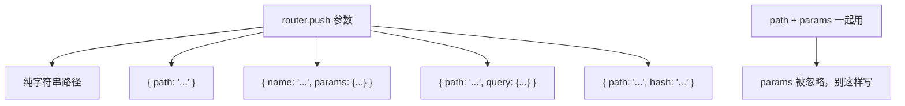
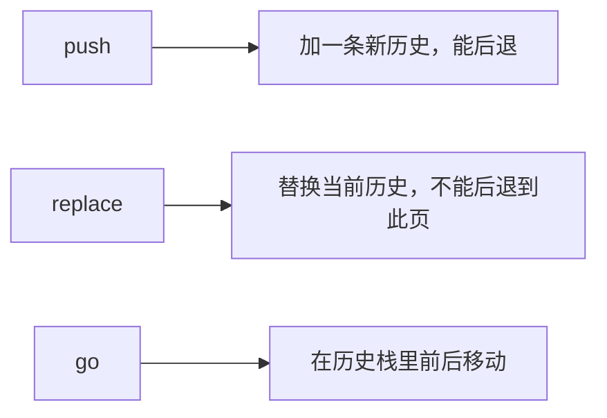
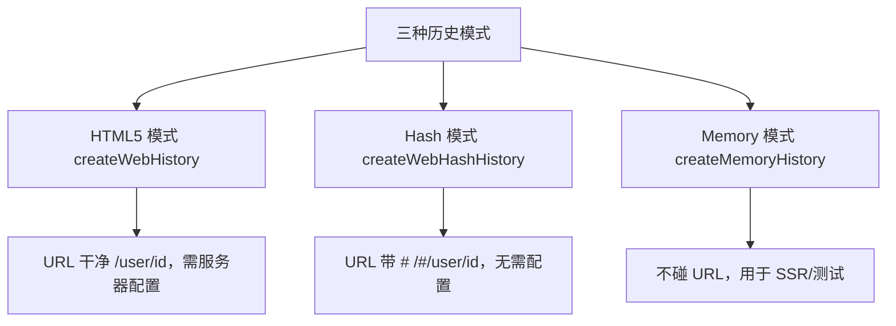

## 一、为什么需要"编程式导航"

前面几章我们跳转都靠 `<RouterLink>`，它渲染成一个 `<a>` 标签，用户点一下就跳。

但很多场景下，跳转不是"用户点链接"触发的，而是"代码执行到某一步"触发的：

- 登录成功后，自动跳到首页。
- 表单提交成功后，跳到结果页。
- 检测到用户没权限，跳到登录页。
- 点按钮执行一段逻辑后再跳。

这些都需要在 JavaScript 代码里主动发起跳转，这就叫**编程式导航**。

## 二、router.push：跳转到一个新位置

`router.push` 是最常用的导航方法。它会向浏览器的 history 栈添加一条新记录，所以用户点"后退"能回到跳转前的页面。

回想一下：你点击 `<RouterLink :to="...">` 时，内部其实就是调用了 `router.push(...)`。所以两者是等价的：

| 声明式 | 编程式 |
|--------|--------|
| `<RouterLink :to="...">` | `router.push(...)` |

`push` 的参数可以是一个字符串路径，也可以是一个描述地址的对象：

```js
import { useRouter } from 'vue-router'

const router = useRouter()

// 1. 字符串路径
router.push('/users/eduardo')

// 2. 带路径的对象
router.push({ path: '/users/eduardo' })

// 3. 命名路由 + 参数（推荐）
router.push({ name: 'user', params: { username: 'eduardo' } })

// 4. 带查询参数，结果是 /register?plan=private
router.push({ path: '/register', query: { plan: 'private' } })

// 5. 带 hash，结果是 /about#team
router.push({ path: '/about', hash: '#team' })
```

### 一个容易踩的坑：path 和 params 不能一起用

如果你同时给了 `path` 和 `params`，`params` 会被忽略：

```js
const username = 'eduardo'

// ✅ 手动拼接路径
router.push(`/user/${username}`)           // → /user/eduardo
router.push({ path: `/user/${username}` }) // → /user/eduardo

// ✅ 用 name + params，自动编码
router.push({ name: 'user', params: { username } }) // → /user/eduardo

// ❌ path 和 params 一起用，params 被忽略
router.push({ path: '/user', params: { username } }) // → /user（不是 /user/eduardo）
```

规则很简单：**要用 `params`，就必须用 `name`，不能用 `path`**。



## 三、router.replace：替换当前位置，不留历史

`router.replace` 和 `push` 用法完全一样，唯一区别是：**它不会往 history 栈里加新记录，而是替换掉当前记录**。

效果上的差别：用户点"后退"时，**不会**回到 replace 之前的那个页面。

| 声明式 | 编程式 |
|--------|--------|
| `<RouterLink :to="..." replace>` | `router.replace(...)` |

典型场景：登录页。用户登录成功后，不应该点"后退"又回到登录页，所以用 `replace` 跳到首页：

```js
async function handleLogin() {
  await login(form)
  // 用 replace，后退时不会回到登录页
  router.replace('/')
}
```

也可以在 `push` 里加 `replace: true`，效果一样：

```js
router.push({ path: '/', replace: true })
// 等价于
router.replace({ path: '/' })
```

## 四、router.go：在历史栈里前进后退

`router.go(n)` 接受一个整数，表示在历史栈里前进或后退多少步，和 `window.history.go(n)` 一样：

```js
// 后退一步，等价于 router.back()
router.go(-1)

// 前进一步，等价于 router.forward()
router.go(1)

// 前进 3 步
router.go(3)

// 如果没有那么多记录，静默失败，不会报错
router.go(-100)
router.go(100)
```

三个方法对比：



## 五、一个综合例子：登录后跳转

把三个方法用到一个真实的登录流程里：

```vue
<!-- Login.vue -->
<script setup>
import { ref } from 'vue'
import { useRouter } from 'vue-router'

const router = useRouter()
const username = ref('')
const password = ref('')
const errorMsg = ref('')

async function handleSubmit() {
  try {
    // 假装发登录请求
    await fakeLogin(username.value, password.value)

    // 登录成功，replace 到首页（不留登录页历史）
    router.replace({ name: 'home' })
  } catch (e) {
    errorMsg.value = '用户名或密码错误'
  }
}

// 模拟登录接口
function fakeLogin(u, p) {
  return new Promise((resolve, reject) => {
    setTimeout(() => {
      if (u === 'admin' && p === '123456') resolve()
      else reject(new Error('登录失败'))
    }, 500)
  })
}
</script>

<template>
  <form @submit.prevent="handleSubmit">
    <input v-model="username" placeholder="用户名" />
    <input v-model="password" type="password" placeholder="密码" />
    <button type="submit">登录</button>
    <p v-if="errorMsg" style="color: red">{{ errorMsg }}</p>
  </form>
</template>
```

## 六、三种历史记录模式

还记得第一章提到的两种改 URL 的方式吗（hash 和 History API）？Vue Router 把它们封装成了三种"历史模式"，在 `createRouter` 时通过 `history` 选项选择。

### 1. HTML5 模式（推荐）

用 `createWebHistory()` 创建，URL 长得最干净：

```js
import { createRouter, createWebHistory } from 'vue-router'

const router = createRouter({
  history: createWebHistory(),
  routes: [],
})
```

URL 形如 `https://example.com/user/id`，没有 `#`，好看且对 SEO 友好。

**但有一个坑**：因为 URL 看起来就是普通路径，用户直接在地址栏访问 `https://example.com/user/id` 时，浏览器会真的向服务器请求这个路径。如果服务器没配置好，就会返回 404。

解决方法是：**在服务器上加一条"找不到资源就回退到 index.html"的规则**。下一节会给出常见服务器的配置。

### 2. Hash 模式

用 `createWebHashHistory()` 创建，URL 里带一个 `#`：

```js
import { createRouter, createWebHashHistory } from 'vue-router'

const router = createRouter({
  history: createWebHashHistory(),
  routes: [],
})
```

URL 形如 `https://example.com/#/user/id`。`#` 后面的部分不会发送到服务器，所以不需要服务器配置，部署最省事。

缺点是 URL 不好看，而且对 SEO 有影响（搜索引擎可能把 hash 后的内容忽略掉）。

### 3. Memory 模式

用 `createMemoryHistory()` 创建，**不与 URL 交互**，路由状态只存在于内存里：

```js
import { createRouter, createMemoryHistory } from 'vue-router'

const router = createRouter({
  history: createMemoryHistory(),
  routes: [],
})
```

这种模式主要用于 SSR（服务端渲染）或测试环境。在浏览器里用它的话，地址栏不会变，也没有历史记录，不能前进后退。一般用不到。

### 三种模式对比



| 模式 | URL 样子 | 需要服务器配置 | SEO | 适用场景 |
|------|---------|--------------|-----|---------|
| HTML5 | `/user/id` | 需要 | 好 | 大多数项目（推荐） |
| Hash | `/#/user/id` | 不需要 | 弱 | 简单部署、无后端 |
| Memory | （不变） | 不需要 | 无 | SSR、测试 |

## 七、HTML5 模式的服务器配置

如果你用了 `createWebHistory()`，部署时必须配置服务器，让所有未命中静态资源的请求都回退到 `index.html`。下面是常见服务器的配置示例。

### nginx

```nginx
location / {
  try_files $uri $uri/ /index.html;
}
```

### Vercel

在项目根目录创建 `vercel.json`：

```json
{
  "rewrites": [{ "source": "/:path*", "destination": "/index.html" }]
}
```

### Netlify

在 `public` 或 `static` 目录下创建 `_redirects` 文件：

```
/* /index.html 200
```

### Apache

```apache
<IfModule mod_rewrite.c>
  RewriteEngine On
  RewriteBase /
  RewriteRule ^index\.html$ - [L]
  RewriteCond %{REQUEST_FILENAME} !-f
  RewriteCond %{REQUEST_FILENAME} !-d
  RewriteRule . /index.html [L]
</IfModule>
```

### Node.js（Express）

可以使用 [`connect-history-api-fallback`](https://github.com/bripkens/connect-history-api-fallback) 中间件。

配置好之后，不管用户访问 `/`、`/about` 还是 `/users/123`，服务器都会返回 `index.html`，剩下的路由匹配交给前端的 Vue Router 处理。

### 一个重要提醒：404 要在前端处理

服务器回退到 `index.html` 后，所有路径都返回 200，服务器不再报告 404。所以**404 页面必须在前端用兜底路由实现**：

```js
const router = createRouter({
  history: createWebHistory(),
  routes: [
    // ...其他路由
    { path: '/:pathMatch(.*)*', name: 'NotFound', component: NotFound },
  ],
})
```

这样访问一个不存在的路径，前端会显示 404 页面，而不是白屏。

## 八、RouterLink 的几个实用用法

最后补充几个 `<RouterLink>` 的常用写法，因为声明式导航还是最常用的。

### 1. 用对象代替字符串

`to` 属性和 `router.push` 接受的参数完全一样，所以也可以用对象：

```vue
<RouterLink :to="{ name: 'user', params: { id: '123' } }">用户</RouterLink>
<RouterLink :to="{ path: '/register', query: { plan: 'private' } }">注册</RouterLink>
```

### 2. replace 模式

加 `replace` 属性，等价于 `router.replace`：

```vue
<RouterLink to="/home" replace>回首页（不留历史）</RouterLink>
```

### 3. 自定义 class（激活状态）

当当前 URL 匹配某个 `<RouterLink>` 时，Vue Router 会自动给它加上激活 class，方便你做高亮：

```vue
<RouterLink to="/about" active-class="active">关于</RouterLink>
```

```css
.active {
  color: red;
  font-weight: bold;
}
```

## 九、学完这一章，你要记住这几句话

- `router.push` 加历史、`router.replace` 替换历史、`router.go` 前后移动。
- `push`/`replace` 的参数可以是字符串路径，也可以是 `{ path }` 或 `{ name, params }` 对象。
- 用 `params` 必须配 `name`，不能配 `path`，否则 params 会被忽略。
- 三种历史模式：HTML5（干净，需服务器配置，推荐）、Hash（带 #，免配置）、Memory（SSR/测试用）。
- 用 HTML5 模式必须配置服务器回退到 `index.html`，并在前端配 404 兜底路由。

## 常见报错

### 报错 1：刷新页面后 404（HTML5 模式）

**原因**：用了 `createWebHistory()` 但服务器没配置回退。

**解决**：按本章第七节配置服务器（nginx/Vercel/Netlify 等），让未命中的路径回退到 `index.html`。本地开发时 Vite 已经处理好了，一般只有部署后才出现这个问题。

### 报错 2：`router.push({ path: '/user', params: { id: '1' } })` 参数没生效

**原因**：`path` 和 `params` 一起用，`params` 被忽略了。

**解决**：要么用 `name` + `params`，要么手动拼路径：

```js
router.push({ name: 'user', params: { id: '1' } })
// 或
router.push(`/user/1`)
```

### 报错 3：`router.replace` 后点后退还是回到了原页面

**原因**：你可能误用了 `push` 而不是 `replace`，或者 `replace` 写成了 `push` 的对象形式但没加 `replace: true`。

**解决**：确认用的是 `router.replace(...)` 或 `router.push({ ..., replace: true })`。

### 报错 4：Hash 模式下 URL 多了一层 `#`

**原因**：`createWebHashHistory()` 本身就会产生 `/#/user` 的形式，如果你又手动写了 `#/user`，就会出现 `/#/#/user`。

**解决**：Hash 模式下，`<RouterLink to="/user">` 里的 `to` 只写 `/user`，不要自己加 `#`，Vue Router 会自动处理。

## 练习

做一个"模拟登录 + 跳转"的小流程：

1. 有一个登录页 `/login`，输入用户名密码，点击登录。
2. 登录"成功"（可以用 `setTimeout` 模拟）后，用 `router.replace` 跳到首页 `/`，确保点后退不会回到登录页。
3. 首页有一个"退出登录"按钮，点击后用 `router.push` 跳回登录页。
4. 把历史模式改成 `createWebHistory()`，本地跑一下没问题；然后试着用 `npm run build` 打包后用某个静态服务器预览，观察直接访问 `/login` 会不会 404（这能帮你理解为什么需要服务器配置）。

做完这个练习，编程式导航和历史模式的搭配你就彻底理清了。

## 系列总结

到这里，Vue Router 路由入门系列就结束了。回顾一下你走过的路：

```text
第一章  搞清楚客户端路由是什么、SPA 为什么需要路由
第二章  手写一个简易路由器，理解路由的本质
第三章  用 Vue Router 跑通第一个应用，认识三件套
第四章  动态路由匹配，用 :params 让一个模板服务无数 URL
第五章  嵌套路由与命名路由，组织复杂页面结构
第六章  编程式导航与历史记录模式，让导航可控、部署可配
```

你现在具备了从零搭建一个 Vue 单页应用路由系统的能力。后续如果要做更进阶的事（导航守卫做权限、路由懒加载优化性能、滚动行为、过渡动效），都有了足够的概念基础。官方文档的"进阶"章节就是你的下一站。

参考链接：https://router.vuejs.org/zh/guide/essentials/navigation.html
