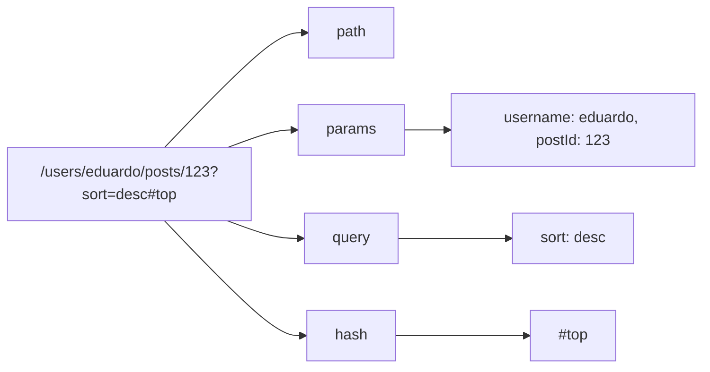
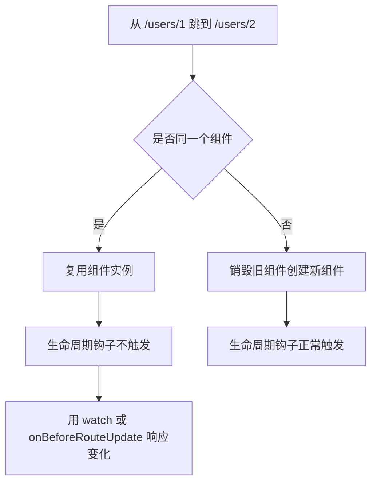
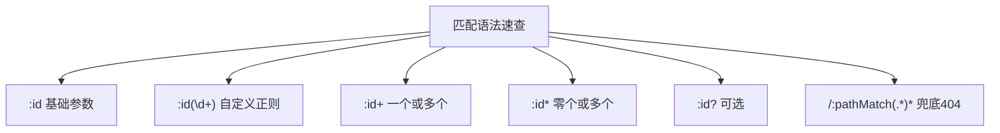

## 一、为什么需要动态路由

假设你要做一个用户详情页，每个用户都有自己的页面。如果按上一章的做法，你得为每个用户配一条路由：

```js
const routes = [
  { path: '/users/1', component: UserDetail },
  { path: '/users/2', component: UserDetail },
  { path: '/users/3', component: UserDetail },
  // ...一千个用户写一千条？
]
```

这显然不现实。其实这些页面用的是**同一个组件**，只是展示的数据不同。我们需要的是一种"模式匹配"：用一个模板路径，匹配一类 URL。

这就是**动态路由匹配**要做的事。

```text
/users/1   ─┐
/users/2   ─┼──> 都匹配 /users/:id，用同一个 UserDetail 组件
/users/abc ─┘
```

## 二、路径参数：用冒号定义动态字段

在 Vue Router 里，路径中以冒号 `:` 开头的部分叫**路径参数**。它像一个"占位符"，能匹配 URL 中对应位置的任意值。

```js
const routes = [
  // :id 是路径参数，能匹配 /users/1、/users/abc、/users/任意值
  { path: '/users/:id', component: UserDetail },
]
```

现在 `/users/johnny`、`/users/jolyne`、`/users/123` 都会匹配到这条路由，渲染同一个 `UserDetail` 组件。

### 读取参数：route.params

当路由被匹配时，参数的值会出现在 `route.params` 上。参数名就是冒号后面的那个名字：

```vue
<!-- UserDetail.vue -->
<script setup>
import { useRoute } from 'vue-router'

const route = useRoute()
</script>

<template>
  <div>
    <!-- 访问 /users/123 时，route.params.id 的值是 "123" -->
    <h2>用户详情</h2>
    <p>当前用户 ID：{{ route.params.id }}</p>
  </div>
</template>
```

也可以在模板里直接用 `$route`：

```vue
<template>
  <p>用户 ID：{{ $route.params.id }}</p>
</template>
```

## 三、一个路径里可以有多个参数

参数不限于一个，路径里可以有好几个冒号参数，它们会分别映射到 `route.params` 的对应字段：

```js
const routes = [
  { path: '/users/:username/posts/:postId', component: UserPost },
]
```

匹配关系是这样的：

| 匹配模式 | 匹配的 URL | route.params |
|---------|-----------|--------------|
| `/users/:username` | `/users/eduardo` | `{ username: 'eduardo' }` |
| `/users/:username/posts/:postId` | `/users/eduardo/posts/123` | `{ username: 'eduardo', postId: '123' }` |

```vue
<!-- UserPost.vue -->
<template>
  <div>
    <p>用户：{{ $route.params.username }}</p>
    <p>文章编号：{{ $route.params.postId }}</p>
  </div>
</template>
```

注意，`params` 里的值**都是字符串**。即使你访问 `/users/123`，`route.params.id` 也是字符串 `"123"` 而不是数字 `123`。需要数字时自己转换：`Number(route.params.id)`。

## 四、route 对象上还有哪些信息

除了 `route.params`，`route` 对象还暴露了一组有用的信息：

```js
route.path        // "/users/eduardo/posts/123"
route.fullPath    // "/users/eduardo/posts/123?sort=desc#top"
route.params      // { username: 'eduardo', postId: '123' }
route.query       // { sort: 'desc' }（URL 中 ? 后面的查询参数）
route.hash        // "#top"（URL 中 # 后面的部分）
route.name        // 路由的名字（下一章讲）
route.matched     // 匹配到的所有路由记录（嵌套路由时会用到）
```

其中 `route.query` 特别常用，它对应 URL 里 `?` 后面的查询参数：

```text
/users/123?sort=desc&tab=posts
      ↑      ↑
   params    query：{ sort: 'desc', tab: 'posts' }
```



## 五、一个关键陷阱：参数变了，但组件不会重新创建

这是动态路由最容易踩的坑，一定要理解。

当用户从 `/users/1` 跳到 `/users/2` 时，两个 URL 匹配的是**同一个路由**，渲染的是**同一个组件**（`UserDetail`）。Vue Router 为了效率，会**复用同一个组件实例**，而不是销毁旧的再创建新的。

这意味着：**组件的生命周期钩子（`onMounted` 等）不会再次触发**。

```vue
<!-- ❌ 这样写有问题 -->
<script setup>
import { onMounted } from 'vue'
import { useRoute } from 'vue-router'

const route = useRoute()

onMounted(() => {
  // 从 /users/1 跳到 /users/2 时，这里不会再次执行！
  // 因为组件没有被销毁重建，只是参数变了
  console.log('加载用户数据', route.params.id)
})
</script>
```

### 解决方法 1：用 watch 监听参数变化

```vue
<script setup>
import { watch } from 'vue'
import { useRoute } from 'vue-router'

const route = useRoute()

// 每当 route.params.id 变化时，重新加载数据
watch(
  () => route.params.id,
  (newId, oldId) => {
    console.log(`用户从 ${oldId} 变成了 ${newId}，重新加载`)
    // 这里发请求拉取新用户的数据
  }
)
</script>
```

`watch` 的第一个参数是一个函数 `() => route.params.id`，返回要监听的值。当这个值变化时，回调就会执行。

### 解决方法 2：用 beforeRouteUpdate 导航守卫

```vue
<script setup>
import { onBeforeRouteUpdate } from 'vue-router'

// 在路由参数变化、但复用同一组件时触发
onBeforeRouteUpdate(async (to, from) => {
  // to.params.id 是新的 id
  // from.params.id 是旧的 id
  console.log(`从 ${from.params.id} 切到 ${to.params.id}`)
  // 在这里拉取新数据
})
</script>
```



## 六、捕获所有路由：404 页面怎么配

用户难免会访问一个不存在的地址，比如 `/asdfgh`。如果不做处理，Vue Router 会报警告。我们需要一条"兜底"路由，匹配所有未命中的 URL。

关键语法是在参数后面加自定义正则 `(.*)`，并加上 `*` 表示可重复：

```js
const routes = [
  { path: '/', component: Home },
  { path: '/about', component: About },
  { path: '/users/:id', component: UserDetail },

  // 兜底路由：匹配所有路径，必须放在最后
  { path: '/:pathMatch(.*)*', name: 'NotFound', component: NotFound },
]
```

`/:pathMatch(.*)*` 的含义是：把整个路径的每一段都捕获到 `route.params.pathMatch` 里（一个数组）。

```vue
<!-- NotFound.vue -->
<template>
  <div>
    <h2>404 - 页面不存在</h2>
    <p>你访问的路径：{{ $route.params.pathMatch }}</p>
    <p>访问 /a/b/c 时，pathMatch 是 ["a", "b", "c"]</p>
  </div>
</template>
```

**这条兜底路由必须放在 `routes` 数组的最后**，因为 Vue Router 会按顺序匹配，前面的都匹配不上才会落到兜底这条。

## 七、高级匹配语法：让路由更精准

路径参数默认会匹配"两个斜杠之间的任意字符"。但有时你需要更精细的控制，Vue Router 支持几种高级语法。

### 1. 自定义正则：区分不同类型的参数

假设你有两个路由：`/:orderId`（订单号，纯数字）和 `/:productName`（商品名，任意字符）。它们会匹配相同的 URL，怎么区分？

在参数后面用括号加正则：

```js
const routes = [
  // /:orderId 只匹配数字，比如 /123
  { path: '/:orderId(\\d+)' },
  // /:productName 匹配其他，比如 /books
  { path: '/:productName' },
]
```

现在访问 `/123` 会匹配第一条（订单），访问 `/books` 会匹配第二条（商品）。

注意：JS 字符串里反斜杠要转义，所以正则里的 `\d` 要写成 `\\d`。

### 2. 可重复参数：匹配多段路径

用 `+`（一个或多个）或 `*`（零个或多个）让参数匹配多段：

```js
const routes = [
  // /:chapters+ 匹配 /one、/one/two、/one/two/three（至少一段）
  { path: '/:chapters+' },
  // /:chapters* 匹配 /、/one、/one/two（可以为空）
  { path: '/:chapters*' },
]
```

这时 `route.params.chapters` 是一个数组：

```text
访问 /a/b/c → route.params.chapters = ['a', 'b', 'c']
```

### 3. 可选参数：用问号

用 `?` 让参数可选（0 个或 1 个）：

```js
const routes = [
  // 匹配 /users 和 /users/posva
  { path: '/users/:userId?' },
]
```

### 4. strict 和 sensitive：严格匹配

默认情况下，路由不区分大小写，也允许路径末尾带斜杠。比如 `/users` 会匹配 `/users`、`/users/`、`/Users/`。

```js
const router = createRouter({
  history: createWebHistory(),
  routes: [
    // sensitive: true → 区分大小写，/Users 不再匹配
    { path: '/users/:id', sensitive: true },
  ],
  // strict: true → 全局严格，末尾斜杠不再被忽略
  strict: true,
})
```



## 八、一个完整的小例子

把这一章的知识揉到一起，做一个能看用户、看文章、有 404 的小应用：

```js
// src/router/index.js
import { createRouter, createWebHistory } from 'vue-router'
import Home from '../views/Home.vue'
import UserDetail from '../views/UserDetail.vue'
import UserPost from '../views/UserPost.vue'
import NotFound from '../views/NotFound.vue'

const routes = [
  { path: '/', component: Home },
  { path: '/users/:id', component: UserDetail },
  { path: '/users/:username/posts/:postId', component: UserPost },
  { path: '/:pathMatch(.*)*', name: 'NotFound', component: NotFound },
]

const router = createRouter({
  history: createWebHistory(),
  routes,
})

export default router
```

```vue
<!-- UserDetail.vue -->
<script setup>
import { ref, watch } from 'vue'
import { useRoute } from 'vue-router'

const route = useRoute()
const userInfo = ref(null)

// 监听 id 变化，重新"加载"用户数据
watch(
  () => route.params.id,
  (newId) => {
    // 这里假装发请求，实际项目用 fetch/axios
    userInfo.value = { id: newId, name: `用户${newId}` }
  },
  { immediate: true }  // immediate: 一进入页面也执行一次
)
</script>

<template>
  <div v-if="userInfo">
    <h2>用户详情</h2>
    <p>ID：{{ userInfo.id }}</p>
    <p>姓名：{{ userInfo.name }}</p>
    <RouterLink :to="`/users/${userInfo.id}/posts/1`">查看第一篇文章</RouterLink>
  </div>
</template>
```

```vue
<!-- NotFound.vue -->
<template>
  <div>
    <h2>404</h2>
    <p>找不到这个页面。</p>
    <RouterLink to="/">回首页</RouterLink>
  </div>
</template>
```

试着访问这些地址，看看效果：

- `/` → 首页
- `/users/123` → 用户详情，ID 显示 123
- `/users/123/posts/45` → 文章页，用户名 123、文章号 45
- `/乱打的` → 404 页面

## 九、学完这一章，你要记住这几句话

- 路径参数用冒号 `:id` 定义，能匹配 URL 对应位置的任意值，值存在 `route.params` 里。
- `params` 里的值都是字符串，需要数字要自己转换。
- 同一个组件匹配不同参数时，组件会被复用，生命周期钩子不会重新触发，要用 `watch` 或 `onBeforeRouteUpdate` 响应参数变化。
- 404 兜底路由用 `/:pathMatch(.*)*`，必须放在路由表最后。
- 高级匹配语法：正则 `(\d+)`、可重复 `+`/`*`、可选 `?`、严格 `strict`/`sensitive`。

## 常见报错

### 报错 1：`No match found for location with path "/xxx"`

**原因**：访问的路径在路由表里没有匹配项，也没有配 404 兜底路由。

**解决**：在路由表最后加一条 `{ path: '/:pathMatch(.*)*', component: NotFound }`。

### 报错 2：从 `/users/1` 跳到 `/users/2`，页面数据没更新

**原因**：两个 URL 匹配同一个组件，组件被复用，`onMounted` 没有再次触发。

**解决**：用 `watch(() => route.params.id, ...)` 监听参数变化，在回调里重新加载数据。

### 报错 3：`route.params.id` 是 `undefined`

**原因**：当前路由配置里没有 `:id` 这个参数，或者你访问的 URL 段落和参数对不上。

**解决**：检查路由配置的 `path` 里冒号参数名，和读取时用的 `route.params.名字` 是否一致。

## 练习

做一个"文章浏览"小应用：

1. 路径 `/posts/:id` 显示某篇文章，组件里读取 `route.params.id` 并显示"这是第 X 篇文章"。
2. 路径 `/posts/:id/comments/:commentId` 显示某篇文章的某条评论，读取两个参数并都显示出来。
3. 配一个 404 路由，访问不存在的路径时提示"找不到页面"并给出回首页的链接。
4. 在文章页里加一个 `watch`，当 `id` 变化时在控制台打印"切换到了文章 X"（验证从 `/posts/1` 跳到 `/posts/2` 时 watch 会触发）。

做完这个练习，动态路由匹配你就真的上手了。

参考链接：https://router.vuejs.org/zh/guide/essentials/dynamic-matching.html
