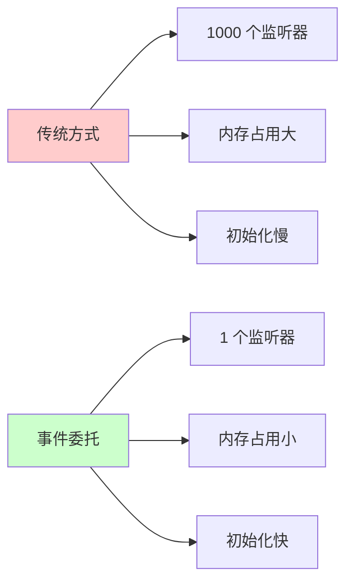

扫描 [二维码](https://api2.cmdragon.cn/upload/cmder/20250304_012821924.jpg) 关注或者微信搜一搜：`编程智域 前端至全栈交流与成长`

[发现 1000+ 提升效率与开发的 AI 工具和实用程序](https://tools.cmdragon.cn/zh/apps?category=ai_chat)：<https://tools.cmdragon.cn/>

## 1. 事件处理基础回顾

在 Vue3 开发中，事件处理是我们每天都要打交道的核心功能。无论是简单的按钮点击，还是复杂的表单提交，事件处理都贯穿始终。但你是否想过，为什么有时候页面会卡顿？为什么频繁触发的事件会让应用变得缓慢？今天我们就来深入探讨 Vue3 中事件处理的性能优化与最佳实践。

### 1.1 内联处理器 vs 方法处理器

Vue3 提供了两种事件处理方式：内联处理器和方法处理器。它们各有适用场景，选择得当能提升代码的可维护性和性能。

```vue
<template>
  <!-- 内联处理器：适合简单逻辑 -->
  <button @click="count++">计数 +1</button>

  <!-- 方法处理器：适合复杂逻辑 -->
  <button @click="handleSubmit">提交表单</button>
</template>

<script setup>
import { ref } from "vue";

const count = ref(0);

function handleSubmit() {
  // 复杂的表单处理逻辑
  console.log("处理提交");
}
</script>
```

**性能对比：**

- 内联处理器会在每次渲染时重新创建函数，适合简单操作
- 方法处理器只创建一次，性能更优，适合复杂逻辑

### 1.2 传递参数与事件对象

实际开发中，我们经常需要同时传递自定义参数和原生事件对象：

```vue
<template>
  <!-- 方式 1：使用 $event 变量 -->
  <button @click="handleClick('item1', $event)">点击我</button>

  <!-- 方式 2：使用箭头函数 -->
  <button @click="(event) => handleClick('item2', event)">点击我</button>
</template>

<script setup>
function handleClick(itemId, event) {
  console.log("Item ID:", itemId);
  console.log("Event:", event);
  console.log("目标元素:", event.target);
}
</script>
```

**注意事项：**

- `$event`必须放在参数的最后位置
- 箭头函数方式更灵活，可以调整参数顺序
- 避免在内联处理器中写复杂逻辑

## 2. 事件修饰符的正确使用

事件修饰符是 Vue 提供的强大工具，能让我们用声明式的方式处理常见的 DOM 事件操作。

### 2.1 常用修饰符详解

```vue
<template>
  <!-- 阻止事件冒泡 -->
  <div @click="handleParent">
    <button @click.stop="handleChild">停止冒泡</button>
  </div>

  <!-- 阻止默认行为 -->
  <a @click.prevent="handleLink">链接</a>

  <!-- 只在事件目标是自身时触发 -->
  <div @click.self="handleDiv">
    <button>子按钮</button>
  </div>

  <!-- 只触发一次 -->
  <button @click.once="handleOnce">只执行一次</button>

  <!-- 使用捕获模式 -->
  <div @click.capture="handleCapture">
    <button>捕获模式</button>
  </div>

  <!-- 被动监听器（优化滚动性能） -->
  <div @scroll.passive="handleScroll">滚动区域</div>
</template>

<script setup>
function handleParent() {
  console.log("父元素被点击");
}

function handleChild() {
  console.log("子元素被点击");
}

function handleLink() {
  console.log("链接被点击，不会跳转");
}

function handleSelf() {
  console.log("只有点击 div 本身才会触发");
}

function handleOnce() {
  console.log("这个只会执行一次");
}

function handleCapture() {
  console.log("捕获模式：先于子元素触发");
}

function handleScroll() {
  console.log("滚动事件");
}
</script>
```

### 2.2 修饰符顺序的重要性

修饰符的顺序会影响最终的行为，这是个容易被忽视的细节：

```vue
<template>
  <!-- 先阻止冒泡，再阻止默认行为 -->
  <a @click.stop.prevent="handleLink">顺序 1</a>

  <!-- 先阻止默认行为，再阻止冒泡 -->
  <a @click.prevent.stop="handleLink">顺序 2</a>
</template>
```

虽然大多数情况下顺序不影响结果，但为了代码可读性，建议保持一致的顺序习惯。

### 2.3 键盘修饰符

处理键盘事件时，修饰符能让代码更简洁：

```vue
<template>
  <!-- Enter 键提交 -->
  <input @keyup.enter="submit" />

  <!-- Esc 键取消 -->
  <input @keyup.esc="cancel" />

  <!-- 组合键：Ctrl + S 保存 -->
  <input @keydown.ctrl.s="save" />

  <!-- 精确匹配：只按 Ctrl，不按其他键 -->
  <button @click.ctrl.exact="handleCtrl">仅 Ctrl</button>
</template>

<script setup>
function submit() {
  console.log("提交表单");
}

function cancel() {
  console.log("取消操作");
}

function save() {
  console.log("保存数据");
}

function handleCtrl() {
  console.log("只按下了 Ctrl 键");
}
</script>
```

**常用键盘别名：**

- `.enter` - 回车键
- `.tab` - 制表键
- `.delete` - 删除键（包含 Backspace）
- `.esc` - 退出键
- `.space` - 空格键
- `.up`、`.down`、`.left`、`.right` - 方向键

## 3. 高频事件的防抖与节流

当处理滚动、窗口调整大小、输入等高频触发的事件时，如果不加控制，会导致性能问题。

### 3.1 防抖（Debounce）实现

防抖确保函数在一段时间内只执行一次，适用于搜索框输入、窗口大小调整等场景：

```vue
<template>
  <input
    v-model="searchQuery"
    @input="handleSearch"
    placeholder="输入搜索内容"
  />
  <p>搜索结果：{{ searchResult }}</p>
</template>

<script setup>
import { ref } from "vue";

const searchQuery = ref("");
const searchResult = ref("");

// 防抖函数实现
function debounce(fn, delay = 300) {
  let timer = null;
  return function (...args) {
    if (timer) clearTimeout(timer);
    timer = setTimeout(() => {
      fn.apply(this, args);
    }, delay);
  };
}

// 创建防抖后的搜索函数
const handleSearch = debounce((event) => {
  const query = event.target.value;
  console.log("执行搜索:", query);
  // 模拟 API 调用
  setTimeout(() => {
    searchResult.value = `搜索结果：${query}`;
  }, 100);
}, 500);
</script>
```

**防抖的特点：**

- 连续触发时，只有最后一次触发会执行
- 适用于需要等待用户操作完成的场景
- 默认延迟 300-500ms 比较合适

### 3.2 节流（Throttle）实现

节流确保函数在指定时间间隔内只执行一次，适用于滚动监听、鼠标移动等场景：

```vue
<template>
  <div class="scroll-container" @scroll="handleScroll">
    <div v-for="i in 100" :key="i" class="item">内容项 {{ i }}</div>
  </div>
  <p>滚动位置：{{ scrollPosition }}</p>
</template>

<script setup>
import { ref } from "vue";

const scrollPosition = ref(0);

// 节流函数实现
function throttle(fn, delay = 300) {
  let lastTime = 0;
  return function (...args) {
    const now = Date.now();
    if (now - lastTime >= delay) {
      lastTime = now;
      fn.apply(this, args);
    }
  };
}

// 创建节流后的滚动处理函数
const handleScroll = throttle((event) => {
  const scrollTop = event.target.scrollTop;
  scrollPosition.value = scrollTop;
  console.log("滚动位置:", scrollTop);
}, 200);
</script>

<style scoped>
.scroll-container {
  height: 300px;
  overflow-y: auto;
  border: 1px solid #ccc;
}

.item {
  height: 50px;
  line-height: 50px;
  border-bottom: 1px solid #eee;
}
</style>
```

**节流的特点：**

- 固定时间间隔内只执行一次
- 适用于需要规律性执行的场景
- 默认延迟 100-300ms 比较合适

### 3.3 使用工具库

实际项目中，建议使用成熟的工具库如 Lodash：

```vue
<script setup>
import { debounce, throttle } from "lodash-es";
import { ref } from "vue";

const searchQuery = ref("");

// 使用 Lodash 的防抖
const handleSearch = debounce((event) => {
  console.log("搜索:", event.target.value);
}, 500);

// 使用 Lodash 的节流
const handleScroll = throttle((event) => {
  console.log("滚动:", event.target.scrollTop);
}, 200);
</script>
```

**安装命令：**

```bash
npm install lodash-es
```

## 4. 事件委托优化列表性能

当处理大量列表项的事件时，事件委托能显著减少内存占用和事件监听器数量。

### 4.1 事件委托原理

事件委托利用事件冒泡机制，将子元素的事件监听器设置在父元素上：

```vue
<template>
  <!-- 不推荐：每个按钮都有独立监听器 -->
  <div class="bad-example">
    <button v-for="item in items" :key="item.id" @click="handleItemClick(item)">
      {{ item.name }}
    </button>
  </div>

  <!-- 推荐：使用事件委托 -->
  <div class="good-example" @click="handleListClick">
    <button v-for="item in items" :key="item.id" :data-id="item.id">
      {{ item.name }}
    </button>
  </div>
</template>

<script setup>
import { ref } from "vue";

const items = ref([
  { id: 1, name: "项目 1" },
  { id: 2, name: "项目 2" },
  { id: 3, name: "项目 3" },
  // ... 更多项目
]);

// 事件委托处理方式
function handleListClick(event) {
  const button = event.target.closest("button");
  if (!button || !event.currentTarget.contains(button)) {
    return;
  }

  const itemId = Number(button.dataset.id);
  const item = items.value.find((i) => i.id === itemId);

  if (item) {
    console.log("点击项目:", item);
    handleItemClick(item);
  }
}

function handleItemClick(item) {
  console.log("处理项目点击:", item.name);
}
</script>

<style scoped>
.bad-example,
.good-example {
  display: flex;
  flex-direction: column;
  gap: 10px;
}
</style>
```

### 4.2 事件委托的优势



**性能对比：**

- 传统方式：N 个元素 = N 个监听器
- 事件委托：N 个元素 = 1 个监听器
- 内存占用减少 99%+（对于大型列表）

## 5. 动态事件绑定与解绑

在某些场景下，我们需要动态地添加和移除事件监听器。

### 5.1 使用 ref 手动管理事件

```vue
<template>
  <div ref="containerRef" class="container">拖动区域</div>
  <p>位置：{{ position.x }}, {{ position.y }}</p>
  <button @click="toggleDrag">
    {{ isDragging ? "停止拖动" : "开始拖动" }}
  </button>
</template>

<script setup>
import { ref, onMounted, onUnmounted } from "vue";

const containerRef = ref(null);
const position = ref({ x: 0, y: 0 });
const isDragging = ref(false);

function handleMouseMove(event) {
  position.value = {
    x: event.clientX,
    y: event.clientY,
  };
}

function toggleDrag() {
  isDragging.value = !isDragging.value;
}

onMounted(() => {
  if (isDragging.value) {
    window.addEventListener("mousemove", handleMouseMove);
  }
});

onUnmounted(() => {
  window.removeEventListener("mousemove", handleMouseMove);
});

// 监听拖动变化，动态绑定/解绑事件
watch(isDragging, (newValue) => {
  if (newValue) {
    window.addEventListener("mousemove", handleMouseMove);
  } else {
    window.removeEventListener("mousemove", handleMouseMove);
  }
});
</script>
```

### 5.2 使用自定义 Composable 管理事件

创建可复用的事件监听 Composable：

```javascript
// composables/useEventListener.js
import { onMounted, onUnmounted } from "vue";

export function useEventListener(target, event, handler, options = {}) {
  onMounted(() => {
    const element =
      typeof target === "string" ? document.querySelector(target) : target;

    if (element) {
      element.addEventListener(event, handler, options);
    }
  });

  onUnmounted(() => {
    const element =
      typeof target === "string" ? document.querySelector(target) : target;

    if (element) {
      element.removeEventListener(event, handler, options);
    }
  });
}
```

使用 Composable：

```vue
<template>
  <div ref="containerRef" class="container">移动鼠标查看坐标</div>
  <p>位置：{{ position.x }}, {{ position.y }}</p>
</template>

<script setup>
import { ref } from "vue";
import { useEventListener } from "@/composables/useEventListener";

const containerRef = ref(null);
const position = ref({ x: 0, y: 0 });

function handleMouseMove(event) {
  position.value = {
    x: event.clientX,
    y: event.clientY,
  };
}

// 自动管理事件的生命周期
useEventListener(window, "mousemove", handleMouseMove);
</script>
```

## 6. 组件事件处理的常见误区

### 6.1 误区一：在模板中写复杂逻辑

```vue
<!-- 不推荐：模板中逻辑过于复杂 -->
<template>
  <button
    @click="
      count++;
      if (count > 10) {
        alert('超过 10 了');
        count = 0;
      }
    "
  >
    点击
  </button>
</template>

<!-- 推荐：提取为方法 -->
<template>
  <button @click="handleClick">点击</button>
</template>

<script setup>
import { ref } from "vue";

const count = ref(0);

function handleClick() {
  count.value++;
  if (count.value > 10) {
    alert("超过 10 了");
    count.value = 0;
  }
}
</script>
```

### 6.2 误区二：忘记清理副作用

```vue
<!-- 不推荐：没有清理事件监听器 -->
<script setup>
import { onMounted } from "vue";

onMounted(() => {
  window.addEventListener("resize", handleResize);
  // 组件销毁后监听器仍然存在，造成内存泄漏
});

function handleResize() {
  console.log("窗口大小变化");
}
</script>

<!-- 推荐：正确清理 -->
<script setup>
import { onMounted, onUnmounted } from "vue";

onMounted(() => {
  window.addEventListener("resize", handleResize);
});

onUnmounted(() => {
  window.removeEventListener("resize", handleResize);
});

function handleResize() {
  console.log("窗口大小变化");
}
</script>
```

### 6.3 误区三：滥用.passive 修饰符

```vue
<!-- 不推荐：同时使用 passive 和 prevent -->
<template>
  <div @scroll.passive.prevent="handleScroll">这会触发浏览器警告</div>
</template>

<!-- 推荐：根据需求选择 -->
<template>
  <!-- 需要阻止默认行为 -->
  <div @scroll.prevent="handleScroll">内容</div>

  <!-- 不需要阻止默认行为，优化性能 -->
  <div @scroll.passive="handleScroll">内容</div>
</template>
```

## 7. 性能优化实战案例

### 7.1 虚拟滚动列表

处理超长列表时，结合虚拟滚动和事件委托：

```vue
<template>
  <div ref="containerRef" class="virtual-list" @scroll="handleScroll">
    <div class="list-content" :style="{ height: totalHeight + 'px' }">
      <div
        v-for="item in visibleItems"
        :key="item.id"
        class="list-item"
        :style="{ transform: `translateY(${item.top}px)` }"
        @click.stop="handleItemClick(item)"
      >
        {{ item.name }}
      </div>
    </div>
  </div>
</template>

<script setup>
import { ref, computed } from "vue";
import { throttle } from "lodash-es";

const containerRef = ref(null);
const scrollTop = ref(0);
const itemHeight = 50;
const visibleCount = 20;
const items = ref(
  Array.from({ length: 10000 }, (_, i) => ({
    id: i + 1,
    name: `项目 ${i + 1}`,
  })),
);

const totalHeight = computed(() => items.value.length * itemHeight);

const visibleItems = computed(() => {
  const startIndex = Math.floor(scrollTop.value / itemHeight);
  const endIndex = startIndex + visibleCount;

  return items.value.slice(startIndex, endIndex).map((item, index) => ({
    ...item,
    top: (startIndex + index) * itemHeight,
  }));
});

const handleScroll = throttle((event) => {
  scrollTop.value = event.target.scrollTop;
}, 50);

function handleItemClick(item) {
  console.log("点击项目:", item.name);
}
</script>

<style scoped>
.virtual-list {
  height: 500px;
  overflow-y: auto;
  border: 1px solid #ccc;
}

.list-content {
  position: relative;
}

.list-item {
  position: absolute;
  left: 0;
  right: 0;
  height: 50px;
  line-height: 50px;
  padding-left: 20px;
  border-bottom: 1px solid #eee;
  cursor: pointer;
}

.list-item:hover {
  background-color: #f5f5f5;
}
</style>
```

### 7.2 表单验证优化

结合防抖和事件修饰符优化表单验证：

```vue
<template>
  <form @submit.prevent="handleSubmit">
    <div class="form-item">
      <label>用户名：</label>
      <input
        v-model="username"
        @blur="validateUsername"
        @input="debouncedValidateUsername"
        type="text"
      />
      <span v-if="usernameError" class="error">
        {{ usernameError }}
      </span>
    </div>

    <div class="form-item">
      <label>邮箱：</label>
      <input
        v-model="email"
        @blur="validateEmail"
        @input="debouncedValidateEmail"
        type="email"
      />
      <span v-if="emailError" class="error">
        {{ emailError }}
      </span>
    </div>

    <button type="submit" :disabled="!isValid">提交</button>
  </form>
</template>

<script setup>
import { ref, computed } from "vue";
import { debounce } from "lodash-es";

const username = ref("");
const email = ref("");
const usernameError = ref("");
const emailError = ref("");

function validateUsername() {
  if (!username.value.trim()) {
    usernameError.value = "用户名不能为空";
    return false;
  }
  if (username.value.length < 3) {
    usernameError.value = "用户名至少 3 个字符";
    return false;
  }
  usernameError.value = "";
  return true;
}

function validateEmail() {
  const emailRegex = /^[^\s@]+@[^\s@]+\.[^\s@]+$/;
  if (!email.value.trim()) {
    emailError.value = "邮箱不能为空";
    return false;
  }
  if (!emailRegex.test(email.value)) {
    emailError.value = "邮箱格式不正确";
    return false;
  }
  emailError.value = "";
  return true;
}

// 防抖验证：输入时延迟验证
const debouncedValidateUsername = debounce(() => {
  if (username.value.trim()) {
    validateUsername();
  }
}, 500);

const debouncedValidateEmail = debounce(() => {
  if (email.value.trim()) {
    validateEmail();
  }
}, 500);

const isValid = computed(() => {
  return validateUsername() && validateEmail();
});

function handleSubmit() {
  if (isValid.value) {
    console.log("提交表单", {
      username: username.value,
      email: email.value,
    });
  }
}
</script>

<style scoped>
.form-item {
  margin-bottom: 20px;
}

.form-item label {
  display: block;
  margin-bottom: 5px;
}

.form-item input {
  width: 100%;
  padding: 8px;
  border: 1px solid #ccc;
  border-radius: 4px;
}

.error {
  color: #f44336;
  font-size: 12px;
}

button {
  padding: 10px 20px;
  background-color: #4caf50;
  color: white;
  border: none;
  border-radius: 4px;
  cursor: pointer;
}

button:disabled {
  background-color: #cccccc;
  cursor: not-allowed;
}
</style>
```

## 8. 课后 Quiz

### 问题 1：防抖和节流的区别是什么？各自适用于什么场景？

**答案解析：**

防抖（Debounce）和节流（Throttle）都是控制函数执行频率的技术，但实现方式不同：

**防抖特点：**

- 连续触发时，只有最后一次触发会执行
- 实现原理：每次触发都清除上一次的定时器，重新设置定时器
- 适用场景：
  - 搜索框输入（等待用户输入完成）
  - 窗口大小调整（调整后执行一次）
  - 表单验证（输入完成后验证）

**节流特点：**

- 固定时间间隔内只执行一次
- 实现原理：记录上次执行时间，判断时间间隔
- 适用场景：
  - 滚动事件（规律性获取滚动位置）
  - 鼠标移动（限制轨迹记录频率）
  - 按钮点击（防止重复提交）

**代码对比：**

```javascript
// 防抖
function debounce(fn, delay) {
  let timer = null;
  return function (...args) {
    if (timer) clearTimeout(timer);
    timer = setTimeout(() => fn.apply(this, args), delay);
  };
}

// 节流
function throttle(fn, delay) {
  let lastTime = 0;
  return function (...args) {
    const now = Date.now();
    if (now - lastTime >= delay) {
      lastTime = now;
      fn.apply(this, args);
    }
  };
}
```

### 问题 2：为什么事件委托能提升性能？

**答案解析：**

事件委托通过利用事件冒泡机制，将多个子元素的事件监听器设置在父元素上，从而提升性能：

**性能优势：**

1. **减少内存占用**：1000 个元素从 1000 个监听器减少到 1 个
2. **加快初始化速度**：不需要为每个元素绑定事件
3. **动态元素支持**：新添加的子元素自动拥有事件处理能力

**实现原理：**

```javascript
// 父元素监听点击事件
parentElement.addEventListener("click", (event) => {
  // 通过 event.target 找到实际点击的子元素
  const button = event.target.closest("button");
  if (button) {
    // 处理子元素点击
    const itemId = button.dataset.id;
    handleItemClick(itemId);
  }
});
```

**注意事项：**

- 需要配合`event.target`和`closest()` 方法使用
- 注意事件目标可能在子元素的子元素中
- 使用 `event.currentTarget.contains(event.target)` 确保目标在当前容器内

### 问题 3：如何正确管理事件监听器的生命周期？

**答案解析：**

正确管理事件监听器生命周期是防止内存泄漏的关键：

**基本方法：**

```vue
<script setup>
import { onMounted, onUnmounted } from "vue";

function handleResize() {
  console.log("窗口大小变化");
}

onMounted(() => {
  window.addEventListener("resize", handleResize);
});

onUnmounted(() => {
  window.removeEventListener("resize", handleResize);
});
</script>
```

**最佳实践：**

1. **成对出现**：添加和移除监听器要成对出现
2. **同一引用**：确保 add 和 remove 使用同一个函数引用
3. **使用 Composable**：封装为可复用的组合式函数
4. **避免箭头函数**：箭头函数会导致无法正确移除监听器

**错误示例：**

```javascript
// 错误：箭头函数导致无法移除
onMounted(() => {
  window.addEventListener("resize", () => {
    console.log("resize");
  });
});

onUnmounted(() => {
  // 这无法移除监听器！
  window.removeEventListener("resize", () => {
    console.log("resize");
  });
});
```

**正确示例：**

```javascript
// 正确：使用具名函数
function handleResize() {
  console.log("resize");
}

onMounted(() => {
  window.addEventListener("resize", handleResize);
});

onUnmounted(() => {
  window.removeEventListener("resize", handleResize);
});
```

## 9. 常见报错解决方案

### 报错 1：Cannot read properties of null (reading 'addEventListener')

**产生原因：**

- 尝试给 null 或 undefined 的元素添加事件监听器
- DOM 元素还未渲染就执行了添加监听器的代码

**解决办法：**

```vue
<script setup>
import { ref, onMounted } from "vue";

const containerRef = ref(null);

onMounted(() => {
  // 添加空值检查
  if (containerRef.value) {
    containerRef.value.addEventListener("click", handleClick);
  }
});

function handleClick() {
  console.log("点击");
}
</script>
```

**预防建议：**

- 使用 `onMounted` 确保 DOM 已渲染
- 添加空值检查
- 使用可选链操作符：`containerRef.value?.addEventListener()`

### 报错 2：Passive event listener required

**产生原因：**

- 在移动端使用滚动等高频事件
- 浏览器要求使用 passive 选项优化性能

**解决办法：**

```vue
<template>
  <!-- 使用.passive 修饰符 -->
  <div @scroll.passive="handleScroll">内容</div>
</template>

<script setup>
function handleScroll(event) {
  console.log("滚动");
  // 注意：这里不能调用 event.preventDefault()
}
</script>
```

**预防建议：**

- 移动端滚动事件优先使用 `.passive`
- 不要同时使用 `.passive`和`.prevent`
- 需要阻止默认行为时，去掉 `.passive`

### 报错 3：Memory leak detected

**产生原因：**

- 组件销毁后没有移除事件监听器
- 定时器没有清理
- 订阅没有取消

**解决办法：**

```vue
<script setup>
import { onMounted, onUnmounted } from "vue";

let timer = null;
function handleResize() {
  console.log("resize");
}

onMounted(() => {
  window.addEventListener("resize", handleResize);
  timer = setInterval(() => {
    console.log("定时任务");
  }, 1000);
});

onUnmounted(() => {
  // 清理所有副作用
  window.removeEventListener("resize", handleResize);
  if (timer) {
    clearInterval(timer);
  }
});
</script>
```

**预防建议：**

- 养成在 `onUnmounted` 中清理的习惯
- 使用 Composable 自动管理生命周期
- 使用 Vue DevTools 检查内存泄漏

### 报错 4：Event handler not a function

**产生原因：**

- 传递给事件监听器的不是函数
- 函数引用错误

**解决办法：**

```vue
<template>
  <!-- 错误：直接调用函数 -->
  <button @click="handleClick()">点击</button>

  <!-- 正确：传递函数引用 -->
  <button @click="handleClick">点击</button>

  <!-- 需要传参时使用箭头函数 -->
  <button @click="() => handleClick(123)">点击</button>
</template>

<script setup>
function handleClick() {
  console.log("点击");
}
</script>
```

**预防建议：**

- 区分函数调用和函数引用
- 需要传参时使用箭头函数或`$event`
- 检查函数是否正确定义和导入

## 10. 性能优化检查清单

在开发过程中，可以按照以下清单检查事件处理的性能：

- [ ] 高频事件是否使用了防抖或节流
- [ ] 长列表是否使用了事件委托
- [ ] 事件监听器是否在组件销毁时清理
- [ ] 避免在模板中写复杂的事件处理逻辑
- [ ] 是否合理使用了事件修饰符
- [ ] 移动端滚动事件是否使用了 `.passive`
- [ ] 是否避免了不必要的事件冒泡
- [ ] 动态绑定的事件是否正确解绑
- [ ] 是否使用了 Composable 复用事件处理逻辑
- [ ] 是否避免了内存泄漏

## 11. 总结

事件处理是 Vue3 开发中最基础也最重要的部分之一。通过本文的学习，我们掌握了：

1. **基础选择**：内联处理器适合简单逻辑，方法处理器适合复杂场景
2. **修饰符技巧**：合理使用事件修饰符能简化代码、提升性能
3. **防抖节流**：控制高频事件的执行频率，避免性能瓶颈
4. **事件委托**：减少监听器数量，优化大型列表性能
5. **生命周期管理**：正确清理副作用，防止内存泄漏
6. **最佳实践**：避免常见误区，编写高质量的事件处理代码

参考链接：<https://vuejs.org/guide/essentials/event-handling.html>

余下文章内容请点击跳转至 个人博客页面 或者 扫描 [二维码](https://api2.cmdragon.cn/upload/cmder/20250304_012821924.jpg) 关注或者微信搜一搜：`编程智域 前端至全栈交流与成长`，阅读完整的文章：[Vue3 组件中的原生 DOM 事件处理性能优化与最佳实践](https://blog.cmdragon.cn/posts/vue3-dom-event-performance-optimization/)

<details>
<summary>往期文章归档</summary>

- [Vue 3 静态与动态 Props 如何传递？TypeScript 类型约束有何必要？](https://blog.cmdragon.cn/posts/94ab48753b64780ca3ab7a7115ae8522/)
- [Vue 3 中组件局部注册的优势与实现方式如何？](https://blog.cmdragon.cn/posts/dbf576e744870f6de26fd8a2e03e47da/)
- [如何在 Vue3 中优化生命周期钩子性能并规避常见陷阱？](https://blog.cmdragon.cn/posts/12d98b3b9ccd6c19a1b169d720ac5c80/)
- [Vue 3 Composition API 生命周期钩子：如何实现从基础理解到高阶复用？](https://blog.cmdragon.cn/posts/8884e2b70287fcb263c57648eeb27419/)
- [Vue 3 生命周期钩子实战指南：如何正确选择 onMounted、onUpdated 与 onUnmounted 的应用场景？](https://blog.cmdragon.cn/posts/883c6dbc50ae4183770a4462e0b8ae4d/)
- [Vue 3 中生命周期钩子与响应式系统如何实现协同工作？](https://blog.cmdragon.cn/posts/70dad360ffa9dce14d0d69611b8cb019/)
- [Vue 3 组件生命周期钩子的执行顺序与使用场景是什么？](https://blog.cmdragon.cn/posts/db44294a78dc9f666f67b053f6c83567/)
- [Vue 组件全局注册与局部注册如何抉择？](https://blog.cmdragon.cn/posts/43ead630ea17da65d99ad2eb8188e472/)
- [Vue3 组件化开发中，Props 与 Emits 如何实现数据流转与事件协作？](https://blog.cmdragon.cn/posts/8cff7d2df113da66ea7be560c4d1d22a/)
- [Vue 3 模板引用如何与其他特性协同实现复杂交互？](https://blog.cmdragon.cn/posts/331bf75d114ab09116eadfcdca602b58/)
- [Vue 3 v-for 中模板引用如何实现高效管理与动态控制？](https://blog.cmdragon.cn/posts/cb380897ddc3578b180ecf8843c774c1/)
- [Vue 3 的 defineExpose：如何突破 script setup 组件默认封装，实现精准的父子通讯？](https://blog.cmdragon.cn/posts/202ae0f4acde7128e0e31baf63732fb5/)
- [Vue 3 模板引用的生命周期时机如何把握？常见陷阱该如何避免？](https://blog.cmdragon.cn/posts/7d2a0f6555ecbe92afd7d2491c427463/)
- [Vue 3 模板引用如何实现父组件与子组件的高效交互？](https://blog.cmdragon.cn/posts/3fb7bdd84128b7efaaa1c979e1f28dee/)
- [Vue 中为何需要模板引用？又如何高效实现 DOM 与组件实例的直接访问？](https://blog.cmdragon.cn/posts/23f3464ba16c7054b4783cded50c04c6/)
- [Vue 3 watch 与 watchEffect 如何区分使用？常见陷阱与性能优化技巧有哪些？](https://blog.cmdragon.cn/posts/68a26cc0023e4994a6bc54fb767365c8/)
- [Vue3 侦听器实战：组件与 Pinia 状态监听如何高效应用？](https://blog.cmdragon.cn/posts/fd4695f668d64332dda9962c24214f32/)
- [Vue 3 中何时用 watch，何时用 watchEffect？核心区别及性能优化策略是什么？](https://blog.cmdragon.cn/posts/cdbbb1837f8c093252e61f46dbf0a2e7/)
- [Vue 3 中如何有效管理侦听器的暂停、恢复与副作用清理？](https://blog.cmdragon.cn/posts/09551ab614c463a6d6ca69818e8c2d52/)
- [Vue 3 watchEffect：如何实现响应式依赖的自动追踪与副作用管理？](https://blog.cmdragon.cn/posts/b7bca5d20f628ac09f7192ad935ef664/)
- [Vue 3 watch 如何利用 immediate、once、deep 选项实现初始化、一次性与深度监听？](https://blog.cmdragon.cn/posts/2c6cdb100a20f10c7e7d4413617c7ea9/)
- [Vue 3 中 watch 如何高效监听多数据源、计算结果与数组变化？](https://blog.cmdragon.cn/posts/757a1728bc1b9c0c8b317b0354d85568/)
- [Vue 3 中 watch 监听 ref 和 reactive 的核心差异与注意事项是什么？](https://blog.cmdragon.cn/posts/8e70552f0f61e0dc8c7f567a2d272345/)
- [Vue3 中 Watch 与 watchEffect 的核心差异及适用场景是什么？](https://blog.cmdragon.cn/posts/dde70ab90dc5062c435e0501f5a6e7cb/)
- [Vue 3 自定义指令如何赋能表单自动聚焦与防抖输入的高效实现？](https://blog.cmdragon.cn/posts/1f5ed5047850ed52c0fd0386f76bd4ae/)
- [Vue3 中如何优雅实现支持多绑定变量和修饰符的双向绑定组件？](https://blog.cmdragon.cn/posts/e3d4e128815ad731611b8ef29e37616b/)
- [Vue 3 表单验证如何从基础规则到异步交互构建完整验证体系？](https://blog.cmdragon.cn/posts/7d1caedd822f70542aa0eed67e30963b/)
- [Vue3 响应式系统如何支撑表单数据的集中管理、动态扩展与实时计算？](https://blog.cmdragon.cn/posts/3687a5437ab56cb082b5b813d5577a40/)
- [Vue3 跨组件通信中，全局事件总线与 provide/inject 该如何正确选择？](https://blog.cmdragon.cn/posts/ad67c4eb6d76cf7707bdfe6a8146c34f/)
- [Vue3 表单事件处理：v-model 如何实现数据绑定、验证与提交？](https://blog.cmdragon.cn/posts/1c1e80d697cca0923f29ec70ebb8ccd1/)
- [Vue 应用如何基于 DOM 事件传播机制与事件修饰符实现高效事件处理？](https://blog.cmdragon.cn/posts/b990828143d70aa87f9aa52e16692e48/)
- [Vue3 中如何在调用事件处理函数时同时传递自定义参数和原生 DOM 事件？参数顺序有哪些注意事项？](https://blog.cmdragon.cn/posts/b44316e0866e9f2e6aef927dbcf5152b/)
- [从捕获到冒泡：Vue 事件修饰符如何重塑事件执行顺序？](https://blog.cmdragon.cn/posts/021636c2a06f5e2d3d01977a12ddf559/)
- [Vue 事件处理：内联还是方法事件处理器，该如何抉择？](https://blog.cmdragon.cn/posts/b3cddf7023ab537e623a61bc01dab6bb/)
- [Vue 事件绑定中 v-on 与@语法如何取舍？参数传递与原生事件处理有哪些实战技巧？](https://blog.cmdragon.cn/posts/bd4d9607ce1bc34cc3bda0a1a46c40f6/)
- [Vue 3 中列表排序时为何必须复制数组而非直接修改原始数据？](https://blog.cmdragon.cn/posts/a5f2bacb74476fd7f5e02bb3f1ba6b2b/)
- [Vue 虚拟滚动如何将列表 DOM 数量从万级降至十位数？](https://blog.cmdragon.cn/posts/d3b06b57fb7f126787e6ed22dce1e341/)
- [Vue3 中 v-if 与 v-for 直接混用为何会报错？计算属性如何解决优先级冲突？](https://blog.cmdragon.cn/posts/3100cc5a2e16f8dac36f722594e6af32/)
- [为何在 Vue3 递归组件中必须用 v-if 判断子项存在？](https://blog.cmdragon.cn/posts/455dc2d47c38d12c1cf350e490041e8b/)
- [Vue3 列表渲染中，如何用数组方法与计算属性优化 v-for 的数据处理？](https://blog.cmdragon.cn/posts/3f842bbd7ba0f9c91151b983bf784c8b/)
- [Vue v-for 的 key：为什么它能解决列表渲染中的"玄学错误"？选错会有哪些后果？](https://blog.cmdragon.cn/posts/1eb3ffac668a743843b5ea1738301d40/)
- [Vue3 中 v-for 与 v-if 为何不能直接共存于同一元素？](https://blog.cmdragon.cn/posts/138b13c5341f6a1fa9015400433a3611/)
- [Vue3 中 v-if 与 v-show 的本质区别及动态组件状态保持的关键策略是什么？](https://blog.cmdragon.cn/posts/0242a94dc552b93a1bc335ac4fc33db5/)
- [Vue3 中 v-show 如何通过 CSS 修改 display 属性控制条件显示？与 v-if 的应用场景该如何区分？](https://blog.cmdragon.cn/posts/97c66a18ae0e9b57c6a69b8b3a41ddf6/)
- [Vue3 条件渲染中 v-if 系列指令如何合理使用与规避错误？](https://blog.cmdragon.cn/posts/8a1ddfac64b25062ac56403e4c1201d2/)
- [Vue3 动态样式控制：ref、reactive、watch 与 computed 的应用场景与区别是什么？](https://blog.cmdragon.cn/posts/218c3a59282c3b757447ee08a01937bb/)
- [Vue3 中动态样式数组的后项覆盖规则如何与计算属性结合实现复杂状态样式管理？](https://blog.cmdragon.cn/posts/1bab953e41f66ac53de099fa9fe76483/)
- [Vue 浅响应式如何解决深层响应式的性能问题？适用场景有哪些？ - cmdragon's Blog](https://blog.cmdragon.cn/posts/c85e1fe16a7ae45e965b4e2df4d9d2f4/)
- [Vue 3 组合式 API 中 ref 与 reactive 的核心响应式差异及使用最佳实践是什么？ - cmdragon's Blog](https://blog.cmdragon.cn/posts/be04b02d2723994632de0d4ca22a3391/)
- [Vue 3 组合式 API 中 ref 与 reactive 的核心响应式差异及使用最佳实践是什么？ - cmdragon's Blog](https://blog.cmdragon.cn/posts/be04b02d2723994632de0d4ca22a3391/)
- [Vue3 响应式系统中，对象新增属性、数组改索引、原始值代理的问题如何解决？ - cmdragon's Blog](https://blog.cmdragon.cn/posts/a0af08dd60a37b9a890a9957f2cbfc9f/)
- [Vue 3 中 watch 侦听器的正确使用姿势你掌握了吗？深度监听、与 watchEffect 的差异及常见报错解析 - cmdragon's Blog](https://blog.cmdragon.cn/posts/bc287e1e36287afd90750fd907eca85e/)
- [Vue 响应式声明的 API 差异、底层原理与常见陷阱你都搞懂了吗 - cmdragon's Blog](https://blog.cmdragon.cn/posts/654b9447ef1ba7ec1126a1bc26a4726d/)
- [Vue 响应式声明的 API 差异、底层原理与常见陷阱你都搞懂了吗 - cmdragon's Blog](https://blog.cmdragon.cn/posts/654b9447ef1ba7ec1126a1bc26a4726d/)
- [为什么 Vue 3 需要 ref 函数？它的响应式原理与正确用法是什么？ - cmdragon's Blog](https://blog.cmdragon.cn/posts/c405a8d9950af5b7c63b56c348ac36b6/)
- [Vue 3 中 reactive 函数如何通过 Proxy 实现响应式？使用时要避开哪些误区？ - cmdragon's Blog](https://blog.cmdragon.cn/posts/a7e9abb9691a81e4404d9facabe0f7c3/)
- [Vue3 响应式系统的底层原理与实践要点你真的懂吗？ - cmdragon's Blog](https://blog.cmdragon.cn/posts/bd995ea45161727597fb85b62566c43d/)
- [Vue 3 模板如何通过编译三阶段实现从声明式语法到高效渲染的跨越 - cmdragon's Blog](https://blog.cmdragon.cn/posts/53e3f270a80675df662c6857a3332c0f/)
- [快速入门 Vue 模板引用：从收 DOM"快递"到调子组件方法，你玩明白了吗？ - cmdragon's Blog](https://blog.cmdragon.cn/posts/ddbce4f2a23aa72c96b1c0473900321e/)
- [快速入门 Vue 模板里的 JS 表达式有啥不能碰？计算属性为啥比方法更能打？ - cmdragon's Blog](https://blog.cmdragon.cn/posts/23a2d5a334e15575277814c16e45df50/)
- [快速入门 Vue 的 v-model 表单绑定：语法糖、动态值、修饰符的小技巧你都掌握了吗？ - cmdragon's Blog](https://blog.cmdragon.cn/posts/6be38de6382e31d282659b689c5b17f0/)
- [快速入门 Vue3 事件处理的挑战题：v-on、修饰符、自定义事件你能通关吗？ - cmdragon's Blog](https://blog.cmdragon.cn/posts/60ce517684f4a418f453d66aa805606c/)
- [快速入门 Vue3 的 v-指令：数据和 DOM 的"翻译官"到底有多少本事？ - cmdragon's Blog](https://blog.cmdragon.cn/posts/e4ae7d5e4a9205bb11b2baccb230c637/)
- [快速入门 Vue3，插值、动态绑定和避坑技巧你都搞懂了吗？ - cmdragon's Blog](https://blog.cmdragon.cn/posts/999ce4fb32259ff4fbf4bf7bcb851654/)
- [想让 PostgreSQL 快到飞起？先找健康密码还是先换引擎？ - cmdragon's Blog](https://blog.cmdragon.cn/posts/a6997d81b49cd232b87e1cf603888ad1/)
- [想让 PostgreSQL 查询快到飞起？分区表、物化视图、并行查询这三招灵不灵？ - cmdragon's Blog](https://blog.cmdragon.cn/posts/1fee7afbb9abd4540b8aa9c141d6845d/)
- [子查询总拖慢查询？把它变成连接就能解决？ - cmdragon's Blog](https://blog.cmdragon.cn/posts/79c590fbd87ece535b11a71c9667884f/)
- [PostgreSQL 全表扫描慢到崩溃？建索引 + 改查询 + 更统计信息三招能破？ - cmdragon's Blog](https://blog.cmdragon.cn/posts/748cdac2536008199abf8a8a2cd0ec85/)
- [复杂查询总拖后腿？PostgreSQL 多列索引 + 覆盖索引的神仙技巧你 get 没？ - cmdragon's Blog](https://blog.cmdragon.cn/posts/32ca943703226d317d4276a8fb53b0dd/)
- [只给表子集建索引？用函数结果建索引？PostgreSQL 这俩操作凭啥能省空间又加速？ - cmdragon's Blog](https://blog.cmdragon.cn/posts/ca93f1d53aa910e7ba5ffd8df611c12b/)
- [B-tree 索引像字典查词一样工作？那哪些数据库查询它能加速，哪些不能？ - cmdragon's Blog](https://blog.cmdragon.cn/posts/f507856ebfddd592448813c510a53669/)
- [想抓 PostgreSQL 里的慢 SQL？pg_stat_statements 基础黑匣子和 pg_stat_monitor 时间窗，谁能帮你更准揪出性能小偷？ - cmdragon's Blog](https://blog.cmdragon.cn/posts/b2213bfcb5b88a862f2138404c03d596/)
- [PostgreSQL 的"时光机"MVCC 和锁机制是怎么搞定高并发的？ - cmdragon's Blog](https://blog.cmdragon.cn/posts/26614eb7da6c476dde41d367ad888d2f/)
- [PostgreSQL 性能暴涨的关键？内存 IO 并发参数居然要这么设置？ - cmdragon's Blog](https://blog.cmdragon.cn/posts/69f99bc6972a860d559c74aad7280da4/)
- [大表查询慢到翻遍整个书架？PostgreSQL 分区表教你怎么"分类"才高效](https://blog.cmdragon.cn/posts/7b7053f392147a8b3b1a16bebeb08d0a/)
- [PostgreSQL 查询慢？是不是忘了优化 GROUP BY、ORDER BY 和窗口函数？ - cmdragon's Blog](https://blog.cmdragon.cn/posts/c856e3cb073822349f3bf2d29995dcfc/)
- [PostgreSQL 里的子查询和 CTE 居然在性能上"掐架"？到底该站哪边？ - cmdragon's Blog](https://blog.cmdragon.cn/posts/c096347d18e67b7431faacd2c4757093/)
- [PostgreSQL 选 Join 策略有啥小九九？Nested Loop/Merge/Hash 谁是它的菜？ - cmdragon's Blog](https://blog.cmdragon.cn/posts/2eca89463454fd4250d7b66243b9fe5a/)
- [PostgreSQL 新手 SQL 总翻车？这 7 个性能陷阱你踩过没？ - cmdragon's Blog](https://blog.cmdragon.cn/posts/068ecb772a87d7df20a8c9fb4b233f8e/)
- [PostgreSQL 索引选 B-Tree 还是 GiST？"瑞士军刀"和"多面手"的差别你居然还不知道？ - cmdragon's Blog](https://blog.cmdragon.cn/posts/d498f63cd0a2d5a77e445c688a8b88db/)
- [想知道数据库怎么给查询"算成本选路线"？EXPLAIN 能帮你看明白？ - cmdragon's Blog](https://blog.cmdragon.cn/posts/9101b75bdec6faea9b35d54f14e37f36/)
- [PostgreSQL 处理 SQL 居然像做蛋糕？解析到执行的 4 步里藏着多少查询优化的小心机？ - cmdragon's Blog](https://blog.cmdragon.cn/posts/d527f8ebb6e3dae2c7dfe4c8d8979444/)
- [PostgreSQL 备份不是复制文件？物理 vs 逻辑咋选？误删还能精准恢复到 1 分钟前？ - cmdragon's Blog](https://blog.cmdragon.cn/posts/6bfdae84f313cf7ad0bb7045c4392347/)
- [转账不翻车、并发不干扰，PostgreSQL 的 ACID 特性到底有啥魔法？ - cmdragon's Blog](https://blog.cmdragon.cn/posts/de3672803de34dbad244d0a8d48b0eb5/)
- [银行转账不白扣钱、电商下单不超卖，PostgreSQL 事务的诀窍是啥？ - cmdragon's Blog](https://blog.cmdragon.cn/posts/e463e8a2668abdf00a228c9b79324ded/)
- [PostgreSQL 里的 PL/pgSQL 到底是啥？能让 SQL 从"说目标"变"讲步骤"？ - cmdragon's Blog](https://blog.cmdragon.cn/posts/5c967e595058c4a1fc4474a68e64031d/)
- [PostgreSQL 视图不存数据？那它怎么简化查询还能递归生成序列和控制权限？ - cmdragon's Blog](https://blog.cmdragon.cn/posts/325047855e3e23b5ef82f7d2db134fbd/)
- [PostgreSQL 索引这么玩，才能让你的查询真的"飞"起来？ - cmdragon's Blog](https://blog.cmdragon.cn/posts/d2dba50bb6e4df7b27e735245a06a2a2/)
- [PostgreSQL 的表关系和约束，咋帮你搞定用户订单不混乱、学生选课不重复？ - cmdragon's Blog](https://blog.cmdragon.cn/posts/849ae5bab0f8c66e94c2f6ad1bb798e3/)
- [PostgreSQL 查询的筛子、排序、聚合、分组？你会用它们搞定数据吗？ - cmdragon's Blog](https://blog.cmdragon.cn/posts/ef4800975ffa84f1ca51976a70a1585b/)
- [PostgreSQL 数据类型怎么选才高效不踩坑？ - cmdragon's Blog](https://blog.cmdragon.cn/posts/bf54711525c507c5eacfa7b0151c39d2/)
- [想解锁 PostgreSQL 查询从基础到进阶的核心知识点？你都 get 了吗？ - cmdragon's Blog](https://blog.cmdragon.cn/posts/887809b3e0375f5956873cd442f516d8/)
- [PostgreSQL DELETE 居然有这些操作？返回数据、连表删你试过没？ - cmdragon's Blog](https://blog.cmdragon.cn/posts/934be1203725e8be9d6f6e9104e5abcc/)
- [PostgreSQL UPDATE 语句怎么玩？从改邮箱到批量更新的避坑技巧你都会吗？ - cmdragon's Blog](https://blog.cmdragon.cn/posts/0f0622e9b7402b599e618150d0596ffe/)
- [PostgreSQL 插入数据还在逐条敲？批量、冲突处理、返回自增 ID 的技巧你会吗？ - cmdragon's Blog](https://blog.cmdragon.cn/posts/0e3bf7efc030b024ea67ee855a00f2de/)
- [PostgreSQL 的"仓库 - 房间 - 货架"游戏，你能建出电商数据库和表吗？ - cmdragon's Blog](https://blog.cmdragon.cn/posts/b6cd3c86da6aac26ed829e472d34078e/)
- [PostgreSQL 17 安装总翻车？Windows/macOS/Linux 避坑指南帮你搞定？ - cmdragon's Blog](https://blog.cmdragon.cn/posts/ba1f545a3410144552fbdbfcf31b5265/)
- [能当关系型数据库还能玩对象特性，能拆复杂查询还能自动管库存，PostgreSQL 凭什么这么香？ - cmdragon's Blog](https://blog.cmdragon.cn/posts/b5474d1480509c5072085abc80b3dd9f/)
- [给接口加新字段又不搞崩老客户端？FastAPI 的多版本 API 靠哪三招实现？ - cmdragon's Blog](https://blog.cmdragon.cn/posts/cc098d8836e787baa8a4d92e4d56d5c5/)
- [流量突增要搞崩 FastAPI？熔断测试是怎么防系统雪崩的？ - cmdragon's Blog](https://blog.cmdragon.cn/posts/46d05151c5bd31cf37a7bcf0b8f5b0b8/)
- [FastAPI 秒杀库存总变负数？Redis 分布式锁能帮你守住底线吗 - cmdragon's Blog](https://blog.cmdragon.cn/posts/65ce343cc5df9faf3a8e2eeaab42ae45/)
- [FastAPI 的 CI 流水线怎么自动测端点，还能让 Allure 报告美到犯规？ - cmdragon's Blog](https://blog.cmdragon.cn/posts/eed6cd8985d9be0a4b092a7da38b3e0c/)
- [如何用 GitHub Actions 为 FastAPI 项目打造自动化测试流水线？ - cmdragon's Blog](https://blog.cmdragon.cn/posts/6157d87338ce894d18c013c3c4777abb/)

</details>

<details>
<summary>免费好用的热门在线工具</summary>

- [多直播聚合器 - 应用商店 | By cmdragon](https://tools.cmdragon.cn/zh/apps/multi-live-aggregator)
- [Proto文件生成器 - 应用商店 | By cmdragon](https://tools.cmdragon.cn/zh/apps/proto-file-generator)
- [图片转粒子 - 应用商店 | By cmdragon](https://tools.cmdragon.cn/zh/apps/image-to-particles)
- [视频下载器 - 应用商店 | By cmdragon](https://tools.cmdragon.cn/zh/apps/video-downloader)
- [文件格式转换器 - 应用商店 | By cmdragon](https://tools.cmdragon.cn/zh/apps/file-converter)
- [M3U8 在线播放器 - 应用商店 | By cmdragon](https://tools.cmdragon.cn/zh/apps/m3u8-player)
- [快图设计 - 应用商店 | By cmdragon](https://tools.cmdragon.cn/zh/apps/quick-image-design)
- [高级文字转图片转换器 - 应用商店 | By cmdragon](https://tools.cmdragon.cn/zh/apps/text-to-image-advanced)
- [RAID 计算器 - 应用商店 | By cmdragon](https://tools.cmdragon.cn/zh/apps/raid-calculator)
- [在线 PS - 应用商店 | By cmdragon](https://tools.cmdragon.cn/zh/apps/photoshop-online)
- [Mermaid 在线编辑器 - 应用商店 | By cmdragon](https://tools.cmdragon.cn/zh/apps/mermaid-live-editor)
- [数学求解计算器 - 应用商店 | By cmdragon](https://tools.cmdragon.cn/zh/apps/math-solver-calculator)
- [智能提词器 - 应用商店 | By cmdragon](https://tools.cmdragon.cn/zh/apps/smart-teleprompter)
- [魔法简历 - 应用商店 | By cmdragon](https://tools.cmdragon.cn/zh/apps/magic-resume)
- [Image Puzzle Tool - 图片拼图工具 | By cmdragon](https://tools.cmdragon.cn/zh/apps/image-puzzle-tool)
- [字幕下载工具 - 应用商店 | By cmdragon](https://tools.cmdragon.cn/zh/apps/subtitle-downloader)
- [歌词生成工具 - 应用商店 | By cmdragon](https://tools.cmdragon.cn/zh/apps/lyrics-generator)
- [网盘资源聚合搜索 - 应用商店 | By cmdragon](https://tools.cmdragon.cn/zh/apps/cloud-drive-search)
- [ASCII 字符画生成器 - 应用商店 | By cmdragon](https://tools.cmdragon.cn/zh/apps/ascii-art-generator)
- [JSON Web Tokens 工具 - 应用商店 | By cmdragon](https://tools.cmdragon.cn/zh/apps/jwt-tool)
- [Bcrypt 密码工具 - 应用商店 | By cmdragon](https://tools.cmdragon.cn/zh/apps/bcrypt-tool)
- [GIF 合成器 - 应用商店 | By cmdragon](https://tools.cmdragon.cn/zh/apps/gif-composer)
- [GIF 分解器 - 应用商店 | By cmdragon](https://tools.cmdragon.cn/zh/apps/gif-decomposer)
- [文本隐写术 - 应用商店 | By cmdragon](https://tools.cmdragon.cn/zh/apps/text-steganography)
- [CMDragon 在线工具 - 高级 AI 工具箱与开发者套件 | 免费好用的在线工具](https://tools.cmdragon.cn/zh)
- [应用商店 - 发现 1000+ 提升效率与开发的 AI 工具和实用程序 | 免费好用的在线工具](https://tools.cmdragon.cn/zh/apps?category=trending)
- [CMDragon 更新日志 - 最新更新、功能与改进 | 免费好用的在线工具](https://tools.cmdragon.cn/zh/changelog)
- [支持我们 - 成为赞助者 | 免费好用的在线工具](https://tools.cmdragon.cn/zh/sponsor)
- [AI 文本生成图像 - 应用商店 | 免费好用的在线工具](https://tools.cmdragon.cn/zh/apps/text-to-image-ai)
- [临时邮箱 - 应用商店 | 免费好用的在线工具](https://tools.cmdragon.cn/zh/apps/temp-email)
- [二维码解析器 - 应用商店 | 免费好用的在线工具](https://tools.cmdragon.cn/zh/apps/qrcode-parser)
- [文本转思维导图 - 应用商店 | 免费好用的在线工具](https://tools.cmdragon.cn/zh/apps/text-to-mindmap)
- [正则表达式可视化工具 - 应用商店 | 免费好用的在线工具](https://tools.cmdragon.cn/zh/apps/regex-visualizer)
- [文件隐写工具 - 应用商店 | 免费好用的在线工具](https://tools.cmdragon.cn/zh/apps/steganography-tool)
- [IPTV 频道探索器 - 应用商店 | 免费好用的在线工具](https://tools.cmdragon.cn/zh/apps/iptv-explorer)
- [快传 - 应用商店 | 免费好用的在线工具](https://tools.cmdragon.cn/zh/apps/snapdrop)
- [随机抽奖工具 - 应用商店 | 免费好用的在线工具](https://tools.cmdragon.cn/zh/apps/lucky-draw)
- [动漫场景查找器 - 应用商店 | 免费好用的在线工具](https://tools.cmdragon.cn/zh/apps/anime-scene-finder)
- [时间工具箱 - 应用商店 | 免费好用的在线工具](https://tools.cmdragon.cn/zh/apps/time-toolkit)
- [网速测试 - 应用商店 | 免费好用的在线工具](https://tools.cmdragon.cn/zh/apps/speed-test)
- [AI 智能抠图工具 - 应用商店 | 免费好用的在线工具](https://tools.cmdragon.cn/zh/apps/background-remover)
- [背景替换工具 - 应用商店 | 免费好用的在线工具](https://tools.cmdragon.cn/zh/apps/background-replacer)
- [艺术二维码生成器 - 应用商店 | 免费好用的在线工具](https://tools.cmdragon.cn/zh/apps/artistic-qrcode)
- [Open Graph 元标签生成器 - 应用商店 | 免费好用的在线工具](https://tools.cmdragon.cn/zh/apps/open-graph-generator)
- [图像对比工具 - 应用商店 | 免费好用的在线工具](https://tools.cmdragon.cn/zh/apps/image-comparison)
- [图片压缩专业版 - 应用商店 | 免费好用的在线工具](https://tools.cmdragon.cn/zh/apps/image-compressor)
- [密码生成器 - 应用商店 | 免费好用的在线工具](https://tools.cmdragon.cn/zh/apps/password-generator)
- [SVG 优化器 - 应用商店 | 免费好用的在线工具](https://tools.cmdragon.cn/zh/apps/svg-optimizer)
- [调色板生成器 - 应用商店 | 免费好用的在线工具](https://tools.cmdragon.cn/zh/apps/color-palette)
- [在线节拍器 - 应用商店 | 免费好用的在线工具](https://tools.cmdragon.cn/zh/apps/online-metronome)
- [IP 归属地查询 - 应用商店 | 免费好用的在线工具](https://tools.cmdragon.cn/zh/apps/ip-geolocation)
- [CSS 网格布局生成器 - 应用商店 | 免费好用的在线工具](https://tools.cmdragon.cn/zh/apps/css-grid-layout)
- [邮箱验证工具 - 应用商店 | 免费好用的在线工具](https://tools.cmdragon.cn/zh/apps/email-validator)
- [书法练习字帖 - 应用商店 | 免费好用的在线工具](https://tools.cmdragon.cn/zh/apps/calligraphy-practice)
- [金融计算器套件 - 应用商店 | 免费好用的在线工具](https://tools.cmdragon.cn/zh/apps/finance-calculator-suite)
- [中国亲戚关系计算器 - 应用商店 | 免费好用的在线工具](https://tools.cmdragon.cn/zh/apps/chinese-kinship-calculator)
- [Protocol Buffer 工具箱 - 应用商店 | 免费好用的在线工具](https://tools.cmdragon.cn/zh/apps/protobuf-toolkit)
- [IP 归属地查询 - 应用商店 | 免费好用的在线工具](https://tools.cmdragon.cn/zh/apps/ip-geolocation)
- [图片无损放大 - 应用商店 | 免费好用的在线工具](https://tools.cmdragon.cn/zh/apps/image-upscaler)
- [文本比较工具 - 应用商店 | 免费好用的在线工具](https://tools.cmdragon.cn/zh/apps/text-compare)
- [IP 批量查询工具 - 应用商店 | 免费好用的在线工具](https://tools.cmdragon.cn/zh/apps/ip-batch-lookup)
- [域名查询工具 - 应用商店 | 免费好用的在线工具](https://tools.cmdragon.cn/zh/apps/domain-finder)
- [DNS 工具箱 - 应用商店 | 免费好用的在线工具](https://tools.cmdragon.cn/zh/apps/dns-toolkit)
- [网站图标生成器 - 应用商店 | 免费好用的在线工具](https://tools.cmdragon.cn/zh/apps/favicon-generator)
- [XML Sitemap](https://tools.cmdragon.cn/sitemap_index.xml)

</details>
