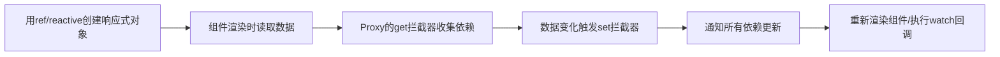

扫描[二维码](https://api2.cmdragon.cn/upload/cmder/20250304_012821924.jpg)关注或者微信搜一搜：`编程智域 前端至全栈交流与成长`

[发现1000+提升效率与开发的AI工具和实用程序](https://tools.cmdragon.cn/zh/apps?category=ai_chat)：https://tools.cmdragon.cn/

# 一、响应式系统的核心概念

## 1.1 什么是响应式？

我们可以用生活中的**恒温热水器**类比Vue的响应式系统：当水温低于设定值时，热水器会自动加热；当水温过高时，会停止加热——*
*状态变化触发自动反馈**。Vue的响应式系统本质上也是如此：**当JavaScript状态（如变量、对象属性）发生变化时，Vue会自动更新依赖该状态的UI或逻辑
**。

官网对响应式的定义非常明确：**“Vue 的响应式系统会跟踪 JavaScript 状态并在其发生变化时触发更新。”** 比如你有一个计数器变量
`count`，当`count`从0变成1时，页面上显示`count`的地方会自动更新为1，无需手动操作DOM。

## 1.2 响应式的工作边界

不是所有JavaScript数据都会被Vue跟踪，响应式系统的**工作边界**是：

- 用`ref`或`reactive`创建的变量（推荐方式）；
- `setup`函数中返回的对象（Vue会自动将其转为响应式）；
- 组件props（Vue会自动处理为响应式）。

简言之：**只有被响应式系统“标记”过的数据，才会触发更新**。比如直接声明的普通变量`let count = 0`，修改它不会触发UI更新——因为它没被响应式系统跟踪。

# 二、响应式系统的底层原理

## 2.1 从Object.defineProperty到Proxy

Vue2的响应式基于`Object.defineProperty`，但它有两个致命局限：

1. **无法检测对象新增/删除属性**：比如`obj.newKey = 1`不会触发更新；
2. **无法检测数组索引/长度变化**：比如`arr[0] = 1`或`arr.length = 0`不会触发更新。

Vue3用**Proxy**解决了这些问题。Proxy是ES6的新特性，能**拦截对象的所有操作**
（get、set、delete、遍历等），相当于给对象套了一层“代理壳”，所有对对象的操作都会经过这层壳。

举个简单的Proxy例子：

```javascript
// 模拟Vue3的响应式代理
const reactiveObj = new Proxy({name: 'Alice'}, {
    // 拦截“读取属性”操作
    get(target, key) {
        console.log(`读取了属性${key}`);
        return target[key]; // 返回原始值
    },
    // 拦截“修改属性”操作
    set(target, key, value) {
        console.log(`修改了属性${key}，新值是${value}`);
        target[key] = value;
        return true; // 表示修改成功
    }
});

// 测试
reactiveObj.name; // 输出：读取了属性name
reactiveObj.name = 'Bob'; // 输出：修改了属性name，新值是Bob
```

## 2.2 响应式的依赖追踪流程

Vue的响应式系统核心是**“依赖追踪”**——跟踪哪些组件/逻辑依赖了某个数据，当数据变化时，只通知这些依赖更新。流程如下（附流程图）：



### 流程拆解：

1. **初始化**：用`ref`或`reactive`将数据转为响应式对象（本质是Proxy）；
2. **读取数据**：组件渲染时，会读取响应式数据（比如`{{ count }}`），触发Proxy的`get`拦截器；
3. **收集依赖**：`get`拦截器会记录“当前正在渲染的组件”或“watch回调”作为依赖；
4. **数据变化**：当修改数据时（比如`count.value++`），触发Proxy的`set`拦截器；
5. **通知更新**：`set`拦截器会遍历该数据的所有依赖，触发组件重新渲染或回调执行。

## 2.3 ref与reactive的区别

Vue3提供了两个核心API创建响应式数据：`ref`和`reactive`，它们的区别如下：

| 特性     | ref                        | reactive        |
|--------|----------------------------|-----------------|
| 适用类型   | 基本类型（number、string等）、对象/数组 | 对象/数组（不能用于基本类型） |
| 访问方式   | 需要`.value`（JS中），模板中自动解包    | 直接访问属性          |
| 嵌套对象处理 | 自动转为reactive               | 自动跟踪嵌套属性        |

### 示例代码：

```javascript
import {ref, reactive} from 'vue';

// 1. 基本类型用ref
const count = ref(0);
console.log(count.value); // 输出：0（JS中需要.value）
count.value++; // 修改数据，触发更新

// 2. 对象用reactive
const user = reactive({name: 'Alice', age: 20});
user.age = 21; // 修改嵌套属性，触发更新

// 3. 对象用ref（也可以，内部会转为reactive）
const product = ref({price: 100});
product.value.price = 120; // 触发更新
```

**注意**：模板中使用`ref`不需要`.value`，Vue会自动解包：

```vue

<template>
  <p>{{ count }}</p> <!-- 正确，无需.count.value -->
</template>
```

# 三、响应式系统的实际应用

## 3.1 组件中的响应式数据

最常见的场景是**组件内的状态管理**。比如一个计数器组件：

```vue

<template>
  <div class="counter">
    <p>当前计数：{{ count }}</p>
    <button @click="increment">+1</button>
  </div>
</template>

<script setup>
  // 1. 引入ref API
  import {ref} from 'vue';

  // 2. 创建响应式数据（初始值0）
  const count = ref(0);

  // 3. 点击事件：修改数据（JS中需要.value）
  const increment = () => {
    count.value++; // 数据变化 → 自动更新UI
  };
</script>
```

### 运行环境说明：

- 需创建Vue3项目（推荐用Vite，更快）；
- 步骤：
    1. 执行`npm create vite@latest my-vue-app -- --template vue`；
    2. 进入项目目录`cd my-vue-app`；
    3. 安装依赖`npm install`；
    4. 运行`npm run dev`，打开浏览器访问`http://localhost:5173`。

## 3.2 响应式数据的衍生：computed与watch

当需要**基于响应式数据生成新值**（如计算总价）或**监听数据变化执行逻辑**（如请求接口）时，用`computed`和`watch`。

### 3.2.1 computed（计算属性）

`computed`会**缓存结果**，只有依赖的数据变化时才重新计算，避免重复计算。示例：

```vue

<template>
  <p>原价：{{ price }}</p>
  <p>折扣价（9折）：{{ discountedPrice }}</p>
</template>

<script setup>
  import {ref, computed} from 'vue';

  const price = ref(100); // 原价
  // 计算折扣价（依赖price）
  const discountedPrice = computed(() => {
    return price.value * 0.9;
  });
</script>
```

### 3.2.2 watch（侦听器）

`watch`会**监听数据变化**，执行自定义逻辑（如请求数据、打印日志）。示例：

```vue

<template>
  <input v-model="username" placeholder="输入用户名"/>
</template>

<script setup>
  import {ref, watch} from 'vue';

  const username = ref('');

  // 监听username变化
  watch(username, (newVal, oldVal) => {
    console.log(`用户名从${oldVal}变成了${newVal}`);
    // 可以在这里发请求检查用户名是否存在
  });
</script>
```

## 3.3 处理嵌套对象/数组的变化

Vue3的响应式系统能**深度跟踪嵌套对象/数组**的变化，无需手动处理。比如：

```javascript
const shopCart = reactive({
    items: [
        {name: '手机', quantity: 1},
        {name: '耳机', quantity: 2}
    ]
});

// 修改数组中的嵌套属性 → 触发更新
shopCart.items[0].quantity = 2;

// 新增数组元素 → 触发更新
shopCart.items.push({name: '充电头', quantity: 1});

// 删除数组元素 → 触发更新
shopCart.items.splice(1, 1);
```

# 四、课后Quiz

来测试一下你掌握了多少！

### 问题1：为什么Vue3用Proxy而不是Object.defineProperty？

**答案**：  
Proxy能解决Object.defineProperty的两个局限：

1. 支持跟踪对象新增/删除属性；
2. 支持跟踪数组索引/长度变化。
   Proxy是更完整的对象拦截方案，能覆盖所有数据操作场景。

### 问题2：`ref`和`reactive`的核心区别是什么？

**答案**：

- `ref`用于**基本类型**（如number、string）和对象，JS中需要`.value`访问；
- `reactive`用于**对象/数组**，直接访问属性，不能用于基本类型。
  `ref`的对象内部会转为`reactive`，所以两者都能跟踪嵌套属性变化。

### 问题3：如何让Vue跟踪对象的新增属性？

**答案**：  
用`reactive`创建对象，直接新增属性即可：

```javascript
const user = reactive({name: 'Alice'});
user.age = 21; // 新增属性，触发更新
```

如果用`ref`创建对象，修改`.value`下的属性：

```javascript
const user = ref({name: 'Alice'});
user.value.age = 21; // 触发更新
```

# 五、常见报错及解决方案

## 报错1：`Cannot read properties of undefined (reading 'value')`

**原因**：JS中使用`ref`时忘记加`.value`，比如`count++`而不是`count.value++`。  
**解决**：检查`ref`变量的使用，JS中必须加`.value`。  
**预防**：记住“模板不用.value，JS用.value”。

## 报错2：`Property 'xxx' was accessed during render but is not defined on instance.`

**原因**：模板中用了未在`setup`中返回的变量，或变量名拼写错误。  
**解决**：检查`setup`函数的返回值，确保所有模板变量都被返回；检查拼写。  
**预防**：使用ESLint插件（如`eslint-plugin-vue`）自动检查模板变量。

## 报错3：`Reactive object cannot be wrapped into a ref`

**原因**：用`ref`包裹了一个已经是`reactive`的对象，比如`ref(reactive({ name: 'Alice' }))`。  
**解决**：不要嵌套使用`ref`和`reactive`，直接用其中一个即可。  
**预防**：明确`ref`和`reactive`的适用场景，避免重复包裹。

# 参考链接

- Vue3响应式基础：https://vuejs.org/guide/essentials/reactivity-fundamentals.html
- `ref` API文档：https://vuejs.org/api/reactivity-core.html#ref
- `reactive` API文档：https://vuejs.org/api/reactivity-core.html#reactive

余下文章内容请点击跳转至 个人博客页面 或者 扫描[二维码](https://api2.cmdragon.cn/upload/cmder/20250304_012821924.jpg)
关注或者微信搜一搜：`编程智域 前端至全栈交流与成长`
，阅读完整的文章：[Vue3响应式系统的底层原理与实践要点你真的懂吗？](https://blog.cmdragon.cn/posts/bd995ea45161727597fb85b62566c43d/)


<details>
<summary>往期文章归档</summary>

- [Vue 3模板如何通过编译三阶段实现从声明式语法到高效渲染的跨越 - cmdragon's Blog](https://blog.cmdragon.cn/posts/53e3f270a80675df662c6857a3332c0f/)
- [快速入门Vue模板引用：从收DOM“快递”到调子组件方法，你玩明白了吗？ - cmdragon's Blog](https://blog.cmdragon.cn/posts/ddbce4f2a23aa72c96b1c0473900321e/)
- [快速入门Vue模板里的JS表达式有啥不能碰？计算属性为啥比方法更能打？ - cmdragon's Blog](https://blog.cmdragon.cn/posts/23a2d5a334e15575277814c16e45df50/)
- [快速入门Vue的v-model表单绑定：语法糖、动态值、修饰符的小技巧你都掌握了吗？ - cmdragon's Blog](https://blog.cmdragon.cn/posts/6be38de6382e31d282659b689c5b17f0/)
- [快速入门Vue3事件处理的挑战题：v-on、修饰符、自定义事件你能通关吗？ - cmdragon's Blog](https://blog.cmdragon.cn/posts/60ce517684f4a418f453d66aa805606c/)
- [快速入门Vue3的v-指令：数据和DOM的“翻译官”到底有多少本事？ - cmdragon's Blog](https://blog.cmdragon.cn/posts/e4ae7d5e4a9205bb11b2baccb230c637/)
- [快速入门Vue3，插值、动态绑定和避坑技巧你都搞懂了吗？ - cmdragon's Blog](https://blog.cmdragon.cn/posts/999ce4fb32259ff4fbf4bf7bcb851654/)
- [想让PostgreSQL快到飞起？先找健康密码还是先换引擎？ - cmdragon's Blog](https://blog.cmdragon.cn/posts/a6997d81b49cd232b87e1cf603888ad1/)
- [想让PostgreSQL查询快到飞起？分区表、物化视图、并行查询这三招灵不灵？ - cmdragon's Blog](https://blog.cmdragon.cn/posts/1fee7afbb9abd4540b8aa9c141d6845d/)
- [子查询总拖慢查询？把它变成连接就能解决？ - cmdragon's Blog](https://blog.cmdragon.cn/posts/79c590fbd87ece535b11a71c9667884f/)
- [PostgreSQL全表扫描慢到崩溃？建索引+改查询+更统计信息三招能破？ - cmdragon's Blog](https://blog.cmdragon.cn/posts/748cdac2536008199abf8a8a2cd0ec85/)
- [复杂查询总拖后腿？PostgreSQL多列索引+覆盖索引的神仙技巧你get没？ - cmdragon's Blog](https://blog.cmdragon.cn/posts/32ca943703226d317d4276a8fb53b0dd/)
- [只给表子集建索引？用函数结果建索引？PostgreSQL这俩操作凭啥能省空间又加速？ - cmdragon's Blog](https://blog.cmdragon.cn/posts/ca93f1d53aa910e7ba5ffd8df611c12b/)
- [B-tree索引像字典查词一样工作？那哪些数据库查询它能加速，哪些不能？ - cmdragon's Blog](https://blog.cmdragon.cn/posts/f507856ebfddd592448813c510a53669/)
- [想抓PostgreSQL里的慢SQL？pg_stat_statements基础黑匣子和pg_stat_monitor时间窗，谁能帮你更准揪出性能小偷？ - cmdragon's Blog](https://blog.cmdragon.cn/posts/b2213bfcb5b88a862f2138404c03d596/)
- [PostgreSQL的“时光机”MVCC和锁机制是怎么搞定高并发的？ - cmdragon's Blog](https://blog.cmdragon.cn/posts/26614eb7da6c476dde41d367ad888d2f/)
- [PostgreSQL性能暴涨的关键？内存IO并发参数居然要这么设置？ - cmdragon's Blog](https://blog.cmdragon.cn/posts/69f99bc6972a860d559c74aad7280da4/)
- [大表查询慢到翻遍整个书架？PostgreSQL分区表教你怎么“分类”才高效](https://blog.cmdragon.cn/posts/7b7053f392147a8b3b1a16bebeb08d0a/)
- [PostgreSQL 查询慢？是不是忘了优化 GROUP BY、ORDER BY 和窗口函数？ - cmdragon's Blog](https://blog.cmdragon.cn/posts/c856e3cb073822349f3bf2d29995dcfc/)
- [PostgreSQL里的子查询和CTE居然在性能上“掐架”？到底该站哪边？ - cmdragon's Blog](https://blog.cmdragon.cn/posts/c096347d18e67b7431faacd2c4757093/)
- [PostgreSQL选Join策略有啥小九九？Nested Loop/Merge/Hash谁是它的菜？ - cmdragon's Blog](https://blog.cmdragon.cn/posts/2eca89463454fd4250d7b66243b9fe5a/)
- [PostgreSQL新手SQL总翻车？这7个性能陷阱你踩过没？ - cmdragon's Blog](https://blog.cmdragon.cn/posts/068ecb772a87d7df20a8c9fb4b233f8e/)
- [PostgreSQL索引选B-Tree还是GiST？“瑞士军刀”和“多面手”的差别你居然还不知道？ - cmdragon's Blog](https://blog.cmdragon.cn/posts/d498f63cd0a2d5a77e445c688a8b88db/)
- [想知道数据库怎么给查询“算成本选路线”？EXPLAIN能帮你看明白？ - cmdragon's Blog](https://blog.cmdragon.cn/posts/9101b75bdec6faea9b35d54f14e37f36/)
- [PostgreSQL处理SQL居然像做蛋糕？解析到执行的4步里藏着多少查询优化的小心机？ - cmdragon's Blog](https://blog.cmdragon.cn/posts/d527f8ebb6e3dae2c7dfe4c8d8979444/)
- [PostgreSQL备份不是复制文件？物理vs逻辑咋选？误删还能精准恢复到1分钟前？ - cmdragon's Blog](https://blog.cmdragon.cn/posts/6bfdae84f313cf7ad0bb7045c4392347/)
- [转账不翻车、并发不干扰，PostgreSQL的ACID特性到底有啥魔法？ - cmdragon's Blog](https://blog.cmdragon.cn/posts/de3672803de34dbad244d0a8d48b0eb5/)
- [银行转账不白扣钱、电商下单不超卖，PostgreSQL事务的诀窍是啥？ - cmdragon's Blog](https://blog.cmdragon.cn/posts/e463e8a2668abdf00a228c9b79324ded/)
- [PostgreSQL里的PL/pgSQL到底是啥？能让SQL从“说目标”变“讲步骤”？ - cmdragon's Blog](https://blog.cmdragon.cn/posts/5c967e595058c4a1fc4474a68e64031d/)
- [PostgreSQL视图不存数据？那它怎么简化查询还能递归生成序列和控制权限？ - cmdragon's Blog](https://blog.cmdragon.cn/posts/325047855e3e23b5ef82f7d2db134fbd/)
- [PostgreSQL索引这么玩，才能让你的查询真的“飞”起来？ - cmdragon's Blog](https://blog.cmdragon.cn/posts/d2dba50bb6e4df7b27e735245a06a2a2/)
- [PostgreSQL的表关系和约束，咋帮你搞定用户订单不混乱、学生选课不重复？ - cmdragon's Blog](https://blog.cmdragon.cn/posts/849ae5bab0f8c66e94c2f6ad1bb798e3/)
- [PostgreSQL查询的筛子、排序、聚合、分组？你会用它们搞定数据吗？ - cmdragon's Blog](https://blog.cmdragon.cn/posts/ef4800975ffa84f1ca51976a70a1585b/)
- [PostgreSQL数据类型怎么选才高效不踩坑？ - cmdragon's Blog](https://blog.cmdragon.cn/posts/bf54711525c507c5eacfa7b0151c39d2/)
- [想解锁PostgreSQL查询从基础到进阶的核心知识点？你都get了吗？ - cmdragon's Blog](https://blog.cmdragon.cn/posts/887809b3e0375f5956873cd442f516d8/)
- [PostgreSQL DELETE居然有这些操作？返回数据、连表删你试过没？ - cmdragon's Blog](https://blog.cmdragon.cn/posts/934be1203725e8be9d6f6e9104e5abcc/)
- [PostgreSQL UPDATE语句怎么玩？从改邮箱到批量更新的避坑技巧你都会吗？ - cmdragon's Blog](https://blog.cmdragon.cn/posts/0f0622e9b7402b599e618150d0596ffe/)
- [PostgreSQL插入数据还在逐条敲？批量、冲突处理、返回自增ID的技巧你会吗？ - cmdragon's Blog](https://blog.cmdragon.cn/posts/0e3bf7efc030b024ea67ee855a00f2de/)
- [PostgreSQL的“仓库-房间-货架”游戏，你能建出电商数据库和表吗？ - cmdragon's Blog](https://blog.cmdragon.cn/posts/b6cd3c86da6aac26ed829e472d34078e/)
- [PostgreSQL 17安装总翻车？Windows/macOS/Linux避坑指南帮你搞定？ - cmdragon's Blog](https://blog.cmdragon.cn/posts/ba1f545a3410144552fbdbfcf31b5265/)
- [能当关系型数据库还能玩对象特性，能拆复杂查询还能自动管库存，PostgreSQL凭什么这么香？ - cmdragon's Blog](https://blog.cmdragon.cn/posts/b5474d1480509c5072085abc80b3dd9f/)
- [给接口加新字段又不搞崩老客户端？FastAPI的多版本API靠哪三招实现？ - cmdragon's Blog](https://blog.cmdragon.cn/posts/cc098d8836e787baa8a4d92e4d56d5c5/)
- [流量突增要搞崩FastAPI？熔断测试是怎么防系统雪崩的？ - cmdragon's Blog](https://blog.cmdragon.cn/posts/46d05151c5bd31cf37a7bcf0b8f5b0b8/)
- [FastAPI秒杀库存总变负数？Redis分布式锁能帮你守住底线吗 - cmdragon's Blog](https://blog.cmdragon.cn/posts/65ce343cc5df9faf3a8e2eeaab42ae45/)
- [FastAPI的CI流水线怎么自动测端点，还能让Allure报告美到犯规？ - cmdragon's Blog](https://blog.cmdragon.cn/posts/eed6cd8985d9be0a4b092a7da38b3e0c/)
- [如何用GitHub Actions为FastAPI项目打造自动化测试流水线？ - cmdragon's Blog](https://blog.cmdragon.cn/posts/6157d87338ce894d18c013c3c4777abb/)
- [如何用Git Hook和CI流水线为FastAPI项目保驾护航？ - cmdragon's Blog](https://blog.cmdragon.cn/posts/fc4ef84559e04693a620d0714cb30787/)
- [FastAPI如何用契约测试确保API的「菜单」与「菜品」一致？](https://blog.cmdragon.cn/posts/02b0c96842d1481c72dab63a149ce0dd/)
- [为什么TDD能让你的FastAPI开发飞起来？ - cmdragon's Blog](https://blog.cmdragon.cn/posts/c9c1e3bb0fdc15303b9b3b1f20124b0b/)
- [如何用FastAPI玩转多模块测试与异步任务，让代码不再“闹脾气”？ - cmdragon's Blog](https://blog.cmdragon.cn/posts/ddbfa0447a5d0d6f9af12e7a6b206f70/)
- [如何在FastAPI中玩转“时光倒流”的数据库事务回滚测试？](https://blog.cmdragon.cn/posts/bf9883a75ffa46b523a03b16ec56ce48/)
- [如何在FastAPI中优雅地模拟多模块集成测试？ - cmdragon's Blog](https://blog.cmdragon.cn/posts/be553dbd5d51835d2c69553f4a773e2d/)
- [多环境配置切换机制能否让开发与生产无缝衔接？ - cmdragon's Blog](https://blog.cmdragon.cn/posts/533874f5700b8506d4c68781597db659/)
- [如何在 FastAPI 中巧妙覆盖依赖注入并拦截第三方服务调用？ - cmdragon's Blog](https://blog.cmdragon.cn/posts/2d992ef9e8962dc0a4a0b5348d486114/)
- [为什么你的单元测试需要Mock数据库才能飞起来？ - cmdragon's Blog](https://blog.cmdragon.cn/posts/6e69c0eedd8b1e5a74a148d36c85d7ce/)
- [如何在FastAPI中巧妙隔离依赖项，让单元测试不再头疼？ - cmdragon's Blog](https://blog.cmdragon.cn/posts/77ae327dc941b0e74ecc6a8794c084d0/)

</details>


<details>
<summary>免费好用的热门在线工具</summary>

- [RAID 计算器 - 应用商店 | By cmdragon](https://tools.cmdragon.cn/zh/apps/raid-calculator)
- [在线PS - 应用商店 | By cmdragon](https://tools.cmdragon.cn/zh/apps/photoshop-online)
- [Mermaid 在线编辑器 - 应用商店 | By cmdragon](https://tools.cmdragon.cn/zh/apps/mermaid-live-editor)
- [数学求解计算器 - 应用商店 | By cmdragon](https://tools.cmdragon.cn/zh/apps/math-solver-calculator)
- [智能提词器 - 应用商店 | By cmdragon](https://tools.cmdragon.cn/zh/apps/smart-teleprompter)
- [魔法简历 - 应用商店 | By cmdragon](https://tools.cmdragon.cn/zh/apps/magic-resume)
- [Image Puzzle Tool - 图片拼图工具 | By cmdragon](https://tools.cmdragon.cn/zh/apps/image-puzzle-tool)
- [字幕下载工具 - 应用商店 | By cmdragon](https://tools.cmdragon.cn/zh/apps/subtitle-downloader)
- [歌词生成工具 - 应用商店 | By cmdragon](https://tools.cmdragon.cn/zh/apps/lyrics-generator)
- [网盘资源聚合搜索 - 应用商店 | By cmdragon](https://tools.cmdragon.cn/zh/apps/cloud-drive-search)
- [ASCII字符画生成器 - 应用商店 | By cmdragon](https://tools.cmdragon.cn/zh/apps/ascii-art-generator)
- [JSON Web Tokens 工具 - 应用商店 | By cmdragon](https://tools.cmdragon.cn/zh/apps/jwt-tool)
- [Bcrypt 密码工具 - 应用商店 | By cmdragon](https://tools.cmdragon.cn/zh/apps/bcrypt-tool)
- [GIF 合成器 - 应用商店 | By cmdragon](https://tools.cmdragon.cn/zh/apps/gif-composer)
- [GIF 分解器 - 应用商店 | By cmdragon](https://tools.cmdragon.cn/zh/apps/gif-decomposer)
- [文本隐写术 - 应用商店 | By cmdragon](https://tools.cmdragon.cn/zh/apps/text-steganography)
- [CMDragon 在线工具 - 高级AI工具箱与开发者套件 | 免费好用的在线工具](https://tools.cmdragon.cn/zh)
- [应用商店 - 发现1000+提升效率与开发的AI工具和实用程序 | 免费好用的在线工具](https://tools.cmdragon.cn/zh/apps?category=trending)
- [CMDragon 更新日志 - 最新更新、功能与改进 | 免费好用的在线工具](https://tools.cmdragon.cn/zh/changelog)
- [支持我们 - 成为赞助者 | 免费好用的在线工具](https://tools.cmdragon.cn/zh/sponsor)
- [AI文本生成图像 - 应用商店 | 免费好用的在线工具](https://tools.cmdragon.cn/zh/apps/text-to-image-ai)
- [临时邮箱 - 应用商店 | 免费好用的在线工具](https://tools.cmdragon.cn/zh/apps/temp-email)
- [二维码解析器 - 应用商店 | 免费好用的在线工具](https://tools.cmdragon.cn/zh/apps/qrcode-parser)
- [文本转思维导图 - 应用商店 | 免费好用的在线工具](https://tools.cmdragon.cn/zh/apps/text-to-mindmap)
- [正则表达式可视化工具 - 应用商店 | 免费好用的在线工具](https://tools.cmdragon.cn/zh/apps/regex-visualizer)
- [文件隐写工具 - 应用商店 | 免费好用的在线工具](https://tools.cmdragon.cn/zh/apps/steganography-tool)
- [IPTV 频道探索器 - 应用商店 | 免费好用的在线工具](https://tools.cmdragon.cn/zh/apps/iptv-explorer)
- [快传 - 应用商店 | 免费好用的在线工具](https://tools.cmdragon.cn/zh/apps/snapdrop)
- [随机抽奖工具 - 应用商店 | 免费好用的在线工具](https://tools.cmdragon.cn/zh/apps/lucky-draw)
- [动漫场景查找器 - 应用商店 | 免费好用的在线工具](https://tools.cmdragon.cn/zh/apps/anime-scene-finder)
- [时间工具箱 - 应用商店 | 免费好用的在线工具](https://tools.cmdragon.cn/zh/apps/time-toolkit)
- [网速测试 - 应用商店 | 免费好用的在线工具](https://tools.cmdragon.cn/zh/apps/speed-test)
- [AI 智能抠图工具 - 应用商店 | 免费好用的在线工具](https://tools.cmdragon.cn/zh/apps/background-remover)
- [背景替换工具 - 应用商店 | 免费好用的在线工具](https://tools.cmdragon.cn/zh/apps/background-replacer)
- [艺术二维码生成器 - 应用商店 | 免费好用的在线工具](https://tools.cmdragon.cn/zh/apps/artistic-qrcode)
- [Open Graph 元标签生成器 - 应用商店 | 免费好用的在线工具](https://tools.cmdragon.cn/zh/apps/open-graph-generator)
- [图像对比工具 - 应用商店 | 免费好用的在线工具](https://tools.cmdragon.cn/zh/apps/image-comparison)
- [图片压缩专业版 - 应用商店 | 免费好用的在线工具](https://tools.cmdragon.cn/zh/apps/image-compressor)
- [密码生成器 - 应用商店 | 免费好用的在线工具](https://tools.cmdragon.cn/zh/apps/password-generator)
- [SVG优化器 - 应用商店 | 免费好用的在线工具](https://tools.cmdragon.cn/zh/apps/svg-optimizer)
- [调色板生成器 - 应用商店 | 免费好用的在线工具](https://tools.cmdragon.cn/zh/apps/color-palette)
- [在线节拍器 - 应用商店 | 免费好用的在线工具](https://tools.cmdragon.cn/zh/apps/online-metronome)
- [IP归属地查询 - 应用商店 | 免费好用的在线工具](https://tools.cmdragon.cn/zh/apps/ip-geolocation)
- [CSS网格布局生成器 - 应用商店 | 免费好用的在线工具](https://tools.cmdragon.cn/zh/apps/css-grid-layout)
- [邮箱验证工具 - 应用商店 | 免费好用的在线工具](https://tools.cmdragon.cn/zh/apps/email-validator)
- [书法练习字帖 - 应用商店 | 免费好用的在线工具](https://tools.cmdragon.cn/zh/apps/calligraphy-practice)
- [金融计算器套件 - 应用商店 | 免费好用的在线工具](https://tools.cmdragon.cn/zh/apps/finance-calculator-suite)
- [中国亲戚关系计算器 - 应用商店 | 免费好用的在线工具](https://tools.cmdragon.cn/zh/apps/chinese-kinship-calculator)
- [Protocol Buffer 工具箱 - 应用商店 | 免费好用的在线工具](https://tools.cmdragon.cn/zh/apps/protobuf-toolkit)
- [IP归属地查询 - 应用商店 | 免费好用的在线工具](https://tools.cmdragon.cn/zh/apps/ip-geolocation)
- [图片无损放大 - 应用商店 | 免费好用的在线工具](https://tools.cmdragon.cn/zh/apps/image-upscaler)
- [文本比较工具 - 应用商店 | 免费好用的在线工具](https://tools.cmdragon.cn/zh/apps/text-compare)
- [IP批量查询工具 - 应用商店 | 免费好用的在线工具](https://tools.cmdragon.cn/zh/apps/ip-batch-lookup)
- [域名查询工具 - 应用商店 | 免费好用的在线工具](https://tools.cmdragon.cn/zh/apps/domain-finder)
- [DNS工具箱 - 应用商店 | 免费好用的在线工具](https://tools.cmdragon.cn/zh/apps/dns-toolkit)
- [网站图标生成器 - 应用商店 | 免费好用的在线工具](https://tools.cmdragon.cn/zh/apps/favicon-generator)
- [XML Sitemap](https://tools.cmdragon.cn/sitemap_index.xml)

</details>