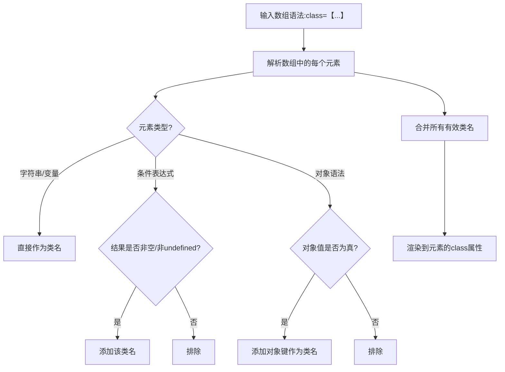

扫描[二维码](https://api2.cmdragon.cn/upload/cmder/20250304_012821924.jpg)关注或者微信搜一搜：`编程智域 前端至全栈交流与成长`

[发现1000+提升效率与开发的AI工具和实用程序](https://tools.cmdragon.cn/zh/apps?category=ai_chat)：https://tools.cmdragon.cn/

### 一、数组语法的基础使用：多类名的动态组合

在Vue3中，当我们需要给元素添加**多个动态类名**时，数组语法是最直接的方式。它允许我们将**静态类名**、**动态变量**和**条件表达式
**组合在一个数组里，Vue会自动处理这些类名的合并。

#### 1.1 基础语法：静态与动态类的结合

数组语法的核心是用`:`（或`v-bind:`）绑定一个数组到`class`属性，数组中的每个元素可以是：

- 静态字符串（如`'btn'`）
- 响应式变量（如`errorClass`）
- 条件表达式（如`isActive ? 'active' : ''`）

**示例：按钮的状态切换**  
假设我们要实现一个按钮，点击时切换“激活状态”，同时保留一个固定的“错误提示类”：

```vue

<template>
  <!-- 数组语法：条件类 + 静态变量类 -->
  <button
      :class="[isActive ? 'active' : '', errorClass]"
      @click="toggleActive"
  >
    {{ isActive ? '已激活' : '未激活' }}
  </button>
</template>

<script setup>
  import {ref} from 'vue'

  // 控制激活状态的响应式变量
  const isActive = ref(false)
  // 固定的错误类（比如红色边框）
  const errorClass = ref('border-red-500')

  // 点击切换激活状态
  const toggleActive = () => {
    isActive.value = !isActive.value
  }
</script>

<style scoped>
  .active {
    background-color: #42b983; /* 激活时的绿色背景 */
    color: white;
    border: none;
  }

  .border-red-500 {
    border: 1px solid #ff4444; /* 错误提示的红色边框 */
  }

  button {
    padding: 8px 16px;
    border-radius: 4px;
    cursor: pointer;
  }
</style>
```

**代码解释**：

- `isActive ? 'active' : ''`：当`isActive`为`true`时，添加`active`类；否则添加空字符串（Vue会自动忽略空值）。
- `errorClass`：响应式变量，值为`'border-red-500'`，始终会被添加到类名中。

#### 1.2 条件表达式的优化：用`undefined`代替空字符串

如果条件不满足时不想添加任何类，推荐用`undefined`代替空字符串（空字符串可能会导致无关的空格，`undefined`会被Vue完全忽略）：

```vue
<!-- 优化后：条件不满足时返回undefined -->
:class="[isActive ? 'active' : undefined, errorClass]"
```

### 二、嵌套数组与对象语法：处理复杂场景

当需要**动态类名**（类名本身是变量）或**多条件判断**时，我们可以在数组中嵌套**对象语法**（`{ [类名]: 布尔值 }`），这样能更灵活地控制类名。

#### 2.1 动态类名：类名是变量的情况

假设我们有一个导航菜单，每个菜单项的“激活类名”是动态的（比如`text-blue-600`、`text-green-600`），可以用**对象语法+动态键**实现：

**示例：动态导航菜单**

```vue

<template>
  <nav class="nav-bar">
    <!-- 遍历导航项，每个项的激活类是动态的 -->
    <a
        v-for="item in navItems"
        :key="item.id"
        :href="item.href"
    <!-- 数组语法：对象语法（动态类名） + 静态类 -->
    :class="[
    { [item.activeClass]: item.isActive }, // 动态类名：键是item.activeClass
    'nav-link', 'px-3', 'py-2' // 静态类
    ]"
    >
    {{ item.text }}
    </a>
  </nav>
</template>

<script setup>
  import {ref} from 'vue'

  // 导航项数据：每个项有动态的激活类名
  const navItems = ref([
    {id: 1, text: '首页', href: '/', activeClass: 'text-blue-600', isActive: true},
    {id: 2, text: '文章', href: '/articles', activeClass: 'text-green-600', isActive: false},
    {id: 3, text: '关于', href: '/about', activeClass: 'text-purple-600', isActive: false}
  ])
</script>

<style scoped>
  .nav-bar {
    background-color: #f8fafc;
    padding: 0 20px;
  }

  .nav-link {
    text-decoration: none;
    color: #64748b;
    transition: color 0.3s;
  }

  /* 动态类名的样式 */
  .text-blue-600 {
    color: #2563eb;
  }

  .text-green-600 {
    color: #16a34a;
  }

  .text-purple-600 {
    color: #7c3aed;
  }
</style>
```

**关键解释**：

- `{ [item.activeClass]: item.isActive }`：对象的**键**是`item.activeClass`（动态变量，比如`text-blue-600`），**值**是
  `item.isActive`（布尔值，控制是否添加该类）。
- Vue会自动解析这个对象：如果`item.isActive`为`true`，就添加`item.activeClass`对应的类名；否则忽略。

#### 2.2 流程梳理：数组语法的解析逻辑

为了更直观理解Vue如何处理数组语法，我们用**流程图**展示解析过程：



### 三、与v-for结合：列表项的动态样式

在处理列表时（比如Todo列表、商品列表），我们常需要给**每个列表项**添加基于数据的动态类名。这时可以把数组语法和`v-for`
结合，让每个项的样式独立可控。

#### 3.1 示例：Todo列表的完成状态

假设我们有一个Todo列表，完成的项需要添加“删除线”样式：

```vue

<template>
  <div class="todo-list">
    <!-- 遍历Todo项，每个项的样式由isDone控制 -->
    <div
        v-for="(todo, index) in todos"
        :key="index"
    <!-- 数组语法：静态类 + 条件类 -->
    :class="[
    'todo-item', // 所有项都有的静态类
    { completed: todo.isDone } // 完成时添加completed类
    ]"
    @click="toggleTodo(index)"
    >
    {{ todo.text }}
  </div>
  </div>
</template>

<script setup>
  import {ref} from 'vue'

  // Todo列表数据：每个项有isDone（是否完成）
  const todos = ref([
    {text: '学习数组语法', isDone: false},
    {text: '写技术博客', isDone: true},
    {text: '完成Quiz', isDone: false}
  ])

  // 点击切换Todo的完成状态
  const toggleTodo = (index) => {
    todos.value[index].isDone = !todos.value[index].isDone
  }
</script>

<style scoped>
  .todo-item {
    padding: 10px;
    border-bottom: 1px solid #eee;
    cursor: pointer;
  }

  /* 完成项的样式：删除线 + 灰色文字 */
  .completed {
    text-decoration: line-through;
    color: #888;
  }
</style>
```

**效果**：点击Todo项时，`isDone`切换，`completed`类自动添加/移除，样式随之变化。

#### 3.2 关键点：列表项的独立性

因为`v-for`会为每个项创建独立的作用域，所以`todo.isDone`是**每个项自己的属性**，修改一个项的状态不会影响其他项——这就是数组语法与
`v-for`结合的核心优势。

### 四、课后Quiz：巩固所学

为了帮你加深理解，我们设计了2道Quiz，试试能不能快速解决～

#### Quiz 1：动态类名的组合

假设你有一个按钮组件，需要实现：

- 当`isDisabled`为`true`时，添加`disabled`类；
- 动态类名`themeClass`（值为`'btn-primary'`或`'btn-secondary'`）始终生效；
- 保留静态类`'btn'`。

请写出对应的`:`class表达式。

**答案解析**：

```vue
:class="[ 'btn', themeClass, { disabled: isDisabled } ]"
```  

- `'btn'`：静态类，始终存在；
- `themeClass`：动态变量类，始终生效；
- `{ disabled: isDisabled }`：条件类，`isDisabled`为`true`时添加`disabled`类。

#### Quiz 2：v-for中的多条件

在遍历`products`数组时，每个产品有`isOnSale`（促销）和`isNew`（新品）属性，需要：

- 促销时添加`sale`类；
- 新品时添加`new`类；
- 所有产品都有`product-item`类。

请写出`v-for`项中的`:`class表达式。

**答案解析**：

```vue
:class="[ 'product-item', { sale: product.isOnSale, new: product.isNew } ]"
```  

- 数组中可以包含多个对象语法吗？不需要——**一个对象可以包含多个键值对**，Vue会自动处理所有条件。

### 五、常见报错与解决方案

在使用数组语法时，容易遇到以下问题，提前帮你踩坑～

#### 5.1 报错1：`TypeError: Cannot read properties of undefined`

**原因**：数组中的变量未声明或拼写错误（比如`isActve` instead of `isActive`）。  
**解决**：检查变量是否在`setup`中用`ref`/`reactive`声明，或拼写是否正确。  
**预防**：用IDE的语法提示（如VS Code的Volar插件），避免拼写错误。

#### 5.2 报错2：`Class name cannot be empty string`

**原因**：条件表达式返回空字符串（比如`isActive ? '' : 'active'`），Vue会警告空类名。  
**解决**：用`undefined`代替空字符串（`isActive ? undefined : 'active'`）。  
**预防**：条件不满足时优先返回`undefined`。

#### 5.3 报错3：`Invalid value for dynamic directive argument`

**原因**：对象语法的键不是字符串或变量（比如`{ isActive: 'active' }`——正确的应该是**键为类名，值为布尔值**）。  
**解决**：修正对象语法的结构，比如`{ active: isActive }`（键是类名`'active'`，值是布尔值`isActive`）。

### 参考链接

- Vue3官方文档：Class与Style绑定（数组语法）  
  https://vuejs.org/guide/essentials/class-and-style.html#array-syntax

- Vue3官方文档：v-for与Class绑定  
  https://vuejs.org/guide/essentials/list.html#dynamic-classes

余下文章内容请点击跳转至 个人博客页面 或者 扫描[二维码](https://api2.cmdragon.cn/upload/cmder/20250304_012821924.jpg)
关注或者微信搜一搜：`编程智域 前端至全栈交流与成长`
，阅读完整的文章：[Vue3数组语法如何高效处理动态类名的复杂组合与条件判断？](https://blog.cmdragon.cn/posts/010959c3420353370cba3b8af5b6fef1/)


<details>
<summary>往期文章归档</summary>

- [Vue浅响应式如何解决深层响应式的性能问题？适用场景有哪些？ - cmdragon's Blog](https://blog.cmdragon.cn/posts/c85e1fe16a7ae45e965b4e2df4d9d2f4/)
- [Vue 3组合式API中ref与reactive的核心响应式差异及使用最佳实践是什么？ - cmdragon's Blog](https://blog.cmdragon.cn/posts/be04b02d2723994632de0d4ca22a3391/)
- [Vue 3组合式API中ref与reactive的核心响应式差异及使用最佳实践是什么？ - cmdragon's Blog](https://blog.cmdragon.cn/posts/be04b02d2723994632de0d4ca22a3391/)
- [Vue3响应式系统中，对象新增属性、数组改索引、原始值代理的问题如何解决？ - cmdragon's Blog](https://blog.cmdragon.cn/posts/a0af08dd60a37b9a890a9957f2cbfc9f/)
- [Vue 3中watch侦听器的正确使用姿势你掌握了吗？深度监听、与watchEffect的差异及常见报错解析 - cmdragon's Blog](https://blog.cmdragon.cn/posts/bc287e1e36287afd90750fd907eca85e/)
- [Vue响应式声明的API差异、底层原理与常见陷阱你都搞懂了吗 - cmdragon's Blog](https://blog.cmdragon.cn/posts/654b9447ef1ba7ec1126a1bc26a4726d/)
- [Vue响应式声明的API差异、底层原理与常见陷阱你都搞懂了吗 - cmdragon's Blog](https://blog.cmdragon.cn/posts/654b9447ef1ba7ec1126a1bc26a4726d/)
- [为什么Vue 3需要ref函数？它的响应式原理与正确用法是什么？ - cmdragon's Blog](https://blog.cmdragon.cn/posts/c405a8d9950af5b7c63b56c348ac36b6/)
- [Vue 3中reactive函数如何通过Proxy实现响应式？使用时要避开哪些误区？ - cmdragon's Blog](https://blog.cmdragon.cn/posts/a7e9abb9691a81e4404d9facabe0f7c3/)
- [Vue3响应式系统的底层原理与实践要点你真的懂吗？ - cmdragon's Blog](https://blog.cmdragon.cn/posts/bd995ea45161727597fb85b62566c43d/)
- [Vue 3模板如何通过编译三阶段实现从声明式语法到高效渲染的跨越 - cmdragon's Blog](https://blog.cmdragon.cn/posts/53e3f270a80675df662c6857a3332c0f/)
- [快速入门Vue模板引用：从收DOM“快递”到调子组件方法，你玩明白了吗？ - cmdragon's Blog](https://blog.cmdragon.cn/posts/ddbce4f2a23aa72c96b1c0473900321e/)
- [快速入门Vue模板里的JS表达式有啥不能碰？计算属性为啥比方法更能打？ - cmdragon's Blog](https://blog.cmdragon.cn/posts/23a2d5a334e15575277814c16e45df50/)
- [快速入门Vue的v-model表单绑定：语法糖、动态值、修饰符的小技巧你都掌握了吗？ - cmdragon's Blog](https://blog.cmdragon.cn/posts/6be38de6382e31d282659b689c5b17f0/)
- [快速入门Vue3事件处理的挑战题：v-on、修饰符、自定义事件你能通关吗？ - cmdragon's Blog](https://blog.cmdragon.cn/posts/60ce517684f4a418f453d66aa805606c/)
- [快速入门Vue3的v-指令：数据和DOM的“翻译官”到底有多少本事？ - cmdragon's Blog](https://blog.cmdragon.cn/posts/e4ae7d5e4a9205bb11b2baccb230c637/)
- [快速入门Vue3，插值、动态绑定和避坑技巧你都搞懂了吗？ - cmdragon's Blog](https://blog.cmdragon.cn/posts/999ce4fb32259ff4fbf4bf7bcb851654/)
- [想让PostgreSQL快到飞起？先找健康密码还是先换引擎？ - cmdragon's Blog](https://blog.cmdragon.cn/posts/a6997d81b49cd232b87e1cf603888ad1/)
- [想让PostgreSQL查询快到飞起？分区表、物化视图、并行查询这三招灵不灵？ - cmdragon's Blog](https://blog.cmdragon.cn/posts/1fee7afbb9abd4540b8aa9c141d6845d/)
- [子查询总拖慢查询？把它变成连接就能解决？ - cmdragon's Blog](https://blog.cmdragon.cn/posts/79c590fbd87ece535b11a71c9667884f/)
- [PostgreSQL全表扫描慢到崩溃？建索引+改查询+更统计信息三招能破？ - cmdragon's Blog](https://blog.cmdragon.cn/posts/748cdac2536008199abf8a8a2cd0ec85/)
- [复杂查询总拖后腿？PostgreSQL多列索引+覆盖索引的神仙技巧你get没？ - cmdragon's Blog](https://blog.cmdragon.cn/posts/32ca943703226d317d4276a8fb53b0dd/)
- [只给表子集建索引？用函数结果建索引？PostgreSQL这俩操作凭啥能省空间又加速？ - cmdragon's Blog](https://blog.cmdragon.cn/posts/ca93f1d53aa910e7ba5ffd8df611c12b/)
- [B-tree索引像字典查词一样工作？那哪些数据库查询它能加速，哪些不能？ - cmdragon's Blog](https://blog.cmdragon.cn/posts/f507856ebfddd592448813c510a53669/)
- [想抓PostgreSQL里的慢SQL？pg_stat_statements基础黑匣子和pg_stat_monitor时间窗，谁能帮你更准揪出性能小偷？ - cmdragon's Blog](https://blog.cmdragon.cn/posts/b2213bfcb5b88a862f2138404c03d596/)
- [PostgreSQL的“时光机”MVCC和锁机制是怎么搞定高并发的？ - cmdragon's Blog](https://blog.cmdragon.cn/posts/26614eb7da6c476dde41d367ad888d2f/)
- [PostgreSQL性能暴涨的关键？内存IO并发参数居然要这么设置？ - cmdragon's Blog](https://blog.cmdragon.cn/posts/69f99bc6972a860d559c74aad7280da4/)
- [大表查询慢到翻遍整个书架？PostgreSQL分区表教你怎么“分类”才高效](https://blog.cmdragon.cn/posts/7b7053f392147a8b3b1a16bebeb08d0a/)
- [PostgreSQL 查询慢？是不是忘了优化 GROUP BY、ORDER BY 和窗口函数？ - cmdragon's Blog](https://blog.cmdragon.cn/posts/c856e3cb073822349f3bf2d29995dcfc/)
- [PostgreSQL里的子查询和CTE居然在性能上“掐架”？到底该站哪边？ - cmdragon's Blog](https://blog.cmdragon.cn/posts/c096347d18e67b7431faacd2c4757093/)
- [PostgreSQL选Join策略有啥小九九？Nested Loop/Merge/Hash谁是它的菜？ - cmdragon's Blog](https://blog.cmdragon.cn/posts/2eca89463454fd4250d7b66243b9fe5a/)
- [PostgreSQL新手SQL总翻车？这7个性能陷阱你踩过没？ - cmdragon's Blog](https://blog.cmdragon.cn/posts/068ecb772a87d7df20a8c9fb4b233f8e/)
- [PostgreSQL索引选B-Tree还是GiST？“瑞士军刀”和“多面手”的差别你居然还不知道？ - cmdragon's Blog](https://blog.cmdragon.cn/posts/d498f63cd0a2d5a77e445c688a8b88db/)
- [想知道数据库怎么给查询“算成本选路线”？EXPLAIN能帮你看明白？ - cmdragon's Blog](https://blog.cmdragon.cn/posts/9101b75bdec6faea9b35d54f14e37f36/)
- [PostgreSQL处理SQL居然像做蛋糕？解析到执行的4步里藏着多少查询优化的小心机？ - cmdragon's Blog](https://blog.cmdragon.cn/posts/d527f8ebb6e3dae2c7dfe4c8d8979444/)
- [PostgreSQL备份不是复制文件？物理vs逻辑咋选？误删还能精准恢复到1分钟前？ - cmdragon's Blog](https://blog.cmdragon.cn/posts/6bfdae84f313cf7ad0bb7045c4392347/)
- [转账不翻车、并发不干扰，PostgreSQL的ACID特性到底有啥魔法？ - cmdragon's Blog](https://blog.cmdragon.cn/posts/de3672803de34dbad244d0a8d48b0eb5/)
- [银行转账不白扣钱、电商下单不超卖，PostgreSQL事务的诀窍是啥？ - cmdragon's Blog](https://blog.cmdragon.cn/posts/e463e8a2668abdf00a228c9b79324ded/)
- [PostgreSQL里的PL/pgSQL到底是啥？能让SQL从“说目标”变“讲步骤”？ - cmdragon's Blog](https://blog.cmdragon.cn/posts/5c967e595058c4a1fc4474a68e64031d/)
- [PostgreSQL视图不存数据？那它怎么简化查询还能递归生成序列和控制权限？ - cmdragon's Blog](https://blog.cmdragon.cn/posts/325047855e3e23b5ef82f7d2db134fbd/)
- [PostgreSQL索引这么玩，才能让你的查询真的“飞”起来？ - cmdragon's Blog](https://blog.cmdragon.cn/posts/d2dba50bb6e4df7b27e735245a06a2a2/)
- [PostgreSQL的表关系和约束，咋帮你搞定用户订单不混乱、学生选课不重复？ - cmdragon's Blog](https://blog.cmdragon.cn/posts/849ae5bab0f8c66e94c2f6ad1bb798e3/)
- [PostgreSQL查询的筛子、排序、聚合、分组？你会用它们搞定数据吗？ - cmdragon's Blog](https://blog.cmdragon.cn/posts/ef4800975ffa84f1ca51976a70a1585b/)
- [PostgreSQL数据类型怎么选才高效不踩坑？ - cmdragon's Blog](https://blog.cmdragon.cn/posts/bf54711525c507c5eacfa7b0151c39d2/)
- [想解锁PostgreSQL查询从基础到进阶的核心知识点？你都get了吗？ - cmdragon's Blog](https://blog.cmdragon.cn/posts/887809b3e0375f5956873cd442f516d8/)
- [PostgreSQL DELETE居然有这些操作？返回数据、连表删你试过没？ - cmdragon's Blog](https://blog.cmdragon.cn/posts/934be1203725e8be9d6f6e9104e5abcc/)
- [PostgreSQL UPDATE语句怎么玩？从改邮箱到批量更新的避坑技巧你都会吗？ - cmdragon's Blog](https://blog.cmdragon.cn/posts/0f0622e9b7402b599e618150d0596ffe/)
- [PostgreSQL插入数据还在逐条敲？批量、冲突处理、返回自增ID的技巧你会吗？ - cmdragon's Blog](https://blog.cmdragon.cn/posts/0e3bf7efc030b024ea67ee855a00f2de/)
- [PostgreSQL的“仓库-房间-货架”游戏，你能建出电商数据库和表吗？ - cmdragon's Blog](https://blog.cmdragon.cn/posts/b6cd3c86da6aac26ed829e472d34078e/)
- [PostgreSQL 17安装总翻车？Windows/macOS/Linux避坑指南帮你搞定？ - cmdragon's Blog](https://blog.cmdragon.cn/posts/ba1f545a3410144552fbdbfcf31b5265/)
- [能当关系型数据库还能玩对象特性，能拆复杂查询还能自动管库存，PostgreSQL凭什么这么香？ - cmdragon's Blog](https://blog.cmdragon.cn/posts/b5474d1480509c5072085abc80b3dd9f/)
- [给接口加新字段又不搞崩老客户端？FastAPI的多版本API靠哪三招实现？ - cmdragon's Blog](https://blog.cmdragon.cn/posts/cc098d8836e787baa8a4d92e4d56d5c5/)
- [流量突增要搞崩FastAPI？熔断测试是怎么防系统雪崩的？ - cmdragon's Blog](https://blog.cmdragon.cn/posts/46d05151c5bd31cf37a7bcf0b8f5b0b8/)
- [FastAPI秒杀库存总变负数？Redis分布式锁能帮你守住底线吗 - cmdragon's Blog](https://blog.cmdragon.cn/posts/65ce343cc5df9faf3a8e2eeaab42ae45/)
- [FastAPI的CI流水线怎么自动测端点，还能让Allure报告美到犯规？ - cmdragon's Blog](https://blog.cmdragon.cn/posts/eed6cd8985d9be0a4b092a7da38b3e0c/)
- [如何用GitHub Actions为FastAPI项目打造自动化测试流水线？ - cmdragon's Blog](https://blog.cmdragon.cn/posts/6157d87338ce894d18c013c3c4777abb/)
- [如何用Git Hook和CI流水线为FastAPI项目保驾护航？ - cmdragon's Blog](https://blog.cmdragon.cn/posts/fc4ef84559e04693a620d0714cb30787/)

</details>


<details>
<summary>免费好用的热门在线工具</summary>

- [RAID 计算器 - 应用商店 | By cmdragon](https://tools.cmdragon.cn/zh/apps/raid-calculator)
- [在线PS - 应用商店 | By cmdragon](https://tools.cmdragon.cn/zh/apps/photoshop-online)
- [Mermaid 在线编辑器 - 应用商店 | By cmdragon](https://tools.cmdragon.cn/zh/apps/mermaid-live-editor)
- [数学求解计算器 - 应用商店 | By cmdragon](https://tools.cmdragon.cn/zh/apps/math-solver-calculator)
- [智能提词器 - 应用商店 | By cmdragon](https://tools.cmdragon.cn/zh/apps/smart-teleprompter)
- [魔法简历 - 应用商店 | By cmdragon](https://tools.cmdragon.cn/zh/apps/magic-resume)
- [Image Puzzle Tool - 图片拼图工具 | By cmdragon](https://tools.cmdragon.cn/zh/apps/image-puzzle-tool)
- [字幕下载工具 - 应用商店 | By cmdragon](https://tools.cmdragon.cn/zh/apps/subtitle-downloader)
- [歌词生成工具 - 应用商店 | By cmdragon](https://tools.cmdragon.cn/zh/apps/lyrics-generator)
- [网盘资源聚合搜索 - 应用商店 | By cmdragon](https://tools.cmdragon.cn/zh/apps/cloud-drive-search)
- [ASCII字符画生成器 - 应用商店 | By cmdragon](https://tools.cmdragon.cn/zh/apps/ascii-art-generator)
- [JSON Web Tokens 工具 - 应用商店 | By cmdragon](https://tools.cmdragon.cn/zh/apps/jwt-tool)
- [Bcrypt 密码工具 - 应用商店 | By cmdragon](https://tools.cmdragon.cn/zh/apps/bcrypt-tool)
- [GIF 合成器 - 应用商店 | By cmdragon](https://tools.cmdragon.cn/zh/apps/gif-composer)
- [GIF 分解器 - 应用商店 | By cmdragon](https://tools.cmdragon.cn/zh/apps/gif-decomposer)
- [文本隐写术 - 应用商店 | By cmdragon](https://tools.cmdragon.cn/zh/apps/text-steganography)
- [CMDragon 在线工具 - 高级AI工具箱与开发者套件 | 免费好用的在线工具](https://tools.cmdragon.cn/zh)
- [应用商店 - 发现1000+提升效率与开发的AI工具和实用程序 | 免费好用的在线工具](https://tools.cmdragon.cn/zh/apps?category=trending)
- [CMDragon 更新日志 - 最新更新、功能与改进 | 免费好用的在线工具](https://tools.cmdragon.cn/zh/changelog)
- [支持我们 - 成为赞助者 | 免费好用的在线工具](https://tools.cmdragon.cn/zh/sponsor)
- [AI文本生成图像 - 应用商店 | 免费好用的在线工具](https://tools.cmdragon.cn/zh/apps/text-to-image-ai)
- [临时邮箱 - 应用商店 | 免费好用的在线工具](https://tools.cmdragon.cn/zh/apps/temp-email)
- [二维码解析器 - 应用商店 | 免费好用的在线工具](https://tools.cmdragon.cn/zh/apps/qrcode-parser)
- [文本转思维导图 - 应用商店 | 免费好用的在线工具](https://tools.cmdragon.cn/zh/apps/text-to-mindmap)
- [正则表达式可视化工具 - 应用商店 | 免费好用的在线工具](https://tools.cmdragon.cn/zh/apps/regex-visualizer)
- [文件隐写工具 - 应用商店 | 免费好用的在线工具](https://tools.cmdragon.cn/zh/apps/steganography-tool)
- [IPTV 频道探索器 - 应用商店 | 免费好用的在线工具](https://tools.cmdragon.cn/zh/apps/iptv-explorer)
- [快传 - 应用商店 | 免费好用的在线工具](https://tools.cmdragon.cn/zh/apps/snapdrop)
- [随机抽奖工具 - 应用商店 | 免费好用的在线工具](https://tools.cmdragon.cn/zh/apps/lucky-draw)
- [动漫场景查找器 - 应用商店 | 免费好用的在线工具](https://tools.cmdragon.cn/zh/apps/anime-scene-finder)
- [时间工具箱 - 应用商店 | 免费好用的在线工具](https://tools.cmdragon.cn/zh/apps/time-toolkit)
- [网速测试 - 应用商店 | 免费好用的在线工具](https://tools.cmdragon.cn/zh/apps/speed-test)
- [AI 智能抠图工具 - 应用商店 | 免费好用的在线工具](https://tools.cmdragon.cn/zh/apps/background-remover)
- [背景替换工具 - 应用商店 | 免费好用的在线工具](https://tools.cmdragon.cn/zh/apps/background-replacer)
- [艺术二维码生成器 - 应用商店 | 免费好用的在线工具](https://tools.cmdragon.cn/zh/apps/artistic-qrcode)
- [Open Graph 元标签生成器 - 应用商店 | 免费好用的在线工具](https://tools.cmdragon.cn/zh/apps/open-graph-generator)
- [图像对比工具 - 应用商店 | 免费好用的在线工具](https://tools.cmdragon.cn/zh/apps/image-comparison)
- [图片压缩专业版 - 应用商店 | 免费好用的在线工具](https://tools.cmdragon.cn/zh/apps/image-compressor)
- [密码生成器 - 应用商店 | 免费好用的在线工具](https://tools.cmdragon.cn/zh/apps/password-generator)
- [SVG优化器 - 应用商店 | 免费好用的在线工具](https://tools.cmdragon.cn/zh/apps/svg-optimizer)
- [调色板生成器 - 应用商店 | 免费好用的在线工具](https://tools.cmdragon.cn/zh/apps/color-palette)
- [在线节拍器 - 应用商店 | 免费好用的在线工具](https://tools.cmdragon.cn/zh/apps/online-metronome)
- [IP归属地查询 - 应用商店 | 免费好用的在线工具](https://tools.cmdragon.cn/zh/apps/ip-geolocation)
- [CSS网格布局生成器 - 应用商店 | 免费好用的在线工具](https://tools.cmdragon.cn/zh/apps/css-grid-layout)
- [邮箱验证工具 - 应用商店 | 免费好用的在线工具](https://tools.cmdragon.cn/zh/apps/email-validator)
- [书法练习字帖 - 应用商店 | 免费好用的在线工具](https://tools.cmdragon.cn/zh/apps/calligraphy-practice)
- [金融计算器套件 - 应用商店 | 免费好用的在线工具](https://tools.cmdragon.cn/zh/apps/finance-calculator-suite)
- [中国亲戚关系计算器 - 应用商店 | 免费好用的在线工具](https://tools.cmdragon.cn/zh/apps/chinese-kinship-calculator)
- [Protocol Buffer 工具箱 - 应用商店 | 免费好用的在线工具](https://tools.cmdragon.cn/zh/apps/protobuf-toolkit)
- [IP归属地查询 - 应用商店 | 免费好用的在线工具](https://tools.cmdragon.cn/zh/apps/ip-geolocation)
- [图片无损放大 - 应用商店 | 免费好用的在线工具](https://tools.cmdragon.cn/zh/apps/image-upscaler)
- [文本比较工具 - 应用商店 | 免费好用的在线工具](https://tools.cmdragon.cn/zh/apps/text-compare)
- [IP批量查询工具 - 应用商店 | 免费好用的在线工具](https://tools.cmdragon.cn/zh/apps/ip-batch-lookup)
- [域名查询工具 - 应用商店 | 免费好用的在线工具](https://tools.cmdragon.cn/zh/apps/domain-finder)
- [DNS工具箱 - 应用商店 | 免费好用的在线工具](https://tools.cmdragon.cn/zh/apps/dns-toolkit)
- [网站图标生成器 - 应用商店 | 免费好用的在线工具](https://tools.cmdragon.cn/zh/apps/favicon-generator)
- [XML Sitemap](https://tools.cmdragon.cn/sitemap_index.xml)

</details>