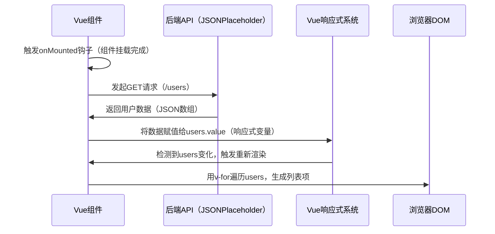

扫描[二维码](https://api2.cmdragon.cn/upload/cmder/20250304_012821924.jpg)关注或者微信搜一搜：`编程智域 前端至全栈交流与成长`

[发现1000+提升效率与开发的AI工具和实用程序](https://tools.cmdragon.cn/zh/apps?category=ai_chat)：https://tools.cmdragon.cn/

### 一、数据绑定的基础：从插值到响应式

在Vue3的世界里，**数据绑定**是连接“数据”和“视图”的桥梁——当数据变化时，视图会自动更新；反之，视图的输入（比如输入框）也会同步到数据。这一切的核心，是Vue的
**响应式系统**。

#### 1.1 插值表达式：最直观的数据绑定

最基础的数据绑定方式是**插值表达式**（双大括号`{{ }}`），比如：

```html

<template>
    <p>{{ message }}</p>
</template>

<script setup>
    import {ref} from 'vue'

    const message = ref('Hello Vue3!') // 用ref创建响应式变量
</script>
```

这里的`message`是一个**响应式变量**（用`ref`包裹），当你修改`message.value = 'Hi Vue3!'`时，页面上的文字会自动变成“Hi
Vue3!”。

#### 1.2 v-bind：绑定HTML属性

插值表达式只能用于文本，要绑定HTML属性（比如`src`、`class`），需要用**`v-bind`指令**（可以简写为`:`）：

```html

```

`v-bind`会把表达式的结果绑定到属性上——比如`user.avatar`是图片地址，`isActive`是布尔值，决定是否添加`active`类。

#### 1.3 响应式的底层：Proxy代理

Vue3的响应式系统基于ES6的`Proxy`实现。简单来说，`Proxy`会给你的数据“套一层壳”，监听所有**属性访问**和**修改**
操作。当数据变化时，Vue会自动触发DOM更新。

比如，用`ref`创建的响应式变量：

```javascript
const count = ref(0)
count.value++ // 修改值，触发DOM更新
```

`ref`会把基本类型（比如数字、字符串）包装成一个**响应式对象**，而`reactive`用于包装对象：

```javascript
const state = reactive({
    count: 0,
    message: 'Hello'
})
state.count++ // 直接修改属性，同样触发更新
```

### 二、列表渲染的基础：v-for的用法

列表渲染是前端开发的高频场景——比如展示用户列表、商品列表。Vue用**`v-for`指令**实现这一功能。

#### 2.1 遍历数组：基本用法

`v-for`的语法是`v-for="(item, index) in array"`，其中：

- `item`：当前遍历的数组项
- `index`：当前项的索引（可选）

比如渲染用户列表：

```html

<ul>
    <li v-for="(user, index) in users" :key="user.id">
        {{ index + 1 }}. {{ user.name }}
    </li>
</ul>
```

#### 2.2 为什么需要key？

你可能注意到了`(:key="user.id")`——这是`v-for`的**必选项**（除非你明确知道后果）。`key`是Vue识别列表项的**唯一标识**
，用于虚拟DOM的`diff`算法：

- 如果没有`key`，Vue会用“就地更新”策略（比如把第1项的内容改成第2项，而不是移动DOM），导致**状态混乱**（比如输入框的值错位）。
- 用`id`作为`key`（而不是`index`），Vue能准确识别每个项的变化，提高渲染性能。

#### 2.3 遍历对象

`v-for`也能遍历对象，语法是`v-for="(value, key, index) in object"`：

```html

<div v-for="(value, key) in user" :key="key">
    {{ key }}: {{ value }}
</div>
```

比如`user`是`{ name: 'Alice', age: 20 }`，会渲染成：

- name: Alice
- age: 20

### 三、实战：从后端获取数据渲染列表

了解基础后，我们来实现**从后端获取数据并渲染列表**的完整流程——这是实际开发中最常见的场景。

#### 3.1 技术准备：Axios与生命周期

- **Axios**：一个流行的HTTP客户端，用于发起异步请求（替代原生`fetch`，更易用）。
- **`onMounted`钩子**：Vue的生命周期钩子，在组件**挂载后**触发——适合发起数据请求（因为此时组件已经渲染到DOM，不会阻塞页面）。

#### 3.2 完整示例：用户列表渲染

我们来写一个真实的案例：从[JSONPlaceholder](https://jsonplaceholder.typicode.com/)（一个模拟REST API的网站）获取用户数据，渲染成列表。

##### 步骤1：创建Vue3项目（用Vite）

首先，用Vite快速创建Vue3项目：

```bash
npm create vite@latest vue-list-demo -- --template vue
cd vue-list-demo
npm install
npm run dev
```

##### 步骤2：安装Axios

```bash
npm install axios
```

##### 步骤3：编写组件代码

在`src/components/UserList.vue`中写以下代码：

```vue

<template>
  <div class="user-list">
    <h2>用户列表</h2>
    <!-- 加载状态：请求未完成时显示 -->
    <div v-if="loading" class="loading">加载中...</div>
    <!-- 错误状态：请求失败时显示 -->
    <div v-else-if="error" class="error">{{ error }}</div>
    <!-- 列表渲染：请求成功后显示 -->
    <ul v-else>
      <li v-for="user in users" :key="user.id" class="user-item">
        
        <div class="user-info">
          <h3>{{ user.name }}</h3>
          <p>{{ user.email }}</p>
          <p>{{ user.address.city }}</p>
        </div>
      </li>
    </ul>
  </div>
</template>

<script setup>
  // 1. 引入Vue的响应式API和生命周期钩子
  import {ref, onMounted} from 'vue'
  // 2. 引入Axios
  import axios from 'axios'

  // 3. 定义响应式变量
  const users = ref([])      // 存储用户列表（初始为空数组）
  const loading = ref(true)  // 加载状态（初始为true）
  const error = ref(null)    // 错误信息（初始为null）

  // 4. 组件挂载后发起请求
  onMounted(async () => {
    try {
      // 发起GET请求：获取用户数据
      const response = await axios.get('https://jsonplaceholder.typicode.com/users')
      // 将响应数据赋值给响应式变量（触发DOM更新）
      users.value = response.data
    } catch (err) {
      // 捕获错误：设置错误信息
      error.value = '获取用户数据失败，请重试'
      console.error(err) // 控制台打印详细错误
    } finally {
      // 无论成功/失败，结束加载状态
      loading.value = false
    }
  })
</script>

<style scoped>
  .user-list {
    max-width: 800px;
    margin: 20px auto;
    padding: 0 20px;
  }

  .loading, .error {
    padding: 20px;
    text-align: center;
    font-size: 18px;
  }

  .error {
    color: #dc2626; /* 红色错误提示 */
    background-color: #fef2f2;
    border-radius: 8px;
  }

  .user-item {
    display: flex;
    align-items: center;
    padding: 16px;
    margin-bottom: 12px;
    border: 1px solid #eee;
    border-radius: 8px;
    transition: box-shadow 0.3s;
  }

  .user-item:hover {
    box-shadow: 0 2px 8px rgba(0, 0, 0, 0.1); /*  hover时加阴影 */
  }

  .avatar {
    width: 60px;
    height: 60px;
    border-radius: 50%;
    margin-right: 16px;
  }

  .user-info h3 {
    margin: 0 0 8px;
    font-size: 18px;
  }

  .user-info p {
    margin: 4px 0;
    color: #666;
    font-size: 14px;
  }
</style>
```

##### 步骤4：在App.vue中使用组件

修改`src/App.vue`：

```vue

<template>
  <UserList/>
</template>

<script setup>
  import UserList from './components/UserList.vue'
</script>
```

##### 效果预览

运行`npm run dev`，打开浏览器访问`http://localhost:5173`，你会看到：

1. 初始显示“加载中...”
2. 几秒钟后（模拟网络延迟），显示用户列表，每个用户有头像、姓名、邮箱和城市。

#### 3.3 流程解析：从请求到渲染的完整链路

我们用**流程图**梳理一下这个过程：



### 四、进阶：列表的动态更新与性能优化

列表渲染不是“一锤子买卖”——实际开发中，我们经常需要**添加、删除、修改**列表项。Vue的响应式系统会帮我们处理这些变化，但需要遵循一些规则。

#### 4.1 响应式数组方法

Vue对数组的**变更方法**进行了“包裹”，这些方法会**触发DOM更新**：

- `push()`：添加元素到数组末尾
- `pop()`：删除数组最后一个元素
- `shift()`：删除数组第一个元素
- `unshift()`：添加元素到数组开头
- `splice()`：删除/插入/替换元素
- `sort()`：排序数组
- `reverse()`：反转数组

比如，添加一个用户：

```javascript
const addUser = () => {
    users.value.push({
        id: 11,
        name: 'New User',
        email: 'new@example.com',
        address: {city: 'Beijing'}
    })
}
```

#### 4.2 非响应式方法：需要重新赋值

像`filter()`、`map()`、`slice()`这样的方法，会返回一个**新数组**，不会修改原数组——因此需要重新赋值给响应式变量，才能触发更新：

```javascript
// 过滤出城市为“London”的用户
const filterLondonUsers = () => {
    users.value = users.value.filter(user => user.address.city === 'London')
}
```

#### 4.3 性能优化：虚拟DOM与key的作用

Vue的**虚拟DOM**（Virtual DOM）是一个轻量级的DOM树副本，用于计算“最小更新量”。当列表变化时，Vue会比较新旧虚拟DOM，只更新变化的部分（而不是重新渲染整个列表）。

`key`是虚拟DOM的“身份证”——没有`key`，Vue无法准确识别列表项的变化，会采用“就地更新”策略（比如把第1项的内容改成第2项），导致：

- 输入框的值错位（比如列表项中有输入框，顺序变化后，输入的值会保留原来的位置）
- 组件状态混乱（比如组件的`data`或`props`没有正确更新）

因此，**永远要给v-for的项加唯一的key**（比如数据库的id），不要用`index`作为key（除非列表不会重新排序）。

### 五、课后Quiz：巩固你的知识

我们来做两个小测试，检查你是否掌握了核心知识点～

#### Quiz 1：为什么`v-for`中不能用`index`作为key？

**问题**：假设你有一个列表：`[A, B, C]`，用`index`作为key。当你删除`B`后，列表变成`[A, C]`，Vue会如何处理？

**答案解析**：

- 原列表的key是`0(A)`、`1(B)`、`2(C)`。
- 删除`B`后，新列表的key是`0(A)`、`1(C)`。
- Vue会认为：`key=0`的项没变（A还是A），`key=1`的项从`B`变成了`C`——因此会**修改原来的B项的DOM**，而不是删除B项、移动C项。
- 如果`B`项中有输入框，输入框的值会保留到`C`项的位置，导致错误。

**结论**：`index`作为key只适合**不会重新排序、不会添加/删除项**的列表（比如静态列表），否则必须用唯一id。

#### Quiz 2：如何处理异步请求的加载状态？

**问题**：在示例中，我们用`loading`变量显示加载状态。如果请求需要10秒，页面会一直显示“加载中...”，如何优化用户体验？

**答案解析**：
可以添加**超时处理**，比如超过5秒还没收到响应，显示“请求超时，请重试”：

```javascript
onMounted(async () => {
    loading.value = true
    try {
        // 超时设置：5秒
        const response = await axios.get('https://jsonplaceholder.typicode.com/users', {
            timeout: 5000
        })
        users.value = response.data
    } catch (err) {
        if (err.code === 'ECONNABORTED') {
            error.value = '请求超时，请重试'
        } else {
            error.value = '获取数据失败，请重试'
        }
    } finally {
        loading.value = false
    }
})
```

### 六、常见报错及解决方案

在开发过程中，你可能会遇到这些常见错误，别慌——我们帮你解决！

#### 错误1：“Property or method 'users' is not defined”

**原因**：模板中使用了未定义的变量，或者响应式变量没有正确声明。

**解决**：

1. 检查`setup`中是否用`ref`或`reactive`定义了`users`：`const users = ref([])`。
2. 检查模板中的变量名是否拼写正确（比如`user` vs `users`）。

#### 错误2：“v-for expects array but got undefined”

**原因**：`v-for`需要遍历数组，但`users`变量初始值是`undefined`（比如`const users = ref()`），或者请求失败导致`users`为
`undefined`。

**解决**：

1. 初始化`users`时给**空数组**：`const users = ref([])`。
2. 在模板中用`v-if`判断数组是否存在：`v-if="users.length"`（避免遍历`undefined`）。

#### 错误3：“Axios is not defined”

**原因**：没有安装Axios，或者没有正确引入。

**解决**：

1. 安装Axios：`npm install axios`。
2. 在组件中引入：`import axios from 'axios'`。

#### 错误4：“key is required for v-for”

**原因**：`v-for`没有添加`key`属性。

**解决**：
给每个列表项添加唯一的`key`，比如`user.id`：`v-for="user in users" :key="user.id"`。

### 七、参考链接

以下是本文参考的Vue官方文档链接：

- Vue列表渲染：https://vuejs.org/guide/essentials/list.html
- Vue响应式基础：https://vuejs.org/guide/essentials/reactivity-fundamentals.html
- Vue生命周期钩子：https://vuejs.org/guide/essentials/lifecycle.html#onmounted
- Axios官方文档：https://axios-http.com/docs/intro

### 写在最后

数据绑定和列表渲染是Vue3的核心功能，也是前端开发的“基本功”。通过本文的学习，你应该能掌握：

1. 用`ref`/`reactive`创建响应式变量；
2. 用`v-for`渲染列表，理解`key`的作用；
3. 用`onMounted`和Axios发起异步请求；
4. 处理列表的动态更新和性能优化。

接下来，你可以尝试扩展这个示例：比如添加“删除用户”按钮、“搜索用户”功能，或者用`reactive`代替`ref`——实践是掌握Vue的最好方式！

如果遇到问题，记得查看官方文档，或者回到本文的“常见报错解决”部分，相信你能解决90%的问题～

余下文章内容请点击跳转至 个人博客页面 或者 扫描[二维码](https://api2.cmdragon.cn/upload/cmder/20250304_012821924.jpg)
关注或者微信搜一搜：`编程智域 前端至全栈交流与成长`
，阅读完整的文章：[Vue3的v-for为何必须使用唯一key而非index？](https://blog.cmdragon.cn/posts/ff55f72f348e9b63f715709b588178c1/)


<details>
<summary>往期文章归档</summary>

- [Vue3中v-if与v-for直接混用为何会报错？计算属性如何解决优先级冲突？](https://blog.cmdragon.cn/posts/3100cc5a2e16f8dac36f722594e6af32/)
- [为何在Vue3递归组件中必须用v-if判断子项存在？](https://blog.cmdragon.cn/posts/455dc2d47c38d12c1cf350e490041e8b/)
- [Vue3列表渲染中，如何用数组方法与计算属性优化v-for的数据处理？](https://blog.cmdragon.cn/posts/3f842bbd7ba0f9c91151b983bf784c8b/)
- [Vue v-for的key：为什么它能解决列表渲染中的“玄学错误”？选错会有哪些后果？](https://blog.cmdragon.cn/posts/1eb3ffac668a743843b5ea1738301d40/)
- [Vue3中v-for与v-if为何不能直接共存于同一元素？](https://blog.cmdragon.cn/posts/138b13c5341f6a1fa9015400433a3611/)
- [Vue3中v-if与v-show的本质区别及动态组件状态保持的关键策略是什么？](https://blog.cmdragon.cn/posts/0242a94dc552b93a1bc335ac4fc33db5/)
- [Vue3中v-show如何通过CSS修改display属性控制条件显示？与v-if的应用场景该如何区分？](https://blog.cmdragon.cn/posts/97c66a18ae0e9b57c6a69b8b3a41ddf6/)
- [Vue3条件渲染中v-if系列指令如何合理使用与规避错误？](https://blog.cmdragon.cn/posts/8a1ddfac64b25062ac56403e4c1201d2/)
- [Vue3动态样式控制：ref、reactive、watch与computed的应用场景与区别是什么？](https://blog.cmdragon.cn/posts/218c3a59282c3b757447ee08a01937bb/)
- [Vue3中动态样式数组的后项覆盖规则如何与计算属性结合实现复杂状态样式管理？](https://blog.cmdragon.cn/posts/1bab953e41f66ac53de099fa9fe76483/)
- [Vue浅响应式如何解决深层响应式的性能问题？适用场景有哪些？ - cmdragon's Blog](https://blog.cmdragon.cn/posts/c85e1fe16a7ae45e965b4e2df4d9d2f4/)
- [Vue 3组合式API中ref与reactive的核心响应式差异及使用最佳实践是什么？ - cmdragon's Blog](https://blog.cmdragon.cn/posts/be04b02d2723994632de0d4ca22a3391/)
- [Vue 3组合式API中ref与reactive的核心响应式差异及使用最佳实践是什么？ - cmdragon's Blog](https://blog.cmdragon.cn/posts/be04b02d2723994632de0d4ca22a3391/)
- [Vue3响应式系统中，对象新增属性、数组改索引、原始值代理的问题如何解决？ - cmdragon's Blog](https://blog.cmdragon.cn/posts/a0af08dd60a37b9a890a9957f2cbfc9f/)
- [Vue 3中watch侦听器的正确使用姿势你掌握了吗？深度监听、与watchEffect的差异及常见报错解析 - cmdragon's Blog](https://blog.cmdragon.cn/posts/bc287e1e36287afd90750fd907eca85e/)
- [Vue响应式声明的API差异、底层原理与常见陷阱你都搞懂了吗 - cmdragon's Blog](https://blog.cmdragon.cn/posts/654b9447ef1ba7ec1126a1bc26a4726d/)
- [Vue响应式声明的API差异、底层原理与常见陷阱你都搞懂了吗 - cmdragon's Blog](https://blog.cmdragon.cn/posts/654b9447ef1ba7ec1126a1bc26a4726d/)
- [为什么Vue 3需要ref函数？它的响应式原理与正确用法是什么？ - cmdragon's Blog](https://blog.cmdragon.cn/posts/c405a8d9950af5b7c63b56c348ac36b6/)
- [Vue 3中reactive函数如何通过Proxy实现响应式？使用时要避开哪些误区？ - cmdragon's Blog](https://blog.cmdragon.cn/posts/a7e9abb9691a81e4404d9facabe0f7c3/)
- [Vue3响应式系统的底层原理与实践要点你真的懂吗？ - cmdragon's Blog](https://blog.cmdragon.cn/posts/bd995ea45161727597fb85b62566c43d/)
- [Vue 3模板如何通过编译三阶段实现从声明式语法到高效渲染的跨越 - cmdragon's Blog](https://blog.cmdragon.cn/posts/53e3f270a80675df662c6857a3332c0f/)
- [快速入门Vue模板引用：从收DOM“快递”到调子组件方法，你玩明白了吗？ - cmdragon's Blog](https://blog.cmdragon.cn/posts/ddbce4f2a23aa72c96b1c0473900321e/)
- [快速入门Vue模板里的JS表达式有啥不能碰？计算属性为啥比方法更能打？ - cmdragon's Blog](https://blog.cmdragon.cn/posts/23a2d5a334e15575277814c16e45df50/)
- [快速入门Vue的v-model表单绑定：语法糖、动态值、修饰符的小技巧你都掌握了吗？ - cmdragon's Blog](https://blog.cmdragon.cn/posts/6be38de6382e31d282659b689c5b17f0/)
- [快速入门Vue3事件处理的挑战题：v-on、修饰符、自定义事件你能通关吗？ - cmdragon's Blog](https://blog.cmdragon.cn/posts/60ce517684f4a418f453d66aa805606c/)
- [快速入门Vue3的v-指令：数据和DOM的“翻译官”到底有多少本事？ - cmdragon's Blog](https://blog.cmdragon.cn/posts/e4ae7d5e4a9205bb11b2baccb230c637/)
- [快速入门Vue3，插值、动态绑定和避坑技巧你都搞懂了吗？ - cmdragon's Blog](https://blog.cmdragon.cn/posts/999ce4fb32259ff4fbf4bf7bcb851654/)
- [想让PostgreSQL快到飞起？先找健康密码还是先换引擎？ - cmdragon's Blog](https://blog.cmdragon.cn/posts/a6997d81b49cd232b87e1cf603888ad1/)
- [想让PostgreSQL查询快到飞起？分区表、物化视图、并行查询这三招灵不灵？ - cmdragon's Blog](https://blog.cmdragon.cn/posts/1fee7afbb9abd4540b8aa9c141d6845d/)
- [子查询总拖慢查询？把它变成连接就能解决？ - cmdragon's Blog](https://blog.cmdragon.cn/posts/79c590fbd87ece535b11a71c9667884f/)
- [PostgreSQL全表扫描慢到崩溃？建索引+改查询+更统计信息三招能破？ - cmdragon's Blog](https://blog.cmdragon.cn/posts/748cdac2536008199abf8a8a2cd0ec85/)
- [复杂查询总拖后腿？PostgreSQL多列索引+覆盖索引的神仙技巧你get没？ - cmdragon's Blog](https://blog.cmdragon.cn/posts/32ca943703226d317d4276a8fb53b0dd/)
- [只给表子集建索引？用函数结果建索引？PostgreSQL这俩操作凭啥能省空间又加速？ - cmdragon's Blog](https://blog.cmdragon.cn/posts/ca93f1d53aa910e7ba5ffd8df611c12b/)
- [B-tree索引像字典查词一样工作？那哪些数据库查询它能加速，哪些不能？ - cmdragon's Blog](https://blog.cmdragon.cn/posts/f507856ebfddd592448813c510a53669/)
- [想抓PostgreSQL里的慢SQL？pg_stat_statements基础黑匣子和pg_stat_monitor时间窗，谁能帮你更准揪出性能小偷？ - cmdragon's Blog](https://blog.cmdragon.cn/posts/b2213bfcb5b88a862f2138404c03d596/)
- [PostgreSQL的“时光机”MVCC和锁机制是怎么搞定高并发的？ - cmdragon's Blog](https://blog.cmdragon.cn/posts/26614eb7da6c476dde41d367ad888d2f/)
- [PostgreSQL性能暴涨的关键？内存IO并发参数居然要这么设置？ - cmdragon's Blog](https://blog.cmdragon.cn/posts/69f99bc6972a860d559c74aad7280da4/)
- [大表查询慢到翻遍整个书架？PostgreSQL分区表教你怎么“分类”才高效](https://blog.cmdragon.cn/posts/7b7053f392147a8b3b1a16bebeb08d0a/)
- [PostgreSQL 查询慢？是不是忘了优化 GROUP BY、ORDER BY 和窗口函数？ - cmdragon's Blog](https://blog.cmdragon.cn/posts/c856e3cb073822349f3bf2d29995dcfc/)
- [PostgreSQL里的子查询和CTE居然在性能上“掐架”？到底该站哪边？ - cmdragon's Blog](https://blog.cmdragon.cn/posts/c096347d18e67b7431faacd2c4757093/)
- [PostgreSQL选Join策略有啥小九九？Nested Loop/Merge/Hash谁是它的菜？ - cmdragon's Blog](https://blog.cmdragon.cn/posts/2eca89463454fd4250d7b66243b9fe5a/)
- [PostgreSQL新手SQL总翻车？这7个性能陷阱你踩过没？ - cmdragon's Blog](https://blog.cmdragon.cn/posts/068ecb772a87d7df20a8c9fb4b233f8e/)
- [PostgreSQL索引选B-Tree还是GiST？“瑞士军刀”和“多面手”的差别你居然还不知道？ - cmdragon's Blog](https://blog.cmdragon.cn/posts/d498f63cd0a2d5a77e445c688a8b88db/)
- [想知道数据库怎么给查询“算成本选路线”？EXPLAIN能帮你看明白？ - cmdragon's Blog](https://blog.cmdragon.cn/posts/9101b75bdec6faea9b35d54f14e37f36/)
- [PostgreSQL处理SQL居然像做蛋糕？解析到执行的4步里藏着多少查询优化的小心机？ - cmdragon's Blog](https://blog.cmdragon.cn/posts/d527f8ebb6e3dae2c7dfe4c8d8979444/)
- [PostgreSQL备份不是复制文件？物理vs逻辑咋选？误删还能精准恢复到1分钟前？ - cmdragon's Blog](https://blog.cmdragon.cn/posts/6bfdae84f313cf7ad0bb7045c4392347/)
- [转账不翻车、并发不干扰，PostgreSQL的ACID特性到底有啥魔法？ - cmdragon's Blog](https://blog.cmdragon.cn/posts/de3672803de34dbad244d0a8d48b0eb5/)
- [银行转账不白扣钱、电商下单不超卖，PostgreSQL事务的诀窍是啥？ - cmdragon's Blog](https://blog.cmdragon.cn/posts/e463e8a2668abdf00a228c9b79324ded/)
- [PostgreSQL里的PL/pgSQL到底是啥？能让SQL从“说目标”变“讲步骤”？ - cmdragon's Blog](https://blog.cmdragon.cn/posts/5c967e595058c4a1fc4474a68e64031d/)
- [PostgreSQL视图不存数据？那它怎么简化查询还能递归生成序列和控制权限？ - cmdragon's Blog](https://blog.cmdragon.cn/posts/325047855e3e23b5ef82f7d2db134fbd/)
- [PostgreSQL索引这么玩，才能让你的查询真的“飞”起来？ - cmdragon's Blog](https://blog.cmdragon.cn/posts/d2dba50bb6e4df7b27e735245a06a2a2/)
- [PostgreSQL的表关系和约束，咋帮你搞定用户订单不混乱、学生选课不重复？ - cmdragon's Blog](https://blog.cmdragon.cn/posts/849ae5bab0f8c66e94c2f6ad1bb798e3/)
- [PostgreSQL查询的筛子、排序、聚合、分组？你会用它们搞定数据吗？ - cmdragon's Blog](https://blog.cmdragon.cn/posts/ef4800975ffa84f1ca51976a70a1585b/)
- [PostgreSQL数据类型怎么选才高效不踩坑？ - cmdragon's Blog](https://blog.cmdragon.cn/posts/bf54711525c507c5eacfa7b0151c39d2/)
- [想解锁PostgreSQL查询从基础到进阶的核心知识点？你都get了吗？ - cmdragon's Blog](https://blog.cmdragon.cn/posts/887809b3e0375f5956873cd442f516d8/)
- [PostgreSQL DELETE居然有这些操作？返回数据、连表删你试过没？ - cmdragon's Blog](https://blog.cmdragon.cn/posts/934be1203725e8be9d6f6e9104e5abcc/)
- [PostgreSQL UPDATE语句怎么玩？从改邮箱到批量更新的避坑技巧你都会吗？ - cmdragon's Blog](https://blog.cmdragon.cn/posts/0f0622e9b7402b599e618150d0596ffe/)
- [PostgreSQL插入数据还在逐条敲？批量、冲突处理、返回自增ID的技巧你会吗？ - cmdragon's Blog](https://blog.cmdragon.cn/posts/0e3bf7efc030b024ea67ee855a00f2de/)
- [PostgreSQL的“仓库-房间-货架”游戏，你能建出电商数据库和表吗？ - cmdragon's Blog](https://blog.cmdragon.cn/posts/b6cd3c86da6aac26ed829e472d34078e/)
- [PostgreSQL 17安装总翻车？Windows/macOS/Linux避坑指南帮你搞定？ - cmdragon's Blog](https://blog.cmdragon.cn/posts/ba1f545a3410144552fbdbfcf31b5265/)
- [能当关系型数据库还能玩对象特性，能拆复杂查询还能自动管库存，PostgreSQL凭什么这么香？ - cmdragon's Blog](https://blog.cmdragon.cn/posts/b5474d1480509c5072085abc80b3dd9f/)
- [给接口加新字段又不搞崩老客户端？FastAPI的多版本API靠哪三招实现？ - cmdragon's Blog](https://blog.cmdragon.cn/posts/cc098d8836e787baa8a4d92e4d56d5c5/)
- [流量突增要搞崩FastAPI？熔断测试是怎么防系统雪崩的？ - cmdragon's Blog](https://blog.cmdragon.cn/posts/46d05151c5bd31cf37a7bcf0b8f5b0b8/)
- [FastAPI秒杀库存总变负数？Redis分布式锁能帮你守住底线吗 - cmdragon's Blog](https://blog.cmdragon.cn/posts/65ce343cc5df9faf3a8e2eeaab42ae45/)
- [FastAPI的CI流水线怎么自动测端点，还能让Allure报告美到犯规？ - cmdragon's Blog](https://blog.cmdragon.cn/posts/eed6cd8985d9be0a4b092a7da38b3e0c/)
- [如何用GitHub Actions为FastAPI项目打造自动化测试流水线？ - cmdragon's Blog](https://blog.cmdragon.cn/posts/6157d87338ce894d18c013c3c4777abb/)

</details>


<details>
<summary>免费好用的热门在线工具</summary>

- [RAID 计算器 - 应用商店 | By cmdragon](https://tools.cmdragon.cn/zh/apps/raid-calculator)
- [在线PS - 应用商店 | By cmdragon](https://tools.cmdragon.cn/zh/apps/photoshop-online)
- [Mermaid 在线编辑器 - 应用商店 | By cmdragon](https://tools.cmdragon.cn/zh/apps/mermaid-live-editor)
- [数学求解计算器 - 应用商店 | By cmdragon](https://tools.cmdragon.cn/zh/apps/math-solver-calculator)
- [智能提词器 - 应用商店 | By cmdragon](https://tools.cmdragon.cn/zh/apps/smart-teleprompter)
- [魔法简历 - 应用商店 | By cmdragon](https://tools.cmdragon.cn/zh/apps/magic-resume)
- [Image Puzzle Tool - 图片拼图工具 | By cmdragon](https://tools.cmdragon.cn/zh/apps/image-puzzle-tool)
- [字幕下载工具 - 应用商店 | By cmdragon](https://tools.cmdragon.cn/zh/apps/subtitle-downloader)
- [歌词生成工具 - 应用商店 | By cmdragon](https://tools.cmdragon.cn/zh/apps/lyrics-generator)
- [网盘资源聚合搜索 - 应用商店 | By cmdragon](https://tools.cmdragon.cn/zh/apps/cloud-drive-search)
- [ASCII字符画生成器 - 应用商店 | By cmdragon](https://tools.cmdragon.cn/zh/apps/ascii-art-generator)
- [JSON Web Tokens 工具 - 应用商店 | By cmdragon](https://tools.cmdragon.cn/zh/apps/jwt-tool)
- [Bcrypt 密码工具 - 应用商店 | By cmdragon](https://tools.cmdragon.cn/zh/apps/bcrypt-tool)
- [GIF 合成器 - 应用商店 | By cmdragon](https://tools.cmdragon.cn/zh/apps/gif-composer)
- [GIF 分解器 - 应用商店 | By cmdragon](https://tools.cmdragon.cn/zh/apps/gif-decomposer)
- [文本隐写术 - 应用商店 | By cmdragon](https://tools.cmdragon.cn/zh/apps/text-steganography)
- [CMDragon 在线工具 - 高级AI工具箱与开发者套件 | 免费好用的在线工具](https://tools.cmdragon.cn/zh)
- [应用商店 - 发现1000+提升效率与开发的AI工具和实用程序 | 免费好用的在线工具](https://tools.cmdragon.cn/zh/apps?category=trending)
- [CMDragon 更新日志 - 最新更新、功能与改进 | 免费好用的在线工具](https://tools.cmdragon.cn/zh/changelog)
- [支持我们 - 成为赞助者 | 免费好用的在线工具](https://tools.cmdragon.cn/zh/sponsor)
- [AI文本生成图像 - 应用商店 | 免费好用的在线工具](https://tools.cmdragon.cn/zh/apps/text-to-image-ai)
- [临时邮箱 - 应用商店 | 免费好用的在线工具](https://tools.cmdragon.cn/zh/apps/temp-email)
- [二维码解析器 - 应用商店 | 免费好用的在线工具](https://tools.cmdragon.cn/zh/apps/qrcode-parser)
- [文本转思维导图 - 应用商店 | 免费好用的在线工具](https://tools.cmdragon.cn/zh/apps/text-to-mindmap)
- [正则表达式可视化工具 - 应用商店 | 免费好用的在线工具](https://tools.cmdragon.cn/zh/apps/regex-visualizer)
- [文件隐写工具 - 应用商店 | 免费好用的在线工具](https://tools.cmdragon.cn/zh/apps/steganography-tool)
- [IPTV 频道探索器 - 应用商店 | 免费好用的在线工具](https://tools.cmdragon.cn/zh/apps/iptv-explorer)
- [快传 - 应用商店 | 免费好用的在线工具](https://tools.cmdragon.cn/zh/apps/snapdrop)
- [随机抽奖工具 - 应用商店 | 免费好用的在线工具](https://tools.cmdragon.cn/zh/apps/lucky-draw)
- [动漫场景查找器 - 应用商店 | 免费好用的在线工具](https://tools.cmdragon.cn/zh/apps/anime-scene-finder)
- [时间工具箱 - 应用商店 | 免费好用的在线工具](https://tools.cmdragon.cn/zh/apps/time-toolkit)
- [网速测试 - 应用商店 | 免费好用的在线工具](https://tools.cmdragon.cn/zh/apps/speed-test)
- [AI 智能抠图工具 - 应用商店 | 免费好用的在线工具](https://tools.cmdragon.cn/zh/apps/background-remover)
- [背景替换工具 - 应用商店 | 免费好用的在线工具](https://tools.cmdragon.cn/zh/apps/background-replacer)
- [艺术二维码生成器 - 应用商店 | 免费好用的在线工具](https://tools.cmdragon.cn/zh/apps/artistic-qrcode)
- [Open Graph 元标签生成器 - 应用商店 | 免费好用的在线工具](https://tools.cmdragon.cn/zh/apps/open-graph-generator)
- [图像对比工具 - 应用商店 | 免费好用的在线工具](https://tools.cmdragon.cn/zh/apps/image-comparison)
- [图片压缩专业版 - 应用商店 | 免费好用的在线工具](https://tools.cmdragon.cn/zh/apps/image-compressor)
- [密码生成器 - 应用商店 | 免费好用的在线工具](https://tools.cmdragon.cn/zh/apps/password-generator)
- [SVG优化器 - 应用商店 | 免费好用的在线工具](https://tools.cmdragon.cn/zh/apps/svg-optimizer)
- [调色板生成器 - 应用商店 | 免费好用的在线工具](https://tools.cmdragon.cn/zh/apps/color-palette)
- [在线节拍器 - 应用商店 | 免费好用的在线工具](https://tools.cmdragon.cn/zh/apps/online-metronome)
- [IP归属地查询 - 应用商店 | 免费好用的在线工具](https://tools.cmdragon.cn/zh/apps/ip-geolocation)
- [CSS网格布局生成器 - 应用商店 | 免费好用的在线工具](https://tools.cmdragon.cn/zh/apps/css-grid-layout)
- [邮箱验证工具 - 应用商店 | 免费好用的在线工具](https://tools.cmdragon.cn/zh/apps/email-validator)
- [书法练习字帖 - 应用商店 | 免费好用的在线工具](https://tools.cmdragon.cn/zh/apps/calligraphy-practice)
- [金融计算器套件 - 应用商店 | 免费好用的在线工具](https://tools.cmdragon.cn/zh/apps/finance-calculator-suite)
- [中国亲戚关系计算器 - 应用商店 | 免费好用的在线工具](https://tools.cmdragon.cn/zh/apps/chinese-kinship-calculator)
- [Protocol Buffer 工具箱 - 应用商店 | 免费好用的在线工具](https://tools.cmdragon.cn/zh/apps/protobuf-toolkit)
- [IP归属地查询 - 应用商店 | 免费好用的在线工具](https://tools.cmdragon.cn/zh/apps/ip-geolocation)
- [图片无损放大 - 应用商店 | 免费好用的在线工具](https://tools.cmdragon.cn/zh/apps/image-upscaler)
- [文本比较工具 - 应用商店 | 免费好用的在线工具](https://tools.cmdragon.cn/zh/apps/text-compare)
- [IP批量查询工具 - 应用商店 | 免费好用的在线工具](https://tools.cmdragon.cn/zh/apps/ip-batch-lookup)
- [域名查询工具 - 应用商店 | 免费好用的在线工具](https://tools.cmdragon.cn/zh/apps/domain-finder)
- [DNS工具箱 - 应用商店 | 免费好用的在线工具](https://tools.cmdragon.cn/zh/apps/dns-toolkit)
- [网站图标生成器 - 应用商店 | 免费好用的在线工具](https://tools.cmdragon.cn/zh/apps/favicon-generator)
- [XML Sitemap](https://tools.cmdragon.cn/sitemap_index.xml)

</details>