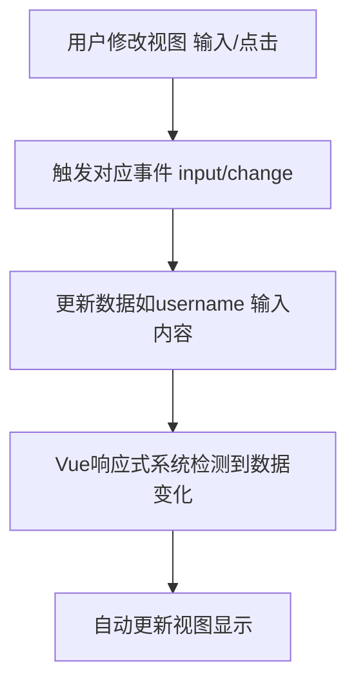

扫描[二维码](https://api2.cmdragon.cn/upload/cmder/20250304_012821924.jpg)关注或者微信搜一搜：`编程智域 前端至全栈交流与成长`

[发现1000+提升效率与开发的AI工具和实用程序](https://tools.cmdragon.cn/zh/apps?category=ai_chat)：https://tools.cmdragon.cn/

### 一、为什么需要表单输入绑定？

你有没有过这样的经历？做登录页时，想让用户输入的用户名实时显示在页面上；或者做设置页时，修改开关按钮的状态要同步到后台数据。这时候，如果手动监听每个输入框的事件、手动更新数据，代码会变得非常繁琐——比如：

```html
<input type="text" id="username" oninput="updateUsername(event)">
```  

```javascript
function updateUsername(e) {
    this.username = e.target.value;
}
```  

不仅要写一堆事件监听，还要处理不同表单元素的差异（比如复选框的`checked`属性、下拉框的`selected`属性）。而Vue3的**表单输入绑定
**就是为了解决这个问题——它帮你把“输入→数据→视图”的同步逻辑封装成了一个简单的指令：`v-model`。

### 二、双向绑定：Vue3的“数据-视图”同步魔法

在讲`v-model`之前，我们得先搞懂**双向绑定**的核心逻辑。简单来说，双向绑定就是：

- 当用户修改视图（比如输入文字、点击复选框），数据自动更新；
- 当代码修改数据（比如`this.username = 'admin'`），视图自动同步。

#### 双向绑定的原理流程图



举个例子：当你在输入框里敲“hello”，Vue会做这几件事：

1. 监听输入框的`input`事件，拿到你输入的“hello”；
2. 把`username`数据更新为“hello”；
3. 响应式系统发现`username`变了，立刻通知输入框显示“hello”。

### 三、v-model指令：双向绑定的语法糖

Vue3为双向绑定提供了**语法糖**——`v-model`，它把“绑定value+监听事件”的逻辑封装成了一个指令。比如：

```html
<input v-model="username">
```  

等价于：

```html
<input :value="username" @input="username = $event.target.value">
```  

是不是简洁多了？`v-model`帮你省掉了手动写事件监听的麻烦，而且适用于所有表单元素。

### 四、v-model在不同表单元素中的应用

`v-model`不是只能用在文本输入框，它支持所有常见的表单元素，我们逐个看：

#### 1. 文本输入框（input[type="text"]）与多行文本（textarea）

- 文本输入框：直接绑定字符串类型的响应式数据；
- 多行文本（textarea）：**不能用插值表达式**（`{{ message }}`），必须用`v-model`。

示例代码：

```html

<script setup>
    import {ref} from 'vue'

    const username = ref('') // 字符串类型
    const intro = ref('')    // 多行文本内容
</script>

<template>
    <div>
        <label>用户名：<input type="text" v-model="username"></label>
        <label>个人简介：<textarea v-model="intro" rows="3"></textarea></label>
    </div>
</template>
```  

#### 2. 复选框（input[type="checkbox"]）

复选框分两种情况：

- **单个复选框**：绑定布尔值（`true/false`），表示“是否选中”；
- **多个复选框**：绑定**数组**，数组元素是选中的`value`值。

示例代码：

```html

<script setup>
    import {ref} from 'vue'

    const rememberMe = ref(false) // 单个复选框（布尔值）
    const hobbies = ref([])       // 多个复选框（数组）
</script>

<template>
    <div>
        <!-- 单个复选框：记住我 -->
        <label><input type="checkbox" v-model="rememberMe"> 记住我</label>

        <!-- 多个复选框：爱好 -->
        <label><input type="checkbox" value="reading" v-model="hobbies"> 阅读</label>
        <label><input type="checkbox" value="sports" v-model="hobbies"> 运动</label>
        <label><input type="checkbox" value="coding" v-model="hobbies"> 编程</label>
    </div>
</template>
```  

#### 3. 单选按钮（input[type="radio"]）

单选按钮绑定**字符串**，值为选中的`value`属性。

示例代码：

```html

<script setup>
    import {ref} from 'vue'

    const gender = ref('male') // 默认选中“男”
</script>

<template>
    <div>
        <label><input type="radio" value="male" v-model="gender"> 男</label>
        <label><input type="radio" value="female" v-model="gender"> 女</label>
    </div>
</template>
```  

#### 4. 下拉框（select）

下拉框的`v-model`绑定选中的`value`值，`option`的`value`属性对应选项值。

示例代码：

```html

<script setup>
    import {ref} from 'vue'

    const city = ref('beijing') // 默认选中“北京”
</script>

<template>
    <div>
        <label>城市：
            <select v-model="city">
                <option value="beijing">北京</option>
                <option value="shanghai">上海</option>
                <option value="guangzhou">广州</option>
            </select>
        </label>
    </div>
</template>
```  

### 五、数据响应式：双向绑定的底层支撑

你可能会问：“为什么数据变了，视图会自动更新？”这要归功于Vue3的**响应式系统**。

Vue3用`ref`或`reactive`创建响应式数据，当数据变化时，Vue会自动追踪依赖（比如模板中用到`username`的地方），并更新对应的视图。而
`v-model`正是利用了这个系统，让数据和视图双向同步。

比如用`ref`创建`username`：

```javascript
const username = ref('')
```  

`ref`会把`username`包装成一个**响应式对象**，当你修改`username.value`（或通过`v-model`修改），Vue会立刻知道，并更新视图。

### 六、实际案例：打造一个注册表单

让我们把前面的知识点整合起来，做一个**注册表单**，包含用户名、密码、记住我、性别、爱好、城市，提交时打印表单数据。

#### 完整代码（带样式）

```html

<script setup>
    import {ref} from 'vue'

    // 用ref创建表单对象，包含所有字段
    const form = ref({
        username: '',
        password: '',
        rememberMe: false,
        gender: 'male',
        hobbies: [],
        city: 'beijing'
    })

    // 提交处理函数：阻止默认刷新，打印表单数据
    const handleSubmit = (e) => {
        e.preventDefault()
        console.log('表单数据：', form.value)
        // 这里可以加发送请求到后台的逻辑，比如axios.post('/api/register', form.value)
    }
</script>

<template>
    <div class="register-form">
        <h2>用户注册</h2>
        <form @submit.prevent="handleSubmit">
            <!-- 用户名 -->
            <div class="form-group">
                <label for="username">用户名：</label>
                <input
                        type="text"
                        id="username"
                        v-model="form.username"
                        placeholder="请输入用户名"
                        required
                >
            </div>

            <!-- 密码 -->
            <div class="form-group">
                <label for="password">密码：</label>
                <input
                        type="password"
                        id="password"
                        v-model="form.password"
                        placeholder="请输入密码"
                        required
                >
            </div>

            <!-- 记住我 -->
            <div class="form-group">
                <label><input type="checkbox" v-model="form.rememberMe"> 记住登录状态</label>
            </div>

            <!-- 性别 -->
            <div class="form-group">
                <label>性别：</label>
                <input type="radio" value="male" v-model="form.gender"> 男
                <input type="radio" value="female" v-model="form.gender"> 女
            </div>

            <!-- 爱好 -->
            <div class="form-group">
                <label>爱好：</label>
                <input type="checkbox" value="reading" v-model="form.hobbies"> 阅读
                <input type="checkbox" value="sports" v-model="form.hobbies"> 运动
                <input type="checkbox" value="coding" v-model="form.hobbies"> 编程
            </div>

            <!-- 城市 -->
            <div class="form-group">
                <label for="city">城市：</label>
                <select id="city" v-model="form.city">
                    <option value="beijing">北京</option>
                    <option value="shanghai">上海</option>
                    <option value="guangzhou">广州</option>
                    <option value="shenzhen">深圳</option>
                </select>
            </div>

            <!-- 提交按钮 -->
            <button type="submit" class="submit-btn">注册</button>
        </form>
    </div>
</template>

<style scoped>
    .register-form {
        max-width: 400px;
        margin: 20px auto;
        padding: 20px;
        border: 1px solid #eee;
        border-radius: 8px;
    }

    .form-group {
        margin-bottom: 15px;
    }

    label {
        display: block;
        margin-bottom: 5px;
    }

    input, select {
        width: 100%;
        padding: 8px;
        border: 1px solid #ddd;
        border-radius: 4px;
    }

    .submit-btn {
        width: 100%;
        padding: 10px;
        background-color: #42b983;
        color: white;
        border: none;
        border-radius: 4px;
        cursor: pointer;
    }

    .submit-btn:hover {
        background-color: #3aa776;
    }
</style>
```  

#### 代码说明

1. **表单数据管理**：用`ref`创建`form`对象，把所有表单字段放在一起，方便管理；
2. **提交处理**：用`@submit.prevent`阻止表单默认的刷新行为，打印表单数据；
3. **响应式同步**：每个字段用`v-model`绑定到`form`对象的属性，输入时自动同步。

### 七、课后Quiz：巩固你的理解

来做两个小练习，检验一下学习成果～

#### 1. 问题：v-model的语法糖本质是什么？请写出等价的原生绑定代码。

**答案解析**：  
v-model是`value`属性绑定 + `input`事件监听的语法糖。比如`<input v-model="message">`等价于：

```html
<input :value="message" @input="message = $event.target.value">
```  

- `:value="message"`：把数据绑定到输入框的value属性；
- `@input`：监听输入事件，把输入内容更新到`message`。

#### 2. 问题：多个复选框如何用v-model实现多选？请写出示例代码。

**答案解析**：  
多个复选框需要绑定到**数组类型**的响应式数据。每个复选框的`value`对应数组中的元素，选中时加入数组，取消时移除。示例：

```html

<script setup>
    import {ref} from 'vue'

    const hobbies = ref([]) // 数组类型
</script>

<template>
    <label><input type="checkbox" value="reading" v-model="hobbies"> 阅读</label>
    <label><input type="checkbox" value="sports" v-model="hobbies"> 运动</label>
    <label><input type="checkbox" value="coding" v-model="hobbies"> 编程</label>
</template>
```  

比如选中“阅读”和“编程”，`hobbies.value`会变成`['reading', 'coding']`。

### 八、常见报错与解决方案

学习过程中遇到报错别慌，以下是表单绑定常见的3个错误及解决办法：

#### 1. 报错：`v-model is not allowed on <input type="file">`

- **原因**：文件输入框（`type="file"`）的`value`是**只读**的，无法通过`v-model`修改。
- **解决办法**：用`ref`获取DOM元素，监听`change`事件拿文件：
  ```html
  <script setup>
  import { ref } from 'vue'
  const fileInput = ref(null)
  const handleFile = () => {
    const file = fileInput.value.files[0] // 获取选中的文件
    console.log('文件：', file)
  }
  </script>
  
  <template>
    <input type="file" ref="fileInput" @change="handleFile">
  </template>
  ```  

#### 2. 报错：`Property "message" was accessed during render but is not defined`

- **原因**：模板里用了`message`，但没在`setup`中定义响应式数据。
- **解决办法**：用`ref`或`reactive`定义`message`：
  ```javascript
  import { ref } from 'vue'
  const message = ref('') // 必须定义！
  ```  

#### 3. 报错：`v-model requires a valid Vue instance`

- **原因**：可能在非Vue组件中用了`v-model`（比如纯HTML文件没挂载Vue），或组件未正确注册。
- **解决办法**：确保在Vue组件中使用，并正确挂载应用：
  ```javascript
  // main.js
  import { createApp } from 'vue'
  import App from './App.vue'
  createApp(App).mount('#app') // 挂载到#app元素
  ```  

### 参考链接

官网表单处理文档：https://vuejs.org/guide/essentials/forms.html

以上就是Vue3表单输入绑定的基础内容啦～ 下次我们会讲`v-model`的修饰符（比如`.trim`、`.number`）和组件间的表单绑定，敬请期待！

余下文章内容请点击跳转至 个人博客页面 或者 扫描[二维码](https://api2.cmdragon.cn/upload/cmder/20250304_012821924.jpg)
关注或者微信搜一搜：`编程智域 前端至全栈交流与成长`
，阅读完整的文章：[Vue3的v-model如何实现表单双向绑定？](https://blog.cmdragon.cn/posts/436e1bf1efcefcb2150b9908f980f3fb/)


<details>
<summary>往期文章归档</summary>

- [Vue3中如何通过事件缓存与防抖节流优化高频事件性能？](https://blog.cmdragon.cn/posts/a5c224e347f70fd63a2d8eeea20041df/)
- [Vue3跨组件通信中，全局事件总线与provide/inject该如何正确选择？](https://blog.cmdragon.cn/posts/ad67c4eb6d76cf7707bdfe6a8146c34f/)
- [Vue3表单事件处理：v-model如何实现数据绑定、验证与提交？](https://blog.cmdragon.cn/posts/1c1e80d697cca0923f29ec70ebb8ccd1/)
- [Vue应用如何基于DOM事件传播机制与事件修饰符实现高效事件处理？](https://blog.cmdragon.cn/posts/b990828143d70aa87f9aa52e16692e48/)
- [Vue3中如何在调用事件处理函数时同时传递自定义参数和原生DOM事件？参数顺序有哪些注意事项？](https://blog.cmdragon.cn/posts/b44316e0866e9f2e6aef927dbcf5152b/)
- [从捕获到冒泡：Vue事件修饰符如何重塑事件执行顺序？](https://blog.cmdragon.cn/posts/021636c2a06f5e2d3d01977a12ddf559/)
- [Vue事件处理：内联还是方法事件处理器，该如何抉择？](https://blog.cmdragon.cn/posts/b3cddf7023ab537e623a61bc01dab6bb/)
- [Vue事件绑定中v-on与@语法如何取舍？参数传递与原生事件处理有哪些实战技巧？](https://blog.cmdragon.cn/posts/bd4d9607ce1bc34cc3bda0a1a46c40f6/)
- [Vue 3中列表排序时为何必须复制数组而非直接修改原始数据？](https://blog.cmdragon.cn/posts/a5f2bacb74476fd7f5e02bb3f1ba6b2b/)
- [Vue虚拟滚动如何将列表DOM数量从万级降至十位数？](https://blog.cmdragon.cn/posts/d3b06b57fb7f126787e6ed22dce1e341/)
- [Vue3中v-if与v-for直接混用为何会报错？计算属性如何解决优先级冲突？](https://blog.cmdragon.cn/posts/3100cc5a2e16f8dac36f722594e6af32/)
- [为何在Vue3递归组件中必须用v-if判断子项存在？](https://blog.cmdragon.cn/posts/455dc2d47c38d12c1cf350e490041e8b/)
- [Vue3列表渲染中，如何用数组方法与计算属性优化v-for的数据处理？](https://blog.cmdragon.cn/posts/3f842bbd7ba0f9c91151b983bf784c8b/)
- [Vue v-for的key：为什么它能解决列表渲染中的“玄学错误”？选错会有哪些后果？](https://blog.cmdragon.cn/posts/1eb3ffac668a743843b5ea1738301d40/)
- [Vue3中v-for与v-if为何不能直接共存于同一元素？](https://blog.cmdragon.cn/posts/138b13c5341f6a1fa9015400433a3611/)
- [Vue3中v-if与v-show的本质区别及动态组件状态保持的关键策略是什么？](https://blog.cmdragon.cn/posts/0242a94dc552b93a1bc335ac4fc33db5/)
- [Vue3中v-show如何通过CSS修改display属性控制条件显示？与v-if的应用场景该如何区分？](https://blog.cmdragon.cn/posts/97c66a18ae0e9b57c6a69b8b3a41ddf6/)
- [Vue3条件渲染中v-if系列指令如何合理使用与规避错误？](https://blog.cmdragon.cn/posts/8a1ddfac64b25062ac56403e4c1201d2/)
- [Vue3动态样式控制：ref、reactive、watch与computed的应用场景与区别是什么？](https://blog.cmdragon.cn/posts/218c3a59282c3b757447ee08a01937bb/)
- [Vue3中动态样式数组的后项覆盖规则如何与计算属性结合实现复杂状态样式管理？](https://blog.cmdragon.cn/posts/1bab953e41f66ac53de099fa9fe76483/)
- [Vue浅响应式如何解决深层响应式的性能问题？适用场景有哪些？ - cmdragon's Blog](https://blog.cmdragon.cn/posts/c85e1fe16a7ae45e965b4e2df4d9d2f4/)
- [Vue 3组合式API中ref与reactive的核心响应式差异及使用最佳实践是什么？ - cmdragon's Blog](https://blog.cmdragon.cn/posts/be04b02d2723994632de0d4ca22a3391/)
- [Vue 3组合式API中ref与reactive的核心响应式差异及使用最佳实践是什么？ - cmdragon's Blog](https://blog.cmdragon.cn/posts/be04b02d2723994632de0d4ca22a3391/)
- [Vue3响应式系统中，对象新增属性、数组改索引、原始值代理的问题如何解决？ - cmdragon's Blog](https://blog.cmdragon.cn/posts/a0af08dd60a37b9a890a9957f2cbfc9f/)
- [Vue 3中watch侦听器的正确使用姿势你掌握了吗？深度监听、与watchEffect的差异及常见报错解析 - cmdragon's Blog](https://blog.cmdragon.cn/posts/bc287e1e36287afd90750fd907eca85e/)
- [Vue响应式声明的API差异、底层原理与常见陷阱你都搞懂了吗 - cmdragon's Blog](https://blog.cmdragon.cn/posts/654b9447ef1ba7ec1126a1bc26a4726d/)
- [Vue响应式声明的API差异、底层原理与常见陷阱你都搞懂了吗 - cmdragon's Blog](https://blog.cmdragon.cn/posts/654b9447ef1ba7ec1126a1bc26a4726d/)
- [为什么Vue 3需要ref函数？它的响应式原理与正确用法是什么？ - cmdragon's Blog](https://blog.cmdragon.cn/posts/c405a8d9950af5b7c63b56c348ac36b6/)
- [Vue 3中reactive函数如何通过Proxy实现响应式？使用时要避开哪些误区？ - cmdragon's Blog](https://blog.cmdragon.cn/posts/a7e9abb9691a81e4404d9facabe0f7c3/)
- [Vue3响应式系统的底层原理与实践要点你真的懂吗？ - cmdragon's Blog](https://blog.cmdragon.cn/posts/bd995ea45161727597fb85b62566c43d/)
- [Vue 3模板如何通过编译三阶段实现从声明式语法到高效渲染的跨越 - cmdragon's Blog](https://blog.cmdragon.cn/posts/53e3f270a80675df662c6857a3332c0f/)
- [快速入门Vue模板引用：从收DOM“快递”到调子组件方法，你玩明白了吗？ - cmdragon's Blog](https://blog.cmdragon.cn/posts/ddbce4f2a23aa72c96b1c0473900321e/)
- [快速入门Vue模板里的JS表达式有啥不能碰？计算属性为啥比方法更能打？ - cmdragon's Blog](https://blog.cmdragon.cn/posts/23a2d5a334e15575277814c16e45df50/)
- [快速入门Vue的v-model表单绑定：语法糖、动态值、修饰符的小技巧你都掌握了吗？ - cmdragon's Blog](https://blog.cmdragon.cn/posts/6be38de6382e31d282659b689c5b17f0/)
- [快速入门Vue3事件处理的挑战题：v-on、修饰符、自定义事件你能通关吗？ - cmdragon's Blog](https://blog.cmdragon.cn/posts/60ce517684f4a418f453d66aa805606c/)
- [快速入门Vue3的v-指令：数据和DOM的“翻译官”到底有多少本事？ - cmdragon's Blog](https://blog.cmdragon.cn/posts/e4ae7d5e4a9205bb11b2baccb230c637/)
- [快速入门Vue3，插值、动态绑定和避坑技巧你都搞懂了吗？ - cmdragon's Blog](https://blog.cmdragon.cn/posts/999ce4fb32259ff4fbf4bf7bcb851654/)
- [想让PostgreSQL快到飞起？先找健康密码还是先换引擎？ - cmdragon's Blog](https://blog.cmdragon.cn/posts/a6997d81b49cd232b87e1cf603888ad1/)
- [想让PostgreSQL查询快到飞起？分区表、物化视图、并行查询这三招灵不灵？ - cmdragon's Blog](https://blog.cmdragon.cn/posts/1fee7afbb9abd4540b8aa9c141d6845d/)
- [子查询总拖慢查询？把它变成连接就能解决？ - cmdragon's Blog](https://blog.cmdragon.cn/posts/79c590fbd87ece535b11a71c9667884f/)
- [PostgreSQL全表扫描慢到崩溃？建索引+改查询+更统计信息三招能破？ - cmdragon's Blog](https://blog.cmdragon.cn/posts/748cdac2536008199abf8a8a2cd0ec85/)
- [复杂查询总拖后腿？PostgreSQL多列索引+覆盖索引的神仙技巧你get没？ - cmdragon's Blog](https://blog.cmdragon.cn/posts/32ca943703226d317d4276a8fb53b0dd/)
- [只给表子集建索引？用函数结果建索引？PostgreSQL这俩操作凭啥能省空间又加速？ - cmdragon's Blog](https://blog.cmdragon.cn/posts/ca93f1d53aa910e7ba5ffd8df611c12b/)
- [B-tree索引像字典查词一样工作？那哪些数据库查询它能加速，哪些不能？ - cmdragon's Blog](https://blog.cmdragon.cn/posts/f507856ebfddd592448813c510a53669/)
- [想抓PostgreSQL里的慢SQL？pg_stat_statements基础黑匣子和pg_stat_monitor时间窗，谁能帮你更准揪出性能小偷？ - cmdragon's Blog](https://blog.cmdragon.cn/posts/b2213bfcb5b88a862f2138404c03d596/)
- [PostgreSQL的“时光机”MVCC和锁机制是怎么搞定高并发的？ - cmdragon's Blog](https://blog.cmdragon.cn/posts/26614eb7da6c476dde41d367ad888d2f/)
- [PostgreSQL性能暴涨的关键？内存IO并发参数居然要这么设置？ - cmdragon's Blog](https://blog.cmdragon.cn/posts/69f99bc6972a860d559c74aad7280da4/)
- [大表查询慢到翻遍整个书架？PostgreSQL分区表教你怎么“分类”才高效](https://blog.cmdragon.cn/posts/7b7053f392147a8b3b1a16bebeb08d0a/)
- [PostgreSQL 查询慢？是不是忘了优化 GROUP BY、ORDER BY 和窗口函数？ - cmdragon's Blog](https://blog.cmdragon.cn/posts/c856e3cb073822349f3bf2d29995dcfc/)
- [PostgreSQL里的子查询和CTE居然在性能上“掐架”？到底该站哪边？ - cmdragon's Blog](https://blog.cmdragon.cn/posts/c096347d18e67b7431faacd2c4757093/)
- [PostgreSQL选Join策略有啥小九九？Nested Loop/Merge/Hash谁是它的菜？ - cmdragon's Blog](https://blog.cmdragon.cn/posts/2eca89463454fd4250d7b66243b9fe5a/)
- [PostgreSQL新手SQL总翻车？这7个性能陷阱你踩过没？ - cmdragon's Blog](https://blog.cmdragon.cn/posts/068ecb772a87d7df20a8c9fb4b233f8e/)
- [PostgreSQL索引选B-Tree还是GiST？“瑞士军刀”和“多面手”的差别你居然还不知道？ - cmdragon's Blog](https://blog.cmdragon.cn/posts/d498f63cd0a2d5a77e445c688a8b88db/)
- [想知道数据库怎么给查询“算成本选路线”？EXPLAIN能帮你看明白？ - cmdragon's Blog](https://blog.cmdragon.cn/posts/9101b75bdec6faea9b35d54f14e37f36/)
- [PostgreSQL处理SQL居然像做蛋糕？解析到执行的4步里藏着多少查询优化的小心机？ - cmdragon's Blog](https://blog.cmdragon.cn/posts/d527f8ebb6e3dae2c7dfe4c8d8979444/)
- [PostgreSQL备份不是复制文件？物理vs逻辑咋选？误删还能精准恢复到1分钟前？ - cmdragon's Blog](https://blog.cmdragon.cn/posts/6bfdae84f313cf7ad0bb7045c4392347/)
- [转账不翻车、并发不干扰，PostgreSQL的ACID特性到底有啥魔法？ - cmdragon's Blog](https://blog.cmdragon.cn/posts/de3672803de34dbad244d0a8d48b0eb5/)
- [银行转账不白扣钱、电商下单不超卖，PostgreSQL事务的诀窍是啥？ - cmdragon's Blog](https://blog.cmdragon.cn/posts/e463e8a2668abdf00a228c9b79324ded/)
- [PostgreSQL里的PL/pgSQL到底是啥？能让SQL从“说目标”变“讲步骤”？ - cmdragon's Blog](https://blog.cmdragon.cn/posts/5c967e595058c4a1fc4474a68e64031d/)
- [PostgreSQL视图不存数据？那它怎么简化查询还能递归生成序列和控制权限？ - cmdragon's Blog](https://blog.cmdragon.cn/posts/325047855e3e23b5ef82f7d2db134fbd/)
- [PostgreSQL索引这么玩，才能让你的查询真的“飞”起来？ - cmdragon's Blog](https://blog.cmdragon.cn/posts/d2dba50bb6e4df7b27e735245a06a2a2/)
- [PostgreSQL的表关系和约束，咋帮你搞定用户订单不混乱、学生选课不重复？ - cmdragon's Blog](https://blog.cmdragon.cn/posts/849ae5bab0f8c66e94c2f6ad1bb798e3/)
- [PostgreSQL查询的筛子、排序、聚合、分组？你会用它们搞定数据吗？ - cmdragon's Blog](https://blog.cmdragon.cn/posts/ef4800975ffa84f1ca51976a70a1585b/)
- [PostgreSQL数据类型怎么选才高效不踩坑？ - cmdragon's Blog](https://blog.cmdragon.cn/posts/bf54711525c507c5eacfa7b0151c39d2/)
- [想解锁PostgreSQL查询从基础到进阶的核心知识点？你都get了吗？ - cmdragon's Blog](https://blog.cmdragon.cn/posts/887809b3e0375f5956873cd442f516d8/)
- [PostgreSQL DELETE居然有这些操作？返回数据、连表删你试过没？ - cmdragon's Blog](https://blog.cmdragon.cn/posts/934be1203725e8be9d6f6e9104e5abcc/)
- [PostgreSQL UPDATE语句怎么玩？从改邮箱到批量更新的避坑技巧你都会吗？ - cmdragon's Blog](https://blog.cmdragon.cn/posts/0f0622e9b7402b599e618150d0596ffe/)
- [PostgreSQL插入数据还在逐条敲？批量、冲突处理、返回自增ID的技巧你会吗？ - cmdragon's Blog](https://blog.cmdragon.cn/posts/0e3bf7efc030b024ea67ee855a00f2de/)
- [PostgreSQL的“仓库-房间-货架”游戏，你能建出电商数据库和表吗？ - cmdragon's Blog](https://blog.cmdragon.cn/posts/b6cd3c86da6aac26ed829e472d34078e/)
- [PostgreSQL 17安装总翻车？Windows/macOS/Linux避坑指南帮你搞定？ - cmdragon's Blog](https://blog.cmdragon.cn/posts/ba1f545a3410144552fbdbfcf31b5265/)
- [能当关系型数据库还能玩对象特性，能拆复杂查询还能自动管库存，PostgreSQL凭什么这么香？ - cmdragon's Blog](https://blog.cmdragon.cn/posts/b5474d1480509c5072085abc80b3dd9f/)
- [给接口加新字段又不搞崩老客户端？FastAPI的多版本API靠哪三招实现？ - cmdragon's Blog](https://blog.cmdragon.cn/posts/cc098d8836e787baa8a4d92e4d56d5c5/)
- [流量突增要搞崩FastAPI？熔断测试是怎么防系统雪崩的？ - cmdragon's Blog](https://blog.cmdragon.cn/posts/46d05151c5bd31cf37a7bcf0b8f5b0b8/)
- [FastAPI秒杀库存总变负数？Redis分布式锁能帮你守住底线吗 - cmdragon's Blog](https://blog.cmdragon.cn/posts/65ce343cc5df9faf3a8e2eeaab42ae45/)
- [FastAPI的CI流水线怎么自动测端点，还能让Allure报告美到犯规？ - cmdragon's Blog](https://blog.cmdragon.cn/posts/eed6cd8985d9be0a4b092a7da38b3e0c/)
- [如何用GitHub Actions为FastAPI项目打造自动化测试流水线？ - cmdragon's Blog](https://blog.cmdragon.cn/posts/6157d87338ce894d18c013c3c4777abb/)

</details>


<details>
<summary>免费好用的热门在线工具</summary>

- [文件格式转换器 - 应用商店 | By cmdragon](https://tools.cmdragon.cn/zh/apps/file-converter)
- [M3U8在线播放器 - 应用商店 | By cmdragon](https://tools.cmdragon.cn/zh/apps/m3u8-player)
- [快图设计 - 应用商店 | By cmdragon](https://tools.cmdragon.cn/zh/apps/quick-image-design)
- [高级文字转图片转换器 - 应用商店 | By cmdragon](https://tools.cmdragon.cn/zh/apps/text-to-image-advanced)
- [RAID 计算器 - 应用商店 | By cmdragon](https://tools.cmdragon.cn/zh/apps/raid-calculator)
- [在线PS - 应用商店 | By cmdragon](https://tools.cmdragon.cn/zh/apps/photoshop-online)
- [Mermaid 在线编辑器 - 应用商店 | By cmdragon](https://tools.cmdragon.cn/zh/apps/mermaid-live-editor)
- [数学求解计算器 - 应用商店 | By cmdragon](https://tools.cmdragon.cn/zh/apps/math-solver-calculator)
- [智能提词器 - 应用商店 | By cmdragon](https://tools.cmdragon.cn/zh/apps/smart-teleprompter)
- [魔法简历 - 应用商店 | By cmdragon](https://tools.cmdragon.cn/zh/apps/magic-resume)
- [Image Puzzle Tool - 图片拼图工具 | By cmdragon](https://tools.cmdragon.cn/zh/apps/image-puzzle-tool)
- [字幕下载工具 - 应用商店 | By cmdragon](https://tools.cmdragon.cn/zh/apps/subtitle-downloader)
- [歌词生成工具 - 应用商店 | By cmdragon](https://tools.cmdragon.cn/zh/apps/lyrics-generator)
- [网盘资源聚合搜索 - 应用商店 | By cmdragon](https://tools.cmdragon.cn/zh/apps/cloud-drive-search)
- [ASCII字符画生成器 - 应用商店 | By cmdragon](https://tools.cmdragon.cn/zh/apps/ascii-art-generator)
- [JSON Web Tokens 工具 - 应用商店 | By cmdragon](https://tools.cmdragon.cn/zh/apps/jwt-tool)
- [Bcrypt 密码工具 - 应用商店 | By cmdragon](https://tools.cmdragon.cn/zh/apps/bcrypt-tool)
- [GIF 合成器 - 应用商店 | By cmdragon](https://tools.cmdragon.cn/zh/apps/gif-composer)
- [GIF 分解器 - 应用商店 | By cmdragon](https://tools.cmdragon.cn/zh/apps/gif-decomposer)
- [文本隐写术 - 应用商店 | By cmdragon](https://tools.cmdragon.cn/zh/apps/text-steganography)
- [CMDragon 在线工具 - 高级AI工具箱与开发者套件 | 免费好用的在线工具](https://tools.cmdragon.cn/zh)
- [应用商店 - 发现1000+提升效率与开发的AI工具和实用程序 | 免费好用的在线工具](https://tools.cmdragon.cn/zh/apps?category=trending)
- [CMDragon 更新日志 - 最新更新、功能与改进 | 免费好用的在线工具](https://tools.cmdragon.cn/zh/changelog)
- [支持我们 - 成为赞助者 | 免费好用的在线工具](https://tools.cmdragon.cn/zh/sponsor)
- [AI文本生成图像 - 应用商店 | 免费好用的在线工具](https://tools.cmdragon.cn/zh/apps/text-to-image-ai)
- [临时邮箱 - 应用商店 | 免费好用的在线工具](https://tools.cmdragon.cn/zh/apps/temp-email)
- [二维码解析器 - 应用商店 | 免费好用的在线工具](https://tools.cmdragon.cn/zh/apps/qrcode-parser)
- [文本转思维导图 - 应用商店 | 免费好用的在线工具](https://tools.cmdragon.cn/zh/apps/text-to-mindmap)
- [正则表达式可视化工具 - 应用商店 | 免费好用的在线工具](https://tools.cmdragon.cn/zh/apps/regex-visualizer)
- [文件隐写工具 - 应用商店 | 免费好用的在线工具](https://tools.cmdragon.cn/zh/apps/steganography-tool)
- [IPTV 频道探索器 - 应用商店 | 免费好用的在线工具](https://tools.cmdragon.cn/zh/apps/iptv-explorer)
- [快传 - 应用商店 | 免费好用的在线工具](https://tools.cmdragon.cn/zh/apps/snapdrop)
- [随机抽奖工具 - 应用商店 | 免费好用的在线工具](https://tools.cmdragon.cn/zh/apps/lucky-draw)
- [动漫场景查找器 - 应用商店 | 免费好用的在线工具](https://tools.cmdragon.cn/zh/apps/anime-scene-finder)
- [时间工具箱 - 应用商店 | 免费好用的在线工具](https://tools.cmdragon.cn/zh/apps/time-toolkit)
- [网速测试 - 应用商店 | 免费好用的在线工具](https://tools.cmdragon.cn/zh/apps/speed-test)
- [AI 智能抠图工具 - 应用商店 | 免费好用的在线工具](https://tools.cmdragon.cn/zh/apps/background-remover)
- [背景替换工具 - 应用商店 | 免费好用的在线工具](https://tools.cmdragon.cn/zh/apps/background-replacer)
- [艺术二维码生成器 - 应用商店 | 免费好用的在线工具](https://tools.cmdragon.cn/zh/apps/artistic-qrcode)
- [Open Graph 元标签生成器 - 应用商店 | 免费好用的在线工具](https://tools.cmdragon.cn/zh/apps/open-graph-generator)
- [图像对比工具 - 应用商店 | 免费好用的在线工具](https://tools.cmdragon.cn/zh/apps/image-comparison)
- [图片压缩专业版 - 应用商店 | 免费好用的在线工具](https://tools.cmdragon.cn/zh/apps/image-compressor)
- [密码生成器 - 应用商店 | 免费好用的在线工具](https://tools.cmdragon.cn/zh/apps/password-generator)
- [SVG优化器 - 应用商店 | 免费好用的在线工具](https://tools.cmdragon.cn/zh/apps/svg-optimizer)
- [调色板生成器 - 应用商店 | 免费好用的在线工具](https://tools.cmdragon.cn/zh/apps/color-palette)
- [在线节拍器 - 应用商店 | 免费好用的在线工具](https://tools.cmdragon.cn/zh/apps/online-metronome)
- [IP归属地查询 - 应用商店 | 免费好用的在线工具](https://tools.cmdragon.cn/zh/apps/ip-geolocation)
- [CSS网格布局生成器 - 应用商店 | 免费好用的在线工具](https://tools.cmdragon.cn/zh/apps/css-grid-layout)
- [邮箱验证工具 - 应用商店 | 免费好用的在线工具](https://tools.cmdragon.cn/zh/apps/email-validator)
- [书法练习字帖 - 应用商店 | 免费好用的在线工具](https://tools.cmdragon.cn/zh/apps/calligraphy-practice)
- [金融计算器套件 - 应用商店 | 免费好用的在线工具](https://tools.cmdragon.cn/zh/apps/finance-calculator-suite)
- [中国亲戚关系计算器 - 应用商店 | 免费好用的在线工具](https://tools.cmdragon.cn/zh/apps/chinese-kinship-calculator)
- [Protocol Buffer 工具箱 - 应用商店 | 免费好用的在线工具](https://tools.cmdragon.cn/zh/apps/protobuf-toolkit)
- [IP归属地查询 - 应用商店 | 免费好用的在线工具](https://tools.cmdragon.cn/zh/apps/ip-geolocation)
- [图片无损放大 - 应用商店 | 免费好用的在线工具](https://tools.cmdragon.cn/zh/apps/image-upscaler)
- [文本比较工具 - 应用商店 | 免费好用的在线工具](https://tools.cmdragon.cn/zh/apps/text-compare)
- [IP批量查询工具 - 应用商店 | 免费好用的在线工具](https://tools.cmdragon.cn/zh/apps/ip-batch-lookup)
- [域名查询工具 - 应用商店 | 免费好用的在线工具](https://tools.cmdragon.cn/zh/apps/domain-finder)
- [DNS工具箱 - 应用商店 | 免费好用的在线工具](https://tools.cmdragon.cn/zh/apps/dns-toolkit)
- [网站图标生成器 - 应用商店 | 免费好用的在线工具](https://tools.cmdragon.cn/zh/apps/favicon-generator)
- [XML Sitemap](https://tools.cmdragon.cn/sitemap_index.xml)

</details>