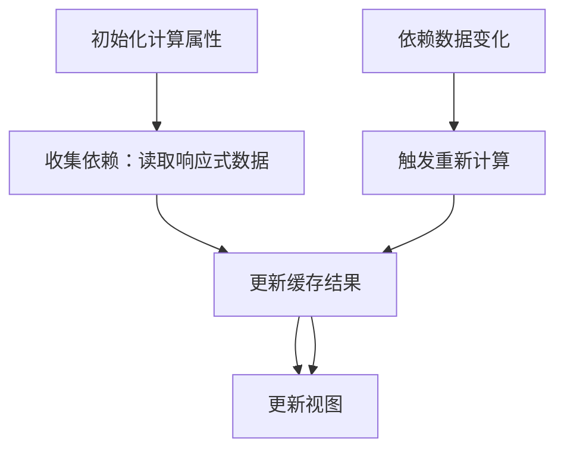

扫描[二维码](https://api2.cmdragon.cn/upload/cmder/20250304_012821924.jpg)关注或者微信搜一搜：`编程智域 前端至全栈交流与成长`

[发现1000+提升效率与开发的AI工具和实用程序](https://tools.cmdragon.cn/zh/apps?category=ai_chat)：https://tools.cmdragon.cn/

### 1 计算属性的基本概念

在Vue3的响应式系统中，我们经常需要基于**响应式数据**生成新的数据（比如过滤数组、拼接字符串）。如果直接在模板中写复杂逻辑（比如
`{{ todos.filter(todo => todo.completed).length }}`），会让模板变得臃肿、难以维护——这就是计算属性要解决的核心问题。

#### 1.1 什么是计算属性？

计算属性（Computed Property）是**基于响应式依赖自动计算并缓存结果**的属性。它的本质是一个**带缓存的响应式函数**：

- 当依赖的响应式数据变化时，计算属性会**自动重新计算**；
- 当依赖没有变化时，计算属性会**直接返回缓存的结果**，不会重复执行逻辑。

用官网的话来说：*“计算属性是基于它们的响应式依赖进行缓存的。只有当依赖发生改变时，它们才会重新求值。”*

#### 1.2 计算属性与方法的区别

很多初学者会混淆**计算属性**和**方法**（Method），两者的核心区别在于**缓存机制**：
| 特性 | 计算属性 | 方法 |
|---------------------|---------------------------|---------------------------|
| 缓存 | 依赖不变时返回缓存结果 | 每次调用都重新执行逻辑 |
| 触发时机 | 依赖变化时自动更新 | 手动调用时执行 |
| 适用场景 | 频繁使用的复杂逻辑 | 单次或手动触发的逻辑 |

举个例子：如果需要多次显示“已完成任务数”，用计算属性只需计算一次（依赖变化时更新），而用方法会每次调用都重新过滤数组——计算属性的性能更优。

### 2 计算属性的核心作用

计算属性的价值可以总结为三点：**简化模板、缓存性能、自动更新**。

#### 2.1 简化模板逻辑

模板的职责是**展示数据**，而非处理逻辑。把复杂逻辑抽到计算属性中，能让模板更简洁、易读。

**示例**：原模板中的复杂逻辑

```vue
<!-- 模板里直接写过滤和计数逻辑，臃肿！ -->
<p>已完成任务数：{{ todos.filter(todo => todo.completed).length }}</p>
```

**优化后**：用计算属性简化模板

```vue

<template>
  <p>已完成任务数：{{ completedCount }}</p>
</template>

<script setup>
  import {ref, computed} from 'vue'

  const todos = ref([/* 任务列表 */])
  // 计算属性：已完成任务数
  const completedCount = computed(() => {
    return todos.value.filter(todo => todo.completed).length
  })
</script>
```

#### 2.2 缓存结果提升性能

计算属性会缓存结果，只有当**依赖的响应式数据变化**时才重新计算。这对性能敏感的场景（比如大数据量过滤、复杂运算）非常友好。

**示例**：频繁使用计算属性

```vue

<template>
  <!-- 多次使用计算属性，只会计算一次 -->
  <p>已完成：{{ completedCount }}</p>
  <p>已完成占比：{{ completedRatio }}%</p>
</template>

<script setup>
  const completedCount = computed(() => {
    console.log('计算已完成任务数...') // 仅依赖变化时打印
    return todos.value.filter(todo => todo.completed).length
  })
  // 依赖completedCount的计算属性
  const completedRatio = computed(() => {
    return (completedCount.value / todos.value.length) * 100
  })
</script>
```

当`todos`不变时，无论多少次使用`completedCount`，都只会打印一次“计算已完成任务数...”——缓存生效了！

#### 2.3 自动追踪依赖更新

计算属性会**自动追踪它用到的所有响应式依赖**（比如`ref`或`reactive`包裹的数据）。当任何一个依赖变化时，计算属性会自动重新计算，并触发视图更新。

这个过程是Vue响应式系统的核心能力，无需手动监听或触发——“写更少的代码，做更多的事”。

### 3 计算属性的工作原理

要真正理解计算属性，需要先了解Vue的**响应式依赖追踪机制**。我们用流程图拆解它的工作流程：



**详细步骤**：

1. **依赖收集**：当计算属性首次执行时，Vue会记录它用到的所有响应式数据（比如`todos`）。
2. **缓存结果**：计算属性将结果缓存起来，供后续使用。
3. **依赖变化**：当依赖的响应式数据（比如`todos`中的某条任务被标记为完成）变化时，Vue会触发计算属性重新计算。
4. **更新视图**：计算属性的新结果会替换缓存，并自动更新依赖它的视图。

### 4 计算属性的应用场景

计算属性不是“银弹”，但在以下场景中能发挥最大价值：

#### 4.1 复杂数据转换

当需要将响应式数据转换为另一种格式（比如过滤数组、格式化日期）时，计算属性是最佳选择。

**示例**：过滤任务列表

```vue

<script setup>
  import {ref, computed} from 'vue'

  // 响应式数据：任务列表和过滤状态
  const todos = ref([
    {id: 1, text: '学习Vue3', completed: true},
    {id: 2, text: '写博客', completed: false},
    {id: 3, text: '锻炼身体', completed: false}
  ])
  const filterStatus = ref('all') // 过滤状态：all/active/completed

  // 计算属性：根据过滤状态返回任务列表
  const filteredTodos = computed(() => {
    switch (filterStatus.value) {
      case 'active':
        return todos.value.filter(todo => !todo.completed)
      case 'completed':
        return todos.value.filter(todo => todo.completed)
      default:
        return todos.value
    }
  })
</script>
```

#### 4.2 组合多个响应式数据

当需要将多个响应式数据组合成新数据时，计算属性能自动追踪所有依赖。

**示例**：组合用户名和邮箱

```vue

<script setup>
  import {ref, computed} from 'vue'

  const firstName = ref('张')
  const lastName = ref('三')
  const email = ref('zhangsan@example.com')

  // 计算属性：组合成显示名称（如“张三 <zhangsan@example.com>”）
  const displayName = computed(() => {
    return `${firstName.value}${lastName.value} <${email.value}>`
  })
</script>
```

#### 4.3 避免重复计算

对于频繁使用的复杂逻辑（比如大量数据的排序、统计），计算属性的缓存机制能避免重复计算，提升性能。

**示例**：统计商品总价

```vue

<script setup>
  import {ref, computed} from 'vue'

  const cart = ref([
    {id: 1, name: '手机', price: 5000, quantity: 1},
    {id: 2, name: '耳机', price: 1000, quantity: 2}
  ])

  // 计算属性：购物车总价（仅当cart变化时重新计算）
  const totalPrice = computed(() => {
    return cart.value.reduce((sum, item) => sum + item.price * item.quantity, 0)
  })
</script>
```

### 5 实战示例：Todo List 过滤功能

我们用计算属性实现一个完整的Todo List，包含**添加任务**和**过滤状态**功能。

#### 5.1 完整代码（Vue3 + `<script setup>`）

```vue
<template>
  <div class="todo-app">
    <!-- 添加任务输入框 -->
    <input
      v-model="newTodoText"
      placeholder="请输入任务"
      @keyup.enter="addTodo"
      class="todo-input"
    />
    <!-- 过滤状态下拉框 -->
    <select v-model="filterStatus" class="filter-select">
      <option value="all">全部任务</option>
      <option value="active">未完成任务</option>
      <option value="completed">已完成任务</option>
    </select>
    <!-- 显示过滤后的任务列表 -->
    <ul class="todo-list">
      <li v-for="todo in filteredTodos" :key="todo.id" class="todo-item">
        <input
          type="checkbox"
          v-model="todo.completed"
          class="todo-checkbox"
        />
        <span :class="{ completed: todo.completed }">{{ todo.text }}</span>
      </li>
    </ul>
  </div>
</template>

<script setup>
import { ref, computed } from 'vue'

// 1. 响应式数据：任务列表（初始有3条测试数据）
const todos = ref([
  { id: 1, text: '学习Vue3计算属性', completed: true },
  { id: 2, text: '写一篇技术博客', completed: false },
  { id: 3, text: '每天锻炼30分钟', completed: false }
])

// 2. 响应式数据：新任务输入内容
const newTodoText = ref('')

// 3. 响应式数据：过滤状态（默认显示全部）
const filterStatus = ref('all')

// 4. 计算属性：过滤后的任务列表（依赖todos和filterStatus）
const filteredTodos = computed(() => {
  // 根据过滤状态返回不同的任务列表
  if (filterStatus.value === 'active') {
    return todos.value.filter(todo => !todo.completed)
  } else if (filterStatus.value === 'completed') {
    return todos.value.filter(todo => todo.completed)
  } else {
    return todos.value // 默认返回全部任务
  }
})

// 5. 方法：添加新任务
const addTodo = () => {
  const text = newTodoText.value.trim()
  if (text) {
    todos.value.push({
      id: Date.now(), // 用时间戳生成唯一ID
      text: text,
      completed: false // 新任务默认未完成
    })
    newTodoText.value = '' // 清空输入框
  }
}
</script>

<style scoped>
.todo-app { max-width: 400px; margin: 20px auto; padding: 0 20px; }
.todo-input { width: 100%; padding: 10px; margin-bottom: 10px; }
.filter-select { padding: 5px; margin-bottom: 10px; }
.todo-list { list-style: none; padding: 0; }
.todo-item { display: flex; align-items: center; padding: 10px 0; border-bottom: 1px solid #eee; }
.todo-checkbox { margin-right: 10px; }
.completed { text-decoration: line-through; color: #888; }
</style>
```

#### 5.2 代码说明

- **响应式数据**：`todos`（任务列表）、`newTodoText`（新任务输入）、`filterStatus`（过滤状态）都是用`ref`创建的响应式数据。
- **计算属性**：`filteredTodos`依赖`todos`和`filterStatus`——当用户修改过滤状态（比如切换到“未完成任务”）或修改任务的完成状态时，
  `filteredTodos`会自动重新计算，更新任务列表。
- **方法**：`addTodo`用于添加新任务，通过`push`修改`todos`（响应式数据），触发计算属性更新。

#### 5.3 运行效果

1. 输入任务并按回车键，新任务会添加到列表中。
2. 切换过滤状态（全部/未完成/已完成），任务列表会自动过滤。
3. 点击任务前的checkbox，任务状态会切换，计算属性会自动更新列表。

### 6 课后 Quiz

通过以下问题巩固所学知识（答案附后）：

#### 6.1 问题1

计算属性与方法的核心区别是什么？请用代码示例说明。

#### 6.2 问题2

以下计算属性是否正确？如果错误，请指出原因并修正。

```javascript
const wrongComputed = computed(() => {
    todos.value.filter(todo => todo.completed)
})
```

#### 6.3 问题3

在实战示例中，当用户修改`filterStatus`的值时，`filteredTodos`会发生什么变化？为什么？

#### 6.4 答案解析

1. **问题1答案**：  
   核心区别是**缓存机制**。计算属性会缓存结果（依赖变化时更新），方法每次调用都重新执行。  
   示例：
   ```javascript
   // 计算属性：仅当todos变化时重新计算
   const completedCount = computed(() => todos.value.filter(t => t.completed).length)
   // 方法：每次调用都重新过滤
   const getCompletedCount = () => todos.value.filter(t => t.completed).length
   ```

2. **问题2答案**：  
   错误。计算属性必须**返回一个值**，否则Vue无法缓存结果。  
   修正：
   ```javascript
   const correctComputed = computed(() => {
     return todos.value.filter(todo => todo.completed) // 添加return
   })
   ```

3. **问题3答案**：  
   `filteredTodos`会**重新计算并返回新的过滤列表**。因为`filterStatus`是响应式数据，计算属性`filteredTodos`依赖它——当
   `filterStatus`变化时，Vue会触发计算属性重新计算。

### 7 常见报错与解决方案

在使用计算属性时，初学者常遇到以下问题：

#### 7.1 报错1：计算属性没有返回值

**错误示例**：

```javascript
const noReturn = computed(() => {
    todos.value.filter(t => t.completed) // 没有return！
})
```

**原因**：计算属性的函数必须返回一个值，否则Vue无法缓存结果或更新视图。  
**解决**：添加`return`语句，确保函数有返回值。

#### 7.2 报错2：依赖未被正确追踪

**错误示例**：

```javascript
// 非响应式数据：无法被Vue追踪
const nonReactiveFilter = {status: 'completed'}
const filteredTodos = computed(() => {
    return todos.value.filter(t => t.completed === nonReactiveFilter.status)
})
```

**现象**：修改`nonReactiveFilter.status`时，`filteredTodos`不会更新。  
**原因**：计算属性只能追踪**响应式数据**（`ref`/`reactive`包裹的数据）的变化。  
**解决**：将非响应式数据转为响应式：

```javascript
const reactiveFilter = ref({status: 'completed'}) // 用ref包裹
const filteredTodos = computed(() => {
    return todos.value.filter(t => t.completed === reactiveFilter.value.status)
})
```

#### 7.3 报错3：无限循环

**错误示例**：

```javascript
const count = ref(0)
// 计算属性依赖自己，导致无限循环
const infiniteLoop = computed(() => {
    count.value++ // 修改了依赖的响应式数据
    return count.value
})
```

**现象**：页面崩溃或控制台报错“Maximum call stack size exceeded”。  
**原因**：计算属性的逻辑修改了自己的依赖（`count`），导致无限触发重新计算。  
**解决**：确保计算属性是**纯函数**（不修改依赖的响应式数据，仅根据依赖计算结果）。

### 参考链接

- Vue3 计算属性官方文档：https://vuejs.org/guide/essentials/computed.html
- Vue3 响应式系统官方文档：https://vuejs.org/guide/essentials/reactivity-fundamentals.html

余下文章内容请点击跳转至 个人博客页面 或者 扫描[二维码](https://api2.cmdragon.cn/upload/cmder/20250304_012821924.jpg)
关注或者微信搜一搜：`编程智域 前端至全栈交流与成长`
，阅读完整的文章：[Vue3计算属性如何兼顾模板简化、性能优化与响应式自动更新？](https://blog.cmdragon.cn/posts/8bb768094210808e57a6549f08fd7d7a/)


<details>
<summary>往期文章归档</summary>

- [Vue浅响应式如何解决深层响应式的性能问题？适用场景有哪些？ - cmdragon's Blog](https://blog.cmdragon.cn/posts/c85e1fe16a7ae45e965b4e2df4d9d2f4/)
- [Vue 3组合式API中ref与reactive的核心响应式差异及使用最佳实践是什么？ - cmdragon's Blog](https://blog.cmdragon.cn/posts/be04b02d2723994632de0d4ca22a3391/)
- [Vue 3组合式API中ref与reactive的核心响应式差异及使用最佳实践是什么？ - cmdragon's Blog](https://blog.cmdragon.cn/posts/be04b02d2723994632de0d4ca22a3391/)
- [Vue3响应式系统中，对象新增属性、数组改索引、原始值代理的问题如何解决？ - cmdragon's Blog](https://blog.cmdragon.cn/posts/a0af08dd60a37b9a890a9957f2cbfc9f/)
- [Vue 3中watch侦听器的正确使用姿势你掌握了吗？深度监听、与watchEffect的差异及常见报错解析 - cmdragon's Blog](https://blog.cmdragon.cn/posts/bc287e1e36287afd90750fd907eca85e/)
- [Vue响应式声明的API差异、底层原理与常见陷阱你都搞懂了吗 - cmdragon's Blog](https://blog.cmdragon.cn/posts/654b9447ef1ba7ec1126a1bc26a4726d/)
- [Vue响应式声明的API差异、底层原理与常见陷阱你都搞懂了吗 - cmdragon's Blog](https://blog.cmdragon.cn/posts/654b9447ef1ba7ec1126a1bc26a4726d/)
- [为什么Vue 3需要ref函数？它的响应式原理与正确用法是什么？ - cmdragon's Blog](https://blog.cmdragon.cn/posts/c405a8d9950af5b7c63b56c348ac36b6/)
- [Vue 3中reactive函数如何通过Proxy实现响应式？使用时要避开哪些误区？ - cmdragon's Blog](https://blog.cmdragon.cn/posts/a7e9abb9691a81e4404d9facabe0f7c3/)
- [Vue3响应式系统的底层原理与实践要点你真的懂吗？ - cmdragon's Blog](https://blog.cmdragon.cn/posts/bd995ea45161727597fb85b62566c43d/)
- [Vue 3模板如何通过编译三阶段实现从声明式语法到高效渲染的跨越 - cmdragon's Blog](https://blog.cmdragon.cn/posts/53e3f270a80675df662c6857a3332c0f/)
- [快速入门Vue模板引用：从收DOM“快递”到调子组件方法，你玩明白了吗？ - cmdragon's Blog](https://blog.cmdragon.cn/posts/ddbce4f2a23aa72c96b1c0473900321e/)
- [快速入门Vue模板里的JS表达式有啥不能碰？计算属性为啥比方法更能打？ - cmdragon's Blog](https://blog.cmdragon.cn/posts/23a2d5a334e15575277814c16e45df50/)
- [快速入门Vue的v-model表单绑定：语法糖、动态值、修饰符的小技巧你都掌握了吗？ - cmdragon's Blog](https://blog.cmdragon.cn/posts/6be38de6382e31d282659b689c5b17f0/)
- [快速入门Vue3事件处理的挑战题：v-on、修饰符、自定义事件你能通关吗？ - cmdragon's Blog](https://blog.cmdragon.cn/posts/60ce517684f4a418f453d66aa805606c/)
- [快速入门Vue3的v-指令：数据和DOM的“翻译官”到底有多少本事？ - cmdragon's Blog](https://blog.cmdragon.cn/posts/e4ae7d5e4a9205bb11b2baccb230c637/)
- [快速入门Vue3，插值、动态绑定和避坑技巧你都搞懂了吗？ - cmdragon's Blog](https://blog.cmdragon.cn/posts/999ce4fb32259ff4fbf4bf7bcb851654/)
- [想让PostgreSQL快到飞起？先找健康密码还是先换引擎？ - cmdragon's Blog](https://blog.cmdragon.cn/posts/a6997d81b49cd232b87e1cf603888ad1/)
- [想让PostgreSQL查询快到飞起？分区表、物化视图、并行查询这三招灵不灵？ - cmdragon's Blog](https://blog.cmdragon.cn/posts/1fee7afbb9abd4540b8aa9c141d6845d/)
- [子查询总拖慢查询？把它变成连接就能解决？ - cmdragon's Blog](https://blog.cmdragon.cn/posts/79c590fbd87ece535b11a71c9667884f/)
- [PostgreSQL全表扫描慢到崩溃？建索引+改查询+更统计信息三招能破？ - cmdragon's Blog](https://blog.cmdragon.cn/posts/748cdac2536008199abf8a8a2cd0ec85/)
- [复杂查询总拖后腿？PostgreSQL多列索引+覆盖索引的神仙技巧你get没？ - cmdragon's Blog](https://blog.cmdragon.cn/posts/32ca943703226d317d4276a8fb53b0dd/)
- [只给表子集建索引？用函数结果建索引？PostgreSQL这俩操作凭啥能省空间又加速？ - cmdragon's Blog](https://blog.cmdragon.cn/posts/ca93f1d53aa910e7ba5ffd8df611c12b/)
- [B-tree索引像字典查词一样工作？那哪些数据库查询它能加速，哪些不能？ - cmdragon's Blog](https://blog.cmdragon.cn/posts/f507856ebfddd592448813c510a53669/)
- [想抓PostgreSQL里的慢SQL？pg_stat_statements基础黑匣子和pg_stat_monitor时间窗，谁能帮你更准揪出性能小偷？ - cmdragon's Blog](https://blog.cmdragon.cn/posts/b2213bfcb5b88a862f2138404c03d596/)
- [PostgreSQL的“时光机”MVCC和锁机制是怎么搞定高并发的？ - cmdragon's Blog](https://blog.cmdragon.cn/posts/26614eb7da6c476dde41d367ad888d2f/)
- [PostgreSQL性能暴涨的关键？内存IO并发参数居然要这么设置？ - cmdragon's Blog](https://blog.cmdragon.cn/posts/69f99bc6972a860d559c74aad7280da4/)
- [大表查询慢到翻遍整个书架？PostgreSQL分区表教你怎么“分类”才高效](https://blog.cmdragon.cn/posts/7b7053f392147a8b3b1a16bebeb08d0a/)
- [PostgreSQL 查询慢？是不是忘了优化 GROUP BY、ORDER BY 和窗口函数？ - cmdragon's Blog](https://blog.cmdragon.cn/posts/c856e3cb073822349f3bf2d29995dcfc/)
- [PostgreSQL里的子查询和CTE居然在性能上“掐架”？到底该站哪边？ - cmdragon's Blog](https://blog.cmdragon.cn/posts/c096347d18e67b7431faacd2c4757093/)
- [PostgreSQL选Join策略有啥小九九？Nested Loop/Merge/Hash谁是它的菜？ - cmdragon's Blog](https://blog.cmdragon.cn/posts/2eca89463454fd4250d7b66243b9fe5a/)
- [PostgreSQL新手SQL总翻车？这7个性能陷阱你踩过没？ - cmdragon's Blog](https://blog.cmdragon.cn/posts/068ecb772a87d7df20a8c9fb4b233f8e/)
- [PostgreSQL索引选B-Tree还是GiST？“瑞士军刀”和“多面手”的差别你居然还不知道？ - cmdragon's Blog](https://blog.cmdragon.cn/posts/d498f63cd0a2d5a77e445c688a8b88db/)
- [想知道数据库怎么给查询“算成本选路线”？EXPLAIN能帮你看明白？ - cmdragon's Blog](https://blog.cmdragon.cn/posts/9101b75bdec6faea9b35d54f14e37f36/)
- [PostgreSQL处理SQL居然像做蛋糕？解析到执行的4步里藏着多少查询优化的小心机？ - cmdragon's Blog](https://blog.cmdragon.cn/posts/d527f8ebb6e3dae2c7dfe4c8d8979444/)
- [PostgreSQL备份不是复制文件？物理vs逻辑咋选？误删还能精准恢复到1分钟前？ - cmdragon's Blog](https://blog.cmdragon.cn/posts/6bfdae84f313cf7ad0bb7045c4392347/)
- [转账不翻车、并发不干扰，PostgreSQL的ACID特性到底有啥魔法？ - cmdragon's Blog](https://blog.cmdragon.cn/posts/de3672803de34dbad244d0a8d48b0eb5/)
- [银行转账不白扣钱、电商下单不超卖，PostgreSQL事务的诀窍是啥？ - cmdragon's Blog](https://blog.cmdragon.cn/posts/e463e8a2668abdf00a228c9b79324ded/)
- [PostgreSQL里的PL/pgSQL到底是啥？能让SQL从“说目标”变“讲步骤”？ - cmdragon's Blog](https://blog.cmdragon.cn/posts/5c967e595058c4a1fc4474a68e64031d/)
- [PostgreSQL视图不存数据？那它怎么简化查询还能递归生成序列和控制权限？ - cmdragon's Blog](https://blog.cmdragon.cn/posts/325047855e3e23b5ef82f7d2db134fbd/)
- [PostgreSQL索引这么玩，才能让你的查询真的“飞”起来？ - cmdragon's Blog](https://blog.cmdragon.cn/posts/d2dba50bb6e4df7b27e735245a06a2a2/)
- [PostgreSQL的表关系和约束，咋帮你搞定用户订单不混乱、学生选课不重复？ - cmdragon's Blog](https://blog.cmdragon.cn/posts/849ae5bab0f8c66e94c2f6ad1bb798e3/)
- [PostgreSQL查询的筛子、排序、聚合、分组？你会用它们搞定数据吗？ - cmdragon's Blog](https://blog.cmdragon.cn/posts/ef4800975ffa84f1ca51976a70a1585b/)
- [PostgreSQL数据类型怎么选才高效不踩坑？ - cmdragon's Blog](https://blog.cmdragon.cn/posts/bf54711525c507c5eacfa7b0151c39d2/)
- [想解锁PostgreSQL查询从基础到进阶的核心知识点？你都get了吗？ - cmdragon's Blog](https://blog.cmdragon.cn/posts/887809b3e0375f5956873cd442f516d8/)
- [PostgreSQL DELETE居然有这些操作？返回数据、连表删你试过没？ - cmdragon's Blog](https://blog.cmdragon.cn/posts/934be1203725e8be9d6f6e9104e5abcc/)
- [PostgreSQL UPDATE语句怎么玩？从改邮箱到批量更新的避坑技巧你都会吗？ - cmdragon's Blog](https://blog.cmdragon.cn/posts/0f0622e9b7402b599e618150d0596ffe/)
- [PostgreSQL插入数据还在逐条敲？批量、冲突处理、返回自增ID的技巧你会吗？ - cmdragon's Blog](https://blog.cmdragon.cn/posts/0e3bf7efc030b024ea67ee855a00f2de/)
- [PostgreSQL的“仓库-房间-货架”游戏，你能建出电商数据库和表吗？ - cmdragon's Blog](https://blog.cmdragon.cn/posts/b6cd3c86da6aac26ed829e472d34078e/)
- [PostgreSQL 17安装总翻车？Windows/macOS/Linux避坑指南帮你搞定？ - cmdragon's Blog](https://blog.cmdragon.cn/posts/ba1f545a3410144552fbdbfcf31b5265/)
- [能当关系型数据库还能玩对象特性，能拆复杂查询还能自动管库存，PostgreSQL凭什么这么香？ - cmdragon's Blog](https://blog.cmdragon.cn/posts/b5474d1480509c5072085abc80b3dd9f/)
- [给接口加新字段又不搞崩老客户端？FastAPI的多版本API靠哪三招实现？ - cmdragon's Blog](https://blog.cmdragon.cn/posts/cc098d8836e787baa8a4d92e4d56d5c5/)
- [流量突增要搞崩FastAPI？熔断测试是怎么防系统雪崩的？ - cmdragon's Blog](https://blog.cmdragon.cn/posts/46d05151c5bd31cf37a7bcf0b8f5b0b8/)
- [FastAPI秒杀库存总变负数？Redis分布式锁能帮你守住底线吗 - cmdragon's Blog](https://blog.cmdragon.cn/posts/65ce343cc5df9faf3a8e2eeaab42ae45/)
- [FastAPI的CI流水线怎么自动测端点，还能让Allure报告美到犯规？ - cmdragon's Blog](https://blog.cmdragon.cn/posts/eed6cd8985d9be0a4b092a7da38b3e0c/)
- [如何用GitHub Actions为FastAPI项目打造自动化测试流水线？ - cmdragon's Blog](https://blog.cmdragon.cn/posts/6157d87338ce894d18c013c3c4777abb/)
- [如何用Git Hook和CI流水线为FastAPI项目保驾护航？ - cmdragon's Blog](https://blog.cmdragon.cn/posts/fc4ef84559e04693a620d0714cb30787/)
- [FastAPI如何用契约测试确保API的「菜单」与「菜品」一致？](https://blog.cmdragon.cn/posts/02b0c96842d1481c72dab63a149ce0dd/)
- [为什么TDD能让你的FastAPI开发飞起来？ - cmdragon's Blog](https://blog.cmdragon.cn/posts/c9c1e3bb0fdc15303b9b3b1f20124b0b/)

</details>


<details>
<summary>免费好用的热门在线工具</summary>

- [RAID 计算器 - 应用商店 | By cmdragon](https://tools.cmdragon.cn/zh/apps/raid-calculator)
- [在线PS - 应用商店 | By cmdragon](https://tools.cmdragon.cn/zh/apps/photoshop-online)
- [Mermaid 在线编辑器 - 应用商店 | By cmdragon](https://tools.cmdragon.cn/zh/apps/mermaid-live-editor)
- [数学求解计算器 - 应用商店 | By cmdragon](https://tools.cmdragon.cn/zh/apps/math-solver-calculator)
- [智能提词器 - 应用商店 | By cmdragon](https://tools.cmdragon.cn/zh/apps/smart-teleprompter)
- [魔法简历 - 应用商店 | By cmdragon](https://tools.cmdragon.cn/zh/apps/magic-resume)
- [Image Puzzle Tool - 图片拼图工具 | By cmdragon](https://tools.cmdragon.cn/zh/apps/image-puzzle-tool)
- [字幕下载工具 - 应用商店 | By cmdragon](https://tools.cmdragon.cn/zh/apps/subtitle-downloader)
- [歌词生成工具 - 应用商店 | By cmdragon](https://tools.cmdragon.cn/zh/apps/lyrics-generator)
- [网盘资源聚合搜索 - 应用商店 | By cmdragon](https://tools.cmdragon.cn/zh/apps/cloud-drive-search)
- [ASCII字符画生成器 - 应用商店 | By cmdragon](https://tools.cmdragon.cn/zh/apps/ascii-art-generator)
- [JSON Web Tokens 工具 - 应用商店 | By cmdragon](https://tools.cmdragon.cn/zh/apps/jwt-tool)
- [Bcrypt 密码工具 - 应用商店 | By cmdragon](https://tools.cmdragon.cn/zh/apps/bcrypt-tool)
- [GIF 合成器 - 应用商店 | By cmdragon](https://tools.cmdragon.cn/zh/apps/gif-composer)
- [GIF 分解器 - 应用商店 | By cmdragon](https://tools.cmdragon.cn/zh/apps/gif-decomposer)
- [文本隐写术 - 应用商店 | By cmdragon](https://tools.cmdragon.cn/zh/apps/text-steganography)
- [CMDragon 在线工具 - 高级AI工具箱与开发者套件 | 免费好用的在线工具](https://tools.cmdragon.cn/zh)
- [应用商店 - 发现1000+提升效率与开发的AI工具和实用程序 | 免费好用的在线工具](https://tools.cmdragon.cn/zh/apps?category=trending)
- [CMDragon 更新日志 - 最新更新、功能与改进 | 免费好用的在线工具](https://tools.cmdragon.cn/zh/changelog)
- [支持我们 - 成为赞助者 | 免费好用的在线工具](https://tools.cmdragon.cn/zh/sponsor)
- [AI文本生成图像 - 应用商店 | 免费好用的在线工具](https://tools.cmdragon.cn/zh/apps/text-to-image-ai)
- [临时邮箱 - 应用商店 | 免费好用的在线工具](https://tools.cmdragon.cn/zh/apps/temp-email)
- [二维码解析器 - 应用商店 | 免费好用的在线工具](https://tools.cmdragon.cn/zh/apps/qrcode-parser)
- [文本转思维导图 - 应用商店 | 免费好用的在线工具](https://tools.cmdragon.cn/zh/apps/text-to-mindmap)
- [正则表达式可视化工具 - 应用商店 | 免费好用的在线工具](https://tools.cmdragon.cn/zh/apps/regex-visualizer)
- [文件隐写工具 - 应用商店 | 免费好用的在线工具](https://tools.cmdragon.cn/zh/apps/steganography-tool)
- [IPTV 频道探索器 - 应用商店 | 免费好用的在线工具](https://tools.cmdragon.cn/zh/apps/iptv-explorer)
- [快传 - 应用商店 | 免费好用的在线工具](https://tools.cmdragon.cn/zh/apps/snapdrop)
- [随机抽奖工具 - 应用商店 | 免费好用的在线工具](https://tools.cmdragon.cn/zh/apps/lucky-draw)
- [动漫场景查找器 - 应用商店 | 免费好用的在线工具](https://tools.cmdragon.cn/zh/apps/anime-scene-finder)
- [时间工具箱 - 应用商店 | 免费好用的在线工具](https://tools.cmdragon.cn/zh/apps/time-toolkit)
- [网速测试 - 应用商店 | 免费好用的在线工具](https://tools.cmdragon.cn/zh/apps/speed-test)
- [AI 智能抠图工具 - 应用商店 | 免费好用的在线工具](https://tools.cmdragon.cn/zh/apps/background-remover)
- [背景替换工具 - 应用商店 | 免费好用的在线工具](https://tools.cmdragon.cn/zh/apps/background-replacer)
- [艺术二维码生成器 - 应用商店 | 免费好用的在线工具](https://tools.cmdragon.cn/zh/apps/artistic-qrcode)
- [Open Graph 元标签生成器 - 应用商店 | 免费好用的在线工具](https://tools.cmdragon.cn/zh/apps/open-graph-generator)
- [图像对比工具 - 应用商店 | 免费好用的在线工具](https://tools.cmdragon.cn/zh/apps/image-comparison)
- [图片压缩专业版 - 应用商店 | 免费好用的在线工具](https://tools.cmdragon.cn/zh/apps/image-compressor)
- [密码生成器 - 应用商店 | 免费好用的在线工具](https://tools.cmdragon.cn/zh/apps/password-generator)
- [SVG优化器 - 应用商店 | 免费好用的在线工具](https://tools.cmdragon.cn/zh/apps/svg-optimizer)
- [调色板生成器 - 应用商店 | 免费好用的在线工具](https://tools.cmdragon.cn/zh/apps/color-palette)
- [在线节拍器 - 应用商店 | 免费好用的在线工具](https://tools.cmdragon.cn/zh/apps/online-metronome)
- [IP归属地查询 - 应用商店 | 免费好用的在线工具](https://tools.cmdragon.cn/zh/apps/ip-geolocation)
- [CSS网格布局生成器 - 应用商店 | 免费好用的在线工具](https://tools.cmdragon.cn/zh/apps/css-grid-layout)
- [邮箱验证工具 - 应用商店 | 免费好用的在线工具](https://tools.cmdragon.cn/zh/apps/email-validator)
- [书法练习字帖 - 应用商店 | 免费好用的在线工具](https://tools.cmdragon.cn/zh/apps/calligraphy-practice)
- [金融计算器套件 - 应用商店 | 免费好用的在线工具](https://tools.cmdragon.cn/zh/apps/finance-calculator-suite)
- [中国亲戚关系计算器 - 应用商店 | 免费好用的在线工具](https://tools.cmdragon.cn/zh/apps/chinese-kinship-calculator)
- [Protocol Buffer 工具箱 - 应用商店 | 免费好用的在线工具](https://tools.cmdragon.cn/zh/apps/protobuf-toolkit)
- [IP归属地查询 - 应用商店 | 免费好用的在线工具](https://tools.cmdragon.cn/zh/apps/ip-geolocation)
- [图片无损放大 - 应用商店 | 免费好用的在线工具](https://tools.cmdragon.cn/zh/apps/image-upscaler)
- [文本比较工具 - 应用商店 | 免费好用的在线工具](https://tools.cmdragon.cn/zh/apps/text-compare)
- [IP批量查询工具 - 应用商店 | 免费好用的在线工具](https://tools.cmdragon.cn/zh/apps/ip-batch-lookup)
- [域名查询工具 - 应用商店 | 免费好用的在线工具](https://tools.cmdragon.cn/zh/apps/domain-finder)
- [DNS工具箱 - 应用商店 | 免费好用的在线工具](https://tools.cmdragon.cn/zh/apps/dns-toolkit)
- [网站图标生成器 - 应用商店 | 免费好用的在线工具](https://tools.cmdragon.cn/zh/apps/favicon-generator)
- [XML Sitemap](https://tools.cmdragon.cn/sitemap_index.xml)

</details>