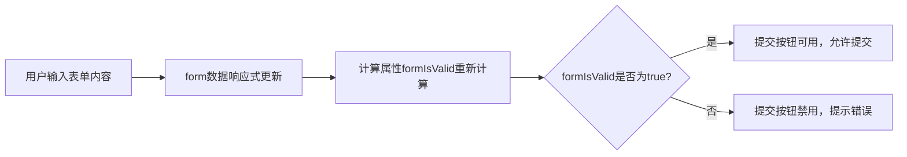

扫描[二维码](https://api2.cmdragon.cn/upload/cmder/20250304_012821924.jpg)关注或者微信搜一搜：`编程智域 前端至全栈交流与成长`

[发现1000+提升效率与开发的AI工具和实用程序](https://tools.cmdragon.cn/zh/apps?category=ai_chat)：https://tools.cmdragon.cn/

在日常开发中，表单验证和动态数据过滤几乎是每个项目都会遇到的需求——比如用户注册时要检查输入是否合法，商品列表要根据关键词实时筛选。这两个场景看似简单，但处理不好容易写出冗余、低效的代码。而Vue3的**
计算属性（Computed Properties）**正好是解决这类问题的“神器”，今天我们就通过实战案例，看看它如何简化状态管理和逻辑复用。

## 一、表单验证：用计算属性简化状态管理

### 1.1 为什么用计算属性做表单验证？

做表单验证时，我们需要判断“所有字段是否合法”——比如用户名不能为空、密码至少6位、确认密码要一致。如果用`methods`
写，每次模板渲染都会重新调用方法，哪怕字段没变化；而**计算属性会缓存结果**，只有当依赖的响应式数据（比如`form.username`
）变化时，才会重新计算。这样既省性能，又让代码更简洁。

Vue官网是这么说的：“计算属性基于它们的依赖进行缓存。只在相关依赖发生改变时才会重新求值。”（参考：https://vuejs.org/guide/essentials/computed.html）

### 1.2 实战：用户注册表单验证

我们来写一个用户注册表单，用计算属性判断表单是否可以提交。代码如下：

```vue

<template>
  <form class="register-form" @submit.prevent="handleSubmit">
    <!-- 用户名输入框 -->
    <div class="form-group">
      <label>用户名：</label>
      <input
          v-model.trim="form.username"
          placeholder="请输入3-10位字符"
          class="form-input"
      />
      <!-- 错误提示 -->
      <p v-if="!form.username" class="error-msg">用户名不能为空</p>
    </div>

    <!-- 密码输入框 -->
    <div class="form-group">
      <label>密码：</label>
      <input
          type="password"
          v-model="form.password"
          placeholder="请输入6-16位密码"
          class="form-input"
      />
      <p v-if="form.password.length < 6" class="error-msg">密码至少6位</p>
    </div>

    <!-- 确认密码 -->
    <div class="form-group">
      <label>确认密码：</label>
      <input
          type="password"
          v-model="form.confirmPassword"
          placeholder="请再次输入密码"
          class="form-input"
      />
      <p v-if="form.confirmPassword !== form.password" class="error-msg">两次密码不一致</p>
    </div>

    <!-- 提交按钮：禁用状态由计算属性控制 -->
    <button
        type="submit"
        class="submit-btn"
        :disabled="!formIsValid"
    >
      提交注册
    </button>
  </form>
</template>

<script setup>
  import {ref, computed} from 'vue'

  // 1. 响应式表单数据
  const form = ref({
    username: '',   // 用户名
    password: '',   // 密码
    confirmPassword: ''  // 确认密码
  })

  // 2. 计算属性：判断表单是否合法
  const formIsValid = computed(() => {
    // 解构form数据，简化代码
    const {username, password, confirmPassword} = form.value
    // 验证逻辑：用户名非空 + 密码≥6位 + 两次密码一致
    return (
        username.trim() !== '' &&  // 去掉空格后非空
        password.length >= 6 &&    // 密码长度足够
        confirmPassword === password  // 确认密码一致
    )
  })

  // 3. 提交事件处理
  const handleSubmit = () => {
    if (formIsValid.value) {
      alert('注册成功！');
      // 这里可以加向后端提交数据的逻辑，比如axios.post('/api/register', form.value)
    }
  }
</script>

<style scoped>
  .register-form {
    max-width: 400px;
    margin: 20px auto;
  }

  .form-group {
    margin-bottom: 15px;
  }

  .form-input {
    width: 100%;
    padding: 8px;
    margin-top: 5px;
  }

  .error-msg {
    color: red;
    font-size: 12px;
    margin: 5px 0 0 0;
  }

  .submit-btn {
    width: 100%;
    padding: 10px;
    background: #42b983;
    color: white;
    border: none;
    border-radius: 4px;
    cursor: pointer;
  }

  .submit-btn:disabled {
    background: #ccc;
    cursor: not-allowed;
  }
</style>
```

#### 代码解释：

- **响应式数据**：用`ref`包裹表单对象`form`，这样输入时`form`的属性会自动更新。
- **计算属性`formIsValid`**：依赖`form`的三个属性，当其中任何一个变化时，自动重新计算“表单是否合法”。
- **禁用按钮**：用`:disabled="!formIsValid"`绑定按钮状态——只有`formIsValid`为`true`时，按钮才能点击。
- **提交逻辑**：`handleSubmit`里先判断`formIsValid.value`，确保提交的是合法数据。

### 1.3 流程图：表单验证的计算属性逻辑

为了更直观，我们用流程图展示计算属性的工作流程：



## 二、动态数据过滤：计算属性的缓存魔法

### 2.1 为什么用计算属性做动态过滤？

另一个常见场景是**动态数据过滤**——比如商品列表，用户输入关键词后，实时显示包含关键词的商品。这时计算属性的**缓存特性**
就很有用：只有当搜索关键词（`searchQuery`）或商品列表（`products`）变化时，才会重新过滤，避免不必要的重复计算。

### 2.2 实战：商品列表动态过滤

我们来写一个商品列表，用计算属性实现实时过滤：

```vue

<template>
  <div class="product-filter">
    <!-- 搜索输入框 -->
    <input
        v-model.trim="searchQuery"
        placeholder="搜索商品名称"
        class="search-input"
    />

    <!-- 过滤后的商品列表 -->
    <ul class="product-list">
      <li
          v-for="product in filteredProducts"
          :key="product.id"
          class="product-item"
      >
        {{ product.name }} - {{ product.price }}元
      </li>
    </ul>
  </div>
</template>

<script setup>
  import {ref, computed} from 'vue'

  // 1. 模拟后端获取的商品数据（响应式）
  const products = ref([
    {id: 1, name: 'Vue3实战教程', price: 99},
    {id: 2, name: 'React入门指南', price: 79},
    {id: 3, name: 'JavaScript进阶', price: 129},
    {id: 4, name: 'Vue3组件库', price: 59}
  ])

  // 2. 搜索关键词（响应式）
  const searchQuery = ref('')

  // 3. 计算属性：过滤后的商品列表
  const filteredProducts = computed(() => {
    // 统一转为小写，避免大小写问题
    const query = searchQuery.value.toLowerCase()
    // 过滤逻辑：商品名称包含关键词
    return products.value.filter(product => {
      return product.name.toLowerCase().includes(query)
    })
  })
</script>

<style scoped>
  .product-filter {
    max-width: 600px;
    margin: 20px auto;
  }

  .search-input {
    width: 100%;
    padding: 10px;
    margin-bottom: 15px;
  }

  .product-list {
    list-style: none;
    padding: 0;
  }

  .product-item {
    padding: 10px;
    border-bottom: 1px solid #eee;
  }
</style>
```

#### 代码解释：

- **响应式数据**：`products`是商品列表（模拟后端数据），`searchQuery`是用户输入的关键词。
- **计算属性`filteredProducts`**：依赖`searchQuery`和`products`，当其中任何一个变化时，重新过滤商品列表。
- **过滤逻辑**：用`filter`方法筛选出名称包含关键词的商品，`toLowerCase()`统一大小写，避免“Vue”和“vue”不匹配的问题。

### 2.3 流程图：动态过滤的计算属性流程


## 三、计算属性的进阶技巧：组合逻辑复用

### 3.1 抽取可复用的验证逻辑

在表单验证中，我们可能需要**复用逻辑**——比如“密码强度检查”，多个表单都需要判断密码是否包含大小写字母和数字。这时可以把逻辑抽成
**可组合函数（Composable）**，让代码更简洁、可复用。

#### 示例：抽取密码强度验证

我们创建一个`usePasswordStrength.js`文件，封装密码强度检查逻辑：

```javascript
// composables/usePasswordStrength.js
import {computed} from 'vue'

/**
 * 密码强度检查的可组合函数
 * @param {Ref<string>} passwordRef - 密码的响应式引用
 * @returns {Object} 包含密码强度的计算属性
 */
export function usePasswordStrength(passwordRef) {
    // 计算属性：密码强度
    const passwordStrength = computed(() => {
        const password = passwordRef.value
        if (password.length === 0) return '请输入密码'
        if (password.length < 6) return '弱（至少6位）'
        // 检查是否包含小写、大写、数字
        const hasLower = /[a-z]/.test(password)
        const hasUpper = /[A-Z]/.test(password)
        const hasNumber = /\d/.test(password)
        // 强度等级：3项都满足→强，2项→中，1项→弱
        const strengthCount = [hasLower, hasUpper, hasNumber].filter(Boolean).length
        if (strengthCount === 3) return '强'
        if (strengthCount === 2) return '中'
        return '弱'
    })

    return {passwordStrength}
}
```

然后在注册表单中使用这个函数：

```vue

<template>
  <!-- 密码输入框 -->
  <div class="form-group">
    <label>密码：</label>
    <input type="password" v-model="form.password" class="form-input"/>
    <p class="strength-msg">密码强度：{{ passwordStrength }}</p>
  </div>
</template>

<script setup>
  import {ref} from 'vue'
  import {usePasswordStrength} from '@/composables/usePasswordStrength'

  const form = ref({password: ''})
  // 使用可组合函数，传入密码的响应式引用
  const {passwordStrength} = usePasswordStrength(() => form.value.password)
</script>

<style scoped>
  .strength-msg {
    font-size: 12px;
    margin: 5px 0 0 0;
  }

  .strength-msg:contains('弱') {
    color: #f56c6c;
  }

  .strength-msg:contains('中') {
    color: #e6a23c;
  }

  .strength-msg:contains('强') {
    color: #67c23a;
  }
</style>
```

这样，不管多少个表单需要密码强度检查，只需引入`usePasswordStrength`即可，大大提高了代码的复用性！

## 四、课后Quiz：巩固所学知识

### Quiz1：在动态数据过滤的示例中，如果把`computed`换成`methods`，会有什么区别？为什么？

**答案解析**：

- **区别**：`computed`会缓存结果，只有依赖的响应式数据（`searchQuery`、`products`）变化时才重新计算；`methods`
  每次组件渲染都会重新调用，即使依赖的数据没变化。
- **原因**：比如用户输入关键词后，`searchQuery`变化，`computed`会重新过滤一次；但如果页面上有其他变化（比如时间戳更新），
  `methods`会再次调用`filter`方法，而`computed`不会——因为它的依赖没变化。
- **结论**：`computed`更适合“衍生状态”（由其他数据推导而来），`methods`
  更适合“执行动作”（比如点击事件）。参考：https://vuejs.org/guide/essentials/computed.html#computed-caching-vs-methods

### Quiz2：表单验证中的`formIsValid`，为什么不用`watch`来实现？

**答案解析**：

- `watch`是“观察数据变化并执行副作用”（比如异步请求、DOM操作），而`computed`是“推导新的响应式数据”。
- 如果用`watch`实现`formIsValid`，需要手动维护一个`isValid`变量：
  ```javascript
  const formIsValid = ref(false)
  watch([() => form.value.username, () => form.value.password, () => form.value.confirmPassword], () => {
    formIsValid.value = /* 验证逻辑 */
  })
  ```
- 相比之下，`computed`更简洁：`const formIsValid = computed(() => /* 验证逻辑 */)`，而且自动缓存结果。
- 结论：`computed`是“声明式”的（告诉Vue“我要什么”），`watch`
  是“命令式”的（告诉Vue“要做什么”）。参考：https://vuejs.org/guide/essentials/computed.html#computed-vs-watched-property

## 五、常见报错及解决方案

### 1. 报错：“Computed property "formIsValid" was assigned to but it has no setter.”

- **原因**：试图给`computed`属性赋值（比如`formIsValid = true`），但`computed`默认是**只读**的（除非定义`setter`）。
- **解决**：不要直接修改`computed`属性，而是修改它依赖的响应式数据（比如`form.value.username = 'admin'`）。如果需要可写的
  `computed`，可以定义`getter`和`setter`：
  ```javascript
  const fullName = computed({
    get() { return this.firstName + ' ' + this.lastName },
    set(value) {
      [this.firstName, this.lastName] = value.split(' ')
    }
  })
  ```
- **预防**：记住`computed`是“衍生状态”，修改依赖的数据即可，不要直接赋值。

### 2. 报错：“Property "formIsValid" was accessed during render but is not defined on instance.”

- **原因**：模板中用了`formIsValid`，但`script`中没有定义，或者定义错误（比如写成了`methods`里的函数）。
- **解决**：检查`script`中是否正确定义了`computed`属性：`const formIsValid = computed(...)`，并且`script setup`
  会自动导出顶层变量（不需要`export`）。
- **预防**：写模板时同步修改`script`，确保变量名一致。

### 3. 报错：“Invalid watch source: 5 A watch source can only be a getter/effect function, a ref, a reactive object, or an array of these.”

- **原因**：`watch`的源不是响应式数据或函数（比如`watch(5, () => {})`）。
- **解决**：确保`watch`的源是响应式的，比如：
  ```javascript
  watch(() => form.value.username, () => { /* 逻辑 */ }) // getter函数
  watch(searchQuery, () => { /* 逻辑 */ }) // ref变量
  ```
- **预防**：使用`watch`时，源要指向响应式数据的`getter`函数或`ref`/`reactive`对象。

## 参考链接

- Vue3计算属性基础：https://vuejs.org/guide/essentials/computed.html
- 计算属性缓存 vs 方法：https://vuejs.org/guide/essentials/computed.html#computed-caching-vs-methods
- 可组合函数（Composables）：https://vuejs.org/guide/reusability/composables.html
- Computed vs Watch：https://vuejs.org/guide/essentials/computed.html#computed-vs-watched-property

余下文章内容请点击跳转至 个人博客页面 或者 扫描[二维码](https://api2.cmdragon.cn/upload/cmder/20250304_012821924.jpg)
关注或者微信搜一搜：`编程智域 前端至全栈交流与成长`
，阅读完整的文章：[Vue3计算属性如何通过缓存特性优化表单验证与数据过滤？](https://blog.cmdragon.cn/posts/7a27578a98f331651ba4441c1dfe9534/)


<details>
<summary>往期文章归档</summary>

- [Vue浅响应式如何解决深层响应式的性能问题？适用场景有哪些？ - cmdragon's Blog](https://blog.cmdragon.cn/posts/c85e1fe16a7ae45e965b4e2df4d9d2f4/)
- [Vue浅响应式如何解决深层响应式的性能问题？适用场景有哪些？ - cmdragon's Blog](https://blog.cmdragon.cn/posts/c85e1fe16a7ae45e965b4e2df4d9d2f4/)
- [Vue浅响应式如何解决深层响应式的性能问题？适用场景有哪些？ - cmdragon's Blog](https://blog.cmdragon.cn/posts/c85e1fe16a7ae45e965b4e2df4d9d2f4/)
- [Vue 3组合式API中ref与reactive的核心响应式差异及使用最佳实践是什么？ - cmdragon's Blog](https://blog.cmdragon.cn/posts/be04b02d2723994632de0d4ca22a3391/)
- [Vue 3组合式API中ref与reactive的核心响应式差异及使用最佳实践是什么？ - cmdragon's Blog](https://blog.cmdragon.cn/posts/be04b02d2723994632de0d4ca22a3391/)
- [Vue3响应式系统中，对象新增属性、数组改索引、原始值代理的问题如何解决？ - cmdragon's Blog](https://blog.cmdragon.cn/posts/a0af08dd60a37b9a890a9957f2cbfc9f/)
- [Vue 3中watch侦听器的正确使用姿势你掌握了吗？深度监听、与watchEffect的差异及常见报错解析 - cmdragon's Blog](https://blog.cmdragon.cn/posts/bc287e1e36287afd90750fd907eca85e/)
- [Vue响应式声明的API差异、底层原理与常见陷阱你都搞懂了吗 - cmdragon's Blog](https://blog.cmdragon.cn/posts/654b9447ef1ba7ec1126a1bc26a4726d/)
- [Vue响应式声明的API差异、底层原理与常见陷阱你都搞懂了吗 - cmdragon's Blog](https://blog.cmdragon.cn/posts/654b9447ef1ba7ec1126a1bc26a4726d/)
- [为什么Vue 3需要ref函数？它的响应式原理与正确用法是什么？ - cmdragon's Blog](https://blog.cmdragon.cn/posts/c405a8d9950af5b7c63b56c348ac36b6/)
- [Vue 3中reactive函数如何通过Proxy实现响应式？使用时要避开哪些误区？ - cmdragon's Blog](https://blog.cmdragon.cn/posts/a7e9abb9691a81e4404d9facabe0f7c3/)
- [Vue3响应式系统的底层原理与实践要点你真的懂吗？ - cmdragon's Blog](https://blog.cmdragon.cn/posts/bd995ea45161727597fb85b62566c43d/)
- [Vue 3模板如何通过编译三阶段实现从声明式语法到高效渲染的跨越 - cmdragon's Blog](https://blog.cmdragon.cn/posts/53e3f270a80675df662c6857a3332c0f/)
- [快速入门Vue模板引用：从收DOM“快递”到调子组件方法，你玩明白了吗？ - cmdragon's Blog](https://blog.cmdragon.cn/posts/ddbce4f2a23aa72c96b1c0473900321e/)
- [快速入门Vue模板里的JS表达式有啥不能碰？计算属性为啥比方法更能打？ - cmdragon's Blog](https://blog.cmdragon.cn/posts/23a2d5a334e15575277814c16e45df50/)
- [快速入门Vue的v-model表单绑定：语法糖、动态值、修饰符的小技巧你都掌握了吗？ - cmdragon's Blog](https://blog.cmdragon.cn/posts/6be38de6382e31d282659b689c5b17f0/)
- [快速入门Vue3事件处理的挑战题：v-on、修饰符、自定义事件你能通关吗？ - cmdragon's Blog](https://blog.cmdragon.cn/posts/60ce517684f4a418f453d66aa805606c/)
- [快速入门Vue3的v-指令：数据和DOM的“翻译官”到底有多少本事？ - cmdragon's Blog](https://blog.cmdragon.cn/posts/e4ae7d5e4a9205bb11b2baccb230c637/)
- [快速入门Vue3，插值、动态绑定和避坑技巧你都搞懂了吗？ - cmdragon's Blog](https://blog.cmdragon.cn/posts/999ce4fb32259ff4fbf4bf7bcb851654/)
- [想让PostgreSQL快到飞起？先找健康密码还是先换引擎？ - cmdragon's Blog](https://blog.cmdragon.cn/posts/a6997d81b49cd232b87e1cf603888ad1/)
- [想让PostgreSQL查询快到飞起？分区表、物化视图、并行查询这三招灵不灵？ - cmdragon's Blog](https://blog.cmdragon.cn/posts/1fee7afbb9abd4540b8aa9c141d6845d/)
- [子查询总拖慢查询？把它变成连接就能解决？ - cmdragon's Blog](https://blog.cmdragon.cn/posts/79c590fbd87ece535b11a71c9667884f/)
- [PostgreSQL全表扫描慢到崩溃？建索引+改查询+更统计信息三招能破？ - cmdragon's Blog](https://blog.cmdragon.cn/posts/748cdac2536008199abf8a8a2cd0ec85/)
- [复杂查询总拖后腿？PostgreSQL多列索引+覆盖索引的神仙技巧你get没？ - cmdragon's Blog](https://blog.cmdragon.cn/posts/32ca943703226d317d4276a8fb53b0dd/)
- [只给表子集建索引？用函数结果建索引？PostgreSQL这俩操作凭啥能省空间又加速？ - cmdragon's Blog](https://blog.cmdragon.cn/posts/ca93f1d53aa910e7ba5ffd8df611c12b/)
- [B-tree索引像字典查词一样工作？那哪些数据库查询它能加速，哪些不能？ - cmdragon's Blog](https://blog.cmdragon.cn/posts/f507856ebfddd592448813c510a53669/)
- [想抓PostgreSQL里的慢SQL？pg_stat_statements基础黑匣子和pg_stat_monitor时间窗，谁能帮你更准揪出性能小偷？ - cmdragon's Blog](https://blog.cmdragon.cn/posts/b2213bfcb5b88a862f2138404c03d596/)
- [PostgreSQL的“时光机”MVCC和锁机制是怎么搞定高并发的？ - cmdragon's Blog](https://blog.cmdragon.cn/posts/26614eb7da6c476dde41d367ad888d2f/)
- [PostgreSQL性能暴涨的关键？内存IO并发参数居然要这么设置？ - cmdragon's Blog](https://blog.cmdragon.cn/posts/69f99bc6972a860d559c74aad7280da4/)
- [大表查询慢到翻遍整个书架？PostgreSQL分区表教你怎么“分类”才高效](https://blog.cmdragon.cn/posts/7b7053f392147a8b3b1a16bebeb08d0a/)
- [PostgreSQL 查询慢？是不是忘了优化 GROUP BY、ORDER BY 和窗口函数？ - cmdragon's Blog](https://blog.cmdragon.cn/posts/c856e3cb073822349f3bf2d29995dcfc/)
- [PostgreSQL里的子查询和CTE居然在性能上“掐架”？到底该站哪边？ - cmdragon's Blog](https://blog.cmdragon.cn/posts/c096347d18e67b7431faacd2c4757093/)
- [PostgreSQL选Join策略有啥小九九？Nested Loop/Merge/Hash谁是它的菜？ - cmdragon's Blog](https://blog.cmdragon.cn/posts/2eca89463454fd4250d7b66243b9fe5a/)
- [PostgreSQL新手SQL总翻车？这7个性能陷阱你踩过没？ - cmdragon's Blog](https://blog.cmdragon.cn/posts/068ecb772a87d7df20a8c9fb4b233f8e/)
- [PostgreSQL索引选B-Tree还是GiST？“瑞士军刀”和“多面手”的差别你居然还不知道？ - cmdragon's Blog](https://blog.cmdragon.cn/posts/d498f63cd0a2d5a77e445c688a8b88db/)
- [想知道数据库怎么给查询“算成本选路线”？EXPLAIN能帮你看明白？ - cmdragon's Blog](https://blog.cmdragon.cn/posts/9101b75bdec6faea9b35d54f14e37f36/)
- [PostgreSQL处理SQL居然像做蛋糕？解析到执行的4步里藏着多少查询优化的小心机？ - cmdragon's Blog](https://blog.cmdragon.cn/posts/d527f8ebb6e3dae2c7dfe4c8d8979444/)
- [PostgreSQL备份不是复制文件？物理vs逻辑咋选？误删还能精准恢复到1分钟前？ - cmdragon's Blog](https://blog.cmdragon.cn/posts/6bfdae84f313cf7ad0bb7045c4392347/)
- [转账不翻车、并发不干扰，PostgreSQL的ACID特性到底有啥魔法？ - cmdragon's Blog](https://blog.cmdragon.cn/posts/de3672803de34dbad244d0a8d48b0eb5/)
- [银行转账不白扣钱、电商下单不超卖，PostgreSQL事务的诀窍是啥？ - cmdragon's Blog](https://blog.cmdragon.cn/posts/e463e8a2668abdf00a228c9b79324ded/)
- [PostgreSQL里的PL/pgSQL到底是啥？能让SQL从“说目标”变“讲步骤”？ - cmdragon's Blog](https://blog.cmdragon.cn/posts/5c967e595058c4a1fc4474a68e64031d/)
- [PostgreSQL视图不存数据？那它怎么简化查询还能递归生成序列和控制权限？ - cmdragon's Blog](https://blog.cmdragon.cn/posts/325047855e3e23b5ef82f7d2db134fbd/)
- [PostgreSQL索引这么玩，才能让你的查询真的“飞”起来？ - cmdragon's Blog](https://blog.cmdragon.cn/posts/d2dba50bb6e4df7b27e735245a06a2a2/)
- [PostgreSQL的表关系和约束，咋帮你搞定用户订单不混乱、学生选课不重复？ - cmdragon's Blog](https://blog.cmdragon.cn/posts/849ae5bab0f8c66e94c2f6ad1bb798e3/)
- [PostgreSQL查询的筛子、排序、聚合、分组？你会用它们搞定数据吗？ - cmdragon's Blog](https://blog.cmdragon.cn/posts/ef4800975ffa84f1ca51976a70a1585b/)
- [PostgreSQL数据类型怎么选才高效不踩坑？ - cmdragon's Blog](https://blog.cmdragon.cn/posts/bf54711525c507c5eacfa7b0151c39d2/)
- [想解锁PostgreSQL查询从基础到进阶的核心知识点？你都get了吗？ - cmdragon's Blog](https://blog.cmdragon.cn/posts/887809b3e0375f5956873cd442f516d8/)
- [PostgreSQL DELETE居然有这些操作？返回数据、连表删你试过没？ - cmdragon's Blog](https://blog.cmdragon.cn/posts/934be1203725e8be9d6f6e9104e5abcc/)
- [PostgreSQL UPDATE语句怎么玩？从改邮箱到批量更新的避坑技巧你都会吗？ - cmdragon's Blog](https://blog.cmdragon.cn/posts/0f0622e9b7402b599e618150d0596ffe/)
- [PostgreSQL插入数据还在逐条敲？批量、冲突处理、返回自增ID的技巧你会吗？ - cmdragon's Blog](https://blog.cmdragon.cn/posts/0e3bf7efc030b024ea67ee855a00f2de/)
- [PostgreSQL的“仓库-房间-货架”游戏，你能建出电商数据库和表吗？ - cmdragon's Blog](https://blog.cmdragon.cn/posts/b6cd3c86da6aac26ed829e472d34078e/)
- [PostgreSQL 17安装总翻车？Windows/macOS/Linux避坑指南帮你搞定？ - cmdragon's Blog](https://blog.cmdragon.cn/posts/ba1f545a3410144552fbdbfcf31b5265/)
- [能当关系型数据库还能玩对象特性，能拆复杂查询还能自动管库存，PostgreSQL凭什么这么香？ - cmdragon's Blog](https://blog.cmdragon.cn/posts/b5474d1480509c5072085abc80b3dd9f/)
- [给接口加新字段又不搞崩老客户端？FastAPI的多版本API靠哪三招实现？ - cmdragon's Blog](https://blog.cmdragon.cn/posts/cc098d8836e787baa8a4d92e4d56d5c5/)
- [流量突增要搞崩FastAPI？熔断测试是怎么防系统雪崩的？ - cmdragon's Blog](https://blog.cmdragon.cn/posts/46d05151c5bd31cf37a7bcf0b8f5b0b8/)
- [FastAPI秒杀库存总变负数？Redis分布式锁能帮你守住底线吗 - cmdragon's Blog](https://blog.cmdragon.cn/posts/65ce343cc5df9faf3a8e2eeaab42ae45/)
- [FastAPI的CI流水线怎么自动测端点，还能让Allure报告美到犯规？ - cmdragon's Blog](https://blog.cmdragon.cn/posts/eed6cd8985d9be0a4b092a7da38b3e0c/)
- [如何用GitHub Actions为FastAPI项目打造自动化测试流水线？ - cmdragon's Blog](https://blog.cmdragon.cn/posts/6157d87338ce894d18c013c3c4777abb/)
- [如何用Git Hook和CI流水线为FastAPI项目保驾护航？ - cmdragon's Blog](https://blog.cmdragon.cn/posts/fc4ef84559e04693a620d0714cb30787/)

</details>


<details>
<summary>免费好用的热门在线工具</summary>

- [RAID 计算器 - 应用商店 | By cmdragon](https://tools.cmdragon.cn/zh/apps/raid-calculator)
- [在线PS - 应用商店 | By cmdragon](https://tools.cmdragon.cn/zh/apps/photoshop-online)
- [Mermaid 在线编辑器 - 应用商店 | By cmdragon](https://tools.cmdragon.cn/zh/apps/mermaid-live-editor)
- [数学求解计算器 - 应用商店 | By cmdragon](https://tools.cmdragon.cn/zh/apps/math-solver-calculator)
- [智能提词器 - 应用商店 | By cmdragon](https://tools.cmdragon.cn/zh/apps/smart-teleprompter)
- [魔法简历 - 应用商店 | By cmdragon](https://tools.cmdragon.cn/zh/apps/magic-resume)
- [Image Puzzle Tool - 图片拼图工具 | By cmdragon](https://tools.cmdragon.cn/zh/apps/image-puzzle-tool)
- [字幕下载工具 - 应用商店 | By cmdragon](https://tools.cmdragon.cn/zh/apps/subtitle-downloader)
- [歌词生成工具 - 应用商店 | By cmdragon](https://tools.cmdragon.cn/zh/apps/lyrics-generator)
- [网盘资源聚合搜索 - 应用商店 | By cmdragon](https://tools.cmdragon.cn/zh/apps/cloud-drive-search)
- [ASCII字符画生成器 - 应用商店 | By cmdragon](https://tools.cmdragon.cn/zh/apps/ascii-art-generator)
- [JSON Web Tokens 工具 - 应用商店 | By cmdragon](https://tools.cmdragon.cn/zh/apps/jwt-tool)
- [Bcrypt 密码工具 - 应用商店 | By cmdragon](https://tools.cmdragon.cn/zh/apps/bcrypt-tool)
- [GIF 合成器 - 应用商店 | By cmdragon](https://tools.cmdragon.cn/zh/apps/gif-composer)
- [GIF 分解器 - 应用商店 | By cmdragon](https://tools.cmdragon.cn/zh/apps/gif-decomposer)
- [文本隐写术 - 应用商店 | By cmdragon](https://tools.cmdragon.cn/zh/apps/text-steganography)
- [CMDragon 在线工具 - 高级AI工具箱与开发者套件 | 免费好用的在线工具](https://tools.cmdragon.cn/zh)
- [应用商店 - 发现1000+提升效率与开发的AI工具和实用程序 | 免费好用的在线工具](https://tools.cmdragon.cn/zh/apps?category=trending)
- [CMDragon 更新日志 - 最新更新、功能与改进 | 免费好用的在线工具](https://tools.cmdragon.cn/zh/changelog)
- [支持我们 - 成为赞助者 | 免费好用的在线工具](https://tools.cmdragon.cn/zh/sponsor)
- [AI文本生成图像 - 应用商店 | 免费好用的在线工具](https://tools.cmdragon.cn/zh/apps/text-to-image-ai)
- [临时邮箱 - 应用商店 | 免费好用的在线工具](https://tools.cmdragon.cn/zh/apps/temp-email)
- [二维码解析器 - 应用商店 | 免费好用的在线工具](https://tools.cmdragon.cn/zh/apps/qrcode-parser)
- [文本转思维导图 - 应用商店 | 免费好用的在线工具](https://tools.cmdragon.cn/zh/apps/text-to-mindmap)
- [正则表达式可视化工具 - 应用商店 | 免费好用的在线工具](https://tools.cmdragon.cn/zh/apps/regex-visualizer)
- [文件隐写工具 - 应用商店 | 免费好用的在线工具](https://tools.cmdragon.cn/zh/apps/steganography-tool)
- [IPTV 频道探索器 - 应用商店 | 免费好用的在线工具](https://tools.cmdragon.cn/zh/apps/iptv-explorer)
- [快传 - 应用商店 | 免费好用的在线工具](https://tools.cmdragon.cn/zh/apps/snapdrop)
- [随机抽奖工具 - 应用商店 | 免费好用的在线工具](https://tools.cmdragon.cn/zh/apps/lucky-draw)
- [动漫场景查找器 - 应用商店 | 免费好用的在线工具](https://tools.cmdragon.cn/zh/apps/anime-scene-finder)
- [时间工具箱 - 应用商店 | 免费好用的在线工具](https://tools.cmdragon.cn/zh/apps/time-toolkit)
- [网速测试 - 应用商店 | 免费好用的在线工具](https://tools.cmdragon.cn/zh/apps/speed-test)
- [AI 智能抠图工具 - 应用商店 | 免费好用的在线工具](https://tools.cmdragon.cn/zh/apps/background-remover)
- [背景替换工具 - 应用商店 | 免费好用的在线工具](https://tools.cmdragon.cn/zh/apps/background-replacer)
- [艺术二维码生成器 - 应用商店 | 免费好用的在线工具](https://tools.cmdragon.cn/zh/apps/artistic-qrcode)
- [Open Graph 元标签生成器 - 应用商店 | 免费好用的在线工具](https://tools.cmdragon.cn/zh/apps/open-graph-generator)
- [图像对比工具 - 应用商店 | 免费好用的在线工具](https://tools.cmdragon.cn/zh/apps/image-comparison)
- [图片压缩专业版 - 应用商店 | 免费好用的在线工具](https://tools.cmdragon.cn/zh/apps/image-compressor)
- [密码生成器 - 应用商店 | 免费好用的在线工具](https://tools.cmdragon.cn/zh/apps/password-generator)
- [SVG优化器 - 应用商店 | 免费好用的在线工具](https://tools.cmdragon.cn/zh/apps/svg-optimizer)
- [调色板生成器 - 应用商店 | 免费好用的在线工具](https://tools.cmdragon.cn/zh/apps/color-palette)
- [在线节拍器 - 应用商店 | 免费好用的在线工具](https://tools.cmdragon.cn/zh/apps/online-metronome)
- [IP归属地查询 - 应用商店 | 免费好用的在线工具](https://tools.cmdragon.cn/zh/apps/ip-geolocation)
- [CSS网格布局生成器 - 应用商店 | 免费好用的在线工具](https://tools.cmdragon.cn/zh/apps/css-grid-layout)
- [邮箱验证工具 - 应用商店 | 免费好用的在线工具](https://tools.cmdragon.cn/zh/apps/email-validator)
- [书法练习字帖 - 应用商店 | 免费好用的在线工具](https://tools.cmdragon.cn/zh/apps/calligraphy-practice)
- [金融计算器套件 - 应用商店 | 免费好用的在线工具](https://tools.cmdragon.cn/zh/apps/finance-calculator-suite)
- [中国亲戚关系计算器 - 应用商店 | 免费好用的在线工具](https://tools.cmdragon.cn/zh/apps/chinese-kinship-calculator)
- [Protocol Buffer 工具箱 - 应用商店 | 免费好用的在线工具](https://tools.cmdragon.cn/zh/apps/protobuf-toolkit)
- [IP归属地查询 - 应用商店 | 免费好用的在线工具](https://tools.cmdragon.cn/zh/apps/ip-geolocation)
- [图片无损放大 - 应用商店 | 免费好用的在线工具](https://tools.cmdragon.cn/zh/apps/image-upscaler)
- [文本比较工具 - 应用商店 | 免费好用的在线工具](https://tools.cmdragon.cn/zh/apps/text-compare)
- [IP批量查询工具 - 应用商店 | 免费好用的在线工具](https://tools.cmdragon.cn/zh/apps/ip-batch-lookup)
- [域名查询工具 - 应用商店 | 免费好用的在线工具](https://tools.cmdragon.cn/zh/apps/domain-finder)
- [DNS工具箱 - 应用商店 | 免费好用的在线工具](https://tools.cmdragon.cn/zh/apps/dns-toolkit)
- [网站图标生成器 - 应用商店 | 免费好用的在线工具](https://tools.cmdragon.cn/zh/apps/favicon-generator)
- [XML Sitemap](https://tools.cmdragon.cn/sitemap_index.xml)

</details>