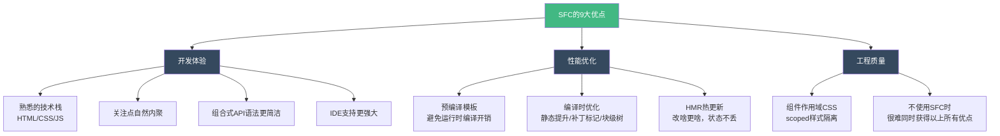

扫描[二维码](https://api2.cmdragon.cn/upload/cmder/20250304_012821924.jpg)关注或者微信搜一搜：`编程智域 前端至全栈交流与成长`

[发现1000+提升效率与开发的AI工具和实用程序](https://tools.cmdragon.cn/zh/apps?category=ai_chat)：https://tools.cmdragon.cn/zh/apps?category=ai_chat

## 一、SFC是啥？一个文件装三样东西

你刚接触Vue的时候，可能写过这样的代码——在HTML文件里直接用`Vue.createApp()`挂载一个应用，模板写在`template`选项里，逻辑写在`script`标签里，样式写在`style`标签里，三个东西散落在不同的地方，维护起来那叫一个头疼。

Vue的单文件组件（Single-File Component，简称SFC）就是来解决这个问题的。它的文件后缀是`.vue`，一个文件里同时装了三样东西：

- **`<template>`** —— 模板，负责页面结构，就是HTML那部分
- **`<script>`** —— 逻辑，负责数据和交互，就是JavaScript那部分
- **`<style>`** —— 样式，负责外观美化，就是CSS那部分

打个比方，SFC就像一个"全家桶"——模板是骨架，逻辑是大脑，样式是外衣，全打包在一起。你去肯德基点全家桶，炸鸡、薯条、可乐都在一个桶里，不用分开点单，多方便嘛。SFC也是这个道理，一个组件的模板、逻辑、样式本来就该在一起，硬拆开反而麻烦。

这其实是网页开发中HTML、CSS、JavaScript三种语言经典组合的自然延伸。传统开发里，一个页面的结构、行为、样式本来就是强相关的，SFC只是让它们在组件维度上自然内聚了。

来看一个最基础的SFC长啥样：

```vue
<!-- MyComponent.vue -->
<!-- 这是模板块，定义组件的HTML结构 -->
<template>
  <!-- 只能有一个根元素 -->
  <div class="greeting">
    <h1>{{ message }}</h1>
    <button @click="changeMessage">换一句话</button>
  </div>
</template>

<!-- 这是逻辑块，选项式API写法 -->
<script>
export default {
  // data函数返回组件的响应式数据
  data() {
    return {
      message: "你好，SFC！",
    };
  },
  // methods里定义方法
  methods: {
    changeMessage() {
      this.message = "我换了一句话！";
    },
  },
};
</script>

<!-- 这是样式块，scoped表示样式只作用于当前组件 -->
<style scoped>
.greeting {
  text-align: center;
  padding: 20px;
}

.greeting h1 {
  color: #42b883;
}

.greeting button {
  margin-top: 10px;
  padding: 8px 16px;
  background-color: #42b883;
  color: white;
  border: none;
  border-radius: 4px;
  cursor: pointer;
}
</style>
```

上面这个就是选项式API的写法，也是Vue 2时代的主流写法。`data()`返回数据，`methods`里放方法，`computed`里放计算属性……每个选项一个格子，填表一样。

再来看组合式API的写法，这也是Vue 3官方推荐的方式：

```vue
<!-- MyComponent.vue -->
<!-- 模板块，和选项式写法完全一样 -->
<template>
  <div class="greeting">
    <h1>{{ message }}</h1>
    <button @click="changeMessage">换一句话</button>
  </div>
</template>

<!-- 逻辑块，组合式API写法，使用 <script setup> 语法糖 -->
<script setup>
// 从vue中引入ref函数，用来创建响应式数据
import { ref } from "vue";

// ref()创建一个响应式变量，初始值是'你好，SFC！'
// 在模板中直接用 message 访问，不需要 .value
const message = ref("你好，SFC！");

// 直接定义函数，不需要放在methods对象里
// 在模板中直接用 changeMessage 调用
function changeMessage() {
  // 修改ref的值需要通过.value
  message.value = "我换了一句话！";
}
</script>

<!-- 样式块，和选项式写法完全一样 -->
<style scoped>
.greeting {
  text-align: center;
  padding: 20px;
}

.greeting h1 {
  color: #42b883;
}

.greeting button {
  margin-top: 10px;
  padding: 8px 16px;
  background-color: #42b883;
  color: white;
  border: none;
  border-radius: 4px;
  cursor: pointer;
}
</style>
```

你看，`<script setup>`的写法是不是清爽多了？不用写`export default`，不用写`data()`函数，不用把方法塞进`methods`对象，变量和函数直接写在顶层就行，模板里自动就能用。

有一点要注意：`<template>`和`<style>`是可选的。如果一个组件纯逻辑不需要渲染任何东西，可以不写`<template>`；如果不需要样式，也可以不写`<style>`。但实际开发中，大多数组件三个块都有。

还有个小细节，`<template>`、`<script>`、`<style>`的顺序在Vue官方风格指南里推荐的就是template在上、script在中、style在下，因为这样从上到下阅读时，先看到结构，再看到逻辑，最后看到样式，最符合人的阅读习惯。

## 二、选项式API vs 组合式API——两种写法有啥区别

上一节已经简单看过了两种写法的代码，这节咱来好好掰扯掰扯它们的区别。

### 选项式API：填表格式开发

选项式API（Options API）是Vue 2时代的老朋友了。它的核心思路是：一个组件就是一个大对象，你往里面填不同的选项——`data`填数据、`methods`填方法、`computed`填计算属性、`watch`填侦听器、`mounted`填生命周期钩子……

```vue
<!-- 选项式API示例：一个简单的计数器 -->
<template>
  <div class="counter">
    <p>当前计数：{{ count }}</p>
    <p>双倍计数：{{ doubleCount }}</p>
    <button @click="increment">+1</button>
    <button @click="decrement">-1</button>
  </div>
</template>

<script>
export default {
  // data选项：返回响应式数据
  data() {
    return {
      count: 0,
    };
  },
  // computed选项：定义计算属性
  computed: {
    doubleCount() {
      return this.count * 2;
    },
  },
  // methods选项：定义方法
  methods: {
    increment() {
      this.count++;
    },
    decrement() {
      this.count--;
    },
  },
  // 生命周期钩子
  mounted() {
    console.log("计数器组件挂载完成，初始值：", this.count);
  },
};
</script>

<style scoped>
.counter {
  text-align: center;
  padding: 20px;
}
</style>
```

选项式API的好处是结构清晰、上手简单，每个选项各司其职。但问题也很明显——当一个组件变复杂时，同一个功能的代码被拆散到`data`、`methods`、`computed`、`watch`等多个选项里，你得上下翻来翻去才能看懂一个功能的完整逻辑。就像你把一个人的衣服、裤子、鞋子分别放在三个衣柜里，穿个衣服得跑三个地方。

### 组合式API：自由写作式开发

组合式API（Composition API）是Vue 3的重头戏。在SFC里，它通常配合`<script setup>`语法糖使用，写起来更简洁：

```vue
<!-- 组合式API示例：同样的计数器 -->
<template>
  <div class="counter">
    <p>当前计数：{{ count }}</p>
    <p>双倍计数：{{ doubleCount }}</p>
    <button @click="increment">+1</button>
    <button @click="decrement">-1</button>
  </div>
</template>

<script setup>
// 引入需要的API
import { ref, computed, onMounted } from "vue";

// 直接定义响应式数据，不用包在data()里
const count = ref(0);

// 直接定义计算属性，不用放在computed选项里
const doubleCount = computed(() => count.value * 2);

// 直接定义方法，不用放在methods选项里
function increment() {
  count.value++;
}

function decrement() {
  count.value--;
}

// 直接调用生命周期钩子，不用放在生命周期选项里
onMounted(() => {
  console.log("计数器组件挂载完成，初始值：", count.value);
});
</script>

<style scoped>
.counter {
  text-align: center;
  padding: 20px;
}
</style>
```

看到没？数据、计算属性、方法、生命周期钩子全都在同一个作用域里，想怎么组织就怎么组织。你可以把相关逻辑放在一起，也可以抽成composable函数复用。

### 为啥官方推荐组合式API

Vue官方推荐组合式API，原因主要有两个：

**第一，语法更简单。** `<script setup>`里声明的顶层变量和函数自动暴露给模板，不需要`this`，不需要`return`，代码量直接少一截。选项式API里你得写`this.count`，组合式API里直接写`count.value`，没有`this`的指向问题，对新手更友好。

**第二，TypeScript支持更好。** 选项式API里`this`的类型推断一直是个老大难问题，而组合式API里变量就是普通变量，TypeScript能完美推断类型，写类型标注也方便得多。

打个比方：选项式API像填表格，每个格子都有固定位置，你只能往对应格子里填东西；组合式API像自由写作，一张白纸想咋写咋写，逻辑相关的代码放在一起，不相关的分开，灵活得多。

当然，两种写法在功能上是等价的，选项式API并没有被废弃，你完全可以在SFC里继续使用它。只是对于新项目，官方更推荐组合式API。

下面用一个表格快速对比一下两种写法的核心差异：

| 对比维度   | 选项式API                   | 组合式API（`<script setup>`）       |
| ---------- | --------------------------- | ----------------------------------- |
| 数据定义   | `data()` 返回对象           | `ref()` / `reactive()` 直接定义     |
| 方法定义   | 放在 `methods` 对象里       | 直接定义函数                        |
| 计算属性   | 放在 `computed` 对象里      | `computed()` 函数调用               |
| 生命周期   | `mounted`、`created` 等选项 | `onMounted()`、`onCreated()` 等函数 |
| 模板访问   | `this.xxx`                  | 直接用变量名                        |
| TypeScript | `this` 类型推断困难         | 变量类型推断完美                    |
| 代码组织   | 按选项类型分组              | 按功能/逻辑分组                     |
| 学习曲线   | 低，结构固定                | 稍高，需要理解响应式API             |

## 三、SFC的9大优点——凭啥要用它

你可能会问：我就不能把模板、逻辑、样式分开放吗？非得塞一个文件里？当然可以，但Vue官方总结了SFC的9大优点，看完你就明白为啥SFC是Vue组件的推荐写法了。

### 1. 使用熟悉的HTML、CSS、JavaScript语法编写模块化组件

SFC里你写的还是HTML、CSS、JavaScript，不需要学什么新语法。`<template>`里写HTML，`<style>`里写CSS，`<script>`里写JS，这不就是你每天都在写的东西嘛。不像JSX那样把HTML塞进JavaScript里，SFC保持了三种语言各自独立的写法，前端开发者几乎零学习成本。

打个比方，SFC就像你家里的厨房——灶台炒菜（逻辑）、砧板切菜（模板）、调料架调味（样式），各干各的但都在一个厨房里，不用跑去三个房间。

### 2. 让本来就强相关的关注点自然内聚

一个组件的模板、逻辑、样式本来就是一体的——模板里绑定的变量来自逻辑，样式修饰的是模板里的元素。把它们放在一个文件里，是"关注点内聚"而不是"关注点混合"。

有人觉得把三种代码放一个文件是"混合关注点"，违反了关注点分离原则。但Vue官方的观点是：模板、逻辑、样式本来就是强相关的，硬拆成三个文件反而增加了维护成本。就像你穿衣服，上衣、裤子、鞋子是一套搭配，放一个衣柜里比分三个衣柜方便多了。

### 3. 预编译模板，避免运行时的编译开销

Vue的模板在SFC里会被构建工具（Vite或Webpack）预编译成JavaScript渲染函数。这意味着浏览器拿到的是已经编译好的代码，不需要在运行时再编译模板，性能更好。

如果不用SFC，直接在HTML里写模板字符串或者用`template`选项，Vue就得在运行时把模板编译成渲染函数，这个编译过程是有性能开销的。虽然Vue 3可以引入带编译器的完整版本来支持运行时编译，但这会增加约14kB的包体积。

### 4. 组件作用域的CSS

SFC的`<style>`标签加上`scoped`属性后，样式只作用于当前组件，不会污染其他组件。原理很简单——Vue编译器会给组件的每个DOM元素加一个唯一属性（如`data-v-f3f3eg9`），然后CSS选择器也自动加上这个属性，这样样式就只能匹配到当前组件的元素了。

```vue
<template>
  <!-- 编译后会变成 <button data-v-f3f3eg9>点击我</button> -->
  <button class="btn">点击我</button>
</template>

<!-- scoped样式，只作用于当前组件 -->
<style scoped>
/* 编译后会变成 .btn[data-v-f3f3eg9] { ... } */
.btn {
  background-color: #42b883;
  color: white;
}
</style>
```

不用SFC的话，你得手动用CSS Modules、BEM命名或者CSS-in-JS等方案来实现样式隔离，麻烦得多。

### 5. 在使用组合式API时语法更简单

这个在第二节已经详细对比过了。`<script setup>`语法糖让组合式API的写法更简洁——不用`export default`，不用`return`，顶层声明自动暴露给模板。这个语法糖只有在SFC里才能用，不用SFC的话就得手动写`setup()`函数再`return`变量，啰嗦不少。

### 6. 通过交叉分析模板和逻辑代码能进行更多编译时优化

因为模板和逻辑在同一个文件里，Vue的编译器可以同时分析两者，做更多优化。比如：

- **静态提升**：模板里不会变化的部分（纯静态HTML）会被提取出来，只创建一次，后续渲染直接复用
- **补丁标记**：编译器分析模板中哪些绑定是动态的，给它们打上标记，更新时只对比动态部分，跳过静态部分
- **块级树**：对于`v-if`/`v-for`等结构指令，编译器会创建独立的"块"，更新时只遍历动态节点

这些优化都需要编译器能同时看到模板和逻辑代码，只有SFC才能做到。

### 7. 更好的IDE支持

SFC的`<script setup>`语法让IDE（如VS Code + Volar插件）能提供更强大的支持：

- 模板里自动补全组件的props、事件
- 模板表达式的类型检查——如果变量类型不对，IDE直接标红
- 点击模板里的变量跳转到`<script>`里的定义
- CSS里的类名也能在模板里自动补全

不用SFC的话，模板和逻辑分开，IDE很难做这种跨文件的智能分析。

### 8. 开箱即用的模块热更新（HMR）支持

开发时修改了代码，页面自动更新但保留当前状态，不用手动刷新，这就是HMR。SFC开箱就支持HMR——改模板只更新模板，改样式只更新样式，改逻辑只更新逻辑，互不干扰。Vite和Webpack的Vue插件都内置了对SFC的HMR支持。

### 9. 以上这些在不用SFC时很难同时获得

这是最关键的一点——上面8个优点，单独拿出来可能都有替代方案，但要同时获得所有这些好处，不用SFC几乎做不到。比如你可以用CSS Modules做样式隔离，但就没有scoped那么方便；你可以用JSX写模板，但就没有模板编译优化；你可以用Babel做运行时编译，但就没有预编译的性能优势。

SFC把这些优点打包在一起，形成了1+1>2的效果。

下面用一张流程图来梳理SFC的优点体系：



## 四、啥时候用SFC？啥时候不用？

SFC虽好，但也不是万能的。有些场景用SFC是杀鸡用牛刀，有些场景不用SFC又确实不够用。

### 推荐用SFC的场景

- **单页面应用（SPA）**：整个应用都是Vue驱动的，组件化开发是刚需，SFC是标配
- **静态站点生成（SSG）**：用VitePress、Nuxt等框架生成静态网站，底层就是SFC
- **任何值得引入构建步骤的项目**：只要你的项目用了Vite、Webpack等构建工具，SFC就是最佳选择

说白了，只要你打算正经八百地用Vue做一个完整项目，SFC就是默认选择。Vite创建Vue项目时，生成的就是`.vue`文件，开箱即用。

### 不推荐用SFC的场景

- **轻量级场景**：只是给一个静态HTML页面加一点小交互，比如一个简单的表单验证、一个轮播图
- **渐进式增强**：已有项目想局部引入Vue，不想搞构建工具那套

这些场景下，引入Vite + SFC的开发流程反而增加了复杂度。就好比你只是去楼下买个酱油，非要开个车去，油费比酱油还贵，不划算嘛。

### 替代方案：petite-vue

对于轻量级场景，Vue官方提供了[petite-vue](https://github.com/vuejs/petite-vue)作为替代方案。它是Vue的一个预优化子集，体积只有6kB左右，可以直接在HTML里使用，不需要构建工具：

```html
<!-- petite-vue示例：不需要构建工具，直接在HTML里用 -->
<!DOCTYPE html>
<html lang="zh-CN">
  <head>
    <meta charset="UTF-8" />
    <title>petite-vue示例</title>
    <!-- 直接通过CDN引入，只有6kB左右 -->
    <script src="https://unpkg.com/petite-vue" defer init></script>
    <style>
      .counter {
        text-align: center;
        padding: 20px;
      }
      .counter button {
        margin: 5px;
        padding: 8px 16px;
      }
    </style>
  </head>
  <body>
    <!-- v-scope指令创建一个响应式作用域 -->
    <div class="counter" v-scope="{ count: 0 }">
      <p>当前计数：{{ count }}</p>
      <!-- @click绑定事件，直接操作作用域内的数据 -->
      <button @click="count++">+1</button>
      <button @click="count--">-1</button>
    </div>
  </body>
</html>
```

petite-vue适合给静态HTML添加简单交互，不需要Node.js、不需要Vite、不需要构建步骤，直接在浏览器里就能跑。

### 对比表格

| 维度       | SFC                    | 不用SFC（petite-vue等） |
| ---------- | ---------------------- | ----------------------- |
| 适用场景   | SPA、SSG、完整项目     | 轻量交互、渐进式增强    |
| 构建工具   | 需要（Vite/Webpack）   | 不需要                  |
| 组件化     | 完整支持               | 有限支持                |
| TypeScript | 完美支持               | 不支持                  |
| 样式隔离   | scoped CSS             | 需手动处理              |
| 开发体验   | IDE支持强大            | 一般                    |
| 学习成本   | 稍高（需了解构建工具） | 极低                    |
| 包体积     | 按需引入               | petite-vue约6kB         |

用个比喻来说：SFC就像开车上高速，快是快，但你得有驾照（构建工具），还得有车（项目配置）；不用SFC就像骑自行车，慢是慢点，但不需要驾照，随时能骑。选哪个取决于你要去多远的地方。

## 课后 Quiz

### 问题1：SFC的`<style scoped>`是怎么实现样式隔离的？

**答案解析：**

Vue编译器在处理`<style scoped>`时做了两件事：

1. 给组件模板中的每个DOM元素添加一个唯一的自定义属性，比如`data-v-f3f3eg9`，这个属性值是根据组件内容生成的哈希值，每个组件都不一样
2. 将CSS选择器改写，加上对应的属性选择器，比如`.btn`变成`.btn[data-v-f3f3eg9]`

这样，样式规则就只能匹配到带有对应属性的元素，也就是当前组件的元素，从而实现了样式隔离。子组件的根元素也会被加上父组件的scoped属性，所以父组件的scoped样式可以影响子组件的根元素，但无法影响子组件内部的元素。

### 问题2：`<script setup>`和普通的`<script>`有啥区别？能不能在同一个SFC里同时用？

**答案解析：**

`<script setup>`是`<script>`的语法糖，主要区别有：

- `<script setup>`里声明的顶层变量、函数、import语句自动暴露给模板，不需要`export default`和`return`
- `<script setup>`里的代码在组件每次实例化时都会执行，而普通`<script>`只在模块首次导入时执行一次
- `<script setup>`不支持`name`等组件选项，如果需要设置组件名称，得用`defineOptions()`或在普通`<script>`里设置

可以在同一个SFC里同时使用两种`<script>`标签。常见的场景是：在普通`<script>`里设置`name`选项或声明`inheritAttrs`等选项，在`<script setup>`里写组合式API逻辑：

```vue
<script>
// 普通script里设置组件选项
export default {
  name: "MyComponent",
  inheritAttrs: false,
};
</script>

<script setup>
// setup语法糖里写逻辑
import { ref } from "vue";
const count = ref(0);
</script>
```

### 问题3：SFC预编译模板为啥比运行时编译性能更好？

**答案解析：**

预编译模板和运行时编译的区别在于"编译"这个动作发生的时机不同：

- **预编译**：在构建阶段（Vite/Webpack打包时），Vue编译器就把模板编译成了JavaScript渲染函数。浏览器拿到的是已经编译好的JS代码，直接执行就行，没有编译开销
- **运行时编译**：浏览器拿到的是原始模板字符串，Vue需要在运行时调用模板编译器，把字符串编译成渲染函数再执行。这个编译过程在每次组件首次渲染时都会发生，有额外的时间开销

预编译的优势有两个方面：一是消除了运行时的编译时间，首屏渲染更快；二是可以不把模板编译器打包进生产代码，减少约14kB的包体积（Vue运行时+编译器约33kB，仅运行时约19kB）。

## 常见报错解决方案

### 报错1：`Failed to resolve component: xxx`

**产生原因：** 在SFC里使用了某个组件，但没有正确导入或注册。在`<script setup>`里，组件需要通过`import`语句导入后才能在模板中使用，不像选项式API那样可以用`components`选项注册。

**解决方案：**

```vue
<script setup>
// 正确：导入组件后，<script setup>会自动注册
import MyChild from "./MyChild.vue";
</script>

<template>
  <!-- 现在可以使用了 -->
  <MyChild />
</template>
```

**预防建议：** 在`<script setup>`里，所有在模板中使用的组件都必须通过`import`导入。组件名可以用PascalCase（`MyChild`）也可以用kebab-case（`my-child`），推荐用PascalCase，和导入名保持一致不容易出错。

### 报错2：`v-model cannot be used on a prop with the same name as the component's default prop name`

**产生原因：** 在SFC的`<script setup>`里用`defineProps`声明了一个名为`modelValue`的prop，同时又尝试在模板里对这个prop使用`v-model`绑定，造成了循环引用。

**解决方案：**

```vue
<script setup>
// 正确：用defineProps接收，用defineEmits触发更新
const props = defineProps({
  modelValue: String, // 接收父组件传来的值
});

const emit = defineEmits(["update:modelValue"]); // 声明更新事件

// 不要直接修改props.modelValue，而是触发事件让父组件更新
function updateValue(newValue) {
  emit("update:modelValue", newValue);
}
</script>

<template>
  <!-- 正确：通过事件更新，而不是直接v-model绑定props -->
  <input :value="modelValue" @input="updateValue($event.target.value)" />
</template>
```

**预防建议：** 记住Vue的单向数据流原则——props是只读的，子组件不能直接修改props。需要双向绑定时，用`defineProps`+`defineEmits`配合实现。

### 报错3：`[Vue warn]: Extraneous non-props attributes were passed to component but could not be automatically inherited because component renders fragment or text root nodes.`

**产生原因：** SFC的模板有多个根元素（Vue 3支持多根节点组件，也叫fragment），但父组件传了非prop属性（如`class`、`id`、`style`等），Vue不知道该把这些属性挂到哪个根元素上。

**解决方案：**

```vue
<!-- 方案1：只保留一个根元素（最简单） -->
<template>
  <div class="wrapper">
    <h1>标题</h1>
    <p>内容</p>
  </div>
</template>

<!-- 方案2：多根元素时，用v-bind="$attrs"手动指定挂载位置 -->
<template>
  <!-- 把透传属性挂到这个元素上 -->
  <section v-bind="$attrs">
    <h1>标题</h1>
  </section>
  <p>内容</p>
</template>

<script setup>
// 需要禁用自动继承，否则Vue会报警告
defineOptions({
  inheritAttrs: false,
});
</script>
```

**预防建议：** 如果组件需要接收透传属性（如`class`、`style`），尽量保持单根元素。如果确实需要多根元素，记得用`inheritAttrs: false`禁用自动继承，然后用`v-bind="$attrs"`手动指定属性挂载位置。

参考链接：https://vuejs.org/guide/scaling-up/sfc.html

余下文章内容请点击跳转至 个人博客页面 或者 扫描[二维码](https://api2.cmdragon.cn/upload/cmder/20250304_012821924.jpg)关注或者微信搜一搜：`编程智域 前端至全栈交流与成长`，阅读完整的文章：[Vue单文件组件到底是个啥？一个vue文件凭啥装下模板逻辑和样式](https://blog.cmdragon.cn/posts/n0o1p2q3r4s5t6u7v8w9x0y1z2a3b4c5/)

<details>
<summary>往期文章归档</summary>

- [Vue 3 静态与动态 Props 如何传递？TypeScript 类型约束有何必要？](https://blog.cmdragon.cn/posts/94ab48753b64780ca3ab7a7115ae8522/)
- [Vue 3中组件局部注册的优势与实现方式如何？](https://blog.cmdragon.cn/posts/dbf576e744870f6de26fd8a2e03e47da/)
- [如何在Vue3中优化生命周期钩子性能并规避常见陷阱？](https://blog.cmdragon.cn/posts/12d98b3b9ccd6c19a1b169d720ac5c80/)
- [Vue 3 Composition API生命周期钩子：如何实现从基础理解到高阶复用？](https://blog.cmdragon.cn/posts/8884e2b70287fcb263c57648eeb27419/)
- [Vue 3生命周期钩子实战指南：如何正确选择onMounted、onUpdated与onUnmounted的应用场景？](https://blog.cmdragon.cn/posts/883c6dbc50ae4183770a4462e0b8ae4d/)
- [Vue 3中生命周期钩子与响应式系统如何实现协同工作？](https://blog.cmdragon.cn/posts/70dad360ffa9dce14d0d69611b8cb019/)
- [Vue 3组件生命周期钩子的执行顺序与使用场景是什么？](https://blog.cmdragon.cn/posts/db44294a78dc9f666f67b053f6c83567/)
- [Vue组件全局注册与局部注册如何抉择？](https://blog.cmdragon.cn/posts/43ead630ea17da65d99ad2eb8188e472/)
- [Vue3组件化开发中，Props与Emits如何实现数据流转与事件协作？](https://blog.cmdragon.cn/posts/8cff7d2df113da66ea7be560c4d1d22a/)
- [Vue 3模板引用如何与其他特性协同实现复杂交互？](https://blog.cmdragon.cn/posts/331bf75d114ab09116eadfcdca602b58/)
- [Vue 3 v-for中模板引用如何实现高效管理与动态控制？](https://blog.cmdragon.cn/posts/cb380897ddc3578b180ecf8843c774c1/)
- [Vue 3的defineExpose：如何突破script setup组件默认封装，实现精准的父子通讯？](https://blog.cmdragon.cn/posts/202ae0f4acde7128e0e31baf63732fb5/)
- [Vue 3模板引用的生命周期时机如何把握？常见陷阱该如何避免？](https://blog.cmdragon.cn/posts/7d2a0f6555ecbe92afd7d2491c427463/)
- [Vue 3模板引用如何实现父组件与子组件的高效交互？](https://blog.cmdragon.cn/posts/3fb7bdd84128b7efaaa1c979e1f28dee/)
- [Vue中为何需要模板引用？又如何高效实现DOM与组件实例的直接访问？](https://blog.cmdragon.cn/posts/23f3464ba16c7054b4783cded50c04c6/)

</details>

<details>
<summary>免费好用的热门在线工具</summary>

- [多直播聚合器 - 应用商店 | By cmdragon](https://tools.cmdragon.cn/zh/apps/multi-live-aggregator)
- [Proto文件生成器 - 应用商店 | By cmdragon](https://tools.cmdragon.cn/zh/apps/proto-file-generator)
- [图片转粒子 - 应用商店 | By cmdragon](https://tools.cmdragon.cn/zh/apps/image-to-particles)
- [视频下载器 - 应用商店 | By cmdragon](https://tools.cmdragon.cn/zh/apps/video-downloader)
- [文件格式转换器 - 应用商店 | By cmdragon](https://tools.cmdragon.cn/zh/apps/file-converter)
- [M3U8在线播放器 - 应用商店 | By cmdragon](https://tools.cmdragon.cn/zh/apps/m3u8-player)
- [快图设计 - 应用商店 | By cmdragon](https://tools.cmdragon.cn/zh/apps/quick-image-design)
- [高级文字转图片转换器 - 应用商店 | By cmdragon](https://tools.cmdragon.cn/zh/apps/text-to-image-advanced)
- [RAID 计算器 - 应用商店 | By cmdragon](https://tools.cmdragon.cn/zh/apps/raid-calculator)
- [在线PS - 应用商店 | By cmdragon](https://tools.cmdragon.cn/zh/apps/photoshop-online)
- [Mermaid 在线编辑器 - 应用商店 | By cmdragon](https://tools.cmdragon.cn/zh/apps/mermaid-live-editor)
- [数学求解计算器 - 应用商店 | By cmdragon](https://tools.cmdragon.cn/zh/apps/math-solver-calculator)
- [智能提词器 - 应用商店 | By cmdragon](https://tools.cmdragon.cn/zh/apps/smart-teleprompter)
- [魔法简历 - 应用商店 | By cmdragon](https://tools.cmdragon.cn/zh/apps/magic-resume)
- [Image Puzzle Tool - 图片拼图工具 | By cmdragon](https://tools.cmdragon.cn/zh/apps/image-puzzle-tool)
- [字幕下载工具 - 应用商店 | By cmdragon](https://tools.cmdragon.cn/zh/apps/subtitle-downloader)
- [歌词生成工具 - 应用商店 | By cmdragon](https://tools.cmdragon.cn/zh/apps/lyrics-generator)
- [网盘资源聚合搜索 - 应用商店 | By cmdragon](https://tools.cmdragon.cn/zh/apps/cloud-drive-search)
- [ASCII字符画生成器 - 应用商店 | By cmdragon](https://tools.cmdragon.cn/zh/apps/ascii-art-generator)
- [JSON Web Tokens 工具 - 应用商店 | By cmdragon](https://tools.cmdragon.cn/zh/apps/jwt-tool)
- [Bcrypt 密码工具 - 应用商店 | By cmdragon](https://tools.cmdragon.cn/zh/apps/bcrypt-tool)
- [GIF 合成器 - 应用商店 | By cmdragon](https://tools.cmdragon.cn/zh/apps/gif-composer)
- [GIF 分解器 - 应用商店 | By cmdragon](https://tools.cmdragon.cn/zh/apps/gif-decomposer)
- [文本隐写术 - 应用商店 | By cmdragon](https://tools.cmdragon.cn/zh/apps/text-steganography)
- [CMDragon 在线工具 - 高级AI工具箱与开发者套件 | 免费好用的在线工具](https://tools.cmdragon.cn/zh)
- [应用商店 - 发现1000+提升效率与开发的AI工具和实用程序 | 免费好用的在线工具](https://tools.cmdragon.cn/zh/apps?category=trending)
- [CMDragon 更新日志 - 最新更新、功能与改进 | 免费好用的在线工具](https://tools.cmdragon.cn/zh/changelog)
- [支持我们 - 成为赞助者 | 免费好用的在线工具](https://tools.cmdragon.cn/zh/sponsor)
- [AI文本生成图像 - 应用商店 | 免费好用的在线工具](https://tools.cmdragon.cn/zh/apps/text-to-image-ai)
- [临时邮箱 - 应用商店 | 免费好用的在线工具](https://tools.cmdragon.cn/zh/apps/temp-email)
- [二维码解析器 - 应用商店 | 免费好用的在线工具](https://tools.cmdragon.cn/zh/apps/qrcode-parser)
- [文本转思维导图 - 应用商店 | 免费好用的在线工具](https://tools.cmdragon.cn/zh/apps/text-to-mindmap)
- [正则表达式可视化工具 - 应用商店 | 免费好用的在线工具](https://tools.cmdragon.cn/zh/apps/regex-visualizer)
- [文件隐写工具 - 应用商店 | 免费好用的在线工具](https://tools.cmdragon.cn/zh/apps/steganography-tool)
- [IPTV 频道探索器 - 应用商店 | 免费好用的在线工具](https://tools.cmdragon.cn/zh/apps/iptv-explorer)
- [快传 - 应用商店 | By cmdragon](https://tools.cmdragon.cn/zh/apps/snapdrop)
- [随机抽奖工具 - 应用商店 | 免费好用的在线工具](https://tools.cmdragon.cn/zh/apps/lucky-draw)
- [动漫场景查找器 - 应用商店 | 免费好用的在线工具](https://tools.cmdragon.cn/zh/apps/anime-scene-finder)
- [时间工具箱 - 应用商店 | 免费好用的在线工具](https://tools.cmdragon.cn/zh/apps/time-toolkit)
- [网速测试 - 应用商店 | 免费好用的在线工具](https://tools.cmdragon.cn/zh/apps/speed-test)
- [AI 智能抠图工具 - 应用商店 | 免费好用的在线工具](https://tools.cmdragon.cn/zh/apps/background-remover)
- [背景替换工具 - 应用商店 | 免费好用的在线工具](https://tools.cmdragon.cn/zh/apps/background-replacer)
- [艺术二维码生成器 - 应用商店 | 免费好用的在线工具](https://tools.cmdragon.cn/zh/apps/artistic-qrcode)
- [Open Graph 元标签生成器 - 应用商店 | 免费好用的在线工具](https://tools.cmdragon.cn/zh/apps/open-graph-generator)
- [图像对比工具 - 应用商店 | 免费好用的在线工具](https://tools.cmdragon.cn/zh/apps/image-comparison)
- [图片压缩专业版 - 应用商店 | 免费好用的在线工具](https://tools.cmdragon.cn/zh/apps/image-compressor)
- [密码生成器 - 应用商店 | 免费好用的在线工具](https://tools.cmdragon.cn/zh/apps/password-generator)
- [SVG优化器 - 应用商店 | 免费好用的在线工具](https://tools.cmdragon.cn/zh/apps/svg-optimizer)
- [调色板生成器 - 应用商店 | 免费好用的在线工具](https://tools.cmdragon.cn/zh/apps/color-palette)
- [在线节拍器 - 应用商店 | 免费好用的在线工具](https://tools.cmdragon.cn/zh/apps/online-metronome)
- [IP归属地查询 - 应用商店 | By cmdragon](https://tools.cmdragon.cn/zh/apps/ip-geolocation)
- [CSS网格布局生成器 - 应用商店 | 免费好用的在线工具](https://tools.cmdragon.cn/zh/apps/css-grid-layout)
- [邮箱验证工具 - 应用商店 | 免费好用的在线工具](https://tools.cmdragon.cn/zh/apps/email-validator)
- [书法练习字帖 - 应用商店 | 免费好用的在线工具](https://tools.cmdragon.cn/zh/apps/calligraphy-practice)
- [金融计算器套件 - 应用商店 | 免费好用的在线工具](https://tools.cmdragon.cn/zh/apps/finance-calculator-suite)
- [中国亲戚关系计算器 - 应用商店 | 免费好用的在线工具](https://tools.cmdragon.cn/zh/apps/chinese-kinship-calculator)
- [Protocol Buffer 工具箱 - 应用商店 | 免费好用的在线工具](https://tools.cmdragon.cn/zh/apps/protobuf-toolkit)
- [IP归属地查询 - 应用商店 | 免费好用的在线工具](https://tools.cmdragon.cn/zh/apps/ip-geolocation)
- [图片无损放大 - 应用商店 | 免费好用的在线工具](https://tools.cmdragon.cn/zh/apps/image-upscaler)
- [文本比较工具 - 应用商店 | 免费好用的在线工具](https://tools.cmdragon.cn/zh/apps/text-compare)
- [IP批量查询工具 - 应用商店 | 免费好用的在线工具](https://tools.cmdragon.cn/zh/apps/ip-batch-lookup)
- [域名查询工具 - 应用商店 | 免费好用的在线工具](https://tools.cmdragon.cn/zh/apps/domain-finder)
- [DNS工具箱 - 应用商店 | 免费好用的在线工具](https://tools.cmdragon.cn/zh/apps/dns-toolkit)
- [网站图标生成器 - 应用商店 | 免费好用的在线工具](https://tools.cmdragon.cn/zh/apps/favicon-generator)
- [XML Sitemap](https://tools.cmdragon.cn/sitemap_index.xml)

</details>
