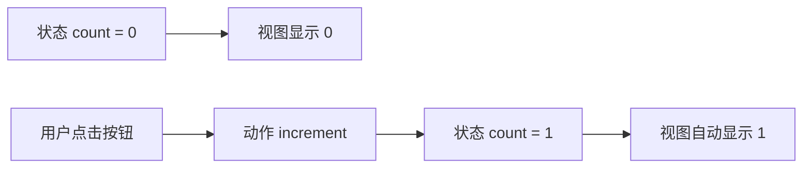
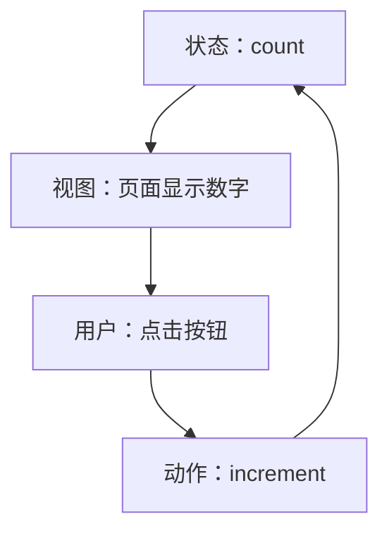
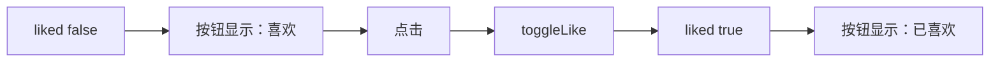

## 一、先别急着背概念，状态就是“页面记住的东西”

你点按钮，数字从 0 变成 1；你在输入框里打字，页面记住了你输入的内容；你勾选一个待办事项，列表里那一项变成完成状态。

这些会影响页面展示、并且会随着用户操作变化的数据，就是状态。

在 Vue 里，一个最小的状态例子长这样：

```vue
<script setup>
import { ref } from "vue";

const count = ref(0);

function increment() {
  count.value++;
}
</script>

<template>
  <button @click="increment">
    当前数字：{{ count }}
  </button>
</template>
```

这里先记住三句话：

- `count` 是状态。
- `{{ count }}` 和按钮是视图。
- `increment()` 是交互逻辑，也可以叫动作。

## 二、Vue 页面不是“手动改 DOM”，而是“状态驱动视图”

很多新手刚从原生 JavaScript 转到 Vue 时，会习惯这样想：

```js
document.querySelector("#count").innerText = newCount;
```

但 Vue 的思路不是“我去找 DOM，然后改它”，而是：

```text
我只改状态，Vue 自动把视图更新好。
```

图解一下：



这个循环就是学习状态管理的入口。

## 三、状态、视图、交互三个角色怎么分工

### 1. 状态：驱动页面的数据源

状态回答的是：页面现在是什么样？

比如：

```js
const count = ref(0);
const username = ref("");
const todos = ref([]);
const isLoading = ref(false);
```

这些数据一变，页面就可能跟着变。

### 2. 视图：状态的一种展示方式

视图回答的是：这些状态怎么被用户看到？

```vue
<template>
  <p>你好，{{ username }}</p>
  <p v-if="isLoading">加载中...</p>
  <ul>
    <li v-for="todo in todos" :key="todo.id">
      {{ todo.text }}
    </li>
  </ul>
</template>
```

视图本身尽量少写复杂逻辑，它应该像一张“状态投影图”。

### 3. 交互：改变状态的入口

交互回答的是：用户做了什么，状态要怎么变？

```js
function addTodo(text) {
  todos.value.push({
    id: crypto.randomUUID(),
    text,
    done: false
  });
}

function toggleTodo(id) {
  const todo = todos.value.find((item) => item.id === id);
  if (todo) {
    todo.done = !todo.done;
  }
}
```

你会发现：真正被改变的是状态，不是 DOM。

## 四、为什么说这是“单向数据流”

单向数据流不是高深架构词，它的意思很朴素：

```text
状态 -> 视图 -> 用户操作 -> 动作 -> 状态
```

不要反过来让视图到处偷偷改数据，也不要让多个地方各自维护一份重复状态。



这条链路清晰，代码就容易排查。

## 五、用一个小例子完整跑一遍

我们做一个简单的“喜欢按钮”：

```vue
<script setup>
import { ref } from "vue";

const liked = ref(false);
const likeCount = ref(0);

function toggleLike() {
  liked.value = !liked.value;
  likeCount.value += liked.value ? 1 : -1;
}
</script>

<template>
  <button @click="toggleLike">
    {{ liked ? "已喜欢" : "喜欢" }} · {{ likeCount }}
  </button>
</template>
```

你可以按下面这张图检查自己是否真的理解：



## 六、新手最容易踩的两个坑

### 坑 1：把展示文本当成状态

不推荐：

```js
const buttonText = ref("喜欢");
```

更推荐：

```js
const liked = ref(false);
```

按钮文字应该由状态推导出来：

```vue
{{ liked ? "已喜欢" : "喜欢" }}
```

因为 `liked` 才是真正的业务事实。

### 坑 2：状态和动作混在模板里

可以写：

```vue
<button @click="count++">{{ count }}</button>
```

但随着逻辑变多，更建议写成：

```vue
<button @click="increment">{{ count }}</button>
```

再把变化逻辑放进函数：

```js
function increment() {
  count.value++;
}
```

这样以后加判断、埋点、校验、请求接口，都有一个明确入口。

## 七、这一章你要掌握什么

学完这一章，你不用急着谈 Pinia，也不用急着背 Vuex。先把下面四句话吃透：

- 状态是页面当前记住的数据。
- 视图是状态的展示结果。
- 交互通过动作改变状态。
- Vue 会根据状态变化自动更新视图。

下一章我们会进入真正的问题：当两个、三个、十个组件都要用同一份状态时，事情为什么会开始变乱。

## 练习

把上面的“喜欢按钮”改成“购物车数量按钮”：

- 初始数量是 `0`。
- 点击“加一件”数量加 1。
- 点击“清空”数量回到 0。
- 当数量为 0 时，页面显示“购物车是空的”。

如果你能不手动操作 DOM，只通过状态驱动视图完成它，就已经真正迈进状态管理的大门了。
