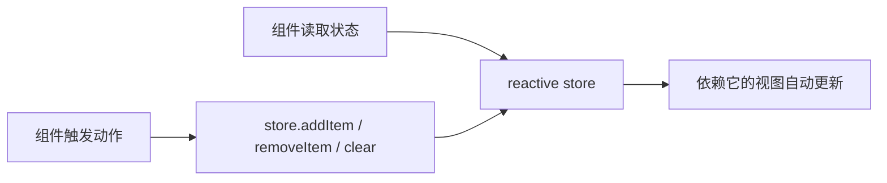

## 一、store 是什么

先别把 store 想复杂。

在入门阶段，你可以把 store 理解成：

```text
放在组件外面、能被多个组件共同导入的一份响应式状态。
```

也就是说，原来状态写在某个组件里：

```vue
<script setup>
import { ref } from "vue";

const count = ref(0);
</script>
```

现在我们把它抽到单独文件里：

```js
// store.js
import { reactive } from "vue";

export const store = reactive({
  count: 0
});
```

然后任何组件都可以导入：

```vue
<script setup>
import { store } from "./store.js";
</script>

<template>
  <p>{{ store.count }}</p>
</template>
```

这就有了最小版状态管理。

## 二、为什么导入同一个 store 就能共享状态

JavaScript 模块有一个特性：同一个模块被多处导入时，大家拿到的是同一份模块实例。

所以：

```js
export const store = reactive({
  count: 0
});
```

不是每个组件各创建一份，而是多个组件引用同一个对象。

图解一下：

```mermaid
flowchart TB
  Store[store.js<br/>reactive({ count: 0 })]
  Store --> A[ComponentA.vue<br/>读取 store.count]
  Store --> B[ComponentB.vue<br/>读取 store.count]
  Store --> C[ComponentC.vue<br/>读取 store.count]
  B --> D[修改 store.count]
  D --> Store
  Store --> A
  Store --> C
```

当 `store.count` 改变，所有使用它的组件都会更新。

## 三、先做一个最小案例

创建 `src/store/counter.js`：

```js
import { reactive } from "vue";

export const counterStore = reactive({
  count: 0
});
```

组件 A 负责显示：

```vue
<!-- CounterDisplay.vue -->
<script setup>
import { counterStore } from "../store/counter.js";
</script>

<template>
  <p>当前数量：{{ counterStore.count }}</p>
</template>
```

组件 B 负责修改：

```vue
<!-- CounterButton.vue -->
<script setup>
import { counterStore } from "../store/counter.js";
</script>

<template>
  <button @click="counterStore.count++">
    加一
  </button>
</template>
```

页面里同时使用：

```vue
<template>
  <CounterDisplay />
  <CounterButton />
</template>
```

你点击按钮时，显示组件会自动变。

## 四、但别让任何组件随手改 store

上面的写法虽然能跑，但有一个隐患：

```vue
<button @click="counterStore.count++">
```

这意味着任何导入 store 的组件都能随便改状态。

小项目里看着还行，项目一大就会变成：

```text
count 为什么变成 -1 了？
谁清空了购物车？
用户信息什么时候被覆盖了？
```

所以更推荐把“怎么改状态”的逻辑也放进 store。

改造 `counter.js`：

```js
import { reactive } from "vue";

export const counterStore = reactive({
  count: 0,
  increment() {
    this.count++;
  },
  reset() {
    this.count = 0;
  }
});
```

组件里只表达意图：

```vue
<template>
  <button @click="counterStore.increment()">加一</button>
  <button @click="counterStore.reset()">清空</button>
</template>
```

注意这里写的是 `counterStore.increment()`，带圆括号。因为它不是当前组件自己的方法，而是 store 对象上的方法，要让它以正确的上下文执行。

## 五、把“动作”放进 store 有什么好处

### 1. 修改入口更集中

你以后想知道 `count` 怎么变，只要看 store：

```js
increment() {
  this.count++;
}

reset() {
  this.count = 0;
}
```

不用全项目搜索 `count++`。

### 2. 动作名称能表达业务意图

不推荐组件里到处写：

```js
store.cartItems.push(product);
```

更推荐：

```js
cartStore.addItem(product);
```

`addItem` 是业务动作，看代码的人更容易理解。

### 3. 后续加逻辑更自然

今天只是加一：

```js
increment() {
  this.count++;
}
```

明天可能要限制最大值：

```js
increment() {
  if (this.count >= 10) return;
  this.count++;
}
```

如果组件只调用 `increment()`，组件代码就不用跟着到处改。

## 六、做一个购物车 store

现在写一个更真实的版本：

```js
// src/store/cart.js
import { reactive } from "vue";

export const cartStore = reactive({
  items: [],

  addItem(product) {
    const matched = this.items.find((item) => item.id === product.id);

    if (matched) {
      matched.quantity++;
      return;
    }

    this.items.push({
      ...product,
      quantity: 1
    });
  },

  removeItem(id) {
    this.items = this.items.filter((item) => item.id !== id);
  },

  clear() {
    this.items = [];
  }
});
```

商品卡片：

```vue
<script setup>
import { cartStore } from "../store/cart.js";

defineProps({
  product: {
    type: Object,
    required: true
  }
});
</script>

<template>
  <button @click="cartStore.addItem(product)">
    加入购物车
  </button>
</template>
```

购物车角标：

```vue
<script setup>
import { computed } from "vue";
import { cartStore } from "../store/cart.js";

const totalCount = computed(() =>
  cartStore.items.reduce((sum, item) => sum + item.quantity, 0)
);
</script>

<template>
  <span>购物车：{{ totalCount }}</span>
</template>
```

购物车面板：

```vue
<script setup>
import { cartStore } from "../store/cart.js";
</script>

<template>
  <ul>
    <li v-for="item in cartStore.items" :key="item.id">
      {{ item.name }} x {{ item.quantity }}
      <button @click="cartStore.removeItem(item.id)">删除</button>
    </li>
  </ul>

  <button @click="cartStore.clear()">清空购物车</button>
</template>
```

这就是“多个组件共享同一份状态”的完整雏形。

## 七、这一章的核心图



## 八、什么时候这个方案够用

手写 reactive store 适合：

- demo 项目。
- 小型后台页面。
- 状态很少、动作也不复杂的页面。
- 想先理解状态管理原理。

但如果你的项目需要模块拆分、调试工具、时间旅行、热更新、SSR 支持、团队约定，那就该考虑 Pinia。

不过在上 Pinia 之前，我们还要补一章：用组合式函数组织 store，以及为什么 SSR 场景下全局单例要格外小心。

## 练习

把本文的购物车 store 改成待办事项 store：

- `todos` 保存待办列表。
- `addTodo(text)` 添加一条。
- `toggleTodo(id)` 切换完成状态。
- `removeTodo(id)` 删除一条。
- 用一个 `computed` 统计未完成数量。

你会发现，状态管理的套路开始变清楚了。
