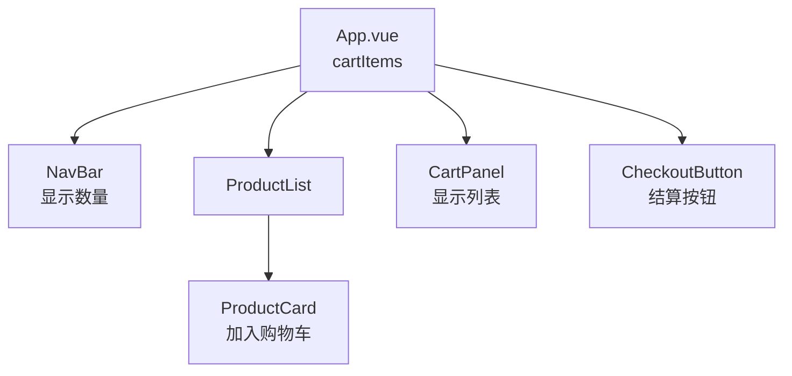
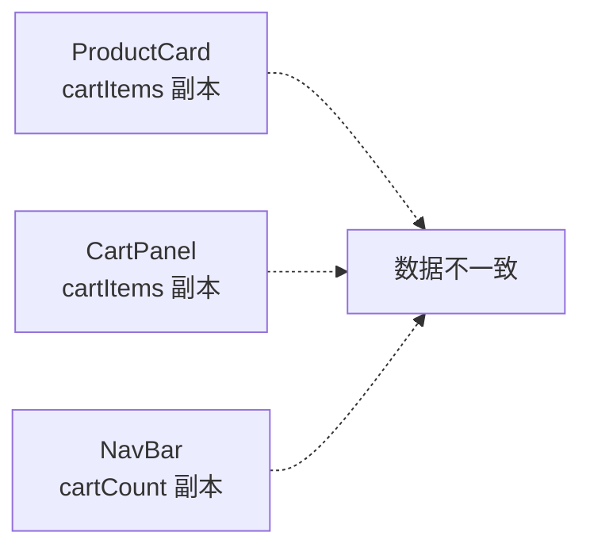
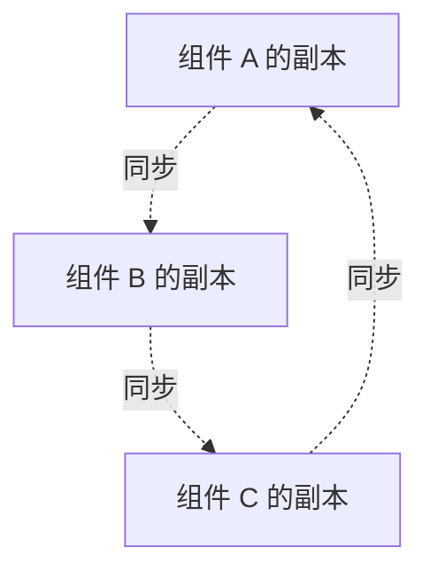
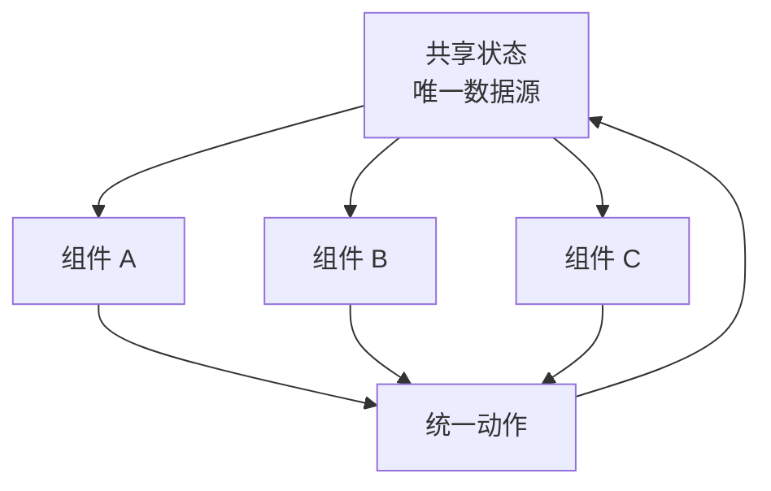

## 一、单组件很简单，多组件才是真问题

上一章我们说过，一个组件内部其实已经在管理自己的状态。

比如一个计数器：

```text
状态 count -> 视图显示 count -> 点击按钮 -> count 改变
```

这没什么难的。

真正让人头疼的是：多个组件都要读同一份状态，甚至都想改同一份状态。

比如一个购物车页面：

- 顶部导航栏要显示购物车数量。
- 商品卡片要能加入购物车。
- 侧边栏要展示购物车列表。
- 结算按钮要根据购物车是否为空决定能不能点击。

这些组件长得不同、位置不同，但它们关心的是同一份购物车状态。

## 二、问题 1：多个视图依赖同一份状态

先看一个简化结构：



如果状态放在 `App.vue`，那么 `NavBar`、`CartPanel`、`CheckoutButton` 都可以通过 props 拿到它。

代码可能长这样：

```vue
<!-- App.vue -->
<script setup>
import { ref } from "vue";
import NavBar from "./NavBar.vue";
import CartPanel from "./CartPanel.vue";

const cartItems = ref([]);
</script>

<template>
  <NavBar :cart-count="cartItems.length" />
  <CartPanel :items="cartItems" />
</template>
```

这在组件层级浅的时候没问题。

但如果组件藏得很深，你就会开始疯狂传 props：

```text
App -> Layout -> Header -> NavBar -> CartBadge
```

中间的 `Layout`、`Header` 可能根本不用购物车数量，却也被迫接收和转发。

这就是常说的 prop 逐级透传问题。

## 三、问题 2：多个组件都想修改同一份状态

读状态还只是麻烦，改状态才容易乱。

比如：

- `ProductCard` 想添加商品。
- `CartPanel` 想删除商品。
- `CheckoutButton` 想清空购物车。

如果这些组件都各自维护一份数据，就会出现“你这里变了，我那里没变”的问题。



页面一旦出现多个副本，你就要开始同步它们：

```text
这里加一件 -> 通知那里更新数量 -> 再通知另一个组件刷新列表
```

这条链路一长，bug 就会像排队一样准时出现。

## 四、用事件一路往上抛，可以吗

Vue 的常规父子通信是：

- 父组件通过 props 传数据给子组件。
- 子组件通过 emit 通知父组件修改数据。

对于一层父子组件，这很优雅：

```vue
<!-- ProductCard.vue -->
<script setup>
defineProps({
  product: Object
});

const emit = defineEmits(["add"]);
</script>

<template>
  <button @click="emit('add', product)">
    加入购物车
  </button>
</template>
```

父组件处理：

```vue
<ProductCard
  v-for="product in products"
  :key="product.id"
  :product="product"
  @add="addToCart"
/>
```

但如果组件层级变深，事件也会开始逐级转发：

```text
ProductCard -> ProductGrid -> ProductSection -> Page -> App
```

中间组件又一次变成了“传话筒”。

## 五、为什么模板引用不适合拿来同步状态

有些同学会想：那我直接拿组件实例改，不就好了？

比如用模板引用调用子组件方法：

```vue
<CartPanel ref="cartPanelRef" />
```

然后：

```js
cartPanelRef.value.refresh();
```

这种方式不是绝对不能用，但它更适合做“命令式的小动作”，比如聚焦输入框、打开弹窗、触发动画。

拿它来同步共享状态，会让数据流变得很隐蔽：

```text
谁改了状态？
什么时候改的？
改完以后还有哪些组件被影响？
```

一旦这些问题回答不上来，维护成本就上来了。

## 六、共享状态真正需要的是什么

当多个组件共享同一份状态时，我们希望做到：

- 状态只有一份，不要到处复制。
- 每个组件都能读取这份状态。
- 修改状态的逻辑集中，不要散落在模板里。
- 数据变化后，依赖它的视图自动更新。

也就是从这种结构：



变成这种结构：



这就是状态管理要解决的核心问题。

## 七、先别急着上 Pinia

Pinia 很好，但小白一上来就学 Pinia，容易变成只会背 API：

```js
defineStore()
state
actions
getters
```

但你可能还没真正明白它为什么存在。

所以官方文档先教了一个很重要的思路：用 Vue 自己的响应式 API，也能做一个简单的共享状态。

这就是下一章要讲的 `reactive()` store。

## 练习

试着画出你当前项目里一个“多个组件都要用”的状态。

可以是：

- 登录用户信息。
- 主题模式。
- 购物车。
- 当前语言。
- 消息通知数量。

然后问自己三个问题：

- 哪些组件要读它？
- 哪些组件要改它？
- 现在这份状态是不是有多个副本？

只要你开始这样分析，就已经具备状态管理意识了。
