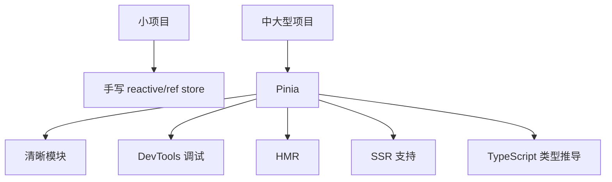
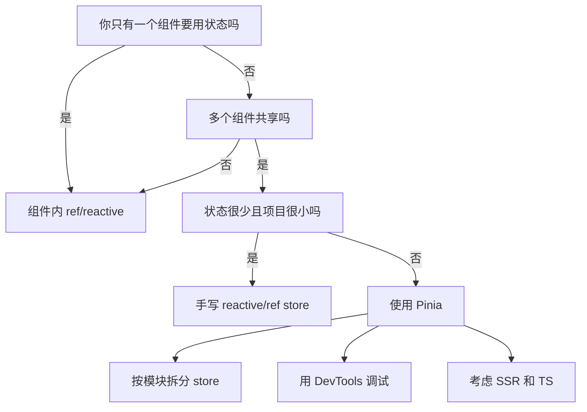

## 一、手写 store 不是错，只是它有天花板

前几章我们已经用 `reactive()`、`ref()`、`computed()` 做出了简单 store。

这说明一件事：状态管理的本质不是某个库，而是：

```text
把共享状态抽出来，让多个组件读同一份数据，并通过清晰动作修改它。
```

但项目变大后，手写 store 会遇到一些现实问题：

- store 多了以后，文件组织靠自觉。
- 谁能改状态、怎么改，缺少统一约定。
- 调试时很难追踪状态变化过程。
- 热更新时状态保留不够顺滑。
- SSR 支持要自己小心处理。
- TypeScript 类型体验要自己补很多细节。

这时候 Pinia 就该上场了。

## 二、Pinia 解决的不是“能不能共享状态”，而是“大项目怎么稳”

手写 store 解决的是：

```text
多个组件共享状态
```

Pinia 进一步解决的是：

```text
多个开发者、多个模块、多个运行场景下，如何稳定管理状态
```

图解一下：



所以不要把 Pinia 当成“更复杂的写法”。它真正的价值是让复杂项目保持秩序。

## 三、Pinia 和 Vuex 是什么关系

很多老教程会讲 Vuex。

Vuex 曾经是 Vue 官方状态管理库，Vue 2 时代非常常见。现在 Vue 官方更推荐 Pinia。

你可以这样理解：

- 维护老项目，可能仍然会遇到 Vuex。
- 新项目，优先考虑 Pinia。
- Pinia 的 API 更简洁，也更贴近组合式 API。
- 使用 TypeScript 时，Pinia 的类型推导体验更好。

如果你是新手，不建议先绕远路学一大堆 Vuex 模式，再回头学 Pinia。先理解本系列前四章的状态管理原理，再学 Pinia，会顺很多。

## 四、什么时候继续用手写 store

下面这些情况，手写 store 就够：

- 只有一两个共享状态。
- 项目是 demo、练习、小工具。
- 不需要复杂调试。
- 不做 SSR。
- 团队只有你自己，约定很容易保持。

例如：

```js
// src/stores/theme.js
import { ref } from "vue";

const theme = ref("light");

function toggleTheme() {
  theme.value = theme.value === "light" ? "dark" : "light";
}

export function useThemeStore() {
  return {
    theme,
    toggleTheme
  };
}
```

这类状态很轻，没必要为了“显得专业”强行上库。

## 五、什么时候应该用 Pinia

下面任意一条命中，就可以认真考虑 Pinia：

- 有多个业务模块：用户、权限、购物车、订单、消息、设置。
- 多个页面都依赖同一批状态。
- 多人协作，需要统一写法。
- 需要 Vue DevTools 里清晰查看状态变化。
- 需要模块热更新。
- 做 SSR 或未来可能做 SSR。
- 项目使用 TypeScript，并希望类型推导更舒服。

尤其是后台系统、商城、内容管理平台、复杂移动端 H5，这些都很适合 Pinia。

## 六、从手写 store 迁移到 Pinia，心智并不变

你现在已经理解：

```text
状态 state
派生数据 computed
动作 actions
组件读取和触发
```

Pinia 只是把这些东西用更标准的方式组织起来。

一个组合式 Pinia store 大概长这样：

```js
import { computed, ref } from "vue";
import { defineStore } from "pinia";

export const useCartStore = defineStore("cart", () => {
  const items = ref([]);

  const totalCount = computed(() =>
    items.value.reduce((sum, item) => sum + item.quantity, 0)
  );

  function addItem(product) {
    const matched = items.value.find((item) => item.id === product.id);

    if (matched) {
      matched.quantity++;
      return;
    }

    items.value.push({
      ...product,
      quantity: 1
    });
  }

  return {
    items,
    totalCount,
    addItem
  };
});
```

组件里使用：

```vue
<script setup>
import { useCartStore } from "../stores/cart.js";

const cart = useCartStore();
</script>

<template>
  <button @click="cart.addItem(product)">
    加入购物车
  </button>
  <span>{{ cart.totalCount }}</span>
</template>
```

你会发现，它和上一章的组合式 store 非常像。

区别在于：Pinia 给这套写法补上了生产项目需要的生态能力。

## 七、状态管理选型路线图



## 八、小白学习顺序建议

如果你从 0 开始，推荐这样学：

1. 先会组件内 `ref()` 和 `reactive()`。
2. 理解状态、视图、动作的单向数据流。
3. 知道 props / emits 为什么在深层共享状态时会变麻烦。
4. 用 `reactive()` 手写一个共享 store。
5. 用组合式函数组织全局状态和局部状态。
6. 最后学习 Pinia。

这样你学到的不是 API 记忆，而是状态管理的底层理由。

## 九、本系列最终总结

状态管理从来不是一上来就装库。

它的成长路线其实很自然：

```text
组件内部状态
-> 多组件共享状态
-> 抽出唯一数据源
-> 集中修改动作
-> 复杂项目使用 Pinia
```

你能解释清楚这条路线，就已经从“会写 Vue 页面”进入到“能组织 Vue 应用”的阶段了。

## 练习

回到第三章的购物车 store，试着把它改造成 Pinia 的组合式 store：

- `items` 是状态。
- `totalCount` 是计算属性。
- `addItem()`、`removeItem()`、`clearCart()` 是动作。
- 在两个组件里同时使用它，确认状态共享。

做完这一步，你就完成了 Vue 状态管理从 0 到 1 的闭环。
