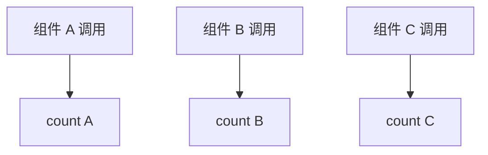
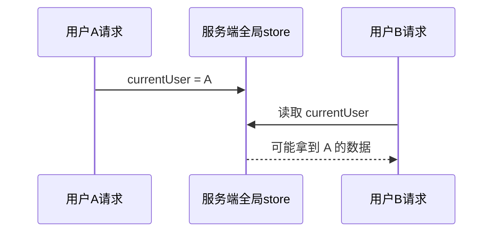
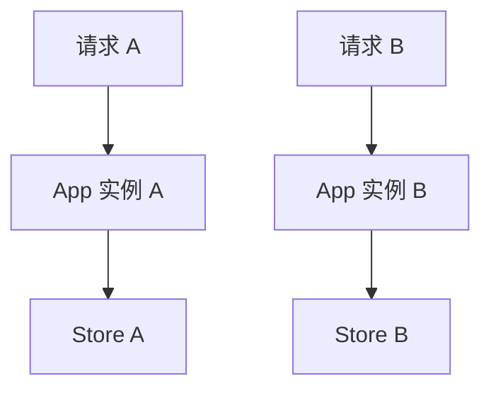

## 一、store 不一定非得是 reactive 对象

上一章我们用了：

```js
export const store = reactive({
  count: 0
});
```

这很好懂，但不是唯一写法。

Vue 的响应式系统和组件层是解耦的。也就是说，`ref()`、`reactive()`、`computed()` 这些 API 不只能写在组件里，也能写在普通 JavaScript 模块里。

所以我们可以写：

```js
import { computed, ref } from "vue";

const count = ref(0);

const doubleCount = computed(() => count.value * 2);

function increment() {
  count.value++;
}

export function useCounterStore() {
  return {
    count,
    doubleCount,
    increment
  };
}
```

这就是一个组合式函数风格的 store。

## 二、模块作用域决定了“全局状态”

注意这行代码的位置：

```js
const count = ref(0);
```

它写在 `useCounterStore()` 外面。

这意味着它在模块加载时创建一次，后续每个组件调用 `useCounterStore()`，拿到的都是同一个 `count`。

```mermaid
flowchart TB
  Module[模块作用域<br/>const count = ref(0)]
  Module --> A[组件 A 调 useCounterStore]
  Module --> B[组件 B 调 useCounterStore]
  Module --> C[组件 C 调 useCounterStore]
```

所以，模块作用域里的响应式数据，就是共享状态。

## 三、函数内部创建的是“局部状态”

对比一下：

```js
export function useCounterStore() {
  const count = ref(0);

  function increment() {
    count.value++;
  }

  return {
    count,
    increment
  };
}
```

这次 `count` 写在函数里面。

每个组件调用 `useCounterStore()`，都会创建一份新的 `count`。



这不是共享状态，而是可复用的局部逻辑。

## 四、一眼区分全局状态和局部状态

看代码位置就行：

```js
import { ref } from "vue";

// 全局状态：模块作用域，只创建一次
const globalCount = ref(0);

export function useCount() {
  // 局部状态：函数每调用一次就创建一次
  const localCount = ref(0);

  return {
    globalCount,
    localCount
  };
}
```

组件 A 和组件 B 调用后：

```text
globalCount 是同一份
localCount 是各自一份
```

这个区别非常重要。很多“为什么两个组件数据互相影响”或者“为什么两个组件数据不同步”的问题，根源都在这里。

## 五、组合式 store 的写法更适合组织复杂逻辑

比如购物车可以这样写：

```js
// src/stores/useCartStore.js
import { computed, ref } from "vue";

const items = ref([]);

const totalCount = computed(() =>
  items.value.reduce((sum, item) => sum + item.quantity, 0)
);

const isEmpty = computed(() => items.value.length === 0);

function addItem(product) {
  const matched = items.value.find((item) => item.id === product.id);

  if (matched) {
    matched.quantity++;
    return;
  }

  items.value.push({
    ...product,
    quantity: 1
  });
}

function removeItem(id) {
  items.value = items.value.filter((item) => item.id !== id);
}

function clearCart() {
  items.value = [];
}

export function useCartStore() {
  return {
    items,
    totalCount,
    isEmpty,
    addItem,
    removeItem,
    clearCart
  };
}
```

组件中使用：

```vue
<script setup>
import { useCartStore } from "../stores/useCartStore.js";

const cart = useCartStore();
</script>

<template>
  <p>购物车数量：{{ cart.totalCount }}</p>
  <button :disabled="cart.isEmpty" @click="cart.clearCart">
    清空
  </button>
</template>
```

它的好处是：

- `ref`、`computed`、方法可以自然组合。
- 返回值很明确。
- 以后迁移到 Pinia 的组合式写法时，心智负担更小。

## 六、SSR 场景为什么要小心全局单例

如果你的 Vue 应用只跑在浏览器里，上面的全局状态通常没问题。

但如果你做 SSR，也就是服务端渲染，就要小心了。

原因是：服务端进程会同时处理很多用户请求。如果你把用户相关状态放在模块作用域的全局单例里，就可能出现请求之间互相污染。

想象一下：

```js
// 危险示意：SSR 中不要这样保存用户状态
export const userStore = reactive({
  currentUser: null
});
```

如果用户 A 的请求把 `currentUser` 改成 A，用户 B 的请求又复用了同一个服务端模块实例，就有机会读到错误状态。

图解一下：



这就是 SSR 中全局单例的风险。

## 七、SSR 下更安全的思路

SSR 项目里，通常要为每个请求创建独立的应用实例，也要让状态跟着请求隔离。

概念上是这样：



不要让所有请求共享同一个“用户状态盒子”。

这也是为什么真正生产级项目更推荐 Pinia：它对 SSR、开发工具、热更新、团队约定等场景都有更完整的支持。

## 八、这一章怎么选

你可以按这张表判断：

| 场景 | 推荐写法 |
| --- | --- |
| 单组件内部状态 | `ref()` / `reactive()` 写在组件里 |
| 多组件共享的小状态 | 模块作用域 `reactive()` 或组合式 store |
| 可复用但每个组件独立的逻辑 | 状态写在组合式函数内部 |
| SSR 或大型生产项目 | 优先 Pinia |

## 九、练习

写一个 `useThemeStore()`：

- 全局状态：`theme`，可选值是 `"light"` 或 `"dark"`。
- 计算属性：`isDark`。
- 动作：`toggleTheme()`。
- 两个组件都调用 `useThemeStore()`，一个负责按钮切换，一个负责显示当前主题。

做完后，再把 `theme` 移到函数内部，观察两个组件是否还共享同一份状态。

这个实验能帮你彻底理解“模块作用域”和“函数内部”的区别。
