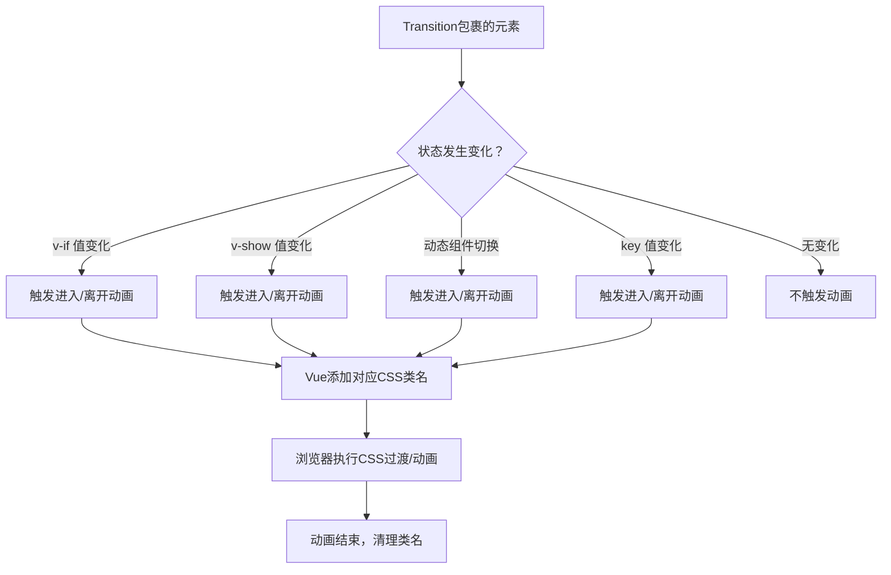
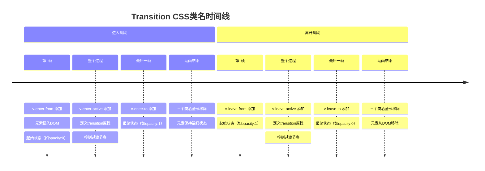

扫描[二维码](https://api2.cmdragon.cn/upload/cmder/20250304_012821924.jpg)关注或者微信搜一搜：`编程智域 前端至全栈交流与成长`

[发现1000+提升效率与开发的AI工具和实用程序](https://tools.cmdragon.cn/zh/apps?category=ai_chat)：https://tools.cmdragon.cn/zh/apps?category=ai_chat

## 一、Transition组件是啥？为啥需要它？

你有没有遇到过这种情况——页面上一个弹窗，点一下"打开"它啪地就蹦出来了，点一下"关闭"它嗖地就没了。用户看着一愣一愣的，感觉就像看PPT切幻灯片一样生硬。这体验，说实话，不太行。

Vue 3给咱们准备了一个内置组件，就叫`<Transition>`，专门干一件事：给元素或组件的"出场"和"退场"加上动画效果。有了它，弹窗可以淡入淡出，侧边栏可以滑进滑出，标签页切换可以有个过渡——总之，页面就不那么"硬切"了。

打个比方，没有Transition的时候，元素的出现和消失就像一扇门突然被踹开又突然被摔上；有了Transition，这扇门就装了自动开关，缓缓打开、轻轻关上，看着就舒服多了。

基本用法特别简单，把你想要加动画的元素用`<Transition>`包起来就行：

```vue
<template>
  <!-- 用Transition包裹需要动画的元素 -->
  <Transition>
    <!-- v-if控制元素的显示和隐藏 -->
    <div v-if="show" class="box">你好，我是有动画的元素</div>
  </Transition>
  <!-- 按钮切换显示状态 -->
  <button @click="show = !show">切换显示</button>
</template>

<script setup>
import { ref } from "vue";

// 控制元素是否显示
const show = ref(true);
</script>

<style>
/* 进入和离开的过渡效果 */
.v-enter-active,
.v-leave-active {
  transition: opacity 0.5s ease;
}

/* 进入的起始状态和离开的结束状态：透明 */
.v-enter-from,
.v-leave-to {
  opacity: 0;
}
</style>
```

就这么几行代码，元素在显示和隐藏的时候就会有0.5秒的淡入淡出效果。是不是比硬切好看多了？

有一点要注意，`<Transition>`只能包裹一个直接子元素。如果你往里面塞两个兄弟元素，Vue会直接报错。如果你有多个元素需要同时做动画，得用`<TransitionGroup>`，那是另一个组件了，咱们以后再聊。

另外，`<Transition>`本身不会渲染任何DOM元素，它就是一个逻辑容器，告诉Vue"嘿，我里面的元素在进出的时候要加动画"。最终渲染出来的DOM里，你是看不到`<Transition>`这个标签的。

## 二、Transition什么时候触发？四种情况

光知道Transition是干啥的还不够，你还得搞清楚它啥时候才会触发。不是随便什么时候都会触发动画的，只有以下四种情况，Transition才会"醒来干活"：

### 1. v-if 条件渲染

这是最常见的触发方式。当`v-if`的值从`false`变成`true`，元素"进入"，触发进入动画；从`true`变成`false`，元素"离开"，触发离开动画。

```vue
<template>
  <Transition>
    <p v-if="show">我是v-if控制的元素</p>
  </Transition>
  <button @click="show = !show">切换</button>
</template>

<script setup>
import { ref } from "vue";
const show = ref(true);
</script>
```

### 2. v-show 条件显示

`v-show`也能触发Transition。跟`v-if`的区别是，`v-if`是真正地销毁和创建DOM元素，而`v-show`只是切换`display`属性。但不管哪种方式，Transition都能感知到变化并触发动画。

```vue
<template>
  <Transition>
    <p v-show="show">我是v-show控制的元素</p>
  </Transition>
  <button @click="show = !show">切换</button>
</template>

<script setup>
import { ref } from "vue";
const show = ref(true);
</script>
```

### 3. 动态组件切换

用`<component :is="...">`切换动态组件的时候，Transition也能派上用场。组件A切到组件B，A做离开动画，B做进入动画。

```vue
<template>
  <Transition mode="out-in">
    <!-- 动态组件，根据currentComponent的值切换 -->
    <component :is="currentComponent"></component>
  </Transition>
  <button @click="toggle">切换组件</button>
</template>

<script setup>
import { ref, shallowRef } from "vue";
import CompA from "./CompA.vue";
import CompB from "./CompB.vue";

// 当前显示的组件
const currentComponent = shallowRef(CompA);

function toggle() {
  // 在CompA和CompB之间切换
  currentComponent.value = currentComponent.value === CompA ? CompB : CompA;
}
</script>
```

### 4. 改变特殊的 key 属性

这个可能很多人不知道。当你给Transition里的元素绑定一个动态的`key`，key值变化的时候，Vue会认为这是一个全新的元素，旧元素做离开动画，新元素做进入动画。

```vue
<template>
  <Transition>
    <!-- key变化时触发过渡 -->
    <div :key="count">{{ count }}</div>
  </Transition>
  <button @click="count++">加1</button>
</template>

<script setup>
import { ref } from "vue";
const count = ref(0);
</script>
```

这招在做数字翻牌动画、计数器动画的时候特别好用。

下面用一张流程图把四种触发机制串起来，看一眼就明白了：



说白了，Transition的触发逻辑就是：**它里面的元素在DOM中"来了"或"走了"，它就会给元素加上对应的CSS类名，然后浏览器根据这些类名里的样式来播放动画。** 你不需要手动去添加或删除类名，Vue全帮你干了。

## 三、6个CSS过渡类名，一个一个掰扯

这是本文的重头戏。Transition组件之所以能工作，核心就是靠这6个CSS类名。Vue会在不同的时机自动给元素添加和移除这些类名，你只要在CSS里定义好这些类名的样式，动画就出来了。

先把6个类名列出来，咱们一个一个说：

| 类名             | 什么时候出现       | 干啥的                                |
| ---------------- | ------------------ | ------------------------------------- |
| `v-enter-from`   | 进入动画的第一帧   | 定义元素进入时的起始状态              |
| `v-enter-active` | 进入动画的整个过程 | 定义进入时的transition属性或animation |
| `v-enter-to`     | 进入动画的最后一帧 | 定义元素进入后的最终状态              |
| `v-leave-from`   | 离开动画的第一帧   | 定义元素离开时的起始状态              |
| `v-leave-active` | 离开动画的整个过程 | 定义离开时的transition属性或animation |
| `v-leave-to`     | 离开动画的最后一帧 | 定义元素离开后的最终状态              |

### 进入的三个类名

想象一个演员上台表演。`v-enter-from`就是演员在幕布后面的状态——还没上台，观众看不到（比如`opacity: 0`）。`v-enter-active`就是演员从幕布后面走到舞台中间的整个过程——这个过程中你需要告诉浏览器"用0.5秒的时间，ease的节奏，慢慢走过来"（比如`transition: opacity 0.5s ease`）。`v-enter-to`就是演员站到舞台中间了——观众清清楚楚看到他（比如`opacity: 1`）。

### 离开的三个类名

同理，`v-leave-from`就是演员还在舞台上的状态——观众能看到他（比如`opacity: 1`）。`v-leave-active`就是演员从舞台中间走回幕布后面的过程——同样需要告诉浏览器过渡参数。`v-leave-to`就是演员已经退到幕布后面了——观众看不到了（比如`opacity: 0`）。

用流程图来看更直观：



### 为啥enter-active和leave-active要写transition属性？

这个问题很多人搞不明白。答案其实很简单：`v-enter-from`和`v-enter-to`只是定义了"从什么状态变到什么状态"，但浏览器怎么知道要花多长时间、用什么节奏来变？这就得靠`v-enter-active`里的`transition`属性来告诉浏览器了。

如果你只写了`v-enter-from { opacity: 0 }`和`v-enter-to { opacity: 1 }`，没写`v-enter-active { transition: opacity 0.5s }`，那元素会瞬间从透明变成不透明——跟没加动画一样。因为浏览器不知道要过渡，就直接跳到最终状态了。

来一个完整的淡入淡出示例：

```vue
<template>
  <div class="demo-container">
    <!-- Transition包裹需要动画的元素 -->
    <Transition>
      <div v-if="show" class="message-box">这是一条会淡入淡出的消息</div>
    </Transition>
    <button @click="show = !show">{{ show ? "隐藏" : "显示" }}</button>
  </div>
</template>

<script setup>
import { ref } from "vue";

// 控制消息的显示和隐藏
const show = ref(true);
</script>

<style scoped>
.demo-container {
  text-align: center;
  padding: 20px;
}

.message-box {
  padding: 20px;
  background: #42b883;
  color: white;
  border-radius: 8px;
  margin-bottom: 16px;
}

/* 进入的起始状态：完全透明 */
.v-enter-from {
  opacity: 0;
}

/* 进入过程中：定义过渡属性，0.5秒，ease缓动 */
.v-enter-active {
  transition: opacity 0.5s ease;
}

/* 进入的结束状态：完全不透明 */
.v-enter-to {
  opacity: 1;
}

/* 离开的起始状态：完全不透明 */
.v-leave-from {
  opacity: 1;
}

/* 离开过程中：定义过渡属性，0.5秒，ease缓动 */
.v-leave-active {
  transition: opacity 0.5s ease;
}

/* 离开的结束状态：完全透明 */
.v-leave-to {
  opacity: 0;
}
</style>
```

这里有个小细节：`v-enter-to`和`v-leave-from`其实可以不写，因为元素正常状态就是`opacity: 1`，Vue会自动用元素的默认样式作为这两个状态。但写上也没错，有时候为了代码可读性，写上反而更清晰。

再来看一个滑动+淡入的例子，让你感受一下6个类名搭配使用的威力：

```vue
<template>
  <div class="slide-demo">
    <Transition>
      <div v-if="show" class="slide-box">我会从左边滑进来，再滑出去</div>
    </Transition>
    <button @click="show = !show">切换</button>
  </div>
</template>

<script setup>
import { ref } from "vue";
const show = ref(true);
</script>

<style scoped>
.slide-demo {
  padding: 20px;
  overflow: hidden;
}

.slide-box {
  padding: 20px;
  background: #35495e;
  color: white;
  border-radius: 8px;
  margin-bottom: 16px;
}

/* 进入起始：透明 + 向左偏移30px */
.v-enter-from {
  opacity: 0;
  transform: translateX(-30px);
}

/* 进入过程：同时过渡opacity和transform */
.v-enter-active {
  transition: all 0.5s ease;
}

/* 进入结束：不透明 + 原位 */
.v-enter-to {
  opacity: 1;
  transform: translateX(0);
}

/* 离开起始：不透明 + 原位 */
.v-leave-from {
  opacity: 1;
  transform: translateX(0);
}

/* 离开过程：同时过渡opacity和transform */
.v-leave-active {
  transition: all 0.5s ease;
}

/* 离开结束：透明 + 向右偏移30px */
.v-leave-to {
  opacity: 0;
  transform: translateX(30px);
}
</style>
```

看到了吧？`transform`和`opacity`可以同时过渡，`transition: all 0.5s ease`就搞定了。元素进来的时候从左边滑入，出去的时候往右边滑出，非常有方向感。

## 四、命名过渡——给Transition取个名字

前面咱们用的类名都是`v-`开头的，比如`v-enter-from`、`v-leave-active`。但你想啊，一个页面上如果有好几个Transition，都用`v-`开头的类名，那CSS不就打架了？你给A元素写的过渡样式，B元素也用上了，这哪行啊。

所以Vue给Transition提供了一个`name`属性，让你给它取个名字。取了名字之后，类名前缀就从`v-`变成你取的名字加横杠。

比如`<Transition name="fade">`，那6个类名就变成了：

- `fade-enter-from`
- `fade-enter-active`
- `fade-enter-to`
- `fade-leave-from`
- `fade-leave-active`
- `fade-leave-to`

这样一来，每个Transition的样式就互不干扰了。来看个实际例子，页面上同时有淡入淡出和滑动两种动画：

```vue
<template>
  <div class="named-demo">
    <!-- 淡入淡出的Transition，name设为fade -->
    <Transition name="fade">
      <div v-if="showFade" class="box fade-box">我是淡入淡出的</div>
    </Transition>
    <button @click="showFade = !showFade">淡入淡出切换</button>

    <!-- 滑动的Transition，name设为slide -->
    <Transition name="slide">
      <div v-if="showSlide" class="box slide-box">我是滑进滑出的</div>
    </Transition>
    <button @click="showSlide = !showSlide">滑动切换</button>
  </div>
</template>

<script setup>
import { ref } from "vue";

// 分别控制两种动画的显示状态
const showFade = ref(true);
const showSlide = ref(true);
</script>

<style scoped>
.named-demo {
  padding: 20px;
}

.box {
  padding: 16px;
  border-radius: 8px;
  margin-bottom: 12px;
  color: white;
}

.fade-box {
  background: #42b883;
}

.slide-box {
  background: #35495e;
}

/* fade命名过渡的样式 */
.fade-enter-from {
  opacity: 0;
}
.fade-enter-active {
  transition: opacity 0.4s ease;
}
.fade-enter-to {
  opacity: 1;
}
.fade-leave-from {
  opacity: 1;
}
.fade-leave-active {
  transition: opacity 0.4s ease;
}
.fade-leave-to {
  opacity: 0;
}

/* slide命名过渡的样式 */
.slide-enter-from {
  opacity: 0;
  transform: translateY(-20px);
}
.slide-enter-active {
  transition: all 0.4s ease;
}
.slide-enter-to {
  opacity: 1;
  transform: translateY(0);
}
.slide-leave-from {
  opacity: 1;
  transform: translateY(0);
}
.slide-leave-active {
  transition: all 0.4s ease;
}
.slide-leave-to {
  opacity: 0;
  transform: translateY(20px);
}
</style>
```

你看，`fade-`开头的类名管淡入淡出，`slide-`开头的类名管滑动，互不干扰，清清爽爽。

如果你不给Transition设name，那默认就是`v-`前缀。所以前面那些例子里的`v-enter-from`之类的，其实都是"匿名过渡"。实际项目中，养成给Transition取名字的习惯，代码可读性和可维护性都会好很多。

还有一点，如果你用了`scoped`样式，那类名必须跟Transition的name对应上，不然样式不生效。这个坑很多人踩过——明明CSS写了，动画就是不出来，排查半天发现是类名前缀没对上。

## 五、CSS transition和CSS animation有啥区别？

到目前为止，咱们用的都是CSS `transition`属性来做过渡。但其实Transition组件还支持另一种方式：CSS `animation`。这两种方式都能实现动画效果，但原理和写法不太一样。

### CSS transition方式

这就是咱们前面一直在用的方式。核心思路是：定义起始状态和结束状态，然后用`transition`属性告诉浏览器"用多长时间、什么节奏来过渡"。

特点：

- 需要触发条件（类名的添加和移除就是触发条件）
- 只能定义从A状态到B状态的过渡
- 写法上需要用到`v-enter-from`、`v-enter-to`、`v-leave-from`、`v-leave-to`这四个类名

### CSS animation方式

用`@keyframes`定义关键帧动画，然后在`v-enter-active`和`v-leave-active`里引用这个动画。

特点：

- 动画定义好后可以自动播放，不需要触发
- 可以定义多个关键帧，实现更复杂的动画
- 写法上只需要`v-enter-active`和`v-leave-active`两个类名就够了，因为动画本身已经包含了起始和结束状态

来对比一下两种写法：

```vue
<template>
  <div class="compare-demo">
    <h3>transition方式</h3>
    <Transition name="trans-fade">
      <div v-if="show1" class="box">transition淡入淡出</div>
    </Transition>
    <button @click="show1 = !show1">切换</button>

    <h3>animation方式</h3>
    <Transition name="anim-bounce">
      <div v-if="show2" class="box">animation弹跳效果</div>
    </Transition>
    <button @click="show2 = !show2">切换</button>
  </div>
</template>

<script setup>
import { ref } from "vue";

const show1 = ref(true);
const show2 = ref(true);
</script>

<style scoped>
.compare-demo {
  padding: 20px;
}

.box {
  padding: 16px;
  background: #42b883;
  color: white;
  border-radius: 8px;
  margin-bottom: 12px;
}

/* ========== transition方式 ========== */
/* 需要定义from和to状态，加上active的transition属性 */
.trans-fade-enter-from {
  opacity: 0;
}
.trans-fade-enter-active {
  transition: opacity 0.5s ease;
}
.trans-fade-enter-to {
  opacity: 1;
}
.trans-fade-leave-from {
  opacity: 1;
}
.trans-fade-leave-active {
  transition: opacity 0.5s ease;
}
.trans-fade-leave-to {
  opacity: 0;
}

/* ========== animation方式 ========== */
/* 定义进入动画的关键帧 */
@keyframes bounce-in {
  0% {
    transform: scale(0.5);
    opacity: 0;
  }
  50% {
    transform: scale(1.1);
  }
  100% {
    transform: scale(1);
    opacity: 1;
  }
}

/* 定义离开动画的关键帧 */
@keyframes bounce-out {
  0% {
    transform: scale(1);
    opacity: 1;
  }
  50% {
    transform: scale(1.1);
  }
  100% {
    transform: scale(0.5);
    opacity: 0;
  }
}

/* animation方式只需要写active类名 */
.anim-bounce-enter-active {
  animation: bounce-in 0.5s ease;
}
.anim-bounce-leave-active {
  animation: bounce-out 0.5s ease;
}
</style>
```

看到区别了吧？animation方式里，`@keyframes`已经把0%、50%、100%的状态都定义好了，所以不需要再单独写`enter-from`、`enter-to`这些类名。Vue在进入时给元素加上`anim-bounce-enter-active`类，浏览器就会自动播放`bounce-in`动画；离开时加上`anim-bounce-leave-active`类，播放`bounce-out`动画。

那什么时候用transition，什么时候用animation呢？简单来说：

- **简单的A到B的状态变化**（比如淡入淡出、滑动），用transition就够了，代码少，好理解
- **需要多关键帧、复杂路径的动画**（比如弹跳、摇摆、旋转多圈），用animation更合适，表达能力更强

两种方式也可以混用，比如进入用animation做一个弹跳效果，离开用transition做一个简单的淡出。Transition组件不挑食，只要你写的CSS类名对得上，它都能识别。

## 课后 Quiz

### 问题1：Transition组件的6个CSS类名中，哪个类名是必须写的？为什么？

**答案解析：**

6个类名中没有哪个是"绝对必须"写的，但`v-enter-active`和`v-leave-active`是最关键的。因为这两个类名负责定义`transition`属性（或`animation`属性），告诉浏览器过渡的时长和节奏。如果你只写了`v-enter-from`和`v-enter-to`但没写`v-enter-active`，浏览器不知道要过渡，会直接跳到最终状态，动画效果就没了。

如果用的是CSS animation方式，那只需要`v-enter-active`和`v-leave-active`就够了，因为`@keyframes`里已经包含了起始和结束状态。

### 问题2：`<Transition name="slide">`对应的CSS类名前缀是什么？如果不设name属性呢？

**答案解析：**

设了`name="slide"`之后，6个类名前缀就变成了`slide-`，比如`slide-enter-from`、`slide-leave-active`等。如果不设name属性，默认前缀是`v-`，对应的类名就是`v-enter-from`、`v-leave-active`等。

命名过渡的核心作用就是让同一个页面上多个Transition组件的样式互不干扰。实际开发中，强烈建议给每个Transition都取个有意义的名字。

### 问题3：v-if和v-show都能触发Transition，它们在触发机制上有啥区别？

**答案解析：**

- `v-if`是真正的条件渲染，当值为`false`时，元素会从DOM中移除；值为`true`时，元素会重新创建并插入DOM。所以Transition的进入动画发生在元素插入DOM时，离开动画发生在元素从DOM移除前。
- `v-show`只是切换CSS的`display`属性，元素始终在DOM中。当`display`从`none`变成其他值时触发进入动画，从其他值变成`none`时触发离开动画。

实际选择时，如果元素切换频繁且需要保留状态，用`v-show`更合适；如果元素很大、切换不频繁，用`v-if`更省性能。两种方式Transition都能正常工作。

## 常见报错解决方案

### 报错1：`<Transition> can only have one child element`

**原因分析：** 你在`<Transition>`里放了多个兄弟元素。Transition组件只允许有一个直接子元素，多了它不知道该给谁加动画。

**解决方案：** 用一个容器元素把多个元素包起来，或者改用`<TransitionGroup>`。

```vue
<!-- 错误写法 -->
<Transition>
  <div>元素1</div>
  <div>元素2</div>
</Transition>

<!-- 正确写法1：用容器包裹 -->
<Transition>
  <div>
    <div>元素1</div>
    <div>元素2</div>
  </div>
</Transition>

<!-- 正确写法2：用TransitionGroup -->
<TransitionGroup>
  <div>元素1</div>
  <div>元素2</div>
</TransitionGroup>
```

### 报错2：动画完全不生效，元素瞬间出现/消失

**原因分析：** 最常见的原因是CSS类名没写对。比如Transition设了`name="fade"`，但CSS里写的还是`v-enter-from`而不是`fade-enter-from`。或者用了`scoped`样式但类名前缀不匹配。

**解决方案：** 检查CSS类名前缀是否跟Transition的name属性一致。如果没设name，前缀就是`v-`；如果设了`name="fade"`，前缀必须是`fade-`。

```vue
<!-- 如果name是fade -->
<Transition name="fade">
  <div v-if="show">内容</div>
</Transition>

<!-- CSS类名必须是fade-开头 -->
<style scoped>
/* 错误：用了v-前缀 */
.v-enter-active {
  transition: opacity 0.5s;
}

/* 正确：用fade-前缀 */
.fade-enter-active {
  transition: opacity 0.5s;
}
</style>
```

另外一个常见原因是忘了写`v-enter-active`或`v-leave-active`里的`transition`属性。没有这个属性，浏览器不会做过渡，元素会直接跳到最终状态。

### 报错3：离开动画还没播完，元素就消失了

**原因分析：** 你可能用了`v-if`，但CSS里的离开过渡时长跟`v-leave-active`里定义的不一致。或者你同时用了JavaScript钩子和CSS过渡，导致冲突。

**解决方案：** 确保离开动画的时长足够。Vue会自动检测CSS过渡的时长来决定什么时候移除DOM元素，但如果你的`transition-duration`设得太短（比如0.1s），动画看起来就像没有一样。

```css
/* 确保过渡时长合理 */
.v-leave-active {
  transition: all 0.5s ease; /* 不要设太短 */
}
```

如果你需要更精确地控制时长，可以用`duration`属性：

```vue
<!-- 显式指定过渡时长为500ms -->
<Transition :duration="500">
  <div v-if="show">内容</div>
</Transition>

<!-- 也可以分别指定进入和离开的时长 -->
<Transition :duration="{ enter: 500, leave: 300 }">
  <div v-if="show">内容</div>
</Transition>
```

参考链接：https://vuejs.org/guide/built-ins/transition.html

余下文章内容请点击跳转至 个人博客页面 或者 扫描[二维码](https://api2.cmdragon.cn/upload/cmder/20250304_012821924.jpg)关注或者微信搜一搜：`编程智域 前端至全栈交流与成长`，阅读完整的文章：[Vue的Transition组件到底能干啥？6个CSS类名帮你搞定进出动画](https://blog.cmdragon.cn/posts/a7b8c9d0e1f2a3b4c5d6e7f8a9b0c1d2/)

<details>
<summary>往期文章归档</summary>

- [Vue 3 静态与动态 Props 如何传递？TypeScript 类型约束有何必要？](https://blog.cmdragon.cn/posts/94ab48753b64780ca3ab7a7115ae8522/)
- [Vue 3中组件局部注册的优势与实现方式如何？](https://blog.cmdragon.cn/posts/dbf576e744870f6de26fd8a2e03e47da/)
- [如何在Vue3中优化生命周期钩子性能并规避常见陷阱？](https://blog.cmdragon.cn/posts/12d98b3b9ccd6c19a1b169d720ac5c80/)
- [Vue 3 Composition API生命周期钩子：如何实现从基础理解到高阶复用？](https://blog.cmdragon.cn/posts/8884e2b70287fcb263c57648eeb27419/)
- [Vue 3生命周期钩子实战指南：如何正确选择onMounted、onUpdated与onUnmounted的应用场景？](https://blog.cmdragon.cn/posts/883c6dbc50ae4183770a4462e0b8ae4d/)
- [Vue 3中生命周期钩子与响应式系统如何实现协同工作？](https://blog.cmdragon.cn/posts/70dad360ffa9dce14d0d69611b8cb019/)
- [Vue 3组件生命周期钩子的执行顺序与使用场景是什么？](https://blog.cmdragon.cn/posts/db44294a78dc9f666f67b053f6c83567/)
- [Vue组件全局注册与局部注册如何抉择？](https://blog.cmdragon.cn/posts/43ead630ea17da65d99ad2eb8188e472/)
- [Vue3组件化开发中，Props与Emits如何实现数据流转与事件协作？](https://blog.cmdragon.cn/posts/8cff7d2df113da66ea7be560c4d1d22a/)
- [Vue 3模板引用如何与其他特性协同实现复杂交互？](https://blog.cmdragon.cn/posts/331bf75d114ab09116eadfcdca602b58/)
- [Vue 3 v-for中模板引用如何实现高效管理与动态控制？](https://blog.cmdragon.cn/posts/cb380897ddc3578b180ecf8843c774c1/)
- [Vue 3的defineExpose：如何突破script setup组件默认封装，实现精准的父子通讯？](https://blog.cmdragon.cn/posts/202ae0f4acde7128e0e31baf63732fb5/)
- [Vue 3模板引用的生命周期时机如何把握？常见陷阱该如何避免？](https://blog.cmdragon.cn/posts/7d2a0f6555ecbe92afd7d2491c427463/)
- [Vue 3模板引用如何实现父组件与子组件的高效交互？](https://blog.cmdragon.cn/posts/3fb7bdd84128b7efaaa1c979e1f28dee/)
- [Vue中为何需要模板引用？又如何高效实现DOM与组件实例的直接访问？](https://blog.cmdragon.cn/posts/23f3464ba16c7054b4783cded50c04c6/)

</details>

<details>
<summary>免费好用的热门在线工具</summary>

- [多直播聚合器 - 应用商店 | By cmdragon](https://tools.cmdragon.cn/zh/apps/multi-live-aggregator)
- [Proto文件生成器 - 应用商店 | By cmdragon](https://tools.cmdragon.cn/zh/apps/proto-file-generator)
- [图片转粒子 - 应用商店 | By cmdragon](https://tools.cmdragon.cn/zh/apps/image-to-particles)
- [视频下载器 - 应用商店 | By cmdragon](https://tools.cmdragon.cn/zh/apps/video-downloader)
- [文件格式转换器 - 应用商店 | By cmdragon](https://tools.cmdragon.cn/zh/apps/file-converter)
- [M3U8在线播放器 - 应用商店 | By cmdragon](https://tools.cmdragon.cn/zh/apps/m3u8-player)
- [快图设计 - 应用商店 | By cmdragon](https://tools.cmdragon.cn/zh/apps/quick-image-design)
- [高级文字转图片转换器 - 应用商店 | By cmdragon](https://tools.cmdragon.cn/zh/apps/text-to-image-advanced)
- [RAID 计算器 - 应用商店 | By cmdragon](https://tools.cmdragon.cn/zh/apps/raid-calculator)
- [在线PS - 应用商店 | By cmdragon](https://tools.cmdragon.cn/zh/apps/photoshop-online)
- [Mermaid 在线编辑器 - 应用商店 | By cmdragon](https://tools.cmdragon.cn/zh/apps/mermaid-live-editor)
- [数学求解计算器 - 应用商店 | By cmdragon](https://tools.cmdragon.cn/zh/apps/math-solver-calculator)
- [智能提词器 - 应用商店 | By cmdragon](https://tools.cmdragon.cn/zh/apps/smart-teleprompter)
- [魔法简历 - 应用商店 | By cmdragon](https://tools.cmdragon.cn/zh/apps/magic-resume)
- [Image Puzzle Tool - 图片拼图工具 | By cmdragon](https://tools.cmdragon.cn/zh/apps/image-puzzle-tool)
- [字幕下载工具 - 应用商店 | By cmdragon](https://tools.cmdragon.cn/zh/apps/subtitle-downloader)
- [歌词生成工具 - 应用商店 | By cmdragon](https://tools.cmdragon.cn/zh/apps/lyrics-generator)
- [网盘资源聚合搜索 - 应用商店 | By cmdragon](https://tools.cmdragon.cn/zh/apps/cloud-drive-search)
- [ASCII字符画生成器 - 应用商店 | By cmdragon](https://tools.cmdragon.cn/zh/apps/ascii-art-generator)
- [JSON Web Tokens 工具 - 应用商店 | By cmdragon](https://tools.cmdragon.cn/zh/apps/jwt-tool)
- [Bcrypt 密码工具 - 应用商店 | By cmdragon](https://tools.cmdragon.cn/zh/apps/bcrypt-tool)
- [GIF 合成器 - 应用商店 | By cmdragon](https://tools.cmdragon.cn/zh/apps/gif-composer)
- [GIF 分解器 - 应用商店 | By cmdragon](https://tools.cmdragon.cn/zh/apps/gif-decomposer)
- [文本隐写术 - 应用商店 | By cmdragon](https://tools.cmdragon.cn/zh/apps/text-steganography)
- [CMDragon 在线工具 - 高级AI工具箱与开发者套件 | 免费好用的在线工具](https://tools.cmdragon.cn/zh)
- [应用商店 - 发现1000+提升效率与开发的AI工具和实用程序 | 免费好用的在线工具](https://tools.cmdragon.cn/zh/apps?category=trending)
- [CMDragon 更新日志 - 最新更新、功能与改进 | 免费好用的在线工具](https://tools.cmdragon.cn/zh/changelog)
- [支持我们 - 成为赞助者 | 免费好用的在线工具](https://tools.cmdragon.cn/zh/sponsor)
- [AI文本生成图像 - 应用商店 | 免费好用的在线工具](https://tools.cmdragon.cn/zh/apps/text-to-image-ai)
- [临时邮箱 - 应用商店 | 免费好用的在线工具](https://tools.cmdragon.cn/zh/apps/temp-email)
- [二维码解析器 - 应用商店 | 免费好用的在线工具](https://tools.cmdragon.cn/zh/apps/qrcode-parser)
- [文本转思维导图 - 应用商店 | 免费好用的在线工具](https://tools.cmdragon.cn/zh/apps/text-to-mindmap)
- [正则表达式可视化工具 - 应用商店 | 免费好用的在线工具](https://tools.cmdragon.cn/zh/apps/regex-visualizer)
- [文件隐写工具 - 应用商店 | 免费好用的在线工具](https://tools.cmdragon.cn/zh/apps/steganography-tool)
- [IPTV 频道探索器 - 应用商店 | 免费好用的在线工具](https://tools.cmdragon.cn/zh/apps/iptv-explorer)
- [快传 - 应用商店 | By cmdragon](https://tools.cmdragon.cn/zh/apps/snapdrop)
- [随机抽奖工具 - 应用商店 | 免费好用的在线工具](https://tools.cmdragon.cn/zh/apps/lucky-draw)
- [动漫场景查找器 - 应用商店 | 免费好用的在线工具](https://tools.cmdragon.cn/zh/apps/anime-scene-finder)
- [时间工具箱 - 应用商店 | 免费好用的在线工具](https://tools.cmdragon.cn/zh/apps/time-toolkit)
- [网速测试 - 应用商店 | 免费好用的在线工具](https://tools.cmdragon.cn/zh/apps/speed-test)
- [AI 智能抠图工具 - 应用商店 | 免费好用的在线工具](https://tools.cmdragon.cn/zh/apps/background-remover)
- [背景替换工具 - 应用商店 | 免费好用的在线工具](https://tools.cmdragon.cn/zh/apps/background-replacer)
- [艺术二维码生成器 - 应用商店 | 免费好用的在线工具](https://tools.cmdragon.cn/zh/apps/artistic-qrcode)
- [Open Graph 元标签生成器 - 应用商店 | 免费好用的在线工具](https://tools.cmdragon.cn/zh/apps/open-graph-generator)
- [图像对比工具 - 应用商店 | 免费好用的在线工具](https://tools.cmdragon.cn/zh/apps/image-comparison)
- [图片压缩专业版 - 应用商店 | 免费好用的在线工具](https://tools.cmdragon.cn/zh/apps/image-compressor)
- [密码生成器 - 应用商店 | 免费好用的在线工具](https://tools.cmdragon.cn/zh/apps/password-generator)
- [SVG优化器 - 应用商店 | 免费好用的在线工具](https://tools.cmdragon.cn/zh/apps/svg-optimizer)
- [调色板生成器 - 应用商店 | 免费好用的在线工具](https://tools.cmdragon.cn/zh/apps/color-palette)
- [在线节拍器 - 应用商店 | 免费好用的在线工具](https://tools.cmdragon.cn/zh/apps/online-metronome)
- [IP归属地查询 - 应用商店 | By cmdragon](https://tools.cmdragon.cn/zh/apps/ip-geolocation)
- [CSS网格布局生成器 - 应用商店 | 免费好用的在线工具](https://tools.cmdragon.cn/zh/apps/css-grid-layout)
- [邮箱验证工具 - 应用商店 | 免费好用的在线工具](https://tools.cmdragon.cn/zh/apps/email-validator)
- [书法练习字帖 - 应用商店 | 免费好用的在线工具](https://tools.cmdragon.cn/zh/apps/calligraphy-practice)
- [金融计算器套件 - 应用商店 | 免费好用的在线工具](https://tools.cmdragon.cn/zh/apps/finance-calculator-suite)
- [中国亲戚关系计算器 - 应用商店 | 免费好用的在线工具](https://tools.cmdragon.cn/zh/apps/chinese-kinship-calculator)
- [Protocol Buffer 工具箱 - 应用商店 | 免费好用的在线工具](https://tools.cmdragon.cn/zh/apps/protobuf-toolkit)
- [IP归属地查询 - 应用商店 | 免费好用的在线工具](https://tools.cmdragon.cn/zh/apps/ip-geolocation)
- [图片无损放大 - 应用商店 | 免费好用的在线工具](https://tools.cmdragon.cn/zh/apps/image-upscaler)
- [文本比较工具 - 应用商店 | 免费好用的在线工具](https://tools.cmdragon.cn/zh/apps/text-compare)
- [IP批量查询工具 - 应用商店 | 免费好用的在线工具](https://tools.cmdragon.cn/zh/apps/ip-batch-lookup)
- [域名查询工具 - 应用商店 | 免费好用的在线工具](https://tools.cmdragon.cn/zh/apps/domain-finder)
- [DNS工具箱 - 应用商店 | 免费好用的在线工具](https://tools.cmdragon.cn/zh/apps/dns-toolkit)
- [网站图标生成器 - 应用商店 | 免费好用的在线工具](https://tools.cmdragon.cn/zh/apps/favicon-generator)
- [XML Sitemap](https://tools.cmdragon.cn/sitemap_index.xml)

</details>
